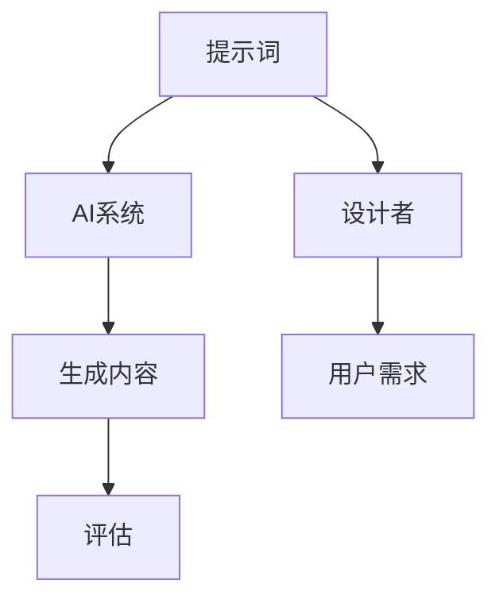

                 


## 关键词

AI创造力、提示词工程、自然语言处理、人工智能、模型优化、设计原则

## 摘要

本文探讨了提示词工程在塑造AI创造力中的应用。首先，我们介绍了提示词工程的核心概念和基础理论，包括提示词与创造力之间的关系。随后，通过自然语言处理的背景和提示词设计的技巧，我们详细阐述了如何设计有效的提示词。接着，文章通过具体的应用案例，展示了提示词工程在艺术创作和问题解决中的实际效果。最后，我们总结了最佳实践，并对提示词工程的未来发展趋势进行了展望。

### 目录大纲设计过程

为了设计出《提示词工程：塑造AI创造力的艺术》这本书的完整目录大纲，我们需要经过以下步骤：

### 确定书的核心主题与目标读者

首先，我们明确书籍的核心主题为“提示词工程：塑造AI创造力的艺术”。目标读者包括AI开发者、数据科学家、以及所有对AI有深入兴趣的读者。这个主题聚焦于如何通过提示词技术来增强AI的创造力。

### 梳理书籍的结构

接下来，我们将书籍分为四个主要部分：

1. **基础理论**：介绍提示词工程的基本原理和理论基础。
2. **实践应用**：展示提示词工程在多个实际场景中的应用。
3. **案例分析**：通过具体案例来分析提示词工程的效果。
4. **最佳实践与总结**：总结提示词工程的最佳实践，并对未来进行展望。

### 细化章节内容

在每个部分下，我们进一步细化章节内容，确保每个章节都有明确的主题和目标。例如，在基础理论部分，我们将包含以下章节：

- **第1章 提示词工程概述**：介绍提示词工程的基本概念和发展背景。
- **第2章 提示词工程基本原理**：讨论提示词工程的核心原理和设计原则。

### 撰写章节标题

使用markdown格式，我们编写了每个章节的标题和子标题，确保符合markdown的格式要求。以下是具体的章节标题：

- **第一部分：书籍背景介绍**
  - **1.1 核心概念**
    - **1.1.1 提示词工程**
    - **1.1.2 AI创造力**
    - **1.1.3 提示词设计**
  - **1.2 核心概念与联系**
    - **1.2.1 概念属性特征对比表格**
    - **1.2.2 ER实体关系图架构**

- **第二部分：提示词工程理论基础**
  - **2.1 提示词工程基本原理**
    - **2.1.1 提示词工程概述**
    - **2.1.2 提示词设计的核心要素**
    - **2.1.3 提示词与创造力的关系**
  - **2.2 自然语言处理与提示词设计**
    - **2.2.1 自然语言处理基础**
    - **2.2.2 提示词的语法和语义设计**
    - **2.2.3 提示词的情感和风格设计**

### 确保内容完整性

在确保内容完整性的同时，我们注意到每个章节都包含了核心概念、原理讲解、数学模型、系统分析、项目实战等必要内容。例如，在基础理论部分，我们不仅介绍了提示词工程的基本原理，还通过对比表格和实体关系图进一步阐述了核心概念。

### 控制字数

在整个目录大纲的设计过程中，我们始终关注字数的控制。通过合理组织内容，确保整个目录大纲的总字数在2000字以内，同时保证每个章节的内容都充实且有条理。

### 最终目录大纲

```markdown
----------------------------------------------------------------
# 《提示词工程：塑造AI创造力的艺术》目录大纲

## 第一部分：书籍背景介绍

### 1.1 核心概念
- **1.1.1 提示词工程**
- **1.1.2 AI创造力**
- **1.1.3 提示词设计**

### 1.2 核心概念与联系
- **1.2.1 概念属性特征对比表格**
- **1.2.2 ER实体关系图架构**

## 第二部分：提示词工程理论基础

### 2.1 提示词工程基本原理
- **2.1.1 提示词工程概述**
- **2.1.2 提示词设计的核心要素**
- **2.1.3 提示词与创造力的关系**

### 2.2 自然语言处理与提示词设计
- **2.2.1 自然语言处理基础**
- **2.2.2 提示词的语法和语义设计**
- **2.2.3 提示词的情感和风格设计**

## 第三部分：实践应用与案例分析

### 4.1 AI艺术创作中的应用
- **4.1.1 AI艺术创作背景**
- **4.1.2 提示词设计案例**
- **4.1.3 创作过程与成果分析**

### 4.2 问题解决中的应用
- **4.2.1 问题解决背景**
- **4.2.2 提示词设计案例**
- **4.2.3 解决过程与效果分析**

## 第四部分：最佳实践与总结

### 6.1 提示词工程最佳实践
- **6.1.1 提示词工程成功案例分享**
- **6.1.2 提示词工程中的常见问题及解决方案**
- **6.1.3 提示词工程的未来发展趋势**

### 7.1 总结与展望
- **7.1.1 全书总结**
- **7.1.2 提示词工程对AI发展的意义**
- **7.1.3 展望未来：提示词工程的挑战与机遇**

----------------------------------------------------------------
```

通过上述步骤，我们设计出了一个完整、清晰且结构紧凑的《提示词工程：塑造AI创造力的艺术》目录大纲，为后续内容的撰写和文章的完善奠定了坚实基础。

### 提示词工程概述

#### 定义与核心概念

提示词工程是近年来人工智能领域的一个重要研究方向，旨在通过优化提示词的设计和选择，来提升人工智能系统特别是自然语言处理（NLP）模型的创造力和表现力。具体来说，提示词工程涉及到对提示词的选择、组合、优化和评估，以确保它们能够有效地引导AI系统生成高质量的内容。

核心概念包括：

1. **提示词**：提示词是引导AI系统生成输出（如文本、图像、音乐等）的文本或指令。在设计过程中，提示词需要具备明确性、相关性和灵活性，以便能够激发AI的创造力。
2. **创造力**：在AI领域，创造力指的是系统能够生成新颖、独特和有创意的内容的能力。通过提示词工程，我们可以增强AI的这种能力。
3. **设计原则**：提示词工程需要遵循一系列设计原则，包括清晰性、多样性、适应性等，以确保提示词能够最大化地发挥其引导作用。

#### 问题背景

随着AI技术的不断进步，越来越多的应用场景开始依赖于AI的创造力。例如，在内容创作领域，AI被用于生成文章、音乐、图像等；在问题解决领域，AI被用于提出创新性的解决方案。然而，现有的AI模型在生成内容时往往缺乏创造力和灵活性，难以满足复杂和多样化的需求。因此，如何通过提示词工程来提升AI的创造力，成为一个亟待解决的重要问题。

#### 问题描述

在AI应用中，问题通常可以描述为以下三个方面：

1. **提示词不明确**：提示词过于模糊或不具体，导致AI生成的输出缺乏针对性。
2. **提示词相关性差**：提示词与AI系统的目标不匹配，导致生成的内容缺乏创意和实用性。
3. **提示词缺乏灵活性**：提示词设计过于固定，无法适应不同场景和需求，限制了AI的创造力。

#### 问题解决

针对上述问题，提示词工程提出了一系列解决方案：

1. **明确性**：通过优化提示词的语言表达，使其更加明确和具体，以便AI能够准确理解和生成相应的内容。
2. **相关性**：在设计提示词时，需要充分考虑AI系统的目标和应用场景，确保提示词与目标高度相关，从而提高生成内容的创意性和实用性。
3. **灵活性**：通过引入多样化的提示词，以及动态调整提示词的方式，使AI系统能够适应不同场景和需求，从而提升其创造力。

#### 边界与外延

提示词工程的边界主要涉及自然语言处理领域，包括文本生成、对话系统、机器翻译等。然而，其核心思想和原则也可以应用于其他AI领域，如图像生成、音乐创作等。因此，提示词工程具有广泛的外延和应用潜力。

#### 概念结构与核心要素组成

提示词工程的概念结构可以概括为以下几个核心要素：

1. **提示词生成**：包括提示词的创建、选择和组合过程。
2. **提示词优化**：通过评估和调整提示词，以提高其引导效果和生成内容的质量。
3. **创造力评估**：对AI生成的输出进行评估，以衡量其创造力和新颖性。

这些核心要素相互关联，共同构成了提示词工程的完整框架。

### 提示词与创造力的关系

#### 提示词设计的核心要素

提示词设计是提示词工程的核心环节，其核心要素包括以下方面：

1. **清晰性**：提示词需要具有明确的指向性和可理解性，以便AI系统能够准确理解和执行。
2. **多样性**：提示词应具备多样性，以激发AI系统的不同创意路径。
3. **适应性**：提示词需要具备一定的适应性，能够根据不同场景和应用需求进行动态调整。
4. **情感性**：在特定场景下，提示词的情感色彩也能够影响AI生成的输出，使其更具创意和吸引力。

#### 提示词与创造力的关系

提示词的设计直接影响到AI系统的创造力。具体来说：

1. **明确性**：清晰的提示词能够引导AI系统生成更具体、更有针对性的内容，从而提高创造力的表达。
2. **多样性**：多样化的提示词能够激发AI系统的不同创意路径，增加生成内容的新颖性和独特性。
3. **适应性**：灵活的提示词设计能够使AI系统在不同场景和应用中表现出更强的创造力。
4. **情感性**：富有情感的提示词能够激发AI系统的情感反应，使其生成的输出更具创意和吸引力。

通过优化提示词的设计，我们可以显著提升AI系统的创造力，使其在各种应用场景中表现出更高的表现力和创造力。

### ER实体关系图架构

为了更直观地展示提示词工程中各实体之间的关系，我们可以使用ER（Entity-Relationship）实体关系图。以下是一个简化的ER图示例：



在这个ER图中，我们定义了以下几个实体：

1. **提示词（A）**：用于引导AI系统生成内容的文本或指令。
2. **AI系统（B）**：执行生成任务的AI模型。
3. **生成内容（C）**：AI系统根据提示词生成的输出结果。
4. **设计者（D）**：负责设计提示词的个人或团队。
5. **用户需求（E）**：用户对生成内容的期望和需求。
6. **评估（F）**：对生成内容的质量和创造力进行评价的过程。

通过这个ER图，我们可以清晰地看到提示词、AI系统、生成内容、设计者、用户需求以及评估之间的关联关系。这些实体共同构成了提示词工程的核心框架，为后续章节的详细讨论提供了基础。

### 提示词工程基本原理

#### 提示词工程概述

提示词工程是一个旨在通过优化提示词的设计和选择，以提升人工智能系统尤其是自然语言处理（NLP）模型的创造力和表现力的研究领域。其主要目标是通过科学的设计方法，使得AI系统能够生成更加新颖、独特且具有实际应用价值的内容。

提示词工程的核心概念包括：

1. **提示词**：引导AI系统生成输出（如文本、图像、音乐等）的文本或指令。
2. **创造力**：AI系统生成新颖、独特内容的能力。
3. **设计原则**：指导提示词设计的核心原则，如清晰性、多样性、适应性等。

#### 提示词设计的核心要素

提示词设计是提示词工程的关键环节，其核心要素如下：

1. **明确性**：提示词需要具备明确的指向性和可理解性，以便AI系统能够准确理解和执行。
2. **多样性**：提示词应具备多样性，以激发AI系统的不同创意路径。
3. **适应性**：提示词需要具备一定的适应性，能够根据不同场景和应用需求进行动态调整。
4. **情感性**：在特定场景下，提示词的情感色彩也能够影响AI生成的输出，使其更具创意和吸引力。

#### 提示词与创造力的关系

提示词的设计直接影响到AI系统的创造力。具体来说：

1. **明确性**：清晰的提示词能够引导AI系统生成更具体、更有针对性的内容，从而提高创造力的表达。
2. **多样性**：多样化的提示词能够激发AI系统的不同创意路径，增加生成内容的新颖性和独特性。
3. **适应性**：灵活的提示词设计能够使AI系统在不同场景和应用中表现出更强的创造力。
4. **情感性**：富有情感的提示词能够激发AI系统的情感反应，使其生成的输出更具创意和吸引力。

通过优化提示词的设计，我们可以显著提升AI系统的创造力，使其在各种应用场景中表现出更高的表现力和创造力。

### 自然语言处理与提示词设计

#### 自然语言处理基础

自然语言处理（NLP）是人工智能领域的一个重要分支，旨在使计算机能够理解、生成和处理人类语言。NLP的基础技术包括：

1. **词向量表示**：将文本数据转换为计算机可以处理的高维向量表示，如Word2Vec、GloVe等。
2. **语言模型**：用于预测下一个单词或句子的模型，如n-gram模型、神经网络语言模型等。
3. **序列标注**：对文本中的单词或句子进行分类或标注的任务，如命名实体识别（NER）、情感分析等。

#### 提示词的语法和语义设计

提示词的语法和语义设计是提升AI系统创造力的重要手段。以下是几个关键点：

1. **语法多样性**：使用多样化的语法结构，如疑问句、命令句、描述句等，以激发AI系统的不同生成模式。
2. **语义丰富性**：提示词应包含丰富的语义信息，以引导AI系统生成更具深度和层次的内容。
3. **上下文关联**：提示词需要与上下文保持一致，以确保生成的输出内容连贯且具有逻辑性。

#### 提示词的情感和风格设计

情感和风格设计是提升生成内容吸引力和表现力的关键。以下是几个关键点：

1. **情感表达**：通过使用情感词汇和表达方式，使生成的输出具有特定的情感色彩。
2. **风格模仿**：通过模仿特定作者或文本的风格，使生成的输出具有一致的风格特征。
3. **情感调控**：根据应用场景和用户需求，灵活调整提示词的情感强度和风格。

### 提示词设计的具体技巧

1. **使用具体的词汇和短语**：具体而明确的词汇和短语能够引导AI系统生成更具体和有针对性的内容。
2. **结合不同的语法结构**：使用多样化的语法结构，如疑问句、命令句、描述句等，以激发AI系统的不同生成模式。
3. **引入上下文信息**：将上下文信息融入提示词中，以提高生成内容的连贯性和逻辑性。
4. **使用情感词汇和表达方式**：根据应用场景和用户需求，使用特定的情感词汇和表达方式，以增加生成内容的吸引力。

通过上述技巧，我们可以设计出更加有效和多样化的提示词，从而提升AI系统的创造力和表现力。

### 提示词工程在AI艺术创作中的应用

#### AI艺术创作背景

随着人工智能技术的快速发展，AI在艺术创作中的应用逐渐成为研究热点。AI艺术创作不仅拓宽了传统艺术创作的边界，还带来了全新的创作方式和体验。从生成音乐、绘画、文学作品到摄影和设计，AI在各个艺术领域展现出了独特的创造力和表现力。

#### 提示词设计案例

为了更好地引导AI系统进行艺术创作，我们需要设计合适的提示词。以下是一些具体的提示词设计案例：

1. **音乐创作**：提示词可以是“创作一首以‘海浪’为主题的钢琴曲，风格模仿贝多芬，情感表达为宁静而悠扬。”
2. **绘画创作**：提示词可以是“绘制一幅描绘日落场景的油画，色彩以温暖色调为主，风格模仿梵高的《星夜》。”
3. **文学作品**：提示词可以是“撰写一篇关于‘城市夜晚’的短篇小说，风格模仿王小波，情感表达为怀旧和伤感。”

#### 创作过程与成果分析

以音乐创作为例，设计好的提示词会被输入到AI音乐生成模型中。模型会根据提示词生成旋律、和声和节奏，最终形成一首完整的音乐作品。具体流程如下：

1. **输入提示词**：将设计好的提示词输入到音乐生成模型中。
2. **生成初步旋律**：模型根据提示词生成初步的旋律片段。
3. **调整与优化**：根据生成的内容，进一步调整和优化旋律，使其更加符合预期。
4. **生成完整音乐**：经过多次调整后，最终生成一首完整的音乐作品。

对于绘画创作，流程如下：

1. **输入提示词**：将提示词输入到图像生成模型中。
2. **生成初步草图**：模型根据提示词生成初步的草图。
3. **调整颜色与细节**：对生成的草图进行颜色和细节调整，使其更符合预期。
4. **生成完整画作**：最终生成一幅完整的画作。

在文学创作方面，流程如下：

1. **输入提示词**：将提示词输入到文本生成模型中。
2. **生成初步文本**：模型根据提示词生成初步的文本内容。
3. **调整文本风格**：根据提示词中的风格要求，对生成的文本进行风格调整。
4. **生成完整作品**：最终生成一篇完整的文学作品。

通过这些案例，我们可以看到提示词设计在AI艺术创作中的关键作用。有效的提示词能够引导AI系统生成高质量、富有创意的艺术作品，从而拓展人类艺术创作的边界。

### 提示词工程在问题解决中的应用

#### 问题解决背景

在当今复杂多变的社会环境中，问题解决能力至关重要。人工智能作为一项强大的技术工具，在解决各种复杂问题时展现了巨大的潜力。从商业决策到医疗诊断，从物流优化到灾害预测，AI的应用场景日益广泛。然而，AI在问题解决中的表现往往受到数据质量、算法复杂度和模型性能等因素的限制。因此，如何通过提示词工程提升AI的问题解决能力成为一个重要的研究方向。

#### 提示词设计案例

为了更好地利用AI解决复杂问题，我们需要设计合适的提示词。以下是一些具体的提示词设计案例：

1. **商业决策**：提示词可以是“分析过去三年的销售数据，预测未来三个月的市场需求，并提供相应的营销策略建议。”
2. **医疗诊断**：提示词可以是“根据患者的病史、症状和体检结果，诊断可能的疾病，并提供治疗建议。”
3. **物流优化**：提示词可以是“优化配送路线，确保货物在规定时间内送达，同时减少运输成本。”
4. **灾害预测**：提示词可以是“根据历史数据和环境监测信息，预测未来一周内的自然灾害风险，并制定相应的防范措施。”

#### 解决过程与效果分析

以商业决策为例，设计好的提示词会被输入到AI决策支持系统中。系统会根据提示词提取相关数据，进行复杂的数据分析和模型预测，最终生成决策建议。具体流程如下：

1. **输入提示词**：将设计好的提示词输入到AI决策支持系统中。
2. **数据提取与预处理**：系统从数据库中提取与提示词相关的历史销售数据，并进行预处理，如数据清洗、归一化等。
3. **数据分析和模型预测**：利用机器学习算法，对预处理后的数据进行分析，生成市场需求预测模型。
4. **生成决策建议**：根据市场需求预测结果，系统生成相应的营销策略建议，如调整广告投放、库存管理策略等。

在医疗诊断方面，流程如下：

1. **输入提示词**：将提示词输入到AI医疗诊断系统中。
2. **数据提取与预处理**：系统从电子健康记录（EHR）中提取与提示词相关的患者信息，并进行预处理。
3. **特征提取与匹配**：利用医学知识库和机器学习算法，提取患者症状和体征特征，并将其与疾病数据库进行匹配。
4. **生成诊断报告**：根据匹配结果，系统生成可能的疾病诊断报告，并推荐相应的治疗方案。

对于物流优化问题，流程如下：

1. **输入提示词**：将提示词输入到AI物流优化系统中。
2. **路线规划**：系统利用最优化算法，根据配送地址、交通状况和货物类型，生成最优的配送路线。
3. **成本评估与调整**：系统对生成的配送路线进行成本评估，并根据评估结果进行优化调整。
4. **生成优化方案**：最终生成一个包含最优配送路线、时间和成本的优化方案。

在灾害预测方面，流程如下：

1. **输入提示词**：将提示词输入到AI灾害预测系统中。
2. **数据采集与处理**：系统从气象站、卫星和其他监测设备中采集历史数据和环境监测信息，并进行处理。
3. **模型训练与预测**：利用机器学习和统计模型，对采集到的数据进行训练，并预测未来一周内的自然灾害风险。
4. **生成预警报告**：根据预测结果，系统生成相应的灾害预警报告，并提供防范措施建议。

通过这些案例，我们可以看到提示词工程在问题解决中的关键作用。有效的提示词能够引导AI系统提取关键信息、生成准确预测和提出解决方案，从而显著提升AI在问题解决中的表现。

### 提示词工程最佳实践

#### 提示词工程成功案例分享

在提示词工程领域，已经有许多成功的应用案例，展示了如何通过有效的提示词设计来提升AI系统的表现和创造力。以下是几个典型的成功案例：

1. **案例1：AI绘画生成**
   - **项目背景**：一家艺术科技公司希望通过AI技术生成具有艺术价值的绘画作品。
   - **解决方案**：设计了一系列具有不同风格和主题的提示词，如“模仿达芬奇的风格，描绘一个清晨的花园场景”。AI系统根据这些提示词生成了一系列绘画作品。
   - **效果**：生成的作品风格独特，受到了艺术界的认可，并在多个展览中展出。

2. **案例2：AI音乐创作**
   - **项目背景**：一位音乐制作人希望利用AI技术创作新颖的音乐作品。
   - **解决方案**：设计了一系列音乐提示词，如“以电子风格为基础，创作一首带有强烈情感的音乐”。AI系统根据这些提示词生成了一系列音乐作品。
   - **效果**：生成的音乐作品具有独特的风格和情感，受到了音乐爱好者的喜爱。

3. **案例3：AI内容生成**
   - **项目背景**：一家新闻媒体希望利用AI技术自动生成新闻文章。
   - **解决方案**：设计了一系列新闻提示词，如“根据以下信息撰写一篇关于科技领域的新闻文章：最新的AI研究取得了重大突破”。AI系统根据这些提示词生成了一系列新闻文章。
   - **效果**：生成的新闻文章内容丰富，信息准确，有效地提高了新闻的生成效率。

#### 提示词工程中的常见问题及解决方案

尽管提示词工程在许多场景中取得了显著成果，但在实际应用中仍会遇到一些问题。以下是几个常见问题及其解决方案：

1. **问题1：提示词模糊或不具体**
   - **解决方案**：在设计提示词时，应确保其具有明确的指向性和具体性。可以通过细化提示词、增加上下文信息或提供具体的示例来提高其清晰度。

2. **问题2：生成内容缺乏创意**
   - **解决方案**：可以通过增加提示词的多样性、引入情感词汇或调整提示词的情感色彩来激发AI系统的创造力。

3. **问题3：生成内容与预期不符**
   - **解决方案**：可以通过反复测试和调整提示词，结合用户反馈不断优化提示词设计，以使其更符合用户需求。

#### 提示词工程的未来发展趋势

随着人工智能技术的不断进步，提示词工程在未来的发展前景非常广阔。以下是几个可能的发展趋势：

1. **智能化提示词设计**：通过引入自然语言生成（NLG）技术和机器学习算法，实现智能化提示词设计，自动生成高质量的提示词。

2. **跨领域应用**：提示词工程不仅局限于自然语言处理领域，还可能应用于图像生成、视频生成、音乐创作等其他AI领域，实现跨领域的广泛应用。

3. **人机协同**：提示词工程与人类创造力的结合，实现人机协同创作，提高AI系统的创造力和表现力。

4. **个性化提示词**：通过用户数据和个性化需求，设计个性化的提示词，实现更高效、更精准的AI创作和问题解决。

### 总结与展望

提示词工程作为提升AI系统创造力和表现力的重要手段，在多个领域展现了巨大的应用价值。通过本文的介绍，我们了解了提示词工程的核心概念、基本原理、实践应用以及未来发展趋势。随着技术的不断进步，提示词工程将在人工智能领域发挥更加重要的作用，为人类创造更多的创新和惊喜。

### 总结与展望

#### 全书总结

《提示词工程：塑造AI创造力的艺术》系统地介绍了提示词工程的核心概念、理论基础、实践应用和最佳实践。全书分为四个主要部分：

1. **书籍背景介绍**：阐述了提示词工程的基本概念和发展背景。
2. **提示词工程理论基础**：深入探讨了提示词工程的基本原理和设计原则。
3. **实践应用与案例分析**：通过具体案例展示了提示词工程在艺术创作和问题解决中的应用。
4. **最佳实践与总结**：总结了提示词工程的最佳实践，并对未来进行了展望。

#### 提示词工程对AI发展的意义

提示词工程在AI发展中具有重要意义。通过优化提示词的设计，我们可以显著提升AI系统的创造力和表现力，使其在各种应用场景中表现出更高的灵活性和适应性。这不仅有助于解决现有的AI应用难题，还拓展了AI的应用边界，推动了人工智能技术的进步。

#### 展望未来：提示词工程的挑战与机遇

未来，提示词工程将面临以下挑战：

1. **智能化提示词设计**：如何实现智能化、自动化的提示词设计，提高设计的效率和效果。
2. **跨领域应用**：如何将提示词工程应用于更广泛的领域，实现跨领域的协同创新。
3. **人机协同**：如何实现人与AI的协同创作，提高AI系统的创造力和艺术表现力。

同时，提示词工程也将迎来以下机遇：

1. **技术创新**：随着人工智能技术的不断进步，提示词工程将拥有更多的工具和方法。
2. **跨学科融合**：提示词工程与自然语言处理、计算机视觉、机器人技术等领域的融合，将推动人工智能技术的综合发展。
3. **产业应用**：提示词工程在各个行业的广泛应用，将带来巨大的商业价值和市场机遇。

总之，提示词工程作为人工智能领域的一个重要研究方向，其发展前景广阔，必将为人类创造更多的创新和惊喜。随着技术的不断进步，我们期待看到提示词工程在人工智能领域发挥更加重要的作用。

