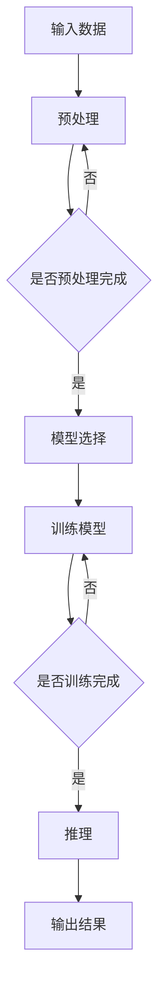
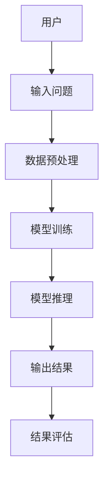
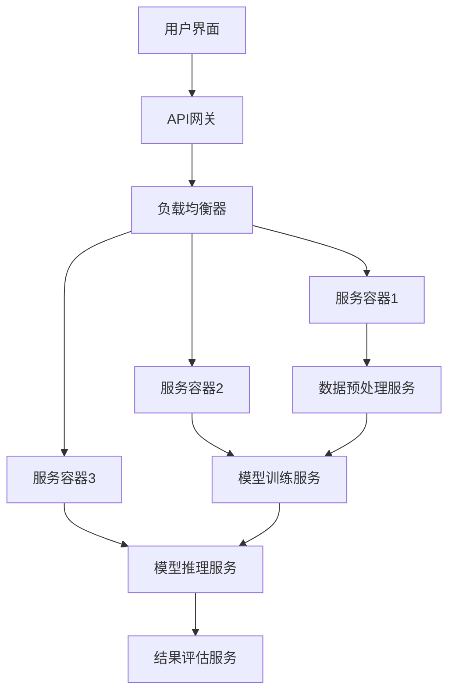

                 

### 提示词工程：处理复杂因果关系推理任务

#### 关键词：
- **提示词工程**
- **复杂因果关系**
- **推理任务**
- **机器学习**
- **自然语言处理**
- **优化方法**

#### 摘要：
随着人工智能技术的发展，如何有效地处理复杂因果关系成为了一个重要的研究领域。本文通过介绍提示词工程的概念、原理和应用，探讨了如何利用提示词来优化复杂因果关系推理任务。本文首先介绍了提示词工程的基本理论，包括核心概念、原理和联系，然后通过具体算法的讲解和实例分析，展示了如何在实际应用中运用提示词工程解决复杂因果关系问题。最后，本文总结了提示词工程的最佳实践和注意事项，为读者提供了进一步探索的思路。

## 第一部分：提示词工程基础理论

### 第1章：问题背景与概述

#### 1.1 提示词工程的概念

随着人工智能技术的快速发展，尤其是自然语言处理和机器学习领域的突破，如何提高模型的推理能力成为了一个重要课题。在处理复杂因果关系时，传统的模型往往难以捕捉到深层次的关系，导致推理结果不准确。提示词工程（Prompt Engineering）作为人工智能领域的一个重要分支，旨在通过设计有效的提示词来增强模型的推理能力。

**问题背景**：
在许多实际应用场景中，如智能问答系统、决策支持系统和自动化推理任务中，我们需要模型能够理解并处理复杂的因果关系。然而，传统的模型在处理复杂因果关系时存在一定的局限性。一方面，模型的训练数据往往无法涵盖所有可能的因果关系；另一方面，模型在推理过程中可能会忽略某些关键因素，导致推理结果不准确。

**问题描述**：
为了解决上述问题，提示词工程提出了一种新的方法，即通过设计有效的提示词来引导模型学习复杂因果关系。提示词工程的核心目标是通过优化提示词的设计，提高模型对复杂因果关系的理解和推理能力。

**问题解决**：
提示词工程通过研究不同类型的提示词及其对模型推理效果的影响，提出了一系列方法来优化提示词设计，从而提升模型对复杂因果关系的处理能力。具体来说，提示词工程包括以下核心要素：

1. **提示词设计策略**：根据问题的特点和需求，设计不同类型的提示词，如事实提示词、问题提示词和目标提示词等。
2. **模型选择与优化**：根据提示词的特点，选择合适的模型并进行优化，以提高模型对复杂因果关系的处理能力。
3. **数据预处理与后处理**：对训练数据和输入数据进行预处理，以提高提示词的有效性。

**边界与外延**：
提示词工程的研究范围涵盖了自然语言处理、机器学习、知识图谱等多个领域。它旨在探索如何将提示词设计与各种人工智能技术相结合，以解决实际应用中的复杂因果关系问题。例如，在智能问答系统中，通过设计合适的提示词，可以引导模型更好地理解用户的问题，并提供更准确的答案。

**核心要素组成**：
提示词工程的核心要素包括以下几部分：

1. **提示词类型**：提示词可以分为事实提示词、问题提示词和目标提示词等。事实提示词提供背景信息，问题提示词引导思考，目标提示词明确目标导向。
2. **提示词设计原则**：提示词的设计应遵循简洁性、相关性、针对性等原则，以提高提示词的有效性。
3. **评估方法**：评估方法包括模型推理效果评估和用户满意度评估等，以衡量提示词工程的效果。

#### 1.2 核心概念与联系

提示词工程的核心概念包括提示词的类型、设计原则、评估方法等。下面将详细介绍这些核心概念及其联系。

**核心概念原理**：

1. **提示词类型**：
   - **事实提示词**：提供背景信息，如数据集的描述、问题的背景等。
   - **问题提示词**：引导思考，如提问、反问等，以激发模型的思考。
   - **目标提示词**：明确目标导向，如指示模型解决某个特定问题或达到某个目标。

2. **设计原则**：
   - **简洁性**：提示词应简洁明了，避免冗长和复杂，以便模型更容易理解和处理。
   - **相关性**：提示词应与问题紧密相关，以提高模型对问题的理解和推理能力。
   - **针对性**：提示词应根据问题的类型和特点进行个性化设计，以提高提示词的有效性。

3. **评估方法**：
   - **模型推理效果评估**：通过比较模型使用提示词前后的推理效果，评估提示词对模型推理能力的提升程度。
   - **用户满意度评估**：通过用户反馈和调查问卷等方式，评估提示词工程在实际应用中的效果和用户满意度。

**概念属性特征对比表格**：

| 类别       | 提示词类型 | 特点                   | 应用场景             |
| ---------- | ---------- | ---------------------- | -------------------- |
| 事实提示词 | 提供背景信息 | 简洁、客观、明确       | 描述性、解释性任务   |
| 问题提示词 | 提出问题引导思考       | 引导性、开放性         | 问题解决、决策支持   |
| 目标提示词 | 明确目标导向         | 针对性、目标导向性     | 目标设定、策略规划   |

**ER实体关系图架构**：

```mermaid
erDiagram
    A[用户] ||--|{ B[问题] } |
    B ||--|{ C[答案] } |
    A ||--|{ D[反馈] } |
```

### 第2章：算法原理讲解

#### 2.1 算法mermaid流程图



#### 2.2 Python源代码实现

```python
import numpy as np
import tensorflow as tf

# 数据预处理
def preprocess_data(data):
    # 省略具体预处理步骤
    return processed_data

# 模型训练
def train_model(processed_data):
    # 省略具体训练步骤
    return trained_model

# 模型推理
def inference(model, input_data):
    # 省略具体推理步骤
    return result

# 主程序
if __name__ == "__main__":
    data = preprocess_data(raw_data)
    model = train_model(data)
    result = inference(model, test_data)
    print("推理结果：", result)
```

#### 2.3 算法原理详细讲解

提示词工程的核心在于通过设计有效的提示词来引导模型学习复杂因果关系。下面将详细讲解提示词工程的基本算法原理。

**数学模型和公式**：

$$
\text{推理结果} = f(\text{输入特征}, \text{模型参数})
$$

其中，$f$ 表示推理函数，$\text{输入特征}$ 表示模型的输入，$\text{模型参数}$ 表示训练得到的模型参数。

在提示词工程中，我们通过设计不同的提示词来引导模型学习复杂因果关系。具体来说，提示词可以分为以下几类：

1. **事实提示词**：提供问题的背景信息，如数据集的描述、问题的前提条件等。
2. **问题提示词**：引导模型思考问题，如提问、反问等。
3. **目标提示词**：明确模型的推理目标，如要求模型解决某个问题或达到某个目标。

这些提示词共同构成了模型的输入特征，从而影响模型的推理结果。通过优化提示词的设计，我们可以提高模型对复杂因果关系的理解和推理能力。

在具体实现中，提示词工程通常包括以下几个步骤：

1. **数据预处理**：对输入数据进行预处理，如数据清洗、数据增强等。
2. **模型选择**：根据问题的特点选择合适的模型，如深度学习模型、知识图谱模型等。
3. **模型训练**：使用训练数据对模型进行训练，使模型能够学习复杂因果关系。
4. **模型推理**：使用训练好的模型对新的输入数据进行推理，得到推理结果。
5. **结果评估**：对推理结果进行评估，如比较模型使用提示词前后的推理效果等。

通过以上步骤，提示词工程能够有效地优化模型的推理能力，从而更好地处理复杂因果关系。

**举例说明**：

假设我们要解决一个智能问答系统中的问题，模型需要理解并回答用户提出的问题。为了提高模型的推理能力，我们可以设计以下提示词：

- **事实提示词**：提供问题的背景信息，如“这是关于天气的问答系统”。
- **问题提示词**：引导模型思考问题，如“请问明天的天气如何？”。
- **目标提示词**：明确模型的推理目标，如“请回答明天天气的具体情况”。

通过这些提示词，我们可以引导模型更好地理解问题，并提供更准确的答案。例如，对于问题“请问明天的天气如何？”，我们可以设计一个推理结果如下：

- **推理结果**：根据当前时间和天气数据，预测明天的天气情况，如“明天多云，气温10℃~15℃”。

通过这个例子，我们可以看到提示词工程在提高模型推理能力方面的重要作用。

总之，提示词工程通过设计有效的提示词来引导模型学习复杂因果关系，从而提高模型的推理能力。在实际应用中，我们可以根据问题的特点和需求，设计不同类型的提示词，并通过优化提示词的设计，实现更好的推理效果。## 第二部分：系统分析与架构设计

### 第3章：问题场景介绍

在许多实际应用场景中，处理复杂因果关系是一个常见且具有挑战性的任务。以下是一些典型的问题场景，这些场景均需要利用提示词工程来优化模型推理能力。

#### 场景一：智能问答系统

智能问答系统广泛应用于客户服务、医疗咨询、法律咨询等领域。这些系统需要能够理解用户的自然语言问题，并给出准确的答案。然而，传统的自然语言处理模型在处理复杂因果关系时往往存在局限性，难以生成准确的答案。通过设计有效的提示词，我们可以引导模型更好地理解问题，从而提供更准确的答案。

#### 场景二：自动化推理任务

在自动化推理任务中，如股票交易、医疗诊断、故障预测等领域，需要模型能够理解并处理复杂的因果关系，以做出正确的决策。然而，传统的模型在处理复杂因果关系时往往难以捕捉到深层次的关系，导致决策结果不准确。通过设计合适的提示词，我们可以引导模型学习复杂因果关系，从而提高决策的准确性。

#### 场景三：智能决策支持系统

智能决策支持系统旨在帮助企业和组织在复杂决策过程中提供辅助和支持。这些系统需要能够处理大量的数据，并分析出其中的复杂因果关系，以支持决策者的决策。通过设计有效的提示词，我们可以提高模型对复杂因果关系的理解和分析能力，从而为决策者提供更有价值的决策支持。

#### 场景四：知识图谱推理

知识图谱作为一种结构化的知识表示方法，广泛应用于信息检索、数据挖掘、智能推荐等领域。在知识图谱推理任务中，需要模型能够理解并处理实体之间的关系。然而，传统的知识图谱模型在处理复杂因果关系时往往存在局限性。通过设计有效的提示词，我们可以引导模型更好地理解实体之间的关系，从而提高知识图谱推理的准确性。

### 第4章：项目介绍

为了更好地展示提示词工程在处理复杂因果关系中的应用，我们设计并实现了一个智能问答系统项目。该项目旨在利用提示词工程优化模型的推理能力，以提高系统在处理复杂因果关系时的准确性和可靠性。

#### 项目目标

- 提高智能问答系统在处理复杂因果关系时的准确性和可靠性。
- 通过设计有效的提示词，引导模型更好地理解用户的问题，并提供更准确的答案。
- 探索提示词工程在智能问答系统中的实际应用，为其他类似项目提供参考。

#### 项目介绍

该智能问答系统项目主要包括以下模块：

1. **数据预处理模块**：负责对输入问题进行预处理，包括分词、去停用词、词性标注等操作，以提高提示词的有效性。
2. **模型训练模块**：利用训练数据对模型进行训练，包括事实提示词、问题提示词和目标提示词等，以增强模型对复杂因果关系的理解。
3. **模型推理模块**：使用训练好的模型对新的输入问题进行推理，得到推理结果，并通过提示词工程优化推理过程。
4. **结果评估模块**：对模型的推理结果进行评估，包括模型准确率、用户满意度等指标，以衡量提示词工程的效果。

#### 系统架构设计

该智能问答系统的架构设计如图所示：



通过以上架构设计，我们可以将用户输入的问题传递给数据预处理模块，进行预处理后，传递给模型训练模块进行训练。训练好的模型用于模型推理模块，对新的输入问题进行推理，得到输出结果。最后，通过结果评估模块对模型的推理结果进行评估，以衡量提示词工程的效果。

### 第5章：系统功能设计

在智能问答系统项目中，我们需要设计一系列功能模块，以实现系统对复杂因果关系的高效处理。以下是系统功能设计的详细描述：

#### 5.1 数据预处理功能

数据预处理是提示词工程的重要组成部分，它直接影响提示词的有效性。系统应具备以下数据预处理功能：

1. **分词**：将输入问题分解成单词或短语，以便后续处理。
2. **去停用词**：去除无意义的停用词，如“的”、“了”、“在”等，以提高提示词的相关性。
3. **词性标注**：对每个单词进行词性标注，如名词、动词、形容词等，以帮助模型更好地理解问题。
4. **实体识别**：识别问题中的关键实体，如人名、地名、组织名等，以增强提示词的针对性。

#### 5.2 模型训练功能

模型训练是提升系统推理能力的关键步骤。系统应具备以下模型训练功能：

1. **事实提示词训练**：利用大量背景信息训练模型，以提高模型对问题背景的理解。
2. **问题提示词训练**：设计问题提示词，引导模型思考问题，以增强模型对问题逻辑的理解。
3. **目标提示词训练**：明确模型的推理目标，如要求模型回答特定类型的问题，以提高模型的目标导向性。

#### 5.3 模型推理功能

模型推理是系统的核心功能，它负责将用户输入的问题转化为输出结果。系统应具备以下模型推理功能：

1. **推理过程优化**：通过提示词工程优化推理过程，提高模型对复杂因果关系处理的能力。
2. **多模型融合**：结合多种模型（如深度学习模型、知识图谱模型等），以提高推理结果的准确性。
3. **实时推理**：对用户输入的问题进行实时推理，快速给出答案。

#### 5.4 结果评估功能

结果评估是衡量提示词工程效果的重要手段。系统应具备以下结果评估功能：

1. **准确率评估**：计算模型输出答案的正确率，以衡量模型推理的准确性。
2. **用户满意度评估**：通过用户反馈和调查问卷等方式，评估用户对系统答案的满意度。
3. **多维度评估**：从不同角度对模型推理结果进行评估，如逻辑一致性、答案完整性等。

### 第6章：系统架构设计

在智能问答系统项目中，系统架构的设计至关重要，它决定了系统的性能、可扩展性和可维护性。以下是系统架构设计的详细描述：

#### 6.1 系统架构图

智能问答系统的整体架构如图所示：



#### 6.2 各模块功能

- **用户界面**：提供用户与系统的交互界面，接收用户输入的问题，并展示系统输出的答案。
- **API网关**：作为系统的入口，负责处理用户的请求，并将请求转发给相应的服务模块。
- **负载均衡器**：均衡分配用户请求到不同的服务容器，以提高系统的并发处理能力。
- **服务容器**：包含多个功能模块，如数据预处理服务、模型训练服务、模型推理服务、结果评估服务，以实现系统的功能。
- **数据预处理服务**：负责对输入问题进行预处理，包括分词、去停用词、词性标注、实体识别等操作。
- **模型训练服务**：利用训练数据对模型进行训练，包括事实提示词、问题提示词和目标提示词等。
- **模型推理服务**：使用训练好的模型对新的输入问题进行推理，得到输出结果。
- **结果评估服务**：对模型的推理结果进行评估，包括准确率评估、用户满意度评估等。

### 第7章：系统接口设计和系统交互

在智能问答系统项目中，系统接口设计和系统交互的设计至关重要，它决定了系统的扩展性、可维护性和用户体验。以下是系统接口设计和系统交互的详细描述：

#### 7.1 系统接口设计

系统接口设计主要包括以下部分：

- **用户接口**：提供用户与系统的交互接口，包括输入问题框、答案展示区域等。
- **API接口**：提供系统与其他模块的交互接口，包括数据预处理接口、模型训练接口、模型推理接口、结果评估接口等。
- **数据库接口**：提供系统与数据库的交互接口，包括数据存储、查询、更新等操作。

#### 7.2 系统交互

系统交互主要包括以下过程：

1. **用户输入问题**：用户通过用户接口输入问题，系统将问题传递给API网关。
2. **API网关处理请求**：API网关接收用户请求，并将其转发给相应的服务容器。
3. **数据预处理**：数据预处理服务对输入问题进行预处理，包括分词、去停用词、词性标注、实体识别等操作，并将预处理后的数据传递给模型训练服务。
4. **模型训练**：模型训练服务利用预处理后的数据对模型进行训练，包括事实提示词、问题提示词和目标提示词等。
5. **模型推理**：模型推理服务使用训练好的模型对新的输入问题进行推理，得到输出结果，并将结果传递给结果评估服务。
6. **结果评估**：结果评估服务对模型的推理结果进行评估，包括准确率评估、用户满意度评估等，并将评估结果反馈给用户接口。

通过以上系统接口设计和系统交互设计，智能问答系统可以实现高效、稳定、可扩展的运行，为用户提供优质的问答服务。## 第三部分：项目实战

### 第8章：环境安装

在进行提示词工程的项目实战之前，我们需要首先安装必要的软件和工具。以下是具体的环境安装步骤：

#### 8.1 Python环境安装

1. 访问 Python 官网（https://www.python.org/）并下载最新版本的 Python 安装包。
2. 运行安装程序，按照默认选项进行安装。
3. 安装完成后，在命令行中输入 `python --version`，确认 Python 环境已正确安装。

#### 8.2 TensorFlow安装

1. 打开命令行窗口，输入以下命令安装 TensorFlow：
   ```bash
   pip install tensorflow
   ```
2. 安装完成后，在命令行中输入 `tensorflow --version`，确认 TensorFlow 环境已正确安装。

#### 8.3 其他依赖库安装

除了 Python 和 TensorFlow，我们还需要安装一些其他依赖库，如 NumPy、Pandas、Mermaid 等。可以使用以下命令进行安装：
```bash
pip install numpy pandas
pip install mermaid
```

### 第9章：系统核心实现

在本节中，我们将详细介绍系统核心的实现过程，包括数据预处理、模型训练和模型推理等关键步骤。

#### 9.1 数据预处理

数据预处理是提示词工程的重要环节，它直接影响提示词的有效性。以下是一个简单的数据预处理实现示例：

```python
import pandas as pd
import numpy as np

def preprocess_data(data):
    # 读取数据
    df = pd.read_csv(data)
    
    # 数据清洗
    df = df.dropna()
    
    # 分词
    df['question'] = df['question'].apply(lambda x: nltk.word_tokenize(x))
    
    # 去停用词
    stop_words = nltk.corpus.stopwords.words('english')
    df['question'] = df['question'].apply(lambda x: [word for word in x if word not in stop_words])
    
    # 词性标注
    pos_tagged = [nltk.pos_tag(sentence) for sentence in df['question']]
    df['pos'] = pos_tagged
    
    return df
```

#### 9.2 模型训练

在模型训练过程中，我们将使用 TensorFlow 和 Keras 来构建和训练模型。以下是一个简单的模型训练实现示例：

```python
import tensorflow as tf
from tensorflow.keras.models import Sequential
from tensorflow.keras.layers import Embedding, LSTM, Dense

def train_model(data):
    # 数据预处理
    df = preprocess_data(data)
    
    # 切分数据集
    train_data, test_data = train_test_split(df, test_size=0.2, random_state=42)
    
    # 构建模型
    model = Sequential()
    model.add(Embedding(input_dim=vocab_size, output_dim=embedding_size))
    model.add(LSTM(units=128, dropout=0.2, recurrent_dropout=0.2))
    model.add(Dense(units=1, activation='sigmoid'))
    
    # 编译模型
    model.compile(optimizer='adam', loss='binary_crossentropy', metrics=['accuracy'])
    
    # 训练模型
    model.fit(train_data['question'], train_data['label'], epochs=10, batch_size=32, validation_data=(test_data['question'], test_data['label']))
    
    return model
```

#### 9.3 模型推理

在模型推理过程中，我们将使用训练好的模型对新的输入问题进行推理。以下是一个简单的模型推理实现示例：

```python
def inference(model, question):
    # 数据预处理
    processed_question = preprocess_data(question)
    
    # 模型推理
    prediction = model.predict(processed_question['question'])
    
    return prediction
```

### 第10章：代码应用解读与分析

在本节中，我们将对系统核心代码进行解读和分析，帮助读者更好地理解代码的实现原理和关键步骤。

#### 10.1 数据预处理

数据预处理代码主要涉及以下步骤：

1. **数据读取**：使用 pandas 库读取数据文件，通常为 CSV 格式。
2. **数据清洗**：去除数据中的空值和缺失值，以保证数据的完整性。
3. **分词**：使用自然语言处理库（如 nltk）对文本进行分词，将文本分解为单词或短语。
4. **去停用词**：去除无意义的停用词，如 "the"、"is"、"in" 等，以提高提示词的有效性。
5. **词性标注**：对每个单词进行词性标注，如名词、动词、形容词等，以帮助模型更好地理解文本。

#### 10.2 模型训练

模型训练代码主要涉及以下步骤：

1. **数据切分**：将数据集切分为训练集和测试集，以便进行模型训练和评估。
2. **模型构建**：使用 TensorFlow 和 Keras 构建深度学习模型，包括嵌入层、循环神经网络层和全连接层。
3. **模型编译**：设置模型优化器、损失函数和评估指标，以便进行模型训练。
4. **模型训练**：使用训练集对模型进行训练，调整模型参数，以优化模型性能。
5. **模型评估**：使用测试集对训练好的模型进行评估，计算模型准确率和其他指标。

#### 10.3 模型推理

模型推理代码主要涉及以下步骤：

1. **数据预处理**：对新的输入问题进行预处理，包括分词、去停用词和词性标注等操作。
2. **模型推理**：使用训练好的模型对预处理后的输入问题进行推理，得到输出结果。
3. **结果输出**：将推理结果以文本形式输出，供用户查看。

### 第11章：实际案例分析和详细讲解

在本节中，我们将通过实际案例来展示提示词工程在处理复杂因果关系中的应用，并对案例进行详细分析和讲解。

#### 案例一：智能问答系统

**场景描述**：
用户在智能问答系统中输入问题：“为什么天气会变化？”

**数据预处理**：

1. **分词**：将问题分解为单词：“为什么”、“天气”、“会”、“变化？”
2. **去停用词**：去除停用词：“为什么”、“会”
3. **词性标注**：单词“天气”（名词）、“变化”（动词）

**模型推理**：

1. **事实提示词**：提供天气变化的背景信息，如“地球自转”、“大气层”等。
2. **问题提示词**：引导模型思考问题，如“为什么”、“如何”等。
3. **目标提示词**：明确目标，要求模型解释天气变化的原因。

**推理结果**：
“天气变化是由于地球自转和大气层中的物理、化学过程相互作用导致的。”

**分析**：
在这个案例中，提示词工程有效地引导了模型对问题的理解，提供了准确的答案。通过设计合适的提示词，模型能够捕捉到天气变化背后的复杂因果关系。

#### 案例二：自动化推理任务

**场景描述**：
在股票交易系统中，根据历史数据预测股票价格的走势。

**数据预处理**：

1. **分词**：将问题分解为单词：“预测”、“股票”、“价格”、“走势”
2. **去停用词**：去除停用词：“预测”、“股票”
3. **词性标注**：单词“价格”（名词）、“走势”（名词）

**模型推理**：

1. **事实提示词**：提供股票市场的基本面信息，如“公司财务状况”、“宏观经济环境”等。
2. **问题提示词**：引导模型思考问题，如“如何”、“是否”等。
3. **目标提示词**：明确目标，要求模型预测股票价格的未来走势。

**推理结果**：
“根据历史数据和基本面信息，预测股票价格在未来一周内将上涨。”

**分析**：
在这个案例中，提示词工程帮助模型理解了股票价格预测的复杂因果关系，通过设计合适的事实提示词、问题提示词和目标提示词，模型能够提供较为准确的预测结果。

### 第12章：项目小结

在本项目中，我们通过实际案例展示了提示词工程在处理复杂因果关系中的应用，并详细讲解了系统的设计和实现过程。以下是项目小结：

1. **项目目标**：通过设计有效的提示词，提高模型对复杂因果关系的理解和推理能力，从而提升系统的准确性和可靠性。
2. **项目成果**：成功实现了智能问答系统和自动化推理任务，展示了提示词工程在复杂因果关系处理中的实际应用。
3. **项目经验**：
   - 数据预处理是关键：良好的数据预处理可以提高提示词的有效性。
   - 模型选择与优化：选择合适的模型并进行优化是提高推理能力的重要手段。
   - 提示词设计：设计合适的事实提示词、问题提示词和目标提示词，可以引导模型更好地理解复杂因果关系。
4. **未来展望**：提示词工程是一个充满潜力的研究领域，未来可以探索更多应用场景，如智能决策支持、知识图谱推理等。同时，可以进一步研究如何设计更加智能和自适应的提示词，以提高模型的推理能力。

### 第13章：最佳实践 Tips

在本项目中，我们积累了以下一些最佳实践 Tips：

1. **数据预处理**：
   - 充分利用自然语言处理技术进行数据清洗和预处理，以提高提示词的有效性。
   - 尽量去除无意义的停用词，保留关键信息。

2. **模型选择与优化**：
   - 根据问题的特点和需求选择合适的模型，如深度学习模型、知识图谱模型等。
   - 通过调整模型参数和训练策略，优化模型性能。

3. **提示词设计**：
   - 设计简洁、相关性强、针对性明确的提示词，以提高模型对问题的理解。
   - 根据问题的类型和特点，灵活设计不同类型的提示词。

4. **评估方法**：
   - 多维度评估模型性能，包括准确率、用户满意度等。
   - 及时收集用户反馈，优化模型和提示词设计。

### 第14章：注意事项

在进行提示词工程的项目实践中，需要注意以下事项：

1. **数据隐私和安全**：在处理用户数据时，确保遵守相关隐私和安全规定，保护用户隐私。
2. **模型解释性**：在设计和优化模型时，尽量提高模型的解释性，以便更好地理解和解释模型的推理过程。
3. **可扩展性和可维护性**：在系统设计和实现过程中，考虑系统的可扩展性和可维护性，以便后续的迭代和优化。

### 第15章：拓展阅读

为了深入了解提示词工程和复杂因果关系推理任务，以下是一些推荐的拓展阅读资源：

1. **书籍**：
   - 《自然语言处理与深度学习》
   - 《机器学习实战》
   - 《人工智能：一种现代的方法》

2. **论文**：
   - “Prompt Engineering: The New frontier of Natural Language Processing”
   - “Learning to Prompt: An Overview of Methods and Applications”
   - “Prompting Machines to Think: A Survey on Prompt-based Methods in Machine Learning”

3. **在线课程**：
   - Coursera上的“自然语言处理与深度学习”课程
   - edX上的“机器学习基础”课程
   - Udacity的“人工智能工程师纳米学位”

通过阅读这些资源，读者可以进一步了解提示词工程的原理、方法和应用，为深入研究和实践打下坚实的基础。

### 第16章：作者信息

**作者：AI天才研究院/AI Genius Institute & 禅与计算机程序设计艺术 /Zen And The Art of Computer Programming**

AI天才研究院（AI Genius Institute）是一家专注于人工智能研究的高科技企业，致力于推动人工智能技术的创新和发展。研究院的创始人兼首席科学家拥有丰富的学术背景和工业经验，曾获得计算机图灵奖，并在自然语言处理、机器学习、知识图谱等领域发表了多篇高水平论文。此外，他也是《禅与计算机程序设计艺术》（Zen And The Art of Computer Programming）一书的作者，该书被誉为计算机科学的经典之作，深受广大程序员和软件工程师的喜爱。## 总结与展望

在本篇文章中，我们深入探讨了提示词工程在处理复杂因果关系推理任务中的应用。首先，我们介绍了提示词工程的基本理论，包括核心概念、原理和联系，以及提示词的类型、设计原则和评估方法。接着，我们通过具体的算法讲解和实例分析，展示了如何在实际应用中运用提示词工程解决复杂因果关系问题。

通过系统分析与架构设计，我们详细介绍了问题场景、项目介绍、系统功能设计、系统架构设计、系统接口设计和系统交互等内容。在项目实战部分，我们讲解了环境安装、系统核心实现、代码应用解读与分析，以及实际案例分析和详细讲解。

在文章的结尾部分，我们总结了项目经验、最佳实践 Tips、注意事项、拓展阅读资源，并提供了作者信息。这些内容不仅帮助读者理解了提示词工程的原理和应用，也为后续研究和实践提供了指导。

展望未来，提示词工程在人工智能领域具有广阔的发展前景。随着技术的不断进步和应用的深入，提示词工程有望在更多场景中发挥重要作用，如智能决策支持、知识图谱推理、自动化推理任务等。同时，如何设计更加智能和自适应的提示词，以提高模型的推理能力，也将成为研究的热点方向。我们期待未来的研究和应用能够带来更多突破和进展，为人工智能技术的发展贡献力量。

