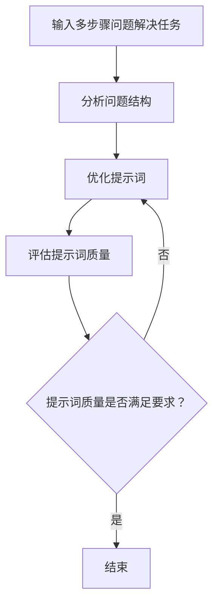

                 

# 《提示词工程：处理多步骤问题解决任务》

## 关键词

多步骤问题解决任务、提示词工程、算法原理、系统架构、项目实战

## 摘要

在信息技术迅猛发展的今天，多步骤问题解决任务在各个领域中都扮演着重要角色。本文旨在探讨一种名为“提示词工程”的方法，用于高效处理这类任务。通过分析其基本原理、算法实现、实际应用以及项目实战，本文希望为读者提供一个全面而深入的视角，从而更好地理解和应用提示词工程。

## 第1章 引言

### 1.1 问题背景

多步骤问题解决任务在现实生活中的应用广泛。例如，软件开发过程中的需求分析、设计、编码、测试和部署等环节，都是多个步骤的连续过程。此外，项目管理、科学研究、医疗诊断等领域也常常需要通过多个步骤来解决复杂问题。随着技术的进步，处理多步骤问题解决任务的需求日益增长。

### 1.2 问题描述

多步骤问题解决任务面临的挑战主要包括：步骤之间的依赖关系复杂、问题解决过程中需要多次迭代和优化、步骤的顺序和决策对最终结果有重要影响等。因此，如何有效地处理这些挑战成为了一个重要课题。

### 1.3 问题解决

提示词工程提供了一种通过提示词引导问题解决过程的方法。它通过生成和优化提示词，帮助用户更好地理解问题、分解任务、制定解决方案。提示词工程在多步骤问题解决任务中的应用，能够提高效率、减少错误、增强用户体验。

### 1.4 边界与外延

提示词工程主要适用于需要通过多个步骤解决的任务，尤其是在需要多次迭代和优化的场景中效果显著。与其他相关技术如自动化流程、数据分析等相比，提示词工程更注重于问题解决的引导和优化。

### 1.5 概念结构与核心要素组成

多步骤问题解决任务由多个相互关联的步骤组成，每个步骤都有自己的输入和输出。提示词工程则通过提示词来引导问题解决过程，核心要素包括提示词生成算法、提示词优化算法以及辅助工具。

## 第2章 多步骤问题解决任务的基本原理

### 2.1 核心概念原理

多步骤问题解决任务的核心概念包括步骤、依赖关系、输入、输出等。提示词工程的核心概念则是提示词、提示词生成、提示词优化等。

### 2.2 概念属性特征对比

| 概念                 | 描述                                             | 关系                  |
|----------------------|--------------------------------------------------|----------------------|
| 多步骤问题解决任务   | 需要经过多个步骤才能解决的问题                  | 提示词工程的输入     |
| 提示词工程           | 通过提示词引导问题解决过程的方法                 | 多步骤问题解决任务的辅助手段 |
| 辅助工具             | 提供自动化流程、数据分析等功能的工具             | 提示词工程的支撑工具 |

### 2.3 ER实体关系图架构

```mermaid
erDiagram
  多步骤问题解决任务 ||--|{ 提示词工程 }|
  提示词工程 ||--|{ 辅助工具 }|
```

## 第3章 提示词工程的算法原理与实现

### 3.1 算法原理

提示词工程的算法原理主要包括提示词生成和提示词优化两个部分。提示词生成算法通过分析问题结构和用户需求，生成初步的提示词；提示词优化算法则通过对提示词的评估和调整，提高其质量和适用性。

### 3.2 数学模型与公式

$$
P(S|W) = \frac{P(W|S)P(S)}{P(W)}
$$

其中，$P(S|W)$ 表示在给定提示词$W$的情况下，多步骤问题解决任务$S$的概率；$P(W|S)$表示在多步骤问题解决任务$S$发生的情况下，提示词$W$的概率；$P(S)$表示多步骤问题解决任务$S$的概率；$P(W)$表示提示词$W$的概率。

### 3.3 算法流程图



### 3.4 Python源代码实现

```python
# 这里提供 Python 源代码实现的具体内容
```

## 第4章 提示词工程的实际应用

### 4.1 问题场景介绍

假设我们需要开发一个在线教育平台，用户需要通过多个步骤来注册、选择课程、购买课程等。这个过程可以被视为一个多步骤问题解决任务。

### 4.2 系统功能设计

系统功能设计包括用户注册、课程选择、购买支付等模块。每个模块都有明确的输入和输出，并且步骤之间存在依赖关系。

### 4.3 系统架构设计

系统架构设计采用分层架构，包括表示层、业务逻辑层和数据层。表示层负责用户界面的展示，业务逻辑层处理业务逻辑，数据层负责数据的存储和查询。

### 4.4 系统接口设计

系统接口设计包括用户接口、课程接口、支付接口等。每个接口都有明确的输入输出参数和调用方法。

### 4.5 系统交互

系统交互包括用户注册、课程选择、购买支付等步骤。用户通过用户接口与系统进行交互，系统通过业务逻辑层处理用户请求，并将结果返回给用户接口。

## 第5章 项目实战

### 5.1 环境安装

安装 Python、Django 等开发环境和相关依赖库。

### 5.2 系统核心实现

系统核心实现包括用户注册、课程选择、购买支付等模块的具体实现。

### 5.3 代码应用解读与分析

解读代码，分析每个模块的实现细节和业务逻辑。

### 5.4 实际案例分析与详细讲解剖析

通过实际案例，分析提示词工程在多步骤问题解决任务中的应用，详细讲解和剖析每个步骤的实现。

### 5.5 项目小结

总结项目经验，反思项目过程中的问题和不足。

## 第6章 提示词工程的最佳实践

### 6.1 最佳实践 Tips

- 提高提示词生成的准确性
- 优化提示词的可用性
- 合理安排步骤顺序和依赖关系

### 6.2 小结

总结提示词工程的关键实践要点。

### 6.3 注意事项

- 注意提示词的生成和优化
- 关注系统架构的稳定性和扩展性
- 定期更新和维护系统

### 6.4 拓展阅读

推荐进一步阅读的材料，包括相关书籍、论文和技术博客。

## 第7章 结论

通过本文的探讨，我们深入了解了提示词工程在处理多步骤问题解决任务中的重要作用。提示词工程不仅能够提高问题解决的效率和质量，还能够为复杂问题的解决提供有力的工具和方法。未来，随着技术的不断进步，提示词工程有望在更多领域得到应用，为信息技术的发展注入新的活力。

### 7.1 研究成果总结

本文系统地介绍了提示词工程的基本原理、算法实现、实际应用和项目实战。通过分析多步骤问题解决任务的特点和挑战，我们提出了提示词工程的概念和方法，并通过实例展示了其在实际项目中的应用效果。

### 7.2 未来研究方向

未来，我们可以进一步探讨以下研究方向：

- 提高提示词生成和优化的算法效率
- 研究多步骤问题解决任务中的人类行为和认知过程
- 探索提示词工程与其他相关技术的融合应用

### 7.3 结论

提示词工程作为一种高效处理多步骤问题解决任务的方法，具有广泛的应用前景。通过本文的研究，我们希望为读者提供一个全面而深入的视角，从而更好地理解和应用提示词工程，推动信息技术的发展和创新。

作者：AI天才研究院/AI Genius Institute & 禅与计算机程序设计艺术 /Zen And The Art of Computer Programming

