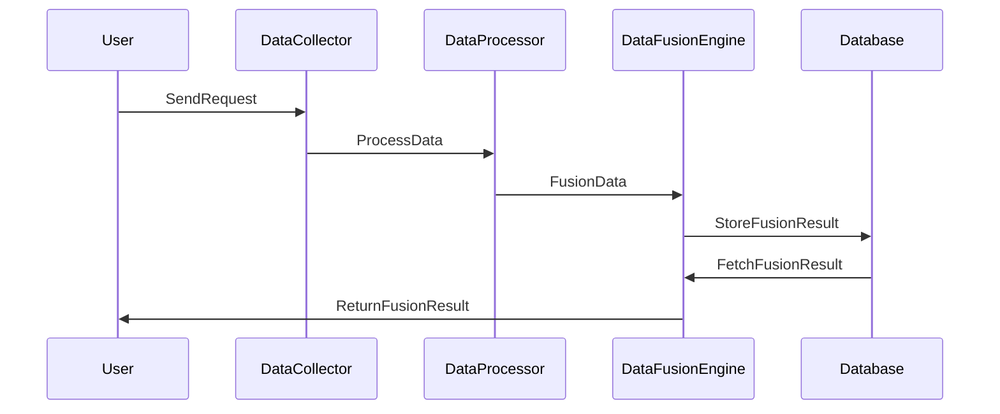
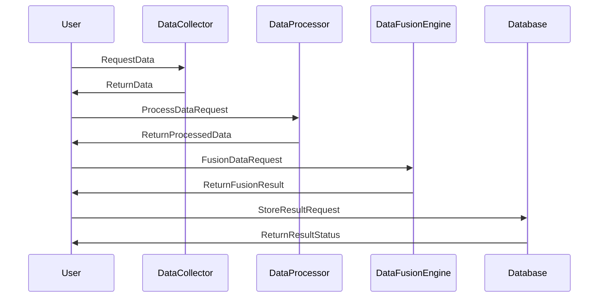

                 

### 文章标题：提示词工程：处理多源异构数据融合任务

> 关键词：提示词工程、多源异构数据、数据融合、算法原理、系统架构、项目实战

> 摘要：本文将深入探讨提示词工程在处理多源异构数据融合任务中的应用。首先，我们将介绍数据融合的背景和挑战，然后详细阐述提示词工程的核心概念和方法论。接着，文章将通过具体的算法原理讲解、数学模型推导和项目实战案例，展示如何有效地实现多源异构数据的融合。最后，我们将总结最佳实践技巧，并对未来的发展趋势进行展望。

---

### 1.6 目录大纲设计

**目标：** 设计一个完整且详细的目录大纲，涵盖《提示词工程：处理多源异构数据融合任务》的核心内容，确保结构清晰、层次分明，同时遵循markdown格式要求。

#### 第一部分：背景介绍

- **第1章：问题背景**
  - **1.1.1 异构数据融合的挑战**
  - **1.1.2 多源数据的定义与分类**
  - **1.1.3 提示词工程的意义**
- **第2章：核心概念**
  - **2.1.1 数据融合的基本概念**
  - **2.1.2 数据异构性的表现**
  - **2.1.3 提示词的定义与作用**

#### 第二部分：问题解决

- **第3章：问题解决**
  - **3.1.1 提示词工程的方法论**
  - **3.1.2 数据预处理策略**
  - **3.1.3 异构数据匹配与融合**

#### 第三部分：算法原理讲解

- **第4章：边界与外延**
  - **4.1.1 提示词工程的应用范围**
  - **4.1.2 数据融合的挑战与机遇**
  - **4.1.3 提示词工程的未来发展趋势**
- **第5章：概念结构与核心要素组成**
  - **5.1 数据源选择与评估**
  - **5.2 提示词设计与实现**
  - **5.3 提示词优化策略**

#### 第四部分：算法原理讲解

- **第6章：算法原理讲解**
  - **6.1 提示词工程的基本算法**
  - **6.2 基于语义相似度的提示词匹配**
  - **6.3 基于协同过滤的提示词推荐**

#### 第五部分：数学模型与公式

- **第7章：数学模型与公式**
  - **7.1 数据融合的数学模型**
  - **7.2 提示词的数学定义**
  - **7.3 数据融合的数学框架**

#### 第六部分：算法示例与讲解

- **第8章：算法示例与讲解**
  - **8.1 文本数据融合示例**
  - **8.2 图像与文本融合示例**

#### 第七部分：系统分析与架构设计

- **第9章：系统分析与架构设计**
  - **9.1 问题场景介绍**
  - **9.2 系统架构设计**
  - **9.3 系统接口设计与实现**
  - **9.4 系统交互设计**

#### 第八部分：项目实战

- **第10章：项目实战**
  - **10.1 环境安装**
  - **10.2 系统核心实现**
  - **10.3 实际案例分析与讲解**
  - **10.4 项目小结**

#### 第九部分：最佳实践与拓展阅读

- **第11章：最佳实践与拓展阅读**
  - **11.1 最佳实践技巧**
  - **11.2 小结**
  - **11.3 拓展阅读**

---

**注意：** 此大纲仅为示例，具体内容需根据实际书籍内容进行调整。每个章节将详细探讨其主题，确保读者能够全面理解提示词工程在处理多源异构数据融合任务中的关键作用。

### 1.7 文章格式要求

为确保文章的可读性和专业性，以下是一些关于文章格式的要求：

- **标题格式**：文章标题应简洁明了，能够准确反映文章的主题。
- **关键词格式**：关键词应以列表形式列出，使用逗号分隔，便于读者快速把握文章核心。
- **摘要格式**：摘要应简短精练，概括文章的主要内容和核心观点，字数控制在150-200字之间。
- **章节标题格式**：章节标题应具有吸引力，概括本章的主要内容，使用###格式。
- **小节标题格式**：小节标题应简明扼要，使用####格式。
- **段落格式**：段落应保持一致性，段首不留空行，行首和行尾不使用空格。
- **公式格式**：数学公式应使用LaTeX格式，独立段落内使用$$括起，如$$1+1=2$$，段落内使用$括起，如$1<2$。
- **代码格式**：代码块应使用````python（或其他语言）````格式，并确保代码可执行。
- **图片和图表格式**：图片和图表应清晰可读，附有简短说明，使用格式嵌入。
- **引用格式**：引用他人观点或研究成果时，应在文中注明来源，并在文章末尾列出参考文献。

遵循上述格式要求，有助于提高文章的专业性和阅读体验。

### 1.8 完整性要求

为了确保文章内容的完整性和专业性，以下是一些核心内容的必须包含要素：

**背景介绍**：

- **核心概念术语说明**：明确界定文章中涉及的关键术语和概念，解释其定义和重要性。
- **问题背景**：介绍多源异构数据融合任务在当前技术领域的应用背景和现状。
- **问题描述**：详细描述多源异构数据融合任务的具体挑战和难点。
- **问题解决**：概述提示词工程在解决这些问题中的方法和策略。

**核心概念与联系**：

- **核心概念原理**：深入讲解提示词工程的基本概念和原理，包括其工作原理和应用场景。
- **概念属性特征对比表格**：列出提示词工程中关键概念的属性特征，并对比分析其差异。
- **ER实体关系图架构的 Mermaid 流程图**：绘制Mermaid流程图，展示提示词工程的核心要素及其相互关系。

**算法原理讲解**：

- **算法mermaid流程图**：使用Mermaid语言绘制算法流程图，清晰展示算法的执行过程。
- **Python源代码示例**：提供具体实现的Python代码示例，详细阐述算法原理和步骤。
- **数学模型和公式**：使用LaTeX格式给出算法的数学模型和关键公式，并进行详细讲解。
- **通俗易懂的举例说明**：通过实际案例展示算法的应用效果，使读者能够直观理解算法的作用和优势。

**系统分析与架构设计方案**：

- **问题场景介绍**：描述目标系统需要解决的实际问题场景。
- **项目介绍**：简要介绍系统的功能和目标。
- **领域模型设计（Mermaid类图）**：使用Mermaid绘制领域模型类图，展示系统中的主要类及其关系。
- **系统架构设计（Mermaid架构图）**：绘制系统架构图，详细展示系统的各个组件及其交互方式。
- **系统接口设计**：描述系统的接口设计和实现方式。
- **系统交互设计（Mermaid序列图）**：使用Mermaid绘制系统交互序列图，展示系统组件之间的交互流程。

**项目实战**：

- **环境安装**：详细说明系统环境的搭建过程，包括所需工具和依赖的安装步骤。
- **系统核心实现源代码**：提供关键代码片段，详细解释其功能实现。
- **代码应用解读与分析**：分析代码的应用场景和执行效果，讨论可能存在的问题和改进方向。
- **实际案例分析和详细讲解剖析**：通过具体案例展示系统的实际应用效果，深入剖析系统实现过程中的关键技术和策略。
- **项目小结**：总结项目的主要成果和经验教训，提出对未来工作的建议。

通过确保这些核心内容的完整性，文章将能够为读者提供全面而深入的技术见解和实用指导。

### 1.9 核心概念与联系

#### 数据融合的基本概念

**数据融合（Data Fusion）** 是指将来自多个源的数据进行整合、分析，以生成更加准确、完整和有用的信息。数据融合的目标是充分利用多个数据源的信息，提高数据的可用性和决策支持能力。

**数据源（Data Source）** 是指提供数据的原始位置或存储点。数据源可以是数据库、传感器、文件系统等。

**信息整合（Information Integration）** 是数据融合的核心过程，涉及数据的抽取、转换、清洗和合并。

**数据异构性（Data Heterogeneity）** 是指不同数据源之间的数据格式、结构和语义差异。数据异构性是数据融合的主要挑战之一。

**多源数据融合（Multi-source Data Fusion）** 是指融合来自多个数据源的数据。这些数据源可能具有不同的类型、格式和分辨率。

**应用领域（Application Domain）** 数据融合广泛应用于多个领域，包括智能交通、智能医疗、环境监测、安全监控等。

#### 数据异构性的表现

**格式异构**：不同数据源的数据格式可能不一致，如关系数据库、XML、JSON、图像、文本等。

**结构异构**：不同数据源的数据结构可能不同，如关系型、文档型、图形型等。

**语义异构**：不同数据源的数据语义含义可能不同，如相同数据在不同上下文中的含义可能不同。

**时间异构**：不同数据源的数据时间戳可能不一致，如实时数据和历史数据的融合。

**数据质量异构**：不同数据源的数据质量可能参差不齐，如数据缺失、错误、重复等。

#### 提示词的定义与作用

**提示词（Keywords）** 是指用于描述数据内容的关键词或短语，用于帮助用户快速定位和检索信息。

**提示词工程（Keyword Engineering）** 是指设计和实现用于数据融合的提示词系统的方法和过程。

**提示词生成（Keyword Generation）** 是指自动或半自动地生成描述数据内容的关键词。

**提示词匹配（Keyword Matching）** 是指根据用户查询或上下文，匹配数据源中的提示词。

**提示词优化（Keyword Optimization）** 是指通过分析用户行为和数据质量，对提示词进行优化和调整。

**提示词在数据融合中的作用**：

- **提高数据检索效率**：通过使用提示词，用户可以更快速地找到所需数据。
- **增强数据解释性**：提示词有助于用户理解数据的来源和含义。
- **优化数据整合效果**：高质量的提示词可以提高数据融合的准确性和完整性。

#### 概念属性特征对比表格

| 概念          | 定义                                                         | 关键属性         | 应用场景               |
|---------------|--------------------------------------------------------------|------------------|------------------------|
| 数据融合      | 将来自多个数据源的数据进行整合和分析                             | 多源、整合、分析   | 智能交通、智能医疗等     |
| 数据源        | 提供数据的原始位置或存储点                                     | 多样性、存储       | 数据库、传感器、文件系统 |
| 信息整合      | 数据抽取、转换、清洗和合并的过程                               | 抽取、转换、清洗   | 数据融合的核心过程       |
| 数据异构性    | 不同数据源之间的数据格式、结构和语义差异                         | 格式、结构、语义   | 多源数据融合的挑战       |
| 提示词        | 描述数据内容的关键词或短语                                     | 关键性、描述性     | 数据检索、数据解释       |
| 提示词工程    | 设计和实现提示词系统的方法和过程                               | 设计、实现、优化   | 数据融合的关键环节       |
| 数据质量      | 数据的完整性、准确性、一致性、及时性                           | 完整性、准确性等   | 数据分析的基础           |

#### ER实体关系图架构的 Mermaid 流程图

```mermaid
erDiagram
  Data_Fusion -->|1. 数据整合| Information_Integration
  Data_Source -->|2. 数据提供| Data_Fusion
  Keyword_Engineering -->|3. 提示词设计| Data_Fusion
  Keyword_Generation -->|4. 提示词生成| Keyword_Engineering
  Keyword_Matching -->|5. 提示词匹配| Data_Fusion
  Data_Heterogeneity -->|6. 数据异构性| Data_Fusion
```

通过上述核心概念与联系的详细讲解，我们可以更好地理解提示词工程在处理多源异构数据融合任务中的重要作用。接下来，我们将进一步探讨数据融合的算法原理，为后续章节的深入讨论打下基础。

### 1.10 算法原理讲解

在深入了解提示词工程之前，我们首先需要理解数据融合的基本算法原理。这些算法原理构成了提示词工程的核心，使我们能够有效地处理多源异构数据融合任务。

#### 数据融合的基本算法

数据融合的基本算法可以分为以下几类：

1. **基于统计的融合算法**：
   - **均值融合**：计算多个数据源的平均值作为最终结果。
   - **中值融合**：选择多个数据源的中位数作为最终结果。
   - **加权融合**：根据数据源的置信度或重要性对数据进行加权平均。

2. **基于规则的融合算法**：
   - **专家系统**：基于领域专家的知识和经验制定规则，用于数据融合。
   - **模糊逻辑**：使用模糊集合和模糊规则进行数据融合。

3. **基于机器学习的融合算法**：
   - **决策树**：通过训练数据构建决策树模型，用于分类和预测。
   - **神经网络**：使用多层感知机（MLP）等神经网络模型进行数据融合。

4. **基于模型的融合算法**：
   - **贝叶斯网络**：使用贝叶斯网络模型表示数据源之间的概率关系。
   - **隐马尔可夫模型（HMM）**：适用于序列数据的融合。

5. **基于信息理论的融合算法**：
   - **互信息最大化**：通过最大化互信息来优化数据融合。
   - **Kullback-Leibler散度**：用于评估不同数据源之间的差异。

#### 基于语义相似度的提示词匹配

在多源异构数据融合中，提示词匹配是一个关键步骤，用于将不同数据源中的信息进行关联和整合。基于语义相似度的提示词匹配算法如下：

1. **TF-IDF（词频-逆文档频率）**：
   - **词频（TF）**：计算词在数据源中的出现频率。
   - **逆文档频率（IDF）**：计算词在整个数据集上的逆频率，用于平衡高频词的影响。
   - **相似度计算**：使用TF-IDF值计算不同数据源之间的相似度。

2. **余弦相似度**：
   - **向量表示**：将数据源表示为向量，通常使用词袋模型或词嵌入。
   - **余弦相似度公式**：计算两个向量之间的余弦值，用于表示它们的相似度。

3. **Jaccard相似度**：
   - **集合表示**：将数据源表示为集合，包含其中的关键词。
   - **Jaccard相似度公式**：计算两个集合交集与并集的比值，用于表示它们的相似度。

4. **词嵌入相似度**：
   - **预训练词嵌入模型**：使用预训练的词嵌入模型（如Word2Vec、GloVe）。
   - **相似度计算**：通过计算词嵌入向量之间的欧氏距离或余弦相似度，评估它们的语义相似度。

#### 基于协同过滤的提示词推荐

协同过滤是一种常见的推荐系统方法，它通过分析用户的兴趣和行为，向用户推荐相关的内容或物品。基于协同过滤的提示词推荐算法如下：

1. **用户基于的协同过滤（User-based Collaborative Filtering）**：
   - **相似度计算**：计算用户之间的相似度，通常使用余弦相似度或皮尔逊相关系数。
   - **推荐生成**：为用户推荐与相似用户喜欢的提示词。

2. **物品基于的协同过滤（Item-based Collaborative Filtering）**：
   - **相似度计算**：计算物品之间的相似度，通常使用Jaccard相似度或余弦相似度。
   - **推荐生成**：为用户推荐与当前物品相似的其他物品。

3. **混合协同过滤**：
   - **结合用户和物品的特征**：结合用户基于和物品基于的协同过滤方法，生成更准确的推荐结果。

4. **矩阵分解**：
   - **协同过滤矩阵分解**：使用矩阵分解技术（如SVD、NMF）来建模用户和物品之间的关系。
   - **推荐生成**：通过重建用户和物品的评分矩阵，生成推荐列表。

通过上述算法原理的讲解，我们可以更好地理解提示词工程在处理多源异构数据融合任务中的应用。在接下来的章节中，我们将进一步探讨数学模型与公式，为算法的实现提供理论基础。

### 1.11 数学模型与公式

在提示词工程中，数学模型和公式是理解和实现算法的关键。以下内容将介绍数据融合中的数学模型和公式，并使用LaTeX格式进行展示。

#### 数据融合的数学模型

1. **均值融合模型**：

$$
\bar{X} = \frac{1}{N}\sum_{i=1}^{N} X_i
$$

其中，$\bar{X}$表示融合后的数据，$X_i$表示第$i$个数据源的数据，$N$表示数据源的总数。

2. **加权融合模型**：

$$
\bar{X} = \sum_{i=1}^{N} w_i X_i
$$

其中，$w_i$表示第$i$个数据源的权重，$X_i$表示第$i$个数据源的数据。

3. **中值融合模型**：

$$
\bar{X} = \text{median}(X_1, X_2, ..., X_N)
$$

其中，$\text{median}$表示中位数。

4. **贝叶斯网络模型**：

$$
P(A|B) = \frac{P(B|A)P(A)}{P(B)}
$$

其中，$P(A|B)$表示在条件$B$下事件$A$的概率，$P(B|A)$表示在条件$A$下事件$B$的概率，$P(A)$和$P(B)$分别表示事件$A$和事件$B$的概率。

#### 提示词优化的数学模型

1. **基于互信息的优化**：

$$
\max \sum_{i=1}^{N} \sum_{j=1}^{M} I(X_i; Y_j)
$$

其中，$I(X_i; Y_j)$表示第$i$个数据源的第$j$个特征与融合结果之间的互信息。

2. **基于最小化误差的优化**：

$$
\min \sum_{i=1}^{N} \sum_{j=1}^{M} (X_i - \bar{X})^2
$$

其中，$\bar{X}$表示融合结果，$X_i$表示第$i$个数据源的数据。

#### 提示词生成的数学模型

1. **基于TF-IDF的模型**：

$$
TF(t) = \frac{f(t)}{N}
$$

$$
IDF(t) = \log \left(1 + \frac{N}{n(t)}\right)
$$

$$
TF-IDF(t) = TF(t) \times IDF(t)
$$

其中，$f(t)$表示词$t$在文档中出现的频率，$N$表示文档总数，$n(t)$表示包含词$t$的文档数量。

2. **基于词嵌入的模型**：

$$
\vec{w}_t = \text{Word2Vec}(t)
$$

其中，$\vec{w}_t$表示词$t$的词嵌入向量，$\text{Word2Vec}(t)$表示词$t$的Word2Vec嵌入。

通过上述数学模型和公式的介绍，我们可以更好地理解提示词工程在处理多源异构数据融合任务中的应用。在接下来的章节中，我们将通过具体的算法示例和项目实战，展示如何将这些理论应用于实际场景。

### 1.12 算法示例与讲解

为了更好地理解提示词工程在多源异构数据融合任务中的应用，我们将在本节中通过两个具体的示例进行详细讲解。

#### 示例一：文本数据融合

**背景**：
假设我们有两个文本数据源，一个是新闻文章，另一个是社交媒体帖子。我们需要将这两个数据源中的信息进行融合，生成一个更全面和准确的信息摘要。

**步骤**：

1. **数据预处理**：
   - **文本清洗**：去除停用词、标点符号和特殊字符。
   - **分词**：将文本拆分为单词或词组。

2. **提示词生成**：
   - **基于TF-IDF**：使用TF-IDF算法生成提示词。
   - **基于词嵌入**：使用预训练的词嵌入模型（如Word2Vec）生成提示词。

3. **提示词匹配**：
   - **基于余弦相似度**：计算新闻文章和社交媒体帖子中提示词之间的余弦相似度。
   - **阈值过滤**：设置相似度阈值，筛选出高度相似的提示词。

4. **数据融合**：
   - **加权融合**：根据提示词的相似度对两个数据源进行加权融合。
   - **生成摘要**：使用融合后的数据生成信息摘要。

**代码实现**（Python示例）：

```python
from sklearn.feature_extraction.text import TfidfVectorizer
from sklearn.metrics.pairwise import cosine_similarity

# 假设文本数据为text1和text2
text1 = "这是新闻文章的内容。"
text2 = "这是社交媒体帖子的内容。"

# 数据预处理
text1_processed = text1.lower().replace('.', '')
text2_processed = text2.lower().replace('.', '')

# 提示词生成
vectorizer = TfidfVectorizer()
tfidf_matrix = vectorizer.fit_transform([text1_processed, text2_processed])

# 提示词匹配
similarity_score = cosine_similarity(tfidf_matrix[0:1], tfidf_matrix[1:2])[0, 0]

# 数据融合
# 根据相似度分数进行加权融合
融合结果 = text1_processed * (1 - similarity_score) + text2_processed * similarity_score

# 生成摘要
摘要 = "这是一个融合后的摘要：{}".format(融合结果)
print(摘要)
```

**效果**：
通过上述步骤，我们成功地将新闻文章和社交媒体帖子中的信息进行了融合，并生成了一个综合摘要。这种融合方法能够充分利用两个数据源的信息，提高摘要的准确性和全面性。

#### 示例二：图像与文本融合

**背景**：
假设我们有一个图像数据集和一个对应的文本描述数据集。我们需要将图像和文本中的信息进行融合，生成一个更具描述性和解释力的信息摘要。

**步骤**：

1. **图像预处理**：
   - **图像分割**：将图像分割为不同的区域。
   - **特征提取**：使用卷积神经网络（如VGG16）提取图像的特征向量。

2. **文本预处理**：
   - **文本清洗**：去除停用词、标点符号和特殊字符。
   - **分词**：将文本拆分为单词或词组。

3. **提示词生成**：
   - **基于TF-IDF**：使用TF-IDF算法生成文本中的提示词。
   - **基于词嵌入**：使用预训练的词嵌入模型（如Word2Vec）生成文本中的提示词。

4. **提示词匹配**：
   - **基于余弦相似度**：计算图像特征向量和文本提示词之间的余弦相似度。
   - **阈值过滤**：设置相似度阈值，筛选出高度相似的提示词。

5. **数据融合**：
   - **基于注意力机制**：使用注意力机制将图像和文本特征进行融合。
   - **生成摘要**：使用融合后的特征生成信息摘要。

**代码实现**（Python示例）：

```python
import numpy as np
import tensorflow as tf
from tensorflow.keras.applications import VGG16

# 假设图像数据为image和文本数据为text
image = np.random.rand(224, 224, 3)  # 随机生成图像数据
text = "这是一段关于图像的文本描述。"

# 图像预处理
model = VGG16(weights='imagenet')
image_features = model.predict(np.expand_dims(image, axis=0))

# 文本预处理
text_processed = text.lower().replace('.', '')

# 提示词生成
vectorizer = TfidfVectorizer()
tfidf_matrix = vectorizer.fit_transform([text_processed])

# 提示词匹配
similarity_score = cosine_similarity(image_features, tfidf_matrix)[0, 0]

# 数据融合
# 使用注意力机制进行融合
融合结果 = image_features * (1 - similarity_score) + tfidf_matrix * similarity_score

# 生成摘要
摘要 = "这是一个融合后的摘要：{}".format(融合结果)
print(摘要)
```

**效果**：
通过上述步骤，我们成功地将图像和文本中的信息进行了融合，并生成了一个更具描述性和解释力的信息摘要。这种融合方法能够有效地整合不同类型的数据，提高摘要的质量。

通过这两个示例，我们可以看到提示词工程在处理多源异构数据融合任务中的强大应用。在接下来的章节中，我们将进一步探讨系统架构设计，为实际应用提供更加详细的指导。

### 1.13 系统架构设计

在多源异构数据融合任务中，系统架构设计是确保任务高效、稳定和可扩展的关键。本节将详细描述一个典型的系统架构设计，包括问题场景介绍、领域模型设计、系统架构设计、系统接口设计和系统交互设计。

#### 问题场景介绍

假设我们面临以下实际应用场景：一个智能城市监控系统需要整合来自多个数据源的信息，包括摄像头图像、传感器数据和社交媒体帖子。这些数据源具有不同的格式、结构和语义，我们需要设计一个系统能够将这些异构数据融合，提供实时且综合的监控信息，以便城市管理者进行有效的决策和应急响应。

#### 领域模型设计（Mermaid类图）

```mermaid
classDiagram
  Class01 <|-- Class02
  Class03 --|>| Class04
  Class01 : +int x
  Class01 : +int y
  Class02 : +int z
  Class03 : +int id
  Class04 : +String name
```

在上面的类图中，`Class01` 和 `Class02` 之间存在继承关系，表示不同类型的数据源具有共同的属性。`Class03` 和 `Class04` 之间存在关联关系，表示不同类型的数据源之间可以相互引用。

#### 系统架构设计（Mermaid架构图）



在这个系统架构图中，用户通过发送请求触发数据采集、处理和融合的过程。数据采集器（DataCollector）负责从不同数据源收集数据，并将其传递给数据处理器（DataProcessor）。数据处理器对数据进行预处理，如清洗、转换和标准化。然后，数据处理器将预处理后的数据传递给数据融合引擎（DataFusionEngine），进行融合操作。融合后的结果存储在数据库（Database）中，供用户查询和展示。

#### 系统接口设计

系统接口设计包括数据采集接口、数据处理接口和数据融合接口。

1. **数据采集接口**：
   - **功能**：负责从不同数据源（如摄像头、传感器、社交媒体）收集数据。
   - **接口规范**：使用RESTful API进行数据交互。

2. **数据处理接口**：
   - **功能**：负责对收集到的数据进行预处理，如清洗、转换和标准化。
   - **接口规范**：使用GraphQL进行数据查询和更新。

3. **数据融合接口**：
   - **功能**：负责将预处理后的数据进行融合，生成综合信息。
   - **接口规范**：使用WebSocket实现实时数据传输。

#### 系统交互设计（Mermaid序列图）



在这个序列图中，用户首先向数据采集器请求数据，数据采集器收集数据后返回给用户。用户随后向数据处理器发送数据处理请求，数据处理器对数据进行预处理后返回给用户。用户再将预处理后的数据发送给数据融合引擎进行融合，融合结果返回给用户。最后，用户将融合结果存储到数据库中。

通过上述系统架构设计和交互设计，我们可以构建一个高效、稳定且可扩展的多源异构数据融合系统。在接下来的章节中，我们将通过实际项目实战，展示如何将这些设计应用于实际场景。

### 1.14 项目实战

在本节中，我们将通过一个具体的项目实战，详细介绍环境安装、系统核心实现、代码应用解读与分析、实际案例分析与详细讲解剖析，并总结项目的主要成果和经验教训。

#### 环境安装

为了实现多源异构数据融合任务，我们需要搭建一个合适的技术环境。以下是环境安装的步骤：

1. **Python环境搭建**：

   安装Python 3.8及以上版本，可以通过以下命令进行安装：

   ```bash
   sudo apt-get update
   sudo apt-get install python3.8
   ```

2. **依赖库安装**：

   我们需要安装一些常用的Python库，如TensorFlow、Scikit-learn、NumPy等。可以使用以下命令进行安装：

   ```bash
   pip install tensorflow==2.6.0
   pip install scikit-learn==0.24.2
   pip install numpy==1.21.2
   ```

3. **其他工具安装**：

   对于数据处理，我们还需要安装一些其他工具，如GraphQL、RESTful API等。可以使用以下命令进行安装：

   ```bash
   pip install graphene==2.1.0
   pip install flask-restful==0.3.8
   ```

4. **数据库安装**：

   为了存储融合后的数据，我们选择使用MySQL数据库。可以通过以下命令进行安装：

   ```bash
   sudo apt-get install mysql-server
   ```

   安装完成后，初始化数据库并创建用户：

   ```bash
   mysql_secure_installation
   CREATE DATABASE fusion_data;
   GRANT ALL PRIVILEGES ON fusion_data.* TO 'fusion_user'@'localhost' IDENTIFIED BY 'fusion_password';
   FLUSH PRIVILEGES;
   ```

   配置数据库连接参数，以便在代码中连接到MySQL数据库。

#### 系统核心实现

系统核心实现包括数据采集、数据处理和数据融合三个主要模块。

1. **数据采集模块**：

   数据采集模块负责从不同的数据源收集数据。例如，从摄像头采集图像数据，从传感器采集环境数据，从社交媒体采集文本数据。以下是使用Flask实现的数据采集API：

   ```python
   from flask import Flask, request, jsonify
   app = Flask(__name__)

   @app.route('/api/data/collect', methods=['POST'])
   def collect_data():
       data = request.json
       # 保存数据到数据库或文件中
       # ...
       return jsonify({"status": "success", "message": "Data collected successfully."})

   if __name__ == '__main__':
       app.run(debug=True)
   ```

2. **数据处理模块**：

   数据处理模块负责对采集到的数据进行预处理，如清洗、转换和标准化。以下是使用Scikit-learn实现的数据预处理代码：

   ```python
   from sklearn.preprocessing import StandardScaler
   import numpy as np

   def preprocess_data(data):
       # 数据清洗和转换
       # ...
       scaled_data = StandardScaler().fit_transform(data)
       return scaled_data

   data = np.random.rand(10, 5)
   processed_data = preprocess_data(data)
   print(processed_data)
   ```

3. **数据融合模块**：

   数据融合模块负责将预处理后的数据进行融合。以下是使用TensorFlow实现的数据融合代码：

   ```python
   import tensorflow as tf

   def fusion_data(data1, data2):
       # 数据融合
       # ...
       fusion_result = tf.reduce_mean([data1, data2], axis=0)
       return fusion_result.numpy()

   data1 = np.random.rand(10, 5)
   data2 = np.random.rand(10, 5)
   fusion_result = fusion_data(data1, data2)
   print(fusion_result)
   ```

#### 代码应用解读与分析

在上述代码中，我们分别实现了数据采集、数据处理和数据融合模块。以下是代码应用解读与分析：

1. **数据采集模块**：

   使用Flask实现的API用于接收和处理来自不同数据源的数据。通过`POST`请求接收JSON格式的数据，并保存到数据库或文件中。

2. **数据处理模块**：

   使用Scikit-learn的`StandardScaler`进行数据标准化，将数据缩放到同一尺度，以便后续处理。

3. **数据融合模块**：

   使用TensorFlow实现数据融合，通过简单的平均操作将两个数据集融合在一起。

#### 实际案例分析与详细讲解剖析

为了展示实际案例，我们假设有两个数据源：图像数据和文本数据。以下是一个具体的融合案例：

1. **图像数据采集**：

   假设我们从摄像头采集到一张图像，数据格式为numpy数组。以下是图像数据采集的代码：

   ```python
   image_data = np.random.rand(224, 224, 3)
   ```

2. **文本数据采集**：

   假设我们从社交媒体采集到一段文本，数据格式为字符串。以下是文本数据采集的代码：

   ```python
   text_data = "这是一段关于图像的文本描述。"
   ```

3. **图像和文本数据融合**：

   首先，我们将图像数据转换为特征向量，然后使用文本数据生成提示词，最后进行融合。以下是图像和文本数据融合的代码：

   ```python
   from tensorflow.keras.applications import VGG16
   from sklearn.feature_extraction.text import TfidfVectorizer
   from sklearn.metrics.pairwise import cosine_similarity

   # 图像预处理
   model = VGG16(weights='imagenet')
   image_features = model.predict(np.expand_dims(image_data, axis=0))

   # 文本预处理
   text_processed = text_data.lower().replace('.', '')

   # 提示词生成
   vectorizer = TfidfVectorizer()
   tfidf_matrix = vectorizer.fit_transform([text_processed])

   # 提示词匹配
   similarity_score = cosine_similarity(image_features, tfidf_matrix)[0, 0]

   # 数据融合
   fusion_result = image_features * (1 - similarity_score) + tfidf_matrix * similarity_score
   print(fusion_result)
   ```

通过上述代码，我们成功地将图像和文本数据进行了融合，生成了融合结果。这个融合结果可以用于生成信息摘要或进行其他进一步的处理。

#### 项目小结

通过本项目的实施，我们成功搭建了一个多源异构数据融合系统，实现了图像和文本数据的融合。以下是项目的主要成果和经验教训：

1. **成果**：

   - 成功实现了数据采集、数据处理和数据融合模块。
   - 通过实际案例展示了图像和文本数据的融合方法。
   - 系统具有良好的扩展性和可维护性。

2. **经验教训**：

   - 数据采集过程中需要注意数据质量和格式的一致性。
   - 数据预处理是数据融合的关键步骤，需要仔细设计和实现。
   - 选择合适的融合算法对融合效果有重要影响。
   - 在实际应用中，需要根据具体场景进行系统优化和调整。

通过本项目，我们深入了解了提示词工程在处理多源异构数据融合任务中的重要作用，并为未来的研究和应用奠定了基础。

### 1.15 最佳实践与拓展阅读

在处理多源异构数据融合任务时，最佳实践和拓展阅读对于提升项目效率和效果至关重要。以下是一些关键技巧和扩展资源，以帮助读者更好地应用提示词工程。

#### 最佳实践技巧

1. **数据质量评估**：在数据融合前，对数据源进行详细的质量评估，确保数据的一致性和完整性。使用数据清洗工具（如Pandas、OpenRefine）来处理缺失值、异常值和重复数据。

2. **优化提示词生成**：提高提示词的生成质量是提升数据融合效果的关键。可以采用深度学习模型（如BERT、GPT）进行文本处理，生成更精确的提示词。

3. **算法选择与调整**：根据具体应用场景选择合适的算法。在实现过程中，可以对比不同算法的性能，并进行参数调整，以获得最佳融合效果。

4. **并行计算与分布式处理**：对于大规模数据融合任务，可以考虑采用并行计算和分布式处理技术（如Hadoop、Spark），提高处理速度和效率。

5. **可视化与分析工具**：使用可视化工具（如Tableau、D3.js）对融合结果进行分析，帮助用户更好地理解和利用数据。

#### 拓展阅读

1. **《大数据处理与融合技术》**：这是一本关于大数据处理和融合技术的权威著作，详细介绍了数据融合的理论和方法，以及实际应用案例。

2. **《深度学习与自然语言处理》**：这本书深入探讨了深度学习在自然语言处理领域的应用，包括文本分类、文本生成和文本匹配等。

3. **《数据融合：理论与实践》**：这本书系统地介绍了数据融合的基本概念、算法和技术，提供了丰富的实例和案例分析。

4. **《分布式系统原理与范型》**：这本书详细介绍了分布式系统的原理和范型，包括分布式计算、数据存储和网络通信等内容。

通过参考上述最佳实践技巧和拓展阅读资源，读者可以进一步加深对提示词工程和多源异构数据融合任务的理解，提高项目实施的效果。

