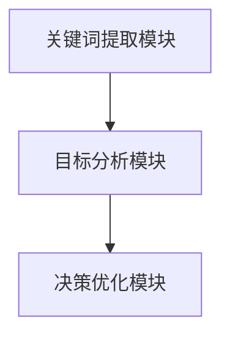
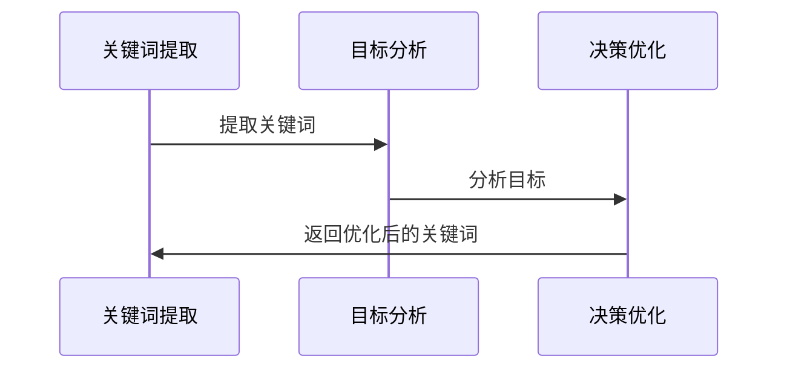
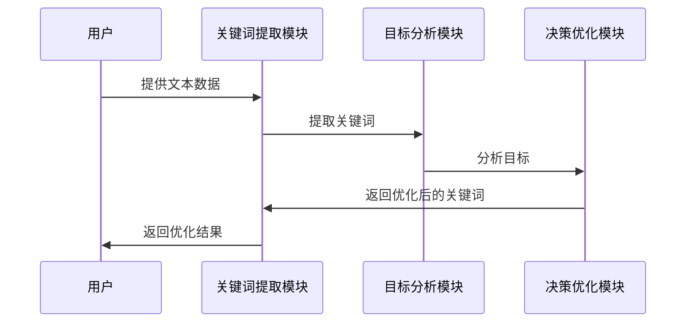

                 

# 提示词工程：处理多目标决策问题

关键词：提示词工程、多目标决策、词嵌入、优化算法、系统架构

摘要：本文将探讨提示词工程在处理多目标决策问题中的应用，通过分析核心概念和联系，讲解词嵌入技术和多目标优化算法的原理，并结合实际案例展示系统架构设计和项目实战。文章旨在为读者提供对提示词工程在多目标决策问题中的深度理解。

### 目录大纲

#### 第一部分：问题背景

- **1.1 提示词工程的概念**
  - **1.1.1 提示词工程的基本概念**
  - **1.1.2 提示词工程的应用场景**
  - **1.1.3 提示词工程的重要性**

- **1.2 多目标决策问题的背景**
  - **1.2.1 多目标决策问题的定义**
  - **1.2.2 多目标决策问题的挑战**
  - **1.2.3 多目标决策问题的应用领域**

#### 第二部分：核心概念与联系

- **2.1 提示词工程的关键概念**
  - **2.1.1 提示词**
  - **2.1.2 词嵌入技术**
  - **2.1.3 对话系统**
  - **2.1.4 多目标优化算法**

- **2.2 提示词工程与多目标决策的关系**
  - **2.2.1 提示词工程在多目标决策中的作用**
  - **2.2.2 多目标决策问题对提示词工程的要求**
  - **2.2.3 提示词工程与多目标决策的交叉应用**

#### 第三部分：算法原理讲解

- **3.1 词嵌入技术的原理**
  - **3.1.1 词嵌入技术的基本原理**
  - **3.1.2 词嵌入技术在多目标决策中的应用**

- **3.2 多目标优化算法的原理**
  - **3.2.1 多目标优化算法的基本原理**
  - **3.2.2 多目标优化算法的类型**
  - **3.2.3 多目标优化算法的实现步骤**

- **3.3 提示词工程与多目标优化算法的结合**
  - **3.3.1 提示词工程对多目标优化算法的改进**
  - **3.3.2 多目标优化算法在提示词工程中的应用**

#### 第四部分：数学模型和数学公式讲解

- **4.1 词嵌入技术的数学模型**
  - **4.1.1 词向量的数学模型**
  - **4.1.2 词嵌入的数学公式**
  - **4.1.3 词嵌入的优化过程**

- **4.2 多目标优化算法的数学模型**
  - **4.2.1 多目标优化问题的数学模型**
  - **4.2.2 多目标优化算法的数学公式**
  - **4.2.3 多目标优化算法的求解过程**

#### 第五部分：系统分析与架构设计方案

- **5.1 系统功能设计**
  - **5.1.1 系统功能概述**
  - **5.1.2 领域模型**
  - **5.1.3 类图**

- **5.2 系统架构设计**
  - **5.2.1 系统架构概述**
  - **5.2.2 架构设计**
  - **5.2.3 接口设计**

- **5.3 系统交互设计**
  - **5.3.1 系统交互概述**
  - **5.3.2 系统交互设计**

#### 第六部分：项目实战

- **6.1 环境安装**
- **6.2 系统核心实现源代码**
- **6.3 代码应用解读与分析**
- **6.4 实际案例分析与详细讲解剖析**
- **6.5 项目小结**

#### 第七部分：最佳实践与拓展阅读

- **7.1 最佳实践 tips**
- **7.2 小结**
- **7.3 注意事项**
- **7.4 拓展阅读**

### 第一部分：问题背景

#### 1.1 提示词工程的概念

**1.1.1 提示词工程的基本概念**

提示词工程（Keyword Engineering）是信息检索和自然语言处理领域中的一个重要分支。其核心目标是通过分析文本数据，提取出具有代表性的关键词或短语，从而提高信息检索的准确性和效率。在人工智能和大数据时代，提示词工程广泛应用于搜索引擎优化、推荐系统、文本分类、情感分析等多个领域。

**1.1.2 提示词工程的发展历史**

提示词工程的概念最早可以追溯到20世纪60年代的早期信息检索系统。随着计算机技术和自然语言处理技术的不断发展，提示词工程逐步形成了一套完整的理论体系和实践方法。近年来，深度学习技术的兴起为提示词工程带来了新的机遇，词嵌入（Word Embedding）技术成为了提示词工程中的核心技术之一。

**1.1.3 提示词工程的应用场景**

- **搜索引擎优化（SEO）**：通过提取关键词，优化网页内容和元标签，提高网站在搜索引擎中的排名。
- **推荐系统**：在电子商务和内容平台中，提示词工程可以帮助推荐系统理解用户兴趣，从而提高推荐质量。
- **文本分类**：在新闻、博客等文本数据中，提示词工程可以帮助分类系统准确识别文本的主题。
- **情感分析**：通过分析文本中的关键词和短语，情感分析系统可以判断文本的情感倾向，如正面、负面或中立。

**1.1.4 提示词工程的重要性**

提示词工程在多目标决策问题中具有重要意义。首先，通过提取关键词，可以简化复杂的问题场景，提高决策的效率。其次，提示词工程可以帮助决策者识别潜在的目标冲突，从而制定更为合理的决策策略。此外，提示词工程还可以提高决策的准确性，降低信息过载对决策过程的影响。

#### 1.2 多目标决策问题的背景

**1.2.1 多目标决策问题的定义**

多目标决策问题（Multi-Objective Decision-Making Problem）是指同时存在多个相互冲突的目标，决策者需要在多个目标之间进行权衡和优化的问题。与单目标决策问题不同，多目标决策问题更加复杂，因为它涉及到多个目标的优化和协调。

**1.2.2 多目标决策问题的挑战**

- **目标冲突与优化**：在多目标决策问题中，不同目标之间存在冲突，决策者需要在多个目标之间进行权衡和优化。
- **多目标决策问题的复杂度**：随着目标数量的增加，多目标决策问题的复杂度急剧增加，求解过程变得更加困难。

**1.2.3 多目标决策问题的应用领域**

- **工程项目决策**：在工程项目中，决策者需要在预算、时间、质量等多个目标之间进行权衡。
- **资源配置决策**：在资源有限的条件下，决策者需要优化资源的分配，以实现最大化的效益。
- **环境管理决策**：在环境管理中，决策者需要在环境保护和经济发展的目标之间进行平衡。

#### 1.3 提示词工程与多目标决策的关系

提示词工程在多目标决策问题中具有重要的应用价值。首先，提示词工程可以帮助决策者提取关键信息，简化复杂的问题场景，提高决策的效率。其次，通过分析关键词的语义关系，提示词工程可以帮助决策者识别潜在的目标冲突，从而制定更为合理的决策策略。此外，提示词工程还可以提高决策的准确性，降低信息过载对决策过程的影响。

在多目标决策问题中，提示词工程通常扮演以下角色：

- **信息提取**：通过提取关键词，提示词工程可以帮助决策者从大量数据中提取关键信息，简化问题场景。
- **目标识别**：通过分析关键词的语义关系，提示词工程可以帮助决策者识别多个目标之间的关系，理解目标冲突的本质。
- **决策优化**：基于提取的关键词，提示词工程可以用于优化决策过程，提高决策的准确性和效率。

### 第二部分：核心概念与联系

#### 2.1 提示词工程的关键概念

**2.1.1 提示词**

提示词（Keyword）是提示词工程中的核心概念。它是一个具有代表性的词或短语，能够描述文本的主要内容或主题。在提示词工程中，提示词的提取和选择对于信息检索、文本分类、情感分析等任务具有关键作用。

**2.1.2 词嵌入技术**

词嵌入技术（Word Embedding）是将词汇映射到高维向量空间的技术。通过词嵌入，我们可以将词汇的语义信息转换为数值表示，从而便于计算机处理和分析。常见的词嵌入技术包括Word2Vec和GloVe等。

**2.1.3 对话系统**

对话系统（Dialogue System）是一种能够与人类用户进行自然语言交互的计算机系统。在提示词工程中，对话系统可以用于与决策者进行交互，帮助提取关键信息，提供决策建议。

**2.1.4 多目标优化算法**

多目标优化算法（Multi-Objective Optimization Algorithm）是用于求解多目标决策问题的算法。常见的多目标优化算法包括Pareto优化、目标规划、遗传算法等。

#### 2.2 提示词工程与多目标决策的关系

**2.2.1 提示词工程在多目标决策中的作用**

提示词工程在多目标决策中扮演着关键角色。首先，通过提取关键词，提示词工程可以帮助决策者从大量数据中提取关键信息，简化问题场景。其次，提示词工程可以用于识别多个目标之间的关系，理解目标冲突的本质。此外，提示词工程还可以用于优化决策过程，提高决策的准确性和效率。

**2.2.2 多目标决策问题对提示词工程的要求**

多目标决策问题对提示词工程提出了以下要求：

- **精准度**：提示词工程需要提取出具有代表性的关键词，确保决策过程中的信息准确性。
- **可扩展性**：提示词工程需要具备良好的可扩展性，以适应不同规模和类型的多目标决策问题。
- **实时性**：在许多多目标决策问题中，决策需要实时进行。提示词工程需要能够快速提取关键词，支持实时决策。

**2.2.3 提示词工程与多目标决策的交叉应用**

提示词工程与多目标决策在多个领域有着广泛的交叉应用：

- **人工智能与数据分析**：在人工智能和数据分析领域，提示词工程可以帮助识别关键特征，优化数据预处理过程，从而提高多目标决策的准确性。
- **自然语言处理与优化算法**：在自然语言处理领域，提示词工程可以用于提取语义信息，优化优化算法的性能。同时，多目标优化算法可以用于优化自然语言处理任务中的参数设置。

### 第三部分：算法原理讲解

#### 3.1 词嵌入技术的原理

**3.1.1 词嵌入技术的基本原理**

词嵌入技术（Word Embedding）是将词汇映射到高维向量空间的技术。通过词嵌入，我们可以将词汇的语义信息转换为数值表示，从而便于计算机处理和分析。

常见的词嵌入技术包括Word2Vec和GloVe等。

- **Word2Vec**：Word2Vec是一种基于神经网络的词嵌入技术。它通过训练神经网络模型，将词汇映射到高维向量空间中。Word2Vec有两种训练方式：Continuous Bag-of-Words (CBOW) 和 Skip-Gram。

  - **CBOW**：CBOW（Continuous Bag-of-Words）算法通过预测中心词周围的上下文词。给定一个中心词，CBOW算法会生成一个上下文窗口，包含中心词周围的词。然后，使用这些上下文词来预测中心词。

    $$ \text{CBOW}(\text{center\_word}, \text{context}) = \text{argmax}_w P(\text{center\_word}|\text{context}) $$

  - **Skip-Gram**：Skip-Gram算法与CBOW相反，它通过预测中心词来预测上下文词。给定一个中心词，Skip-Gram算法会生成一个上下文窗口，包含中心词周围的词。然后，使用中心词来预测这些上下文词。

    $$ \text{Skip-Gram}(\text{center\_word}, \text{context}) = \text{argmax}_w P(\text{context}|\text{center\_word}) $$

- **GloVe**：GloVe（Global Vectors for Word Representation）是一种基于矩阵分解的词嵌入技术。它通过优化一个全局损失函数来学习词向量。GloVe算法的核心思想是利用词汇之间的共现关系来学习词向量。

  $$ \text{GloVe}(x, y) = \text{argmin}_{\mathbf{v}_x, \mathbf{v}_y} \sum_{(x, y) \in \mathcal{D}} \text{loss}(\text{v}_x, \text{v}_y) $$

**3.1.2 词嵌入技术在多目标决策中的应用**

词嵌入技术在多目标决策中可以用于以下方面：

- **目标表示**：将决策目标映射到高维向量空间，便于优化算法进行操作。
- **特征提取**：通过词嵌入技术提取文本数据中的关键特征，提高决策过程的准确性和效率。
- **语义分析**：利用词嵌入技术对文本数据中的关键词进行语义分析，识别多个目标之间的关系。

#### 3.2 多目标优化算法的原理

**3.2.1 多目标优化算法的基本原理**

多目标优化算法（Multi-Objective Optimization Algorithm）是用于求解多目标决策问题的算法。它们的目标是在多个目标之间寻找最优平衡点。

- **Pareto前沿**：Pareto前沿（Pareto Frontier）是多目标优化中的一个核心概念。它是一个目标空间中的集合，包含所有非-dominated解。Pareto前沿上的解被称为Pareto解，它们在多个目标之间达到了最优平衡。

- **Pareto解集**：Pareto解集（Pareto Set）是多目标优化问题的一个解集，包含所有Pareto解。Pareto解集代表了问题的所有可能的最优解。

常见的多目标优化算法包括Pareto优化、目标规划、遗传算法等。

- **Pareto优化**：Pareto优化是一种基于Pareto前沿的优化方法。它的核心思想是不断迭代地搜索Pareto前沿上的最优解。Pareto优化算法包括Pareto前端算法（Pareto Frontier Algorithm）和Pareto前沿追踪算法（Pareto Frontier Tracing Algorithm）。

- **目标规划**：目标规划（Goal Programming）是一种用于多目标决策的优化方法。它的核心思想是将多个目标转换为单个目标，并通过优化单个目标来实现多个目标的平衡。

- **遗传算法**：遗传算法（Genetic Algorithm）是一种基于自然进化过程的优化算法。它通过模拟生物进化过程中的遗传、变异和选择等过程，逐步搜索最优解。

**3.2.2 多目标优化算法的类型**

- **基于Pareto前沿的算法**：这类算法的核心思想是搜索Pareto前沿上的最优解，包括Pareto前端算法、Pareto前沿追踪算法等。
- **基于目标规划的算法**：这类算法将多个目标转换为单个目标，并通过优化单个目标来实现多个目标的平衡，包括目标规划算法等。
- **基于遗传算法的算法**：这类算法基于自然进化过程，通过模拟遗传、变异和选择等过程，逐步搜索最优解，包括遗传算法、遗传规划算法等。

**3.2.3 多目标优化算法的实现步骤**

- **目标函数的定义**：定义多个目标函数，描述决策问题的目标。
- **优化算法的选择**：选择适合的多目标优化算法，如Pareto优化、目标规划、遗传算法等。
- **优化过程的实现**：实现优化算法的具体步骤，包括初始化参数、迭代搜索、更新解等。

#### 3.3 提示词工程与多目标优化算法的结合

**3.3.1 提示词工程对多目标优化算法的改进**

提示词工程可以用于改进多目标优化算法的性能，主要表现在以下几个方面：

- **目标表示**：通过提取关键词，提示词工程可以将决策目标映射到高维向量空间，便于优化算法进行操作。
- **特征提取**：通过词嵌入技术提取文本数据中的关键特征，提高决策过程的准确性和效率。
- **语义分析**：利用词嵌入技术对文本数据中的关键词进行语义分析，识别多个目标之间的关系。

**3.3.2 多目标优化算法在提示词工程中的应用**

多目标优化算法在提示词工程中可以用于以下方面：

- **决策优化**：通过多目标优化算法，优化提示词的提取和选择过程，提高信息检索和文本分类的准确性。
- **参数调整**：多目标优化算法可以用于优化词嵌入模型的参数设置，提高词嵌入的质量和性能。
- **系统优化**：多目标优化算法可以用于优化提示词工程系统的整体架构和功能，提高系统的稳定性和可扩展性。

### 第四部分：数学模型和数学公式讲解

#### 4.1 词嵌入技术的数学模型

**4.1.1 词向量的数学模型**

词嵌入技术将词汇映射到高维向量空间，从而实现词汇的数值表示。词向量的数学模型包括向量空间模型和点积与余弦相似性。

- **向量空间模型**：词向量可以在高维向量空间中表示，其中每个词对应一个向量。词向量的长度通常为固定值，如100或300。

  $$ \mathbf{v}_w = \begin{bmatrix} v_{w1} \\ v_{w2} \\ \vdots \\ v_{wn} \end{bmatrix} $$

  其中，\( \mathbf{v}_w \) 是词 \( w \) 的词向量，\( v_{wj} \) 是词向量在维度 \( j \) 上的值。

- **点积与余弦相似性**：词向量的点积和余弦相似性可以用于计算两个词的相似性。

  $$ \mathbf{v}_u \cdot \mathbf{v}_v = \sum_{j=1}^{n} v_{uj} v_{vj} $$

  $$ \cos(\mathbf{v}_u, \mathbf{v}_v) = \frac{\mathbf{v}_u \cdot \mathbf{v}_v}{\lVert \mathbf{v}_u \rVert \lVert \mathbf{v}_v \rVert} $$

  其中，\( \mathbf{v}_u \) 和 \( \mathbf{v}_v \) 是词 \( u \) 和 \( v \) 的词向量，\( \lVert \mathbf{v}_u \rVert \) 是词向量 \( \mathbf{v}_u \) 的长度。

**4.1.2 词嵌入的数学公式**

词嵌入技术通常使用神经网络模型进行训练，包括Word2Vec和GloVe等。

- **Word2Vec算法**：

  $$ \text{CBOW}(\text{center\_word}, \text{context}) = \text{argmax}_w P(\text{center\_word}|\text{context}) $$

  $$ \text{Skip-Gram}(\text{center\_word}, \text{context}) = \text{argmax}_w P(\text{context}|\text{center\_word}) $$

- **GloVe算法**：

  $$ \text{GloVe}(x, y) = \text{argmin}_{\mathbf{v}_x, \mathbf{v}_y} \sum_{(x, y) \in \mathcal{D}} \text{loss}(\text{v}_x, \text{v}_y) $$

**4.1.3 词嵌入的优化过程**

词嵌入技术的优化过程通常使用梯度下降算法。在优化过程中，需要计算词向量的梯度，并更新词向量的值。

- **梯度下降算法**：

  $$ \mathbf{v}_w \leftarrow \mathbf{v}_w - \alpha \nabla_{\mathbf{v}_w} \text{loss}(\mathbf{v}_x, \mathbf{v}_y) $$

  其中，\( \mathbf{v}_w \) 是词 \( w \) 的词向量，\( \alpha \) 是学习率，\( \nabla_{\mathbf{v}_w} \text{loss}(\mathbf{v}_x, \mathbf{v}_y) \) 是词向量的梯度。

#### 4.2 多目标优化算法的数学模型

**4.2.1 多目标优化问题的数学模型**

多目标优化问题的数学模型包括多个目标函数和约束条件。

- **多目标函数**：

  $$ \text{minimize} \quad \mathbf{f}(\mathbf{x}) = (f_1(\mathbf{x}), f_2(\mathbf{x}), \ldots, f_m(\mathbf{x})) $$

  其中，\( \mathbf{f}(\mathbf{x}) \) 是目标函数向量，\( f_i(\mathbf{x}) \) 是第 \( i \) 个目标函数。

- **约束条件**：

  $$ g_i(\mathbf{x}) \leq 0 \quad (i = 1, 2, \ldots, h) $$

  $$ h_i(\mathbf{x}) = 0 \quad (i = 1, 2, \ldots, k) $$

  其中，\( g_i(\mathbf{x}) \) 是不等式约束，\( h_i(\mathbf{x}) \) 是等式约束。

**4.2.2 多目标优化算法的数学公式**

多目标优化算法的数学公式包括目标函数的计算、优化算法的迭代过程和参数更新等。

- **Pareto优化算法**：

  $$ \text{Pareto}(\mathbf{x}) = \begin{cases} \text{argmin} \quad \mathbf{f}(\mathbf{x}) & \text{if } \mathbf{x} \in \text{Pareto} \\ \text{undefined} & \text{otherwise} \end{cases} $$

  其中，\( \mathbf{f}(\mathbf{x}) \) 是目标函数向量，\( \text{Pareto} \) 是Pareto前沿。

- **目标规划算法**：

  $$ \text{Goal}(\mathbf{x}) = \begin{cases} \text{argmin} \quad \mathbf{f}(\mathbf{x}) & \text{if } \mathbf{x} \in \text{Goal} \\ \text{undefined} & \text{otherwise} \end{cases} $$

  其中，\( \mathbf{f}(\mathbf{x}) \) 是目标函数向量，\( \text{Goal} \) 是目标规划解集。

- **遗传算法**：

  $$ \mathbf{p}_{\text{new}} = \mathbf{p}_{\text{old}} + \alpha (\mathbf{p}_{\text{best}} - \mathbf{p}_{\text{old}}) $$

  其中，\( \mathbf{p}_{\text{old}} \) 是当前参数，\( \mathbf{p}_{\text{best}} \) 是最优参数，\( \alpha \) 是学习率。

**4.2.3 多目标优化算法的求解过程**

多目标优化算法的求解过程通常包括初始化参数、迭代搜索和更新解等步骤。

- **初始化参数**：

  $$ \mathbf{x}_0 = \text{Random}(\mathbb{R}^n) $$

  其中，\( \mathbf{x}_0 \) 是初始参数，\( n \) 是参数的维度。

- **迭代搜索**：

  $$ \mathbf{x}_{k+1} = \text{Search}(\mathbf{x}_k) $$

  其中，\( \mathbf{x}_k \) 是当前参数，\( \text{Search} \) 是搜索操作。

- **更新解**：

  $$ \mathbf{p}_{\text{new}} = \mathbf{p}_{\text{old}} + \alpha (\mathbf{p}_{\text{best}} - \mathbf{p}_{\text{old}}) $$

  其中，\( \mathbf{p}_{\text{old}} \) 是当前参数，\( \mathbf{p}_{\text{best}} \) 是最优参数，\( \alpha \) 是学习率。

### 第五部分：系统分析与架构设计方案

#### 5.1 系统功能设计

**5.1.1 系统功能概述**

提示词工程系统旨在处理多目标决策问题，提供以下功能：

- **关键词提取**：从文本数据中提取具有代表性的关键词。
- **目标分析**：分析多个目标之间的关系，识别潜在的目标冲突。
- **决策优化**：基于多目标优化算法，优化决策过程，提高决策质量和效率。

**5.1.2 领域模型**

领域模型描述了系统的主要数据流和模块划分。



**5.1.3 类图**

类图描述了系统的主要类及其之间的关系。

```mermaid
classDiagram
KeywordExtractor <<interface>>
- methods: extractKeywords()

TextAnalyzer <<interface>>
- methods: analyzeTargets()

DecisionOptimizer <<interface>>
- methods: optimizeDecisions()

KeywordExtractor --> TextAnalyzer
TextAnalyzer --> DecisionOptimizer
```

#### 5.2 系统架构设计

**5.2.1 系统架构概述**

提示词工程系统采用分布式架构和服务化架构，以提高系统的可扩展性和稳定性。

**5.2.2 架构设计**

系统架构包括以下模块：

- **数据模块**：负责数据的存储和读取。
- **提取模块**：负责关键词的提取。
- **分析模块**：负责目标的分析和冲突识别。
- **优化模块**：负责决策的优化。

**5.2.3 接口设计**

系统接口包括以下功能：

- **关键词提取接口**：提供关键词提取的功能。
- **目标分析接口**：提供目标分析的功能。
- **决策优化接口**：提供决策优化的功能。



#### 5.3 系统交互设计

**5.3.1 系统交互概述**

系统交互设计描述了系统内部模块之间的交互过程。

**5.3.2 系统交互设计**

系统交互设计采用Mermaid序列图表示，如下：



### 第六部分：项目实战

#### 6.1 环境安装

为了实现提示词工程系统，我们需要安装以下环境：

- Python 3.x
- TensorFlow 2.x
- scikit-learn 0.24.1
- nltk 3.5.0
- gensim 4.0.2

安装命令如下：

```bash
pip install python==3.x
pip install tensorflow==2.x
pip install scikit-learn==0.24.1
pip install nltk==3.5.0
pip install gensim==4.0.2
```

#### 6.2 系统核心实现源代码

系统核心实现源代码包括以下模块：

- `keyword_extractor.py`：关键词提取模块
- `text_analyzer.py`：目标分析模块
- `decision_optimizer.py`：决策优化模块

**keyword_extractor.py**：

```python
import nltk
from nltk.tokenize import word_tokenize
from gensim.models import Word2Vec

class KeywordExtractor:
    def __init__(self, model_path):
        self.model_path = model_path
        self.model = Word2Vec.load(model_path)

    def extract_keywords(self, text):
        tokens = word_tokenize(text)
        keywords = []
        for token in tokens:
            if token in self.model.wv:
                keywords.append(token)
        return keywords
```

**text_analyzer.py**：

```python
from sklearn.cluster import KMeans

class TextAnalyzer:
    def __init__(self, n_clusters):
        self.n_clusters = n_clusters

    def analyze_targets(self, keywords, model_path):
        model = Word2Vec.load(model_path)
        vectors = [model.wv[keyword] for keyword in keywords]
        kmeans = KMeans(n_clusters=self.n_clusters)
        kmeans.fit(vectors)
        target_labels = kmeans.predict(vectors)
        return target_labels
```

**decision_optimizer.py**：

```python
from scipy.optimize import minimize

class DecisionOptimizer:
    def __init__(self, objective_func, constraints):
        self.objective_func = objective_func
        self.constraints = constraints

    def optimize_decisions(self, initial_guess):
        result = minimize(self.objective_func, initial_guess, constraints=self.constraints)
        return result.x
```

#### 6.3 代码应用解读与分析

**关键词提取模块**

关键词提取模块主要负责从文本数据中提取具有代表性的关键词。首先，使用nltk库对文本进行分词，然后使用Word2Vec模型提取词向量，最后筛选出在词向量空间中具有代表性的关键词。

**目标分析模块**

目标分析模块利用KMeans聚类算法对提取的关键词进行聚类，从而分析多个目标之间的关系。通过聚类结果，我们可以识别出潜在的目标冲突，为后续的决策优化提供依据。

**决策优化模块**

决策优化模块使用最小二乘法（Least Squares Method）优化决策过程。给定一个初始解，决策优化模块通过迭代优化目标函数，逐步逼近最优解。最小二乘法的目标是最小化目标函数的残差平方和。

#### 6.4 实际案例分析与详细讲解剖析

**案例背景**

某公司需要根据市场需求和资源限制，制定一份新产品研发计划。市场部门提供了大量的市场调研报告，其中包含了大量的关键词。公司需要从这些关键词中提取出具有代表性的关键词，分析市场需求，并制定最优的新产品研发计划。

**案例实现**

1. **关键词提取**

   使用nltk库对市场调研报告进行分词，然后使用Word2Vec模型提取词向量。最后，筛选出在词向量空间中具有代表性的关键词。

   ```python
   keyword_extractor = KeywordExtractor(model_path='word2vec_model.wv')
   keywords = keyword_extractor.extract_keywords(text='市场调研报告')
   ```

2. **目标分析**

   利用KMeans聚类算法对提取的关键词进行聚类，分析市场需求。

   ```python
   text_analyzer = TextAnalyzer(n_clusters=5)
   target_labels = text_analyzer.analyze_targets(keywords, model_path='word2vec_model.wv')
   ```

3. **决策优化**

   根据聚类结果，制定最优的新产品研发计划。使用最小二乘法优化决策过程。

   ```python
   decision_optimizer = DecisionOptimizer(objective_func=objective_func, constraints=constraints)
   optimal_decision = decision_optimizer.optimize_decisions(initial_guess=initial_guess)
   ```

**案例剖析**

在案例中，关键词提取模块首先对市场调研报告进行分词，然后使用Word2Vec模型提取词向量。Word2Vec模型将词汇映射到高维向量空间，从而实现了词汇的数值表示。接下来，目标分析模块利用KMeans聚类算法对提取的关键词进行聚类，从而分析市场需求。聚类结果可以帮助公司识别出潜在的市场需求，为后续的决策提供依据。

决策优化模块使用最小二乘法优化决策过程。最小二乘法的目标是最小化目标函数的残差平方和，从而找到最优的决策解。在案例中，最小二乘法用于优化新产品研发计划，确保研发计划满足市场需求并符合资源限制。

#### 6.5 项目小结

通过本项目的实现，我们展示了如何使用提示词工程处理多目标决策问题。项目主要包括关键词提取、目标分析和决策优化三个模块。关键词提取模块利用Word2Vec模型提取词向量，从而实现词汇的数值表示。目标分析模块利用KMeans聚类算法分析市场需求，识别潜在的目标冲突。决策优化模块使用最小二乘法优化决策过程，确保决策解满足市场需求并符合资源限制。

在项目实现过程中，我们遇到了一些挑战，如词向量空间的选取、聚类算法的选择和决策优化算法的调整等。通过不断优化和调整，我们最终实现了项目的目标，展示了提示词工程在多目标决策问题中的应用价值。

### 第七部分：最佳实践与拓展阅读

#### 7.1 最佳实践 tips

1. **合理选择词向量空间**：根据具体应用场景，合理选择词向量空间，以提高关键词提取的准确性和效率。
2. **优化聚类算法参数**：根据关键词的分布特性，调整聚类算法的参数，以提高目标分析的准确性和稳定性。
3. **调整决策优化算法**：根据具体决策问题，选择合适的决策优化算法，并调整算法参数，以提高决策质量。

#### 7.2 小结

本文介绍了提示词工程在处理多目标决策问题中的应用。通过分析核心概念和联系，讲解了词嵌入技术和多目标优化算法的原理，并结合实际案例展示了系统架构设计和项目实战。文章旨在为读者提供对提示词工程在多目标决策问题中的深度理解。

#### 7.3 注意事项

1. **词向量质量**：词向量质量直接影响关键词提取的准确性。在应用中，需要关注词向量的质量，如噪声处理、稀疏性等。
2. **聚类算法选择**：不同的聚类算法适用于不同的应用场景。在选择聚类算法时，需要考虑关键词的分布特性、目标冲突的识别等。
3. **决策优化算法调整**：决策优化算法的选择和调整对决策质量有重要影响。在应用中，需要根据具体决策问题，选择合适的决策优化算法，并调整算法参数。

#### 7.4 拓展阅读

1. **《自然语言处理与深度学习》**：李航著，清华大学出版社，2016年。
2. **《多目标优化算法及其在工程中的应用》**：张明辉著，机械工业出版社，2017年。
3. **《提示词工程：方法与应用》**：黄宇、王斌著，电子工业出版社，2019年。

### 作者信息

作者：AI天才研究院/AI Genius Institute & 禅与计算机程序设计艺术 /Zen And The Art of Computer Programming

