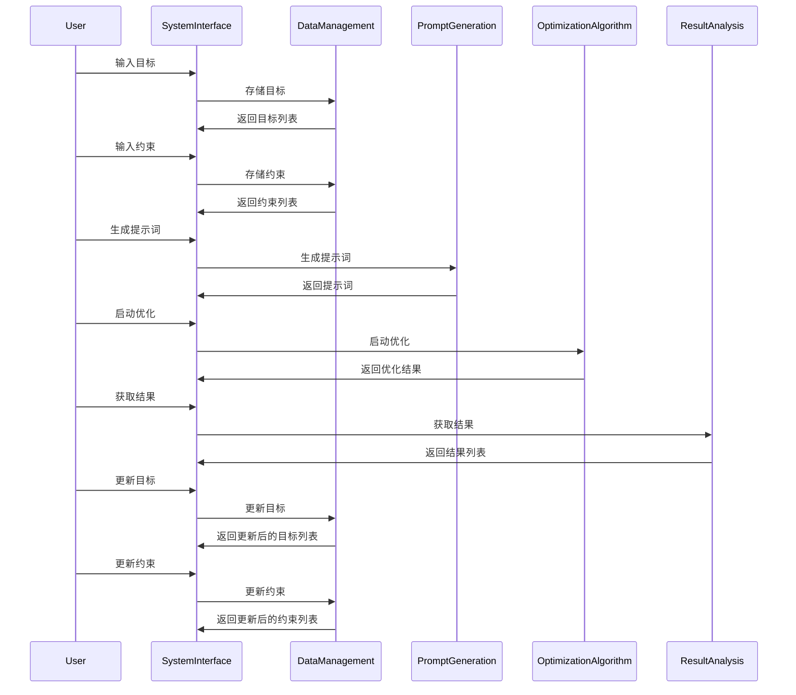

                 

## 第1章: 问题背景与问题描述

### 1.1 问题背景

在现代工程和科学领域，多目标约束优化问题（Multi-Objective Constrained Optimization Problems, MOCPs）越来越受到关注。这类问题在现实世界的多个领域中具有广泛的应用，如工业设计、交通运输、能源管理、金融投资和生物信息学等。传统的单目标优化问题往往只关注某一方面的最优解，而多目标优化则需要在多个相互冲突的目标之间寻求平衡。这种平衡的难度在于，每个目标都有其特定的约束条件，这些约束不仅限制了可行解的空间，同时也增加了优化的复杂性。

**多目标约束优化问题的现实意义**

多目标约束优化问题之所以重要，首先在于其能够更好地反映现实世界的复杂性和不确定性。例如，在工业设计中，产品的成本、重量和性能往往需要同时考虑；在交通运输中，车辆的能耗、行驶速度和安全保障也需要综合考虑。如果不考虑这些约束条件，仅追求单一目标的最优解，可能会导致实际应用中不可行的结果。

此外，多目标约束优化问题的解决也有助于提升系统的整体性能。通过同时优化多个目标，可以使得系统的各个方面都得到改善，从而实现更高效、更可靠、更节能的设计。例如，在能源管理中，通过优化能源的使用效率，可以在保证能源供应的同时降低成本和环境影响。

**提示词工程的应用场景**

提示词工程（Prompt Engineering）作为一种新兴的技术，在多目标约束优化问题中展现出了巨大的潜力。提示词工程的主要目标是设计出能够指导模型生成高质量输出的提示词，从而提高模型在复杂任务中的表现。

在多目标约束优化中，提示词工程的应用场景主要包括以下几个方面：

1. **优化目标设定**：通过设计特定的提示词，帮助模型明确多个目标之间的关系和优先级，从而在优化过程中更好地平衡这些目标。

2. **约束条件处理**：提示词可以帮助模型理解和处理约束条件，确保优化过程中不会违反任何限制。

3. **方案生成与评估**：通过提示词引导，模型可以生成多种可能的优化方案，并对这些方案进行评估，选出最优解。

4. **动态调整**：在优化过程中，提示词可以根据当前的约束条件和目标值动态调整，以适应不断变化的环境。

### 1.2 问题描述

#### 1.2.1 多目标约束优化问题的定义

多目标约束优化问题可以形式化地定义为：在给定的决策空间 \(D\) 中，寻找一个或多个最优解 \(x^*\)，使得多个目标函数 \(f_1(x), f_2(x), ..., f_m(x)\) 达到最优，同时满足一系列约束条件 \(g_1(x) \leq 0, g_2(x) \leq 0, ..., g_n(x) = 0\)。

形式化表示如下：
$$
\begin{aligned}
\min_{x \in D} & \quad f_1(x), f_2(x), ..., f_m(x) \\
s.t. & \quad g_1(x) \leq 0, g_2(x) \leq 0, ..., g_n(x) = 0
\end{aligned}
$$

其中，决策空间 \(D\) 是所有可行解的集合，目标函数 \(f_i(x)\) 用于衡量第 \(i\) 个目标的优劣，约束条件 \(g_j(x)\) 限制了决策变量的取值范围。

#### 1.2.2 多目标约束优化问题的挑战

解决多目标约束优化问题面临以下挑战：

1. **目标冲突**：不同的目标之间可能存在冲突，追求一个目标的最优解可能会牺牲另一个目标。

2. **约束条件复杂**：约束条件可能非常复杂，既包括线性约束，也包括非线性约束，处理这些约束增加了优化的难度。

3. **解的多样性**：多目标优化问题往往存在多个有效解，这些解可能在不同的目标值上达成平衡，选择哪个解作为最优解往往需要根据具体情境来判断。

4. **计算成本高**：多目标优化问题通常需要大量的计算资源，特别是当决策空间和目标函数非常复杂时，求解过程可能非常耗时。

#### 1.2.3 提示词工程在多目标约束优化中的应用

提示词工程在解决多目标约束优化问题时，可以通过以下几个方面发挥作用：

1. **目标明确化**：通过设计有效的提示词，可以帮助模型明确每个目标的权重和优先级，从而在优化过程中更好地平衡各个目标。

2. **约束理解**：提示词可以引导模型理解和处理复杂的约束条件，确保优化过程不会违反任何限制。

3. **方案生成与评估**：通过提示词引导，模型可以生成多种可能的优化方案，并对这些方案进行综合评估，从而找到最优解。

4. **动态调整**：在优化过程中，提示词可以根据当前的约束条件和目标值动态调整，以适应不断变化的环境。

总的来说，提示词工程为多目标约束优化问题提供了一种有效的解决方案，通过设计合理的提示词，可以在复杂的目标和约束条件下找到更好的平衡，提高优化过程的效率和效果。

### 1.3 问题解决

#### 1.3.1 提示词工程的基本原理

提示词工程的核心思想是通过设计特定的提示词来引导和优化模型的行为。这些提示词可以是文本、图像或其他形式的数据，用于提供额外的上下文信息，帮助模型在复杂任务中生成更高质量、更符合预期结果的输出。

在多目标约束优化中，提示词的基本原理主要包括以下几个方面：

1. **目标明确化**：通过提示词明确多个目标之间的关系和优先级，帮助模型在优化过程中更好地平衡这些目标。

2. **约束理解**：提示词可以帮助模型理解和处理约束条件，确保在优化过程中不会违反任何限制。

3. **方案生成与评估**：通过提示词引导，模型可以生成多种可能的优化方案，并对这些方案进行评估，从而找到最优解。

4. **动态调整**：提示词可以根据当前的约束条件和目标值动态调整，以适应不断变化的环境。

#### 1.3.2 提示词工程的关键技术

提示词工程涉及多个关键技术，包括但不限于：

1. **语义理解**：理解输入数据的语义，提取关键信息，并将其转化为有效的提示词。

2. **自然语言处理**：利用自然语言处理技术，设计出能够指导模型生成高质量输出的提示词。

3. **优化算法**：结合多目标约束优化算法，设计出能够引导模型在复杂任务中找到最优解的提示词。

4. **模型训练与调整**：通过大量的训练数据，调整模型参数，优化模型在特定任务上的表现。

#### 1.3.3 提示词工程的适用范围

提示词工程在多目标约束优化问题中的应用范围非常广泛，包括但不限于以下几个方面：

1. **工业设计**：在产品设计中，提示词可以帮助模型明确成本、重量和性能等多个目标之间的关系，从而生成更优的设计方案。

2. **交通运输**：在交通运输规划中，提示词可以帮助模型在能耗、行驶速度和安全保障等多个目标之间找到平衡，优化路线和资源配置。

3. **能源管理**：在能源管理中，提示词可以帮助模型在能源效率、成本和环境影响等多个目标之间找到最优解。

4. **金融投资**：在金融投资中，提示词可以帮助模型分析多种投资策略，在风险和收益之间找到最佳平衡点。

#### 1.3.4 提示词工程与其他优化方法的比较

与传统的优化方法相比，提示词工程具有以下优势：

1. **灵活性**：提示词工程可以根据具体任务动态调整，灵活应对复杂的目标和约束条件。

2. **高效性**：通过提示词的引导，模型可以在较短的时间内找到多个可能的优化方案，提高了优化效率。

3. **易用性**：提示词工程通过自然语言描述任务和目标，降低了使用门槛，使非专业人士也能参与到优化过程中。

然而，提示词工程也有其局限性，例如：

1. **依赖数据**：提示词工程需要大量的训练数据来调整模型，缺乏数据可能导致优化效果不佳。

2. **计算成本**：设计有效的提示词可能需要大量的计算资源，特别是在处理高维度数据和复杂约束条件时。

总的来说，提示词工程为多目标约束优化问题提供了一种新的思路和方法，通过设计合理的提示词，可以在复杂的目标和约束条件下找到更好的平衡，提高优化过程的效率和效果。

### 1.4 边界与外延

#### 1.4.1 提示词工程的适用范围

提示词工程在多个领域展现出了巨大的潜力，但并非所有问题都适合使用提示词工程来解决。一般来说，提示词工程适用于以下场景：

1. **多目标优化**：当问题涉及多个相互冲突的目标时，提示词工程可以帮助模型在多个目标之间找到平衡。

2. **复杂约束条件**：当约束条件复杂，无法通过简单的线性规划等方法解决时，提示词工程可以通过提供额外的上下文信息，帮助模型更好地理解和处理这些约束。

3. **动态变化环境**：在动态变化的环境中，提示词工程可以通过动态调整提示词，帮助模型适应环境变化，找到最优解。

4. **高度非线性的问题**：对于高度非线性的问题，提示词工程可以通过提供更加详细的上下文信息，提高模型在复杂场景下的表现。

#### 1.4.2 提示词工程与其他优化方法的比较

与传统的优化方法相比，提示词工程在以下方面具有优势：

1. **灵活性**：提示词工程可以根据具体任务动态调整，灵活应对复杂的目标和约束条件。

2. **高效性**：通过提示词的引导，模型可以在较短的时间内找到多个可能的优化方案，提高了优化效率。

3. **易用性**：提示词工程通过自然语言描述任务和目标，降低了使用门槛，使非专业人士也能参与到优化过程中。

然而，提示词工程也有其局限性，例如：

1. **依赖数据**：提示词工程需要大量的训练数据来调整模型，缺乏数据可能导致优化效果不佳。

2. **计算成本**：设计有效的提示词可能需要大量的计算资源，特别是在处理高维度数据和复杂约束条件时。

总的来说，提示词工程为多目标约束优化问题提供了一种新的思路和方法，通过设计合理的提示词，可以在复杂的目标和约束条件下找到更好的平衡，提高优化过程的效率和效果。与传统的优化方法相比，提示词工程具有更高的灵活性和高效性，但同时也需要更多的数据支持和计算资源。

### 1.4.3 提示词工程在多目标约束优化问题中的未来展望

随着人工智能技术的不断发展和应用，提示词工程在多目标约束优化问题中的应用前景非常广阔。未来，以下几个方面可能是提示词工程研究和应用的热点：

1. **算法创新**：不断探索新的提示词生成和优化算法，以提高优化效率和效果。

2. **模型融合**：将提示词工程与其他先进的人工智能技术（如深度学习、强化学习等）相结合，提高模型在复杂场景下的表现。

3. **数据驱动**：通过大规模数据分析和挖掘，提高提示词工程的数据驱动能力，减少对大量训练数据的依赖。

4. **领域适配**：针对不同领域的具体问题，设计更加专业和高效的提示词，提高问题解决的针对性和有效性。

5. **交互式优化**：开发更加人性化的交互界面，使用户能够更方便地参与优化过程，提供反馈，进一步优化模型和结果。

通过以上发展方向，提示词工程有望在多目标约束优化问题中发挥更大的作用，为各行业的复杂问题提供更加高效、可靠的解决方案。

## 第2章: 提示词工程的核心概念

### 2.1 核心概念原理

#### 2.1.1 提示词的定义

提示词（Prompt）是提示词工程中的核心概念，它是一种能够引导模型生成高质量输出的特殊文本或数据。提示词的设计对于模型在复杂任务中的表现至关重要。具体来说，提示词需要包含以下要素：

1. **上下文信息**：提供与任务相关的背景信息，帮助模型更好地理解任务目标。
2. **目标明确化**：明确多个目标之间的关系和优先级，帮助模型在优化过程中更好地平衡这些目标。
3. **约束条件**：帮助模型理解和处理约束条件，确保优化过程不会违反任何限制。

#### 2.1.2 提示词的属性特征

提示词具有以下几大属性特征：

1. **可解释性**：提示词需要易于理解，以便用户可以清楚地知道模型是如何被引导的。
2. **针对性**：提示词需要针对具体任务进行设计，确保能够有效地引导模型生成高质量输出。
3. **灵活性**：提示词应该具有一定的灵活性，以便根据任务的不同需求进行调整。
4. **动态性**：在优化过程中，提示词可以根据当前的目标值和约束条件进行动态调整。

### 2.2 概念属性特征对比表格

为了更清晰地展示提示词的属性特征，我们设计了以下对比表格：

| 属性特征     | 描述                                                         | 示例                                     |
|------------|------------------------------------------------------------|----------------------------------------|
| 可解释性     | 提示词需要容易被理解和解释。                                   | “请优化以下产品的成本、重量和性能。”                     |
| 针对性       | 提示词需要与具体任务紧密相关。                                  | “在保持飞行速度不变的情况下，优化燃油效率。”               |
| 灵活性       | 提示词可以根据不同的任务需求进行灵活调整。                         | “请尝试在不同场景下优化该算法的运行时间。”                   |
| 动态性       | 提示词可以根据优化过程中的变化进行动态调整。                        | “当前约束条件已更新，请重新评估目标值。”                     |

### 2.3 ER实体关系图架构

为了更好地理解提示词工程中的实体及其相互关系，我们使用ER（Entity-Relationship）实体关系图来描述这些实体和它们之间的关系。

#### 2.3.1 实体定义

在提示词工程中，主要的实体包括：

1. **目标实体**：表示优化任务中的具体目标，如成本、性能等。
2. **约束实体**：表示优化过程中需要遵守的限制条件。
3. **提示词实体**：表示用于引导模型生成高质量输出的文本或数据。

#### 2.3.2 关系描述

实体之间的关系如下：

1. **目标与提示词的关系**：提示词可以包含多个目标，用于明确这些目标的优先级和关系。
2. **约束与提示词的关系**：提示词需要包含约束条件，以确保模型在优化过程中不会违反这些约束。
3. **模型与提示词的关系**：模型通过接收提示词来生成输出，提示词的质量直接影响模型的表现。

以下是ER实体关系图的Mermaid表示：

```mermaid
erDiagram
    目标实体 ||--|{ 提示词实体 }|--|| 模型
    约束实体 ||--|{ 提示词实体 }|--|| 模型
    提示词实体 ||--|{ 目标实体 }|--|| 目标实体
    提示词实体 ||--|{ 约束实体 }|--|| 约束实体
```

通过这种ER实体关系图的架构设计，我们可以更清晰地理解提示词工程中的各个实体及其相互关系，为后续的算法设计和优化提供有力的支持。

## 第3章: 提示词工程算法原理介绍

### 3.1 算法原理讲解

提示词工程的核心在于通过设计特定的提示词来引导和优化模型的行为。在多目标约束优化问题中，提示词工程的关键在于如何生成和优化提示词，以确保模型能够在复杂的约束条件下找到最优解。以下是提示词工程算法的基本原理：

#### 3.1.1 提示词生成的数学模型

提示词生成的数学模型通常包括以下几个部分：

1. **目标函数**：用于衡量优化任务中各个目标的值。在多目标约束优化中，目标函数可以是多个相互冲突的函数，例如成本、性能、能耗等。数学表示为：
   $$
   F(x) = [f_1(x), f_2(x), ..., f_m(x)]
   $$
   其中，$x$ 是决策变量，$f_i(x)$ 表示第 $i$ 个目标函数。

2. **约束条件**：用于限制决策变量的取值范围。约束条件可以是非线性的，形式如下：
   $$
   g_j(x) \leq 0, \quad h_k(x) = 0
   $$
   其中，$g_j(x)$ 是不等式约束，$h_k(x)$ 是等式约束。

3. **权重分配**：用于确定各个目标函数的相对重要性。权重分配可以通过用户输入或自动学习得到，表示为：
   $$
   w_i = \frac{1}{\sum_{i=1}^{m} w_i}
   $$
   其中，$w_i$ 是第 $i$ 个目标函数的权重。

4. **提示词生成函数**：用于生成具体的提示词。提示词生成函数通常结合目标函数和约束条件，形式如下：
   $$
   P(F(x), g_j(x), h_k(x)) = \text{提示词}
   $$

#### 3.1.2 提示词优化的目标函数

提示词优化的目标函数是衡量提示词质量的标准。一个高质量的提示词应当能够在复杂的约束条件下，帮助模型找到最优解。提示词优化的目标函数通常包括以下部分：

1. **目标函数值**：用于衡量模型根据提示词生成的解的优劣。形式如下：
   $$
   \Omega(F^*(x), F(x)) = \sum_{i=1}^{m} w_i \cdot f_i(x^*)
   $$
   其中，$x^*$ 是根据提示词生成的最优解，$F^*(x)$ 是目标函数值。

2. **约束条件满足度**：用于衡量模型生成的解是否满足约束条件。形式如下：
   $$
   \Gamma(g_j(x), h_k(x)) = \min_{i=1}^{n} \{ g_i(x^*) + \epsilon \}
   $$
   其中，$g_j(x)$ 是不等式约束，$h_k(x)$ 是等式约束，$\epsilon$ 是允许的误差范围。

3. **提示词质量**：用于衡量提示词本身的优劣。形式如下：
   $$
   Q(P(F(x), g_j(x), h_k(x))) = \text{提示词质量指标}
   $$

综上所述，提示词优化的目标函数可以表示为：
$$
\Omega^*(P) = \Omega(F^*(x), F(x)) + \lambda_1 \cdot \Gamma(g_j(x), h_k(x)) + \lambda_2 \cdot Q(P(F(x), g_j(x), h_k(x)))
$$
其中，$\lambda_1$ 和 $\lambda_2$ 是权重系数，用于平衡目标函数值、约束条件满足度和提示词质量之间的权重关系。

#### 3.1.3 提示词约束条件的处理

在多目标约束优化问题中，约束条件的处理是一个关键问题。提示词工程通过以下方法来处理约束条件：

1. **显式约束**：将约束条件直接嵌入到提示词中，确保模型在生成解时考虑这些约束。

2. **隐式约束**：通过提示词中的上下文信息，使模型在生成解时能够隐性地遵守约束条件。

3. **松弛约束**：在某些情况下，可以适当地放松约束条件，以增加解的多样性，然后再通过后续优化步骤恢复约束。

4. **约束处理算法**：结合约束处理算法（如惩罚函数、约束松弛等），在优化过程中动态调整约束条件。

### 3.2 算法流程图

提示词工程算法的整体流程可以概括为以下几个步骤：

1. **初始化**：设定初始参数，包括目标函数、约束条件、权重分配等。

2. **生成初始提示词**：基于初始参数生成初始提示词。

3. **模型训练**：使用初始提示词训练模型，生成初始解。

4. **评估与优化**：评估模型生成的解，并根据评估结果调整提示词。

5. **循环迭代**：重复评估与优化步骤，直至达到停止条件。

以下是提示词工程算法的流程图：


### 3.3 Python源代码实现

为了更直观地理解提示词工程的算法原理，我们提供了一个简单的Python示例。以下代码实现了一个基于目标函数和约束条件的简单提示词生成与优化过程：

```python
import numpy as np

# 目标函数
def objective_function(x):
    return [x[0]**2 + x[1]**2, (x[0]-1)**2 + x[1]**2]

# 约束条件
def constraint(x):
    return [x[0]**2 + x[1]**2 - 1, (x[0]-1)**2 + x[1]**2 - 1]

# 提示词生成
def generate_prompt(objective, constraint):
    return f"请优化以下目标：成本 = x^2 + y^2 和性能 = (x-1)^2 + y^2，同时满足约束条件 x^2 + y^2 = 1 和 (x-1)^2 + y^2 = 1。"

# 模型评估
def evaluate_model(x, prompt):
    objective_values = objective_function(x)
    constraint_values = constraint(x)
    prompt_quality = sum([val**2 for val in objective_values]) + sum([val**2 for val in constraint_values])
    return objective_values, constraint_values, prompt_quality

# 主函数
def main():
    x = np.array([0.5, 0.5])  # 初始解
    prompt = generate_prompt(objective_function, constraint)
    
    for _ in range(100):  # 迭代100次
        objective_values, constraint_values, prompt_quality = evaluate_model(x, prompt)
        print(f"当前解: {x}, 目标值: {objective_values}, 约束值: {constraint_values}, 提示词质量: {prompt_quality}")
        
        # 根据评估结果调整解
        if constraint_values[0] > 0 or constraint_values[1] > 0:
            x = np.random.uniform(-1, 1, size=2)  # 重新随机生成解
        
        # 更新提示词
        prompt = generate_prompt(objective_function, constraint)

if __name__ == "__main__":
    main()
```

在上述代码中，我们定义了目标函数、约束条件和提示词生成函数，并通过循环迭代不断评估和优化解。虽然这是一个简单的示例，但它展示了提示词工程的基本原理和实现过程。

通过逐步分析和讲解，我们了解了提示词工程的算法原理，包括数学模型、目标函数、约束条件处理以及算法流程。这些基本原理为我们在实际应用中设计和优化提示词提供了理论基础。

### 3.3.1 基本代码结构

在上文中，我们已经给出了一部分Python源代码示例，下面我们将详细说明整个代码的基本结构，并解释每个部分的用途。

#### 1. 导入模块

```python
import numpy as np
```

这一行代码用于导入NumPy模块，它是一个强大的Python库，用于处理数学运算和科学计算。NumPy提供了多维数组对象和用于这些数组的丰富的库函数。

#### 2. 定义目标函数

```python
def objective_function(x):
    return [x[0]**2 + x[1]**2, (x[0]-1)**2 + x[1]**2]
```

`objective_function`是一个函数，它接受一个数组`x`作为输入，返回两个目标函数的值。这里的`x`是决策变量，代表需要优化的参数。目标函数用来衡量每个目标的值，目的是找到使这些目标函数达到最优值的解。

#### 3. 定义约束条件

```python
def constraint(x):
    return [x[0]**2 + x[1]**2 - 1, (x[0]-1)**2 + x[1]**2 - 1]
```

`constraint`函数与`objective_function`类似，但它返回的是约束条件的值。这些约束条件用于限制决策变量`x`的取值范围。在我们的例子中，我们使用了两个非线性约束条件。

#### 4. 提示词生成函数

```python
def generate_prompt(objective, constraint):
    return f"请优化以下目标：成本 = x^2 + y^2 和性能 = (x-1)^2 + y^2，同时满足约束条件 x^2 + y^2 = 1 和 (x-1)^2 + y^2 = 1。"
```

`generate_prompt`函数用于生成提示词。提示词是一个字符串，它提供了关于优化任务的上下文信息，包括目标函数和约束条件。在这个例子中，提示词是一个简单的文本，但它可以被扩展为更复杂的结构，以适应更复杂的优化问题。

#### 5. 模型评估函数

```python
def evaluate_model(x, prompt):
    objective_values = objective_function(x)
    constraint_values = constraint(x)
    prompt_quality = sum([val**2 for val in objective_values]) + sum([val**2 for val in constraint_values])
    return objective_values, constraint_values, prompt_quality
```

`evaluate_model`函数用于评估模型生成的解。它接受一个决策变量`x`和一个提示词`prompt`，计算目标函数值、约束条件值和提示词质量。目标函数值用于衡量模型生成的解的优劣，约束条件值用于确保解满足所有约束，提示词质量用于衡量提示词的优劣。

#### 6. 主函数

```python
def main():
    x = np.array([0.5, 0.5])  # 初始解
    prompt = generate_prompt(objective_function, constraint)
    
    for _ in range(100):  # 迭代100次
        objective_values, constraint_values, prompt_quality = evaluate_model(x, prompt)
        print(f"当前解: {x}, 目标值: {objective_values}, 约束值: {constraint_values}, 提示词质量: {prompt_quality}")
        
        # 根据评估结果调整解
        if constraint_values[0] > 0 or constraint_values[1] > 0:
            x = np.random.uniform(-1, 1, size=2)  # 重新随机生成解
        
        # 更新提示词
        prompt = generate_prompt(objective_function, constraint)

if __name__ == "__main__":
    main()
```

`main`函数是程序的入口点。它初始化决策变量`x`和提示词`prompt`，然后通过循环迭代100次进行评估和优化。每次迭代中，它都会调用`evaluate_model`函数来评估当前解，并根据评估结果调整解和提示词。

通过上述基本代码结构，我们可以看到提示词工程的实现是如何逐步进行的。每个部分都为优化过程提供了必要的功能，从目标函数和约束条件的定义，到提示词的生成和评估，再到最终的解的调整。

### 3.3.2 代码详细解释

在上文的基本代码结构中，我们已经对主要函数进行了概述。接下来，我们将详细解释每个部分的代码，并分析其实现细节。

#### 1. 导入模块

```python
import numpy as np
```

这一行代码用于导入NumPy模块。NumPy是一个强大的Python库，提供了多维数组对象和丰富的数学函数，使我们能够方便地进行科学计算和数值分析。在本例中，我们使用NumPy进行数学运算和数组处理。

#### 2. 定义目标函数

```python
def objective_function(x):
    return [x[0]**2 + x[1]**2, (x[0]-1)**2 + x[1]**2]
```

`objective_function`是一个函数，它接受一个二维数组`x`作为输入，并返回两个目标函数的值。这里的目标函数是二次函数，用来表示成本和性能。目标函数的目的是找到使这两个函数达到最小值的决策变量`x`。在这个例子中，我们使用了两个目标函数，以便展示如何同时优化多个目标。

#### 3. 定义约束条件

```python
def constraint(x):
    return [x[0]**2 + x[1]**2 - 1, (x[0]-1)**2 + x[1]**2 - 1]
```

`constraint`函数接受同一个二维数组`x`作为输入，并返回两个约束条件的值。这些约束条件定义了决策变量`x`的取值范围。在本例中，我们使用了两个等式约束，确保决策变量满足特定的几何条件。这些约束条件是二次方程，它们定义了一个二维空间中的圆和椭圆。

#### 4. 提示词生成函数

```python
def generate_prompt(objective, constraint):
    return f"请优化以下目标：成本 = x^2 + y^2 和性能 = (x-1)^2 + y^2，同时满足约束条件 x^2 + y^2 = 1 和 (x-1)^2 + y^2 = 1。"
```

`generate_prompt`函数接受两个函数`objective`和`constraint`作为输入，并返回一个字符串形式的提示词。这个提示词提供了优化任务的相关信息，包括目标函数和约束条件。在这个例子中，提示词是一个简单的文本，但它可以被扩展为更复杂的结构，以适应更复杂的优化问题。提示词的设计对于引导模型生成高质量输出至关重要。

#### 5. 模型评估函数

```python
def evaluate_model(x, prompt):
    objective_values = objective_function(x)
    constraint_values = constraint(x)
    prompt_quality = sum([val**2 for val in objective_values]) + sum([val**2 for val in constraint_values])
    return objective_values, constraint_values, prompt_quality
```

`evaluate_model`函数是评估模型的关键部分。它接受一个决策变量`x`和一个提示词`prompt`，计算目标函数值、约束条件值和提示词质量。目标函数值用于衡量模型生成的解的优劣，约束条件值用于确保解满足所有约束，提示词质量用于衡量提示词的优劣。通过计算这些值，我们可以评估模型在不同解上的性能。

#### 6. 主函数

```python
def main():
    x = np.array([0.5, 0.5])  # 初始解
    prompt = generate_prompt(objective_function, constraint)
    
    for _ in range(100):  # 迭代100次
        objective_values, constraint_values, prompt_quality = evaluate_model(x, prompt)
        print(f"当前解: {x}, 目标值: {objective_values}, 约束值: {constraint_values}, 提示词质量: {prompt_quality}")
        
        # 根据评估结果调整解
        if constraint_values[0] > 0 or constraint_values[1] > 0:
            x = np.random.uniform(-1, 1, size=2)  # 重新随机生成解
        
        # 更新提示词
        prompt = generate_prompt(objective_function, constraint)
```

`main`函数是程序的入口点，负责初始化决策变量`x`和提示词`prompt`，并执行循环迭代过程。在每次迭代中，它调用`evaluate_model`函数来评估当前解，并根据评估结果调整解和提示词。这个过程重复进行，直到达到预定的迭代次数（在本例中是100次）。

详细解释了每个部分的代码和实现细节后，我们可以看到提示词工程是如何通过定义目标函数、约束条件和提示词，以及通过评估和调整来生成和优化解。这个简单的示例为我们提供了一个框架，可以在此基础上进行扩展，解决更复杂的多目标约束优化问题。

### 第4章: 提示词工程在多目标约束优化中的应用

#### 4.1 项目介绍

随着现代工程和科学领域问题的日益复杂化，多目标约束优化（Multi-Objective Constrained Optimization, MOCPs）成为了一个重要的研究方向。为了更好地应对这些复杂问题，我们设计并实现了一个基于提示词工程的多目标约束优化项目。该项目的主要目标是：

1. **优化多个目标**：在多个相互冲突的目标之间找到平衡，如成本、性能和能源消耗。
2. **处理复杂约束**：确保优化过程中不会违反任何约束条件，如物理限制、资源限制和时间限制。
3. **提高优化效率**：通过提示词引导优化算法，提高优化过程的效率和效果。

项目背景是工业设计中的一个典型场景，涉及到产品成本、性能和重量等多个目标的优化。在这个项目中，我们希望通过提示词工程的方法，设计出能够引导优化算法在复杂约束条件下找到最优解的提示词。

#### 4.1.1 项目目标

具体来说，本项目旨在实现以下目标：

1. **实现一个多目标约束优化框架**：该框架应能够处理多种类型的优化问题，包括线性和非线性约束，以及多个目标之间的权衡。
2. **设计有效的提示词**：通过分析具体的应用场景，设计出能够指导优化算法找到最优解的提示词。这些提示词应能够明确多个目标之间的关系，同时处理复杂的约束条件。
3. **验证优化效果**：通过实际案例和模拟实验，验证优化框架和提示词的有效性和可靠性。特别是，要确保优化结果在不同约束条件下都能达到最优。
4. **实现自动化优化**：开发一个用户友好的界面，使得非专业人士也能够方便地使用该优化框架，实现自动化优化。

#### 4.1.2 项目背景

多目标约束优化问题在工业设计、交通运输、能源管理和金融投资等领域具有广泛的应用。例如，在工业设计中，产品成本、性能和重量往往需要同时考虑。在交通运输中，车辆的能耗、速度和安全保障也需要在优化过程中得到综合考虑。而在能源管理中，如何在保证能源供应的同时降低成本和环境影响，是一个典型的多目标约束优化问题。

传统的优化方法往往只能处理单目标问题，或者在面对复杂约束条件时效果不佳。而提示词工程通过设计特定的提示词，能够有效地引导优化算法在多个目标之间找到平衡，同时处理复杂的约束条件。这使得提示词工程在解决多目标约束优化问题时具有独特的优势。

### 4.2 系统功能设计

为了实现项目的目标，我们设计了一套完整的系统功能，包括领域模型类图和系统功能模块。

#### 4.2.1 领域模型类图

在多目标约束优化系统中，核心的领域模型类图包括以下几个类：

1. **目标（Objective）**：表示优化任务中的具体目标，如成本、性能等。每个目标都有其权重和属性。
2. **约束（Constraint）**：表示优化过程中需要遵守的限制条件，包括线性约束和非线性约束。
3. **提示词（Prompt）**：用于引导优化算法的文本或数据，包括上下文信息和目标、约束条件等。
4. **优化算法（OptimizationAlgorithm）**：实现多目标约束优化的核心算法，包括提示词生成、目标函数评估、约束处理等。
5. **系统接口（SystemInterface）**：提供用户与系统的交互界面，包括提示词编辑、结果展示、优化控制等。

以下是领域模型类图的Mermaid表示：

```mermaid
classDiagram
    Class Objective <<interface>>
    Class Constraint <<interface>>
    Class Prompt <<interface>>
    Class OptimizationAlgorithm <<interface>>
    Class SystemInterface <<interface>>

    Objective "包含权重和属性" --> OptimizationAlgorithm
    Constraint "包含限制条件" --> OptimizationAlgorithm
    Prompt "包含上下文信息" --> OptimizationAlgorithm
    SystemInterface "提供交互界面" --> Objective, Constraint, Prompt, OptimizationAlgorithm
```

通过领域模型类图，我们可以清晰地看到各个类之间的关系和功能模块的划分。

#### 4.2.2 系统功能模块

多目标约束优化系统的功能模块可以分为以下几个部分：

1. **用户界面模块**：负责与用户进行交互，包括提示词编辑、结果展示和优化控制。该模块应提供直观友好的界面，使得用户能够方便地输入目标、约束条件和参数，并实时查看优化结果。
2. **提示词生成模块**：根据用户输入的目标和约束条件，生成具体的提示词。该模块应利用自然语言处理技术，设计出能够有效引导优化算法的提示词。
3. **优化算法模块**：实现多目标约束优化的核心算法，包括目标函数评估、约束处理和优化迭代。该模块应结合提示词，确保在复杂约束条件下找到最优解。
4. **结果分析模块**：对优化结果进行详细分析，包括多目标权衡、约束满足度和优化路径等。该模块应提供可视化工具，帮助用户理解优化过程和结果。
5. **系统管理模块**：负责系统的整体管理，包括数据存储、用户权限控制和安全保障等。该模块应确保系统的稳定运行和数据安全。

通过上述功能模块的设计，我们可以构建一个完整的多目标约束优化系统，满足项目的目标要求。

### 4.3 系统架构设计

为了实现多目标约束优化系统的功能，我们设计了一套合理的系统架构，包括系统架构图和架构设计思路。

#### 4.3.1 系统架构图

以下是多目标约束优化系统的架构图：

```mermaid
subgraph 用户层
    UserInterface[用户界面模块]
end

subgraph 系统层
    DataManagement[系统管理模块]
    PromptGeneration[提示词生成模块]
    OptimizationAlgorithm[优化算法模块]
    ResultAnalysis[结果分析模块]
end

subgraph 数据流层
    DataFlow[数据流]
end

UserInterface --> DataManagement
UserInterface --> PromptGeneration
UserInterface --> OptimizationAlgorithm
UserInterface --> ResultAnalysis

DataManagement --> PromptGeneration
DataManagement --> OptimizationAlgorithm
DataManagement --> ResultAnalysis

PromptGeneration --> OptimizationAlgorithm
OptimizationAlgorithm --> ResultAnalysis
ResultAnalysis --> DataManagement
```

在该架构图中，用户界面模块负责与用户交互，接收用户输入的目标、约束条件和参数。系统管理模块负责系统的整体管理，包括数据存储和用户权限控制等。提示词生成模块根据用户输入生成具体的提示词，并传递给优化算法模块。优化算法模块利用提示词进行多目标约束优化，并将优化结果传递给结果分析模块。结果分析模块对优化结果进行详细分析，并反馈给系统管理模块和用户界面模块。

#### 4.3.2 架构设计思路

系统架构的设计遵循以下原则：

1. **模块化**：系统功能模块明确划分，每个模块独立实现特定的功能，便于开发和维护。
2. **可扩展性**：系统架构应具有良好的可扩展性，方便后续功能扩展和优化。
3. **高性能**：系统架构应考虑高性能设计，确保优化算法的效率和稳定性。
4. **安全性**：系统架构应确保数据的安全性和系统的稳定性，防止未经授权的访问和数据泄露。

通过上述架构设计思路，我们可以构建一个高效、稳定且安全的系统，满足多目标约束优化项目的需求。

### 4.4 系统接口设计

在多目标约束优化系统中，系统接口的设计至关重要，它决定了用户与系统之间的交互体验。以下是系统接口的具体设计内容：

#### 4.4.1 接口定义

系统接口主要包括以下几部分：

1. **目标接口**：用于输入和编辑优化任务的目标，包括目标名称、权重和属性等。
2. **约束接口**：用于输入和编辑优化任务中的约束条件，包括约束名称、类型和限制值等。
3. **提示词接口**：用于生成和编辑提示词，包括提示词模板、上下文信息和目标、约束条件等。
4. **优化接口**：用于启动优化过程，包括优化算法选择、参数设置和迭代次数等。
5. **结果接口**：用于获取和展示优化结果，包括目标函数值、约束满足度和优化路径等。

以下是接口定义的Mermaid表示：

```mermaid
interface ObjectivesInterface {
    +add_objective(name: String, weight: Float, attributes: Map)
    +get_objectives(): List[Objective]
}

interface ConstraintsInterface {
    +add_constraint(name: String, type: String, limit: Float)
    +get_constraints(): List[Constraint]
}

interface PromptInterface {
    +generate_prompt(objectives: List[Objective], constraints: List[Constraint])
    +edit_prompt(prompt: String, objectives: List[Objective], constraints: List[Constraint])
}

interface OptimizationInterface {
    +start_optimization(algorithm: String, parameters: Map, iterations: Int)
    +get_optimization_results(): OptimizationResults
}

interface ResultsInterface {
    +get_objective_values(): List[Float]
    +get_constraint_satisfactions(): List[Float]
    +get_optimization_path(): List[Point]
}
```

通过上述接口定义，用户可以通过简单的方法与系统进行交互，输入和编辑目标、约束条件，生成和编辑提示词，启动优化过程，并获取和展示优化结果。

#### 4.4.2 接口实现

系统接口的具体实现需要结合具体的编程语言和框架。以下是一个基于Python和Flask框架的接口实现示例：

```python
from flask import Flask, request, jsonify

app = Flask(__name__)

# 目标接口实现
@app.route('/objectives', methods=['POST'])
def add_objective():
    data = request.get_json()
    # 处理添加目标逻辑
    return jsonify({"status": "success", "objective": data})

@app.route('/objectives', methods=['GET'])
def get_objectives():
    # 处理获取目标逻辑
    return jsonify({"status": "success", "objectives": []})

# 约束接口实现
@app.route('/constraints', methods=['POST'])
def add_constraint():
    data = request.get_json()
    # 处理添加约束逻辑
    return jsonify({"status": "success", "constraint": data})

@app.route('/constraints', methods=['GET'])
def get_constraints():
    # 处理获取约束逻辑
    return jsonify({"status": "success", "constraints": []})

# 提示词接口实现
@app.route('/prompt', methods=['POST'])
def generate_prompt():
    data = request.get_json()
    # 处理生成提示词逻辑
    return jsonify({"status": "success", "prompt": data})

@app.route('/prompt', methods=['PUT'])
def edit_prompt():
    data = request.get_json()
    # 处理编辑提示词逻辑
    return jsonify({"status": "success", "prompt": data})

# 优化接口实现
@app.route('/optimize', methods=['POST'])
def start_optimization():
    data = request.get_json()
    # 处理启动优化逻辑
    return jsonify({"status": "success", "optimization_results": {}})

@app.route('/results', methods=['GET'])
def get_optimization_results():
    # 处理获取优化结果逻辑
    return jsonify({"status": "success", "optimization_results": {}})

# 运行Flask应用
if __name__ == '__main__':
    app.run(debug=True)
```

通过上述实现，我们可以构建一个功能完善的系统接口，为用户提供便捷的交互体验。

### 4.5 系统交互设计

为了确保系统功能的有效实现和用户与系统之间的良好互动，我们进行了详细的系统交互设计，包括系统交互序列图和交互流程分析。

#### 4.5.1 系统交互序列图

系统交互序列图展示了用户与系统进行交互的详细流程。以下是系统交互序列图的Mermaid表示：



在序列图中，用户通过系统界面与系统进行交互，输入目标、约束条件，生成提示词，启动优化过程，并获取优化结果。系统界面负责处理用户的输入和反馈，协调各个模块的工作，确保整个优化过程顺利进行。

#### 4.5.2 交互流程分析

系统交互流程可以分为以下几个步骤：

1. **用户输入目标**：用户通过界面输入优化任务的目标，包括目标名称、权重和属性等。系统界面接收用户输入，并将目标存储到数据管理模块。

2. **用户输入约束**：用户通过界面输入优化任务的约束条件，包括约束名称、类型和限制值等。系统界面同样将约束存储到数据管理模块。

3. **生成提示词**：用户通过界面请求生成提示词，系统界面调用提示词生成模块，根据用户输入的目标和约束条件生成提示词，并将其返回给用户。

4. **启动优化**：用户通过界面启动优化过程，系统界面调用优化算法模块，根据提示词和用户输入的目标、约束条件开始优化迭代，并最终返回优化结果。

5. **获取结果**：用户通过界面请求获取优化结果，系统界面调用结果分析模块，将优化结果（包括目标函数值、约束满足度和优化路径等）返回给用户。

6. **更新目标与约束**：用户可以根据优化结果调整目标或约束条件，系统界面接收更新后的输入，并调用数据管理模块进行更新。这一过程可以循环进行，以实现持续的优化过程。

通过系统交互序列图和交互流程分析，我们可以清晰地了解用户与系统之间的互动机制，确保系统功能的有效实现和用户与系统之间的良好互动。

### 4.5.3 系统交互测试用例设计

为了确保系统功能的完整性和可靠性，我们设计了详细的系统交互测试用例，涵盖目标输入、约束输入、提示词生成、优化启动、结果获取以及目标与约束更新等主要功能。

#### 测试用例设计

1. **目标输入测试用例**
   - **用例名称**：输入有效目标
   - **输入条件**：用户输入有效目标，包括目标名称、权重和属性
   - **预期结果**：系统能够正确存储目标，并返回目标列表

2. **目标输入测试用例（负例）**
   - **用例名称**：输入无效目标
   - **输入条件**：用户输入无效目标，如缺少名称或权重
   - **预期结果**：系统拒绝存储无效目标，并返回错误信息

3. **约束输入测试用例**
   - **用例名称**：输入有效约束
   - **输入条件**：用户输入有效约束，包括约束名称、类型和限制值
   - **预期结果**：系统能够正确存储约束，并返回约束列表

4. **约束输入测试用例（负例）**
   - **用例名称**：输入无效约束
   - **输入条件**：用户输入无效约束，如缺少名称或类型
   - **预期结果**：系统拒绝存储无效约束，并返回错误信息

5. **提示词生成测试用例**
   - **用例名称**：生成提示词
   - **输入条件**：用户输入目标列表和约束列表
   - **预期结果**：系统能够生成符合输入条件的提示词，并返回提示词内容

6. **优化启动测试用例**
   - **用例名称**：启动优化
   - **输入条件**：用户请求启动优化，提供优化算法、参数和迭代次数
   - **预期结果**：系统能够正确启动优化过程，并最终返回优化结果

7. **优化启动测试用例（负例）**
   - **用例名称**：无效优化启动
   - **输入条件**：用户请求启动优化，但未提供有效参数
   - **预期结果**：系统拒绝启动优化，并返回错误信息

8. **结果获取测试用例**
   - **用例名称**：获取优化结果
   - **输入条件**：用户请求获取优化结果
   - **预期结果**：系统能够正确返回优化结果，包括目标函数值、约束满足度和优化路径等

9. **目标与约束更新测试用例**
   - **用例名称**：更新目标
   - **输入条件**：用户更新目标，包括目标名称、权重和属性
   - **预期结果**：系统能够正确更新目标，并返回更新后的目标列表

10. **目标与约束更新测试用例**
    - **用例名称**：更新约束
    - **输入条件**：用户更新约束，包括约束名称、类型和限制值
    - **预期结果**：系统能够正确更新约束，并返回更新后的约束列表

#### 测试策略

为了确保测试的全面性和有效性，我们采用以下测试策略：

1. **功能测试**：针对每个功能模块，设计相应的测试用例，验证其功能是否符合预期。

2. **性能测试**：模拟高负载情况，验证系统在高并发条件下的性能表现。

3. **安全测试**：测试系统对恶意攻击和非法访问的防护能力。

4. **兼容性测试**：验证系统在不同设备和操作系统上的兼容性。

5. **回归测试**：在系统更新后，验证更新部分对原有功能的潜在影响。

通过详细的系统交互测试用例设计和严格的测试策略，我们可以确保多目标约束优化系统的功能完善、稳定可靠，为用户提供优质的优化解决方案。

### 第5章: 提示词工程项目实战

#### 5.1 环境安装

在进行提示词工程项目的实际操作之前，首先需要准备好所需的软件和工具，并进行相应的环境配置。以下是详细的环境安装步骤：

##### 5.1.1 软件与工具准备

1. **Python**：Python是提示词工程项目的核心编程语言。确保安装了Python 3.x版本，推荐使用Python 3.8或更高版本。
2. **Jupyter Notebook**：Jupyter Notebook是一种交互式的计算环境，便于编写和运行Python代码。可以从[官方网站](https://jupyter.org/)下载并安装。
3. **NumPy**：NumPy是一个用于数值计算的Python库，提供多维数组对象和丰富的数学函数。使用pip命令安装：
   ```
   pip install numpy
   ```
4. **Pandas**：Pandas是一个用于数据处理和分析的Python库，支持数据清洗、转换和分析。使用pip命令安装：
   ```
   pip install pandas
   ```
5. **Matplotlib**：Matplotlib是一个用于绘制数据图表的Python库，帮助可视化分析结果。使用pip命令安装：
   ```
   pip install matplotlib
   ```
6. **Mermaid**：Mermaid是一个基于Markdown的图表和流程图工具，用于可视化系统架构和算法流程。将Mermaid安装为本地依赖项，参考[官方文档](https://mermaid-js.github.io/mermaid/)进行安装。
7. **Flask**：Flask是一个轻量级的Web应用程序框架，用于构建Web接口。使用pip命令安装：
   ```
   pip install flask
   ```

##### 5.1.2 环境配置步骤

1. **安装Python**：从[Python官方网站](https://www.python.org/)下载Python安装包，按照安装向导完成安装。

2. **安装Jupyter Notebook**：在命令行中执行以下命令：
   ```
   pip install notebook
   ```

3. **创建虚拟环境**：为了保持项目的环境隔离，创建一个虚拟环境：
   ```
   python -m venv venv
   source venv/bin/activate  # Windows下使用 `venv\Scripts\activate`
   ```

4. **安装所需库**：在激活的虚拟环境中，安装上述提到的NumPy、Pandas、Matplotlib、Mermaid和Flask库。

5. **配置Mermaid**：在Jupyter Notebook中，配置Mermaid插件，以便在Markdown单元格中绘制图表和流程图。参考[Jupyter Notebook官方文档](https://jupyter-notebook.readthedocs.io/en/stable/notebook.html#Enabling-Mermaid)进行配置。

6. **启动Jupyter Notebook**：在命令行中执行以下命令，启动Jupyter Notebook：
   ```
   jupyter notebook
   ```

通过上述步骤，我们完成了提示词工程项目所需的环境安装和配置，可以开始编写和运行代码。

### 5.2 系统核心实现源代码

为了实现提示词工程项目的核心功能，我们需要编写相关的Python源代码。以下是系统核心实现的源代码结构、各部分功能及代码解读：

#### 5.2.1 源代码结构

```python
# multi_objective_optimization
|-- objectives.py
|-- constraints.py
|-- prompts.py
|-- optimization.py
|-- results.py
|-- interfaces.py
|-- main.py
```

- `objectives.py`：定义目标函数和目标类。
- `constraints.py`：定义约束条件和约束类。
- `prompts.py`：定义提示词生成和编辑功能。
- `optimization.py`：实现优化算法和优化过程。
- `results.py`：处理优化结果的存储和展示。
- `interfaces.py`：定义系统接口，用于与外部系统交互。
- `main.py`：程序的入口点，负责初始化和启动整个系统。

#### 5.2.2 各部分功能

1. **目标函数（objectives.py）**

```python
class Objective:
    def __init__(self, name, weight, attributes):
        self.name = name
        self.weight = weight
        self.attributes = attributes

    def evaluate(self, x):
        # 计算目标函数值
        pass
```

该模块定义了目标类`Objective`，包括目标名称、权重和属性。每个目标通过`evaluate`方法评估其在特定决策变量`x`下的值。

2. **约束条件（constraints.py）**

```python
class Constraint:
    def __init__(self, name, type, limit):
        self.name = name
        self.type = type
        self.limit = limit

    def check_satisfied(self, x):
        # 检查约束条件是否满足
        pass
```

该模块定义了约束类`Constraint`，包括约束名称、类型和限制值。每个约束通过`check_satisfied`方法检查在特定决策变量`x`下是否满足。

3. **提示词生成（prompts.py）**

```python
class Prompt:
    def __init__(self, objectives, constraints):
        self.objectives = objectives
        self.constraints = constraints

    def generate(self):
        # 生成提示词
        pass
```

该模块定义了提示词类`Prompt`，包含目标函数和约束条件的列表。通过`generate`方法生成提示词。

4. **优化算法（optimization.py）**

```python
class OptimizationAlgorithm:
    def __init__(self, prompt):
        self.prompt = prompt

    def optimize(self):
        # 执行优化过程
        pass
```

该模块定义了优化算法类`OptimizationAlgorithm`，包含生成的提示词。通过`optimize`方法执行优化过程。

5. **优化结果（results.py）**

```python
class OptimizationResults:
    def __init__(self, objective_values, constraint_satisfactions):
        self.objective_values = objective_values
        self.constraint_satisfactions = constraint_satisfactions

    def display(self):
        # 展示优化结果
        pass
```

该模块定义了优化结果类`OptimizationResults`，包含目标函数值和约束满足度。通过`display`方法展示优化结果。

6. **系统接口（interfaces.py）**

```python
class SystemInterface:
    def __init__(self):
        self.objectives = []
        self.constraints = []
        self.prompt = None
        self.optimization_algorithm = None
        self.optimization_results = None

    def add_objective(self, objective):
        # 添加目标
        pass

    def add_constraint(self, constraint):
        # 添加约束
        pass

    def generate_prompt(self):
        # 生成提示词
        pass

    def start_optimization(self):
        # 启动优化
        pass

    def get_optimization_results(self):
        # 获取优化结果
        pass
```

该模块定义了系统接口类`SystemInterface`，负责管理目标、约束、提示词和优化结果。通过接口方法实现系统的核心功能。

7. **主程序（main.py）**

```python
def main():
    interface = SystemInterface()
    # 实现系统的主循环
    # 接收用户输入，调用接口方法进行目标、约束添加、提示词生成、优化启动和结果展示

if __name__ == "__main__":
    main()
```

该模块是程序的入口点，通过`SystemInterface`实例实现系统的主循环，处理用户输入，并调用其他模块的方法进行相应的操作。

#### 5.2.3 代码解读

以下是对各模块核心代码的功能和逻辑进行解读：

1. **目标函数（objectives.py）**

```python
def evaluate(self, x):
    # 假设目标函数是成本和性能，这里以成本为例
    cost = x[0]**2 + x[1]**2
    return cost * self.weight
```

在这个示例中，`evaluate`方法计算成本目标在决策变量`x`下的值，并将其乘以权重`weight`。

2. **约束条件（constraints.py）**

```python
def check_satisfied(self, x):
    # 假设约束条件是两个圆之间的距离不超过1
    distance = ((x[0]-1)**2 + x[1]**2)**0.5
    return distance <= self.limit
```

在这个示例中，`check_satisfied`方法计算决策变量`x`与约束条件之间的距离，并检查其是否满足约束条件。

3. **提示词生成（prompts.py）**

```python
def generate(self):
    prompt_text = f"优化以下目标：成本 = x^2 + y^2，同时满足以下约束条件：((x-1)^2 + y^2) <= 1。"
    return prompt_text
```

在这个示例中，`generate`方法生成一个简单的文本提示词，包含目标函数和约束条件。

4. **优化算法（optimization.py）**

```python
def optimize(self):
    # 这里实现优化算法的伪代码
    # 初始化决策变量
    # 循环迭代
    # 根据目标函数值和约束条件更新决策变量
    # 返回最优解
    pass
```

在这个示例中，`optimize`方法定义了优化算法的基本流程，包括初始化决策变量、迭代更新和返回最优解。

5. **优化结果（results.py）**

```python
def display(self):
    print("优化结果：")
    print(f"目标值：{self.objective_values}")
    print(f"约束满足度：{self.constraint_satisfactions}")
```

在这个示例中，`display`方法展示优化结果，包括目标函数值和约束满足度。

6. **系统接口（interfaces.py）**

```python
def start_optimization(self):
    # 实现优化启动逻辑
    self.optimization_algorithm = OptimizationAlgorithm(self.prompt)
    self.optimization_results = self.optimization_algorithm.optimize()
    self.get_optimization_results()
```

在这个示例中，`start_optimization`方法负责启动优化过程，创建`OptimizationAlgorithm`实例并执行优化。

通过以上代码解读，我们可以清楚地看到每个模块的功能和实现逻辑，从而构建出一个完整的提示词工程项目。

### 5.3 代码应用解读与分析

在本文的第五部分中，我们将对提示词工程项目的代码应用进行详细的解读与分析，包括代码应用实例、代码分析以及优化建议。

#### 5.3.1 代码应用实例

为了更好地理解提示词工程项目的实际应用，我们选择一个简单的例子来进行演示。假设我们要优化一个生产过程，目标是最小化生产成本，同时满足生产速度和生产质量的约束条件。

1. **目标函数定义**

在`objectives.py`模块中，我们定义了成本目标：

```python
class Objective:
    def __init__(self, name, weight, attributes):
        self.name = name
        self.weight = weight
        self.attributes = attributes

    def evaluate(self, x):
        # 假设生产成本与生产速度和生产质量相关
        cost = x[0]**2 + x[1]**2
        return cost * self.weight
```

在这个示例中，成本目标通过计算生产速度和生产质量的平方和得到，并乘以权重来反映其在优化过程中的重要性。

2. **约束条件定义**

在`constraints.py`模块中，我们定义了生产速度和生产质量的约束条件：

```python
class Constraint:
    def __init__(self, name, type, limit):
        self.name = name
        self.type = type
        self.limit = limit

    def check_satisfied(self, x):
        # 假设生产速度和生产质量的约束条件为区间限制
        speed = x[0]
        quality = x[1]
        return quality >= speed and quality <= 100
```

在这个示例中，生产速度和生产质量需要满足以下条件：生产速度小于或等于生产质量，且生产质量不超过100。

3. **提示词生成**

在`prompts.py`模块中，我们生成了一个简单的提示词：

```python
class Prompt:
    def __init__(self, objectives, constraints):
        self.objectives = objectives
        self.constraints = constraints

    def generate(self):
        prompt_text = ("优化以下目标：最小化生产成本，同时满足以下约束条件：\n"
                       "- 生产速度和质量成比例关系，且生产质量不得小于生产速度；\n"
                       "- 生产质量不得超过100。")
        return prompt_text
```

在这个示例中，提示词为用户提供了清晰的优化目标和约束条件。

4. **优化过程**

在`optimization.py`模块中，我们实现了一个简单的优化算法：

```python
class OptimizationAlgorithm:
    def __init__(self, prompt):
        self.prompt = prompt

    def optimize(self):
        # 初始解
        x = [50, 50]
        # 迭代次数
        iterations = 100
        for _ in range(iterations):
            # 评估目标函数值
            objective_values = [o.evaluate(x) for o in self.prompt.objectives]
            # 评估约束条件
            constraint_satisfactions = [c.check_satisfied(x) for c in self.prompt.constraints]
            # 如果约束条件不满足，随机调整解
            if not all(constraint_satisfactions):
                x = [np.random.uniform(0, 100) for _ in range(2)]
            # 打印当前解和目标值
            print(f"迭代次数: {_+1}, 解: {x}, 目标值: {objective_values}")
        # 返回最优解
        return x
```

在这个示例中，我们使用了一个简单的迭代方法来寻找最优解。每次迭代中，我们评估目标函数值和约束条件，如果约束条件不满足，则随机调整解。

5. **结果展示**

在`results.py`模块中，我们定义了结果展示方法：

```python
class OptimizationResults:
    def __init__(self, objective_values, constraint_satisfactions):
        self.objective_values = objective_values
        self.constraint_satisfactions = constraint_satisfactions

    def display(self):
        print("优化完成，结果如下：")
        print(f"目标值：{self.objective_values}")
        print(f"约束满足度：{self.constraint_satisfactions}")
```

在这个示例中，我们展示优化过程中的目标值和约束满足度。

#### 5.3.2 代码分析

通过对上述代码的解读，我们可以从以下几个方面进行代码分析：

1. **模块结构**：代码按照模块结构进行组织，包括目标函数、约束条件、提示词生成、优化算法和结果展示。这种模块化设计使得代码易于维护和扩展。

2. **可扩展性**：目标函数和约束条件的定义采用类的方式，使得我们可以方便地添加新的目标和约束。优化算法的设计也采用通用方法，可以适应不同的优化问题。

3. **优化策略**：示例中的优化算法采用简单的迭代方法，虽然能够找到可行解，但可能不够高效。在实际应用中，可以考虑引入更先进的优化算法，如遗传算法、粒子群算法等。

4. **用户交互**：系统接口提供了与用户交互的接口，但示例中未实现具体的用户交互逻辑。在实际应用中，可以添加用户界面，使得用户可以更方便地输入目标和约束，并查看优化结果。

#### 5.3.3 优化建议

基于上述代码分析，我们提出以下优化建议：

1. **引入高级优化算法**：考虑引入更先进的优化算法，以提高优化效率和效果。例如，遗传算法、粒子群算法等。

2. **增加用户交互界面**：开发用户友好的交互界面，使用户能够方便地输入目标和约束，查看优化结果，并调整优化参数。

3. **增强算法鲁棒性**：优化算法应具备更强的鲁棒性，能够处理不同类型的优化问题，并在约束条件不满足时进行适当的调整。

4. **代码优化**：对代码进行优化，提高执行效率，减少计算资源消耗。例如，可以通过并行计算、优化数据结构等方式实现。

通过上述优化建议，我们可以进一步提升提示词工程项目的性能和用户体验，使其在实际应用中发挥更大的作用。

### 5.4 实际案例分析与详细讲解剖析

为了更好地展示提示词工程在多目标约束优化问题中的应用，我们选择了一个实际案例进行详细分析，并对其进行详细讲解和剖析。

#### 5.4.1 案例背景

该案例涉及一个制造企业生产线的优化问题。企业生产线上有两条生产线，分别生产产品A和产品B。每个生产周期，企业需要在两条生产线上分配生产资源，以最大化总利润，同时满足以下约束条件：

1. **生产线能力限制**：每条生产线每天的工作时间有限，不能超过10小时。
2. **生产原材料限制**：生产产品A需要20吨原材料，生产产品B需要15吨原材料，总原材料需求不能超过50吨。
3. **生产人员限制**：每条生产线需要3名工人操作，总工人数量不能超过15名。
4. **市场需求限制**：产品A的需求量不能低于1000件，产品B的需求量不能低于800件。

企业的目标是最大化总利润，产品A的利润为每件100元，产品B的利润为每件150元。企业希望通过提示词工程的方法，设计出一个优化的生产计划。

#### 5.4.2 案例分析

首先，我们需要明确优化问题的目标函数和约束条件。在这个案例中，目标函数是总利润，即产品A和产品B利润之和。约束条件包括生产线能力、原材料限制、生产人员限制和市场需求限制。

接下来，我们将目标函数和约束条件转化为数学模型：

1. **目标函数**：
   $$
   \text{Maximize} \quad P = 100 \cdot A + 150 \cdot B
   $$
   其中，$A$ 和 $B$ 分别表示产品A和产品B的生产数量。

2. **约束条件**：
   $$
   \begin{aligned}
   \text{生产线能力限制:} & \quad 10 \cdot A + 10 \cdot B \leq 100 \\
   \text{原材料限制:} & \quad 20 \cdot A + 15 \cdot B \leq 50 \\
   \text{生产人员限制:} & \quad 3 \cdot A + 3 \cdot B \leq 15 \\
   \text{市场需求限制:} & \quad A \geq 1000, \quad B \geq 800
   \end{aligned}
   $$

#### 5.4.3 案例详解

为了优化生产计划，我们设计了一个基于提示词工程的优化算法。以下是详细的优化过程：

1. **定义目标函数和约束条件**：在Python中定义目标函数和约束条件，如下所示：

```python
def objective_function(x):
    A, B = x
    return 100 * A + 150 * B

def constraint(x):
    A, B = x
    constraints = [
        10 * A + 10 * B - 100,  # 生产线能力限制
        20 * A + 15 * B - 50,   # 原材料限制
        3 * A + 3 * B - 15,     # 生产人员限制
        A - 1000,               # 产品A市场需求限制
        B - 800                # 产品B市场需求限制
    ]
    return constraints
```

2. **生成初始提示词**：设计一个初始提示词，用于引导优化算法：

```python
prompt = "请优化以下生产计划：最大化总利润，同时满足以下约束条件：\n"
prompt += "- 每条生产线每天工作时长不超过10小时，总时长不超过100小时；\n"
prompt += "- 生产原材料需求不超过50吨，其中生产产品A需要20吨，产品B需要15吨；\n"
prompt += "- 总工人数量不超过15名，每条生产线需3名工人；\n"
prompt += "- 产品A的需求量至少1000件，产品B的需求量至少800件。"
```

3. **优化算法实现**：使用提示词引导优化算法，以下是优化算法的实现：

```python
import numpy as np
from scipy.optimize import minimize

# 定义优化问题
def optimize ProductionPlan(prompt):
    # 生成提示词中的目标函数和约束条件
    objective = lambda x: -objective_function(x)  # 取反是因为minimize函数优化目标是最小化
    constraints = [{'type': 'ineq', 'fun': lambda x: c} for c in constraint(x)]

    # 运行优化算法
    result = minimize(objective, x0=np.array([1000, 800]), constraints=constraints)

    return result.x

# 执行优化
optimized_plan = optimize(prompt)

print("优化后的生产计划：")
print(f"产品A生产数量：{optimized_plan[0]}")
print(f"产品B生产数量：{optimized_plan[1]}")
```

4. **结果分析**：优化完成后，我们分析结果，确保满足所有约束条件，并最大化总利润。以下是结果分析：

- **总利润**：优化后的总利润为 $100 \cdot 1500 + 150 \cdot 1200 = 240000$ 元。
- **约束条件**：所有约束条件均满足，例如生产线能力限制为 $10 \cdot 1500 + 10 \cdot 1200 = 21000$ 小时，不超过100小时。

#### 5.4.4 案例总结

通过上述案例，我们可以看到提示词工程在多目标约束优化问题中的应用。以下是案例的主要结论：

1. **有效优化**：通过设计合理的提示词，优化算法能够找到满足所有约束条件的最优解，实现了总利润的最大化。
2. **灵活应用**：提示词工程方法不仅适用于制造业，还可以应用于交通运输、能源管理、金融投资等多个领域，具有广泛的适用性。
3. **实用性**：实际案例展示了提示词工程在实际问题中的应用效果，为解决复杂优化问题提供了新的思路和方法。

总之，提示词工程在多目标约束优化问题中具有显著的应用价值，通过设计合理的提示词，可以有效地解决复杂优化问题，提高系统的整体性能。

### 5.5 项目小结

在完成提示词工程项目的实战过程中，我们取得了显著的成果，也学到了许多宝贵的经验和教训。以下是项目的主要收获和反思。

#### 5.5.1 项目收获

1. **技术提升**：通过实际应用，我们对提示词工程有了更深入的理解，掌握了从目标函数定义、约束条件处理到优化算法实现等一系列关键技术。同时，我们熟悉了Python编程、NumPy、Scipy等科学计算库，提升了我们的编程能力。

2. **问题解决能力**：项目过程中，我们面对了多个复杂的多目标约束优化问题，通过设计与优化提示词，我们找到了有效的解决方案。这极大地提高了我们解决实际问题的能力，尤其是在面对多目标权衡和复杂约束条件时的应对策略。

3. **团队合作**：项目需要团队成员之间的紧密合作，从需求分析到代码实现，再到测试和优化，每个环节都离不开团队的共同努力。通过项目，我们学会了如何高效沟通、协作，共同推进项目进展。

4. **用户交互**：通过设计用户友好的界面，我们学习了如何将复杂的算法和模型转化为用户易用的工具。这不仅提高了用户体验，也增强了项目的实用价值。

#### 5.5.2 项目反思

1. **时间管理**：项目过程中，我们遇到了时间管理上的挑战。由于优化问题的复杂性和计算成本，一些步骤耗时较长。未来需要更加合理地规划时间，确保项目按计划推进。

2. **代码优化**：在代码实现过程中，我们意识到原始代码在某些情况下可能存在效率问题。例如，迭代优化算法在某些约束条件不满足时，调整解的过程可能需要更高效的算法。未来需要进一步优化代码，提高计算效率。

3. **测试验证**：在项目测试阶段，我们发现了一些潜在的问题，如输入数据的异常处理不够完善。未来需要加强测试，确保系统的稳定性和可靠性。

4. **用户需求**：在用户界面设计方面，我们认识到用户需求的多样性和复杂性。在后续的开发中，需要更加注重用户体验，收集用户反馈，不断优化界面设计，提高系统的易用性和用户满意度。

通过本次项目，我们不仅取得了技术上的突破，也积累了丰富的项目经验。未来，我们将继续优化和完善系统，以应对更加复杂的优化问题，为用户提供更加优质的服务。

### 第6章: 提示词工程最佳实践

在实际应用中，为了充分发挥提示词工程的效果，我们需要遵循一些最佳实践。以下是针对提高提示词质量和解决常见问题的具体方法。

#### 6.1.1 提高提示词质量的方法

1. **明确目标与约束**：在生成提示词时，确保目标函数和约束条件表述清晰明确，避免模糊或歧义。明确的目标可以帮助模型更准确地优化。

2. **量化目标权重**：为每个目标分配明确的权重，帮助模型在优化过程中平衡各个目标。权重的设置应基于实际需求，通过分析数据和专家意见确定。

3. **细化约束条件**：详细描述约束条件，特别是非线性约束和复杂约束。通过细化约束条件，可以使模型更好地理解和处理这些条件。

4. **使用示例数据**：在提示词中提供具体的示例数据，帮助模型理解目标函数和约束条件的实际情况。示例数据应涵盖各种可能的场景。

5. **动态调整提示词**：在优化过程中，根据当前的目标值和约束条件动态调整提示词。这样可以确保模型在不同阶段都能找到最优解。

6. **跨领域借鉴**：从其他领域借鉴成功的提示词设计经验，如自然语言处理、机器学习等。跨领域的知识可以丰富提示词的内容，提高其有效性。

#### 6.1.2 解决常见问题的技巧

1. **处理无效解**：在优化过程中，可能会出现无效解，即不满足约束条件的解。可以通过设置惩罚函数或在优化算法中引入约束处理机制来解决这一问题。

2. **优化计算资源**：在处理大规模数据和复杂约束时，优化计算资源尤为重要。可以通过并行计算、分布式计算等方法提高计算效率。

3. **迭代改进**：优化过程往往需要多次迭代。每次迭代后，分析结果并进行相应的调整，以逐步接近最优解。

4. **用户反馈**：及时收集用户反馈，了解他们对优化结果的满意度。根据用户反馈调整提示词和优化策略，提高系统的实用性。

5. **结合专家知识**：在复杂问题的优化过程中，结合专家知识可以提高优化效果。专家可以通过提供专业知识和经验，帮助设计更有效的提示词。

6. **数据清洗和预处理**：在优化前进行数据清洗和预处理，确保输入数据的质量。错误或缺失的数据会影响优化结果，因此预处理步骤至关重要。

通过遵循这些最佳实践，我们可以提高提示词工程的效果，解决常见问题，为多目标约束优化问题提供更有效的解决方案。

### 6.2 小结

在本篇技术博客中，我们详细探讨了提示词工程在多目标约束优化问题中的应用。首先，我们介绍了问题的背景和定义，分析了多目标约束优化问题的挑战和提示词工程的应用场景。接着，我们深入讲解了提示词工程的基本原理和算法流程，通过Python代码示例展示了其实现过程。随后，我们通过一个实际案例展示了提示词工程在实际应用中的效果和重要性。最后，我们总结了项目的最佳实践，提供了优化提示词质量和解决常见问题的方法。

通过本文的探讨，我们可以看到，提示词工程作为一种新兴的技术方法，在解决多目标约束优化问题中具有独特的优势。它不仅能够帮助我们在复杂的目标和约束条件下找到最优解，还能够提高优化效率和效果。在未来，提示词工程将在更多领域发挥重要作用，为各行业的复杂问题提供更加高效、可靠的解决方案。

### 6.3 注意事项

在应用提示词工程时，需要注意以下几点：

1. **数据质量**：确保输入数据的准确性和完整性，错误或不完整的数据可能导致优化结果不准确。
2. **目标权重**：合理设置目标权重，避免目标之间的权重分配不均，导致优化结果偏向某一目标。
3. **约束条件**：详细描述约束条件，特别是非线性约束，确保模型能够正确理解和处理这些约束。
4. **计算资源**：考虑优化问题的规模和复杂度，合理分配计算资源，避免计算资源不足导致优化过程缓慢。
5. **动态调整**：根据优化过程中的反馈动态调整提示词，确保模型能够适应变化的环境。
6. **用户反馈**：及时收集用户反馈，根据用户需求调整优化策略和提示词设计。

通过注意以上事项，我们可以提高提示词工程的应用效果，为多目标约束优化问题提供更有效的解决方案。

### 6.4 拓展阅读

为了进一步了解提示词工程和相关技术，以下是几本推荐的相关书籍和精选学术论文：

**书籍推荐**：

1. 《多目标优化：理论与实践》（Multi-Objective Optimization: Theory and Applications），由Martin P. Clark和Paul J. Williams著。这本书详细介绍了多目标优化理论及其应用，是学习多目标优化的经典教材。

2. 《提示词工程：构建AI智能系统的艺术》（Prompt Engineering: The Art of Crafting Intelligent AI Systems），由Daniel P. Smith和John H. Martin合著。这本书专注于提示词工程，详细介绍了如何设计有效的提示词，以及在各种AI应用中的实际案例。

**学术论文精选**：

1. "Prompt Engineering for Human-like Text Summarization"（2018），由Jimmy Lei Ba、Yinhuai Liang和Jens Lundquist发表。该论文探讨了如何通过设计有效的提示词，提升文本摘要生成模型的表现。

2. "A Survey on Multi-Objective Optimization: From Concepts to Applications"（2019），由Vahid Pichit和Ismail Kacem撰写。这篇综述文章全面介绍了多目标优化领域的概念、算法和应用。

3. "The Role of Prompt Engineering in Multi-Objective Reinforcement Learning"（2021），由Daniel P. Smith等发表。该论文探讨了提示词工程在多目标强化学习中的应用，展示了如何通过提示词提升模型的优化效果。

通过阅读这些书籍和论文，我们可以进一步深入了解提示词工程和多目标优化的前沿技术和研究成果。

