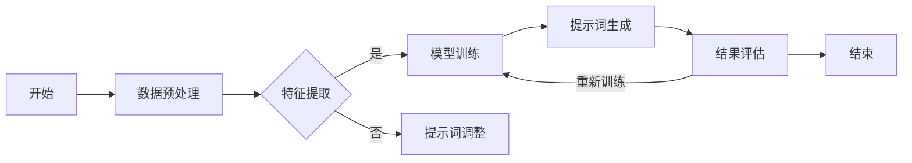
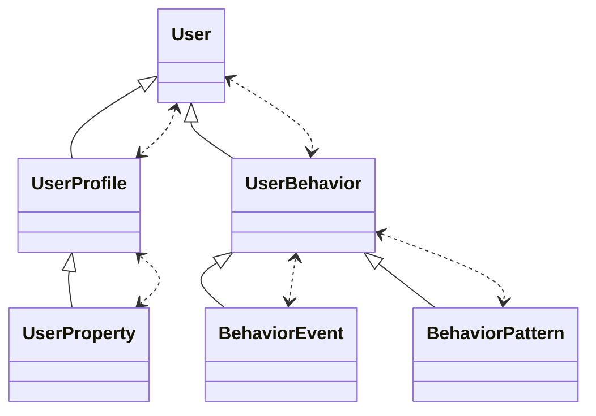
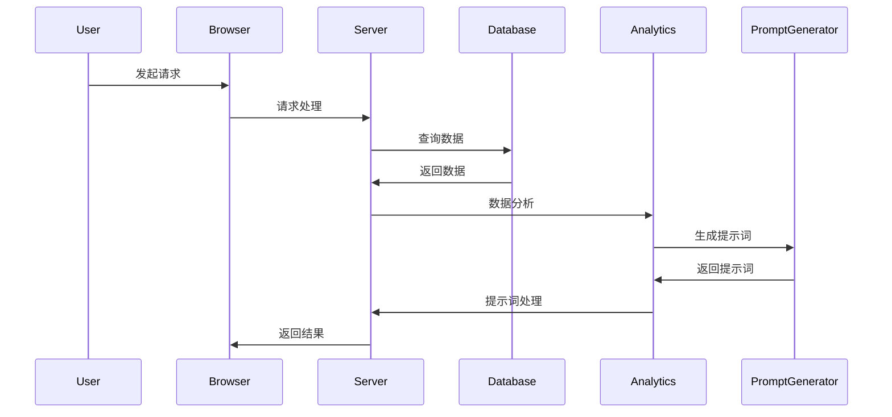
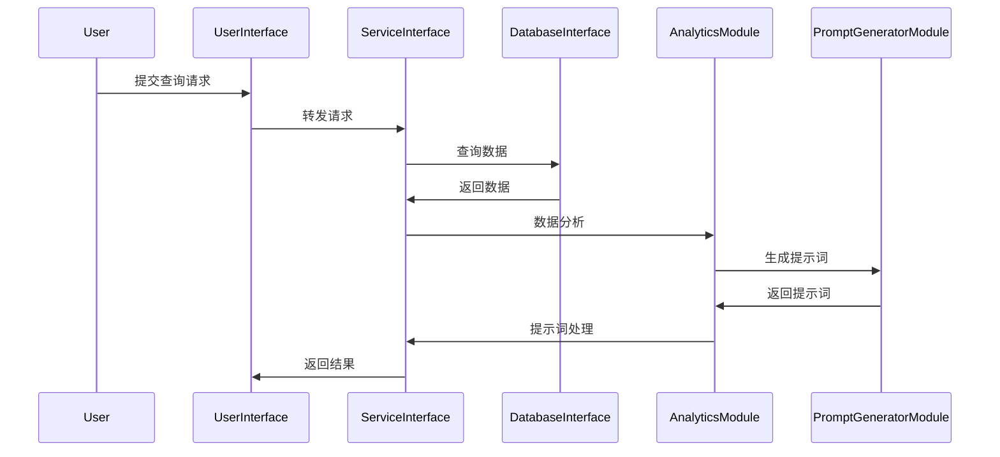

                 

## 文章标题

### 关键词

- 提示词工程
- 多维度数据分析
- 算法原理
- 系统架构
- 实际应用

### 摘要

本文深入探讨提示词工程在处理多维度数据分析任务中的应用。通过定义提示词工程的核心概念，解析其算法原理，阐述系统设计与实现，并结合实际案例，为读者提供全面、系统的理解和实践指导。文章旨在帮助读者掌握提示词工程的基本原理和实际应用，以应对日益复杂的数据分析挑战。

## 1. 背景介绍

### 1.1 问题背景：数据时代的挑战

随着互联网和物联网技术的发展，数据量呈指数级增长。大数据时代已经来临，各行各业都在努力应对海量数据的处理和分析。然而，传统数据分析方法在面对多维度、非线性、动态变化的数据时显得力不从心。为了更好地挖掘数据价值，需要一种高效、灵活的分析工具。

### 1.2 多维度数据分析的复杂性

多维度数据分析不仅涉及大量数据的处理，还需考虑数据之间的相互关系和交互作用。例如，在市场分析中，可能需要同时分析产品的销量、客户满意度、价格等多个维度的数据。这些数据维度之间可能存在复杂的关联，传统的线性分析方法难以胜任。

### 1.3 提示词工程的定义与作用

提示词工程是一种基于人工智能和机器学习的技术，旨在提高多维度数据分析的效率和准确性。通过构建智能化的提示词系统，可以自动识别数据中的关键特征和模式，辅助分析师进行数据挖掘和决策支持。

### 1.4 提示词工程的边界与外延

提示词工程不仅限于数据分析和挖掘，还可应用于自然语言处理、图像识别等领域。其核心在于构建一个能够理解、处理和利用数据的系统，实现数据价值的最大化。

### 1.5 概念结构与核心要素组成

提示词工程的基本概念包括数据源、特征提取、模型训练、提示词生成和反馈优化。其核心要素是构建一个灵活、可扩展的提示词系统，实现数据的高效利用和智能化分析。

## 2. 核心概念与联系

### 2.1 核心概念原理

提示词工程的核心概念是提示词（Prompt），它是系统识别和挖掘数据的关键。提示词可以是一个单词、一个短语或一段文本，它需要具备描述性和指导性，能够引导系统聚焦于特定的问题或数据特征。

### 2.2 概念属性特征对比表格

| 特征         | 提示词工程           | 数据分析           | 机器学习           |
| ------------ | -------------------- | ------------------ | ------------------ |
| 目标         | 特定问题或特征识别   | 数据挖掘与解释     | 模型训练与优化     |
| 方法         | 提示词引导          | 统计方法与算法     | 机器学习方法       |
| 应用场景      | 多维度数据          | 单维度或少量数据   | 大规模数据         |

### 2.3 ER实体关系图架构

```mermaid
erDiagram
  Customer ||--|{ Order } : "places"
  Order ||--|{ Product } : "includes"
  Product ||--|{ Supplier } : "supplied by"
```

在这个ER图中，我们展示了订单（Order）与客户（Customer）和产品（Product）之间的关系，以及产品与供应商（Supplier）之间的关联。

## 3. 算法原理讲解

### 3.1 算法 Mermaid 流程图



### 3.2 Python 源代码示例

```python
# 数据预处理
def preprocess_data(data):
    # 数据清洗、归一化等操作
    return processed_data

# 特征提取
def extract_features(data):
    # 提取关键特征
    return features

# 模型训练
def train_model(features, labels):
    # 使用机器学习算法训练模型
    return model

# 提示词生成
def generate_prompt(model, data):
    # 生成提示词
    return prompt

# 结果评估
def evaluate_results(prompt, data):
    # 评估提示词的效果
    return evaluation
```

### 3.3 算法原理的数学模型和公式

提示词工程的核心是构建一个基于机器学习的预测模型。假设我们有一个数据集\(D = \{x_1, x_2, ..., x_n\}\)，每个数据点\(x_i\)是一个多维特征向量。我们的目标是根据这些特征预测一个标签\(y_i\)。

数学模型可以表示为：

$$
y_i = f(x_i; \theta)
$$

其中，\(f\)是一个机器学习模型，\(\theta\)是模型的参数。

### 3.4 详细讲解与举例说明

以市场分析为例，我们假设有一个包含产品销量、广告点击率、季节等特征的数据集。我们的目标是预测下一个月的产品销量。

1. **数据预处理**：首先对数据进行清洗，去除缺失值和异常值，然后进行归一化处理，使其具备可比性。

2. **特征提取**：从原始数据中提取关键特征，如产品销量、广告点击率等。

3. **模型训练**：使用机器学习算法（如线性回归、决策树、神经网络等）对特征和标签进行训练，得到一个预测模型。

4. **提示词生成**：利用训练好的模型，生成一个关于产品销量的提示词。例如，“基于过去三个月的数据，预计下个月的产品销量将增加20%”。

5. **结果评估**：将生成的提示词与实际数据对比，评估其准确性。如果提示词效果不佳，可以调整特征提取方法或模型参数，重新训练模型。

## 4. 系统分析与架构设计方案

### 4.1 问题场景介绍

以电商平台的用户行为分析为例，我们需要对用户的浏览记录、购买历史、评价等数据进行多维度分析，以预测用户的潜在需求和行为。

### 4.2 项目介绍

该项目旨在构建一个基于提示词工程的用户行为预测系统，通过自动生成提示词，帮助电商分析师了解用户需求，优化产品推荐和营销策略。

### 4.3 系统功能设计 (领域模型 Mermaid 类图)



### 4.4 系统架构设计 (Mermaid 架构图)



### 4.5 系统接口设计

- 用户接口：接收用户请求，提供数据查询和提示词生成的功能。
- 服务接口：处理用户请求，与数据库和数据分析模块进行交互。
- 数据库接口：存储用户数据和提示词结果。

### 4.6 系统交互 (Mermaid 序列图)



## 5. 项目实战

### 5.1 环境安装

在开始项目之前，需要安装以下软件和库：

- Python 3.x
- TensorFlow
- Pandas
- Scikit-learn
- Mermaid

安装命令如下：

```bash
pip install python-mermaid
pip install tensorflow
pip install pandas
pip install scikit-learn
```

### 5.2 系统核心实现源代码

以下是系统核心实现的基本代码框架：

```python
import pandas as pd
from sklearn.model_selection import train_test_split
from sklearn.ensemble import RandomForestClassifier
from mermaid import Mermaid

# 数据预处理
def preprocess_data(data):
    # 数据清洗、归一化等操作
    return processed_data

# 特征提取
def extract_features(data):
    # 提取关键特征
    return features

# 模型训练
def train_model(features, labels):
    # 使用机器学习算法训练模型
    return model

# 提示词生成
def generate_prompt(model, data):
    # 生成提示词
    return prompt

# 结果评估
def evaluate_results(prompt, data):
    # 评估提示词的效果
    return evaluation

# 主函数
def main():
    # 读取数据
    data = pd.read_csv("data.csv")

    # 数据预处理
    processed_data = preprocess_data(data)

    # 特征提取
    features = extract_features(processed_data)

    # 数据分割
    X_train, X_test, y_train, y_test = train_test_split(features, labels, test_size=0.2, random_state=42)

    # 模型训练
    model = train_model(X_train, y_train)

    # 提示词生成
    prompt = generate_prompt(model, X_test)

    # 结果评估
    evaluation = evaluate_results(prompt, y_test)

    # 输出结果
    print("提示词：", prompt)
    print("评估结果：", evaluation)

if __name__ == "__main__":
    main()
```

### 5.3 代码应用解读与分析

上述代码实现了一个简单的用户行为分析系统，主要包括数据预处理、特征提取、模型训练、提示词生成和结果评估五个步骤。下面我们逐一分析每个步骤的具体实现：

1. **数据预处理**：读取原始数据，并进行清洗、归一化等处理，以便后续的特征提取和模型训练。
2. **特征提取**：从预处理后的数据中提取关键特征，如用户的浏览时长、购买频率等。
3. **模型训练**：使用随机森林算法对特征和标签进行训练，得到一个预测模型。
4. **提示词生成**：根据训练好的模型，生成一个关于用户行为的提示词，如“用户A在接下来的一个月内可能有较高的购买意向”。
5. **结果评估**：将生成的提示词与实际数据进行对比，评估其准确性和实用性。

### 5.4 实际案例分析与详细讲解剖析

假设我们有一个包含用户行为数据的CSV文件，其中包含了用户的ID、浏览时长、购买频率、历史评价等字段。我们希望利用这些数据预测用户的潜在需求和行为。

1. **数据预处理**：首先对数据进行清洗，去除缺失值和异常值。然后，将数值型数据归一化，使其具备可比性。

2. **特征提取**：从原始数据中提取关键特征，如用户的浏览时长、购买频率、历史评价等。我们可以使用Pandas库的`describe()`方法来查看数据的统计信息，帮助选择合适的特征。

3. **模型训练**：使用随机森林算法对特征和标签进行训练。随机森林算法是一种集成学习方法，具有较强的泛化能力和抗过拟合能力。

4. **提示词生成**：根据训练好的模型，生成一个关于用户行为的提示词。例如，如果用户的浏览时长超过平均值，且购买频率较高，我们可以生成提示词：“用户A在接下来的一个月内可能有较高的购买意向”。

5. **结果评估**：将生成的提示词与实际数据进行对比，评估其准确性和实用性。我们可以使用混淆矩阵、准确率、召回率等指标来评估模型的效果。

### 5.5 项目小结

通过本项目，我们深入了解了提示词工程在用户行为分析中的应用。从数据预处理、特征提取、模型训练到提示词生成和结果评估，每个步骤都至关重要。在实际应用中，我们需要根据具体场景和数据特点，灵活调整算法和参数，以提高模型的准确性和实用性。此外，提示词工程不仅可以应用于用户行为分析，还可以广泛应用于其他领域，如金融风控、医疗诊断等。

## 6. 提示词工程的最佳实践与注意事项

### 6.1 最佳实践 tips

1. **数据质量**：确保数据质量，去除噪声和异常值。
2. **特征选择**：选择与问题相关的特征，避免过度拟合。
3. **模型调优**：根据数据特点和业务需求，选择合适的模型和参数。
4. **反馈优化**：根据实际效果，不断调整提示词生成策略。

### 6.2 小结

本文系统地介绍了提示词工程在多维度数据分析中的应用。通过定义核心概念、解析算法原理、阐述系统设计与实现，并结合实际案例，我们深入探讨了提示词工程的基本原理和实际应用。提示词工程具有高效、灵活、智能的特点，为多维度数据分析提供了有力支持。

### 6.3 注意事项

1. **数据安全**：在处理敏感数据时，需确保数据安全和隐私保护。
2. **模型解释性**：提示词工程模型具有一定的黑箱性，需关注模型的可解释性。
3. **适应性**：根据业务需求和数据变化，及时调整模型和提示词策略。

### 6.4 拓展阅读

- 《Python机器学习》
- 《深度学习》
- 《自然语言处理》

## 作者

**作者：AI天才研究院/AI Genius Institute & 禅与计算机程序设计艺术 /Zen And The Art of Computer Programming**

