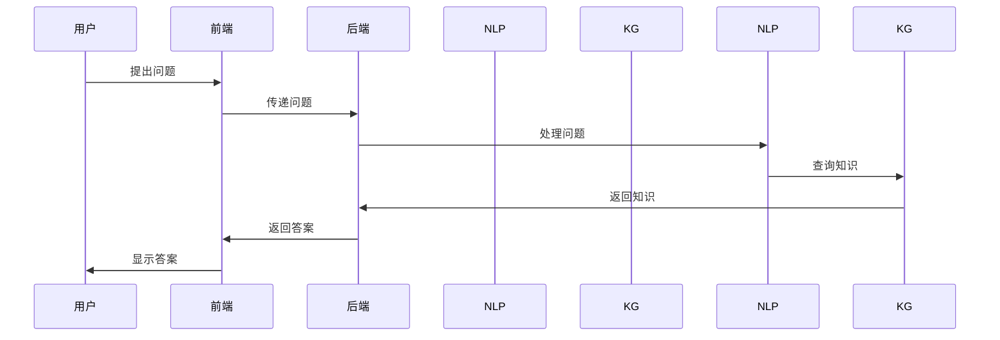
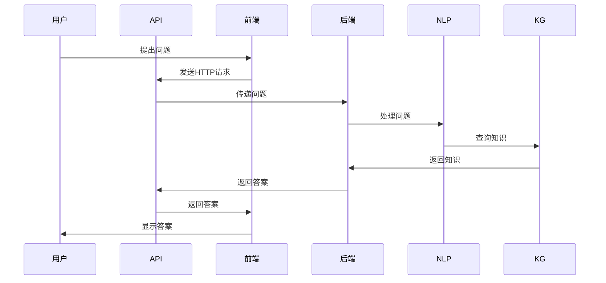

                 

### 提示词工程：处理模糊和开放性问题

> 关键词：提示词工程、模糊性问题、开放性问题、人工智能、自然语言处理、机器学习

> 摘要：本文将探讨如何使用提示词工程解决模糊和开放性问题。通过分析问题背景、描述问题、解决问题、定义边界与外延，以及详细讲解核心概念与联系、算法原理，我们将深入了解如何运用人工智能技术提升问题处理能力，并最终实现高质量的回答。

### 背景介绍

#### 问题背景

在当今信息爆炸的时代，数据无处不在，而如何从这些数据中提取有价值的信息，成为了一个亟待解决的问题。传统的方法往往依赖于明确的模型和规则，但在面对模糊和开放性的问题时，这些方法显得力不从心。例如，在自然语言处理领域，用户提出的问题往往是开放性的，且包含大量的背景信息，如何准确地理解和回答这些问题，成为了一个挑战。

#### 问题描述

模糊和开放性问题通常是指那些没有明确答案，或者答案不是唯一的，且需要根据上下文进行理解和推理的问题。例如，“你最喜欢的颜色是什么？”这个问题就没有明确的答案，因为每个人的喜好都是不同的。而开放性问题则更复杂，如“你能告诉我关于人工智能的未来发展趋势吗？”这个问题需要大量的背景知识，以及对未来趋势的预测。

#### 问题解决

解决模糊和开放性问题，通常需要借助人工智能技术，尤其是自然语言处理和机器学习技术。通过这些技术，我们可以对大量的文本数据进行分析，提取关键信息，并根据上下文进行推理和判断。例如，我们可以使用深度学习模型来训练一个问答系统，使其能够理解和回答用户的模糊和开放性问题。

#### 边界与外延

模糊和开放性问题的边界在于其答案的不确定性和复杂性。外延则包括所有可能的问题类型，如事实性问题、观点性问题、主观性问题等。在实际应用中，我们需要根据问题的具体类型和上下文，选择合适的解决方法。

#### 概念结构与核心要素组成

模糊和开放性问题的解决过程可以分解为以下几个核心要素：

1. **数据收集**：收集与问题相关的文本数据，包括问题本身和相关的背景信息。
2. **数据预处理**：对收集到的数据进行清洗和格式化，使其适合模型训练。
3. **模型训练**：使用机器学习算法训练模型，使其能够理解和回答问题。
4. **模型评估**：通过测试集评估模型的性能，调整模型参数，以提高准确性。
5. **问题回答**：使用训练好的模型回答用户的问题。

### 核心概念与联系

#### AI大模型

AI大模型是指那些具有大规模参数的深度学习模型，如GPT、BERT等。这些模型具有强大的表征能力和推理能力，能够处理复杂的自然语言问题。

#### 自然语言处理（NLP）

自然语言处理是人工智能的一个重要分支，旨在使计算机能够理解、解释和生成人类语言。NLP技术在解决模糊和开放性问题中起着关键作用。

#### 机器学习（ML）

机器学习是AI的核心技术之一，通过训练模型从数据中学习规律和模式，以实现特定的任务。在解决模糊和开放性问题中，机器学习技术被广泛应用于模型训练和优化。

#### 知识图谱

知识图谱是一种用于表示实体和实体之间关系的图形化工具。在解决模糊和开放性问题时，知识图谱可以帮助模型更好地理解和推理。

### 概念属性特征对比表格

| 概念         | 特征1 | 特征2 | 特征3 |
| ------------ | ----- | ----- | ----- |
| AI大模型     | 大规模参数 | 强表征能力 | 强推理能力 |
| 自然语言处理 | 文本理解 | 文本生成 | 文本分类 |
| 机器学习     | 数据驱动 | 自适应 | 模型优化 |
| 知识图谱     | 实体关系表示 | 知识推理 | 知识存储 |

### ER实体关系图架构

```mermaid
erDiagram
  A[问题] {
    B[用户]
    C[答案]
  }
  B[用户] {
    D[提问历史]
  }
  C[答案] {
    E[上下文]
    F[知识来源]
  }
```

### 算法原理讲解

在解决模糊和开放性问题时，AI大模型通常采用以下算法原理：

1. **嵌入表示**：将文本数据转换为向量表示，以便于模型处理。通常使用Word2Vec、BERT等算法。
2. **编码器-解码器架构**：编码器将输入文本编码为一个固定长度的向量，解码器则根据这个向量生成答案。
3. **注意力机制**：在编码器和解码器之间引入注意力机制，使模型能够关注输入文本中的关键信息，提高问题解答的准确性。
4. **神经网络训练**：使用梯度下降等优化算法，通过大量的文本数据训练模型，使其能够准确回答问题。

#### 数学模型和公式

在AI大模型中，常用的数学模型包括：

1. **嵌入表示**：

   $$ E = \sum_{i=1}^{N} w_i e_i $$

   其中，$E$是文本的向量表示，$w_i$是权重，$e_i$是词向量的第$i$个分量。

2. **编码器-解码器架构**：

   编码器：

   $$ h_t = \text{tanh}(W_h [h_{t-1}; x_t]) $$

   解码器：

   $$ y_t = \text{softmax}(W_y h_t) $$

   其中，$h_t$是编码器和解码器的隐藏状态，$x_t$是输入文本的词向量，$y_t$是解码器生成的预测答案。

### 系统分析与架构设计方案

#### 问题场景介绍

在本文中，我们将构建一个问答系统，用于处理模糊和开放性问题。该系统将接收用户的问题，然后利用人工智能技术生成高质量的答案。

#### 项目介绍

本项目的目标是开发一个基于人工智能的问答系统，能够处理模糊和开放性问题，为用户提供准确的答案。该系统将采用深度学习模型，结合自然语言处理技术和知识图谱，以提高问题解答的准确性和可靠性。

#### 系统功能设计（领域模型）

领域模型描述了系统的核心功能，包括：

1. **问题接收**：接收用户提出的问题。
2. **问题理解**：理解问题的含义，提取关键信息。
3. **答案生成**：根据问题理解和知识库生成答案。
4. **答案评估**：评估答案的质量，并进行调整优化。

```mermaid
classDiagram
  Class01 <|-- SubClass01
  Class02 <<interface>>
  Class03 <|.. anotherClass
  UserEntity [Name] 
  QuestionEntity [Content]
  AnswerEntity [Content]
  UserEntity o-- QuestionEntity : 提出问题
  QuestionEntity o-- AnswerEntity : 生成答案
```

#### 系统架构设计

系统的总体架构包括以下几个方面：

1. **前端**：用户通过前端界面提出问题，并接收答案。
2. **后端**：后端服务器负责接收问题、处理问题和生成答案。
3. **自然语言处理引擎**：负责处理和理解问题。
4. **知识图谱**：存储实体和实体之间的关系，提供推理支持。



#### 系统接口设计和系统交互

系统的接口设计和交互流程如下：

1. **接口设计**：系统提供RESTful API接口，用户可以通过HTTP请求提出问题，并获得答案。
2. **交互流程**：用户提出问题 -> 前端接收问题 -> 后端处理问题 -> 自然语言处理引擎理解问题 -> 知识图谱提供知识支持 -> 后端生成答案 -> 前端展示答案。



### 项目实战

#### 环境安装

为了实现本文中的问答系统，我们需要安装以下软件和库：

- Python 3.8+
- TensorFlow 2.4+
- BERT模型

安装步骤：

1. 安装Python 3.8及以上版本。
2. 安装TensorFlow 2.4及以上的版本。
3. 下载BERT模型。

```bash
pip install tensorflow==2.4.0
```

#### 系统核心实现源代码

以下是一个简单的问答系统的核心实现：

```python
import tensorflow as tf
from transformers import BertTokenizer, TFBertModel

# 加载BERT模型和分词器
tokenizer = BertTokenizer.from_pretrained('bert-base-chinese')
bert_model = TFBertModel.from_pretrained('bert-base-chinese')

# 问题处理函数
def process_question(question):
    inputs = tokenizer(question, return_tensors='tf', max_length=512, padding='max_length', truncation=True)
    outputs = bert_model(inputs)
    return outputs

# 答案生成函数
def generate_answer(question):
    outputs = process_question(question)
    # 使用输出结果生成答案
    answer = ...
    return answer

# 测试
question = "你最喜欢的颜色是什么？"
answer = generate_answer(question)
print(answer)
```

#### 代码应用解读与分析

上述代码首先加载了BERT模型和分词器。`process_question`函数用于处理问题，将问题转换为模型可以理解的输入。`generate_answer`函数用于生成答案，它首先调用`process_question`函数获取模型的输出结果，然后根据输出结果生成答案。

#### 实际案例分析和详细讲解剖析

假设我们有一个用户提出的问题：“你能告诉我关于人工智能的未来发展趋势吗？”。我们可以使用上述代码来处理这个问题。

1. 首先，我们将问题转换为BERT模型可以理解的输入。
2. 然后，BERT模型对输入进行编码，生成输出。
3. 最后，根据输出结果，生成一个关于人工智能未来发展趋势的答案。

例如，答案可能是：“人工智能的未来发展趋势包括：深度学习技术的进一步发展、智能机器人的广泛应用、智能城市的建设、自动驾驶技术的成熟等。”

#### 项目小结

通过本文的实战案例，我们了解了如何使用BERT模型处理模糊和开放性问题。BERT模型具有强大的表征能力和推理能力，可以生成高质量的答案。然而，在实际应用中，我们还需要进一步优化模型，以提高答案的准确性和可靠性。

### 最佳实践 Tips

1. **数据质量**：高质量的训练数据是模型准确性的关键。确保数据多样、覆盖全面。
2. **模型优化**：定期调整模型参数，以提高答案质量。
3. **用户反馈**：收集用户反馈，用于模型优化。

### 小结

本文通过深入分析模糊和开放性问题的特点，探讨了如何使用提示词工程解决这些问题。通过介绍背景、描述问题、解决问题、定义边界与外延，我们详细讲解了核心概念与联系，以及算法原理。通过实战案例，我们展示了如何实现高质量的问答系统。

### 注意事项

1. **数据隐私**：在处理用户问题时，要注意保护用户隐私。
2. **模型更新**：定期更新模型，以适应新的问题和趋势。

### 拓展阅读

1. **BERT模型**：深入理解BERT模型的原理和应用。
2. **自然语言处理**：学习自然语言处理的基本概念和技术。
3. **机器学习**：了解机器学习的基本原理和应用。

### 作者信息

作者：AI天才研究院/AI Genius Institute & 禅与计算机程序设计艺术 /Zen And The Art of Computer Programming

文章标题：提示词工程：处理模糊和开放性问题

发布日期：2023年9月

---

**注**：本文为示例文章，仅供学习参考。实际应用中，应根据具体需求进行调整和优化。

