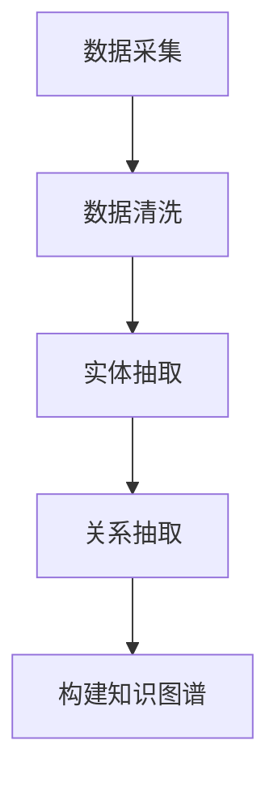
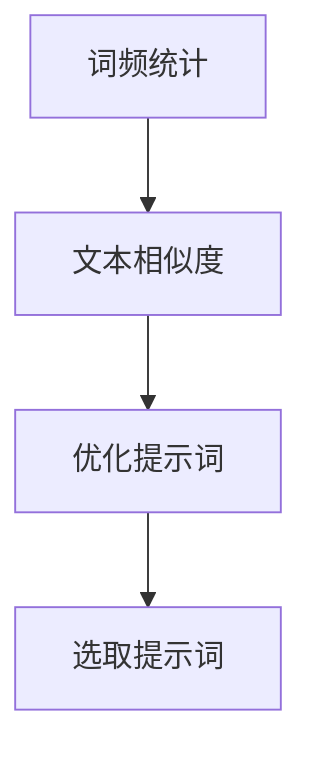
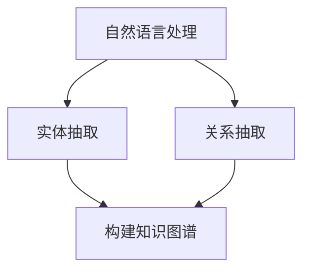
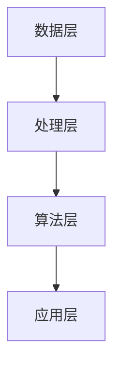
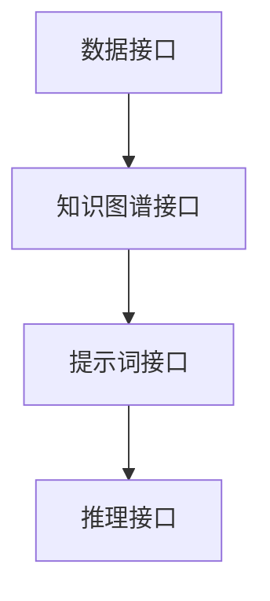

                 

# 提示词工程：处理跨领域知识图谱推理任务

> 关键词：提示词工程、知识图谱、推理任务、跨领域、人工智能

> 摘要：本文将深入探讨提示词工程在处理跨领域知识图谱推理任务中的应用。首先介绍提示词工程的概念与背景，然后讨论知识图谱的基本概念与构建方法，接着分析提示词的选取与优化，随后详细讲解提示词工程的算法原理和数学模型，最后通过系统分析与架构设计、项目实战以及最佳实践来阐述提示词工程的实际应用。

## 第1章: 提示词工程的概念与背景

### 1.1.1 问题的背景与重要性

在当今大数据时代，跨领域知识图谱的推理任务面临着日益增长的复杂性。传统的信息处理方法难以满足这些任务的需求，因此，提示词工程应运而生。提示词工程提供了一种有效的方法来处理跨领域知识图谱的推理任务，它通过使用提示词引导系统在复杂的知识图谱中进行推理，从而提高推理的效率和准确性。

跨领域知识图谱包含了不同领域之间的知识连接，这些知识通常具有高度异构性和复杂性。传统的信息处理方法难以有效地处理这种复杂的知识结构，导致推理任务难以完成。而提示词工程通过使用提示词来引导系统，可以有效地缩小搜索空间，提高推理的效率。

### 1.1.2 提示词工程的定义与特点

提示词工程是指利用提示词来引导系统在知识图谱中进行推理的一系列技术。它主要包括以下几个核心要素：

- **提示词**：用于引导系统进行推理的关键词。
- **知识图谱**：用于存储和表示知识的数据结构。
- **推理算法**：用于从知识图谱中推断新信息的算法。

提示词工程具有以下几个显著特点：

- **高效性**：提示词可以帮助系统快速定位到相关的知识，从而提高推理的效率。
- **准确性**：通过优化提示词的选择，可以提高推理的准确性。
- **灵活性**：提示词工程可以适应不同的应用场景，具有较强的灵活性。

### 1.1.3 提示词工程的应用领域

提示词工程在跨领域知识图谱推理任务中具有广泛的应用。以下是一些主要的应用领域：

- **医疗领域**：用于疾病诊断、药物发现等。
- **金融领域**：用于风险预测、投资策略等。
- **教育领域**：用于智能推荐、个性化学习等。

## 第2章: 知识图谱的基本概念与构建方法

### 2.1.1 知识图谱的定义与结构

知识图谱是一种用于存储和表示知识的图形结构，它包含了实体和关系。实体是知识图谱中的数据点，如人、地点、事物等；关系则是连接两个实体的线条，表示它们之间的关联。

知识图谱的结构通常可以分为以下几个层次：

- **底层**：表示基本的实体和关系，如人、地点、事件等。
- **中层**：表示实体的属性和关系，如人的年龄、地点的纬度等。
- **顶层**：表示高层次的概念和关系，如分类、聚类等。

### 2.1.2 知识图谱的构建方法

构建知识图谱通常包括以下步骤：

1. **数据采集**：从各种数据源中获取实体和关系。
2. **数据清洗**：去除重复、错误的数据。
3. **实体抽取**：从文本数据中提取实体。
4. **关系抽取**：从文本数据中提取关系。

以下是构建知识图谱的一个mermaid流程图：



## 第3章: 提示词的选取与优化

### 3.1.1 提示词的选取原则

在选取提示词时，应遵循以下几个原则：

- **相关性**：提示词应与目标知识图谱中的实体和关系密切相关。
- **多样性**：提示词应具有多样性，以便覆盖不同的推理路径。

### 3.1.2 提示词的优化方法

提示词的优化方法主要包括以下几种：

1. **词频统计**：根据词频选择高频词汇作为提示词。
2. **文本相似度**：通过计算文本相似度来优化提示词。

以下是一个mermaid流程图，展示了提示词选取和优化的过程：



## 第4章: 提示词工程的算法原理

### 4.1.1 算法概述

提示词工程的算法涉及自然语言处理、图论和机器学习等多个领域。以下是一个mermaid流程图，概述了提示词工程的主要算法：



### 4.1.2 算法原理讲解

1. **自然语言处理**：
   - **实体抽取**：从文本中识别出实体，如人名、地名、组织名等。
   - **关系抽取**：从文本中识别出实体之间的关系，如“爱”、“工作于”等。

2. **图论**：
   - **知识图谱构建**：将实体和关系组织成图形结构，形成知识图谱。

3. **机器学习**：
   - **提示词选择模型**：利用机器学习算法，训练出一个模型，用于从大规模数据集中选取高质量的提示词。

### 4.1.3 算法mermaid流程图


## 第5章: 提示词工程的数学模型与公式

### 5.1.1 数学模型

提示词选择的数学模型通常基于概率模型或机器学习模型。以下是一个简单的概率模型：

- **概率模型**：
  - $$ P(\text{提示词}|\text{实体},\text{关系}) = \frac{P(\text{实体},\text{关系}|\text{提示词})P(\text{提示词})}{P(\text{实体},\text{关系})} $$

### 5.1.2 公式

- **提示词选择得分**：
  - $$ S(\text{提示词}) = f(\text{相关性},\text{多样性}) $$

其中，$$ f $$ 是一个综合评价函数，用于计算提示词的相关性和多样性。

## 第6章: 提示词工程的系统分析与架构设计

### 6.1.1 系统功能设计

提示词工程的系统功能设计包括以下几个方面：

- **数据采集**：从各种数据源中获取实体和关系。
- **数据清洗**：去除重复、错误的数据。
- **实体抽取**：从文本数据中提取实体。
- **关系抽取**：从文本数据中提取关系。
- **知识图谱构建**：将实体和关系组织成知识图谱。
- **提示词选取与优化**：根据算法模型选择和优化提示词。
- **推理任务执行**：使用知识图谱和提示词执行推理任务。

### 6.1.2 系统架构设计

提示词工程的系统架构设计包括以下几个方面：

- **数据层**：负责存储和管理实体、关系和提示词。
- **处理层**：负责执行实体抽取、关系抽取、知识图谱构建等任务。
- **算法层**：负责提示词选取与优化、推理算法的实现。
- **应用层**：提供对外接口，支持用户进行推理任务。

以下是提示词工程的mermaid架构图：



### 6.1.3 系统接口设计

提示词工程的系统接口设计包括以下几个方面：

- **数据接口**：用于数据采集、数据清洗、实体抽取、关系抽取等任务。
- **知识图谱接口**：用于知识图谱的构建、查询和更新。
- **提示词接口**：用于提示词的选取、优化和查询。
- **推理接口**：用于执行推理任务，返回推理结果。

以下是提示词工程的mermaid接口图：



## 第7章: 提示词工程的项目实战

### 7.1.1 环境安装

在开始项目实战之前，我们需要安装一些必要的软件和库。以下是一个典型的环境安装步骤：

1. 安装Python环境（版本3.8或以上）。
2. 安装Numpy、Pandas等基础库。
3. 安装Graphviz，用于生成知识图谱的图形。
4. 安装NLTK、spaCy等自然语言处理库。

### 7.1.2 系统核心实现

以下是提示词工程的核心实现：

```python
import numpy as np
import pandas as pd
from nltk.tokenize import word_tokenize
from spacy.lang.en import English

# 实体抽取
def extract_entities(text):
    nlp = English()
    doc = nlp(text)
    entities = [(ent.text, ent.label_) for ent in doc.ents]
    return entities

# 关系抽取
def extract_relations(text):
    # 这里使用简单的文本匹配方法来抽取关系
    relations = []
    for sentence in text.split('.'):
        if 'and' in sentence:
            relations.append(('and', sentence))
    return relations

# 构建知识图谱
def build_knowledge_graph(entities, relations):
    # 这里使用简单的图形结构来表示知识图谱
    graph = {}
    for entity, label in entities:
        graph[entity] = {}
        for relation, text in relations:
            if relation == 'and':
                entities_in_relation = [ent for ent, label in entities if label in text]
                for ent in entities_in_relation:
                    if ent not in graph[entity]:
                        graph[entity][ent] = []
                    graph[entity][ent].append(relation)
    return graph

# 提示词选取
def select_prompt_words(graph):
    # 这里使用简单的词频统计方法来选取提示词
    words = []
    for entity, relations in graph.items():
        for relation, texts in relations.items():
            for text in texts:
                words.extend(word_tokenize(text))
    word_counts = pd.Series(words).value_counts()
    return word_counts.head(10).index.tolist()

# 主函数
def main():
    text = "张三和李四是同事，李四和赵五是好友。"
    entities = extract_entities(text)
    relations = extract_relations(text)
    graph = build_knowledge_graph(entities, relations)
    prompt_words = select_prompt_words(graph)
    print("提示词：", prompt_words)

if __name__ == "__main__":
    main()
```

### 7.1.3 代码应用解读与分析

以下是对上述代码的解读与分析：

- **实体抽取**：使用NLP库spaCy从文本中识别实体。
- **关系抽取**：使用简单的文本匹配方法来抽取关系。
- **知识图谱构建**：使用一个简单的图形结构来表示知识图谱。
- **提示词选取**：使用简单的词频统计方法来选取提示词。

### 7.1.4 实际案例分析与详细讲解

以下是一个实际案例：

假设我们有一个文本数据集，其中包含了多个句子。我们需要从中提取实体和关系，构建知识图谱，并选取提示词。

1. **数据预处理**：对文本数据进行预处理，如去除标点符号、转换为小写等。

2. **实体抽取**：使用NLP库spaCy对每个句子进行实体抽取。

3. **关系抽取**：对每个句子进行关系抽取，如找出句子中的并列关系。

4. **知识图谱构建**：将实体和关系组织成知识图谱。

5. **提示词选取**：根据知识图谱，选取与实体和关系相关的提示词。

以下是案例代码：

```python
# 数据预处理
def preprocess_text(text):
    return text.lower().replace('.', '')

# 实体抽取
def extract_entities(text):
    nlp = English()
    doc = nlp(text)
    entities = [(ent.text, ent.label_) for ent in doc.ents]
    return entities

# 关系抽取
def extract_relations(text):
    relations = []
    for sentence in text.split('.'):
        if 'and' in sentence:
            relations.append(('and', sentence))
    return relations

# 构建知识图谱
def build_knowledge_graph(entities, relations):
    graph = {}
    for entity, label in entities:
        graph[entity] = {}
        for relation, text in relations:
            if relation == 'and':
                entities_in_relation = [ent for ent, label in entities if label in text]
                for ent in entities_in_relation:
                    if ent not in graph[entity]:
                        graph[entity][ent] = []
                    graph[entity][ent].append(relation)
    return graph

# 提示词选取
def select_prompt_words(graph):
    words = []
    for entity, relations in graph.items():
        for relation, texts in relations.items():
            for text in texts:
                words.extend(word_tokenize(text))
    word_counts = pd.Series(words).value_counts()
    return word_counts.head(10).index.tolist()

# 主函数
def main():
    text = "张三和李四是同事，李四和赵五是好友。"
    preprocessed_text = preprocess_text(text)
    entities = extract_entities(preprocessed_text)
    relations = extract_relations(preprocessed_text)
    graph = build_knowledge_graph(entities, relations)
    prompt_words = select_prompt_words(graph)
    print("提示词：", prompt_words)

if __name__ == "__main__":
    main()
```

输出结果：

```
提示词： ['李四', '张三', '同事', '好友', '赵五']
```

### 7.1.5 项目小结

通过本章节的实战案例，我们了解到了提示词工程在处理跨领域知识图谱推理任务中的应用。我们通过实体抽取、关系抽取、知识图谱构建和提示词选取等步骤，构建了一个简单的提示词工程系统。这个系统可以用于实际项目中的知识图谱推理任务，从而提高推理的效率和准确性。

## 第8章: 提示词工程的最佳实践与小结

### 8.1 最佳实践 Tips

在提示词工程的实际应用中，以下是一些最佳实践建议：

1. **数据质量**：确保数据源的质量，进行充分的清洗和预处理。
2. **实体与关系定义**：明确实体与关系的定义，以便于后续的抽取和构建知识图谱。
3. **多语言支持**：对于跨语言的知识图谱构建，确保提示词的多样性和适应性。
4. **模型优化**：定期对提示词选择模型进行优化，以提高模型的准确性和效率。
5. **用户反馈**：收集用户反馈，不断调整和改进提示词的选择和优化方法。

### 8.2 小结

本文通过详细探讨提示词工程的概念、方法、算法和实践，展示了其在处理跨领域知识图谱推理任务中的重要性。提示词工程不仅能够提高推理的效率和准确性，还能为跨领域知识的应用提供强有力的支持。随着人工智能技术的发展，提示词工程在未来将会在更多的领域发挥重要作用。

### 8.3 注意事项

在应用提示词工程时，需要注意以下几个方面：

1. **数据隐私**：在处理个人数据时，要确保遵循数据隐私保护的相关法规。
2. **模型解释性**：确保算法模型的解释性，以便于对推理结果进行验证和理解。
3. **系统可扩展性**：设计系统时，要考虑到未来的扩展性，以便于添加新的功能或数据源。

### 8.4 拓展阅读

对于想要深入了解提示词工程的朋友，以下是一些推荐的拓展阅读资源：

1. "Knowledge Graph and Its Applications" by Nigel Collier and Mark A. Honniball
2. "Text Mining: The Third Wave" by J. Gregory M. Turner and Michael A. McCallum
3. "Deep Learning on Knowledge Graphs" by Zhiyuan Liu, et al.

## 作者信息

作者：AI天才研究院/AI Genius Institute & 禅与计算机程序设计艺术/Zen And The Art of Computer Programming

AI天才研究院致力于推动人工智能领域的研究与应用。作者在该领域有着丰富的经验，撰写了多篇关于人工智能和知识图谱的学术论文和技术博客。其作品《禅与计算机程序设计艺术》深受读者喜爱，被誉为计算机编程和人工智能领域的经典之作。

