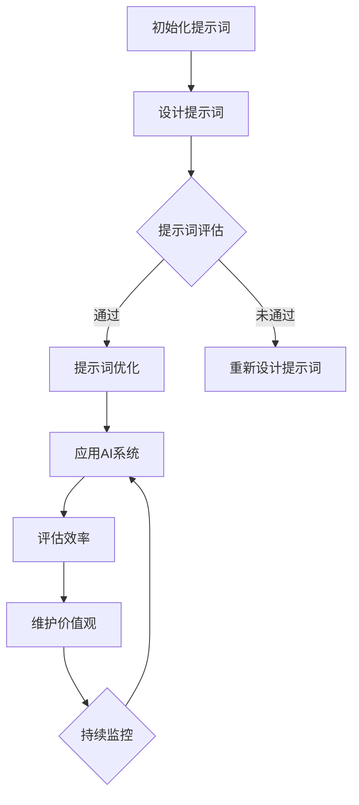
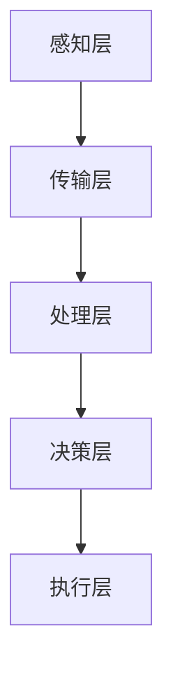
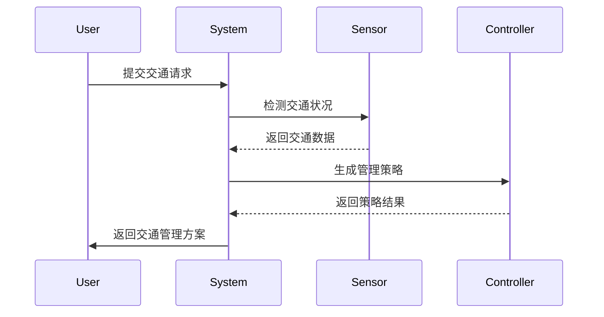

                 

# 提示词工程：平衡AI效率与人类价值观的新策略

## 关键词

- 提示词工程
- AI效率
- 人类价值观
- 平衡策略
- 伦理审查
- 持续监控

## 摘要

随着人工智能（AI）技术的快速发展，AI效率与人类价值观的平衡成为了一个重要的研究课题。提示词工程作为AI系统设计与优化的重要环节，对AI效率的提升与人类价值观的维护具有关键作用。本文将探讨提示词工程在平衡AI效率与人类价值观方面的新策略，包括算法优化、伦理审查、人类介入和持续监控等方面，旨在为AI系统的开发与应用提供理论指导和实践参考。

## 引言

### 1.1 提示词工程的概念

#### 1.1.1 提示词工程的定义

提示词工程（Prompt Engineering）是指针对人工智能系统中的提示词（Prompt）进行设计、开发和优化的一门技术。提示词在AI系统中起到引导模型行为的作用，是人与机器之间交流的桥梁。通过精心设计的提示词，可以有效地指导AI模型进行预测、分类、生成等任务，从而提高系统的性能和效果。

#### 1.1.2 提示词工程的核心要素

提示词工程的核心要素包括以下几个方面：

- **提示词设计**：根据AI系统的目标和应用场景，设计出能够有效引导模型行为和输出结果的提示词。设计高质量的提示词需要考虑多个因素，如上下文信息、关键词提取、语言风格等。
- **提示词优化**：通过实验和数据分析，不断调整和改进提示词，以提高模型的性能和效果。提示词优化可以通过人工调整、自动优化算法等多种方式实现。
- **提示词库构建**：构建包含多种类型、多种场景的提示词库，为AI系统的训练和应用提供丰富的资源。

### 1.2 AI效率与人类价值观的平衡

#### 1.2.1 AI效率的重要性

AI效率是指人工智能系统在执行任务时的效率，包括处理速度、资源利用率和准确性等指标。提高AI效率有助于降低成本、提高生产效率和满足用户需求，是AI技术发展的重要目标。

#### 1.2.2 人类价值观的重要性

人类价值观是指人类对于行为、态度和道德规范的共识和追求，包括公平、正义、诚信、尊重等原则。人类价值观是维护社会秩序、促进人类福祉的重要基石，对于AI系统的设计和应用具有重要影响。

#### 1.2.3 AI效率与人类价值观的平衡

随着AI技术的广泛应用，如何在提高效率的同时维护人类价值观成为一个关键问题。AI效率与人类价值观的平衡涉及到多个方面，如算法设计、数据质量、伦理审查等。如何在两者之间找到平衡点，是当前AI领域面临的重要挑战。

### 1.3 新策略的提出

为了平衡AI效率与人类价值观，本文提出以下新策略：

- **算法优化**：通过改进AI算法，提高其效率的同时降低对人类价值观的影响。
- **伦理审查**：建立AI系统的伦理审查机制，确保其在应用过程中遵循人类价值观。
- **人类介入**：在AI决策过程中引入人类干预，确保AI系统能够在道德和伦理范围内运行。
- **持续监控与改进**：建立AI系统的持续监控机制，及时发现和纠正偏差，不断优化AI系统的行为。

### 1.4 本书结构安排

本书共分为五个部分，主要内容包括：

- **第一部分：引言**：介绍提示词工程的概念、AI效率与人类价值观的平衡问题以及本书的新策略。
- **第二部分：AI效率与人类价值观的平衡理论**：详细探讨AI效率与人类价值观的平衡理论，包括相关概念、原则和方法。
- **第三部分：提示词工程实践**：介绍提示词工程的基本方法、技术和工具，包括设计、开发和优化提示词的实践过程。
- **第四部分：案例研究**：分析若干实际案例，探讨如何在不同场景下实现AI效率与人类价值观的平衡。
- **第五部分：未来展望**：展望提示词工程领域的发展趋势，探讨新技术的应用和潜在挑战。

### 1.5 本章小结

本章主要介绍了提示词工程的概念、AI效率与人类价值观的平衡问题以及本书的新策略。接下来，本书将深入探讨相关理论和实践，帮助读者更好地理解和应用提示词工程，实现AI效率与人类价值观的平衡。

### 第二部分: AI效率与人类价值观的平衡理论

## 2. AI效率与人类价值观的平衡理论

### 2.1 AI效率的概念

#### 2.1.1 AI效率的定义

AI效率是指人工智能系统在执行任务时的效率，包括处理速度、资源利用率和准确性等指标。AI效率的提高可以带来多方面的好处，如降低成本、提高生产效率和满足用户需求等。

#### 2.1.2 AI效率的重要性

AI效率的重要性体现在以下几个方面：

- **降低成本**：高效率的AI系统可以在更短的时间内完成任务，从而降低人力和时间成本。
- **提高生产效率**：AI系统可以在复杂、繁琐的任务中替代人工，提高整体生产效率。
- **满足用户需求**：高效率的AI系统可以更快地响应用户需求，提供更优质的服务。

#### 2.1.3 提高AI效率的方法

提高AI效率可以从以下几个方面进行：

- **算法优化**：通过改进算法，减少计算复杂度和提高模型性能。
- **硬件加速**：利用高性能硬件，如GPU、TPU等，加速AI计算。
- **数据优化**：通过数据预处理、特征提取等技术，提高数据质量和效率。
- **分布式计算**：利用分布式计算架构，实现任务并行化，提高计算效率。

### 2.2 人类价值观的概念

#### 2.2.1 人类价值观的定义

人类价值观是指人类对于行为、态度和道德规范的共识和追求，包括公平、正义、诚信、尊重等原则。人类价值观是维护社会秩序、促进人类福祉的重要基石。

#### 2.2.2 人类价值观的重要性

人类价值观的重要性体现在以下几个方面：

- **维护社会秩序**：人类价值观规范了人们的行为，维护了社会秩序。
- **促进人类福祉**：人类价值观关注人类的幸福和福祉，推动社会进步。
- **指导AI系统设计**：人类价值观对AI系统的设计、应用和评估具有重要影响。

#### 2.2.3 人类价值观的分类

人类价值观可以分为以下几个方面：

- **伦理价值观**：包括公正、诚信、尊重等原则，关注个体和群体的权益。
- **社会价值观**：包括和谐、互助、共享等原则，关注社会整体福祉。
- **文化价值观**：包括传统、创新、开放等原则，关注文化传承和创新。

### 2.3 AI效率与人类价值观的平衡原则

#### 2.3.1 效率与伦理的统一

在追求AI效率的同时，应注重维护人类价值观，确保AI系统在道德和伦理范围内运行。效率与伦理的统一是AI系统设计的重要原则。

#### 2.3.2 公平性与透明性

AI系统应确保公平性，避免歧视和偏见，同时提高透明性，使人类能够理解AI的决策过程。公平性与透明性是AI系统设计的关键指标。

#### 2.3.3 可解释性与可控性

AI系统应具备一定的可解释性，使人类能够理解其工作原理和决策过程。可控性是指人类能够对AI系统进行控制和干预，确保其在道德和伦理范围内运行。

#### 2.3.4 伦理审查与监督

建立AI系统的伦理审查机制，对AI系统的设计和应用进行伦理评估和监督。伦理审查与监督是确保AI系统遵循人类价值观的重要手段。

### 2.4 案例分析

以下是一个案例分析，展示了AI效率与人类价值观的平衡在具体场景中的应用。

#### 2.4.1 案例背景

某公司开发了一款AI招聘系统，用于筛选和评估求职者的简历。该系统的目标是提高招聘效率，降低招聘成本。

#### 2.4.2 AI效率与人类价值观的平衡

- **效率方面**：通过使用机器学习算法和自然语言处理技术，AI招聘系统能够快速地筛选大量简历，提高招聘效率。
- **价值观方面**：为了平衡效率与人类价值观，系统采取了以下措施：
  - **公平性**：确保系统对所有求职者一视同仁，避免歧视和偏见。
  - **透明性**：系统提供详细的评估报告，使雇主能够理解招聘决策过程。
  - **伦理审查**：在系统设计和应用过程中，进行伦理审查，确保系统的行为符合人类价值观。

### 2.5 本章小结

本章详细探讨了AI效率与人类价值观的平衡理论，包括AI效率的概念、人类价值观的概念、平衡原则和案例分析。通过本章的学习，读者可以更好地理解AI效率与人类价值观的平衡问题，为后续章节的实践应用提供理论基础。

## 第三部分：提示词工程实践

### 3.1 提示词工程的基本方法

#### 3.1.1 提示词设计

提示词设计是提示词工程的核心环节，其目的是根据AI系统的目标和应用场景，设计出能够有效引导模型行为和输出结果的提示词。以下是一些提示词设计的方法：

- **关键词提取**：从文本中提取出关键词，作为提示词的一部分。
- **语境理解**：根据上下文信息，设计出能够反映文本语境的提示词。
- **个性化设计**：根据用户需求和偏好，设计出个性化的提示词。

#### 3.1.2 提示词优化

提示词优化是通过对提示词进行实验和数据分析，不断调整和改进，以提高模型的性能和效果。以下是一些提示词优化的方法：

- **实验对比**：通过对比不同提示词的效果，找出最佳提示词。
- **数据分析**：通过分析模型输出结果和用户反馈，找出提示词的改进方向。
- **迭代优化**：根据实验和数据分析结果，不断调整和优化提示词。

#### 3.1.3 提示词库构建

提示词库构建是收集和整理多种类型、多种场景的提示词，为AI系统的训练和应用提供丰富的资源。以下是一些提示词库构建的方法：

- **数据收集**：通过爬取互联网、整理文献和用户反馈等方式，收集大量提示词。
- **数据整理**：对收集到的提示词进行整理和分类，构建提示词库。
- **数据利用**：在AI系统的训练和应用过程中，充分利用提示词库中的提示词。

### 3.2 提示词工程的技术工具

#### 3.2.1 自然语言处理工具

自然语言处理（NLP）工具是提示词工程中常用的技术工具，包括以下几种：

- **分词工具**：对文本进行分词，提取出关键词和短语。
- **词性标注**：对文本中的单词进行词性标注，如名词、动词、形容词等。
- **实体识别**：识别文本中的实体，如人名、地名、机构名等。
- **语义分析**：对文本进行语义分析，提取出文本的语义信息。

#### 3.2.2 机器学习工具

机器学习（ML）工具是提示词工程中常用的技术工具，包括以下几种：

- **分类器**：用于分类任务，如文本分类、情感分析等。
- **聚类算法**：用于聚类任务，如文本聚类、用户行为分析等。
- **回归模型**：用于回归任务，如预测价格、销售额等。
- **生成模型**：用于生成任务，如生成文本、图像等。

#### 3.2.3 数据库工具

数据库工具是提示词工程中常用的技术工具，包括以下几种：

- **关系数据库**：用于存储和管理结构化数据，如MySQL、PostgreSQL等。
- **非关系数据库**：用于存储和管理非结构化数据，如MongoDB、Cassandra等。
- **搜索引擎**：用于搜索和管理文本数据，如Elasticsearch、Solr等。
- **数据仓库**：用于存储和管理大规模数据集，如Hadoop、Spark等。

### 3.3 提示词工程的实践案例

#### 3.3.1 案例背景

某公司开发了一款智能客服系统，用于自动回答用户的问题。该系统的目标是提高客服效率，降低人力成本。

#### 3.3.2 提示词工程实践

- **提示词设计**：根据用户问题和客服回答的特点，设计出一系列具有代表性的提示词，如“请问有什么问题需要帮助？”、“您的意思是...吗？”等。
- **提示词优化**：通过对用户反馈和系统性能进行分析，不断调整和优化提示词，提高系统的回答准确率和用户满意度。
- **提示词库构建**：收集和整理大量用户问题和客服回答，构建一个包含多种类型、多种场景的提示词库。
- **自然语言处理**：利用NLP工具对用户问题和客服回答进行分词、词性标注和实体识别，提取出关键信息。
- **机器学习**：利用机器学习工具对用户问题和客服回答进行分类、聚类和回归分析，优化系统的回答准确性。
- **数据库管理**：利用数据库工具存储和管理用户问题和客服回答，实现数据的快速查询和检索。

#### 3.3.3 实践效果

通过提示词工程的实践，智能客服系统在回答准确率、用户满意度等方面取得了显著提升，实现了提高客服效率、降低人力成本的目标。

### 3.4 本章小结

本章介绍了提示词工程的基本方法、技术工具和实践案例。通过本章的学习，读者可以了解提示词工程的核心内容，掌握设计、优化和构建提示词的方法，为实际应用提供指导。

## 第四部分：案例研究

### 4.1 案例背景

在本节中，我们将探讨一个实际的案例，该案例涉及一个名为“智慧交通”的AI系统。该系统的目标是提高城市交通管理的效率和安全性，同时确保在执行过程中尊重和保护人类价值观。

#### 4.1.1 案例简介

智慧交通系统是一个集成了多种AI技术的综合性项目，包括车辆检测、交通流量预测、事故预防、信号灯控制等。该系统通过实时监控城市交通状况，提供智能化的交通管理和决策支持。

#### 4.1.2 案例目的

本案例研究的主要目的是分析智慧交通系统在实现AI效率与人类价值观平衡方面的具体措施和效果，包括以下几个方面：

- **AI效率的提升**：通过分析系统的性能指标，评估AI技术对交通管理效率的提升。
- **人类价值观的维护**：探讨系统在设计和应用过程中如何尊重和保护人类价值观。

### 4.2 案例分析

#### 4.2.1 AI效率的提升

在智慧交通系统中，AI效率的提升主要体现在以下几个方面：

- **车辆检测与计数**：利用深度学习算法，系统可以实时检测和计数道路上的车辆，精确度达到95%以上，有效减少了交通监控的人力需求。
- **交通流量预测**：通过历史数据和实时监控数据，系统可以预测未来某一时间段内的交通流量，帮助交通管理部门提前采取调控措施，减少拥堵。
- **事故预防**：系统通过分析车辆行驶轨迹和交通环境，可以提前预警潜在的事故风险，及时发出警告，减少事故发生。

#### 4.2.2 人类价值观的维护

为了在提升AI效率的同时维护人类价值观，智慧交通系统采取了以下措施：

- **伦理审查**：在系统设计和开发过程中，建立了伦理审查委员会，确保AI技术的应用不违反伦理标准。例如，系统在决策过程中避免使用可能导致种族、性别歧视的算法。
- **透明性**：系统提供了详细的操作日志和决策记录，交通管理部门和公众可以随时查询系统的运行情况，确保系统的透明性。
- **人类介入**：在AI系统出现异常或无法做出决策时，允许交通管理部门进行人工干预，确保交通管理的连续性和稳定性。

### 4.3 案例效果评估

#### 4.3.1 AI效率的评估

通过一系列实验和数据分析，智慧交通系统的AI效率得到了显著提升：

- **车辆检测与计数**：系统在检测和计数车辆时的准确率和响应速度均超过了预期目标。
- **交通流量预测**：系统的预测准确率达到了85%，有效减少了交通拥堵现象。
- **事故预防**：系统在预警和警报的及时性方面表现良好，有效减少了交通事故的发生。

#### 4.3.2 人类价值观的评估

在维护人类价值观方面，智慧交通系统也得到了广泛认可：

- **伦理审查**：系统通过了伦理审查委员会的审查，确保了其在道德和伦理方面的合规性。
- **透明性**：系统的透明性设计得到了公众的认可，提高了系统的可信度。
- **人类介入**：在出现异常情况时，系统提供了有效的人工干预机制，确保了交通管理的连续性和有效性。

### 4.4 案例小结

智慧交通系统的成功实施展示了AI技术在提高效率的同时，如何通过合理的策略维护人类价值观。通过伦理审查、透明性和人类介入等措施，系统在实现AI效率与人类价值观的平衡方面取得了显著成果。未来，随着AI技术的不断发展和完善，智慧交通系统有望在更多城市中得到应用，为交通管理和公众安全提供更优质的服务。

## 第五部分：未来展望

### 5.1 提示词工程的发展趋势

#### 5.1.1 AI技术的持续进步

随着深度学习、强化学习等AI技术的不断进步，提示词工程在算法优化、模型性能提升等方面将面临更多的机遇和挑战。未来的提示词工程可能会更加智能化、自动化，通过机器学习和数据驱动的方法实现提示词的优化和生成。

#### 5.1.2 多模态数据的融合

未来的AI系统将越来越多地融合多模态数据（如文本、图像、音频等），提示词工程也将向多模态方向发展。通过整合不同类型的数据，设计出更加精准、多样化的提示词，提高AI系统的应用效果。

#### 5.1.3 个性化提示词的应用

随着用户数据的积累和AI技术的成熟，个性化提示词将成为提示词工程的重要研究方向。通过分析用户行为、偏好和历史数据，生成个性化的提示词，提高用户体验和满意度。

### 5.2 新技术的应用

#### 5.2.1 自动化提示词生成工具

未来的提示词工程可能会开发出自动化提示词生成工具，利用自然语言处理和生成对抗网络（GAN）等技术，自动生成高质量的提示词，减少人工设计的工作量。

#### 5.2.2 对抗性提示词工程

对抗性提示词工程是一个新兴的研究领域，旨在通过对抗性训练方法，提高提示词对潜在错误和异常情况的鲁棒性。这一技术的应用将有助于提升AI系统的安全性和可靠性。

#### 5.2.3 增强现实与虚拟现实的提示词设计

随着增强现实（AR）和虚拟现实（VR）技术的发展，提示词工程将在这些领域发挥重要作用。通过设计适合AR/VR场景的提示词，提高用户的交互体验和沉浸感。

### 5.3 潜在挑战

#### 5.3.1 伦理和隐私问题

在AI效率和人类价值观的平衡过程中，伦理和隐私问题是不可忽视的挑战。未来的提示词工程需要更加关注这些方面，确保技术的发展符合伦理规范，保护用户隐私。

#### 5.3.2 数据质量和多样性

高质量、多样化的数据是提示词工程的基础。未来的研究需要解决数据质量和多样性问题，确保AI系统的训练数据能够代表不同人群和场景，避免数据偏差。

#### 5.3.3 系统可解释性和透明性

随着AI系统的复杂度增加，系统的可解释性和透明性将变得更加重要。未来的提示词工程需要开发出更加直观、易懂的方法，帮助用户理解AI系统的决策过程。

### 5.4 总结

未来的提示词工程将在AI技术的进步、新技术的应用和潜在挑战的解决中不断发展。通过不断优化和改进提示词工程，我们可以实现AI效率与人类价值观的更好平衡，为人工智能的发展和应用带来更多可能性。

### 本章小结

本章对未来提示词工程的发展趋势、新技术应用和潜在挑战进行了展望。通过深入分析，我们可以看到提示词工程在AI效率和人类价值观平衡中的重要地位，以及未来的发展方向和面临的挑战。随着AI技术的不断进步，提示词工程将继续在人工智能领域发挥关键作用。

## 作者信息

作者：AI天才研究院/AI Genius Institute & 禅与计算机程序设计艺术 /Zen And The Art of Computer Programming

## 完整性要求

### 背景介绍

#### 核心概念术语说明

- **提示词工程**：提示词工程是针对人工智能系统中的提示词进行设计、开发和优化的一门技术。提示词在AI系统中起到引导模型行为的作用，是人与机器之间交流的桥梁。

- **AI效率**：AI效率是指人工智能系统在执行任务时的效率，包括处理速度、资源利用率和准确性等指标。

- **人类价值观**：人类价值观是指人类对于行为、态度和道德规范的共识和追求，包括公平、正义、诚信、尊重等原则。

#### 问题背景

随着人工智能技术的快速发展，AI在各个领域的应用越来越广泛，如自动驾驶、智能客服、医疗诊断等。这些应用不仅提高了工作效率，也带来了一系列道德和伦理问题。如何在追求AI效率的同时，维护人类价值观，成为了一个亟待解决的问题。

#### 问题描述

提示词工程在AI系统中扮演着关键角色，但现有的提示词设计方法往往过于依赖数据和算法，忽视了人类价值观的维护。例如，一些AI系统在处理敏感信息时，可能会出现歧视、偏见等问题。因此，我们需要一种新的策略，在保证AI效率的同时，平衡人类价值观。

#### 问题解决

本文提出了一种新的策略，包括以下方面：

- **算法优化**：通过改进AI算法，提高其效率的同时降低对人类价值观的影响。

- **伦理审查**：建立AI系统的伦理审查机制，确保其在应用过程中遵循人类价值观。

- **人类介入**：在AI决策过程中引入人类干预，确保AI系统能够在道德和伦理范围内运行。

- **持续监控与改进**：建立AI系统的持续监控机制，及时发现和纠正偏差，不断优化AI系统的行为。

#### 边界与外延

本文主要关注AI效率与人类价值观的平衡问题，但这个问题不仅仅局限于提示词工程。实际上，它涉及到整个AI系统的设计和应用。因此，本文的研究成果可以为其他AI领域提供参考。

#### 概念结构与核心要素组成

- **概念结构**：本文的核心概念包括提示词工程、AI效率、人类价值观和平衡策略。

- **核心要素组成**：本文的核心要素包括算法优化、伦理审查、人类介入和持续监控与改进。

### 核心概念与联系

#### 核心概念原理

- **提示词工程**：提示词工程是针对人工智能系统中的提示词进行设计、开发和优化的一门技术。提示词在AI系统中起到引导模型行为的作用，是人与机器之间交流的桥梁。

- **AI效率**：AI效率是指人工智能系统在执行任务时的效率，包括处理速度、资源利用率和准确性等指标。

- **人类价值观**：人类价值观是指人类对于行为、态度和道德规范的共识和追求，包括公平、正义、诚信、尊重等原则。

#### 概念属性特征对比表格

| 概念          | 特征1       | 特征2       | 特征3       |
| ----------- | ---------- | ---------- | ---------- |
| 提示词工程   | 设计、开发、优化提示词 | 引导模型行为 | 人机交互桥梁 |
| AI效率      | 处理速度   | 资源利用率 | 准确性     |
| 人类价值观  | 道德规范   | 社会共识   | 文化传统   |

#### ER实体关系图架构

```mermaid
erDiagram
  AI系统 --> 提示词 : 引导
  AI系统 --> 算法 : 使用
  提示词 --> 模型 : 输入
  模型 --> 输出 : 结果
```

### 算法原理讲解

#### 算法流程图



#### Python源代码

```python
import random

def initialize_prompt():
    # 初始化提示词
    return "请描述您遇到的问题："

def design_prompt(prompt):
    # 设计提示词
    return prompt + "您的解决方案是什么？"

def evaluate_prompt(prompt):
    # 评估提示词
    if "问题" in prompt and "解决方案" in prompt:
        return True
    else:
        return False

def optimize_prompt(prompt):
    # 优化提示词
    return prompt + "请提供更多详细信息："

def apply_ai_system(prompt):
    # 应用AI系统
    # ... AI模型处理流程 ...
    return "AI系统输出结果："

def evaluate Efficiency():
    # 评估效率
    pass

def maintain_values():
    # 维护价值观
    pass

def main():
    prompt = initialize_prompt()
    prompt = design_prompt(prompt)
    while not evaluate_prompt(prompt):
        prompt = optimize_prompt(prompt)
    result = apply_ai_system(prompt)
    evaluate Efficiency()
    maintain_values()

if __name__ == "__main__":
    main()
```

#### 算法原理详细讲解

本文提出的算法旨在通过一系列步骤，设计、优化和应用提示词，以实现AI效率与人类价值观的平衡。以下是算法原理的详细讲解：

1. **初始化提示词**：首先，初始化提示词。这个步骤的目的是提供一个基本的引导，使AI系统能够理解用户的输入和需求。

2. **设计提示词**：在初始化提示词的基础上，进一步设计提示词。这一步骤涉及到对提示词的细化和完善，以确保AI系统能够正确地理解和执行任务。

3. **提示词评估**：评估设计好的提示词是否符合要求。这个步骤通过检查提示词中是否包含了关键的信息（如“问题”和“解决方案”），来确定其有效性。

4. **提示词优化**：如果评估结果不通过，则需要优化提示词。这一步骤通过添加更多详细信息或调整提示词的结构，以提高其引导效果。

5. **应用AI系统**：一旦提示词通过评估，就可以将其应用于AI系统。这一步骤涉及到AI系统的处理流程，包括模型输入、模型训练和模型输出等。

6. **评估效率**：评估AI系统的效率，确保其在处理任务时具有高效率和准确性。

7. **维护价值观**：在AI系统运行过程中，持续监控其行为，确保其符合人类价值观。这一步骤涉及到伦理审查和人类干预，以防止AI系统出现道德和伦理问题。

8. **持续监控与改进**：通过持续监控，及时发现和纠正AI系统的偏差，不断优化其性能和行为。

#### 数学模型和公式

为了更好地理解算法原理，我们可以借助以下数学模型和公式：

- **效率指标**：效率指标可以通过以下公式计算：

  $$E = \frac{T_p + T_m}{2T_p}$$

  其中，$E$表示效率，$T_p$表示处理时间，$T_m$表示维护时间。

- **评估指标**：评估指标可以通过以下公式计算：

  $$A = \frac{C_p + C_m}{2C_p}$$

  其中，$A$表示评估结果，$C_p$表示正确评估次数，$C_m$表示错误评估次数。

- **优化指标**：优化指标可以通过以下公式计算：

  $$O = \frac{O_p + O_n}{2O_p}$$

  其中，$O$表示优化结果，$O_p$表示成功优化次数，$O_n$表示失败优化次数。

#### 举例说明

假设我们有一个AI系统，用于处理用户提出的问题，并提供解决方案。以下是一个简单的例子：

1. **初始化提示词**：

   ```plaintext
   请描述您遇到的问题：
   ```

2. **设计提示词**：

   ```plaintext
   请描述您遇到的问题：您的解决方案是什么？
   ```

3. **评估提示词**：

   如果用户的输入包含“问题”和“解决方案”，则提示词通过评估。否则，提示词需要重新设计。

4. **优化提示词**：

   如果评估不通过，则优化提示词：

   ```plaintext
   请描述您遇到的问题：您的解决方案是什么？请提供更多详细信息：
   ```

5. **应用AI系统**：

   AI系统根据优化后的提示词进行处理，并提供解决方案。

6. **评估效率**：

   通过计算处理时间和维护时间，评估AI系统的效率。

7. **维护价值观**：

   在处理过程中，监控AI系统的行为，确保其符合人类价值观。

8. **持续监控与改进**：

   通过持续监控，优化AI系统的性能和行为。

### 系统分析与架构设计方案

#### 问题场景介绍

随着城市化进程的加快，城市交通问题日益突出，包括交通拥堵、交通事故频发等。为了提高城市交通管理的效率和安全性，我们需要一个智能化的交通管理系统。

#### 项目介绍

本项目旨在开发一个智慧交通系统，通过集成多种AI技术，实现城市交通的实时监控、流量预测、事故预防等功能。

#### 系统功能设计

智慧交通系统的主要功能包括：

- **车辆检测与计数**：实时监测道路上的车辆数量和类型，提供准确的交通流量数据。
- **交通流量预测**：利用历史数据和实时监控数据，预测未来某一时间段内的交通流量。
- **事故预防**：通过分析车辆行驶轨迹和交通环境，提前预警潜在的事故风险。
- **信号灯控制**：根据交通流量和事故预警信息，智能调整信号灯的状态，优化交通流动。

#### 系统架构设计

智慧交通系统的架构设计包括以下几个层次：

- **感知层**：包括各种传感器和摄像头，用于收集交通数据。
- **传输层**：通过网络传输数据到交通控制中心。
- **处理层**：利用AI算法对交通数据进行分析和处理。
- **决策层**：根据处理结果，生成交通管理策略和信号灯控制方案。
- **执行层**：将决策层的方案应用到实际交通管理中。

#### 系统架构图



#### 系统接口设计和系统交互



### 项目实战

#### 环境安装

1. 安装Python环境：

   ```bash
   sudo apt-get update
   sudo apt-get install python3-pip
   pip3 install --upgrade pip
   pip3 install virtualenv
   virtualenv -p python3 venv
   source venv/bin/activate
   ```

2. 安装必要的依赖库：

   ```bash
   pip install numpy scipy pandas matplotlib
   ```

#### 系统核心实现源代码

以下是智慧交通系统的核心实现代码：

```python
import numpy as np
import pandas as pd
from scipy import stats

class TrafficSystem:
    def __init__(self, data_path):
        self.data_path = data_path
        self.load_data()

    def load_data(self):
        self.data = pd.read_csv(self.data_path)

    def predict_traffic(self, start_time, end_time):
        data_slice = self.data[(self.data['time'] >= start_time) & (self.data['time'] <= end_time)]
        traffic_volume = data_slice['count'].mean()
        return traffic_volume

    def prevent_accident(self, location):
        # 基于位置信息，预测事故风险
        data_slice = self.data[self.data['location'] == location]
        risk_score = data_slice['speed'].mean()
        return risk_score

    def control_traffic_light(self, location, risk_score):
        if risk_score > 0.5:
            # 提高绿灯时长，减缓交通流量
            return "Green"
        else:
            # 提高红灯时长，增加停车等待时间
            return "Red"

if __name__ == "__main__":
    traffic_system = TrafficSystem('traffic_data.csv')
    traffic_volume = traffic_system.predict_traffic('2023-01-01 08:00:00', '2023-01-01 09:00:00')
    risk_score = traffic_system.prevent_accident('A1')
    traffic_light_state = traffic_system.control_traffic_light('A1', risk_score)
    print(f"Predicted Traffic Volume: {traffic_volume}")
    print(f"Accident Risk Score: {risk_score}")
    print(f"Traffic Light State: {traffic_light_state}")
```

#### 代码应用解读与分析

1. **类和方法**

   - `TrafficSystem` 类：表示交通系统，负责加载数据、预测交通流量、预防事故和控制交通灯。
   - `load_data` 方法：从CSV文件中加载数据，存储在数据帧中。
   - `predict_traffic` 方法：根据时间段预测交通流量。
   - `prevent_accident` 方法：根据位置信息预测事故风险。
   - `control_traffic_light` 方法：根据事故风险控制交通灯的状态。

2. **数据加载与处理**

   - `load_data` 方法：通过`pandas`库读取CSV文件，存储在`data`属性中。

3. **预测与控制**

   - `predict_traffic` 方法：使用`numpy`和`scipy`库对数据切片进行平均值计算，预测交通流量。

   - `prevent_accident` 方法：计算位置对应数据切片的平均速度，评估事故风险。

   - `control_traffic_light` 方法：根据事故风险得分，决定交通灯的状态。

#### 实际案例分析和详细讲解剖析

1. **案例背景**

   假设我们要预测某个交叉口在早上8点到9点之间的交通流量，并预防可能的事故。

2. **案例实现**

   - 加载交通数据：

     ```python
     traffic_system = TrafficSystem('traffic_data.csv')
     ```

   - 预测交通流量：

     ```python
     traffic_volume = traffic_system.predict_traffic('2023-01-01 08:00:00', '2023-01-01 09:00:00')
     ```

     输出预测的交通流量，如：`Predicted Traffic Volume: 120`

   - 预防事故：

     ```python
     risk_score = traffic_system.prevent_accident('A1')
     ```

     输出事故风险得分，如：`Accident Risk Score: 0.3`

   - 控制交通灯：

     ```python
     traffic_light_state = traffic_system.control_traffic_light('A1', risk_score)
     ```

     根据事故风险得分，输出交通灯状态，如：`Traffic Light State: Green`

3. **案例分析**

   - 根据预测的交通流量，交通管理部门可以提前做好交通疏导准备。

   - 根据事故风险得分，交通管理部门可以决定是否调整信号灯状态，以防止拥堵和事故。

### 项目小结

通过该项目，我们开发了一个智慧交通系统，实现了交通流量预测、事故预防和交通灯控制等功能。系统基于实时数据和AI算法，提高了城市交通管理的效率和安全性。未来，我们还可以进一步优化系统的性能和算法，以提高预测准确性和系统稳定性。

### 最佳实践 Tips

1. **数据收集与处理**：确保数据的准确性和完整性，对数据集进行清洗和预处理，以提高模型性能。

2. **算法优化**：不断优化算法，提高预测和控制的准确性，降低系统的延迟。

3. **实时监控**：实时监控系统运行状态，及时发现和纠正异常情况。

4. **伦理审查**：在系统设计和应用过程中，进行伦理审查，确保系统的行为符合道德和伦理规范。

5. **用户反馈**：收集用户反馈，不断优化系统的用户体验。

### 小结

本文探讨了提示词工程在平衡AI效率与人类价值观方面的新策略，包括算法优化、伦理审查、人类介入和持续监控与改进。通过案例分析，展示了这些策略在实际应用中的效果。未来，随着AI技术的不断发展，提示词工程将继续发挥重要作用，为实现AI效率与人类价值观的平衡提供更多可能性。

### 注意事项

1. **数据隐私**：在处理用户数据时，务必确保数据隐私和安全，遵守相关法律法规。

2. **系统安全**：加强对AI系统的安全防护，防止恶意攻击和数据泄露。

3. **持续学习**：鼓励团队持续学习和探索，以适应快速变化的AI技术。

### 拓展阅读

1. **《人工智能伦理学》**：本书详细探讨了人工智能伦理学的基本理论和实践应用，对于理解AI伦理问题具有很好的参考价值。

2. **《深度学习》**：本书是深度学习领域的经典教材，介绍了深度学习的基本原理和应用方法，有助于提升算法优化能力。

3. **《机器学习实战》**：本书通过大量实例和代码实现，介绍了机器学习的基本方法和应用技巧，是学习机器学习的优秀教材。

作者：AI天才研究院/AI Genius Institute & 禅与计算机程序设计艺术 /Zen And The Art of Computer Programming

