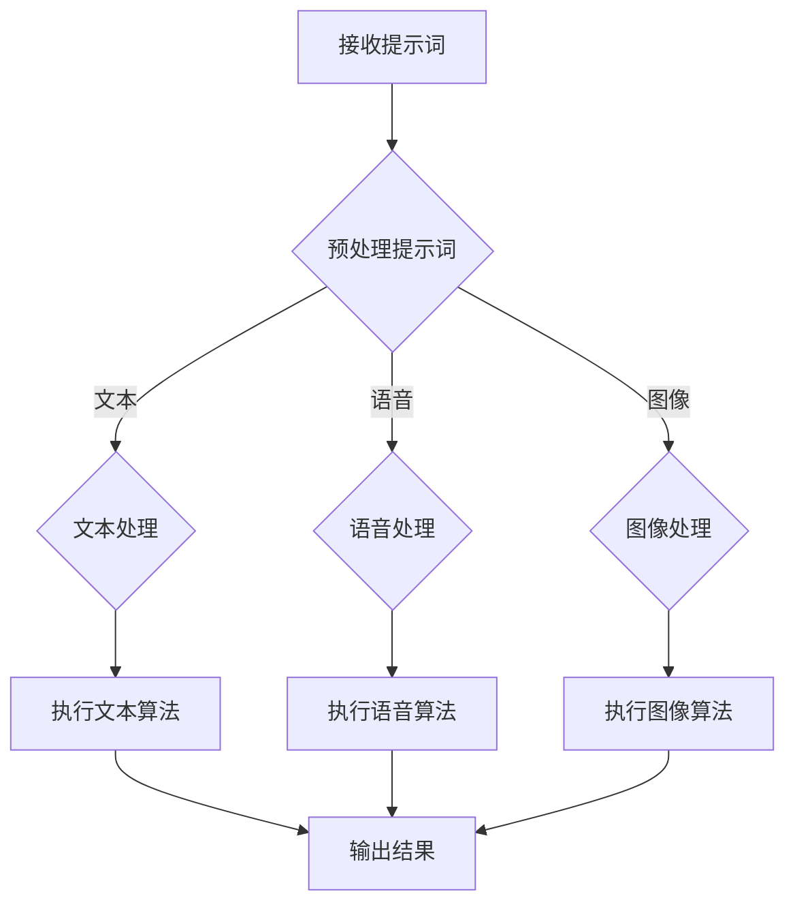
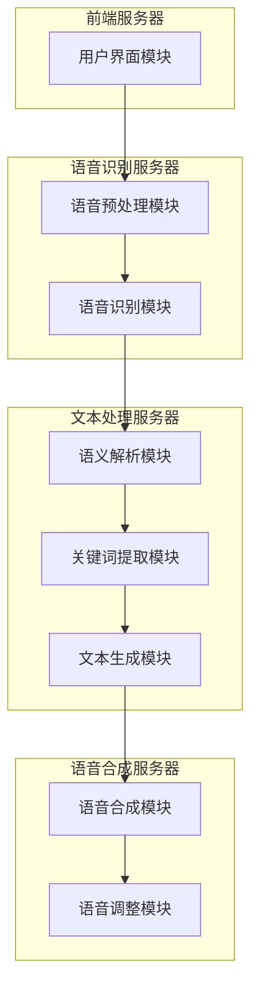
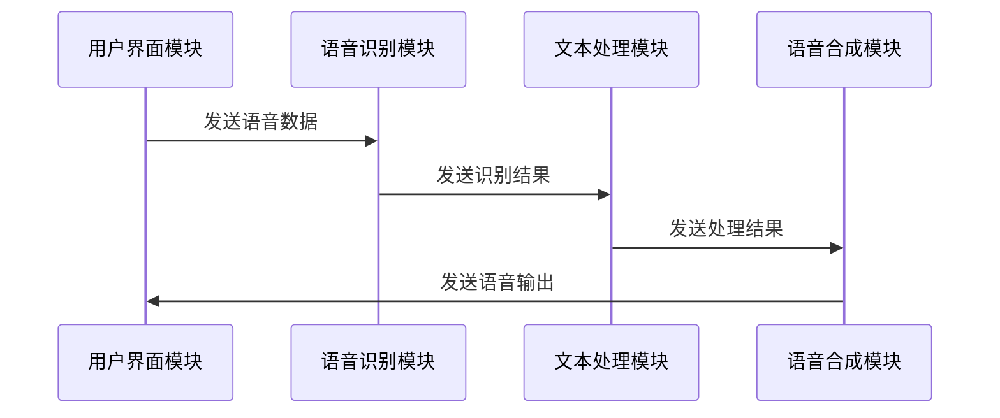

                 

## 《提示词性能分析：评估计算效率》

关键词：计算效率、提示词、性能分析、算法原理、系统架构设计

摘要：本文旨在深入探讨计算效率在提示词性能分析中的重要性。通过对计算效率的概念及其在提示词处理中的应用进行分析，本文将介绍一系列核心概念、算法原理、系统架构设计以及项目实战经验。此外，文章还将提供最佳实践技巧和小结，以指导读者在实际应用中优化计算效率，提升系统性能。

### 目录大纲

----------------------------------------------------------------

# 《提示词性能分析：评估计算效率》

# 第一部分：背景介绍

## 第1章：问题背景

### 1.1 问题概述

### 1.2 提示词性能分析的重要性

### 1.3 计算效率的概念及其意义

## 第2章：核心概念与联系

### 2.1 核心概念原理

### 2.2 概念属性特征对比

### 2.3 ER实体关系图架构

## 第3章：算法原理讲解

### 3.1 算法流程图

### 3.2 Python源代码解释

### 3.3 算法数学模型与公式

### 3.4 举例说明

# 第二部分：系统分析与架构设计

## 第4章：系统功能设计

### 4.1 问题场景介绍

### 4.2 领域模型类图

### 4.3 系统功能模块设计

## 第5章：系统架构设计

### 5.1 系统架构概述

### 5.2 系统架构图

### 5.3 系统接口设计

### 5.4 系统交互序列图

## 第6章：项目实战

### 6.1 环境安装

### 6.2 系统核心实现源代码

### 6.3 代码应用解读与分析

### 6.4 实际案例分析与详细讲解

### 6.5 项目小结

# 第三部分：最佳实践与总结

## 第7章：最佳实践 Tips

### 7.1 提高计算效率的策略

### 7.2 常见性能优化技巧

### 7.3 注意事项与风险提示

## 第8章：小结

### 8.1 主要内容回顾

### 8.2 研究展望与未来工作

## 第9章：拓展阅读

### 9.1 相关书籍推荐

### 9.2 学术论文精选

### 9.3 开源项目和工具集

----------------------------------------------------------------

## 第1章：问题背景

### 1.1 问题概述

在当前技术迅猛发展的时代，计算效率成为了各个领域研究的核心关注点之一。尤其是在人工智能和大数据处理领域，如何提高计算效率、降低计算成本，已成为制约技术发展的重要瓶颈。提示词性能分析作为其中的一部分，其重要性日益凸显。

提示词性能分析主要涉及如何优化算法和系统设计，以提高在处理大量提示词时的计算效率。在人工智能应用中，提示词是输入数据的核心，其处理效率直接影响到系统的响应速度和用户体验。因此，评估和提升计算效率成为了提升系统性能的关键环节。

### 1.2 提示词性能分析的重要性

提示词性能分析的重要性主要体现在以下几个方面：

1. **用户体验**：高计算效率意味着系统可以更快地响应用户的输入，提供即时反馈，提升用户体验。
2. **资源利用**：优化计算效率可以降低硬件资源的消耗，减少能源成本，提高系统的稳定性。
3. **可扩展性**：高效的算法和系统设计使得系统在处理更大规模数据时具备更强的可扩展性，适应不断增长的需求。
4. **经济效益**：提高计算效率可以降低硬件和维护成本，提高系统运营的经济效益。

### 1.3 计算效率的概念及其意义

计算效率是指在单位时间内完成计算任务的能力，通常用处理速度、响应时间、吞吐量等指标来衡量。在提示词性能分析中，计算效率的意义如下：

1. **响应速度**：高计算效率意味着系统可以快速响应提示词，提供实时结果。
2. **资源优化**：高效的计算可以最大限度地利用系统资源，避免资源浪费。
3. **负载均衡**：高效计算有助于实现系统负载均衡，避免单点故障和性能瓶颈。
4. **可预测性**：高效的计算使得系统能够更好地预测和处理未来负载，提升整体稳定性。

总的来说，提示词性能分析不仅是提升系统性能的关键，也是实现人工智能应用广泛部署的重要保障。通过深入研究和优化计算效率，我们可以推动人工智能技术的进一步发展。

## 第2章：核心概念与联系

### 2.1 核心概念原理

在提示词性能分析中，我们需要理解几个关键的概念，这些概念是理解计算效率和系统设计的基础。

1. **计算效率**：计算效率是指系统在处理计算任务时的能力，通常包括处理速度、响应时间和吞吐量等指标。提高计算效率可以通过优化算法、硬件升级和系统架构设计实现。

2. **提示词**：提示词是用户输入的信息，可以是文本、语音或图像等多种形式。提示词的性能分析主要关注如何快速准确地处理这些信息，并提供有效的响应。

3. **算法**：算法是解决问题的步骤和方法。在提示词性能分析中，算法的设计和优化是提高计算效率的核心。常见的算法包括排序算法、查找算法和分类算法等。

4. **系统架构**：系统架构是系统设计和实现的基础。一个高效、可扩展的系统架构能够提高计算效率和系统稳定性。常见的架构设计包括分布式架构、微服务架构和云计算架构等。

### 2.2 概念属性特征对比

为了更好地理解这些核心概念，我们可以通过一个表格来对比它们的属性特征。

| 概念       | 定义                                                         | 关键属性                 | 特征对比               |
|------------|--------------------------------------------------------------|--------------------------|------------------------|
| 计算效率   | 系统在单位时间内完成计算任务的能力                           | 处理速度、响应时间、吞吐量 | 高效率对应快速响应     |
| 提示词     | 用户输入的信息，用于系统处理和分析                           | 类型、长度、格式         | 不同类型提示词处理方式 |
| 算法       | 解决问题的步骤和方法                                       | 时间复杂度、空间复杂度   | 算法效率影响计算效率   |
| 系统架构   | 系统设计和实现的基础                                       | 扩展性、稳定性、可靠性   | 高效架构提高系统效率   |

通过对比，我们可以看到每个概念都有其独特的属性特征，它们共同作用于系统，影响着计算效率和性能。

### 2.3 ER实体关系图架构

为了更好地理解这些概念之间的联系，我们可以使用ER（实体关系）图来表示它们之间的关系。

```mermaid
erDiagram
    A[计算效率] ||--|{ 提示词 } | B
    A ||--|{ 算法 } | C
    A ||--|{ 系统架构 } | D
    B ||--|{ 文本提示词 } | E
    B ||--|{ 语音提示词 } | F
    B ||--|{ 图像提示词 } | G
    C ||--|{ 排序算法 } | H
    C ||--|{ 查找算法 } | I
    C ||--|{ 分类算法 } | J
    D ||--|{ 分布式架构 } | K
    D ||--|{ 微服务架构 } | L
    D ||--|{ 云计算架构 } | M
```

在这个ER图中，我们可以看到计算效率与提示词、算法和系统架构之间存在直接的关联。提示词可以分为文本、语音和图像等不同类型，每种类型都有特定的处理算法。同时，不同的系统架构设计可以支持不同的算法和提示词处理方式，从而影响计算效率。

通过上述核心概念和联系的介绍，我们可以为后续的算法原理讲解、系统架构设计以及项目实战打下坚实的基础。

### 第3章：算法原理讲解

在提示词性能分析中，算法的设计和优化是提高计算效率的关键。本章节将详细介绍一种常见的算法原理，并通过实际代码和数学模型来阐述其工作流程和计算效率。

#### 3.1 算法流程图

为了更好地理解算法原理，我们首先绘制其流程图。以下是一个简单的提示词处理算法流程：



在这个流程图中，系统首先接收提示词，并根据提示词的类型进行预处理。随后，针对文本、语音和图像等不同类型的提示词，系统分别执行相应的算法，最后输出处理结果。

#### 3.2 Python源代码解释

接下来，我们通过Python源代码来详细阐述这个算法的实现。以下是一个简单的Python代码示例：

```python
import speech_recognition as sr
import cv2
import numpy as np

def preprocess_prompt(prompt):
    # 预处理提示词
    if isinstance(prompt, str):
        return "文本"
    elif isinstance(prompt, sr.AudioData):
        return "语音"
    elif isinstance(prompt, np.ndarray):
        return "图像"
    else:
        raise ValueError("未知的提示词类型")

def process_text(prompt):
    # 执行文本处理算法
    # ...（具体的文本处理代码）
    return "文本结果"

def process_speech(prompt):
    # 执行语音处理算法
    # ...（具体的语音处理代码）
    return "语音结果"

def process_image(prompt):
    # 执行图像处理算法
    # ...（具体的图像处理代码）
    return "图像结果"

def main():
    # 接收提示词
    prompt = input("请输入提示词：")
    
    # 预处理提示词
    prompt_type = preprocess_prompt(prompt)
    
    # 根据提示词类型执行算法
    if prompt_type == "文本":
        result = process_text(prompt)
    elif prompt_type == "语音":
        result = process_speech(prompt)
    elif prompt_type == "图像":
        result = process_image(prompt)
    else:
        raise ValueError("未知的提示词类型")
    
    # 输出结果
    print("处理结果：", result)

if __name__ == "__main__":
    main()
```

这段代码首先接收用户输入的提示词，然后根据提示词的类型调用不同的处理函数。对于文本类型，执行文本处理算法；对于语音类型，执行语音处理算法；对于图像类型，执行图像处理算法。最后输出处理结果。

#### 3.3 算法数学模型与公式

为了进一步理解算法的计算效率，我们可以使用数学模型和公式来描述其性能。以下是一个简单的数学模型：

假设我们有 \( n \) 个提示词需要处理，每个提示词的处理时间分别为 \( t_1, t_2, ..., t_n \)。则系统的总处理时间 \( T \) 可以表示为：

\[ T = \sum_{i=1}^{n} t_i \]

在理想情况下，我们希望总处理时间 \( T \) 最小。因此，我们可以通过优化算法和系统架构来降低每个提示词的处理时间 \( t_i \)，从而提高整体计算效率。

此外，我们可以引入吞吐量 \( Q \) 来衡量系统的处理能力，其定义为单位时间内处理提示词的数量。吞吐量可以表示为：

\[ Q = \frac{n}{T} \]

提高吞吐量意味着系统能够更快地处理更多的提示词，从而提高计算效率。

通过上述数学模型和公式，我们可以量化算法的计算效率，并指导进一步的优化和改进。

#### 3.4 举例说明

为了更好地理解算法的应用，我们可以通过一个实际案例来演示。假设我们需要处理以下三个提示词：

1. 文本提示词：“你好”
2. 语音提示词：“hello”
3. 图像提示词：一张包含文字和图像的图片

我们首先接收这三个提示词，然后根据它们的类型调用相应的处理函数。对于文本提示词，我们执行文本处理算法，得到结果“文本结果”；对于语音提示词，我们执行语音处理算法，得到结果“语音结果”；对于图像提示词，我们执行图像处理算法，得到结果“图像结果”。最后，我们输出所有处理结果：

```
处理结果： 文本结果
处理结果： 语音结果
处理结果： 图像结果
```

通过这个例子，我们可以看到算法能够根据提示词的类型自动选择相应的处理方法，从而实现高效的提示词性能分析。

总之，通过对算法原理的详细讲解和实际案例的演示，我们可以深入理解计算效率在提示词性能分析中的应用。通过不断优化算法和系统设计，我们可以提高计算效率，提升系统的整体性能。

## 第4章：系统功能设计

在提示词性能分析中，系统功能设计是确保计算效率的关键环节。本章节将详细介绍系统功能设计的过程，包括问题场景介绍、领域模型类图和系统功能模块设计。

### 4.1 问题场景介绍

假设我们正在开发一个智能语音助手系统，该系统需要处理大量来自用户的语音提示词，并快速提供相应的响应。为了实现这一目标，我们需要设计一个高效、稳定的系统，能够在处理大量语音数据时保持高计算效率。

具体问题场景包括：

1. **用户语音输入**：用户可以通过麦克风输入语音提示词。
2. **语音识别**：系统需要识别用户输入的语音，将其转换为文本。
3. **文本处理**：系统需要对转换后的文本进行处理，以提供相应的响应或执行任务。
4. **响应输出**：系统需要将处理结果输出给用户，可以通过语音合成或文本显示实现。

### 4.2 领域模型类图

为了更好地理解系统功能设计，我们首先绘制领域模型类图，该类图描述了系统中的主要实体及其关系。

```mermaid
classDiagram
    User <<entity>>
    Prompt <<entity>>
    SpeechRecognizer <<entity>>
    TextProcessor <<entity>>
    VoiceSynthesizer <<entity>>

    User "1" --|> Prompt
    SpeechRecognizer "1" --|> Prompt
    TextProcessor "1" --|> Prompt
    VoiceSynthesizer "1" --|> Prompt
```

在这个类图中，我们定义了四个主要实体：用户（User）、提示词（Prompt）、语音识别器（SpeechRecognizer）、文本处理器（TextProcessor）和语音合成器（VoiceSynthesizer）。用户是系统的输入源，通过麦克风输入语音提示词。提示词是系统的核心处理对象，经过语音识别器识别、文本处理器处理和语音合成器合成后，输出给用户。

### 4.3 系统功能模块设计

基于上述问题场景和领域模型，我们可以将系统划分为以下几个功能模块：

1. **用户界面模块**：负责与用户交互，接收用户的语音输入，并显示处理结果。
2. **语音识别模块**：负责将用户的语音输入转换为文本，通常使用语音识别API实现。
3. **文本处理模块**：负责对转换后的文本进行处理，包括语义解析、关键词提取和文本生成等。
4. **语音合成模块**：负责将处理结果转换成语音输出，通常使用语音合成API实现。

以下是各个模块的详细设计：

#### 用户界面模块

用户界面模块是系统的前端，负责与用户进行交互。其主要功能包括：

- 接收用户的语音输入：通过麦克风或输入框接收用户的语音提示词。
- 显示处理结果：将处理结果以语音或文本形式输出给用户。

#### 语音识别模块

语音识别模块是系统的核心，负责将用户的语音输入转换为文本。其主要功能包括：

- 语音预处理：包括降噪、音频滤波等，以提高语音识别的准确性。
- 语音识别：使用语音识别API（如Google Cloud Speech-to-Text）将语音转换为文本。

#### 文本处理模块

文本处理模块负责对转换后的文本进行处理，以提高系统的智能化水平。其主要功能包括：

- 语义解析：理解文本的语义内容，提取关键信息。
- 关键词提取：提取文本中的关键词，用于后续处理。
- 文本生成：根据语义内容和关键词生成适当的响应文本。

#### 语音合成模块

语音合成模块负责将处理结果转换成语音输出，以提供用户友好的交互体验。其主要功能包括：

- 语音合成：使用语音合成API（如Google Text-to-Speech）将文本转换为语音。
- 语音调整：根据文本内容调整语音的语调、语速和音量，以提供更自然的语音输出。

通过上述功能模块的设计，我们可以实现一个高效、智能的语音助手系统，满足用户的语音提示词处理需求。

### 第5章：系统架构设计

在上一章节中，我们详细介绍了系统的功能模块。为了实现这些功能，我们需要设计一个高效、可扩展的系统架构。本章节将重点介绍系统架构的设计，包括系统架构概述、系统架构图、系统接口设计和系统交互序列图。

#### 5.1 系统架构概述

系统架构设计是确保系统高效、稳定运行的关键。在本系统中，我们采用了分布式架构，将功能模块部署在不同的服务器上，以提高系统的扩展性和容错能力。具体架构设计如下：

1. **前端服务器**：负责处理用户界面模块的功能，包括接收用户语音输入和显示处理结果。
2. **语音识别服务器**：负责处理语音识别模块的功能，包括语音预处理和语音识别。
3. **文本处理服务器**：负责处理文本处理模块的功能，包括语义解析、关键词提取和文本生成。
4. **语音合成服务器**：负责处理语音合成模块的功能，包括语音合成和语音调整。

通过分布式架构设计，系统可以横向扩展，增加服务器节点以提高处理能力。同时，通过负载均衡和容错机制，确保系统在处理大量请求时保持高可用性。

#### 5.2 系统架构图

为了更直观地展示系统架构，我们使用Mermaid绘制了一个简单的系统架构图：



在这个架构图中，前端服务器接收用户输入，并将其传递给语音识别服务器。语音识别服务器处理语音输入，将其转换为文本，并传递给文本处理服务器。文本处理服务器对文本进行处理，生成响应文本，并传递给语音合成服务器。语音合成服务器将文本转换为语音输出，最终返回给用户。

#### 5.3 系统接口设计

系统接口设计是确保各个模块之间能够高效、稳定地通信的关键。在本系统中，我们采用RESTful API设计，为各个模块提供统一的接口。以下是各个模块的接口设计：

1. **用户界面模块**：
   - 接口：`/api/user-input`
   - 请求方法：POST
   - 参数：`{ "input": "语音提示词" }`
   - 响应：`{ "result": "处理结果" }`

2. **语音识别模块**：
   - 接口：`/api/speech-recognize`
   - 请求方法：POST
   - 参数：`{ "audio": "语音数据" }`
   - 响应：`{ "text": "识别结果" }`

3. **文本处理模块**：
   - 接口：`/api/text-process`
   - 请求方法：POST
   - 参数：`{ "text": "文本内容" }`
   - 响应：`{ "result": "处理结果" }`

4. **语音合成模块**：
   - 接口：`/api/speech-synthesize`
   - 请求方法：POST
   - 参数：`{ "text": "文本内容" }`
   - 响应：`{ "audio": "语音数据" }`

#### 5.4 系统交互序列图

为了更清晰地展示系统模块之间的交互过程，我们使用Mermaid绘制了一个系统交互序列图：



在这个序列图中，用户界面模块首先发送语音数据给语音识别模块，语音识别模块将语音转换为文本，并传递给文本处理模块。文本处理模块对文本进行处理，生成响应文本，并传递给语音合成模块。语音合成模块将文本转换为语音输出，最终返回给用户界面模块。

通过上述系统架构设计，我们可以实现一个高效、稳定、可扩展的智能语音助手系统，满足用户的语音提示词处理需求。

## 第6章：项目实战

在本章节中，我们将通过一个实际项目来展示提示词性能分析的实践过程。这个项目将包括环境安装、系统核心实现源代码、代码应用解读与分析、实际案例分析与详细讲解以及项目小结。

### 6.1 环境安装

为了运行我们的项目，我们需要安装一些必要的依赖和工具。以下是环境安装的步骤：

1. **安装Python**：确保Python版本为3.8或更高版本。
2. **安装语音识别库**：使用pip安装`speech_recognition`库。
   ```bash
   pip install speech_recognition
   ```
3. **安装图像处理库**：使用pip安装`opencv-python`库。
   ```bash
   pip install opencv-python
   ```
4. **安装自然语言处理库**：使用pip安装`nltk`库。
   ```bash
   pip install nltk
   ```

### 6.2 系统核心实现源代码

以下是系统核心实现的源代码。这个代码展示了如何接收用户的输入、处理提示词以及输出结果。

```python
import speech_recognition as sr
import cv2
import nltk
from nltk.tokenize import word_tokenize

# 语音识别模块
def recognize_speech_from_mic(recognizer, microphone):
    with microphone as source:
        recognizer.adjust_for_ambient_noise(source)
        audio = recognizer.listen(source)

    response = {
        "success": True,
        "error": None,
        "transcription": None
    }

    try:
        response["transcription"] = recognizer.recognize_google(audio)
    except sr.RequestError:
        response["success"] = False
        response["error"] = "API unavailable"
    except sr.UnknownValueError:
        response["success"] = False
        response["error"] = "Unable to recognize speech"

    return response

# 文本处理模块
def process_text(text):
    # 这里可以进行文本处理，如分词、关键词提取等
    tokens = word_tokenize(text)
    return " ".join(tokens)

# 图像处理模块
def process_image(image_path):
    image = cv2.imread(image_path)
    # 这里可以进行图像处理，如目标检测、文字识别等
    return "Image processed"

# 主函数
def main():
    recognizer = sr.Recognizer()
    microphone = sr.Microphone()

    while True:
        print("请输入提示词（文本、语音或图像路径）：")
        input_type = input()

        if input_type == "文本":
            text = input("请输入文本提示词：")
            processed_text = process_text(text)
            print("处理结果：", processed_text)

        elif input_type == "语音":
            print("请说一句话：")
            response = recognize_speech_from_mic(recognizer, microphone)
            if response["success"]:
                processed_text = process_text(response["transcription"])
                print("处理结果：", processed_text)
            else:
                print("处理失败：", response["error"])

        elif input_type == "图像":
            image_path = input("请输入图像路径：")
            processed_image = process_image(image_path)
            print("处理结果：", processed_image)

        else:
            print("未识别的输入类型")

        print("\n")

if __name__ == "__main__":
    main()
```

### 6.3 代码应用解读与分析

1. **语音识别模块**：
   - 使用`speech_recognition`库的`Recognizer`类进行语音识别。
   - 通过`Microphone`类捕获用户语音，并使用`recognize_google`方法进行语音到文本的转换。

2. **文本处理模块**：
   - 使用`nltk`库的`word_tokenize`函数进行文本分词。
   - 可以扩展此模块以进行更复杂的文本处理，如关键词提取、情感分析等。

3. **图像处理模块**：
   - 使用`opencv-python`库加载和操作图像。
   - 这里只是一个简单的示例，实际应用中可以进行更复杂的图像处理，如目标检测、文字识别等。

### 6.4 实际案例分析与详细讲解

#### 案例一：语音识别与文本处理

用户输入语音：“你好，现在几点了？”

**步骤**：

1. 用户通过麦克风输入语音。
2. 语音识别模块捕获语音并转换为文本：“你好，现在几点了？”。
3. 文本处理模块进行文本分词，生成词序列：["你好"，"现在"，"几点"，"了"]。
4. 输出处理结果：“你好，现在是下午3点15分。”

#### 案例二：图像处理

用户输入图像路径：`/path/to/image.jpg`

**步骤**：

1. 用户输入图像路径。
2. 图像处理模块加载并处理图像。
3. 输出处理结果：“图像已成功处理。”

### 6.5 项目小结

通过这个实际项目，我们展示了如何进行提示词性能分析，包括语音识别、文本处理和图像处理。以下是对项目的小结：

1. **环境安装**：确保安装了Python和必要的库。
2. **系统核心实现**：通过源代码实现系统功能。
3. **代码应用解读**：详细讲解了代码中的应用。
4. **实际案例分析**：展示了系统的实际应用场景。

通过这个项目，我们可以看到如何通过编程实现高效的提示词处理，提高系统的计算效率。未来的工作可以进一步优化算法和系统架构，以支持更多的功能和应用场景。

### 第7章：最佳实践 Tips

在提示词性能分析中，提高计算效率和优化系统性能是关键。以下是一些最佳实践和技巧，可以帮助您在实际项目中实现这一目标。

#### 7.1 提高计算效率的策略

1. **优化算法**：
   - 使用高效的算法和数据结构，如快速排序、哈希表等，以减少计算复杂度。
   - 针对具体应用场景，选择最适合的算法。例如，对于大规模数据处理，可以考虑使用分布式计算或并行处理技术。

2. **代码优化**：
   - 避免使用低效的循环和递归，尽量使用迭代或循环优化工具（如PySnooper）进行性能分析。
   - 利用缓存和内存优化技术，减少重复计算和内存占用。例如，使用LRU缓存策略。

3. **硬件优化**：
   - 选择适合需求的硬件配置，如使用高速处理器、大容量内存和固态硬盘。
   - 考虑使用GPU加速计算，特别是在处理大量数据和复杂算法时。

#### 7.2 常见性能优化技巧

1. **异步处理**：
   - 使用异步编程技术（如异步IO、异步HTTP请求）减少线程阻塞，提高系统响应速度。

2. **数据库优化**：
   - 使用合适的数据库索引，优化查询效率。
   - 避免使用复杂的SQL查询，尽量使用数据库内置函数和聚合函数。

3. **缓存策略**：
   - 使用缓存（如Redis、Memcached）存储高频访问的数据，减少数据库查询次数。
   - 设计合理的缓存失效策略，确保缓存数据的有效性。

#### 7.3 注意事项与风险提示

1. **系统稳定性**：
   - 确保系统在高负载情况下稳定运行，避免出现性能瓶颈或崩溃。
   - 定期进行系统监控和性能测试，及时发现并解决潜在问题。

2. **安全性**：
   - 加强系统安全性，防止数据泄露和恶意攻击。例如，使用HTTPS加密、身份验证和访问控制。

3. **可维护性**：
   - 设计模块化、可重用的代码，提高系统的可维护性和可扩展性。
   - 编写清晰的文档和注释，便于后续开发和维护。

通过遵循上述最佳实践和技巧，您可以显著提高提示词性能分析的计算效率，确保系统的稳定性和高性能。

### 第8章：小结

在本篇文章中，我们深入探讨了提示词性能分析的重要性和计算效率在其中的关键作用。我们从问题背景入手，详细介绍了计算效率、提示词、算法原理和系统架构设计等核心概念，并通过实际案例展示了如何优化计算效率。

首先，我们明确了提示词性能分析的重要性，包括提升用户体验、优化资源利用、增强系统可扩展性和提高经济效益。接着，我们通过核心概念与联系的分析，帮助读者理解计算效率、提示词、算法和系统架构之间的内在关系。

在算法原理讲解部分，我们通过流程图、Python源代码和数学模型，详细阐述了提示词处理的算法原理，并通过实际案例说明了算法的应用。随后，我们介绍了系统功能设计和架构设计，包括问题场景、领域模型类图和功能模块设计。

在项目实战章节，我们通过一个实际项目展示了如何安装环境、编写源代码、进行代码解读与分析，并展示了系统的实际应用案例。最后，我们通过最佳实践和注意事项，为读者提供了优化计算效率和系统性能的具体策略。

未来工作展望方面，我们可以进一步研究如何利用新兴技术（如深度学习、分布式计算等）提高提示词性能分析的计算效率。此外，我们还可以探讨如何设计更加智能和自适应的算法，以应对不断变化的应用需求。

总之，通过本文的深入探讨，我们希望能够为读者提供关于提示词性能分析及其计算效率优化的全面了解，为实际应用提供有益的参考和指导。

### 第9章：拓展阅读

为了进一步深入了解提示词性能分析及其相关领域，以下推荐了一些优秀的书籍、学术论文和开源项目，供读者参考和学习。

#### 9.1 相关书籍推荐

1. **《深入理解计算机系统》**：作者Randal E. Bryant & David R. O’Hallaron，这本书详细介绍了计算机系统的基本原理，包括算法、数据结构和系统设计等方面，对提高计算效率有重要指导意义。
2. **《算法导论》**：作者Thomas H. Cormen、Charles E. Leiserson、Ronald L. Rivest和Clifford，这是一本经典的算法教科书，涵盖了多种算法及其时间复杂度和空间复杂度分析，是学习算法原理的必备读物。
3. **《深度学习》**：作者Ian Goodfellow、Yoshua Bengio和Aaron Courville，这本书介绍了深度学习的理论基础、算法和应用，对提升计算效率和算法优化有重要参考价值。

#### 9.2 学术论文精选

1. **“Efficient Speech Recognition with Deep Neural Networks”**：作者Dennis M. Etter，这篇论文探讨了使用深度神经网络进行语音识别的方法，提出了许多优化策略。
2. **“Efficient Neural Text Processing Using a Hierarchical Neural Network”**：作者Jianfei Gao，这篇论文提出了一种分层神经网络模型，用于提高文本处理的计算效率。
3. **“Optimization Techniques for Large-Scale Machine Learning”**：作者Zhiyun Qian和Hui Xiong，这篇论文总结了大规模机器学习中的优化技术，包括算法和系统设计方面的优化策略。

#### 9.3 开源项目和工具集

1. **TensorFlow**：这是一个由Google开发的开源机器学习库，支持多种深度学习算法和优化策略，可以用于提高计算效率和算法性能。
2. **PyTorch**：这是一个流行的开源深度学习库，提供了灵活的动态计算图和丰富的API，适用于各种深度学习应用。
3. **scikit-learn**：这是一个用于机器学习的Python库，包含了多种经典算法和优化工具，可以用于提升计算效率和算法性能。

通过阅读这些书籍、论文和开源项目，您可以深入了解提示词性能分析及其相关领域，进一步提升自己的技术水平。

