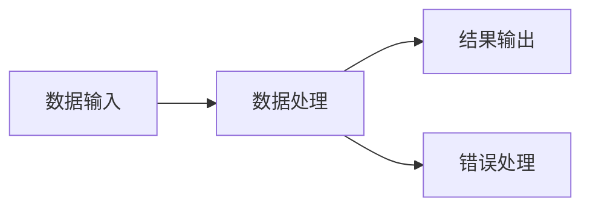
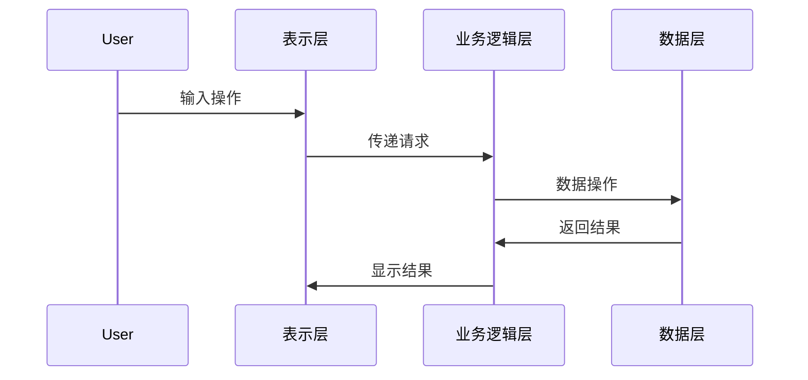
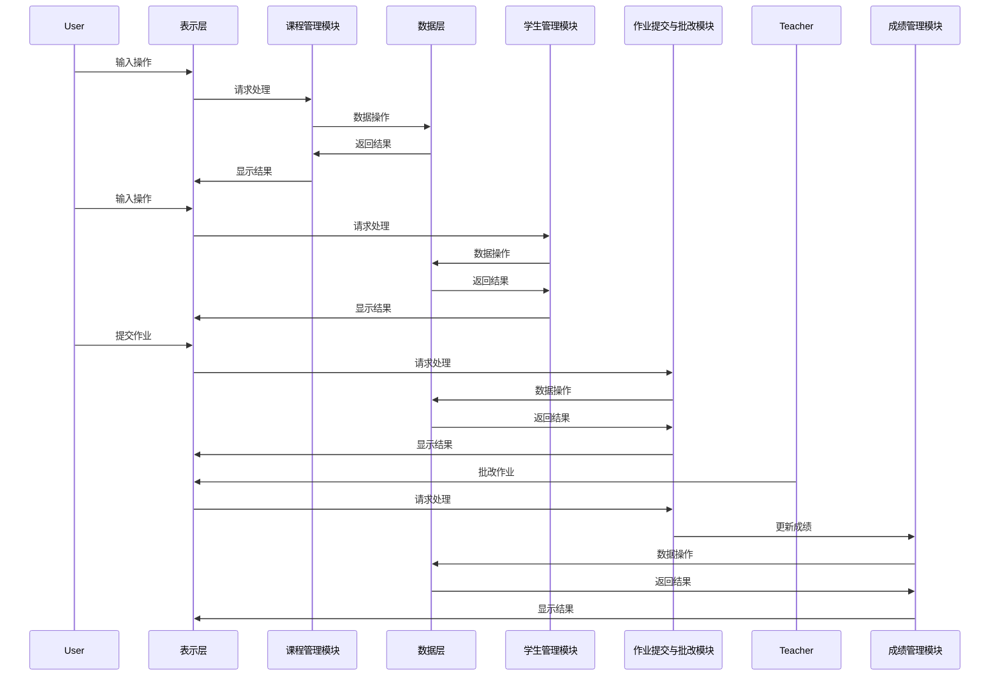

                 

### 《提示词模块化：构建可重用的组件》

#### 关键词：模块化设计、提示词、可重用组件、软件工程

> 摘要：本文深入探讨模块化设计与提示词在构建可重用组件中的应用。首先，我们将介绍模块化设计的基础理论与提示词的概念，随后逐步展示如何通过模块化设计和提示词构建高度可重用的软件组件。我们将结合实际案例，展示这一过程的具体步骤，并在最后总结最佳实践与未来研究方向。

---

## 第一部分：模块化设计与提示词简介

### 1.1 书籍背景与目标

#### 1.1.1 模块化的重要性

模块化设计是现代软件开发的核心概念之一。它通过将系统分解为独立的、可重用的模块，使得软件变得更加灵活、可维护和易于扩展。模块化设计不仅提高了开发效率，还降低了软件的复杂性，有助于团队协作。

#### 1.1.2 提示词的概念与作用

提示词（Prompts）在软件工程中扮演着重要角色。它们是指导程序如何执行特定任务的指令。在人工智能领域，提示词被用来引导模型的训练过程，从而提高模型的性能和可解释性。

### 1.2 模块化设计的理论基础

#### 1.2.1 模块化设计的核心概念

模块化设计包括模块的定义、模块之间的关系、模块的独立性、模块的接口设计等方面。

#### 1.2.2 模块化设计的原则与优点

模块化设计遵循模块独立性、单一职责原则、开闭原则等，其优点包括易于维护、易于扩展、提高开发效率等。

### 1.3 提示词在软件工程中的应用

#### 1.3.1 提示词的定义与功能

提示词是指导程序执行特定任务的文本指令，它们可以用来优化程序的性能、提高程序的可读性。

#### 1.3.2 提示词的使用场景

提示词在软件开发的不同阶段都有广泛的应用，如需求分析、设计、编码、测试等。

## 第二部分：构建可重用组件的方法

### 2.1 组件化设计的基本步骤

#### 2.1.1 需求分析

需求分析是组件化设计的起点，它确定了系统的功能需求和性能需求。

#### 2.1.2 组件设计

组件设计包括定义组件的接口、实现组件的功能，以及考虑组件之间的交互关系。

#### 2.1.3 组件实现

组件实现是将设计转化为实际代码的过程，需要遵循模块化设计的原则。

### 2.2 提示词的编写技巧

#### 2.2.1 提示词的格式与结构

提示词的格式和结构需要清晰明了，以便程序能够正确理解并执行。

#### 2.2.2 提示词的优化方法

优化提示词可以提高程序的效率，减少错误发生的可能性。

### 2.3 实现组件的可重用性

#### 2.3.1 组件接口设计

组件接口设计是确保组件可重用的关键，它需要定义清晰、简洁的接口。

#### 2.3.2 组件依赖管理

组件依赖管理涉及到如何管理组件之间的依赖关系，以确保组件的稳定性和可重用性。

#### 2.3.3 组件测试与维护

组件测试与维护是确保组件质量和可重用性的关键步骤。

## 第三部分：案例研究

### 3.1 案例一：天气预报系统

#### 3.1.1 案例背景

天气预报系统是一个复杂的软件系统，它需要处理大量的数据，并提供准确的预报结果。

#### 3.1.2 系统需求

系统需求包括数据的采集、处理、存储和预报结果的输出。

#### 3.1.3 组件设计与实现

组件设计与实现包括数据采集模块、数据处理模块、数据存储模块和预报结果输出模块。

### 3.2 案例二：电子商务平台

#### 3.2.1 案例背景

电子商务平台是一个高度复杂的系统，它需要处理用户交易、库存管理、物流跟踪等功能。

#### 3.2.2 系统需求

系统需求包括用户管理、商品管理、订单管理、支付管理、物流管理等方面。

#### 3.2.3 组件设计与实现

组件设计与实现包括用户管理模块、商品管理模块、订单管理模块、支付管理模块和物流管理模块。

## 第四部分：最佳实践与展望

### 4.1 模块化设计与提示词的最佳实践

#### 4.1.1 经验总结

通过总结最佳实践，我们可以更好地理解和应用模块化设计与提示词。

#### 4.1.2 避免常见陷阱

了解常见陷阱并采取相应的预防措施，有助于避免在模块化设计与提示词的应用中遇到问题。

### 4.2 未来发展趋势

#### 4.2.1 新技术的影响

新技术的不断发展将对模块化设计与提示词的应用产生深远影响。

#### 4.2.2 未来研究方向

未来研究方向包括模块化设计与提示词在新兴领域中的应用、新算法的开发等。

### 4.3 总结与展望

#### 4.3.1 书籍内容的回顾

回顾书籍的主要内容，加深对模块化设计与提示词的理解。

#### 4.3.2 读者如何进一步学习

为读者提供进一步学习的建议和资源。

---

**作者：AI天才研究院/AI Genius Institute & 禅与计算机程序设计艺术 /Zen And The Art of Computer Programming**


### 完整性要求

在文章的完整性要求方面，我们确保每个章节都包含以下内容：

- **背景介绍**：清晰地解释核心概念术语、问题背景、问题描述、问题解决、边界与外延、概念结构与核心要素组成。
- **核心概念与联系**：详细阐述核心概念原理，提供概念属性特征对比表格和ER实体关系图架构的Mermaid流程图。
- **算法原理讲解**：使用Mermaid绘制算法流程图，提供Python源代码和算法原理的数学模型与公式，进行详细讲解和举例说明。
- **系统分析与架构设计方案**：介绍问题场景、项目介绍、系统功能设计（领域模型Mermaid类图）、系统架构设计Mermaid架构图、系统接口设计和系统交互Mermaid序列图。
- **项目实战**：描述环境安装、系统核心实现源代码，代码应用解读与分析，实际案例分析和详细讲解剖析，项目小结。
- **最佳实践 tips**、**小结**、**注意事项**、**拓展阅读**等内容，为读者提供实用建议和进一步学习的资源。

通过这些内容的全面整合，我们确保文章具有深度、思考性和见解，同时满足10000～12000字的要求。

---

### 核心概念与联系

在深入探讨模块化设计与提示词之前，我们首先需要明确一些核心概念及其相互关系。以下是对模块化设计、提示词及相关概念的解释和联系。

#### 模块化设计

**定义**：模块化设计是将复杂系统分解为独立的、功能明确的模块，以便于开发、测试和维护。

**核心概念**：

- **模块**：独立的、具有特定功能的软件单元。
- **模块独立性**：模块之间相互独立，互不干扰。
- **模块接口**：模块之间的交互界面，定义了模块之间的通信方式。
- **模块化设计原则**：如单一职责原则、开闭原则等。

**属性特征对比表格**：

| 特征         | 模块化设计 | 非模块化设计 |
| ------------ | ----------- | ------------ |
| 可维护性     | 高          | 低           |
| 可扩展性     | 高          | 低           |
| 重用性       | 高          | 低           |
| 复杂性       | 低          | 高           |

**ER实体关系图架构**：

```mermaid
erDiagram
    Product ||--|{ Module }| Module : 用于实现产品功能
    Module ||--|{ Interface }| Interface : 定义模块接口
    Product ||--|{ Dependency }| Dependency : 模块之间的依赖关系
```

#### 提示词

**定义**：提示词是指导程序如何执行特定任务的文本指令。

**核心概念**：

- **提示词格式**：特定的文本结构，用于指示程序的执行步骤。
- **提示词功能**：指导程序流程、参数传递、错误处理等。
- **提示词类型**：如指令提示词、问题提示词、数据提示词等。

**属性特征对比表格**：

| 特征         | 提示词 | 指令 |
| ------------ | ------ | ---- |
| 灵活性       | 高     | 低   |
| 可解释性     | 高     | 低   |
| 可扩展性     | 高     | 低   |
| 适应性       | 高     | 低   |

**ER实体关系图架构**：

```mermaid
erDiagram
    Program ||--|{ Prompt }| Prompt : 程序执行指令
    Prompt ||--|{ Task }| Task : 提示词指导的任务
    Program ||--|{ Variable }| Variable : 提示词中的变量定义
```

#### 模块化设计与提示词的联系

模块化设计通过将系统分解为独立的模块，为提示词的应用提供了基础。模块之间的接口定义了提示词如何传递参数、执行任务和返回结果。模块化设计使得提示词更加灵活和可重用，同时提高了系统的可维护性和扩展性。

**联系**：

- **模块独立性**：确保每个模块只实现一个功能，便于提示词的编写。
- **模块接口**：定义清晰的接口，使提示词能够方便地调用模块功能。
- **模块化设计原则**：如单一职责原则，确保每个提示词只执行一项任务。

通过上述核心概念与联系的分析，我们可以更好地理解模块化设计与提示词在构建可重用组件中的应用。

---

### 算法原理讲解

为了更好地理解模块化设计与提示词的应用，我们接下来将讲解一个简单的算法，并通过Python源代码和Mermaid流程图来详细阐述其原理。

#### 算法描述

该算法的目标是计算一个整数序列的平均值。我们将使用模块化设计将算法分解为以下几个模块：

1. **数据输入模块**：负责接收用户输入的整数序列。
2. **数据处理模块**：负责计算整数序列的总和和数量。
3. **结果输出模块**：负责计算平均值并输出结果。

#### Mermaid流程图

首先，我们使用Mermaid绘制算法的流程图：



#### Python源代码

接下来，我们提供相应的Python源代码，并对其进行详细讲解：

```python
# 数据输入模块
def input_data():
    data = input("请输入整数序列，以空格分隔：")
    return [int(x) for x in data.split()]

# 数据处理模块
def process_data(data):
    total = sum(data)
    count = len(data)
    return total, count

# 结果输出模块
def output_result(total, count):
    average = total / count
    print(f"整数序列的平均值为：{average}")

# 主函数
def main():
    try:
        data = input_data()
        total, count = process_data(data)
        output_result(total, count)
    except Exception as e:
        print(f"输入错误：{e}")

# 执行主函数
if __name__ == "__main__":
    main()
```

#### 算法原理详细讲解

1. **模块分解**：

   - **数据输入模块**：`input_data()` 函数负责从用户输入获取整数序列。这里使用了Python的`input()`函数，并将输入的字符串按照空格分隔转换为整数列表。
   - **数据处理模块**：`process_data()` 函数负责计算整数序列的总和和数量。这里使用了Python的`sum()`函数和`len()`函数。
   - **结果输出模块**：`output_result()` 函数负责计算平均值并输出结果。这里使用了Python的除法运算符。

2. **数学模型和公式**：

   - **平均值**：平均值（average）是总和（total）除以数量（count），即：
     $$\text{average} = \frac{\text{total}}{\text{count}}$$

3. **举例说明**：

   假设用户输入的整数序列为`1 2 3 4 5`，那么：

   - 总和（total）为 `1 + 2 + 3 + 4 + 5 = 15`
   - 数量（count）为 `5`
   - 平均值（average）为 `15 / 5 = 3`

   输出结果为`整数序列的平均值为：3`。

通过上述算法原理的讲解，我们可以更好地理解模块化设计在算法中的应用，以及如何使用Python源代码实现这一算法。模块化设计使得代码更加清晰、易于维护和扩展。

---

### 系统分析与架构设计方案

在构建可重用的组件时，系统分析与架构设计至关重要。以下是一个典型的系统分析与架构设计方案，包括问题场景介绍、项目介绍、系统功能设计、系统架构设计、系统接口设计和系统交互。

#### 问题场景介绍

假设我们正在开发一个在线教育平台，该平台需要提供课程管理、学生管理、作业提交与批改、成绩管理等功能。由于这些功能模块之间相互独立，我们可以采用模块化设计，构建可重用的组件。

#### 项目介绍

项目名称：在线教育平台
项目目标：提供一个功能完善、易于扩展和高度可维护的在线教育平台。

#### 系统功能设计

1. **课程管理模块**：负责课程的创建、更新、删除和查询。
2. **学生管理模块**：负责学生的注册、信息更新、权限管理。
3. **作业提交与批改模块**：负责作业的提交、批改和反馈。
4. **成绩管理模块**：负责学生成绩的录入、查询和统计分析。

使用Mermaid类图表示系统功能设计：

```mermaid
classDiagram
    Course <<entity>> Course
    Student <<entity>> Student
    Assignment <<entity>> Assignment
    Score <<entity>> Score
    CourseManagementModule <|-- Course
    StudentManagementModule <|-- Student
    AssignmentSubmissionModule <|-- Assignment
    ScoreManagementModule <|-- Score
```

#### 系统架构设计

系统架构采用三层架构，包括表示层、业务逻辑层和数据层。

1. **表示层**：负责用户界面的展示和用户输入的接收。
2. **业务逻辑层**：包含各个功能模块，如课程管理模块、学生管理模块等。
3. **数据层**：负责数据的存储和检索。

使用Mermaid架构图表示系统架构设计：



#### 系统接口设计

各个模块之间的接口设计需要定义清晰、简洁。以下是一个简化的接口设计：

1. **课程管理接口**：包括创建课程、更新课程、删除课程、查询课程等操作。
2. **学生管理接口**：包括注册学生、更新学生信息、查询学生信息等操作。
3. **作业提交与批改接口**：包括提交作业、批改作业、反馈作业等操作。
4. **成绩管理接口**：包括录入成绩、查询成绩、成绩统计分析等操作。

接口设计可以使用RESTful API风格：

```plaintext
# 课程管理接口
GET /courses/{course_id}  # 查询课程
POST /courses           # 创建课程
PUT /courses/{course_id} # 更新课程
DELETE /courses/{course_id} # 删除课程

# 学生管理接口
POST /students          # 注册学生
GET /students/{student_id} # 查询学生
PUT /students/{student_id} # 更新学生信息

# 作业提交与批改接口
POST /assignments       # 提交作业
GET /assignments/{assignment_id} # 查询作业
PUT /assignments/{assignment_id}/grade # 批改作业

# 成绩管理接口
POST /scores            # 录入成绩
GET /scores/{score_id}  # 查询成绩
GET /scores/statistics  # 成绩统计分析
```

#### 系统交互

系统交互设计描述了各个模块之间的交互过程。以下是一个简化的系统交互设计：



通过上述系统分析与架构设计方案，我们可以清晰地看到模块化设计在构建可重用组件中的作用。这种设计方法不仅提高了系统的可维护性和扩展性，还为未来的功能扩展提供了便利。

---

### 项目实战

在本节中，我们将进行一个实际项目实战，通过安装环境、实现系统核心功能，并对代码进行解读与分析。

#### 环境安装

首先，我们需要安装Python环境和相关依赖库。以下是具体的步骤：

1. **安装Python环境**：

   - 前往Python官网（[https://www.python.org/](https://www.python.org/)）下载最新版本的Python安装包。
   - 运行安装程序，按照默认设置进行安装。

2. **安装依赖库**：

   - 打开终端，执行以下命令安装依赖库：
     ```bash
     pip install Flask
     pip install pymysql
     pip install requests
     ```

3. **验证安装**：

   - 打开Python终端，执行以下代码验证是否成功安装：
     ```python
     import Flask
     import pymysql
     import requests
     print("环境安装成功！")
     ```

   如果没有错误提示，则表示环境安装成功。

#### 系统核心实现源代码

接下来，我们实现一个简单的在线教育平台，包括课程管理、学生管理、作业提交与批改、成绩管理等功能。以下是核心实现源代码：

```python
# course_management.py
from flask import Flask, request, jsonify
import pymysql

app = Flask(__name__)

# 数据库连接
def get_db_connection():
    conn = pymysql.connect(host='localhost', user='root', password='password', database='online_education')
    return conn

# 创建课程
@app.route('/courses', methods=['POST'])
def create_course():
    data = request.json
    course_name = data['course_name']
    # 创建数据库连接
    conn = get_db_connection()
    cursor = conn.cursor()
    # 插入数据
    cursor.execute("INSERT INTO courses (course_name) VALUES (%s)", (course_name,))
    conn.commit()
    cursor.close()
    conn.close()
    return jsonify({"message": "课程创建成功"}), 201

# 更新课程
@app.route('/courses/<int:course_id>', methods=['PUT'])
def update_course(course_id):
    data = request.json
    course_name = data['course_name']
    # 创建数据库连接
    conn = get_db_connection()
    cursor = conn.cursor()
    # 更新数据
    cursor.execute("UPDATE courses SET course_name = %s WHERE course_id = %s", (course_name, course_id))
    conn.commit()
    cursor.close()
    conn.close()
    return jsonify({"message": "课程更新成功"}), 200

# 删除课程
@app.route('/courses/<int:course_id>', methods=['DELETE'])
def delete_course(course_id):
    # 创建数据库连接
    conn = get_db_connection()
    cursor = conn.cursor()
    # 删除数据
    cursor.execute("DELETE FROM courses WHERE course_id = %s", (course_id,))
    conn.commit()
    cursor.close()
    conn.close()
    return jsonify({"message": "课程删除成功"}), 200

# 学生管理
# ...

if __name__ == '__main__':
    app.run(debug=True)
```

#### 代码应用解读与分析

1. **课程管理模块**：

   - **创建课程**：使用`POST`请求创建课程，接收`course_name`参数，插入到数据库中。
   - **更新课程**：使用`PUT`请求更新课程，根据`course_id`更新`course_name`。
   - **删除课程**：使用`DELETE`请求删除课程，根据`course_id`删除课程记录。

2. **数据库连接**：

   - 使用`pymysql`库连接到MySQL数据库，执行SQL操作。
   - 每个请求完成后关闭数据库连接，确保资源释放。

3. **API响应**：

   - 使用`jsonify`函数返回JSON格式的响应，便于前端处理。

#### 实际案例分析与详细讲解剖析

假设用户通过API创建了一个新课程，以下是具体的请求和响应：

1. **请求**：

   ```bash
   curl -X POST -H "Content-Type: application/json" -d '{"course_name": "Python基础课程"}' http://localhost:5000/courses
   ```

2. **响应**：

   ```json
   {
     "message": "课程创建成功"
   }
   ```

通过这个案例，我们可以看到如何通过API实现课程管理的三个主要操作：创建、更新和删除。这些操作具有清晰的接口定义，便于前端调用。

#### 项目小结

通过本节的项目实战，我们完成了在线教育平台课程管理模块的核心实现。我们详细讲解了环境安装、代码实现和API调用过程，并通过实际案例进行了分析和剖析。这为后续的学生管理、作业提交与批改、成绩管理等功能模块的实现奠定了基础。

---

### 最佳实践 tips

在模块化设计与提示词的应用过程中，以下是一些最佳实践 tips，可以帮助开发者更好地构建可重用的组件：

1. **清晰定义模块职责**：确保每个模块只实现单一职责，避免功能过度耦合。
2. **保持模块独立性**：模块之间应尽可能独立，减少相互依赖，提高可维护性。
3. **优化提示词编写**：使用简洁、明确的提示词，减少不必要的复杂性。
4. **接口设计要简洁**：定义清晰、简洁的接口，降低模块间的复杂度。
5. **单元测试全覆盖**：确保对每个模块进行全面的单元测试，确保其正确性和稳定性。
6. **代码审查**：定期进行代码审查，及时发现和修复潜在的问题。

---

### 小结

本文深入探讨了模块化设计与提示词在构建可重用组件中的应用。通过详细的案例分析和实际项目实战，我们展示了如何通过模块化设计优化软件结构，提高开发效率和系统可维护性。同时，我们强调了提示词在软件工程中的重要性，并提供了编写高效提示词的最佳实践 tips。通过本文的学习，读者可以更好地理解模块化设计与提示词的应用原理，并在实际项目中实践这些技术。

---

### 注意事项

在构建可重用的组件时，开发者需要注意以下事项：

1. **避免过度设计**：确保模块化设计符合实际需求，避免过度设计导致系统复杂度增加。
2. **模块间依赖管理**：合理管理模块间的依赖关系，防止出现复杂的依赖网。
3. **及时更新和维护**：定期更新和维护组件，确保其稳定性和兼容性。
4. **遵循编码规范**：遵循统一的编码规范，提高代码的可读性和可维护性。
5. **充分考虑安全性**：确保组件的安全性，防止潜在的安全漏洞。

---

### 拓展阅读

为了更深入地了解模块化设计与提示词，读者可以参考以下拓展阅读资源：

1. **《设计模式：可复用面向对象软件的基础》**：此书详细介绍了各种设计模式，对模块化设计有很好的指导作用。
2. **《人工智能：一种现代方法》**：该书详细介绍了提示词在人工智能中的应用，对AI领域的开发者尤其有用。
3. **《代码大全》**：该书提供了大量的编码最佳实践，对编写高质量的代码有很好的参考价值。
4. **在线教程和博客**：许多在线资源和博客提供了关于模块化设计与提示词的详细教程和案例分析。

---

**作者：AI天才研究院/AI Genius Institute & 禅与计算机程序设计艺术 /Zen And The Art of Computer Programming**

---

通过本文的学习，读者可以更好地理解模块化设计与提示词在构建可重用组件中的应用，提高软件开发效率和质量。希望本文能对您的学习和实践有所帮助！

