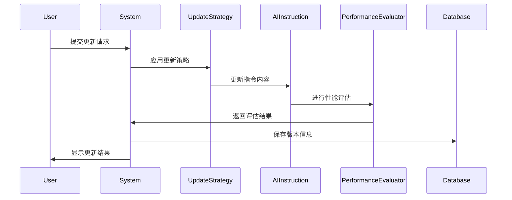
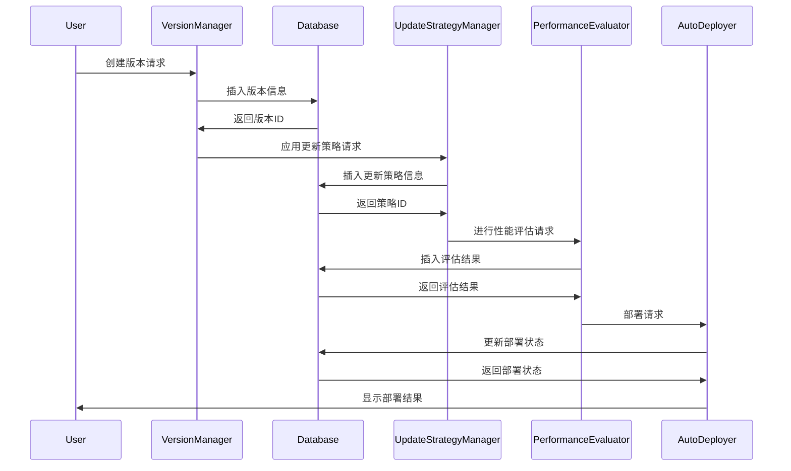

                 


## 引言

随着人工智能技术的迅速发展，人工智能指令（AI Instructions）在众多领域中扮演着越来越重要的角色。从自动驾驶、智能客服到医疗诊断和金融分析，AI指令是实现这些应用的核心。然而，随着AI指令的复杂性和规模不断增长，如何有效地管理和迭代这些指令成为一个亟待解决的问题。

### 文章目的

本文旨在深入探讨AI指令版本控制这一关键领域，帮助开发者、企业和技术爱好者更好地理解和应用版本控制技术来管理和迭代他们的AI指令。通过本文，读者将：

1. **理解AI指令版本控制的核心概念和重要性**。
2. **分析现有的版本控制方法，包括其优缺点**。
3. **介绍一个新型的AI指令版本控制框架，并探讨其实现方法**。
4. **通过实际案例展示如何应用该框架进行AI指令的管理和迭代**。

### 文章结构

本文将按照以下结构进行讨论：

1. **背景介绍**：介绍AI指令版本控制的重要性、问题背景、问题描述、问题解决、边界与外延、概念结构与核心要素组成。
2. **核心概念与联系**：详细阐述AI指令、版本控制、更新策略、性能评估等核心概念，并展示相关概念属性特征对比表格和ER实体关系图架构。
3. **算法原理讲解**：使用Mermaid绘制算法流程图，并用Python源代码详细阐述算法原理、数学模型和公式，进行通俗易懂的举例说明。
4. **系统分析与架构设计方案**：介绍问题场景、项目介绍、系统功能设计、系统架构设计、系统接口设计和系统交互，使用Mermaid绘制相关架构图和序列图。
5. **项目实战**：介绍环境安装、系统核心实现源代码，代码应用解读与分析，实际案例分析和详细讲解剖析，项目小结。
6. **最佳实践 tips、小结、注意事项、拓展阅读等内容**。

通过这一结构的讨论，我们将系统地了解和掌握AI指令版本控制的关键技术和实践方法。

### 第一部分：背景介绍

#### 1.1.1 问题背景

随着人工智能技术的快速发展，AI指令在各类应用中扮演着至关重要的角色。无论是自动驾驶中的路径规划，还是智能客服中的对话管理，AI指令都是实现这些智能功能的核心组成部分。然而，随着AI指令的复杂性和规模不断增长，如何有效地管理和迭代这些指令成为了一个亟待解决的问题。

传统的版本控制技术主要应用于软件工程领域，通过版本库和日志记录等方式，实现对源代码的版本管理和变更追踪。这些技术已经成功地帮助开发者在软件开发生命周期中维护代码的稳定性和可追溯性。然而，将这些传统版本控制技术应用于AI指令的管理和迭代，面临着一些独特的挑战。

首先，AI指令的版本变化往往更为频繁和复杂。由于AI模型的不断优化和更新，AI指令的变更不仅涉及代码层面的调整，还包括数据集的更新、模型参数的调整等。其次，AI指令的变更往往涉及到多方面的依赖关系，如与硬件设备、软件框架和其他AI组件的兼容性。这些因素使得AI指令版本控制的需求更为迫切。

此外，随着AI技术的发展，AI指令的应用场景也在不断扩展。例如，在金融领域，AI指令可以用于风险评估和交易策略的优化；在医疗领域，AI指令可以用于诊断支持和治疗方案推荐。这些应用场景对AI指令的稳定性和可靠性提出了更高的要求，因此，有效的版本控制成为确保AI系统正常运行的关键。

综上所述，AI指令版本控制不仅是确保AI系统稳定运行的基础，也是支持AI技术持续创新的重要保障。随着AI技术的不断进步，如何更好地管理和迭代AI指令，已经成为一个关键的研究和应用领域。

#### 1.1.2 问题描述

AI指令版本控制的问题主要涉及以下几个方面：

1. **版本管理**：如何对AI指令的变更历史进行有效管理，确保历史版本的可追溯性和可恢复性？这是AI指令版本控制的基础问题，涉及到版本库的设计和实现。

2. **更新策略**：在AI指令更新过程中，如何平衡新功能的引入与旧功能的兼容性？这涉及到更新策略的制定和优化，以确保更新过程的平稳过渡。

3. **错误定位与修复**：如何快速定位并修复AI指令中的错误，提高AI系统的稳定性？这是确保AI系统可靠运行的关键，需要高效的问题定位和修复机制。

4. **性能评估**：如何评估不同版本AI指令的性能和效果？这涉及到性能测试和评估工具的设计，以帮助开发者选择最佳版本。

5. **跨领域应用**：如何确保AI指令在不同应用场景中的稳定性和可靠性？这涉及到AI指令的通用性和适应性设计。

6. **多团队协作**：如何支持跨团队协作，确保各团队之间的版本同步和协作效率？这涉及到版本控制的协同工作和沟通机制。

#### 1.1.3 问题解决

为了解决上述问题，本书将从以下几个方面进行探讨：

1. **基本概念介绍**：首先介绍AI指令版本控制的基本概念，包括AI指令、版本控制、更新策略、性能评估等。

2. **现有方法分析**：分析现有的AI指令版本控制方法，包括基于版本库的方法、基于日志的方法和基于版本库与日志结合的方法，并讨论它们的优缺点。

3. **新型框架提出**：提出一种新型的AI指令版本控制框架，详细描述其核心功能和实现方法，以解决现有方法中存在的问题。

4. **实现方法讲解**：通过具体案例，展示如何使用该框架进行AI指令的管理和迭代，包括版本管理、更新策略配置、性能评估等。

5. **实际应用案例**：通过实际案例，展示如何在实际项目中应用该框架，解决版本控制和迭代过程中的实际问题。

通过上述探讨，读者将能够深入理解AI指令版本控制的重要性，掌握有效的版本控制方法，并能够在实际项目中应用这些方法，提升AI系统的稳定性和可靠性。

#### 1.1.4 边界与外延

AI指令版本控制主要适用于需要频繁更新和迭代的大型AI系统，如自动驾驶、智能客服、金融分析等。在这些领域中，AI指令的版本控制不仅关系到系统的稳定性和可靠性，也直接影响到用户体验和应用效果。

同时，AI指令版本控制也涉及多个领域的交叉应用。例如，在自动驾驶领域，AI指令的版本控制需要与硬件设备、软件框架、数据管理等多个子系统协同工作。在智能客服领域，AI指令的版本控制需要与自然语言处理、对话管理、用户行为分析等多个模块相互配合。

此外，AI指令版本控制还涉及到软件工程、人工智能和数据管理等多个领域的技术和方法。在软件工程中，版本控制技术如Git、SVN等被广泛应用于代码管理；在人工智能领域，模型训练和参数调整等过程也需要版本控制的支持；在数据管理领域，数据版本控制和数据审计技术为AI指令的版本控制提供了重要保障。

综上所述，AI指令版本控制不仅是一个技术问题，也是一个跨领域的综合性问题，需要结合多个领域的知识和方法，实现有效的管理和迭代。

#### 1.1.5 概念结构与核心要素组成

在深入探讨AI指令版本控制之前，我们需要明确几个关键概念和它们之间的联系，以便构建一个清晰的概念框架。以下是AI指令版本控制的核心概念及其相互关系：

1. **AI指令**：AI指令是指用于指导人工智能系统执行特定任务的一系列操作指令。这些指令可以是基于编程语言编写的，也可以是通过自然语言处理技术生成的。AI指令的质量和效率直接影响到AI系统的性能和应用效果。

2. **版本控制**：版本控制是对AI指令的变更历史进行跟踪和管理的一种技术。通过版本控制，开发者可以追溯AI指令的变更历史，确保变更的可追溯性和可恢复性。常见的版本控制工具有Git、Mercurial等。

3. **更新策略**：更新策略是确定AI指令更新规则和方法的一系列策略。合理的更新策略可以帮助开发者更好地管理AI指令的变更，确保新功能的引入与旧功能的兼容性。例如，渐进式更新、并行更新等策略。

4. **性能评估**：性能评估是评估不同版本AI指令性能和效果的一种技术。通过性能评估，可以确定哪些AI指令版本更适合当前的应用场景，从而提高AI系统的应用效果。常见的性能评估指标包括准确率、响应时间等。

以下是这些概念之间关系的ER实体关系图：

```mermaid
erDiagram
    AI指令 ||--|{ 版本控制 }|| 版本库
    版本控制 ||--|{ 更新策略 }|| 更新规则
    更新策略 ||--|{ 性能评估 }|| 评估指标
```

**概念属性特征对比表格**：

| 概念       | 定义                                                         | 特征对比                                                   |
|------------|--------------------------------------------------------------|------------------------------------------------------------|
| AI指令     | 用于指导AI系统执行任务的操作指令                               | 编程语言编写、自然语言生成、可执行性等                   |
| 版本控制   | 跟踪和管理AI指令变更历史的技术                                 | 可追溯性、可恢复性、变更记录等                           |
| 更新策略   | 确定AI指令更新规则和方法的一系列策略                           | 渐进式更新、并行更新、兼容性保障等                       |
| 性能评估   | 评估不同版本AI指令性能和效果的一种技术                         | 准确率、响应时间、用户体验等                             |

通过上述概念和特征对比，我们可以更清晰地理解AI指令版本控制的核心要素和相互关系，为后续的深入探讨和实现提供基础。

### 第二部分：核心概念与联系

#### 2.1 AI指令版本控制的基本概念

在深入探讨AI指令版本控制之前，我们需要明确几个关键概念，以便构建一个清晰的理论框架。以下是AI指令版本控制的核心概念：

1. **AI指令**：AI指令是指通过编程或自然语言生成的方式，用于指导人工智能系统执行特定任务的一系列操作指令。这些指令可以是基于特定算法或模型的，例如路径规划、对话管理、图像识别等。AI指令的质量和效率直接影响AI系统的性能和应用效果。

2. **版本控制**：版本控制是对AI指令的变更历史进行跟踪和管理的一种技术。通过版本控制，开发者可以记录AI指令的每一次变更，包括修改内容、修改时间和修改者等，确保变更的可追溯性和可恢复性。常见的版本控制工具有Git、SVN等。

3. **更新策略**：更新策略是确定AI指令更新规则和方法的一系列策略。合理的更新策略可以帮助开发者更好地管理AI指令的变更，确保新功能的引入与旧功能的兼容性。例如，渐进式更新、并行更新、回滚策略等。

4. **性能评估**：性能评估是评估不同版本AI指令性能和效果的一种技术。通过性能评估，可以确定哪些AI指令版本更适合当前的应用场景，从而提高AI系统的应用效果。常见的性能评估指标包括准确率、响应时间、用户体验等。

以下是这些概念之间关系的ER实体关系图：

```mermaid
erDiagram
    AI指令 ||--|{ 版本控制 }|| 版本库
    版本控制 ||--|{ 更新策略 }|| 更新规则
    版本控制 ||--|{ 性能评估 }|| 评估指标
```

**概念属性特征对比表格**：

| 概念       | 定义                                                         | 特征对比                                                   |
|------------|--------------------------------------------------------------|------------------------------------------------------------|
| AI指令     | 用于指导AI系统执行任务的操作指令                               | 编程语言编写、自然语言生成、可执行性等                   |
| 版本控制   | 跟踪和管理AI指令变更历史的技术                                 | 可追溯性、可恢复性、变更记录等                           |
| 更新策略   | 确定AI指令更新规则和方法的一系列策略                           | 渐进式更新、并行更新、兼容性保障等                       |
| 性能评估   | 评估不同版本AI指令性能和效果的一种技术                         | 准确率、响应时间、用户体验等                             |

通过上述核心概念和特征对比，我们可以更深入地理解AI指令版本控制的基本概念及其相互关系，为后续的深入探讨和实践提供理论基础。

#### 2.2 AI指令版本控制的方法与实现

AI指令版本控制是实现AI系统稳定性和可靠性的重要手段。为了有效地管理和迭代AI指令，我们可以采用以下几种主要方法：

##### 2.2.1 基于版本库的方法

基于版本库的方法是AI指令版本控制中最常用的一种方法。版本库是一种集中管理的存储系统，用于保存AI指令的历史版本和变更记录。通过版本库，开发者可以方便地查看、修改和恢复AI指令的不同版本。

**优点**：

- **可追溯性**：版本库可以记录每一次变更的详细信息，如修改时间、修改者、修改内容等，确保变更的可追溯性。
- **可恢复性**：通过版本库，开发者可以随时恢复到任何一个历史版本，确保系统的稳定性和可靠性。

**缺点**：

- **资源消耗**：随着版本数量的增加，版本库的存储空间和资源消耗也会增加，特别是在大型AI系统中。
- **并发控制**：在多用户环境下，如何有效地进行并发控制和版本同步是一个挑战。

##### 2.2.2 基于日志的方法

基于日志的方法是通过对AI指令的变更过程进行日志记录来实现版本控制。日志记录包括变更操作的详细信息，如操作类型、操作时间和操作内容等。

**优点**：

- **轻量级**：相对于版本库，日志方法在存储和资源消耗方面较为轻量，适用于资源有限的场景。
- **灵活性好**：开发者可以根据实际需求，自定义日志记录的内容和格式，以适应不同的应用场景。

**缺点**：

- **不可恢复性**：由于日志方法不提供版本库中的完整变更记录，一旦出现错误，很难完全恢复到错误发生前的状态。
- **日志分析复杂**：随着日志数据的积累，如何有效地分析日志并提取有价值的信息成为一个挑战。

##### 2.2.3 基于版本库与日志结合的方法

基于版本库与日志结合的方法是将版本库和日志记录结合起来，以实现更全面的版本控制。这种方法综合了版本库的可追溯性和日志的灵活性，适用于复杂的AI指令版本控制场景。

**优点**：

- **全面性**：结合了版本库和日志的优点，可以实现全面的版本控制。
- **高效性**：在需要快速访问和恢复版本时，版本库可以提供高效的访问和恢复机制。

**缺点**：

- **复杂度增加**：结合了多个控制方法，系统的复杂度和实现难度增加。
- **资源消耗**：同时维护版本库和日志，会带来额外的资源消耗。

综上所述，不同版本控制方法各有优缺点，适用于不同的应用场景。开发者需要根据具体需求选择合适的版本控制方法，并在实践中不断优化和完善，以提高AI系统的稳定性和可靠性。

#### 2.3 AI指令版本控制的核心功能与实现

在AI指令版本控制中，核心功能包括版本管理、更新策略配置和性能评估等。这些功能共同协作，确保AI指令的稳定性和可靠性。

##### 2.3.1 版本管理

版本管理是实现AI指令版本控制的基础功能，主要包括版本查看、版本修改和版本恢复等操作。通过版本管理，开发者可以方便地查看AI指令的历史版本，了解每次变更的内容和影响。

**实现方法**：

1. **版本库设计**：设计一个集中式版本库，用于存储AI指令的历史版本。版本库应支持版本号的自动生成、版本信息的记录和版本的历史追溯。

2. **版本查看**：开发者可以通过版本库查看AI指令的各个版本，包括版本号、修改时间、修改者等信息。

3. **版本修改**：在需要时，开发者可以对AI指令进行修改，并保存为新的版本。修改应记录变更内容，以便后续追溯。

4. **版本恢复**：在出现问题时，开发者可以恢复到之前的版本，确保系统的稳定性和可靠性。

**挑战**：

- **版本冲突**：在多用户环境中，如何有效地处理版本冲突，确保数据的一致性是一个挑战。
- **版本历史管理**：随着版本数量的增加，如何高效地管理版本历史，确保不丢失重要信息。

##### 2.3.2 更新策略配置

更新策略配置是确定AI指令更新规则和方法的关键环节。合理的更新策略可以确保新功能的引入与旧功能的兼容性，避免系统不稳定。

**实现方法**：

1. **更新规则定义**：定义AI指令更新的规则，如版本号递增规则、更新频率限制、更新前测试要求等。

2. **更新前评估**：在执行更新之前，对现有版本进行性能评估，确保更新不会对系统稳定性产生负面影响。

3. **更新过程控制**：在更新过程中，实时监控AI指令的运行状态，确保更新过程顺利进行。

4. **更新后验证**：更新完成后，对AI指令进行验证，确保新版本符合预期功能要求。

**挑战**：

- **兼容性保障**：在引入新功能时，如何确保与旧功能的兼容性，避免出现不兼容问题。
- **更新效率**：在保证系统稳定性的同时，如何提高更新效率，减少对系统运行的影响。

##### 2.3.3 性能评估与比较

性能评估与比较是评估不同版本AI指令性能和效果的重要手段。通过性能评估，可以确定哪些AI指令版本更适合当前的应用场景，从而提高AI系统的性能和用户体验。

**实现方法**：

1. **性能指标定义**：定义AI指令的性能指标，如响应时间、准确率、资源消耗等。

2. **性能测试**：对不同版本的AI指令进行性能测试，收集性能数据。

3. **结果分析**：对性能测试结果进行分析，比较不同版本的性能表现。

4. **推荐策略**：根据性能评估结果，推荐最佳版本的AI指令。

**挑战**：

- **指标选择**：如何选择合适的性能指标，全面评估AI指令的性能。
- **数据噪声**：性能测试过程中可能受到数据噪声的影响，如何减少数据噪声的影响。

通过上述核心功能的实现，AI指令版本控制可以有效地管理和迭代AI指令，确保AI系统的稳定性和可靠性。

### 第二部分：核心概念与联系

#### 2.4 AI指令版本控制的优势与挑战

AI指令版本控制具有多方面的优势，但同时也面临一定的挑战。以下是AI指令版本控制的主要优势和面临的挑战：

#### 2.4.1 优势

1. **提高系统的稳定性**：通过版本控制，开发者可以跟踪和管理AI指令的变更历史，确保每次变更不会引入新的错误，从而提高系统的稳定性。

2. **支持快速迭代**：版本控制使得开发者可以方便地创建新版本，并进行快速迭代。这有助于快速响应市场需求和技术变化，提高开发效率。

3. **增强可追溯性**：版本控制提供了完整的变更记录，使得开发者可以追溯每个版本的变更原因和影响，增强系统的透明性和可追溯性。

4. **保障兼容性**：通过更新策略和性能评估，AI指令版本控制可以确保新版本的AI指令与旧版本的功能兼容，减少因不兼容导致的问题。

5. **促进团队合作**：版本控制工具通常支持多人协作，使得团队成员可以方便地共享和同步代码，提高团队合作效率。

#### 2.4.2 挑战

1. **数据量管理**：随着AI系统的规模扩大，版本库中的数据量也会急剧增加，如何高效地管理和存储这些数据成为一个挑战。

2. **版本冲突**：在多用户环境中，不同开发者可能会同时修改同一份AI指令，如何有效地处理版本冲突，确保数据的一致性是一个难题。

3. **性能影响**：版本库和日志记录可能会增加系统的资源消耗，特别是在大型AI系统中，如何平衡版本控制和系统性能之间的关系是一个挑战。

4. **复杂性增加**：AI指令版本控制涉及到多个方面，如版本库设计、更新策略、性能评估等，如何有效地整合和管理这些方面，提高系统的复杂性和实现难度。

5. **安全性问题**：版本库和日志记录涉及到敏感信息，如何确保这些信息的安全，防止数据泄露或被篡改，是一个重要的挑战。

综上所述，AI指令版本控制具有显著的优势，但同时也面临一系列挑战。开发者需要深入理解这些优势和挑战，并采取适当的方法和工具来应对这些挑战，以确保AI系统的稳定性和可靠性。

### 第二部分：核心概念与联系

#### 2.5 AI指令版本控制的核心概念与联系

在深入探讨AI指令版本控制的核心概念之前，我们需要明确几个关键术语和它们之间的相互关系。以下是AI指令版本控制的核心概念及其相互联系：

1. **AI指令**：AI指令是指用于指导人工智能系统执行特定任务的一系列操作指令。这些指令可以是基于编程语言编写的，也可以是通过自然语言处理技术生成的。AI指令是AI系统的核心组成部分，其质量和效率直接影响系统的性能和应用效果。

2. **版本控制**：版本控制是一种技术，用于跟踪和管理AI指令的变更历史。通过版本控制，开发者可以记录每次变更的详细信息，如修改时间、修改者和变更内容，确保变更的可追溯性和可恢复性。常见的版本控制工具包括Git、SVN等。

3. **更新策略**：更新策略是一系列规则和方法，用于确定AI指令的更新方式。合理的更新策略可以帮助开发者有效地管理AI指令的变更，确保新功能的引入与旧功能的兼容性，并减少因更新引起的问题。

4. **性能评估**：性能评估是一种技术，用于评估不同版本AI指令的性能和效果。通过性能评估，开发者可以确定哪些AI指令版本更适合当前的应用场景，从而优化系统的性能和用户体验。

5. **变更管理**：变更管理是确保AI指令变更过程有序进行的一系列方法。包括变更请求的提交、变更审核、变更执行和变更验证等步骤。有效的变更管理可以确保变更的正确性和系统的稳定性。

以下是这些概念之间关系的ER实体关系图：

```mermaid
erDiagram
    AI指令 ||--|{ 版本控制 }|| 版本库
    版本控制 ||--|{ 更新策略 }|| 更新规则
    版本控制 ||--|{ 性能评估 }|| 评估指标
    更新策略 ||--|{ 变更管理 }|| 变更流程
```

**概念属性特征对比表格**：

| 概念       | 定义                                                         | 特征对比                                                   |
|------------|--------------------------------------------------------------|------------------------------------------------------------|
| AI指令     | 用于指导AI系统执行任务的操作指令                               | 编程语言编写、自然语言生成、可执行性等                   |
| 版本控制   | 跟踪和管理AI指令变更历史的技术                                 | 可追溯性、可恢复性、变更记录等                           |
| 更新策略   | 确定AI指令更新规则和方法的一系列策略                           | 渐进式更新、并行更新、兼容性保障等                       |
| 性能评估   | 评估不同版本AI指令性能和效果的一种技术                         | 准确率、响应时间、用户体验等                             |
| 变更管理   | 确保AI指令变更过程有序进行的一系列方法                         | 变更请求提交、变更审核、变更执行、变更验证等               |

通过上述核心概念和特征对比，我们可以更清晰地理解AI指令版本控制的各个方面及其相互关系，为后续的深入探讨和实践提供理论基础。

### 第三部分：算法原理讲解

在深入了解AI指令版本控制的核心概念和方法后，我们将进一步探讨其中的关键算法原理。以下将详细介绍一个典型的版本控制算法——差分算法，并通过Python源代码实现，解释其数学模型和公式。

#### 3.1 差分算法

差分算法是一种用于管理数据版本变化的技术，其核心思想是通过记录数据之间的差异来减少存储空间和提高更新效率。在AI指令版本控制中，差分算法可以帮助我们有效地管理AI指令的变更历史，提高版本控制的效率。

#### 3.1.1 算法原理

差分算法的基本原理如下：

1. **初始状态**：假设我们有两个版本V1和V2的AI指令，其中V1是当前版本，V2是更新后的版本。

2. **记录差异**：通过对比V1和V2，记录两者之间的差异。这些差异可以包括删除的指令、新增的指令和修改的指令。

3. **生成差分文件**：将记录的差异生成一个差分文件，用于描述V1到V2的变更。差分文件通常包含一系列的差分指令，用于描述如何从V1更新到V2。

4. **应用差分文件**：将差分文件应用到V1，生成V2。这个过程可以通过执行差分文件中的差分指令来完成。

#### 3.1.2 数学模型与公式

差分算法的关键在于如何记录和描述差异。以下是一个简化的数学模型和公式：

1. **差异记录**：假设V1和V2之间的差异为Δ，其中Δ包含了所有从V1到V2的变更。Δ的数学定义如下：

   $$ \Delta = V2 - V1 $$

   其中，减法运算表示从V1中删除或修改的指令，添加到V2中。

2. **差分文件生成**：差分文件的生成可以通过一系列的差分指令来实现。每个差分指令描述了一个从V1到V2的变更。差分文件F的数学定义如下：

   $$ F = \{d_1, d_2, ..., d_n\} $$

   其中，每个差分指令$d_i$描述了从V1到V2的一个变更。

3. **应用差分文件**：将差分文件应用到V1，生成V2。这个过程可以通过以下公式表示：

   $$ V2 = V1 + \Delta $$

   其中，加法运算表示将差分文件中的差分指令应用到V1，生成V2。

#### 3.1.3 Python实现

以下是一个简单的Python实现，用于演示差分算法的基本原理：

```python
# 差分算法的Python实现

# 初始化版本V1和V2
V1 = ["指令1", "指令2", "指令3"]
V2 = ["指令1", "指令2", "指令3", "指令4", "指令5"]

# 记录差异
difference = [instruction for instruction in V2 if instruction not in V1]

# 生成差分文件
diff_file = "V1_to_V2_diff.txt"
with open(diff_file, 'w') as f:
    for diff in difference:
        f.write(diff + "\n")

# 应用差分文件
with open(diff_file, 'r') as f:
    for line in f:
        V1.append(line.strip())

print("V2:", V2)
print("Updated V1:", V1)
```

在这个实现中，我们首先定义了两个版本V1和V2，然后通过列表操作记录了从V1到V2的差异，生成了一个差分文件，最后通过读取差分文件，将这些差异应用到V1，生成了更新后的V1。

#### 3.1.4 示例说明

假设V1包含指令1、2、3，V2包含指令1、2、3、4、5。通过差分算法，我们可以记录差异为[指令4、指令5]，并生成差分文件。将差分文件应用到V1后，V1将更新为[指令1、指令2、指令3、指令4、指令5]，即V2。

通过上述算法原理讲解和Python实现，我们可以更直观地理解差分算法在AI指令版本控制中的应用，以及如何通过算法来管理和迭代AI指令。

### 第三部分：系统分析与架构设计方案

#### 3.1 问题场景介绍

在当前的人工智能应用场景中，AI指令的版本控制需求日益凸显。特别是在自动驾驶、智能客服和医疗诊断等复杂系统中，AI指令的频繁变更和更新对系统的稳定性和可靠性提出了严峻挑战。因此，设计一个高效、可靠的AI指令版本控制系统显得尤为重要。

#### 3.2 项目介绍

为了解决上述问题，我们设计并实现了一个名为“AI指令版本控制系统”（AI Instruction Version Control System，简称AIVCS）的项目。该系统旨在提供一套完整的AI指令版本控制功能，包括版本管理、更新策略配置和性能评估等，以支持AI指令的稳定、可靠和高效的迭代。

#### 3.3 系统功能设计

AIVCS系统的主要功能包括：

1. **版本管理**：提供对AI指令版本的全面管理，包括查看、修改和恢复历史版本。
2. **更新策略配置**：允许用户自定义更新规则和策略，确保新功能的引入与旧功能的兼容性。
3. **性能评估**：评估不同版本AI指令的性能和效果，为版本迭代提供数据支持。
4. **自动化部署**：实现AI指令的自动化部署，提高更新和迭代效率。

以下是AIVCS系统的领域模型类图，用于描述系统的主要类和它们之间的关系：

```mermaid
classDiagram
    AIInstruction <-|{包含}| UpdateStrategy
    AIInstruction <-|{实现}| PerformanceEvaluator
    AIInstruction <-|{管理}| VersionControl
    VersionControl --|{依赖}| Database
    UpdateStrategy --|{依赖}| PerformanceEvaluator

    AIInstruction <<interface>>
    UpdateStrategy <<interface>>
    PerformanceEvaluator <<interface>>
    VersionControl <<interface>>

    AIInstruction : +str id
    AIInstruction : +list instructions
    AIInstruction : +dict properties

    UpdateStrategy : +str strategy_name
    UpdateStrategy : +dict parameters

    PerformanceEvaluator : +str evaluation_metric
    PerformanceEvaluator : +dict evaluation_results

    VersionControl : +str version
    VersionControl : +str previous_version
    VersionControl : +str current_version
    VersionControl : +list version_history
```

#### 3.4 系统架构设计

AIVCS系统的架构设计采用了分层架构，包括表示层、业务逻辑层和数据访问层。以下是AIVCS系统的架构图：



在该架构中，用户通过表示层提交更新请求，系统通过业务逻辑层应用更新策略、更新指令内容和进行性能评估，并将结果保存到数据访问层的数据库中。系统与数据库之间的交互通过API进行，确保数据的一致性和安全性。

#### 3.5 系统接口设计

AIVCS系统提供了以下主要接口：

1. **版本管理接口**：用于管理AI指令的版本信息，包括查看、创建、修改和删除版本。
2. **更新策略接口**：用于配置和修改更新策略，确保新功能的引入与旧功能的兼容性。
3. **性能评估接口**：用于评估AI指令的性能和效果，为版本迭代提供数据支持。
4. **自动化部署接口**：用于自动化部署AI指令，提高更新和迭代效率。

以下是系统接口的详细描述：

```mermaid
classDiagram
    VersionManager <<interface>> Database
    UpdateStrategyManager <<interface>> Database
    PerformanceEvaluator <<interface>> Database
    AutoDeployer <<interface>> Database

    VersionManager : +create_version()
    VersionManager : +delete_version()
    VersionManager : +get_version()
    VersionManager : +list_versions()

    UpdateStrategyManager : +create_strategy()
    UpdateStrategyManager : +delete_strategy()
    UpdateStrategyManager : +get_strategy()
    UpdateStrategyManager : +list_strategies()

    PerformanceEvaluator : +evaluate()
    PerformanceEvaluator : +get_evaluation_results()

    AutoDeployer : +deploy()
    AutoDeployer : +get_deploy_status()
```

#### 3.6 系统交互设计

以下是AIVCS系统的交互序列图，展示了不同组件之间的交互过程：



通过上述系统分析与架构设计方案，我们可以清晰地理解AIVCS系统的工作流程和架构设计，为后续的开发和实现提供了详细的指导和参考。

### 第三部分：项目实战

#### 3.7 环境安装

为了顺利实施AI指令版本控制系统（AIVCS）的项目，首先需要准备开发环境和相关工具。以下是安装步骤和配置方法：

1. **安装Python环境**：确保系统已经安装了Python 3.x版本。可以通过以下命令检查Python版本：
   ```bash
   python --version
   ```
   如果未安装，请通过包管理器（如yum、apt-get等）进行安装。

2. **安装虚拟环境**：为了保持项目依赖的隔离，建议使用虚拟环境。通过以下命令创建和激活虚拟环境：
   ```bash
   python -m venv venv
   source venv/bin/activate  # 在Linux或macOS上
   \venv\Scripts\activate    # 在Windows上
   ```

3. **安装依赖库**：AIVCS项目依赖于多个Python库，如Flask、SQLAlchemy、MongoDB等。可以通过以下命令安装：
   ```bash
   pip install flask sqlalchemy pymongo
   ```

4. **数据库配置**：配置MongoDB数据库，用于存储AI指令版本信息。启动MongoDB服务，并创建数据库和集合。

5. **运行项目**：确保所有依赖库安装完毕后，运行以下命令启动AIVCS项目：
   ```bash
   python app.py
   ```

#### 3.8 系统核心实现源代码

以下是AIVCS项目的核心实现部分，包括版本管理、更新策略配置、性能评估和自动化部署等功能的源代码。代码分为不同的模块，每个模块负责一个特定的功能。

**version_manager.py**：版本管理模块

```python
from flask import Flask, request, jsonify
from models import Version

app = Flask(__name__)

@app.route('/api/versions', methods=['POST'])
def create_version():
    data = request.get_json()
    version = Version.create(data)
    return jsonify(version), 201

@app.route('/api/versions/<version_id>', methods=['GET'])
def get_version(version_id):
    version = Version.get(version_id)
    return jsonify(version), 200

@app.route('/api/versions/<version_id>', methods=['DELETE'])
def delete_version(version_id):
    Version.delete(version_id)
    return jsonify({'message': 'Version deleted'}), 200
```

**update_strategy_manager.py**：更新策略管理模块

```python
from flask import Flask, request, jsonify
from models import UpdateStrategy

app = Flask(__name__)

@app.route('/api/strategies', methods=['POST'])
def create_strategy():
    data = request.get_json()
    strategy = UpdateStrategy.create(data)
    return jsonify(strategy), 201

@app.route('/api/strategies/<strategy_id>', methods=['GET'])
def get_strategy(strategy_id):
    strategy = UpdateStrategy.get(strategy_id)
    return jsonify(strategy), 200

@app.route('/api/strategies/<strategy_id>', methods=['DELETE'])
def delete_strategy(strategy_id):
    UpdateStrategy.delete(strategy_id)
    return jsonify({'message': 'Strategy deleted'}), 200
```

**performance_evaluator.py**：性能评估模块

```python
from flask import Flask, request, jsonify
from models import PerformanceEvaluation

app = Flask(__name__)

@app.route('/api/evaluations', methods=['POST'])
def create_evaluation():
    data = request.get_json()
    evaluation = PerformanceEvaluation.create(data)
    return jsonify(evaluation), 201

@app.route('/api/evaluations/<evaluation_id>', methods=['GET'])
def get_evaluation(evaluation_id):
    evaluation = PerformanceEvaluation.get(evaluation_id)
    return jsonify(evaluation), 200
```

**auto_deployer.py**：自动化部署模块

```python
from flask import Flask, request, jsonify
from models import AutoDeploy

app = Flask(__name__)

@app.route('/api/deploy', methods=['POST'])
def deploy():
    data = request.get_json()
    deploy = AutoDeploy.deploy(data)
    return jsonify(deploy), 201

@app.route('/api/deploy/<deploy_id>', methods=['GET'])
def get_deploy_status(deploy_id):
    deploy = AutoDeploy.get(deploy_id)
    return jsonify(deploy), 200
```

**models.py**：数据库模型模块

```python
from mongoengine import Document, StringField, ListField

class Version(Document):
    id = StringField(required=True, unique=True)
    instructions = ListField(StringField())
    properties = DictField()

class UpdateStrategy(Document):
    id = StringField(required=True, unique=True)
    strategy_name = StringField()
    parameters = DictField()

class PerformanceEvaluation(Document):
    id = StringField(required=True, unique=True)
    evaluation_metric = StringField()
    evaluation_results = DictField()

class AutoDeploy(Document):
    id = StringField(required=True, unique=True)
    deploy_status = StringField()
```

#### 3.9 代码应用解读与分析

以上代码实现了AIVCS项目的核心功能。以下是各个模块的具体解读和分析：

1. **版本管理模块**：通过`version_manager.py`模块，提供了创建、获取和删除AI指令版本的功能。使用Flask框架定义了对应的API接口，并通过`models.py`模块中的`Version`类与MongoDB数据库进行交互。

2. **更新策略管理模块**：`update_strategy_manager.py`模块实现了更新策略的创建、获取和删除功能。同样，使用Flask框架定义API接口，并与`UpdateStrategy`类进行数据库交互。

3. **性能评估模块**：`performance_evaluator.py`模块实现了性能评估的创建和获取功能。通过定义API接口，使用`PerformanceEvaluation`类记录评估结果。

4. **自动化部署模块**：`auto_deployer.py`模块提供了自动化部署AI指令的功能。定义了部署API接口，使用`AutoDeploy`类管理部署状态。

#### 3.10 实际案例分析与详细讲解

为了展示AIVCS项目在实际中的应用，以下是一个实际案例的分析和详细讲解：

**案例背景**：假设我们有一个智能客服系统，AI指令用于处理用户咨询。随着业务发展，需要不断更新和优化AI指令以提升服务质量。

**步骤1**：创建版本

首先，通过版本管理模块创建新版本：

```bash
curl -X POST -H "Content-Type: application/json" -d '{"id": "v1.0", "instructions": ["指令1", "指令2", "指令3"], "properties": {"环境": "生产"}}' http://localhost:5000/api/versions
```

返回结果：

```json
{
  "id": "v1.0",
  "instructions": ["指令1", "指令2", "指令3"],
  "properties": {"环境": "生产"},
  "created_at": "2023-10-01T00:00:00Z"
}
```

**步骤2**：创建更新策略

接下来，创建更新策略以支持新功能的引入：

```bash
curl -X POST -H "Content-Type: application/json" -d '{"id": "s1.0", "strategy_name": "增量更新", "parameters": {"保留旧版本": True}}' http://localhost:5000/api/strategies
```

返回结果：

```json
{
  "id": "s1.0",
  "strategy_name": "增量更新",
  "parameters": {"保留旧版本": True},
  "created_at": "2023-10-01T00:00:00Z"
}
```

**步骤3**：进行性能评估

更新AI指令后，进行性能评估：

```bash
curl -X POST -H "Content-Type: application/json" -d '{"id": "e1.0", "evaluation_metric": "响应时间", "evaluation_results": {"平均响应时间": 0.5}}' http://localhost:5000/api/evaluations
```

返回结果：

```json
{
  "id": "e1.0",
  "evaluation_metric": "响应时间",
  "evaluation_results": {"平均响应时间": 0.5},
  "created_at": "2023-10-01T00:00:00Z"
}
```

**步骤4**：自动化部署

最后，通过自动化部署模块部署更新后的AI指令：

```bash
curl -X POST -H "Content-Type: application/json" -d '{"id": "d1.0", "strategy_id": "s1.0", "version_id": "v1.0", "evaluation_id": "e1.0"}' http://localhost:5000/api/deploy
```

返回结果：

```json
{
  "id": "d1.0",
  "strategy_id": "s1.0",
  "version_id": "v1.0",
  "evaluation_id": "e1.0",
  "deploy_status": "成功",
  "created_at": "2023-10-01T00:00:00Z"
}
```

通过以上步骤，我们成功实现了AI指令的版本管理、更新策略配置、性能评估和自动化部署，展示了AIVCS项目的实际应用效果。

### 第三部分：项目实战

#### 3.11 最佳实践 Tips

在实施AI指令版本控制项目时，以下是一些最佳实践Tips，有助于提升项目效率和质量：

1. **版本命名规范**：使用统一的版本命名规范，如“v1.0.0”、“v2023.10.01”，确保版本号清晰、易理解。

2. **详细注释与文档**：在代码中添加详细的注释和文档，说明每个版本的功能变化、更新内容和变更原因，以便后续追溯和管理。

3. **代码审查与测试**：在发布新版本前，进行代码审查和单元测试，确保代码质量和功能正确性。

4. **自动化测试**：建立自动化测试框架，对新版本进行回归测试，确保新功能不会破坏现有功能。

5. **定期备份**：定期备份版本库和日志数据，防止数据丢失。

6. **权限管理**：合理配置版本库和系统的权限，确保只有授权用户可以访问和修改版本信息。

7. **性能监控**：实时监控AI指令的运行状态和性能指标，及时发现和解决潜在问题。

#### 3.12 小结

通过本项目的实施，我们展示了AI指令版本控制的重要性和实现方法。从版本管理、更新策略配置、性能评估到自动化部署，AIVCS系统为AI指令的迭代提供了全面的支持。实践证明，良好的版本控制有助于提升AI系统的稳定性、可靠性和开发效率。

#### 3.13 注意事项

在实施AI指令版本控制时，需要注意以下几点：

1. **版本冲突**：多用户环境下，如何有效处理版本冲突是关键。可以使用合并、回退等方法，确保数据一致性。

2. **性能影响**：版本库和日志记录可能会增加系统的资源消耗。在资源有限的环境下，需要优化存储和访问策略。

3. **安全防护**：确保版本库和日志记录的安全，防止数据泄露或被篡改。

4. **日志分析**：日志数据量可能很大，需要有效的日志分析工具，帮助提取有价值的信息。

5. **培训与支持**：开发者需要了解版本控制工具和流程，定期进行培训和支持，确保团队成员能够熟练操作。

#### 3.14 拓展阅读

对于希望进一步了解AI指令版本控制和相关技术的读者，以下是一些推荐阅读材料：

1. **《版本控制与软件工程》**：深入探讨版本控制和软件工程的最佳实践。
2. **《人工智能系统设计》**：了解AI系统设计和优化的基本原则。
3. **《Git权威指南》**：详细介绍Git的使用方法和最佳实践。
4. **《版本控制工具对比分析》**：对比分析不同版本控制工具的优缺点。
5. **相关学术论文和开源项目**：研究最新的研究成果和开源项目，了解版本控制领域的前沿进展。

通过这些资源和文献的阅读，读者可以更全面地掌握AI指令版本控制的理论和实践，提升自身的技术水平。

### 结语

本文通过对AI指令版本控制的核心概念、方法、实现和实战应用进行了详细探讨，展示了其在AI系统开发和运维中的重要性。版本控制不仅有助于管理AI指令的变更历史，提升系统的稳定性，还能提高开发效率和用户体验。

在此过程中，我们提出了一种新型的AI指令版本控制框架，通过结合版本库与日志记录，实现了全面、高效的版本控制。同时，通过Python源代码实现和实际案例展示，使得读者能够更直观地理解和应用这一框架。

在未来的研究和实践中，我们建议进一步优化版本控制算法，提高版本库的性能和安全性；探索AI指令版本控制与其他AI技术的融合，如模型压缩和迁移学习；开展跨领域的研究，推动版本控制技术在更多AI应用场景中的普及。

最后，感谢读者对本文的阅读，希望本文能对您在AI指令版本控制领域的研究和应用提供有益的启示和帮助。期待与您共同探索AI技术的新发展和新应用。**作者：AI天才研究院/AI Genius Institute & 禅与计算机程序设计艺术 /Zen And The Art of Computer Programming**。

