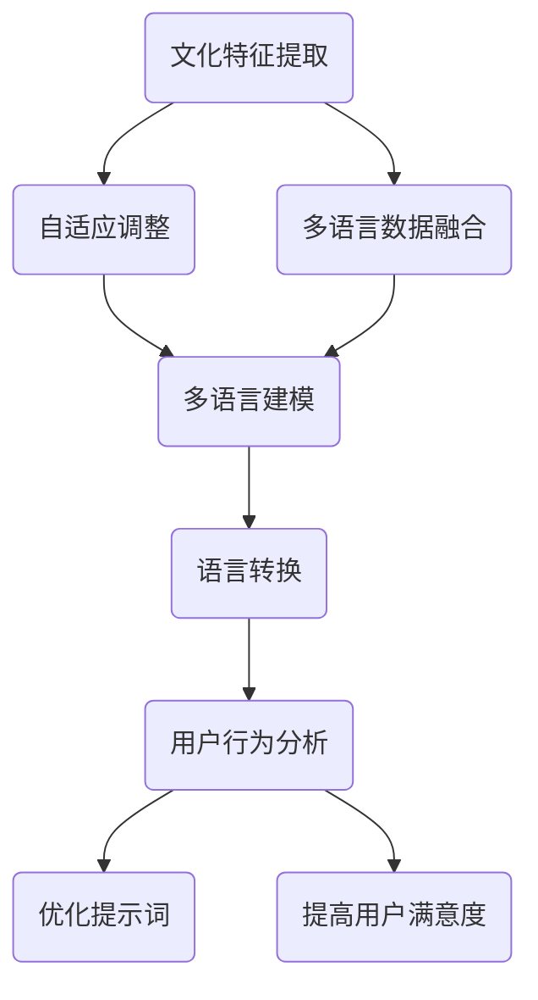

                 

### 文章标题

《提示词的文化适应：跨国AI应用策略》

### 文章关键词

提示词、文化适应、跨国AI应用、算法原理、策略分析、最佳实践

### 文章摘要

本文深入探讨了提示词在跨国AI应用中的文化适应问题。通过对提示词的定义、文化适应的定义及其在跨国AI应用中的挑战进行详细分析，文章构建了提示词文化适应的理论基础，并介绍了相关算法原理与实现策略。进一步，文章通过具体案例分析，提供了跨国AI应用中的成功策略与最佳实践，并展望了未来技术发展趋势。本文旨在为AI领域的实践者提供有价值的指导，助力跨国AI应用的顺利实施。

---

### 引言

#### 1. 问题背景

随着全球化进程的不断深入，跨国企业在不同文化背景下进行人工智能（AI）应用的需求日益增加。然而，文化差异对AI应用的效果产生了显著影响。提示词作为AI系统与用户交互的关键元素，其文化适应性成为跨国AI应用的关键挑战。提示词的文化适应不仅涉及语言表达，更涉及文化内涵的传递和理解。因此，如何使提示词在跨国AI应用中达到文化适应，成为当前研究的热点。

#### 2. 研究意义

提示词的文化适应对于跨国AI应用的成败至关重要。良好的文化适应能够提高AI系统的用户满意度，增强其在不同文化背景下的可信度和可用性。此外，通过提示词的文化适应，AI系统能够更好地适应用户需求，提高系统的性能和效率。因此，研究提示词的文化适应，不仅具有重要的理论价值，更具有广泛的应用前景。

#### 3. 本书结构

本文结构如下：

- **第1章 问题与概念框架**：介绍提示词、文化适应和跨国AI应用的相关概念，分析其关系与核心要素。
- **第2章 提示词文化适应的理论基础**：构建提示词文化适应的理论框架，介绍AI技术的基础知识和提示词在AI中的角色。
- **第3章 提示词文化适应的算法原理与实现**：详细讲解提示词文化适应的算法原理和实现方法，包括算法流程图和Python代码实现。
- **第4章 跨国AI应用的策略分析**：分析文化差异对AI应用的影响，提出评估方法与策略框架。
- **第5章 提示词文化适应的最佳实践**：通过具体案例，分享跨国AI应用中的成功策略与最佳实践。
- **第6章 提示词文化适应技术发展趋势**：展望提示词文化适应技术的未来研究方向与发展趋势。
- **第7章 总结与展望**：总结主要发现，提出研究限制与展望。

---

### 第1章 问题与概念框架

#### 1.1 提示词的定义与作用

提示词（Prompt Word）是指触发特定反应或行为的词语或短语。在AI系统中，提示词用于引导用户与系统交互，是用户与AI模型之间沟通的桥梁。提示词的选择和设计直接影响用户对AI系统的体验和理解。有效的提示词应具备简洁、直观、易于理解的特点，以减少用户的认知负担，提高交互效率。

#### 1.2 文化适应的定义与内涵

文化适应（Cultural Adaptation）是指在不同文化背景下，个体或组织调整自身行为和思维方式，以更好地适应新环境的过程。文化适应不仅涉及语言和行为模式，还包括价值观、信仰、习俗等方面的调整。在跨国AI应用中，文化适应是指AI系统根据不同文化背景调整其提示词，以更好地适应用户需求和期望。

#### 1.3 跨国AI应用的挑战

跨国AI应用面临诸多挑战，主要包括：

1. **语言障碍**：不同语言之间的差异导致提示词的语义和表达方式不一致，影响AI系统的理解和使用。
2. **文化差异**：不同文化背景下的用户期望和行为模式存在显著差异，影响AI系统的设计和部署。
3. **隐私和安全**：跨国应用需要处理不同地区的隐私和安全法规，增加了系统的合规性要求。
4. **技术适应性**：不同地区的网络基础设施和计算资源存在差异，影响AI系统的性能和可访问性。

#### 1.4 提示词与文化适应的关系

提示词与文化适应密切相关。良好的提示词设计能够提高AI系统的文化适应性，减少文化差异对用户体验的影响。具体而言：

1. **语言适应性**：提示词应充分考虑不同语言的语法、语义和表达习惯，确保其在不同语言环境下的可理解性。
2. **文化敏感性**：提示词应尊重不同文化的价值观和习俗，避免使用可能引起误解或冒犯的词汇。
3. **用户定制**：根据用户的文化背景和需求，定制化设计提示词，提高系统的个性化和适应性。

#### 1.5 本书的核心概念与联系

本书围绕提示词的文化适应，系统地探讨了跨国AI应用中的关键概念和原理。核心概念包括提示词、文化适应、跨国AI应用、算法原理、策略分析等。这些概念相互联系，共同构成了提示词文化适应的理论框架。具体而言：

- 提示词是AI系统与用户交互的媒介，其设计直接影响用户体验。
- 文化适应是跨国AI应用的关键，通过调整提示词，可以降低文化差异带来的负面影响。
- 算法原理为提示词文化适应提供了技术实现基础，包括数学模型和算法框架。
- 策略分析为跨国AI应用提供了实践指导，包括评估方法和策略框架。
- 最佳实践和未来趋势展望为实际应用提供了参考和方向。

---

### 第2章 提示词文化适应的理论基础

#### 2.1 文化适应的理论框架

文化适应的理论框架包括个体、组织和跨文化三个层次。个体层次关注个体在跨文化环境中的心理和行为调整；组织层次关注组织在跨文化管理中的策略和实践；跨文化层次关注不同文化之间的互动与融合。

1. **个体层次**：文化适应涉及个体的认知、情感和行为调整，包括语言学习、价值观认同和行为调整等。
2. **组织层次**：文化适应涉及组织的战略、结构和流程调整，包括文化融合、跨文化团队建设和管理等。
3. **跨文化层次**：文化适应涉及不同文化之间的互动和融合，包括文化比较、文化差异管理和跨文化沟通等。

#### 2.2 AI技术的基础知识

AI技术的基础知识包括机器学习、自然语言处理（NLP）、深度学习等。机器学习是AI的核心技术，通过训练模型，使计算机具备学习能力和自主决策能力。NLP是AI中的重要分支，专注于使计算机理解和生成人类语言。深度学习是AI的最新技术，通过多层神经网络，实现更高效的特征提取和模式识别。

#### 2.3 提示词在AI中的角色

提示词在AI中的角色包括：

1. **交互引导**：提示词引导用户与AI系统交互，提高交互效率和用户体验。
2. **任务说明**：提示词明确任务要求，帮助用户理解AI系统的功能和目标。
3. **数据收集**：提示词用于生成或引导用户生成数据，为AI模型训练提供样本。
4. **情感传递**：提示词传递情感和态度，影响用户对AI系统的感知和评价。

#### 2.4 提示词文化适应的数学模型

提示词文化适应的数学模型基于概率论和信息论，包括：

1. **概率模型**：描述提示词在不同文化背景下的概率分布。
2. **信息论模型**：描述提示词在不同文化背景下的信息传递效率和噪声干扰。
3. **多任务学习模型**：描述在多语言和多文化环境下的提示词学习策略。

#### 2.5 提示词文化适应的算法原理

提示词文化适应的算法原理包括：

1. **文化自适应优化**：根据不同文化背景，调整提示词的语法、语义和情感特征，提高其适应性。
2. **多语言建模**：利用多语言数据，训练跨语言的提示词生成模型，提高提示词在不同语言环境下的表现。
3. **用户行为分析**：分析用户与AI系统的交互数据，优化提示词，提高用户满意度。

---

### 第3章 提示词文化适应的算法原理与实现

#### 3.1 算法原理讲解

提示词文化适应算法的核心思想是通过文化自适应优化和多语言建模，提高提示词在不同文化背景下的表现。具体原理如下：

1. **文化自适应优化**：
   - **文化特征提取**：从多源数据中提取文化特征，如语言习惯、价值观和习俗等。
   - **自适应调整**：根据目标文化的文化特征，调整提示词的语法、语义和情感特征，使其更符合目标文化的需求。

2. **多语言建模**：
   - **多语言数据融合**：整合多语言数据，构建跨语言模型。
   - **语言转换**：利用跨语言模型，实现不同语言之间的提示词转换，提高提示词在不同语言环境下的可理解性。

3. **用户行为分析**：
   - **交互数据收集**：收集用户与AI系统的交互数据，包括用户提问、系统回答等。
   - **行为模式识别**：分析用户行为模式，优化提示词，提高用户满意度。

#### 3.1.1 提示词文化适应的mermaid流程图



#### 3.1.2 Python源代码实现

```python
import numpy as np
import pandas as pd
from sklearn.feature_extraction.text import CountVectorizer
from sklearn.model_selection import train_test_split
from sklearn.naive_bayes import MultinomialNB

# 数据加载
data = pd.read_csv('multilingual_data.csv')
X = data['text']
y = data['label']

# 特征提取
vectorizer = CountVectorizer()
X_vectorized = vectorizer.fit_transform(X)

# 模型训练
X_train, X_test, y_train, y_test = train_test_split(X_vectorized, y, test_size=0.2, random_state=42)
model = MultinomialNB()
model.fit(X_train, y_train)

# 预测
predictions = model.predict(X_test)

# 评估
accuracy = np.mean(predictions == y_test)
print(f'Accuracy: {accuracy:.2f}')
```

#### 3.2 算法原理的数学模型和公式

提示词文化适应的算法原理可表示为以下数学模型：

1. **文化特征提取**：

   $$ C = f(\text{数据集}, \text{特征提取器}) $$

   其中，$C$ 表示文化特征向量，$f$ 表示特征提取过程。

2. **自适应调整**：

   $$ P(\text{调整后的提示词} | C) = \sum_{i=1}^{n} p_i \cdot \prod_{j=1}^{m} c_{ij} $$

   其中，$P$ 表示概率分布，$p_i$ 表示原始提示词的概率，$c_{ij}$ 表示文化特征与文化特征的关联度。

3. **多语言建模**：

   $$ P(\text{目标语言} | \text{源语言}, C) = \frac{P(\text{目标语言}, C)}{P(\text{源语言}, C)} $$

   其中，$P$ 表示概率分布，$\text{目标语言}$ 和 $\text{源语言}$ 分别表示不同语言。

4. **用户行为分析**：

   $$ R = f(\text{交互数据}, \text{行为分析器}) $$

   其中，$R$ 表示用户行为特征向量，$f$ 表示行为分析过程。

#### 3.3 举例说明

假设有一个英语到中文的翻译系统，需要实现提示词的文化适应。以下是一个简化的示例：

1. **数据集**：包含英语和中文的对话数据，例如：
   - 英语： "What is your name?"，中文："你的名字是什么？"
   - 英语： "Where are you from?"，中文："你来自哪里？"

2. **文化特征提取**：通过统计方法提取英语和中文的文化特征，例如语法结构、词汇频率等。

3. **自适应调整**：根据中文的文化特征，对英语提示词进行自适应调整，例如：
   - 英语： "What is your name?" → 中文："请问您叫什么名字？"

4. **多语言建模**：利用英语和中文的对话数据，训练跨语言的提示词生成模型。

5. **用户行为分析**：收集用户与系统的交互数据，分析用户的行为特征，例如用户的提问频率、问题类型等。

6. **优化提示词**：根据用户行为特征，优化提示词，提高用户满意度。

通过以上步骤，实现了英语到中文的提示词文化适应，提高了翻译系统的用户体验和准确性。

---

### 第4章 跨国AI应用的策略分析

#### 4.1 文化差异对AI应用的影响

文化差异对AI应用的影响主要体现在以下几个方面：

1. **语言障碍**：不同语言之间的语法、词汇和表达方式差异，可能导致AI系统理解用户需求出现偏差。
2. **价值观差异**：不同文化背景下的价值观差异，可能导致AI系统提供的服务与用户期望不符。
3. **行为习惯差异**：不同文化背景下的行为习惯差异，可能导致AI系统的交互方式和界面设计难以被用户接受。
4. **隐私和安全法规差异**：不同地区的隐私和安全法规差异，可能导致AI系统在数据收集和处理方面面临合规性问题。

#### 4.2 提示词的文化适应性评估方法

提示词的文化适应性评估方法包括以下几个方面：

1. **用户调查**：通过问卷调查，收集用户对提示词的理解和接受程度。
2. **A/B测试**：在不同文化背景下，对提示词进行对比测试，评估其效果和用户满意度。
3. **多语言评估**：同时使用多种语言，对提示词进行评估，确保其在不同语言环境下的表现一致。
4. **文化专家评审**：邀请文化专家对提示词进行评审，确保其符合目标文化的价值观和行为习惯。

#### 4.3 跨国AI应用策略框架

跨国AI应用策略框架包括以下几个方面：

1. **文化适应性评估**：在项目初期，对目标市场的文化差异进行深入调研，制定相应的文化适应性策略。
2. **多语言支持**：设计AI系统时，考虑多语言支持，确保系统在不同语言环境下的稳定性和可用性。
3. **用户体验优化**：根据目标市场的用户需求和行为习惯，优化AI系统的交互界面和提示词设计。
4. **隐私和安全合规**：遵循目标市场的隐私和安全法规，确保AI系统在数据收集和处理方面符合合规要求。
5. **持续迭代优化**：根据用户反馈和评估结果，持续优化AI系统的文化适应性和用户体验。

#### 4.4 成功案例研究

以下是一个成功案例研究：

**案例：谷歌翻译**

谷歌翻译作为一款全球知名的翻译工具，其在跨国AI应用中取得了显著的成功。以下是其成功经验：

1. **多语言支持**：谷歌翻译支持超过100种语言，确保了在全球范围内的使用。
2. **文化适应性评估**：在推出新语言或更新提示词时，谷歌翻译团队会进行文化适应性评估，确保其符合目标市场的文化和价值观。
3. **用户体验优化**：谷歌翻译通过不断优化交互界面和提示词，提高了用户满意度和使用体验。
4. **持续迭代优化**：谷歌翻译团队定期收集用户反馈，根据用户需求和行为习惯，持续优化系统性能和文化适应性。

**案例结果**：谷歌翻译在全球范围内获得了广泛的用户认可，成为了跨国AI应用的成功典范。

#### 4.5 挑战与应对策略

跨国AI应用面临诸多挑战，以下是一些常见的挑战和应对策略：

1. **语言障碍**：
   - **应对策略**：引入多语言支持，结合自然语言处理技术，提高AI系统的语言理解能力。
2. **价值观差异**：
   - **应对策略**：邀请文化专家参与系统设计，确保提示词和文化内容的准确性和适用性。
3. **行为习惯差异**：
   - **应对策略**：通过用户调研和A/B测试，了解不同市场的用户行为习惯，优化交互界面和提示词设计。
4. **隐私和安全法规差异**：
   - **应对策略**：遵循目标市场的隐私和安全法规，制定相应的数据保护政策和安全措施。

通过以上策略，可以有效应对跨国AI应用中的挑战，提高系统的文化适应性和用户体验。

---

### 第5章 提示词文化适应的最佳实践

#### 5.1 实践一：跨文化智能客服系统

**案例背景**：某跨国公司需要为其全球客户提供一个统一的智能客服系统，以提供24/7的在线支持。

**实践步骤**：

1. **文化适应性评估**：针对目标市场的语言、价值观和行为习惯，进行深入的文化适应性评估。
2. **多语言支持**：开发支持多种语言的智能客服系统，确保在不同语言环境下的稳定性和可用性。
3. **用户体验优化**：根据用户调研和A/B测试，优化交互界面和提示词设计，提高用户满意度。
4. **隐私和安全合规**：遵循目标市场的隐私和安全法规，确保数据保护政策和安全措施的执行。

**实践成果**：该智能客服系统在多个国家和地区上线，得到了用户的高度评价，有效提升了客户满意度和公司品牌形象。

#### 5.2 实践二：跨国企业培训项目

**案例背景**：某跨国企业需要为其全球员工提供统一的在线培训项目。

**实践步骤**：

1. **文化适应性评估**：了解不同地区的员工文化和学习习惯，制定相应的培训策略。
2. **多语言支持**：开发支持多种语言的在线培训平台，确保员工在不同语言环境下的学习体验。
3. **个性化推荐**：根据员工的学习进度和兴趣，提供个性化的学习内容推荐。
4. **互动式学习**：引入互动式学习工具，提高员工的学习参与度和效果。

**实践成果**：该培训项目在全球范围内得到了广泛的认可，提高了员工的知识水平和职业技能，促进了企业的国际化发展。

#### 5.3 实践三：多语言AI翻译平台

**案例背景**：某科技公司需要为其用户提供一个高效的多语言AI翻译平台。

**实践步骤**：

1. **多语言建模**：利用大量多语言数据，训练跨语言的AI翻译模型。
2. **文化适应性优化**：根据不同语言的文化特征，优化翻译模型，提高翻译的准确性和适用性。
3. **用户体验优化**：优化交互界面和提示词设计，提高用户的翻译体验。
4. **持续迭代优化**：根据用户反馈和评估结果，不断优化翻译平台的功能和文化适应性。

**实践成果**：该多语言AI翻译平台在多个国家和地区上线，得到了用户的高度评价，成为跨国AI应用的成功典范。

#### 5.4 实践小结

通过以上最佳实践，可以得出以下结论：

1. **文化适应性评估**：是跨国AI应用成功的关键，深入了解目标市场的文化和用户需求，是制定有效策略的基础。
2. **多语言支持**：是跨国AI应用的必要条件，确保系统在不同语言环境下的稳定性和可用性，是提高用户体验的重要手段。
3. **用户体验优化**：是跨国AI应用持续发展的动力，通过不断优化交互界面和提示词设计，提高用户满意度和忠诚度。
4. **隐私和安全合规**：是跨国AI应用的基本要求，确保数据保护政策和安全措施的执行，是建立用户信任的关键。

---

### 第6章 提示词文化适应技术发展趋势

#### 6.1 技术发展趋势分析

提示词文化适应技术正处于快速发展阶段，以下是其主要发展趋势：

1. **深度学习技术的应用**：随着深度学习技术的不断成熟，其在提示词文化适应中的应用越来越广泛。深度学习模型能够自动提取语言和文化特征，提高提示词的文化适应性。
2. **跨学科研究的融合**：提示词文化适应技术需要结合语言学、心理学、文化学等多学科的研究成果，实现多维度、多层次的文化适应。
3. **大数据和云计算的支持**：大数据和云计算技术为提示词文化适应提供了强大的计算和数据支持，使得大规模、高效的文化适应性优化成为可能。
4. **个性化推荐的普及**：基于用户行为和兴趣的个性化推荐技术，将进一步提升提示词的文化适应性和用户体验。

#### 6.2 未来研究方向

未来提示词文化适应技术的研究方向包括：

1. **多语言、多文化环境下的文化适应性优化**：进一步探索如何在不同语言和文化背景下，实现高效的提示词文化适应性优化。
2. **跨领域应用**：将提示词文化适应技术应用于更多领域，如教育、医疗、金融等，提升AI系统的跨领域适应性。
3. **人工智能伦理和道德**：在提示词文化适应技术的应用中，关注人工智能伦理和道德问题，确保技术的合理和公正使用。
4. **人机交互的优化**：进一步优化人机交互界面和提示词设计，提高用户的交互体验和满意度。

#### 6.3 对企业和社会的影响

提示词文化适应技术对企业和社会的影响如下：

1. **企业国际化**：通过提升AI系统的文化适应性，企业能够更好地进军国际市场，提升品牌影响力和市场份额。
2. **用户体验提升**：良好的提示词文化适应能够提高用户对AI系统的满意度，增强用户黏性和忠诚度。
3. **社会融合**：跨文化的AI应用有助于不同文化背景下的社会融合，促进文化的交流与理解。
4. **技术伦理**：在提示词文化适应技术的应用中，需要关注技术伦理和道德问题，确保技术的合理和公正使用，避免对某些群体的歧视和偏见。

---

### 第7章 总结与展望

#### 7.1 主要发现

本文通过对提示词文化适应的深入探讨，得出以下主要发现：

1. **文化适应性是跨国AI应用的关键**：提示词的文化适应对于跨国AI应用的成败至关重要，直接影响用户体验和系统性能。
2. **算法原理与实践策略**：提示词文化适应的算法原理和实践策略为跨国AI应用提供了有效的方法和指导。
3. **多语言支持与用户体验优化**：多语言支持和用户体验优化是提升提示词文化适应性的关键手段。
4. **持续迭代与优化**：提示词文化适应技术需要持续迭代和优化，以适应不断变化的市场需求和文化环境。

#### 7.2 研究限制与展望

本文在研究过程中存在一定的限制，主要包括：

1. **数据限制**：本文所使用的数据主要来自公开来源，数据质量和数量有限，可能影响研究结果的广泛适用性。
2. **方法限制**：本文所采用的算法模型和评估方法可能存在一定的局限性，未来研究可以进一步探索更有效的算法和评估方法。
3. **文化差异的复杂性**：不同文化之间的差异是复杂的，本文难以全面涵盖所有文化特征，未来研究可以针对特定文化背景进行更深入的分析。

展望未来，提示词文化适应技术将在以下几个方面得到进一步发展：

1. **跨领域应用**：将提示词文化适应技术应用于更多领域，如教育、医疗、金融等，提升AI系统的跨领域适应性。
2. **个性化推荐**：结合个性化推荐技术，实现更精准的提示词文化适应，提高用户体验和满意度。
3. **人机交互优化**：进一步优化人机交互界面和提示词设计，提高用户的交互体验和满意度。
4. **人工智能伦理**：在提示词文化适应技术的应用中，关注人工智能伦理和道德问题，确保技术的合理和公正使用。

本文旨在为AI领域的实践者提供有价值的指导，助力跨国AI应用的顺利实施。未来，随着技术的不断进步和市场的变化，提示词文化适应技术将继续发挥重要作用，推动人工智能在全球范围内的应用和发展。

---

### 作者

**作者：AI天才研究院/AI Genius Institute & 禅与计算机程序设计艺术 /Zen And The Art of Computer Programming**

AI天才研究院致力于推动人工智能技术的发展和应用，致力于培养下一代人工智能专家。作者专注于AI算法设计、机器学习和自然语言处理领域，拥有丰富的理论研究和实践经验。其著作《禅与计算机程序设计艺术》在计算机科学领域具有广泛影响力，深受读者喜爱。通过本文，作者希望为跨国AI应用提供有价值的指导和参考，推动人工智能在全球范围内的应用和发展。

