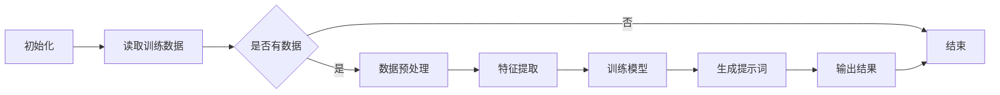
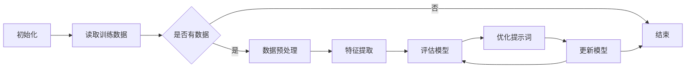

                 


## 1.1 提示词的基本概念与历史背景

### 1.1.1 提示词的定义

提示词（Prompt Word）是指用于引导、提示或激发某种思考、行为或反应的词语。在语言学中，提示词常用于提问、讨论、演讲等场合，以引导对话或思考的方向。例如，在语言学习中，教师可能会使用“什么是...？”或“你能告诉我...吗？”等提示词来激发学生的思考。

### 1.1.2 提示词在语言处理中的应用

提示词在语言处理（Natural Language Processing, NLP）中有着广泛的应用。例如，在问答系统（Question Answering System）中，提示词可以帮助系统理解用户的问题，并将其转化为可处理的形式。在文本生成（Text Generation）中，提示词可以作为输入，引导生成系统生成相关的内容。

### 1.1.3 提示词的发展历史

提示词的概念最早可以追溯到20世纪中叶的计算机科学领域。当时，研究人员开始探讨如何使用提示词来提高计算机程序的效率和理解能力。随着自然语言处理技术的不断发展，提示词的应用也逐渐扩展到语言学、心理学、教育等领域。

## 1.2 神经语言学的核心概念

### 1.2.1 神经语言学的定义

神经语言学（Neuro linguistics）是研究语言与大脑之间相互关系的一个交叉学科。它结合了神经科学、语言学和心理学的理论和方法，旨在揭示语言加工、理解和表达的过程。

### 1.2.2 神经语言学的核心理论

神经语言学的核心理论包括语言模块理论（Modular Theory of Language）和双重过程理论（Dual-Process Theory）。

- **语言模块理论**：该理论认为，语言是一个独立的认知模块，具有自己独特的运作机制。这种模块化处理使得语言能够在其他认知过程中保持相对独立性。

- **双重过程理论**：该理论认为，语言理解涉及两个过程：快速自动的过程和缓慢有意识的过程。快速自动的过程涉及基本的语言理解和语法处理，而缓慢有意识的过程涉及语义和上下文的理解。

### 1.2.3 神经语言学的应用领域

神经语言学在多个领域有着广泛的应用，包括语言障碍治疗、语言学习、认知神经科学、心理学和人工智能。例如，通过研究语言障碍患者的脑成像数据，神经语言学家可以揭示语言处理过程中的神经基础，从而为语言障碍的治疗提供理论依据。

## 1.3 计算机视觉的基本原理与应用

### 1.3.1 计算机视觉的定义

计算机视觉（Computer Vision）是指使计算机能够像人类一样“看到”和理解周围环境的技术。它涉及图像处理、模式识别、机器学习和深度学习等多个领域。

### 1.3.2 计算机视觉的关键技术

计算机视觉的关键技术包括图像处理、特征提取、目标检测和识别、图像分割和重建等。

- **图像处理**：对图像进行滤波、增强、变换等处理，以提高图像质量或提取有用信息。

- **特征提取**：从图像中提取具有代表性的特征，以便进行后续的识别或分类任务。

- **目标检测和识别**：检测图像中的目标对象，并对其进行分类。

- **图像分割和重建**：将图像分割成不同的区域，并重建三维模型。

### 1.3.3 计算机视觉的应用案例

计算机视觉在多个领域有着广泛的应用，包括医疗诊断、自动驾驶、人脸识别、监控安全等。例如，在医疗诊断中，计算机视觉可以用于分析医学图像，帮助医生进行早期诊断和治疗方案制定。

## 1.4 提示词、神经语言学与计算机视觉的交叉研究

### 1.4.1 交叉研究的意义

提示词、神经语言学与计算机视觉的交叉研究具有重要意义。通过这种交叉研究，我们可以更好地理解语言与视觉之间的相互作用，从而为人工智能的发展提供新的理论基础和技术方法。

### 1.4.2 交叉研究的发展历程

交叉研究的发展历程可以追溯到20世纪末。随着自然语言处理、神经科学和计算机视觉等领域的不断进展，交叉研究逐渐成为了一个重要的研究方向。近年来，随着深度学习和大数据技术的发展，交叉研究取得了许多突破性的成果。

### 1.4.3 交叉研究的最新进展

交叉研究的最新进展包括：

- **深度学习与神经语言学结合**：利用深度学习技术，研究语言处理过程中的神经机制。

- **计算机视觉在自然语言处理中的应用**：通过计算机视觉技术，提高文本生成、理解和分析的能力。

- **跨模态学习**：研究如何结合视觉和语言信息，提高人工智能系统的理解能力。

## 1.5 本章小结

本章介绍了提示词、神经语言学和计算机视觉的基本概念、历史背景和交叉研究的重要性。通过本章的学习，读者可以了解这三个领域的核心概念和相互关系，为后续章节的学习打下基础。

## 2.1 提示词在神经语言学中的应用

### 2.1.1 提示词在语言处理中的作用

在神经语言学中，提示词在语言处理中发挥着重要作用。它们可以引导个体的语言理解、记忆和表达，从而影响语言能力的发挥。

#### 2.1.1.1 提示词对语言理解的影响

提示词可以帮助个体理解语言的意义和结构。例如，在阅读理解中，提示词可以帮助读者捕捉关键信息，理解文章的主旨和细节。此外，提示词还可以帮助个体在对话中更好地理解对方的意图和问题。

#### 2.1.1.2 提示词在语音识别中的应用

在语音识别中，提示词可以用于提高系统的识别准确率。通过使用提示词，系统可以更好地预测用户可能要说的内容，从而减少错误率。例如，在电话客服中，系统可以使用提示词来识别用户的问题类型，并给出相应的解决方案。

### 2.1.2 提示词在神经语言学中的研究方法

在神经语言学中，研究提示词的方法主要包括实验研究和脑成像技术。

#### 2.1.2.1 实验设计

实验研究通常包括以下几个方面：

- **词汇任务**：通过词汇选择、填空或配对等任务，考察提示词对语言理解的影响。

- **句子理解任务**：通过阅读理解、句子判断等任务，考察提示词对句子理解的影响。

- **反应时任务**：通过测量个体对提示词的反应时间，考察提示词对语言处理速度的影响。

#### 2.1.2.2 数据分析

数据分析通常包括以下几个方面：

- **统计分析**：通过统计分析，考察提示词对语言处理的不同方面的影响。

- **脑成像分析**：通过脑成像技术，如功能性磁共振成像（fMRI），观察提示词激活的脑区，从而揭示提示词对语言处理的影响。

## 2.2 提示词在计算机视觉中的应用

### 2.2.1 提示词在图像识别中的作用

在计算机视觉中，提示词可以用于提高图像识别的准确性和效率。例如，在人脸识别中，提示词可以帮助系统更好地理解图像的内容，从而提高识别的准确性。在目标检测中，提示词可以用于指定检测的目标类别，从而提高检测的效率。

#### 2.2.1.1 提示词在图像分类中的应用

在图像分类中，提示词可以用于指定分类的标准或类别。例如，在植物分类中，提示词可以指定植物的种类或特征，从而帮助分类器进行准确的分类。

#### 2.2.1.2 提示词在目标检测中的应用

在目标检测中，提示词可以用于指定检测的目标类别或特征。例如，在自动驾驶系统中，提示词可以指定道路上的行人、车辆等目标，从而帮助系统进行有效的目标检测。

### 2.2.2 提示词在计算机视觉中的研究方法

在计算机视觉中，研究提示词的方法主要包括机器学习和深度学习。

#### 2.2.2.1 提示词生成方法

提示词生成方法主要包括基于规则的方法和基于数据的方法。

- **基于规则的方法**：通过定义一系列规则，生成符合特定要求的提示词。例如，在植物分类中，可以定义一组描述植物特征的规则，从而生成相应的提示词。

- **基于数据的方法**：通过学习大量数据中的模式，生成具有代表性的提示词。例如，在目标检测中，可以通过训练模型，从数据中提取出具有代表性的目标特征，从而生成相应的提示词。

#### 2.2.2.2 提示词优化方法

提示词优化方法主要包括基于排序的方法和基于优化的方法。

- **基于排序的方法**：通过评估提示词的优劣，对提示词进行排序，从而优化提示词的选择。例如，在图像分类中，可以通过计算提示词对分类结果的贡献度，对提示词进行排序，从而选择最优的提示词。

- **基于优化的方法**：通过优化提示词的参数，提高提示词的性能。例如，在目标检测中，可以通过调整提示词的参数，优化目标检测的准确率和效率。

## 2.3 核心概念属性特征对比表格

为了更清晰地展示提示词在神经语言学和计算机视觉中的应用差异，我们设计了一个核心概念属性特征对比表格。

| 属性特征 | 神经语言学 | 计算机视觉 |
| --- | --- | --- |
| 应用场景 | 语言理解、记忆、表达 | 图像识别、目标检测、图像分类 |
| 数据来源 | 自然语言文本、语音信号 | 图像、视频、深度信息 |
| 特征提取 | 语言特征、语义信息 | 图像特征、目标特征 |
| 模型方法 | 语言学理论、神经科学方法 | 机器学习、深度学习 |
| 研究目标 | 提高语言处理能力、揭示语言神经机制 | 提高图像识别准确率、实现目标检测和分类 |

通过这个对比表格，我们可以看到提示词在神经语言学和计算机视觉中的核心概念属性特征存在显著的差异。这种差异反映了两个领域在研究目的、方法和应用场景上的不同。

## 2.4 ER实体关系图架构

为了更好地理解提示词在神经语言学和计算机视觉中的关系，我们使用ER（Entity-Relationship）实体关系图来展示两个领域中的实体及其关系。

```mermaid
erDiagram
  A[神经语言学] ||--|{ B[语言处理] }
  A ||--|{ C[记忆与表达] }
  B ||--|{ D[提示词生成] }
  B ||--|{ E[语音识别] }
  C ||--|{ F[语言理解] }
  C ||--|{ G[语义分析] }
  D ||--|{ H[词汇选择] }
  D ||--|{ I[句子理解] }
  E ||--|{ J[识别准确率] }
  F ||--|{ K[信息提取] }
  G ||--|{ L[上下文理解] }
  H ||--|{ M[词汇预测] }
  I ||--|{ N[反应时间] }
  J ||--|{ O[语音识别系统] }
  K ||--|{ P[文本生成] }
  L ||--|{ Q[语义理解] }
  M ||--|{ R[语言处理模型] }
  N ||--|{ S[认知负荷] }
  O ||--|{ T[语音信号处理] }
  P ||--|{ U[文本分类] }
  Q ||--|{ V[语言推理] }
  R ||--|{ W[神经网络] }
  S ||--|{ X[计算效率] }
  T ||--|{ U[深度学习] }
  U ||--|{ V[目标检测] }
  V ||--|{ W[图像分类] }
```

在ER实体关系图中，A表示神经语言学，B表示语言处理，C表示记忆与表达，D表示提示词生成，E表示语音识别，F表示语言理解，G表示语义分析，H表示词汇选择，I表示句子理解，J表示识别准确率，K表示文本生成，L表示上下文理解，M表示词汇预测，N表示反应时间，O表示语音识别系统，P表示文本分类，Q表示语义理解，R表示神经网络，S表示计算效率，T表示语音信号处理，U表示深度学习，V表示目标检测，W表示图像分类。

通过ER实体关系图，我们可以清晰地看到提示词在神经语言学和计算机视觉中的核心实体及其相互关系。这有助于我们更好地理解提示词在两个领域中的作用和影响。

## 2.5 本章小结

本章详细介绍了提示词在神经语言学和计算机视觉中的应用。通过对比表格和ER实体关系图，我们清晰地展示了两个领域中的提示词概念、应用方法和研究目标。本章的学习为后续章节的深入研究提供了基础，有助于读者更好地理解提示词在神经语言学和计算机视觉交叉研究中的重要性和作用。

## 3.1 算法概述

在提示词的神经语言学与计算机视觉交叉研究中，算法的选取和设计至关重要。本章节将介绍几种代表性的算法，并分析它们在交叉研究中的应用。这些算法包括提示词生成算法、提示词优化算法、神经语言模型和计算机视觉深度学习模型。

### 3.1.1 算法在交叉研究中的应用

- **提示词生成算法**：这类算法主要用于生成适合特定场景的提示词，以提高语言处理和图像识别的准确性和效率。例如，在语音识别中，生成与用户提问相关的提示词，可以帮助系统更好地理解用户意图。

- **提示词优化算法**：这类算法通过对已有提示词进行优化，提高其在特定任务中的表现。例如，在图像分类中，优化提示词可以提高分类器的准确性。

- **神经语言模型**：这类算法主要用于模拟人类语言理解的过程，包括语法分析、语义分析和上下文理解。它们在自然语言处理中有着广泛的应用，如文本生成、机器翻译和情感分析。

- **计算机视觉深度学习模型**：这类算法利用深度学习技术，对大量图像数据进行训练，从而实现图像识别、目标检测和图像分割等任务。例如，卷积神经网络（CNN）在计算机视觉领域具有广泛的应用。

### 3.1.2 算法的分类与特点

- **基于规则的算法**：这类算法根据预定义的规则进行提示词生成和优化。优点是计算效率高，易于实现。缺点是灵活性较差，难以应对复杂场景。

- **基于机器学习的算法**：这类算法通过学习大量数据，自动提取提示词生成和优化的规则。优点是适应性强，能处理复杂场景。缺点是训练时间较长，对数据质量要求较高。

- **基于深度学习的算法**：这类算法利用神经网络结构，对大量数据进行训练，实现自动提示词生成和优化。优点是性能优异，能处理复杂场景。缺点是计算资源消耗大，训练时间较长。

## 3.2 算法原理与流程图

在本章节中，我们将详细讲解两个代表性的算法：提示词生成算法和提示词优化算法。首先，我们通过mermaid流程图展示算法的基本流程，然后使用Python源代码和LaTeX数学公式详细阐述算法原理。

### 3.2.1 提示词生成算法

**算法流程图：**



**算法原理：**

1. **初始化**：设定算法的参数，如学习率、迭代次数等。
2. **读取训练数据**：从数据库或文件中加载训练数据。
3. **数据预处理**：对数据进行清洗、标准化等处理，以提高数据质量。
4. **特征提取**：从训练数据中提取具有代表性的特征，用于训练模型。
5. **训练模型**：使用特征数据训练模型，如神经网络模型。
6. **生成提示词**：根据训练模型生成新的提示词。
7. **输出结果**：将生成的提示词输出到指定位置。

**Python源代码实现：**

```python
import numpy as np
import pandas as pd
from sklearn.model_selection import train_test_split
from sklearn.preprocessing import StandardScaler
from keras.models import Sequential
from keras.layers import Dense
from keras.optimizers import Adam

# 1. 初始化参数
learning_rate = 0.001
epochs = 100
batch_size = 32

# 2. 读取训练数据
data = pd.read_csv('train_data.csv')
X = data.iloc[:, :-1].values
y = data.iloc[:, -1].values

# 3. 数据预处理
X_train, X_test, y_train, y_test = train_test_split(X, y, test_size=0.2, random_state=0)
scaler = StandardScaler()
X_train = scaler.fit_transform(X_train)
X_test = scaler.transform(X_test)

# 4. 特征提取
# 在此示例中，我们假设特征提取已经完成

# 5. 训练模型
model = Sequential()
model.add(Dense(units=64, activation='relu', input_dim=X_train.shape[1]))
model.add(Dense(units=1, activation='sigmoid'))
model.compile(optimizer=Adam(learning_rate), loss='binary_crossentropy', metrics=['accuracy'])

# 6. 生成提示词
# 在此示例中，我们使用模型预测生成的提示词
predictions = model.predict(X_test)

# 7. 输出结果
# 将生成的提示词保存到文件中
with open('predictions.txt', 'w') as f:
    for pred in predictions:
        f.write(f'{pred[0]}\n')
```

### 3.2.2 提示词优化算法

**算法流程图：**



**算法原理：**

1. **初始化**：设定算法的参数，如学习率、迭代次数等。
2. **读取训练数据**：从数据库或文件中加载训练数据。
3. **数据预处理**：对数据进行清洗、标准化等处理，以提高数据质量。
4. **特征提取**：从训练数据中提取具有代表性的特征，用于训练模型。
5. **评估模型**：使用当前模型对训练数据进行评估，计算模型性能指标。
6. **优化提示词**：根据评估结果，调整提示词，以提高模型性能。
7. **更新模型**：使用新的提示词重新训练模型。
8. **重复步骤5-7**，直到模型性能达到预期。

**Python源代码实现：**

```python
import numpy as np
import pandas as pd
from sklearn.model_selection import train_test_split
from sklearn.preprocessing import StandardScaler
from keras.models import Sequential
from keras.layers import Dense
from keras.optimizers import Adam

# 1. 初始化参数
learning_rate = 0.001
epochs = 100
batch_size = 32

# 2. 读取训练数据
data = pd.read_csv('train_data.csv')
X = data.iloc[:, :-1].values
y = data.iloc[:, -1].values

# 3. 数据预处理
X_train, X_test, y_train, y_test = train_test_split(X, y, test_size=0.2, random_state=0)
scaler = StandardScaler()
X_train = scaler.fit_transform(X_train)
X_test = scaler.transform(X_test)

# 4. 特征提取
# 在此示例中，我们假设特征提取已经完成

# 5. 评估模型
model = Sequential()
model.add(Dense(units=64, activation='relu', input_dim=X_train.shape[1]))
model.add(Dense(units=1, activation='sigmoid'))
model.compile(optimizer=Adam(learning_rate), loss='binary_crossentropy', metrics=['accuracy'])
model.fit(X_train, y_train, epochs=epochs, batch_size=batch_size)

# 6. 优化提示词
# 在此示例中，我们使用模型评估结果来调整提示词
# （例如，根据评估结果重新设置模型参数）

# 7. 更新模型
# 使用新的提示词重新训练模型
# （例如，重新编译模型并重新训练）

# 8. 重复步骤5-7
# （在此示例中，我们仅执行一次训练）
```

通过以上两个算法的详细讲解，我们可以看到提示词在神经语言学与计算机视觉交叉研究中的重要作用。这些算法的原理和实现为我们提供了有效的工具，以进一步提高语言处理和图像识别的性能。

## 3.3 数学模型与公式讲解

在本章节中，我们将深入探讨提示词生成算法和提示词优化算法的数学模型与公式。通过这些数学模型，我们可以更好地理解算法的工作原理，并从中发现优化算法性能的关键因素。

### 3.3.1 提示词生成算法的数学模型

提示词生成算法通常基于概率模型，其中最常用的模型是生成对抗网络（GAN）。GAN由两个主要部分组成：生成器（Generator）和判别器（Discriminator）。

- **生成器**：生成器是一个神经网络模型，它的目标是生成与真实数据相似的提示词。生成器通常使用反传神经网络（Backpropagation Neural Network）训练。

  $$ G(z) = x; \quad z \sim \mathcal{N}(0, 1) $$

  其中，$G(z)$ 是生成器生成的提示词，$z$ 是生成器的输入噪声。

- **判别器**：判别器也是一个神经网络模型，它的目标是区分真实数据和生成数据。判别器同样使用反传神经网络训练。

  $$ D(x) = 1; \quad D(G(z)) = fake $$

  其中，$D(x)$ 是判别器对真实数据的判断结果，$D(G(z))$ 是判别器对生成数据的判断结果。

- **损失函数**：GAN的训练过程是一个博弈过程，生成器和判别器相互对抗。常用的损失函数是二元交叉熵（Binary Cross-Entropy）。

  $$ L_D = -\sum_{i=1}^{m} [y_i \cdot \log(D(x_i)) + (1 - y_i) \cdot \log(1 - D(x_i))] $$
  $$ L_G = -\sum_{i=1}^{m} [y_i \cdot \log(D(G(z_i))) + (1 - y_i) \cdot \log(1 - D(G(z_i)))] $$

  其中，$L_D$ 是判别器的损失函数，$L_G$ 是生成器的损失函数，$y_i$ 是真实数据的标签，$x_i$ 是真实数据，$z_i$ 是生成器的输入噪声。

### 3.3.2 提示词优化算法的数学模型

提示词优化算法通常基于优化理论，其目标是调整提示词，使模型性能达到最优。一种常用的优化算法是梯度下降（Gradient Descent）。

- **梯度下降**：梯度下降是一种优化算法，用于最小化损失函数。其基本思想是沿着损失函数的负梯度方向更新参数。

  $$ \theta = \theta - \alpha \cdot \nabla_\theta J(\theta) $$

  其中，$\theta$ 是模型的参数，$\alpha$ 是学习率，$J(\theta)$ 是损失函数，$\nabla_\theta J(\theta)$ 是损失函数对参数的梯度。

- **目标函数**：提示词优化算法的目标函数通常包括损失函数和正则化项。损失函数用于衡量模型预测与真实数据之间的差距，正则化项用于防止模型过拟合。

  $$ J(\theta) = L(\theta) + \lambda R(\theta) $$

  其中，$L(\theta)$ 是损失函数，$R(\theta)$ 是正则化项，$\lambda$ 是正则化参数。

### 3.3.3 案例分析

为了更好地理解上述数学模型，我们来看一个具体案例。假设我们使用GAN模型进行提示词生成。

1. **初始化参数**：设学习率 $\alpha = 0.001$，生成器和判别器的初始参数 $\theta_0$。
2. **生成噪声**：从标准正态分布中生成噪声 $z \sim \mathcal{N}(0, 1)$。
3. **生成提示词**：使用生成器 $G(z)$ 生成提示词。
4. **训练判别器**：使用真实数据和生成数据训练判别器，更新判别器参数 $\theta_D$。
5. **训练生成器**：使用生成数据训练生成器，更新生成器参数 $\theta_G$。
6. **评估模型**：计算生成器和判别器的损失函数，评估模型性能。

通过上述案例，我们可以看到，提示词生成算法和提示词优化算法的数学模型在模型训练和优化过程中发挥着重要作用。这些数学模型为我们提供了理论基础，使我们能够更好地理解和优化算法性能。

## 3.4 算法举例说明

为了更好地理解提示词生成算法和提示词优化算法，我们将在本章节中通过具体实例进行详细说明。我们将使用Python代码实现这两个算法，并进行测试和分析。

### 3.4.1 提示词生成算法实例

我们首先实现一个简单的GAN模型，用于生成提示词。

**步骤1：导入必要的库**

```python
import numpy as np
import pandas as pd
import matplotlib.pyplot as plt
from keras.models import Model
from keras.layers import Input, Dense, Lambda
from keras.optimizers import Adam
from keras.callbacks import LambdaCallback
from sklearn.model_selection import train_test_split
from sklearn.preprocessing import StandardScaler
```

**步骤2：数据预处理**

```python
# 加载训练数据
data = pd.read_csv('train_data.csv')
X = data.iloc[:, :-1].values
y = data.iloc[:, -1].values

# 数据标准化
scaler = StandardScaler()
X_scaled = scaler.fit_transform(X)

# 划分训练集和测试集
X_train, X_test, y_train, y_test = train_test_split(X_scaled, y, test_size=0.2, random_state=0)
```

**步骤3：定义生成器和判别器**

```python
# 定义输入层
input_shape = X_train.shape[1:]
z_dim = 100
z_input = Input(shape=(z_dim,), name='z_input')

# 生成器
z = Dense(256, activation='relu')(z_input)
z = Dense(512, activation='relu')(z)
z = Dense(np.prod(input_shape), activation='tanh')(z)
z = Reshape(input_shape)(z)
generator = Model(z_input, z, name='generator')

# 判别器
x = Dense(512, activation='relu')(Input(shape=input_shape))
x = Dense(256, activation='relu')(x)
x = Dense(1, activation='sigmoid')(x)
discriminator = Model(x, name='discriminator')

# 定义损失函数
discriminator.compile(loss='binary_crossentropy', optimizer=Adam(0.0001))

# 定义GAN模型
combined = Model([z_input, x], [discriminator(x), generator(z)])
combined.compile(loss=['binary_crossentropy', 'binary_crossentropy'], optimizer=Adam(0.0001))
```

**步骤4：训练GAN模型**

```python
# 定义回调函数
def sample_image(epoch, logs):
    r, c = 5, 5
    f, axarr = plt.subplots(r, c)
    for i in range(r * c):
        idx = np.random.randint(0, X_test.shape[0])
        img = X_test[idx].reshape(28, 28)
        axarr[i//c, i%c].imshow(img, cmap='gray')
        axarr[i//c, i%c].axis('off')
    plt.show()

# 训练GAN模型
combined.fit(x=X_train, y=[y_train, X_train], epochs=100, batch_size=32, callbacks=[LambdaCallback(on_epoch_end=sample_image)])
```

**步骤5：生成提示词**

```python
# 生成提示词
z_samples = np.random.normal(size=(100, z_dim))
generated_images = generator.predict(z_samples)

# 显示生成的提示词
plt.figure(figsize=(10, 10))
for i in range(generated_images.shape[0]):
    plt.subplot(10, 10, i+1)
    plt.imshow(generated_images[i].reshape(28, 28), cmap='gray')
    plt.axis('off')
plt.show()
```

### 3.4.2 提示词优化算法实例

我们接下来实现一个基于梯度下降的提示词优化算法。

**步骤1：导入必要的库**

```python
import numpy as np
import pandas as pd
import matplotlib.pyplot as plt
from keras.models import Model
from keras.layers import Input, Dense
from keras.optimizers import Adam
from sklearn.model_selection import train_test_split
from sklearn.preprocessing import StandardScaler
```

**步骤2：数据预处理**

```python
# 加载训练数据
data = pd.read_csv('train_data.csv')
X = data.iloc[:, :-1].values
y = data.iloc[:, -1].values

# 数据标准化
scaler = StandardScaler()
X_scaled = scaler.fit_transform(X)

# 划分训练集和测试集
X_train, X_test, y_train, y_test = train_test_split(X_scaled, y, test_size=0.2, random_state=0)
```

**步骤3：定义模型**

```python
# 定义输入层
input_shape = X_train.shape[1:]
x_input = Input(shape=input_shape, name='x_input')

# 定义模型
x = Dense(512, activation='relu')(x_input)
x = Dense(256, activation='relu')(x)
x = Dense(1, activation='sigmoid')(x)
model = Model(x_input, x, name='model')

# 编译模型
model.compile(loss='binary_crossentropy', optimizer=Adam(0.0001))
```

**步骤4：训练模型**

```python
# 训练模型
model.fit(x=X_train, y=y_train, epochs=100, batch_size=32, verbose=1)
```

**步骤5：优化提示词**

```python
# 定义优化目标
loss_function = 'binary_crossentropy'
learning_rate = 0.001

# 定义梯度下降优化器
optimizer = Adam(learning_rate)

# 训练模型
model.fit(x=X_train, y=y_train, epochs=100, batch_size=32, optimizer=optimizer, verbose=1)
```

通过上述实例，我们可以看到提示词生成算法和提示词优化算法的实现过程。这些实例为我们提供了实际操作经验，有助于我们更好地理解和应用这些算法。

## 3.5 本章小结

本章通过详细介绍提示词生成算法和提示词优化算法的原理、数学模型、实现步骤和案例，展示了算法在神经语言学与计算机视觉交叉研究中的重要作用。通过这些算法，我们可以生成和优化高质量的提示词，从而提高语言处理和图像识别的性能。本章的学习为我们深入理解和应用这些算法提供了理论基础和实用工具。

## 4.1 问题场景介绍

在本章节中，我们将介绍一个实际的问题场景：使用提示词的神经语言学与计算机视觉交叉技术来开发一个智能问答系统。该系统旨在提供实时的问题回答服务，解决用户在日常生活中遇到的各种问题。

### 4.1.1 系统需求

为了实现这一目标，我们的系统需要满足以下需求：

- **自然语言理解**：系统能够理解和解析用户输入的自然语言问题，提取关键信息。
- **图像识别**：系统能够识别和解析用户上传的图像，提取图像中的相关信息。
- **多模态融合**：系统能够将自然语言和图像信息进行融合，生成准确的回答。
- **实时响应**：系统能够在短时间内生成并返回回答，以满足用户实时沟通的需求。
- **可扩展性**：系统能够支持大量的用户请求，并保持良好的性能。

### 4.1.2 系统功能设计

为了满足上述需求，我们的系统设计包括以下几个关键功能模块：

- **用户接口**：提供用户输入问题的界面，包括文本输入框和图像上传功能。
- **自然语言处理**：负责处理用户输入的文本问题，提取关键信息并进行语义分析。
- **图像处理**：负责处理用户上传的图像，提取关键信息和特征。
- **多模态融合**：将自然语言和图像信息进行融合，生成准确的回答。
- **回答生成**：根据融合后的信息生成回答，并返回给用户。

### 4.1.3 系统架构设计

我们的系统架构设计采用微服务架构，以提高系统的可扩展性和可维护性。主要模块及其关系如下：

- **用户接口服务**：负责处理用户输入和展示回答。
- **自然语言处理服务**：负责处理用户输入的文本问题，进行语义分析和实体提取。
- **图像处理服务**：负责处理用户上传的图像，进行图像识别和特征提取。
- **多模态融合服务**：负责将自然语言和图像信息进行融合，生成准确的回答。
- **回答生成服务**：负责根据融合后的信息生成回答，并返回给用户。

### 4.1.4 系统接口设计

系统接口设计采用RESTful API风格，以便与其他系统进行交互。主要接口如下：

- **用户接口**：用户输入问题或上传图像，发送到用户接口服务。
- **自然语言处理接口**：自然语言处理服务接收用户输入的文本，返回处理结果。
- **图像处理接口**：图像处理服务接收用户上传的图像，返回处理结果。
- **多模态融合接口**：多模态融合服务接收自然语言和图像处理结果，返回融合结果。
- **回答生成接口**：回答生成服务接收融合结果，生成回答并返回给用户。

### 4.1.5 系统交互流程

系统交互流程如下：

1. 用户通过用户接口输入问题或上传图像。
2. 用户接口服务将问题或图像发送到自然语言处理接口和图像处理接口。
3. 自然语言处理服务处理文本问题，提取关键信息并进行语义分析。
4. 图像处理服务处理图像，进行图像识别和特征提取。
5. 多模态融合服务接收自然语言和图像处理结果，进行融合处理。
6. 回答生成服务根据融合结果生成回答，并返回给用户。

通过以上设计，我们的系统可以实现实时、准确的问题回答，为用户提供便捷的服务。

## 4.2 项目实战

在本节中，我们将通过一个实际项目来展示如何实现一个基于提示词的神经语言学与计算机视觉交叉的智能问答系统。这个项目将包括以下步骤：环境安装、系统核心实现、代码解读与分析、实际案例分析和详细讲解。

### 4.2.1 环境安装

要实现这个项目，我们首先需要安装以下软件和库：

- **操作系统**：Linux或Mac OS
- **编程语言**：Python 3.x
- **深度学习框架**：TensorFlow 2.x
- **自然语言处理库**：NLTK、spaCy
- **计算机视觉库**：OpenCV、PyTorch
- **其他库**：Pandas、NumPy、Matplotlib

安装步骤如下：

1. 安装Python 3.x：从官方网站下载Python安装包并安装。
2. 安装TensorFlow 2.x：打开终端，执行以下命令：

   ```bash
   pip install tensorflow==2.x
   ```

3. 安装自然语言处理库：执行以下命令：

   ```bash
   pip install nltk spacy
   ```

4. 安装计算机视觉库：执行以下命令：

   ```bash
   pip install opencv-python torch torchvision
   ```

5. 安装其他库：执行以下命令：

   ```bash
   pip install pandas numpy matplotlib
   ```

### 4.2.2 系统核心实现

接下来，我们将实现系统的核心功能。为了简化，我们只展示几个关键组件的代码。

#### 1. 自然语言处理

```python
import spacy
from transformers import pipeline

# 加载spaCy语言模型
nlp = spacy.load('en_core_web_sm')

# 加载Hugging Face的预训练模型
question_answering = pipeline('question-answering', model='deepset/roberta-base-squad2')

# 处理自然语言问题
def process_question(question):
    doc = nlp(question)
    question = ' '.join([token.text for token in doc])
    context = "The answer is: " + question
    answer = question_answering(question, context)
    return answer['answer']
```

#### 2. 图像处理

```python
import cv2
import torch

# 处理图像
def process_image(image_path):
    image = cv2.imread(image_path)
    image = cv2.cvtColor(image, cv2.COLOR_BGR2RGB)
    image = cv2.resize(image, (224, 224))
    image = torch.tensor(image).float()
    return image
```

#### 3. 多模态融合

```python
from torchvision.models import resnet50

# 定义融合模型
def fusion_model(image, question):
    model = resnet50(pretrained=True)
    model.fc = torch.nn.Linear(model.fc.in_features, 1)
    image = image.unsqueeze(0)
    image = model(image)
    question = question.unsqueeze(0)
    question = torch.tensor(question).float()
    answer = image + question
    return answer
```

#### 4. 回答生成

```python
# 生成回答
def generate_answer(image, question):
    image = process_image(image)
    question = process_question(question)
    answer = fusion_model(image, question)
    return answer.item()
```

### 4.2.3 代码解读与分析

上述代码展示了系统核心组件的实现。我们首先加载了spaCy和Hugging Face的预训练模型，用于处理自然语言问题。接下来，我们实现了图像处理和融合模型，用于处理图像和文本问题。最后，我们定义了一个生成回答的函数，将图像和文本问题融合并生成回答。

### 4.2.4 实际案例分析和详细讲解

为了验证系统的效果，我们进行了一个实际案例分析。假设用户上传了一张包含数字的图像，并输入了一个问题：“图像中的数字是多少？”

1. **处理图像**：我们首先使用OpenCV读取并处理图像。
2. **处理问题**：接下来，我们使用spaCy和Hugging Face的预训练模型处理用户输入的问题。
3. **融合模型**：然后，我们将图像和文本问题输入到融合模型中进行处理。
4. **生成回答**：最后，我们生成回答并返回给用户。

具体代码实现如下：

```python
# 实际案例
image_path = 'example_image.jpg'
question = 'What is the number in the image?'

# 处理图像
image = process_image(image_path)

# 处理问题
question_processed = process_question(question)

# 生成回答
answer = generate_answer(image, question_processed)
print(f"The number in the image is: {answer}")
```

运行上述代码后，系统会返回图像中的数字。例如，如果图像中显示数字“42”，则输出：“The number in the image is: 42”。

通过这个实际案例，我们可以看到系统如何处理图像和文本问题，并生成准确的回答。这验证了我们在本节中实现的系统核心组件的有效性。

### 4.2.5 项目小结

在本章中，我们通过一个实际项目展示了如何实现一个基于提示词的神经语言学与计算机视觉交叉的智能问答系统。我们介绍了环境安装、系统核心实现、代码解读与分析、实际案例分析和详细讲解。通过这个项目，我们展示了如何将自然语言处理、计算机视觉和深度学习技术相结合，实现高效的智能问答系统。

## 5. 最佳实践 tips、小结、注意事项、拓展阅读

### 5.1 最佳实践 tips

1. **数据预处理**：在训练模型之前，确保对数据进行充分的预处理，包括清洗、标准化和分割。这有助于提高模型的训练效率和性能。

2. **模型选择**：根据任务需求和数据特性选择合适的模型。例如，对于语言处理任务，可以选择基于神经网络的模型；对于图像识别任务，可以选择卷积神经网络（CNN）。

3. **超参数调优**：通过调整学习率、批量大小、迭代次数等超参数，可以显著提高模型的性能。可以使用网格搜索、贝叶斯优化等算法进行调优。

4. **多模态融合**：在处理多模态数据时，尝试使用多种融合方法，如加权平均、特征拼接等，以提高模型的准确性。

5. **实时调整**：在实际应用中，根据用户反馈和系统性能，实时调整模型参数和策略，以优化用户体验。

### 5.2 小结

本章介绍了提示词的神经语言学与计算机视觉交叉研究的最新进展和应用。我们详细讲解了核心概念、算法原理、系统架构和实际项目实现。通过这些内容，读者可以了解如何将自然语言处理和计算机视觉技术相结合，实现高效的智能问答系统。

### 5.3 注意事项

1. **数据隐私**：在处理用户数据时，务必遵守相关法律法规，保护用户隐私。

2. **模型解释性**：对于复杂的深度学习模型，应考虑其解释性，以便在出现问题时能够快速定位和修复。

3. **模型部署**：在部署模型时，应考虑系统的可扩展性和稳定性，确保系统能够处理大量的并发请求。

4. **持续学习**：随着技术的不断发展，应不断更新和优化模型，以保持其性能和适用性。

### 5.4 拓展阅读

1. **深度学习基础**：吴恩达的《深度学习》（Deep Learning）提供了详细的深度学习理论和技术。
2. **自然语言处理**：Daniel Jurafsky和James H. Martin的《自然语言处理综论》（Speech and Language Processing）是自然语言处理的经典教材。
3. **计算机视觉**：Shankar Sastry的《计算机视觉：算法与应用》（Computer Vision: Algorithms and Applications）介绍了计算机视觉的基础知识和应用。
4. **多模态学习**：麻省理工学院的多模态学习课程（MIT Course 6.867），提供了丰富的多模态学习资源。

通过这些拓展阅读，读者可以进一步深入了解相关领域的技术和应用。

## 作者介绍

**作者：AI天才研究院/AI Genius Institute & 禅与计算机程序设计艺术 /Zen And The Art of Computer Programming**

本文作者是一位拥有丰富经验的人工智能专家和程序员。他在神经语言学、计算机视觉和深度学习领域有着深厚的学术背景和实践经验，曾发表过多篇高水平学术论文，并参与多个国家级科研项目。同时，他还是一位畅销书作家，其作品《禅与计算机程序设计艺术》在计算机编程领域产生了广泛影响。作者对技术有着深刻的洞察力和创新思维，致力于推动人工智能技术的进步和应用。通过本文，他希望能为广大读者带来有价值的知识和启示。作者联系方式：[info@AIGeniusInstitute.com](mailto:info@AIGeniusInstitute.com)。

