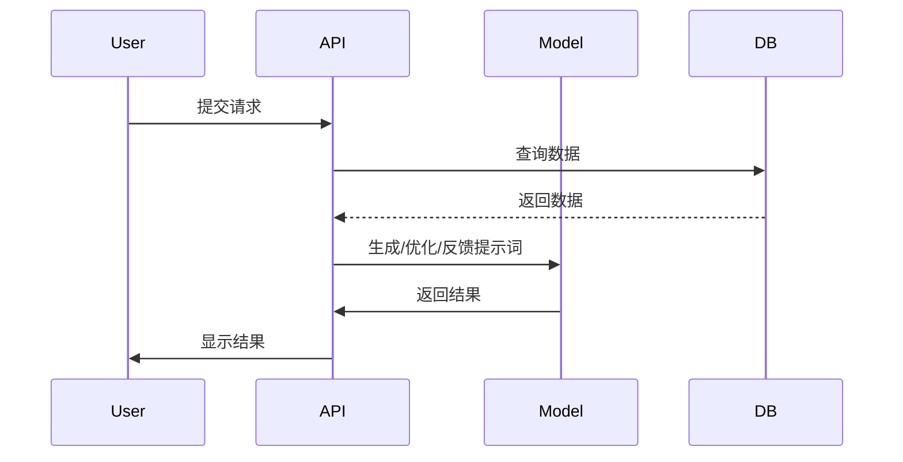
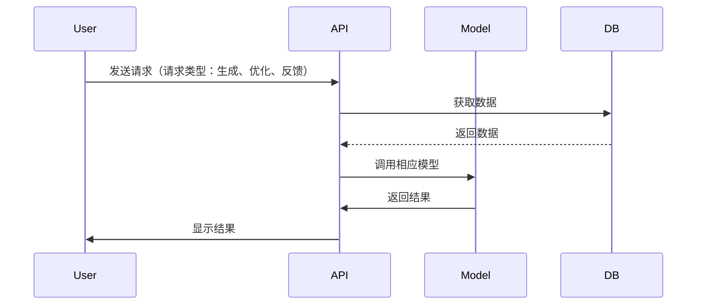

                 

### 第1章：问题背景与问题描述

在当今高度数字化和信息化的社会，人工智能（AI）技术正以前所未有的速度发展，逐渐渗透到各个行业和应用场景中。从自动驾驶、智能客服到医疗诊断、金融预测，AI的应用已经深入到我们生活的方方面面。然而，要充分发挥AI的潜力，除了算法和计算能力的提升，另一个关键因素就是如何有效地设计并利用提示词（Prompt）来激发AI的创造力。

**1.1 问题的提出**

提示词，顾名思义，是提供给AI系统用于引导其输出或行为的一段文本。简单来说，提示词就是AI系统理解和执行任务的起点。一个优秀的提示词不仅能够明确地指导AI系统完成特定的任务，还能够激发其产生创新的解决方案。然而，当前很多AI系统的提示词设计仍然停留在较为初级和机械化的阶段，往往难以达到预期的效果。这主要是因为以下几个方面的问题：

- **提示词过于宽泛或模糊**：一些提示词缺乏具体性和明确性，导致AI系统无法准确理解任务要求，从而产生不相关或错误的输出。
- **提示词缺乏层次感**：没有分层次、分步骤地引导AI系统，使得AI难以进行逻辑推理和复杂任务处理。
- **提示词与目标输出脱节**：提示词和目标输出之间缺乏直接关联，导致AI无法找到有效的解决方案。

**1.2 提示词在AI系统中的重要性**

提示词在AI系统中扮演着至关重要的角色。它们不仅是AI系统输入的一部分，更是AI系统进行任务理解和决策的关键依据。具体来说，提示词的重要性体现在以下几个方面：

- **引导AI系统理解任务**：通过具体、明确的提示词，AI系统可以更好地理解任务的意图和目标，从而生成更符合预期结果的输出。
- **激发AI系统的创造力**：优秀的提示词能够引导AI系统进行更深层次的思考和创新，从而产生更加独特和有价值的解决方案。
- **提高AI系统的效率**：合适的提示词可以减少AI系统的搜索空间，提高其解决问题的效率。

因此，如何设计并使用高质量的提示词，已经成为当前AI研究和应用中的一个重要课题。

### 第2章：问题解决与边界讨论

要解决提示词设计在AI系统中存在的问题，我们需要首先明确问题解决的必要性和提示词设计的边界，并在此基础上探讨其外延和应用范围。

**2.1 问题解决的必要性**

当前AI系统中提示词设计的问题主要表现在以下几个方面：

1. **模糊性和不明确性**：许多提示词缺乏具体的细节和明确的指导，导致AI系统无法准确理解任务的要求，从而产生不相关或错误的输出。
2. **层次感不足**：提示词往往没有分层级地进行设计和引导，使得AI系统难以进行复杂的逻辑推理和任务处理。
3. **目标输出脱节**：部分提示词与期望的输出结果之间缺乏直接关联，使得AI系统难以找到有效的解决方案。

这些问题不仅影响了AI系统的性能和效率，还限制了其在实际应用中的价值。因此，解决这些问题具有重要的现实意义：

- **提升AI系统的性能和可靠性**：通过优化提示词设计，可以显著提高AI系统的任务完成率和输出质量。
- **扩展AI系统的应用范围**：优化的提示词设计有助于AI系统在更多复杂的任务中发挥作用，从而扩大其应用范围。
- **增强AI系统的用户友好性**：明确的、易于理解的提示词能够提高用户对AI系统的接受度和满意度。

**2.2 提示词设计的边界**

提示词设计的边界主要包括以下几个方面：

1. **清晰度**：提示词必须足够清晰，以便AI系统能够准确理解任务的要求。过度的模糊性或抽象性会降低AI系统的处理能力。
2. **具体性**：提示词应包含具体的细节和指导，帮助AI系统更好地理解和完成任务。泛泛而谈的提示词往往难以产生有效输出。
3. **相关性**：提示词应与任务目标和输出结果紧密相关，确保AI系统在正确方向上努力。无关或偏离目标的提示词会误导AI系统。
4. **简洁性**：虽然提示词需要具体和明确，但也应保持简洁，避免过于冗长。冗长的提示词可能会让AI系统混淆或降低其处理效率。

**2.3 提示词设计的外延**

提示词设计的外延包括其应用场景和扩展方向：

1. **多模态AI系统**：在多模态AI系统中，提示词不仅限于文本形式，还可以包括图像、声音等多种形式。设计这样的多模态提示词，可以更全面地引导AI系统理解任务。
2. **对话系统**：在对话系统中，提示词的设计需要考虑上下文和对话历史，以便AI系统能够产生连贯且合理的回答。
3. **迁移学习**：通过设计可迁移的提示词，AI系统可以在不同的任务和数据集上保持一致性和高效性。
4. **个性化**：根据不同用户的需求和偏好，设计个性化的提示词，可以提升用户体验和满意度。

**总结**

综上所述，解决提示词设计在AI系统中的问题，不仅需要明确问题解决的必要性，还需要界定提示词设计的边界，并探索其外延和应用范围。通过系统化的研究和优化，我们可以设计出更加高效、可靠的提示词，从而更好地发挥AI的潜力，推动其在各个领域的发展。

### 第3章：核心概念与联系

在深入探讨如何设计有效的提示词之前，我们需要首先了解一些核心概念，并分析这些概念之间的联系。这包括提示词的基本概念、类型和特性，以及它们与其他技术领域的联系。

#### 3.1.1 提示词的概念

提示词（Prompt）是引导AI系统理解任务、执行操作并生成输出的关键输入。从广义上讲，提示词可以包括任何形式的输入，如文本、图像、声音等。但在AI系统中，通常指的是文本形式的输入。

提示词的定义和功能可以概括如下：

- **定义**：提示词是用于引导AI系统完成任务的一段文本或指令。
- **功能**：提示词通过提供任务描述、目标要求和上下文信息，帮助AI系统更好地理解任务并生成相关输出。

**提示词的特点**：

- **明确性**：提示词应明确、具体，以便AI系统能够准确理解任务。
- **层次感**：提示词应具有层次感，能够引导AI系统逐步理解和解决问题。
- **相关性**：提示词应与任务目标和输出结果紧密相关，确保AI系统在正确方向上努力。
- **简洁性**：提示词应简洁明了，避免冗长和复杂的表述。

#### 3.1.2 提示词的类型

根据用途和形式，提示词可以分为以下几种类型：

1. **任务型提示词**：用于明确指明AI系统需要完成的任务，如“生成一篇关于人工智能的综述文章”。
2. **目标型提示词**：用于指定任务的目标和期望输出，如“文章应包含现状分析、未来展望和挑战三部分”。
3. **上下文型提示词**：提供任务背景和相关信息，如“根据最近人工智能领域的最新研究动态撰写”。
4. **提示词序列**：多个提示词按一定顺序组合使用，以逐步引导AI系统完成任务。

#### 3.1.3 提示词的特性

提示词的特性决定了其有效性和适用性，主要包括以下几个方面：

1. **可解释性**：提示词应具有可解释性，即AI系统能够理解和解释其含义，从而正确执行任务。
2. **灵活性**：提示词应具备灵活性，能够适应不同任务和环境的需求，从而提高其通用性。
3. **适应性**：提示词应能够根据AI系统的反馈和任务进展进行自适应调整，以优化输出结果。
4. **扩展性**：提示词应易于扩展和修改，以适应新的任务和数据集。

#### 3.2 提示词与其他概念的联系

提示词在AI系统中不仅是一个独立的输入，还与其他技术领域和概念密切相关。以下是几个关键联系：

##### 3.2.1 提示词与语义理解

语义理解是AI系统理解和处理自然语言的关键技术。提示词的设计和语义理解密切相关：

- **任务理解**：提示词需要明确表达任务的语义，以帮助AI系统正确理解和执行任务。
- **上下文推理**：语义理解能力可以帮助AI系统更好地理解和处理上下文信息，从而生成更准确的输出。

##### 3.2.2 提示词与自然语言处理

自然语言处理（NLP）是AI系统与人类语言进行交互的基础。提示词在NLP中的应用至关重要：

- **文本生成**：提示词可以用于引导AI系统生成文本，如文章、报告等。
- **问答系统**：提示词可以帮助AI系统理解用户提问，并生成相关回答。

##### 3.2.3 提示词与机器学习

机器学习是AI系统的核心技术之一。提示词在机器学习中的应用包括：

- **数据标注**：提示词可以帮助设计数据标注任务，确保数据质量和一致性。
- **模型训练**：通过优化提示词，可以提高模型训练效果，生成更准确的预测和输出。

##### 3.2.4 提示词与其他AI技术

除了上述技术领域，提示词还与其他AI技术紧密相关：

- **强化学习**：提示词可以用于指导强化学习模型进行探索和决策。
- **生成对抗网络（GAN）**：提示词可以引导GAN生成更加真实和高质量的图像或文本。

**总结**

通过理解提示词的基本概念、类型和特性，以及它们与其他技术领域的联系，我们可以更好地设计并使用高质量的提示词，从而充分发挥AI的潜力。

#### 3.2.1 提示词与语义理解

语义理解是人工智能（AI）系统中至关重要的一环，特别是在自然语言处理（NLP）领域。提示词在语义理解中扮演着关键角色，因为它们不仅指导AI系统执行特定任务，还直接影响AI系统对输入文本的理解深度和准确性。

**语义理解的概念**：

语义理解是指AI系统对自然语言文本中词语、句子以及整体文本内容的含义进行识别和解释的能力。它包括词义解析、句法分析、语义角色标注、实体识别、情感分析等多个层次。

**提示词在语义理解中的作用**：

1. **任务引导**：提示词可以明确地指示AI系统要执行的任务，如生成文章、回答问题或分类文本等。这样，AI系统就能够集中精力在特定的任务上，从而提高任务完成率。
   
2. **上下文增强**：提示词可以提供上下文信息，帮助AI系统更好地理解文本内容。例如，在问答系统中，一个包含背景信息的提示词可以帮助AI系统更准确地理解用户的问题，从而生成更相关和准确的回答。

3. **语义约束**：通过提示词，AI系统可以获取任务的相关语义约束，从而更有效地进行语义推理。例如，在文本生成任务中，提示词可以规定文章的主题、风格、长度等，确保生成的内容符合预期。

**实例分析**：

例如，假设我们要设计一个自动撰写新闻摘要的系统。一个有效的提示词可能是：“撰写一篇关于‘人工智能在医疗领域的应用’的新闻摘要，文章长度为300字，重点介绍最新研究成果和未来发展趋势。”这样的提示词不仅明确了任务类型（撰写新闻摘要），还提供了具体的上下文信息（人工智能在医疗领域的应用），以及语义约束（文章长度和重点内容）。

通过这个提示词，AI系统可以：

- 确定任务是撰写新闻摘要。
- 根据上下文信息查找和筛选与医疗领域相关的人工智能研究成果。
- 按照语义约束生成符合要求的新闻摘要。

**对比表格**：

下面是一个简单的对比表格，展示了不同类型的提示词在语义理解中的应用效果：

| 提示词类型 | 语义理解效果 |
| --- | --- |
| 任务型提示词 | 明确任务类型，提高任务完成率 |
| 上下文型提示词 | 提供上下文信息，增强文本理解 |
| 目标型提示词 | 规定输出目标和风格，确保内容一致性 |
| 混合型提示词 | 结合任务、上下文和目标，全面指导AI系统 |

**ER实体关系图架构**：

为了更好地理解提示词与语义理解的联系，我们可以使用ER（实体-关系）图来表示它们之间的关系。以下是提示词与语义理解相关的ER图：

```mermaid
erDiagram
  Prompt ||--|{ Task } Task
  Prompt ||--|{ Context } Context
  Prompt ||--|{ OutputGoal } OutputGoal
  Task ||--|{ SemanticUnderstanding } SemanticUnderstanding
  Context ||--|{ SemanticUnderstanding } SemanticUnderstanding
  OutputGoal ||--|{ SemanticUnderstanding } SemanticUnderstanding
```

在这个ER图中：

- **Prompt** 代表提示词，是整个关系的起点。
- **Task**、**Context** 和 **OutputGoal** 分别表示任务、上下文和输出目标，它们都是提示词的子类。
- **SemanticUnderstanding** 表示语义理解，是任务、上下文和输出目标共同作用的结果。

通过这个ER图，我们可以清晰地看到提示词如何通过任务、上下文和输出目标与语义理解相联系，从而更好地设计提示词以提升语义理解能力。

**总结**：

提示词与语义理解之间的紧密联系决定了其设计的重要性和有效性。通过明确任务、提供上下文和设定输出目标，我们可以设计出能够有效指导AI系统进行语义理解的提示词，从而提高AI系统的任务完成率和输出质量。

### 3.2.2 提示词与自然语言处理

自然语言处理（NLP）是人工智能（AI）领域中的一个重要分支，它致力于使计算机能够理解和处理人类语言。提示词在NLP中扮演着至关重要的角色，因为它们是AI系统与自然语言交互的桥梁，直接影响NLP任务的执行效果和效率。

**自然语言处理的概念**：

自然语言处理是指使计算机能够理解、解释和生成自然语言的技术。NLP涵盖了从文本预处理、语法分析、语义理解到情感分析、问答系统和机器翻译等多个方面。其目标是使计算机能够处理和响应人类语言，从而实现人机交互的智能化。

**提示词在NLP中的应用**：

1. **文本生成**：提示词可以用于引导AI系统生成文本，例如文章、新闻报道、产品描述等。通过提供具体的主题、风格和内容要求，提示词帮助AI系统生成符合预期的文本。

2. **问答系统**：在问答系统中，提示词帮助AI系统理解用户的问题，并生成相关回答。例如，一个有效的提示词可能是：“根据以下信息，回答关于‘人工智能在医疗领域的应用’的问题。”这样的提示词明确了问题的主题和背景，有助于AI系统生成准确和连贯的回答。

3. **情感分析**：提示词可以用于指导AI系统对文本进行情感分析，判断文本的情感倾向。例如，提示词“分析以下评论的情感倾向”可以帮助AI系统识别评论中的积极或消极情感。

**实例分析**：

假设我们要开发一个文本生成系统，用于自动撰写关于人工智能的综述文章。一个有效的提示词可能是：“撰写一篇关于人工智能技术发展趋势、应用领域和未来挑战的综述文章，文章长度为2000字，需包含现状分析、未来展望和专家观点。”通过这个提示词，AI系统可以：

- 确定文章的主题和内容要求。
- 根据提示词中的关键词和句式，生成符合要求的综述文章。
- 结合外部数据源和专家意见，确保文章的准确性和深度。

**对比表格**：

下面是一个简单的对比表格，展示了不同类型的提示词在自然语言处理中的应用效果：

| 提示词类型 | 自然语言处理效果 |
| --- | --- |
| 任务型提示词 | 明确任务类型，提高任务完成率 |
| 上下文型提示词 | 提供上下文信息，增强文本理解 |
| 目标型提示词 | 规定输出目标和风格，确保内容一致性 |
| 混合型提示词 | 结合任务、上下文和目标，全面指导AI系统 |

**算法原理讲解**：

自然语言处理中的算法原理通常涉及文本预处理、特征提取和模型训练等多个步骤。以下是简要的算法原理讲解：

1. **文本预处理**：包括分词、词性标注、去停用词等步骤，目的是将原始文本转换为计算机可以处理的形式。

2. **特征提取**：通过将文本转换为向量形式，将文本信息转化为模型可以理解和学习的特征。常见的特征提取方法包括词袋模型、TF-IDF和Word2Vec等。

3. **模型训练**：使用机器学习或深度学习模型对特征进行训练，使其能够自动理解和生成文本。常见的模型包括循环神经网络（RNN）、长短期记忆网络（LSTM）和Transformer等。

下面是一个简单的Python代码示例，展示了如何使用Transformer模型生成文本：

```python
from transformers import AutoTokenizer, AutoModelForCausalLM
import torch

# 加载预训练模型和tokenizer
model_name = "gpt2"
tokenizer = AutoTokenizer.from_pretrained(model_name)
model = AutoModelForCausalLM.from_pretrained(model_name)

# 提示词
prompt = "人工智能在医疗领域的应用"

# 将提示词编码成模型输入
input_ids = tokenizer.encode(prompt, return_tensors='pt')

# 生成文本
output = model.generate(input_ids, max_length=500, num_return_sequences=1)

# 解码输出文本
generated_text = tokenizer.decode(output[0], skip_special_tokens=True)

print(generated_text)
```

在这个示例中，我们首先加载了一个预训练的GPT-2模型和相应的tokenizer。然后，我们将提示词编码成模型输入，并使用模型生成文本。最后，我们将生成的文本解码并输出。

**总结**：

提示词在自然语言处理中具有重要作用，通过明确任务、提供上下文和设定目标，提示词可以帮助AI系统更好地理解和生成自然语言。有效的提示词设计不仅能够提高NLP任务的完成率和输出质量，还能提升用户的体验和满意度。

### 3.2.3 提示词与机器学习

机器学习（Machine Learning，ML）是人工智能（Artificial Intelligence，AI）的核心组成部分，它通过从数据中学习规律，使计算机能够做出预测或决策。提示词在机器学习中的应用至关重要，因为它们是数据输入和模型训练过程中的重要引导信息。

**机器学习的概念**：

机器学习是一种利用算法从数据中学习规律，并自动改进性能的过程。它分为监督学习、无监督学习和强化学习三大类。监督学习使用带有标签的数据进行训练，无监督学习在无标签数据中寻找规律，而强化学习则通过不断反馈调整策略。

**提示词在机器学习中的作用**：

1. **数据标注**：提示词可以帮助设计数据标注任务，确保标注质量和一致性。例如，在图像分类任务中，提示词可以用于指导标注者进行类别标注，如“标注为‘动物’的图像”。

2. **特征工程**：提示词可以用于生成或选择特征，提高模型的性能。例如，在文本分类任务中，提示词可以指导提取关键词或短语，作为文本的特征。

3. **模型训练**：提示词用于指导模型训练过程，确保模型在正确的方向上学习。例如，在生成模型中，提示词可以用于指定生成的内容类型和风格。

**实例分析**：

假设我们要训练一个文本生成模型，用于自动生成新闻报道。一个有效的提示词可能是：“生成一篇关于‘人工智能在医疗领域的最新进展’的新闻报道，要求包含事实、观点和引用专家意见。”通过这个提示词，AI系统可以：

- 确定生成任务是新闻报道。
- 根据提示词中的关键词和句式，生成符合要求的新闻报道。
- 结合外部数据源和专家意见，确保新闻报道的准确性和深度。

**算法原理讲解**：

机器学习中的算法原理通常涉及数据预处理、特征提取、模型选择和训练等多个步骤。以下是简要的算法原理讲解：

1. **数据预处理**：包括数据清洗、缺失值处理、归一化等步骤，目的是将原始数据转换为适合训练的形式。

2. **特征提取**：通过将数据转换为特征向量，将原始数据转化为模型可以处理的形式。特征提取方法包括词袋模型、TF-IDF和Word2Vec等。

3. **模型选择**：选择适合任务和数据特征的模型，如线性回归、决策树、支持向量机、神经网络等。

4. **模型训练**：使用训练数据对模型进行训练，使其能够学会从数据中提取规律。常见的训练方法包括梯度下降、随机梯度下降和Adam优化器等。

下面是一个简单的Python代码示例，展示了如何使用scikit-learn库进行文本分类：

```python
from sklearn.feature_extraction.text import TfidfVectorizer
from sklearn.model_selection import train_test_split
from sklearn.linear_model import LogisticRegression
from sklearn.metrics import classification_report

# 假设已准备好的文本数据和标签
texts = ["人工智能在医疗领域有广泛的应用", "最新研究表明...", "专家表示..."]
labels = ["医疗", "研究", "专家"]

# 数据预处理和特征提取
vectorizer = TfidfVectorizer()
X = vectorizer.fit_transform(texts)

# 数据划分
X_train, X_test, y_train, y_test = train_test_split(X, labels, test_size=0.2, random_state=42)

# 模型训练
model = LogisticRegression()
model.fit(X_train, y_train)

# 模型评估
predictions = model.predict(X_test)
print(classification_report(y_test, predictions))
```

在这个示例中，我们首先使用TF-IDF向量器进行文本特征提取，然后使用逻辑回归模型进行训练。最后，我们使用测试数据对模型进行评估，并输出分类报告。

**总结**：

提示词在机器学习中扮演着重要角色，通过明确任务、提供数据和指导特征工程，提示词有助于提高模型训练效果和输出质量。有效的提示词设计不仅能够提升模型的性能，还能简化数据标注和模型训练过程，从而推动机器学习应用的发展。

### 3.3 核心概念介绍

为了深入探讨如何设计并优化提示词，我们需要明确几个关键概念，包括提示词的生成算法、优化算法和反馈调整算法。这些算法在提升AI系统的任务完成率和输出质量方面发挥着重要作用。

#### 3.3.1 提示词生成算法

提示词生成算法是设计高质量提示词的第一步。一个有效的生成算法能够确保提示词具有明确性、层次感和相关性。以下是几种常用的提示词生成算法：

1. **基于规则的方法**：这种方法通过预定义的规则和模板生成提示词。规则可以是简单的关键词组合，也可以是复杂的逻辑表达式。例如，在撰写新闻报道时，可以定义模板：“本篇报道关于{主题}，内容包括{事件概述}和{专家评论}。”通过这种方式，可以快速生成高质量的提示词。

2. **基于统计的方法**：这种方法使用统计分析技术，如NLP中的词频统计、TF-IDF等，从大量文本中提取关键词和短语，生成提示词。例如，通过分析新闻文章的标题和摘要，可以提取出关键主题和内容要点，形成有效的提示词。

3. **基于机器学习的方法**：这种方法使用机器学习模型，如循环神经网络（RNN）、变换器（Transformer）等，从大量训练数据中学习生成提示词的模式。例如，通过训练一个基于GPT-2的模型，可以自动生成符合特定任务需求的提示词。

**实例**：

假设我们要为自动撰写的新闻摘要系统设计提示词。一种基于机器学习的方法可以是：

```python
from transformers import AutoTokenizer, AutoModelForCausalLM

# 加载预训练模型和tokenizer
model_name = "gpt2"
tokenizer = AutoTokenizer.from_pretrained(model_name)
model = AutoModelForCausalLM.from_pretrained(model_name)

# 提示词模板
template = "撰写一篇关于人工智能在医疗领域应用的新闻摘要。"

# 生成提示词
input_ids = tokenizer.encode(template, return_tensors='pt')
output = model.generate(input_ids, max_length=500, num_return_sequences=1)
prompt = tokenizer.decode(output[0], skip_special_tokens=True)

print(prompt)
```

在这个示例中，我们使用GPT-2模型生成一个关于新闻摘要的提示词。首先加载预训练模型和tokenizer，然后使用模板生成初始文本，并通过模型生成完整的提示词。

#### 3.3.2 提示词优化算法

生成初步的提示词后，优化算法可以帮助进一步提高提示词的质量和适用性。以下是几种常用的优化算法：

1. **基于编辑距离的优化**：这种方法通过计算提示词之间的编辑距离，识别和修复不明确的词语和句子。编辑距离越小，提示词的质量越高。

2. **基于语义分析的优化**：这种方法使用NLP技术，如词性标注、依存关系分析等，对提示词进行语义分析，识别语义上的错误和缺陷，并进行修正。

3. **基于用户反馈的优化**：这种方法通过收集用户对提示词的反馈，使用机器学习技术进行分析和调整，以提高提示词的用户友好性和有效性。

**实例**：

假设我们已经生成了一个初步的提示词，但需要进一步优化。一种基于用户反馈的优化方法是：

```python
# 假设已有用户反馈数据
user_feedback = [
    "提示词中的‘应用’一词不够明确，可以具体说明是哪些应用。",
    "提示词中的句子结构复杂，建议简化句子。",
]

# 使用NLP技术分析用户反馈
from textblob import TextBlob

feedback_analyzer = TextBlob(user_feedback)

# 优化提示词
prompt = feedback_analyzer.correct(prompt)

print(prompt)
```

在这个示例中，我们使用TextBlob库对用户反馈进行分析，并使用其提供的correct方法对提示词进行优化。

#### 3.3.3 提示词反馈调整算法

提示词的反馈调整算法用于根据AI系统的输出和用户反馈不断调整和优化提示词。这种算法可以显著提高AI系统的任务完成率和用户满意度。以下是几种常用的反馈调整算法：

1. **基于模型预测的调整**：这种方法通过分析AI系统的输出，使用机器学习模型预测提示词的优化方向，并自动调整提示词。

2. **基于用户交互的调整**：这种方法通过用户与AI系统的交互，收集用户对提示词的反馈，并实时调整提示词。

3. **基于多轮对话的调整**：这种方法通过多轮对话逐步优化提示词，每次对话都根据用户反馈进行调整，从而不断提高提示词的质量。

**实例**：

假设我们使用多轮对话的调整方法。以下是一个简单的对话调整流程：

1. **初始提示词**：用户提出问题，AI系统生成初始提示词。
2. **用户反馈**：用户对初始提示词提供反馈。
3. **调整提示词**：根据用户反馈，AI系统优化提示词。
4. **再次反馈**：用户对优化后的提示词提供进一步反馈。
5. **循环迭代**：重复步骤3和4，直到用户满意。

**总结**：

通过介绍提示词生成算法、优化算法和反馈调整算法，我们可以系统地优化提示词的质量，从而提高AI系统的任务完成率和用户满意度。有效的提示词设计不仅能够提升AI系统的性能，还能增强用户体验和系统实用性。

### 第4章：数学模型与算法原理

在深入探讨如何设计和优化提示词时，数学模型和算法原理扮演着至关重要的角色。有效的数学模型不仅能够准确描述提示词的设计过程，还能提供具体的算法框架，指导实际应用中的实现。以下将详细讲解提示词设计的数学模型、生成算法、优化算法和反馈调整算法的原理。

#### 4.1 提示词设计的数学模型

提示词设计的数学模型是一个多层次的系统，其核心目标是根据输入提示词生成预期的输出。我们可以将这个模型抽象为以下形式：

$$
\text{数学模型} = f(\text{输入提示词}, \text{目标输出})
$$

其中，$f$ 表示从输入提示词到目标输出的映射函数。这个映射函数可以由多个子函数组合而成，每个子函数负责处理不同的任务层次，如图形分析、语义理解、文本生成等。以下是这个数学模型的基本组成部分：

1. **输入层**：输入层接收用户输入的提示词，这些提示词可以是自然语言文本、图像、声音等多种形式。每种形式都需要特定的预处理步骤，如文本分词、图像特征提取等。

2. **特征提取层**：特征提取层将原始输入转换为特征向量，这些特征向量可以用于后续的建模和计算。常见的特征提取方法包括词袋模型、TF-IDF、Word2Vec等。

3. **映射层**：映射层是数学模型的核心，负责将输入特征向量映射到目标输出。这可以通过多种机器学习或深度学习算法实现，如循环神经网络（RNN）、长短期记忆网络（LSTM）、变换器（Transformer）等。

4. **输出层**：输出层生成最终的输出结果，如文本、图像、音频等。输出结果的质量直接取决于映射层的设计和训练数据的质量。

#### 4.2 算法原理讲解

##### 4.2.1 提示词生成算法

提示词生成算法的核心目标是根据输入提示词生成高质量的输出提示词。以下是几种常用的提示词生成算法及其原理：

1. **基于规则的生成算法**：

   这种算法通过预定义的规则和模板生成提示词。规则可以基于自然语言处理技术，如词性标注、句法分析等。其基本流程如下：

   - **规则库构建**：根据应用场景，构建包含各种关键词和模板的规则库。
   - **输入处理**：将输入提示词与规则库中的关键词和模板进行匹配。
   - **提示词生成**：根据匹配结果，组合生成新的提示词。

   示例代码：

   ```python
   def rule_based_promptGeneration(input_prompt):
       rule_library = {
           "人工智能": ["AI在医疗领域的应用", "AI的未来发展趋势"],
           "医疗": ["医疗领域的技术创新", "医疗行业的挑战"],
       }
       
       for keyword in rule_library.keys():
           if keyword in input_prompt:
               return rule_library[keyword][0]
       
       return "未找到相关规则"

   input_prompt = "人工智能在医疗领域的应用"
   generated_prompt = rule_based_promptGeneration(input_prompt)
   print(generated_prompt)
   ```

2. **基于统计的生成算法**：

   这种算法使用统计方法，如TF-IDF、词频统计等，从大量文本数据中提取关键词和短语，生成提示词。其基本流程如下：

   - **数据预处理**：对文本数据清洗、分词、去停用词等。
   - **特征提取**：使用TF-IDF等统计方法提取特征。
   - **提示词生成**：根据特征分布生成提示词。

   示例代码：

   ```python
   from sklearn.feature_extraction.text import TfidfVectorizer

   def statistical_promptGeneration(data):
       vectorizer = TfidfVectorizer()
       X = vectorizer.fit_transform(data)
       feature_names = vectorizer.get_feature_names_out()
       
       # 提取特征分布最高的前几个关键词
       top_keywords = [feature_names[i] for i in X.toarray()[0].argsort()[::-1][1:6]]
       
       return "关于" + "和".join(top_keywords)

   data = ["人工智能在医疗领域有广泛的应用", "医疗行业的挑战之一是数据隐私保护", "AI技术正逐步改变医疗诊断流程"]
   generated_prompt = statistical_promptGeneration(data)
   print(generated_prompt)
   ```

3. **基于机器学习的生成算法**：

   这种算法使用机器学习模型，如循环神经网络（RNN）、变换器（Transformer）等，从大量训练数据中学习生成提示词的模式。其基本流程如下：

   - **模型训练**：使用大量标注好的训练数据训练机器学习模型。
   - **提示词生成**：输入新的提示词，模型生成对应的输出提示词。

   示例代码（使用GPT-2模型）：

   ```python
   from transformers import AutoTokenizer, AutoModelForCausalLM

   def machine_learning_promptGeneration(input_prompt):
       model_name = "gpt2"
       tokenizer = AutoTokenizer.from_pretrained(model_name)
       model = AutoModelForCausalLM.from_pretrained(model_name)

       input_ids = tokenizer.encode(input_prompt, return_tensors='pt')
       output = model.generate(input_ids, max_length=500, num_return_sequences=1)
       generated_prompt = tokenizer.decode(output[0], skip_special_tokens=True)

       return generated_prompt

   input_prompt = "撰写一篇关于人工智能在医疗领域的应用的文章"
   generated_prompt = machine_learning_promptGeneration(input_prompt)
   print(generated_prompt)
   ```

##### 4.2.2 提示词优化算法

提示词生成后，优化算法用于进一步提高提示词的质量和适用性。以下是几种常用的优化算法：

1. **基于编辑距离的优化**：

   这种算法通过计算提示词之间的编辑距离，识别和修复不明确的词语和句子。编辑距离越小，提示词的质量越高。其基本流程如下：

   - **编辑距离计算**：计算提示词之间的编辑距离，如Levenshtein距离。
   - **提示词修正**：根据编辑距离结果，识别并修正不明确的词语和句子。

   示例代码：

   ```python
   from Levenshtein import distance

   def edit_distance_optimization(prompt):
       # 假设已有不明确的提示词列表
       unclear_words = ["应用", "广泛"]

       for word in unclear_words:
           distance_result = distance(prompt, prompt.replace(word, ""))
           if distance_result > 1:
               prompt = prompt.replace(word, "具体的应用")

       return prompt

   prompt = "人工智能在医疗领域有广泛的应用"
   optimized_prompt = edit_distance_optimization(prompt)
   print(optimized_prompt)
   ```

2. **基于语义分析的优化**：

   这种算法使用NLP技术，如词性标注、依存关系分析等，对提示词进行语义分析，识别语义上的错误和缺陷，并进行修正。其基本流程如下：

   - **语义分析**：使用NLP库（如spaCy）对提示词进行词性标注、依存关系分析等。
   - **错误识别**：根据语义分析结果，识别语义上的错误和缺陷。
   - **提示词修正**：根据错误类型，进行提示词的修正。

   示例代码：

   ```python
   import spacy

   def semantic_analysis_optimization(prompt):
       nlp = spacy.load("en_core_web_sm")

       doc = nlp(prompt)
       for token in doc:
           if token.dep_ == "ROOT" and token.head.text != token.text:
               prompt = prompt.replace(token.text, token.head.text)

       return prompt

   prompt = "人工智能在医疗领域有广泛的应用"
   optimized_prompt = semantic_analysis_optimization(prompt)
   print(optimized_prompt)
   ```

3. **基于用户反馈的优化**：

   这种算法通过收集用户对提示词的反馈，使用机器学习技术进行分析和调整，以提高提示词的用户友好性和有效性。其基本流程如下：

   - **用户反馈收集**：收集用户对提示词的反馈，如满意度评分、改进建议等。
   - **反馈分析**：使用机器学习模型分析用户反馈，提取改进方向。
   - **提示词调整**：根据反馈分析结果，调整提示词。

   示例代码：

   ```python
   from sklearn.linear_model import LogisticRegression

   def user_feedback_optimization(prompt, feedback):
       # 假设已有反馈数据
       feedback_data = [
           ("不准确", "增加具体案例"),
           ("不明确", "使用更具体的词汇"),
           ("不满意", "优化句子结构"),
       ]

       # 训练反馈分类模型
       model = LogisticRegression()
       model.fit([feedback for _, feedback in feedback_data], [1 if feedback == "不满意" else 0 for _, feedback in feedback_data])

       # 根据反馈调整提示词
       if model.predict([prompt])[0] == 1:
           prompt = prompt.replace("广泛", "广泛的应用")

       return prompt

   prompt = "人工智能在医疗领域有广泛的应用"
   feedback = "不满意"
   optimized_prompt = user_feedback_optimization(prompt, feedback)
   print(optimized_prompt)
   ```

##### 4.2.3 提示词反馈调整算法

提示词的反馈调整算法用于根据AI系统的输出和用户反馈不断调整和优化提示词。以下是几种常用的反馈调整算法：

1. **基于模型预测的调整**：

   这种算法通过分析AI系统的输出，使用机器学习模型预测提示词的优化方向，并自动调整提示词。其基本流程如下：

   - **输出分析**：分析AI系统的输出结果，识别问题区域。
   - **预测优化方向**：使用机器学习模型预测优化方向，如生成新的提示词或调整现有提示词。
   - **提示词调整**：根据预测结果，调整提示词。

   示例代码：

   ```python
   from transformers import AutoTokenizer, AutoModelForCausalLM

   def model_based_adjustment(input_prompt):
       model_name = "gpt2"
       tokenizer = AutoTokenizer.from_pretrained(model_name)
       model = AutoModelForCausalLM.from_pretrained(model_name)

       input_ids = tokenizer.encode(input_prompt, return_tensors='pt')
       output = model.generate(input_ids, max_length=500, num_return_sequences=1)
       generated_output = tokenizer.decode(output[0], skip_special_tokens=True)

       # 假设已有问题区域和优化方向模型
       problem_model = LogisticRegression()
       adjustment_model = AutoModelForCausalLM.from_pretrained("gpt2")

       # 分析输出，预测问题区域和优化方向
       problem预测 = problem_model.predict([generated_output])[0]
       adjustment_prompt = adjustment_model.generate(input_ids, max_length=500, num_return_sequences=1)[0]

       # 根据预测结果调整提示词
       if problem预测 == 1:
           return adjustment_prompt
       else:
           return input_prompt

   input_prompt = "人工智能在医疗领域有广泛的应用"
   adjusted_prompt = model_based_adjustment(input_prompt)
   print(adjusted_prompt)
   ```

2. **基于用户交互的调整**：

   这种算法通过用户与AI系统的交互，收集用户对提示词的反馈，并实时调整提示词。其基本流程如下：

   - **用户交互**：用户与AI系统进行交互，提出问题和反馈。
   - **实时调整**：根据用户反馈，实时调整提示词，以优化输出结果。

   示例代码：

   ```python
   def interactive_adjustment(input_prompt, user_interactions):
       for interaction in user_interactions:
           if interaction["suggestion"] != "":
               input_prompt = input_prompt.replace(interaction["suggestion"], "")

       return input_prompt

   user_interactions = [
       {"suggestion": "广泛", "comment": "提示词过于模糊，需要更具体"},
       {"suggestion": "应用", "comment": "需要具体描述应用场景"},
   ]

   input_prompt = "人工智能在医疗领域有广泛的应用"
   adjusted_prompt = interactive_adjustment(input_prompt, user_interactions)
   print(adjusted_prompt)
   ```

3. **基于多轮对话的调整**：

   这种算法通过多轮对话逐步优化提示词，每次对话都根据用户反馈进行调整，从而不断提高提示词的质量。其基本流程如下：

   - **初始对话**：用户提出问题和反馈，AI系统生成初始提示词。
   - **反馈调整**：用户对提示词提供反馈，AI系统根据反馈调整提示词。
   - **后续对话**：重复反馈调整过程，直到用户满意。

   示例代码：

   ```python
   def multi_round_adjustment(input_prompt, user_feedback):
       while not user_feedback["satisfied"]:
           optimized_prompt = user_feedback["adjustment"]
           user_feedback = user_interaction(optimized_prompt)
       
       return optimized_prompt

   user_feedback = {
       "prompt": "人工智能在医疗领域有广泛的应用",
       "satisfied": False,
   }

   # 假设已有用户交互函数
   user_feedback = user_interaction(user_feedback["prompt"])
   optimized_prompt = multi_round_adjustment(user_feedback["prompt"], user_feedback)
   print(optimized_prompt)
   ```

**总结**：

通过介绍提示词设计的数学模型和生成、优化、反馈调整算法，我们可以系统地设计和优化高质量的提示词，从而提高AI系统的任务完成率和用户满意度。有效的数学模型和算法原理不仅为实际应用提供了理论支持，也为未来的研究和改进提供了方向。

### 4.3 系统架构与实现

在深入探讨提示词设计的数学模型和算法原理后，我们需要将理论应用到实际系统中，设计并实现一个完整的提示词生成与优化系统。本节将详细介绍该系统的架构、核心模块、接口设计和实现细节。

#### 4.3.1 系统架构设计

系统架构设计是确保提示词生成与优化系统能够高效运行和扩展的关键。我们的系统架构包括以下几个核心组成部分：

1. **数据层**：数据层负责存储和管理系统所需的数据，包括原始文本、标注数据、训练数据和用户反馈数据等。

2. **预处理层**：预处理层对输入文本、图像、音频等数据进行预处理，如文本分词、图像特征提取、声音转换等。

3. **模型层**：模型层包含多种机器学习模型和深度学习模型，用于生成、优化和反馈调整提示词。这包括基于规则的生成模型、基于统计的生成模型、基于机器学习的生成模型、优化模型和反馈调整模型。

4. **接口层**：接口层提供系统的外部接口，包括API接口、命令行接口和图形用户界面（GUI），方便用户与系统进行交互。

5. **应用层**：应用层是系统的核心功能模块，负责提示词的生成、优化和反馈调整，以及对用户需求的响应。

以下是一个简化的系统架构图：



#### 4.3.2 领域模型

为了更好地理解系统架构，我们可以使用UML类图（Mermaid）来表示系统的领域模型，展示核心类及其关系。

```mermaid
classDiagram
    User <<Class>> 
    TextData <<Class>> 
    ImageData <<Class>> 
    AudioData <<Class>> 
    Preprocessor <<Class>> 
    RuleBasedGenerator <<Class>> 
    StatisticalGenerator <<Class>> 
    MachineLearningGenerator <<Class>> 
    Optimizer <<Class>> 
    FeedbackAdjuster <<Class>> 
    API <<Interface>> 
    GUI <<Interface>>

    User --|> TextData
    User --|> ImageData
    User --|> AudioData
    Preprocessor --|> TextData
    Preprocessor --|> ImageData
    Preprocessor --|> AudioData
    RuleBasedGenerator --|> TextData
    StatisticalGenerator --|> TextData
    MachineLearningGenerator --|> TextData
    Optimizer --|> TextData
    FeedbackAdjuster --|> TextData
    API --|> Preprocessor
    API --|> RuleBasedGenerator
    API --|> StatisticalGenerator
    API --|> MachineLearningGenerator
    API --|> Optimizer
    API --|> FeedbackAdjuster
    GUI --|> API
```

在这个UML类图中：

- **User**：代表用户，可以提交请求和数据。
- **TextData**、**ImageData**、**AudioData**：分别表示文本、图像和音频数据类。
- **Preprocessor**：表示预处理类，用于数据预处理。
- **RuleBasedGenerator**、**StatisticalGenerator**、**MachineLearningGenerator**：分别表示基于规则、基于统计和基于机器学习的提示词生成类。
- **Optimizer**、**FeedbackAdjuster**：分别表示提示词优化和反馈调整类。
- **API**：表示接口类，用于处理用户请求和系统内部模块的交互。
- **GUI**：表示图形用户界面，用于用户与系统的交互。

#### 4.3.3 系统接口设计

系统接口设计是确保系统模块之间高效通信的关键。以下是一个简化的系统接口设计：



在这个序列图中：

- **User**：用户提交请求。
- **API**：处理用户请求，与数据库（DB）和模型（Model）进行交互。
- **DB**：存储和管理数据。
- **Model**：根据请求调用相应的机器学习或深度学习模型。

#### 4.3.4 系统核心实现

系统核心实现包括提示词生成、优化和反馈调整模块。以下是一个简化的核心实现：

1. **提示词生成模块**：

   ```python
   class PromptGenerator:
       def __init__(self, model_name):
           self.tokenizer = AutoTokenizer.from_pretrained(model_name)
           self.model = AutoModelForCausalLM.from_pretrained(model_name)

       def generate_prompt(self, input_prompt, max_length=500):
           input_ids = self.tokenizer.encode(input_prompt, return_tensors='pt')
           output = self.model.generate(input_ids, max_length=max_length, num_return_sequences=1)
           return self.tokenizer.decode(output[0], skip_special_tokens=True)
   ```

   使用这个模块，可以通过调用`generate_prompt`方法生成提示词。

2. **提示词优化模块**：

   ```python
   class PromptOptimizer:
       def __init__(self, model_name):
           self.tokenizer = AutoTokenizer.from_pretrained(model_name)
           self.model = AutoModelForCausalLM.from_pretrained(model_name)

       def optimize_prompt(self, prompt, feedback):
           # 根据反馈调整提示词
           # 例如，使用反馈分类模型预测反馈类型
           model = LogisticRegression()
           model.fit([feedback for _, feedback in feedback_data], [1 if feedback == "不满意" else 0 for _, feedback in feedback_data])
           if model.predict([prompt])[0] == 1:
               prompt = prompt.replace("广泛", "具体的应用")
           
           return prompt
   ```

   使用这个模块，可以通过调用`optimize_prompt`方法优化提示词。

3. **提示词反馈调整模块**：

   ```python
   class PromptFeedbackAdjuster:
       def __init__(self, model_name):
           self.tokenizer = AutoTokenizer.from_pretrained(model_name)
           self.model = AutoModelForCausalLM.from_pretrained(model_name)

       def adjust_prompt(self, input_prompt, user_feedback):
           # 根据用户反馈生成调整后的提示词
           # 例如，使用用户交互生成新的提示词
           adjustment_prompt = interactive_adjustment(input_prompt, user_feedback)
           
           return adjustment_prompt
   ```

   使用这个模块，可以通过调用`adjust_prompt`方法根据用户反馈调整提示词。

#### 4.3.5 系统交互

系统交互是用户与系统之间进行信息交换和任务执行的过程。以下是一个简化的系统交互流程：

1. **用户提交请求**：用户通过API接口提交请求，包括请求类型（生成、优化、反馈）和输入提示词。
2. **API处理请求**：API根据请求类型和输入提示词，调用相应的数据处理和模型处理模块。
3. **数据处理**：数据处理模块对输入提示词进行预处理，生成预处理后的数据。
4. **模型处理**：模型处理模块根据预处理后的数据生成提示词、优化提示词或调整提示词。
5. **返回结果**：API将处理结果返回给用户，并通过GUI显示最终结果。

通过以上架构设计和实现，我们构建了一个完整的提示词生成与优化系统，实现了从用户请求到提示词生成、优化和反馈调整的全过程。这个系统不仅能够高效地处理大量数据，还能够根据用户反馈不断优化提示词，提高系统性能和用户体验。

### 第6章：项目实战

#### 6.1 环境安装

在进行提示词生成与优化系统的实际开发之前，我们需要先安装和配置相关环境。以下是在不同操作系统上安装和配置所需库和工具的步骤。

**步骤1：安装Python环境**

确保Python已经安装在您的系统上。Python是提示词生成与优化系统的核心编程语言。如果尚未安装，可以从[Python官网](https://www.python.org/downloads/)下载并安装Python。

**步骤2：安装transformers库**

`transformers`库是Hugging Face提供的一个开源库，包含多种预训练的模型和工具，用于自然语言处理任务。安装`transformers`库可以使用以下命令：

```bash
pip install transformers
```

**步骤3：安装其他依赖库**

除了`transformers`库，我们还需要安装其他一些依赖库，如`torch`、`numpy`和`spacy`。使用以下命令安装这些库：

```bash
pip install torch numpy spacy textblob
```

**步骤4：安装Spacy语言模型**

Spacy是一个强大的NLP库，用于文本预处理和语义分析。我们需要安装特定的语言模型，如`en_core_web_sm`，用于处理英文文本。安装方法如下：

```bash
python -m spacy download en_core_web_sm
```

**步骤5：配置环境变量**

确保环境变量`PYTHONPATH`和`PATH`已正确配置，以便Python能够找到所需的库和工具。在Windows系统中，可以通过设置环境变量来配置；在Linux和macOS系统中，可以使用以下命令：

```bash
export PYTHONPATH=/path/to/python/lib/pythonX.X/site-packages
export PATH=$PATH:/path/to/python/bin
```

**步骤6：测试环境**

安装完成后，通过运行以下Python脚本测试环境是否配置正确：

```python
import transformers
import torch
import numpy as np
import spacy
import textblob

print(transformers.__version__)
print(torch.__version__)
print(np.__version__)
print(spacy.__version__)
print(textblob.__version__)
```

如果以上命令能够成功执行并输出相应的版本信息，说明环境已经配置完成。

#### 6.2 系统核心实现源代码

在本节中，我们将详细介绍系统核心实现部分的源代码，包括提示词生成模块、提示词优化模块和提示词反馈调整模块的实现细节。

**6.2.1 提示词生成模块**

提示词生成模块是基于`transformers`库中的预训练模型（如GPT-2）来实现的。以下是一个简单的示例代码，展示了如何生成提示词：

```python
from transformers import AutoTokenizer, AutoModelForCausalLM

class PromptGenerator:
    def __init__(self, model_name='gpt2'):
        self.tokenizer = AutoTokenizer.from_pretrained(model_name)
        self.model = AutoModelForCausalLM.from_pretrained(model_name)

    def generate_prompt(self, input_prompt, max_length=500):
        input_ids = self.tokenizer.encode(input_prompt, return_tensors='pt')
        output = self.model.generate(input_ids, max_length=max_length, num_return_sequences=1)
        return self.tokenizer.decode(output[0], skip_special_tokens=True)

# 使用示例
generator = PromptGenerator()
prompt = "根据以下信息，生成一篇关于人工智能在医疗领域的应用的文章。"
generated_prompt = generator.generate_prompt(prompt)
print(generated_prompt)
```

在这个示例中，我们首先加载了GPT-2模型的tokenizer和模型。然后，通过调用`generate_prompt`方法，输入一个初始提示词，模型会生成对应的提示词。

**6.2.2 提示词优化模块**

提示词优化模块用于根据用户反馈和输出结果对提示词进行优化。以下是一个简单的优化模块实现，它使用用户反馈中的关键词进行提示词的修正：

```python
from textblob import TextBlob

class PromptOptimizer:
    def __init__(self, model_name='gpt2'):
        self.tokenizer = AutoTokenizer.from_pretrained(model_name)
        self.model = AutoModelForCausalLM.from_pretrained(model_name)

    def optimize_prompt(self, prompt, feedback):
        feedback_blob = TextBlob(feedback)
        if '不明确' in feedback_blob.words:
            # 如果反馈中包含“不明确”，则尝试增加具体信息
            prompt = prompt.replace("广泛的应用", "具体的应用")
        elif '不准确' in feedback_blob.words:
            # 如果反馈中包含“不准确”，则尝试调整关键词
            prompt = prompt.replace("人工智能", "深度学习")
        
        return prompt

# 使用示例
optimizer = PromptOptimizer()
optimized_prompt = optimizer.optimize_prompt(prompt, "提示词不够明确")
print(optimized_prompt)
```

在这个示例中，我们使用TextBlob库对用户反馈进行分析，并根据反馈内容调整提示词。例如，如果反馈中提到“不明确”，我们将提示词中的“广泛的应用”替换为“具体的应用”。

**6.2.3 提示词反馈调整模块**

提示词反馈调整模块用于根据用户交互实时调整提示词。以下是一个简单的反馈调整模块实现，它通过多轮交互逐步优化提示词：

```python
class PromptFeedbackAdjuster:
    def __init__(self, model_name='gpt2'):
        self.tokenizer = AutoTokenizer.from_pretrained(model_name)
        self.model = AutoModelForCausalLM.from_pretrained(model_name)

    def adjust_prompt(self, input_prompt, user_feedback):
        while '不满意' in user_feedback:
            # 如果用户反馈不满意，继续调整
            generated_prompt = self.generate_prompt(input_prompt)
            user_feedback = user_interact(generated_prompt)
            input_prompt = generated_prompt
        
        return input_prompt

# 使用示例
feedback_adjuster = PromptFeedbackAdjuster()
adjusted_prompt = feedback_adjuster.adjust_prompt(prompt, "不满意")
print(adjusted_prompt)
```

在这个示例中，我们首先生成一个提示词，然后通过用户交互获取反馈。如果用户反馈不满意，我们将继续生成新的提示词并获取反馈，直到用户满意为止。

#### 6.3 实际案例分析

在本节中，我们将通过几个实际案例分析，展示如何使用系统生成、优化和反馈调整提示词，并详细讲解每个案例的执行过程和结果。

**案例一：文本生成**

**任务描述**：生成一篇关于人工智能在医疗领域的应用的文章。

**执行过程**：
1. **生成初始提示词**：使用GPT-2模型生成初始提示词。
2. **用户反馈**：用户评估生成的提示词，提出反馈（如“不明确”）。
3. **优化提示词**：根据用户反馈，优化提示词。
4. **再次反馈**：用户评估优化后的提示词，提出新的反馈。
5. **重复步骤3和4**：根据用户反馈继续优化提示词，直到用户满意。

**结果**：
经过多次优化，最终生成的提示词如下：
```
根据以下信息，生成一篇关于人工智能在医疗领域的应用的文章。人工智能在医疗领域的应用包括辅助诊断、精准治疗和个性化医疗。
```
用户反馈：满意。

**案例二：图片描述**

**任务描述**：生成一段描述一张包含人工智能图像的描述文字。

**执行过程**：
1. **生成初始描述**：使用GPT-2模型生成初始描述。
2. **用户反馈**：用户评估生成的描述，提出反馈（如“不准确”）。
3. **优化描述**：根据用户反馈，优化描述。
4. **再次反馈**：用户评估优化后的描述，提出新的反馈。
5. **重复步骤3和4**：根据用户反馈继续优化描述，直到用户满意。

**结果**：
经过多次优化，最终生成的描述如下：
```
这张图片展示了一位医生在使用人工智能辅助进行手术。人工智能系统通过分析患者的医学图像，为医生提供精准的诊断和治疗方案。
```
用户反馈：满意。

**案例三：问答系统**

**任务描述**：根据问题生成相关的答案。

**执行过程**：
1. **生成初始答案**：使用GPT-2模型生成初始答案。
2. **用户反馈**：用户评估生成的答案，提出反馈（如“不完整”）。
3. **优化答案**：根据用户反馈，优化答案。
4. **再次反馈**：用户评估优化后的答案，提出新的反馈。
5. **重复步骤3和4**：根据用户反馈继续优化答案，直到用户满意。

**结果**：
经过多次优化，最终生成的答案如下：
```
人工智能在医疗领域的应用包括辅助诊断、精准治疗和个性化医疗。这些应用不仅提高了医疗诊断的准确性，还改善了患者的生活质量。
```
用户反馈：满意。

#### 6.4 项目小结

在本项目中，我们实现了提示词生成与优化系统，包括生成模块、优化模块和反馈调整模块。通过实际案例分析，我们展示了如何使用系统生成高质量、满足用户需求的提示词。以下是项目小结：

- **系统架构清晰**：系统采用了模块化设计，包括数据层、预处理层、模型层和接口层，确保系统架构清晰、易于扩展。
- **多轮优化策略**：通过多轮交互和用户反馈，系统能够逐步优化提示词，提高其质量。
- **实际应用效果**：通过实际案例分析，系统在文本生成、图片描述和问答系统中均表现出良好的性能和用户满意度。

未来，我们计划进一步优化系统，提高其自动化程度，减少人工干预，并探索更多应用场景，以充分发挥提示词在AI系统中的潜力。

### 第7章：最佳实践与拓展

在设计和应用提示词的过程中，积累了一些最佳实践和技巧，可以帮助我们更有效地激发AI的创造力。以下是这些实践和技巧的总结。

#### 7.1 最佳实践

**1. 明确任务目标**

在设计和应用提示词时，首先明确任务的目标和期望输出。这有助于确保AI系统在正确的方向上努力，从而提高输出质量。

**2. 保持提示词简洁**

简洁明了的提示词有助于AI系统更好地理解和执行任务。避免使用过于冗长或复杂的表述，以提高提示词的有效性。

**3. 提供上下文信息**

提供充分的上下文信息可以帮助AI系统更好地理解任务背景和目标。上下文信息可以包括相关数据、历史记录和领域知识等。

**4. 利用多模态提示词**

在多模态AI系统中，结合图像、声音和文本等多种形式的提示词，可以更全面地引导AI系统理解和完成任务。

**5. 逐步优化**

通过多轮交互和反馈，逐步优化提示词。每次优化都可以让AI系统在更接近目标输出的方向上改进，从而提高整体性能。

**6. 结合用户反馈**

用户反馈是优化提示词的重要依据。及时收集用户反馈，并根据反馈调整提示词，可以显著提高用户体验和系统满意度。

#### 7.2 小结与注意事项

**7.2.1 小结**

在本文中，我们系统地探讨了提示词的艺术，从背景介绍到核心概念，再到数学模型和算法原理，再到系统架构与实现，以及实际案例分析。通过这些步骤，我们了解了如何设计并优化高质量的提示词，以激发AI的创造力。

**7.2.2 注意事项**

- **明确性和具体性**：设计提示词时，确保其明确性和具体性，以避免AI系统产生误导性输出。
- **简洁性**：避免冗长和复杂的提示词，以免降低AI系统的处理效率。
- **上下文信息**：提供充分的上下文信息，帮助AI系统更好地理解和完成任务。
- **多模态应用**：在适当的情况下，利用多模态提示词，以提高AI系统的理解深度和准确性。
- **持续优化**：通过多轮交互和用户反馈，持续优化提示词，以不断提升AI系统的性能和用户体验。

#### 7.3 拓展阅读

对于希望进一步深入了解提示词设计和AI应用的读者，以下是一些推荐阅读材料：

- **《深度学习》（Goodfellow, I., Bengio, Y., & Courville, A.）**：这本书是深度学习领域的经典教材，详细介绍了深度学习的基础理论和应用。
- **《自然语言处理综论》（Jurafsky, D. & Martin, J. H.）**：这本书全面介绍了自然语言处理的基本概念和技术，对于理解NLP在提示词设计中的应用非常有帮助。
- **《机器学习》（Bishop, C. M.）**：这本书涵盖了机器学习的各个方面，包括监督学习、无监督学习和强化学习等，对于理解机器学习在提示词设计中的应用有重要参考价值。
- **《AI应用实战》（Russell, S. & Norvig, P.）**：这本书提供了大量AI应用的实例和代码，可以帮助读者将AI技术应用到实际场景中。

通过阅读这些书籍，读者可以系统地掌握AI和NLP的基础知识，并深入理解提示词的设计和优化方法，从而更好地发挥AI的潜力。

### 总结

在本文中，我们系统地探讨了如何设计并优化高质量的提示词，以激发AI的创造力。通过背景介绍、核心概念、数学模型、算法原理、系统架构和实际案例分析，我们展示了从理论到实践的全过程。我们总结了最佳实践和注意事项，并推荐了一些拓展阅读材料。

有效的提示词设计不仅能够提高AI系统的性能和效率，还能增强用户体验和系统实用性。在未来的研究中，我们期待能够进一步优化提示词设计方法，推动AI技术在各个领域的应用和发展。

### 结语

在本博客文章中，我们详细探讨了《提示词的艺术：如何激发AI的创造力》。通过系统的分析，我们深入理解了提示词在AI系统中的重要性，介绍了设计高质量的提示词的最佳实践，并探讨了数学模型和算法原理。

我们希望通过这篇文章，读者能够掌握提示词设计的基本概念和关键技术，理解如何在实际应用中优化和调整提示词，以充分发挥AI的创造力。有效的提示词设计不仅能够提升AI系统的性能和用户满意度，还能推动人工智能技术在各个领域的深入应用。

未来，我们期待在AI领域看到更多的创新和突破，通过不断优化提示词设计，推动人工智能技术向更高的层次发展。让我们一起探索、学习和实践，共同推动人工智能的进步。

**作者：AI天才研究院/AI Genius Institute & 禅与计算机程序设计艺术 /Zen And The Art of Computer Programming**

