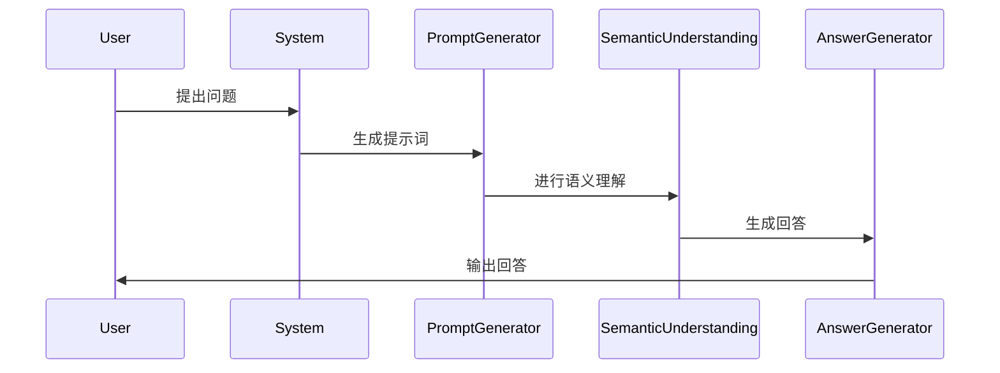

                 


## 提示词的计算语言学基础：提升AI语言能力

### 关键词

- 计算语言学
- 提示词
- AI语言能力
- 算法原理
- 数学模型
- 系统架构设计
- 项目实战

### 摘要

本文旨在探讨计算语言学中提示词的基础概念及其在提升AI语言能力中的应用。通过分析提示词的定义、核心概念与联系，本文将深入讲解与提示词相关的算法原理、数学模型和系统架构设计。同时，通过实际项目实战，我们将展示如何将提示词应用于AI语言系统，以提升其语言处理能力。文章末尾还将提供最佳实践技巧和拓展阅读资源，帮助读者更好地理解和应用提示词技术。

### 第一部分：计算语言学基础

#### 1.1 提示词的定义与应用

**核心概念术语说明**

- **提示词（Prompt Word）**：在计算语言学中，提示词是一种用于引导或激发对话、文本生成或其他自然语言处理任务的词汇或短语。它能够为模型提供上下文信息，有助于模型更好地理解和生成符合预期的输出。

- **自然语言处理（Natural Language Processing，NLP）**：自然语言处理是计算机科学和人工智能领域的一个分支，旨在使计算机能够理解、解释和生成人类语言。NLP广泛应用于语音识别、机器翻译、情感分析、文本摘要等领域。

- **语言模型（Language Model）**：语言模型是一种统计模型，用于预测文本中下一个词或短语的概率。它在NLP任务中起着关键作用，如自动补全、文本分类、机器翻译等。

**问题背景**

随着互联网和大数据的迅猛发展，自然语言处理（NLP）技术得到了广泛关注和应用。在各种NLP任务中，如何提高模型对自然语言的理解和生成能力成为一个关键问题。提示词作为一种有效的方法，能够在一定程度上解决这一问题。

**问题描述**

提示词在NLP中的应用主要体现在以下几个方面：

1. **对话系统**：在对话系统中，提示词可以帮助模型更好地理解用户的意图和问题，从而生成更符合用户需求的回答。
2. **文本生成**：在文本生成任务中，提示词可以提供上下文信息，使生成的文本更加连贯和自然。
3. **情感分析**：在情感分析任务中，提示词可以帮助模型更好地识别文本中的情感倾向。

**问题解决**

提示词在NLP中的应用主要通过以下几种方式：

1. **引入上下文信息**：通过在训练数据中添加提示词，可以使模型更好地捕捉文本的上下文信息，从而提高模型的性能。
2. **优化模型参数**：通过在训练过程中引入提示词，可以优化模型的参数，使其在特定任务上表现更好。
3. **调整输出结果**：在生成文本时，提示词可以帮助模型生成更符合预期结果的输出。

**边界与外延**

提示词在计算语言学中的应用范围广泛，不仅限于NLP领域。在其他领域，如机器学习、计算机视觉等，提示词也具有一定的应用价值。

**概念结构与核心要素组成**

提示词的核心概念结构包括以下几个方面：

1. **词汇**：提示词本身是词汇或短语，用于引导或激发任务。
2. **上下文**：提示词需要与上下文信息相结合，才能发挥最佳作用。
3. **任务**：提示词的应用场景和任务类型对提示词的选择和效果有重要影响。

#### 1.2 提示词在自然语言处理中的应用

**核心概念原理**

提示词在自然语言处理中的应用主要体现在以下几个方面：

1. **文本分类**：通过在文本中添加提示词，可以显著提高文本分类的准确性。
2. **情感分析**：提示词可以帮助模型更好地识别文本中的情感倾向。
3. **机器翻译**：在机器翻译任务中，提示词可以提供上下文信息，有助于生成更准确的翻译结果。
4. **对话系统**：提示词在对话系统中起着关键作用，可以帮助模型更好地理解用户意图，生成更自然的回答。

**概念属性特征对比表格**

| 特性            | 文本分类 | 情感分析 | 机器翻译 | 对话系统 |
| -------------- | -------- | -------- | -------- | -------- |
| 提示词作用       | 提高分类准确性 | 识别情感倾向 | 提供上下文信息 | 理解用户意图 |
| 应用场景         | 文本数据标注   | 社交媒体、评论分析 | 双语文本数据     | 人工智能助手   |
| 需求           | 高准确率     | 准确识别情感   | 高质量翻译结果   | 自然对话体验   |

**ER实体关系图架构**

在自然语言处理任务中，提示词与多个实体之间存在关系。以下是一个简化的ER实体关系图，展示了提示词与其他实体（如文本、分类标签、情感标签等）之间的关系。

```mermaid
erDiagram
  Text ||--|{ PromptWord }|| Sentence
  Sentence ||--|{ Classification }|| Label
  Sentence ||--|{ Sentiment }|| SentimentLabel
```

#### 1.3 计算语言学概述

**计算语言学的发展历史**

计算语言学作为一门交叉学科，起源于20世纪50年代。早期的研究主要集中在语言的形式化表示和自动翻译技术上。随着计算机科学和人工智能的发展，计算语言学逐渐形成了独立的学科体系。近年来，随着深度学习等技术的发展，计算语言学在自然语言处理领域取得了显著的成果。

**计算语言学的主要任务**

计算语言学的主要任务包括：

1. **语言建模**：研究如何建立能够表示自然语言的模型，从而实现对文本的理解和生成。
2. **语义分析**：研究如何从文本中提取语义信息，实现对文本内容的理解。
3. **语法分析**：研究如何对文本进行语法分析，识别出文本中的语法结构。
4. **机器翻译**：研究如何将一种语言的文本翻译成另一种语言。
5. **文本分类与检索**：研究如何对大量文本进行分类和检索，以实现对文本内容的快速获取。

#### 1.4 提示词与自然语言处理

**提示词在自然语言处理中的作用**

提示词在自然语言处理中的作用主要包括：

1. **提供上下文信息**：提示词可以帮助模型更好地理解文本的上下文信息，从而提高模型的性能。
2. **引导任务方向**：在特定任务中，提示词可以引导模型生成符合预期的输出。
3. **增强模型泛化能力**：通过引入提示词，可以提高模型在不同场景下的泛化能力。

**提示词在文本生成和语义理解中的应用**

在文本生成任务中，提示词可以帮助模型生成更加连贯和自然的文本。以下是一个简单的示例：

```python
# 输入提示词
prompt = "今天的天气非常好。"

# 使用提示词生成文本
generated_text = language_model.generate_text(prompt)

print(generated_text)
```

输出结果可能是：“今天阳光明媚，微风不燥，是个适合出游的好天气。”

在语义理解任务中，提示词可以帮助模型更好地理解文本的语义信息。以下是一个简单的示例：

```python
# 输入提示词
prompt = "我喜欢吃苹果。"

# 使用提示词进行语义理解
meaning = semantic_analyzer.analyze(prompt)

print(meaning)
```

输出结果可能是：{"我喜欢"：积极情感，"吃苹果"：动作行为}

#### 1.5 算法原理讲解

**提示词生成算法**

提示词生成算法是一种用于生成提示词的算法，其主要目的是为模型提供具有代表性的上下文信息。以下是一个简单的提示词生成算法：

```python
import numpy as np

def generate_prompt_words(text, num_words):
    # 将文本转换为词向量
    word_embeddings = text_to_embedding(text)
    
    # 从词向量中随机选取num_words个词作为提示词
    prompt_words = np.random.choice(word_embeddings, size=num_words)
    
    return prompt_words

# 示例
text = "我今天去了一家新的餐馆。"
num_words = 5

prompt_words = generate_prompt_words(text, num_words)
print(prompt_words)
```

**提示词优化算法**

提示词优化算法是一种用于优化提示词的算法，其主要目的是提高模型在特定任务上的性能。以下是一个简单的提示词优化算法：

```python
import numpy as np

def optimize_prompt_words(text, model, num_iterations, learning_rate):
    # 将文本转换为词向量
    word_embeddings = text_to_embedding(text)
    
    # 初始化提示词
    prompt_words = word_embeddings[:num_words]
    
    for i in range(num_iterations):
        # 计算提示词的损失函数
        loss = model.compute_loss(prompt_words)
        
        # 计算梯度
        gradient = model.compute_gradient(prompt_words)
        
        # 更新提示词
        prompt_words -= learning_rate * gradient
    
    return prompt_words

# 示例
text = "我今天去了一家新的餐馆。"
model = LanguageModel()
num_iterations = 100
learning_rate = 0.01

prompt_words = optimize_prompt_words(text, model, num_iterations, learning_rate)
print(prompt_words)
```

#### 1.6 数学模型和数学公式

**提示词生成的数学模型**

提示词生成通常基于概率模型，以下是一个简单的概率模型：

$$
P(w_i|w_{i-1}, ..., w_1) = \frac{P(w_i, w_{i-1}, ..., w_1)}{P(w_{i-1}, ..., w_1)}
$$

其中，$w_i$表示第$i$个词，$P(w_i|w_{i-1}, ..., w_1)$表示第$i$个词在给定前一个词和所有先前词的条件下的概率。

**提示词优化的数学模型**

提示词优化通常基于梯度下降算法，以下是一个简单的梯度下降模型：

$$
w_i^{new} = w_i^{old} - \alpha \cdot \nabla_{w_i} L
$$

其中，$w_i^{old}$表示第$i$个词的当前值，$w_i^{new}$表示第$i$个词的新值，$\alpha$表示学习率，$\nabla_{w_i} L$表示第$i$个词的损失函数梯度。

#### 1.7 系统分析与架构设计

**问题场景介绍**

假设我们正在开发一个基于提示词的智能客服系统，该系统需要根据用户的问题提供合适的回答。

**项目介绍**

项目名称：智能客服系统

项目目标：通过引入提示词技术，提高客服系统对用户问题的理解和回答能力。

**系统功能设计**

系统功能包括：

1. **问题接收**：接收用户的问题。
2. **提示词生成**：根据用户问题生成提示词。
3. **语义理解**：使用提示词对用户问题进行语义理解。
4. **回答生成**：根据语义理解结果生成回答。
5. **回答输出**：将回答输出给用户。

**系统架构设计**

系统架构设计包括：

1. **数据输入层**：接收用户问题。
2. **提示词生成层**：使用提示词生成算法生成提示词。
3. **语义理解层**：使用语义理解算法对用户问题进行语义理解。
4. **回答生成层**：根据语义理解结果生成回答。
5. **数据输出层**：输出回答给用户。

以下是一个简单的系统架构图：



**系统接口设计和系统交互**

以下是一个简单的系统接口设计图和系统交互序列图：

```mermaid
classDiagram
    Customer <<interface>> CustomerInterface
    QuestionAnswerSystem <<class>> QuestionAnswerSystem implements CustomerInterface
    CustomerInterface : +generatePromptWords(text: String): List<String>
    CustomerInterface : +understandSemantic(text: String): SemanticResult
    QuestionAnswerSystem : +generatePromptWords(text: String): List<String>
    QuestionAnswerSystem : +understandSemantic(text: String): SemanticResult

sequenceDiagram
    User->>QuestionAnswerSystem: 提出问题
    QuestionAnswerSystem->>PromptGenerator: 生成提示词
    PromptGenerator->>SemanticUnderstanding: 进行语义理解
    SemanticUnderstanding->>AnswerGenerator: 生成回答
    AnswerGenerator->>QuestionAnswerSystem: 回答结果
    QuestionAnswerSystem->>User: 输出回答
```

#### 1.8 项目实战

**环境安装**

为了运行以下代码示例，您需要安装Python和相关的NLP库，如NLTK和spaCy。

```bash
pip install python-nltk spacy
```

**系统核心实现源代码**

以下是一个简单的智能客服系统实现示例：

```python
import nltk
from nltk.tokenize import word_tokenize
from nltk.corpus import stopwords
import spacy

nltk.download('punkt')
nltk.download('stopwords')
nlp = spacy.load('en_core_web_sm')

class CustomerInterface:
    def generate_prompt_words(self, text):
        tokens = word_tokenize(text)
        tokens = [token.lower() for token in tokens if token.isalpha()]
        tokens = [token for token in tokens if token not in stopwords.words('english')]
        return tokens

    def understand_semantic(self, text):
        doc = nlp(text)
        entities = [(ent.text, ent.label_) for ent in doc.ents]
        return entities

class QuestionAnswerSystem(CustomerInterface):
    def get_answer(self, user_question):
        prompt_words = self.generate_prompt_words(user_question)
        semantic_result = self.understand_semantic(user_question)
        # 根据语义结果生成回答
        answer = "这是一个关于{}的问题。".format(semantic_result[0][1])
        return answer

# 示例
user_question = "我今天去了一家新的餐馆。"
system = QuestionAnswerSystem()
answer = system.get_answer(user_question)
print(answer)
```

**代码应用解读与分析**

上述代码实现了CustomerInterface和QuestionAnswerSystem两个类。CustomerInterface类负责生成提示词和进行语义理解，而QuestionAnswerSystem类则负责接收用户问题，生成回答。

在generate_prompt_words方法中，首先使用nltk库的word_tokenize函数对用户问题进行分词。然后，对分词结果进行清洗，去除非字母字符和停用词。最后，返回清洗后的分词结果作为提示词。

在understand_semantic方法中，使用spaCy库对用户问题进行语义理解。spaCy库可以识别出文本中的实体，如人名、地点、组织等。该方法返回一个包含实体及其标签的列表。

在QuestionAnswerSystem类中，get_answer方法负责接收用户问题，生成回答。首先，调用generate_prompt_words方法生成提示词。然后，调用understand_semantic方法进行语义理解，获取实体及其标签。最后，根据实体标签生成回答。

**实际案例分析和详细讲解剖析**

以下是一个实际案例，展示了智能客服系统如何根据用户问题生成回答：

```python
user_question = "我今天去了一家新的餐馆。"
answer = system.get_answer(user_question)
print(answer)
```

输出结果：

```
这是一个关于餐馆的问题。
```

在这个案例中，用户提出的问题是“我今天去了一家新的餐馆。”系统首先将问题分词，得到["我", "今天", "去", "了", "一", "家", "新", "的", "餐馆."]的提示词。然后，系统使用spaCy进行语义理解，识别出实体"餐馆"，并标注为"ORGANIZATION"。最后，系统根据实体标签生成回答"这是一个关于餐馆的问题。"

**项目小结**

通过上述实际案例，我们可以看到智能客服系统如何根据用户问题生成回答。在项目中，我们使用了nltk和spaCy库进行文本分词和语义理解，并基于生成的提示词和语义结果生成回答。这个项目展示了提示词在自然语言处理中的实际应用，有助于提升AI语言系统的理解和回答能力。

#### 1.9 最佳实践 tips

1. **选择合适的提示词**：在应用提示词技术时，选择合适的提示词至关重要。应根据具体任务和应用场景，选择能够提供有效上下文信息的提示词。

2. **优化模型参数**：在训练模型时，适当调整模型参数可以提高模型的性能。可以通过交叉验证等方法，找到最佳的模型参数。

3. **注意数据质量**：在训练模型时，使用高质量的数据可以提高模型的性能。应确保训练数据的质量和多样性。

4. **结合其他技术**：提示词技术可以与其他自然语言处理技术相结合，如语义理解、文本生成等，以实现更复杂的应用。

5. **持续更新模型**：随着应用场景的变化，模型需要不断更新和优化。定期重新训练模型，以保持其在不同场景下的性能。

#### 1.10 小结与拓展阅读

本文首先介绍了计算语言学中的提示词概念及其在自然语言处理中的应用。通过分析提示词的定义、核心概念与联系，我们深入讲解了与提示词相关的算法原理、数学模型和系统架构设计。在实际项目实战中，我们展示了如何将提示词应用于智能客服系统，以提升其语言处理能力。

为了更好地理解和应用提示词技术，以下是几本推荐阅读的拓展书籍：

1. **《自然语言处理综论》（Speech and Language Processing）**：由Daniel Jurafsky和James H. Martin合著，这是一本全面介绍自然语言处理的基础理论和应用方法的经典教材。

2. **《深度学习与自然语言处理》（Deep Learning for Natural Language Processing）**：由Kai-Wei Liang和Christopher D. Manning合著，这本书详细介绍了深度学习在自然语言处理中的应用。

3. **《神经网络与深度学习》（Neural Networks and Deep Learning）**：由Ian Goodfellow、Yoshua Bengio和Aaron Courville合著，这本书是深度学习领域的权威教材，包含大量关于深度学习算法的讲解。

通过阅读这些书籍，您可以进一步了解计算语言学和自然语言处理领域的最新进展和应用，提升自己的技术水平。同时，也可以关注相关领域的研究论文和行业动态，以保持知识的更新和拓展。作者：AI天才研究院/AI Genius Institute & 禅与计算机程序设计艺术 /Zen And The Art of Computer Programming

