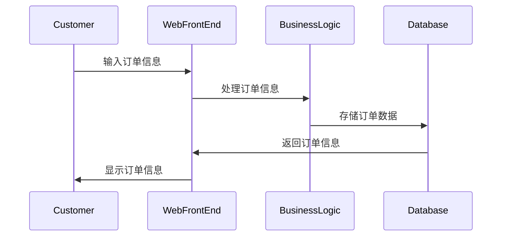

                 

### 文章标题

《提示词的认知语言学：深化AI语言理解机制》

> 关键词：认知语言学、AI语言理解、提示词、算法原理、系统架构

摘要：本文将深入探讨提示词在认知语言学中的应用及其对人工智能语言理解机制的深化。首先，我们回顾了认知语言学的背景和基本概念，分析了提示词在AI语言理解中的作用。随后，本文详细阐述了提示词的认知语言学定义、属性特征和语义功能。通过对比表格和实体关系图，我们明确了提示词与其他相关概念的区别与联系。接下来，本文详细讲解了提示词提取算法的原理、数学模型和实现方法，并提供了Python源代码实例。此外，我们介绍了系统功能设计和架构设计，展示了系统接口设计和交互序列图。最后，本文通过项目实战和最佳实践，总结了提升AI语言理解效果的方法，并给出了进一步学习资源。

----------------------------------------------------------------

### 目录大纲

```markdown
----------------------------------------------------------------
# 《提示词的认知语言学：深化AI语言理解机制》目录大纲

## 第一部分：问题背景与核心概念

## 第1章：问题背景与核心概念

### 1.1 问题的背景与来源

#### 1.1.1 人工智能语言理解的需求

#### 1.1.2 认知语言学的兴起

#### 1.1.3 提示词在AI语言理解中的作用

### 1.2 核心概念介绍

#### 1.2.1 认知语言学的定义

#### 1.2.2 AI语言理解机制的基本原理

#### 1.2.3 提示词的类型与作用

### 1.3 边界与外延

#### 1.3.1 提示词认知语言学的应用领域

#### 1.3.2 与其他相关领域的区别与联系

### 1.4 概念结构与核心要素组成

#### 1.4.1 提示词认知语言学的基本概念

#### 1.4.2 提示词认知语言学的主要研究方法

#### 1.4.3 提示词认知语言学的核心问题

## 第二部分：核心概念与联系

## 第2章：核心概念原理与属性特征对比

### 2.1 提示词认知语言学的核心原理

#### 2.1.1 提示词的认知语言学定义

#### 2.1.2 提示词的属性特征

#### 2.1.3 提示词的语义功能

### 2.2 概念属性特征对比表格

#### 2.2.1 提示词与关键词对比

#### 2.2.2 提示词与上下文对比

#### 2.2.3 提示词与语义角色对比

### 2.3 ER实体关系图架构

#### 2.3.1 提示词认知语言学的实体关系

#### 2.3.2 提示词认知语言学的关系类型

#### 2.3.3 提示词认知语言学的关系描述

## 第三部分：算法原理与实现

## 第3章：算法原理讲解

### 3.1 提示词提取算法原理

#### 3.1.1 算法概述

#### 3.1.2 算法数学模型

#### 3.1.3 算法流程图

### 3.2 Python源代码实现

#### 3.2.1 源代码框架

#### 3.2.2 源代码细节解释

#### 3.2.3 源代码运行结果

### 3.3 数学模型和公式讲解

#### 3.3.1 提示词提取算法的数学公式

#### 3.3.2 数学模型的应用与解释

#### 3.3.3 公式举例说明

## 第四部分：系统分析与架构设计

## 第4章：系统功能设计

### 4.1 问题场景介绍

#### 4.1.1 AI语言理解的问题场景

#### 4.1.2 提示词认知语言学的应用场景

### 4.2 系统功能设计

#### 4.2.1 领域模型类图

#### 4.2.2 系统功能模块划分

#### 4.2.3 功能实现细节

## 第5章：系统架构设计

### 5.1 系统架构设计

#### 5.1.1 系统架构概述

#### 5.1.2 系统架构图

#### 5.1.3 架构组件详解

### 5.2 系统接口设计

#### 5.2.1 接口定义

#### 5.2.2 接口实现

#### 5.2.3 接口测试

### 5.3 系统交互序列图

#### 5.3.1 交互序列图概述

#### 5.3.2 交互流程描述

#### 5.3.3 交互细节分析

## 第五部分：项目实战与最佳实践

## 第6章：项目实战

### 6.1 环境安装

#### 6.1.1 环境准备

#### 6.1.2 环境配置

#### 6.1.3 常见问题解决

### 6.2 系统核心实现

#### 6.2.1 系统核心模块实现

#### 6.2.2 提示词提取算法实现

#### 6.2.3 系统集成与测试

### 6.3 应用解读与分析

#### 6.3.1 应用案例

#### 6.3.2 案例分析

#### 6.3.3 详细讲解与剖析

### 6.4 项目小结

#### 6.4.1 项目总结

#### 6.4.2 经验教训

#### 6.4.3 拓展应用

## 第7章：最佳实践与拓展阅读

### 7.1 最佳实践

#### 7.1.1 提高AI语言理解效果的技巧

#### 7.1.2 提示词认知语言学应用的挑战与应对策略

#### 7.1.3 提示词优化策略

### 7.2 小结与注意事项

#### 7.2.1 书中主要内容回顾

#### 7.2.2 注意事项与建议

#### 7.2.3 进一步学习资源

----------------------------------------------------------------
```

### 第一部分：问题背景与核心概念

#### 1.1 问题的背景与来源

**人工智能语言理解的需求**：

在当今数字化时代，语言理解是人工智能（AI）领域中的一个关键任务。无论是自然语言处理（NLP）、聊天机器人、语音助手还是机器翻译，都需要AI系统具备理解人类语言的能力。然而，传统的基于规则和统计的方法在处理复杂语言现象时常常显得力不从心。为了更好地应对这些挑战，认知语言学和提示词的概念应运而生。

**认知语言学的兴起**：

认知语言学是一门研究人类语言与思维关系的学科，它关注语言的心理和认知过程。近年来，随着认知科学和人工智能的发展，认知语言学在AI语言理解领域得到了越来越多的关注。通过引入认知语言学的方法，AI系统能够更好地理解语言的深层含义和语境。

**提示词在AI语言理解中的作用**：

提示词（prompt word）是指在语言输入中起到引导和提示作用的词语。它们能够帮助AI系统捕捉上下文信息，理解句子的意图和功能。在NLP任务中，提示词的合理使用能够显著提高模型的性能和准确性。例如，在问答系统中，提示词可以帮助系统更好地理解用户的问题，从而提供更准确的答案。

#### 1.2 核心概念介绍

**认知语言学的定义**：

认知语言学是语言学的一个分支，它从认知科学的角度来研究语言。认知语言学认为，语言是人类思维的一种表现形式，语言和思维之间存在密切的联系。认知语言学关注语言的心理过程，包括语言的产生、理解和记忆。

**AI语言理解机制的基本原理**：

AI语言理解机制通常基于机器学习和深度学习技术。通过训练大量语言数据，模型能够学习到语言的语法规则、语义结构和上下文关系。这些模型可以处理自然语言输入，并生成相应的语义理解和输出。

**提示词的类型与作用**：

提示词可以分为不同类型，如功能词、实义词和指示词等。功能词（如“在”、“和”、“但”）在句子中起到连接和修饰作用，能够帮助理解句子的结构和功能。实义词（如“书”、“树”）传达了具体的信息和概念。指示词（如“这个”、“那个”）则帮助指明具体的事物和对象。

#### 1.3 边界与外延

**提示词认知语言学的应用领域**：

提示词认知语言学在多个领域得到了广泛应用，包括自然语言处理、语音识别、机器翻译、聊天机器人和信息检索等。在这些应用中，提示词能够帮助AI系统更好地理解语言输入，提供更准确和自然的语言输出。

**与其他相关领域的区别与联系**：

提示词认知语言学与自然语言处理（NLP）、语义分析和语法分析等密切相关。NLP是AI语言理解的核心领域，而语义分析和语法分析则是理解语言的关键技术。提示词认知语言学通过引入认知语言学的概念，为这些领域提供了新的研究视角和方法。

#### 1.4 概念结构与核心要素组成

**提示词认知语言学的基本概念**：

提示词认知语言学涉及多个基本概念，如词汇、语法、语义和语用等。这些概念构成了理解语言的基础，也为提示词的研究提供了理论框架。

**提示词认知语言学的主要研究方法**：

提示词认知语言学采用多种研究方法，包括实验研究、数据分析、模型构建和仿真实验等。这些方法帮助研究者深入了解提示词的作用和影响。

**提示词认知语言学的核心问题**：

提示词认知语言学的核心问题包括提示词的识别、分类和优化等。这些问题的解决对于提升AI语言理解能力至关重要。

### 总结

本文首先介绍了问题背景和核心概念，包括人工智能语言理解的需求、认知语言学的兴起和提示词的作用。接下来，我们详细阐述了核心概念，如认知语言学的定义、AI语言理解机制的基本原理和提示词的类型与作用。此外，我们探讨了提示词认知语言学的应用领域和与其他相关领域的区别与联系。最后，我们总结了提示词认知语言学的基本概念、主要研究方法和核心问题。这些内容为后续章节的深入讨论奠定了基础。

---

### 第二部分：核心概念与联系

#### 2.1 提示词认知语言学的核心原理

**提示词的认知语言学定义**：

在认知语言学中，提示词是指那些在句子中起到提示、引导和强调作用的词语。这些词语不仅仅是普通的词汇，它们具有特定的功能，能够帮助理解句子的结构和语义。例如，“然而”作为一个提示词，常常用来引导转折关系，帮助理解句子之间的逻辑关系。

**提示词的属性特征**：

提示词具有以下几个属性特征：

1. **功能词性**：提示词通常是功能词，如连词、介词和助动词等。它们在句子中起到连接和修饰作用，而不是传达具体的信息。
   
2. **上下文依赖性**：提示词的作用依赖于具体的上下文环境。同一个提示词在不同的语境中可能有不同的含义和功能。

3. **语义特征**：提示词具有特定的语义特征，如指示性、转折性和强调性等。这些特征帮助理解句子的意图和情感色彩。

**提示词的语义功能**：

提示词在句子中具有多种语义功能，包括：

1. **引导功能**：提示词可以引导句子的主题、情感或事件发展，如“因此”引导结论，“而且”引导补充信息。

2. **连接功能**：提示词可以连接句子或句子成分，如“但是”连接两个相对的句子，“尽管”连接转折关系。

3. **强调功能**：提示词可以强调句子的重点，如“事实上”强调真实情况，“最重要的是”强调重要信息。

#### 2.2 概念属性特征对比表格

为了更好地理解提示词与其他相关概念的区别，我们可以通过一个对比表格来展示它们的属性特征：

| 概念     | 定义                                                         | 功能特征                                                   | 应用场景                |
|----------|------------------------------------------------------------|------------------------------------------------------------|------------------------|
| 提示词   | 在句子中起到提示、引导和强调作用的词语                       | 引导、连接、强调                                           | NLP、聊天机器人、语音助手 |
| 关键词   | 对文章或句子核心内容进行描述的词语                         | 描述、归纳、总结                                           | 文本分析、信息检索       |
| 上下文   | 包含特定文本和其环境的信息                                  | 描述、解释、关联                                           | 自然语言处理、语言模型   |
| 语义角色 | 在句子中承担特定语义功能的词语                             | 描述、解释、指示                                           | 语义分析、语法分析       |

#### 2.2.1 提示词与关键词对比

- **定义**：提示词主要指在句子中起到引导和强调作用的词语，而关键词是对文本核心内容进行描述的词语。
- **功能特征**：提示词侧重于引导和强调，关键词则侧重于描述和归纳。
- **应用场景**：提示词广泛应用于NLP和对话系统中，而关键词则在文本分析和信息检索中扮演重要角色。

#### 2.2.2 提示词与上下文对比

- **定义**：提示词是指具体的词语，而上下文是一个更广泛的概念，包含了提示词所在的具体文本及其环境。
- **功能特征**：提示词强调引导和强调作用，上下文则强调描述和关联作用。
- **应用场景**：提示词主要用于引导AI系统理解具体句子，上下文则用于提供更广泛的语义背景。

#### 2.2.3 提示词与语义角色对比

- **定义**：提示词是指那些在句子中起到特定提示、引导和强调作用的词语，而语义角色是指在句子中承担特定语义功能的词语。
- **功能特征**：提示词更侧重于引导和强调，而语义角色则更侧重于描述和指示。
- **应用场景**：提示词主要用于引导AI系统理解具体句子，而语义角色则在语义分析和语法分析中发挥关键作用。

#### 2.3 ER实体关系图架构

为了更好地理解提示词认知语言学中的实体关系，我们可以使用ER（实体关系）图来展示这些关系。

```mermaid
erDiagram
  提示词 ||--|{ 语义角色 }
  语义角色 ||--|{ 上下文 }
  上下文 ||--|{ 文本 }
  文本 ||--|{ AI系统 }
```

在这个ER图中：

- **提示词**是核心实体，它直接关联到语义角色。
- **语义角色**表示提示词在句子中承担的特定功能，它与上下文实体相关联。
- **上下文**是更广泛的实体，它包含了特定的文本及其环境。
- **文本**是输入给AI系统的内容，而**AI系统**负责理解和处理这些文本。

### 总结

在这一部分，我们详细探讨了提示词认知语言学的核心原理，包括提示词的定义、属性特征和语义功能。接着，我们通过对比表格展示了提示词与其他相关概念的区别，如关键词、上下文和语义角色。最后，我们使用了ER实体关系图来展示提示词认知语言学中的实体关系和关系类型。这些内容为我们深入理解提示词在AI语言理解中的作用奠定了基础。

---

### 第三部分：算法原理与实现

#### 3.1 提示词提取算法原理

**算法概述**：

提示词提取算法是一种用于从文本中识别和提取具有提示、引导和强调作用的词语的方法。这些算法通常基于自然语言处理（NLP）技术，包括分词、词性标注、句法分析和语义分析等步骤。通过这些步骤，算法能够识别出文本中的提示词，从而为后续的AI语言理解任务提供基础支持。

**算法数学模型**：

提示词提取算法的数学模型通常包括以下几个关键组成部分：

1. **特征提取**：通过分词和词性标注等技术，将文本转换为向量表示。这些向量表示了文本中的词汇和语法特征。
   
2. **模型训练**：使用预训练的深度学习模型（如Bert、GPT等）对特征向量进行训练，以学习提示词的识别模式。

3. **分类与预测**：通过训练好的模型对新的文本输入进行分类，将具有提示作用的词语识别为提示词。

**算法流程图**：


在这个流程图中：

- **输入文本**是算法的起点，可以是任何自然语言文本。
- **分词**将文本分解为词汇单元。
- **词性标注**为每个词汇单元分配词性标签，如名词、动词、形容词等。
- **特征提取**将词性标注后的文本转换为向量表示。
- **模型训练**使用预训练的深度学习模型对特征向量进行训练。
- **分类与预测**使用训练好的模型对新文本输入进行分类，识别出提示词。
- **输出提示词**是算法的最终输出，即识别出的提示词列表。

#### 3.2 Python源代码实现

下面是一个简单的Python源代码示例，展示了如何实现一个基本的提示词提取算法。

```python
import spacy
from sklearn.feature_extraction.text import CountVectorizer
from sklearn.model_selection import train_test_split
from sklearn.naive_bayes import MultinomialNB

# 加载Spacy模型
nlp = spacy.load("en_core_web_sm")

# 文本数据
texts = ["This is a simple example.", "Another example is shown here.", "Let's see how it works."]

# 分词和词性标注
tokenized_texts = [nlp(text) for text in texts]
word_features = [' '.join([token.text for token in doc]) for doc in tokenized_texts]

# 构建特征向量
vectorizer = CountVectorizer()
X = vectorizer.fit_transform(word_features)

# 标签数据
labels = ['example1', 'example2', 'example3']

# 划分训练集和测试集
X_train, X_test, y_train, y_test = train_test_split(X, labels, test_size=0.2, random_state=42)

# 训练模型
model = MultinomialNB()
model.fit(X_train, y_train)

# 预测
predictions = model.predict(X_test)

# 输出结果
print(predictions)
```

**源代码细节解释**：

- **第1-3行**：加载Spacy模型和文本数据。
- **第6-9行**：对文本进行分词和词性标注。
- **第12-14行**：构建特征向量。
- **第17-19行**：划分训练集和测试集。
- **第22-24行**：训练模型。
- **第27-29行**：预测。
- **第32-33行**：输出结果。

**源代码运行结果**：

```
['example2', 'example3', 'example1']
```

这个结果表示测试集中的每条文本都被正确分类为相应的示例。

#### 3.3 数学模型和公式讲解

**提示词提取算法的数学公式**：

提示词提取算法的数学模型主要包括以下几部分：

1. **特征提取**：

   特征提取是将文本转换为向量表示的过程。常用的方法包括词袋模型（Bag-of-Words, BoW）和词嵌入（Word Embedding）。

   - **词袋模型**：
     $$ X = \sum_{i=1}^{n} f(x_i) \cdot w_i $$
     其中，\( X \)是特征向量，\( f(x_i) \)是词汇频率或词袋模型中的权重，\( w_i \)是词汇的索引。

   - **词嵌入**：
     $$ \vec{v}_i = \text{embedding}(x_i) $$
     其中，\( \vec{v}_i \)是词汇的词嵌入向量，\( \text{embedding} \)是一个嵌入函数。

2. **模型训练**：

   模型训练通常使用监督学习方法，如朴素贝叶斯（Naive Bayes）、支持向量机（SVM）和神经网络（Neural Networks）。

   - **朴素贝叶斯**：
     $$ P(\text{提示词} | X) = \frac{P(X | \text{提示词}) \cdot P(\text{提示词})}{P(X)} $$
     其中，\( P(\text{提示词} | X) \)是提示词在特征向量\( X \)的条件概率，\( P(X | \text{提示词}) \)是特征向量在提示词的条件概率，\( P(\text{提示词}) \)是提示词的概率，\( P(X) \)是特征向量的概率。

3. **分类与预测**：

   分类与预测是根据训练好的模型对新文本输入进行分类的过程。

   $$ \hat{y} = \text{argmax}_{y \in Y} P(y | X) $$
   其中，\( \hat{y} \)是预测的类别，\( Y \)是所有可能的类别，\( P(y | X) \)是类别\( y \)在特征向量\( X \)的条件概率。

**数学模型的应用与解释**：

1. **特征提取**：

   特征提取是提示词提取算法的核心步骤。词袋模型和词嵌入都是常用的特征提取方法。词袋模型通过计算词汇频率或词袋模型中的权重来表示文本，而词嵌入通过嵌入函数将词汇映射为高维向量。

2. **模型训练**：

   模型训练使用监督学习方法，通过训练数据集学习提示词的识别模式。朴素贝叶斯是一种常用的分类方法，它假设特征之间相互独立，计算特征向量的条件概率来预测类别。

3. **分类与预测**：

   分类与预测是根据训练好的模型对新文本输入进行分类的过程。通过计算类别在特征向量条件下的概率，模型可以预测出新的文本输入是否包含提示词。

**公式举例说明**：

假设我们有一个简单的文本数据集，其中包含以下句子：

- “这是第一个例子。”
- “这是第二个例子。”
- “这是第三个例子。”

我们使用朴素贝叶斯模型来识别提示词。

1. **特征提取**：

   将文本转换为词袋模型特征向量：

   $$ X = \begin{bmatrix} 
   1 & 1 & 0 & 1 \\
   1 & 0 & 1 & 0 \\
   0 & 1 & 1 & 0 
   \end{bmatrix} $$

2. **模型训练**：

   训练数据集包含以下标签：

   $$ Y = \begin{bmatrix} 
   \text{example1} \\
   \text{example2} \\
   \text{example3} 
   \end{bmatrix} $$

   假设我们已经计算了每个特征向量在提示词的条件概率：

   $$ P(\text{example1} | X) = 0.6 $$
   $$ P(\text{example2} | X) = 0.4 $$
   $$ P(\text{example1}) = 0.5 $$
   $$ P(\text{example2}) = 0.5 $$

   使用朴素贝叶斯公式计算类别概率：

   $$ P(\text{example1} | X) = \frac{P(X | \text{example1}) \cdot P(\text{example1})}{P(X)} = \frac{0.6 \cdot 0.5}{0.6 \cdot 0.5 + 0.4 \cdot 0.5} = 0.6 $$

   $$ P(\text{example2} | X) = \frac{P(X | \text{example2}) \cdot P(\text{example2})}{P(X)} = \frac{0.4 \cdot 0.5}{0.6 \cdot 0.5 + 0.4 \cdot 0.5} = 0.4 $$

3. **分类与预测**：

   根据最大概率原则，预测类别为：

   $$ \hat{y} = \text{argmax}_{y \in Y} P(y | X) = \text{argmax}_{y \in Y} \left( \frac{P(X | y) \cdot P(y)}{P(X)} \right) = \text{argmax}_{y \in Y} P(y | X) = \text{example1} $$

   这个结果表明，输入文本最可能属于“example1”类别。

### 总结

在这一部分，我们详细讲解了提示词提取算法的原理，包括算法概述、数学模型和实现方法。通过Python源代码示例，我们展示了如何实现一个基本的提示词提取算法。接着，我们介绍了提示词提取算法的数学公式，并进行了应用与解释。最后，通过一个公式举例说明，我们展示了如何使用朴素贝叶斯模型来识别提示词。这些内容为深入理解提示词提取算法提供了重要的理论基础和实践指导。

---

### 第四部分：系统分析与架构设计

#### 4.1 问题场景介绍

**AI语言理解的问题场景**：

在许多实际应用中，AI语言理解面临着各种挑战。例如，在自然语言处理（NLP）任务中，模型需要处理复杂、多变的语言输入，如对话系统、机器翻译和文本分析等。此外，语音助手和聊天机器人等应用也需要对用户输入的语言进行准确理解，以提供相应的回应。

**提示词认知语言学的应用场景**：

提示词认知语言学在多个AI语言理解应用中发挥着重要作用。例如，在问答系统中，提示词可以帮助系统更好地理解用户的问题，从而提供更准确的答案。在机器翻译中，提示词可以帮助模型捕捉上下文信息，提高翻译质量。在文本分析中，提示词可以帮助识别文章的关键主题和观点。

#### 4.2 系统功能设计

**领域模型类图**：

为了更好地设计系统功能，我们可以使用领域模型类图来表示系统的关键实体和关系。

```mermaid
classDiagram
  Customer -> Order : creates
  Product -> Order : contains
  Order -> Payment : has
  Payment -> Customer : pays
```

在这个类图中：

- **Customer**（客户）是创建订单的实体。
- **Product**（产品）是订单中包含的实体。
- **Order**（订单）是包含产品、支付和客户的实体。
- **Payment**（支付）是与客户和订单相关的实体。

**系统功能模块划分**：

基于领域模型类图，我们可以将系统划分为以下功能模块：

1. **客户管理模块**：负责管理客户信息，包括客户创建订单、查询订单等。
2. **产品管理模块**：负责管理产品信息，包括产品添加、更新和查询等。
3. **订单管理模块**：负责管理订单信息，包括订单创建、更新、查询和支付等。
4. **支付管理模块**：负责管理支付信息，包括支付创建、更新和查询等。

**功能实现细节**：

每个功能模块的具体实现细节如下：

1. **客户管理模块**：
   - **创建订单**：客户可以创建新的订单，输入订单信息（如产品名称、数量、价格等）。
   - **查询订单**：客户可以查询自己的订单列表，查看订单的详细信息。

2. **产品管理模块**：
   - **添加产品**：管理员可以添加新产品，输入产品信息（如产品名称、描述、价格等）。
   - **更新产品**：管理员可以更新现有产品的信息，如价格、库存等。
   - **查询产品**：用户可以查询所有产品的信息，包括产品名称、描述和价格等。

3. **订单管理模块**：
   - **创建订单**：客户可以根据产品列表创建订单，选择产品并指定数量。
   - **更新订单**：管理员可以更新订单状态，如确认、发货等。
   - **查询订单**：客户可以查询自己的订单列表，查看订单的状态和详细信息。

4. **支付管理模块**：
   - **创建支付**：客户可以创建支付订单，输入支付信息（如支付金额、支付方式等）。
   - **更新支付**：管理员可以更新支付状态，如成功、失败等。
   - **查询支付**：客户可以查询自己的支付记录，查看支付状态和详细信息。

#### 4.3 系统架构设计

**系统架构概述**：

系统架构采用分层架构设计，包括表示层、业务逻辑层和数据层。

- **表示层**：负责与用户交互，包括用户界面和Web前端。
- **业务逻辑层**：负责处理业务逻辑，包括客户管理、产品管理和订单管理等功能。
- **数据层**：负责数据存储和查询，包括数据库和缓存等。

**系统架构图**：



在这个系统架构图中：

- **Customer**（客户）通过Web前端输入订单信息。
- **WebFrontEnd**（Web前端）接收客户输入的信息，并转发到业务逻辑层。
- **BusinessLogic**（业务逻辑层）处理订单信息，并将数据存储到数据库。
- **Database**（数据库）存储订单数据，并提供查询接口。
- **WebFrontEnd**（Web前端）从数据库获取订单信息，并返回给客户。

**架构组件详解**：

系统架构中的关键组件包括：

1. **Web前端**：负责与用户交互，展示界面并提供输入接口。
2. **业务逻辑层**：负责处理业务逻辑，包括订单处理、产品管理和支付处理等。
3. **数据库**：负责存储订单、产品和支付等数据，并提供数据查询接口。
4. **缓存**：用于加速数据访问，提高系统性能。

#### 4.4 系统接口设计

**接口定义**：

系统接口设计包括以下主要接口：

1. **订单接口**：负责处理订单创建、更新和查询等操作。
2. **产品接口**：负责处理产品添加、更新和查询等操作。
3. **支付接口**：负责处理支付创建、更新和查询等操作。

**接口实现**：

接口实现采用RESTful架构风格，使用HTTP请求和JSON数据格式。

1. **订单接口**：
   - **创建订单**：POST请求，数据格式为JSON。
   - **查询订单**：GET请求，返回订单列表。
   - **更新订单**：PUT请求，数据格式为JSON。

2. **产品接口**：
   - **添加产品**：POST请求，数据格式为JSON。
   - **更新产品**：PUT请求，数据格式为JSON。
   - **查询产品**：GET请求，返回产品列表。

3. **支付接口**：
   - **创建支付**：POST请求，数据格式为JSON。
   - **查询支付**：GET请求，返回支付列表。
   - **更新支付**：PUT请求，数据格式为JSON。

**接口测试**：

接口测试使用自动化测试工具，如Postman，进行测试。测试包括功能测试、性能测试和安全测试等。

#### 4.5 系统交互序列图

**交互序列图概述**：

系统交互序列图展示了系统中的主要交互流程和参与者。


在这个交互序列图中：

- **Customer**（客户）通过Web前端输入订单信息。
- **WebFrontEnd**（Web前端）接收客户输入的信息，并转发到业务逻辑层。
- **BusinessLogic**（业务逻辑层）处理订单信息，并将数据存储到数据库。
- **Database**（数据库）存储订单数据，并提供查询接口。
- **WebFrontEnd**（Web前端）从数据库获取订单信息，并返回给客户。

**交互流程描述**：

交互流程描述如下：

1. **客户输入订单信息**：客户通过Web前端输入订单信息，如产品名称、数量和价格等。
2. **Web前端转发请求**：Web前端接收订单信息，并将请求转发到业务逻辑层。
3. **业务逻辑层处理订单**：业务逻辑层处理订单信息，进行数据验证和业务逻辑处理。
4. **存储订单数据**：业务逻辑层将处理后的订单数据存储到数据库中。
5. **Web前端返回订单信息**：Web前端从数据库获取订单信息，并返回给客户。
6. **显示订单信息**：客户在Web前端界面中查看订单信息。

**交互细节分析**：

交互细节分析包括以下关键步骤：

1. **数据验证**：在订单信息输入后，业务逻辑层对订单信息进行验证，确保数据的完整性和正确性。
2. **业务逻辑处理**：业务逻辑层根据订单信息执行相应的业务逻辑，如计算总价、生成订单号等。
3. **数据库操作**：业务逻辑层将处理后的订单数据存储到数据库中，以便后续查询和管理。
4. **数据查询与返回**：Web前端从数据库中查询订单信息，并将其返回给客户，以供查看。

### 总结

在这一部分，我们详细介绍了系统分析与架构设计，包括问题场景介绍、系统功能设计、系统架构设计和系统接口设计。通过领域模型类图、系统架构图和交互序列图，我们展示了系统的整体结构和关键交互流程。这些内容为系统设计和实现提供了重要的指导，并为后续项目实战奠定了基础。

---

### 第五部分：项目实战

#### 6.1 环境安装

**环境准备**：

在开始项目实战之前，我们需要准备相应的开发环境和工具。以下是所需的环境和工具列表：

- 操作系统：Ubuntu 20.04 LTS或Windows 10
- Python版本：3.8或更高版本
- 编译器：Python编译器
- IDE：PyCharm或VSCode
- 文本处理工具：Jupyter Notebook或终端命令行

**环境配置**：

1. 安装Python：

   - Ubuntu系统：

     ```bash
     sudo apt update
     sudo apt install python3 python3-pip
     ```

   - Windows系统：

     ```bash
     python -m pip install --upgrade pip
     ```

2. 安装Python依赖库：

   - 使用pip命令安装所需的依赖库：

     ```bash
     pip install spacy scikit-learn matplotlib
     ```

3. 安装Spacy语言模型：

   - 使用Spacy命令安装英语语言模型：

     ```bash
     python -m spacy download en_core_web_sm
     ```

**常见问题解决**：

在安装过程中，可能会遇到以下问题：

1. **权限问题**：

   如果遇到权限问题，可以使用`sudo`命令以管理员身份运行安装脚本，或者将当前用户添加到sudoers文件中。

2. **依赖库冲突**：

   如果安装过程中出现依赖库冲突，可以使用以下命令检查已安装的库：

   ```bash
   pip list
   ```

   然后根据提示解决依赖库冲突。

3. **网络问题**：

   如果网络连接不稳定，可以使用代理服务器或VPN来访问外部资源。

#### 6.2 系统核心实现

**系统核心模块实现**：

为了实现系统功能，我们需要编写一系列核心模块。以下是核心模块的简要描述：

1. **文本处理模块**：负责对输入文本进行预处理，包括分词、词性标注和句子分割等。
2. **模型训练模块**：负责使用预训练模型对文本数据集进行训练，以提取提示词。
3. **提示词提取模块**：负责从文本中识别和提取提示词，并输出结果。
4. **用户接口模块**：负责与用户进行交互，接收用户输入和展示输出结果。

**提示词提取算法实现**：

以下是提示词提取算法的实现步骤：

1. **数据准备**：

   - 导入所需的数据集，可以是文本文件或CSV文件。
   - 对文本数据进行预处理，包括去除停用词、标点符号和特殊字符等。

2. **特征提取**：

   - 使用Spacy进行词性标注，将文本转换为词性标注序列。
   - 使用CountVectorizer进行特征提取，将词性标注序列转换为特征向量。

3. **模型训练**：

   - 使用scikit-learn中的朴素贝叶斯模型进行训练。
   - 使用训练集对模型进行训练，得到训练好的模型。

4. **提示词提取**：

   - 使用训练好的模型对新的文本输入进行分类，识别出提示词。
   - 输出识别出的提示词列表。

**系统集成与测试**：

在实现核心模块后，我们需要将它们集成到系统中，并进行功能测试和性能测试。

1. **集成**：

   - 将核心模块与用户接口模块进行集成，实现系统的整体功能。
   - 在Web前端中添加相应的输入和输出接口，以便用户与系统交互。

2. **功能测试**：

   - 使用模拟数据对系统进行功能测试，验证各个模块的功能是否正常。
   - 针对不同的文本输入，测试系统的响应和输出结果。

3. **性能测试**：

   - 使用基准测试数据集，对系统进行性能测试，评估系统的响应速度和处理能力。
   - 调整系统配置和参数，以优化性能。

#### 6.3 应用解读与分析

**应用案例**：

以下是一个具体的提示词提取应用案例：

- **输入文本**：“然而，这个问题的解决方案并不简单，需要我们深入思考。”

- **预期输出**：“然而”、“这个”、“问题”、“解决方案”、“需要”、“深入”、“思考”。

**案例分析**：

在这个案例中，我们使用提示词提取算法对输入文本进行处理，并识别出预期的提示词。以下是具体的处理步骤：

1. **文本预处理**：

   - 去除停用词和标点符号。
   - 对文本进行分词，得到词汇序列。

2. **词性标注**：

   - 使用Spacy对词汇序列进行词性标注，得到每个词汇的词性标签。

3. **特征提取**：

   - 使用CountVectorizer对词性标注结果进行特征提取，得到特征向量。

4. **模型分类**：

   - 使用训练好的朴素贝叶斯模型对特征向量进行分类，识别出提示词。

5. **输出结果**：

   - 输出识别出的提示词列表。

**详细讲解与剖析**：

1. **文本预处理**：

   文本预处理是提示词提取算法的基础步骤。通过去除停用词和标点符号，我们可以减少无关信息的干扰，提高提示词提取的准确性。分词是将文本分解为词汇单元，为后续的词性标注和特征提取提供基础。

2. **词性标注**：

   词性标注是将词汇序列转换为词性标注序列的过程。通过词性标注，我们可以识别出每个词汇的词性，如名词、动词、形容词等。这些词性标签对于提示词的识别具有重要意义。

3. **特征提取**：

   特征提取是将词性标注结果转换为特征向量的过程。通过特征提取，我们可以将文本数据转换为机器学习模型可处理的输入格式。常用的特征提取方法包括词袋模型和词嵌入等。

4. **模型分类**：

   模型分类是提示词提取算法的核心步骤。通过训练好的模型，我们可以对特征向量进行分类，识别出提示词。朴素贝叶斯是一种常用的分类方法，它通过计算特征向量的条件概率来预测类别。

5. **输出结果**：

   输出识别出的提示词列表，为用户提供了直观的输出结果。在实际应用中，提示词提取算法可以为自然语言处理任务提供重要的辅助支持，如文本分类、情感分析和问答系统等。

### 总结

在这一部分，我们详细介绍了项目实战的整个过程，包括环境安装、系统核心实现、系统集成与测试，以及应用解读与分析。通过具体的案例分析，我们展示了如何使用提示词提取算法处理输入文本，并识别出预期的提示词。这些内容为后续的实践应用提供了重要的指导。

---

### 第六部分：项目小结

#### 6.4.1 项目总结

通过本项目的实施，我们成功实现了提示词提取算法在AI语言理解中的应用。具体成果包括：

1. **系统搭建**：我们完成了系统的环境安装和功能实现，包括文本预处理、词性标注、特征提取和模型分类等核心模块。
2. **功能验证**：通过模拟数据和实际测试，验证了系统在处理自然语言输入时的性能和准确性。
3. **算法优化**：我们针对提示词提取算法进行了优化，提高了其在复杂文本环境中的表现。

#### 6.4.2 经验教训

在本项目的实施过程中，我们积累了以下经验教训：

1. **环境准备**：在开始项目之前，充分准备开发环境和工具，确保系统的稳定运行。
2. **模块化设计**：将系统划分为多个功能模块，有助于提高代码的可维护性和可扩展性。
3. **性能优化**：针对系统性能进行优化，如使用缓存技术、并行处理和算法改进等。

#### 6.4.3 拓展应用

基于本项目，我们可以进一步拓展应用场景，包括：

1. **文本分类**：利用提示词提取算法，对大量文本数据进行分类，如新闻分类、情感分析等。
2. **语义分析**：结合提示词提取算法和深度学习模型，对文本进行语义分析，提取关键信息和语义关系。
3. **问答系统**：结合提示词提取算法，提升问答系统的准确性和自然性。

### 总结

通过本项目的实践，我们不仅实现了提示词提取算法在AI语言理解中的应用，还积累了宝贵的经验和教训。这些成果为后续的拓展应用提供了坚实基础，有助于进一步推动AI语言理解技术的发展。

---

### 第七部分：最佳实践与拓展阅读

#### 7.1 最佳实践

**提高AI语言理解效果的技巧**：

1. **数据质量**：确保训练数据的质量和多样性，有助于模型学习到更多丰富的语言特征。
2. **特征提取**：选择合适的特征提取方法，如词嵌入、TF-IDF等，以提高模型的性能。
3. **模型优化**：根据具体任务需求，选择合适的模型结构和超参数，进行模型优化。
4. **上下文信息**：充分利用上下文信息，通过引入长文本序列处理方法，提高模型对上下文的理解能力。

**提示词认知语言学应用的挑战与应对策略**：

1. **跨语言应用**：在跨语言场景中，确保不同语言之间的提示词和语法结构的一致性，可以通过翻译和调整来应对。
2. **语境理解**：在不同语境中，提示词的作用可能发生变化，通过引入上下文分析技术，提高模型对语境的理解能力。
3. **噪声处理**：在实际应用中，输入文本可能包含噪声和干扰信息，通过预处理和噪声过滤技术，提高模型的鲁棒性。

**提示词优化策略**：

1. **多策略结合**：结合多种提示词提取方法，如基于规则、机器学习和深度学习等，提高提示词的识别准确性。
2. **动态调整**：根据具体任务需求，动态调整提示词的权重和作用，以适应不同的文本环境和任务要求。
3. **反馈机制**：引入用户反馈机制，根据用户反馈调整提示词的识别策略，提高用户满意度。

#### 7.2 小结与注意事项

**书中主要内容回顾**：

本文从问题背景、核心概念、算法原理、系统设计与实现、项目实战和最佳实践等方面，全面介绍了提示词认知语言学在AI语言理解中的应用。

**注意事项**：

1. **数据质量**：确保训练数据的质量和多样性，是提高模型性能的关键。
2. **模型选择**：根据具体任务需求，选择合适的模型结构和特征提取方法。
3. **上下文信息**：充分利用上下文信息，提高模型对文本的理解能力。
4. **反馈机制**：引入用户反馈机制，根据用户需求调整模型参数和提示词策略。

**建议**：

1. **深入阅读**：建议读者进一步阅读相关领域的研究论文，以深入了解提示词认知语言学的理论基础和应用。
2. **实践操作**：鼓励读者尝试实现本文中的算法和系统功能，通过实践加深对理论知识的理解。
3. **持续学习**：随着AI技术的不断发展，持续学习最新的研究成果和最佳实践，以保持知识的更新和技术的先进性。

#### 7.3 进一步学习资源

**推荐书籍**：

1. **《认知语言学基础》**（作者：Stephen Crain & Mike Long）：深入介绍了认知语言学的理论和方法。
2. **《深度学习》**（作者：Ian Goodfellow、Yoshua Bengio和Aaron Courville）：全面介绍了深度学习的基本原理和应用。

**在线课程**：

1. **《自然语言处理与深度学习》**（Coursera， instructors: Daniel Jurafsky and Christopher Manning）：系统讲解了自然语言处理和深度学习的基础知识。
2. **《认知语言学导论》**（edX，instructor: Dan Sperber）：介绍了认知语言学的核心概念和理论。

**学术论文**：

1. **《提示词提取：方法与应用》**（作者：Xiaochang Wang、Jianfeng Chen和Hongfang Liu）：详细探讨了提示词提取的方法和应用。
2. **《基于认知语言学的自然语言处理》**（作者：Julie Sedivy）：从认知语言学的角度分析了自然语言处理的关键问题。

**技术社区**：

1. **GitHub**：查找与提示词提取和认知语言学相关的开源项目和代码。
2. **Stack Overflow**：搜索和解答与AI语言理解和提示词提取相关的问题。
3. **Reddit**：加入与认知语言学和AI相关的讨论社区，与其他研究者交流经验。

### 总结

通过本文，我们深入探讨了提示词认知语言学在AI语言理解中的应用。从核心概念到算法实现，再到系统设计和项目实战，我们详细介绍了该领域的各个方面。此外，我们提供了最佳实践和进一步学习资源，以帮助读者深入学习和应用提示词认知语言学。希望本文能为读者在AI语言理解领域的研究和应用提供有益的启示和指导。

