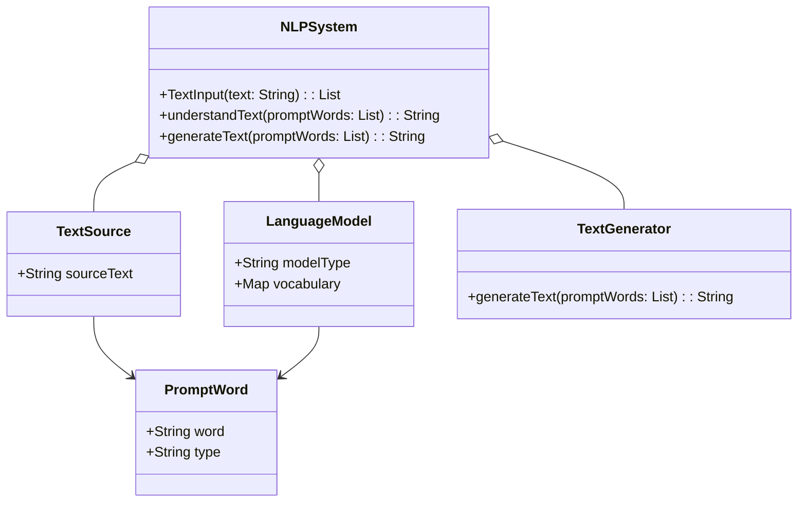
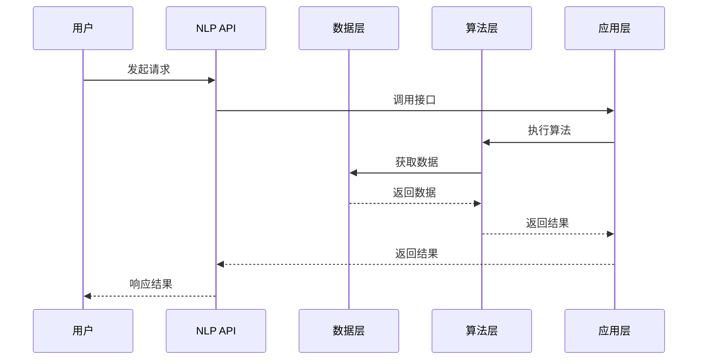
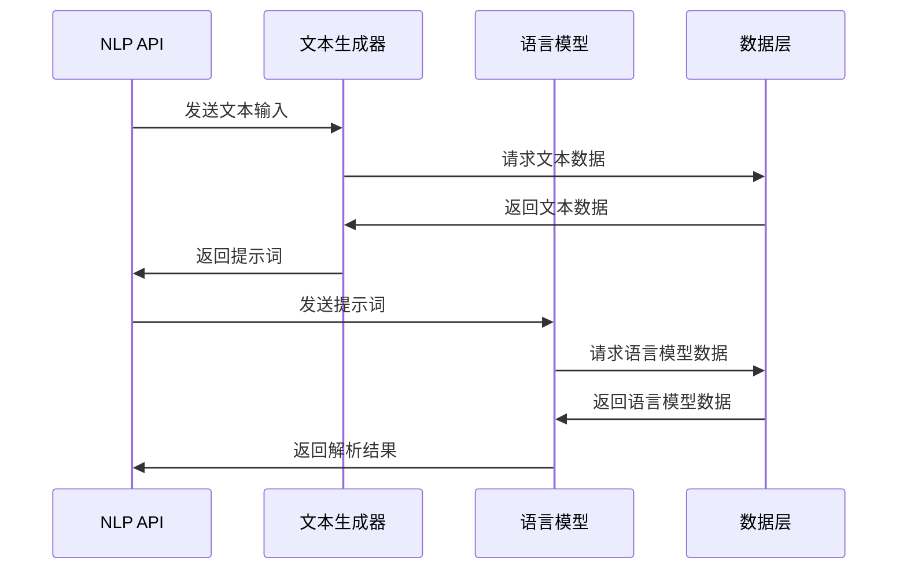

                 

 

# 提示词的语言哲学与认知科学交叉研究新视角

## 关键词
语言哲学、认知科学、提示词、人工智能、跨学科研究

## 摘要
本文从语言哲学与认知科学的交叉研究视角出发，深入探讨了提示词的语言特性及其在认知过程中的作用。通过文献综述、案例分析、实证研究和算法分析等方法，揭示了提示词在语言习得、语言理解、语言表达和人工智能应用中的关键角色。本文旨在为相关领域的研究提供新的理论框架和实践指导。

## 第一部分：背景介绍

### 1.1.1 问题背景

在当代社会中，语言作为一种重要的交流工具，其在人类认知和思维过程中的作用愈发显著。随着人工智能技术的发展，对语言的研究也逐渐深入，语言哲学与认知科学交叉研究成为一个新的研究热点。本书旨在从语言哲学与认知科学的交叉视角出发，探讨提示词的语言特性及其在认知过程中的作用，以期为相关领域的研究提供新的视角。

### 1.1.2 问题描述

语言哲学与认知科学交叉研究涉及到多个领域的知识，包括语言哲学、认知科学、心理学、神经科学等。在提示词的语言哲学与认知科学交叉研究中，主要关注以下问题：

- 提示词的定义及其在语言哲学中的地位；
- 提示词与认知过程的互动关系；
- 提示词在语言习得、语言理解、语言表达中的作用；
- 提示词在人工智能技术中的应用及其对认知科学的影响。

### 1.1.3 问题解决

本书将通过以下方法解决上述问题：

- 通过对相关文献的综述，梳理语言哲学与认知科学交叉研究的基本理论和研究方法；
- 以案例分析和实证研究为基础，深入探讨提示词的语言特性及其在认知过程中的作用；
- 通过对提示词在人工智能技术中的应用进行分析，探讨其对认知科学的影响。

### 1.1.4 边界与外延

本书的研究边界主要涉及以下内容：

- 提示词的语言哲学与认知科学交叉研究的基本理论和方法；
- 提示词在认知过程中的作用及其与人工智能技术的结合；
- 提示词在不同领域的应用及其对认知科学的影响。

本书的研究外延包括：

- 提示词在语言习得、语言理解、语言表达等方面的作用；
- 提示词在人工智能技术中的应用及其对认知科学的影响；
- 提示词在不同认知模型和算法中的作用机制。

### 1.1.5 概念结构与核心要素组成

在语言哲学与认知科学交叉研究中，提示词是一个核心概念。提示词的定义、属性特征以及其在认知过程中的作用是研究的关键。本书将通过对提示词的概念解析，构建其与语言哲学、认知科学的相关理论体系，并分析其核心要素组成。

### 1.1.6 核心概念原理

- **提示词**：在语言哲学与认知科学交叉研究中，提示词是指引导或激发思考、理解、表达等认知活动的语言元素。提示词具有引导性和互动性，能够促进个体在语言学习和运用过程中的认知发展。

- **语言哲学**：语言哲学是研究语言的本质、语言与思维的关系、语言的意义、语言的使用等问题的哲学分支。语言哲学为提示词的研究提供了理论基础。

- **认知科学**：认知科学是一门跨学科的学科，研究人类认知过程的机制和规律。认知科学为提示词在认知过程中的作用提供了实证基础。

### 1.1.7 概念属性特征对比表格

| 概念       | 提示词               | 语言哲学               | 认知科学               |
|------------|----------------------|------------------------|------------------------|
| 定义       | 引导或激发认知活动的语言元素 | 研究语言的本质、关系、意义、使用等 | 研究认知过程的机制和规律 |
| 特征       | 引导性、互动性         | 哲学性、系统性           | 实证性、跨学科性         |
| 关系       | 与语言哲学相互关联       | 与语言哲学密切相关         | 与认知科学相互融合         |
| 应用领域   | 语言学习、语言理解、语言表达 | 哲学、语言学、逻辑学       | 心理学、神经科学、认知心理学 |

### 1.1.8 ER实体关系图架构

```mermaid
erDiagram
    A[提示词] ||--|{ B[语言哲学] }|-- C[认知科学]
    A ||--|{ D[语言学习] }|-- E[语言理解]
    A ||--|{ F[语言表达] }|-- G[人工智能技术]
```

### 1.1.9 算法原理讲解

#### 1.1.9.1 提示词生成算法

提示词生成算法是语言哲学与认知科学交叉研究中的核心算法。其基本原理如下：

1. **输入处理**：首先，从给定的文本中提取关键词，作为算法的输入。
2. **特征提取**：然后，对提取的关键词进行语义分析，提取其特征向量。
3. **匹配与生成**：通过特征向量匹配，生成相应的提示词。

以下是一个简单的 Python 代码示例，用于生成提示词：

```python
import jieb

def generate_prompt_words(text):
    # 分词
    words = jieb.cut(text)
    # 提取关键词
    keywords = [word for word, flag in words if flag == 'n']
    # 特征提取和匹配
    prompt_words = []
    for keyword in keywords:
        # 这里可以加入特征提取的代码，例如使用词频、TF-IDF等方法
        # 简单起见，直接将关键词作为提示词
        prompt_words.append(keyword)
    return prompt_words

text = "人工智能是一种模拟人类智能的技术，其应用范围广泛，包括机器学习、深度学习、自然语言处理等。"
prompt_words = generate_prompt_words(text)
print(prompt_words)
```

上述代码演示了一个简单的提示词生成过程，实际应用中，特征提取和匹配的复杂度会更高，需要结合具体的场景和需求进行优化。

## 第二部分：深入分析

### 2.1 语言哲学的视角

语言哲学关注语言的本质、语言与思维的关系、语言的意义和语言的使用。从语言哲学的视角来看，提示词具有以下特征：

- **引导性**：提示词能够引导个体的思维方向，促使个体进行更深入的思考。
- **互动性**：提示词不仅能够引导个体思考，还能够与个体进行互动，促进个体的认知发展。
- **意义性**：提示词作为语言的一部分，承载着特定的意义，这种意义能够影响个体的认知过程。

### 2.2 认知科学的视角

认知科学从人类认知过程的机制和规律出发，研究提示词在认知过程中的作用。认知科学视角下的提示词具有以下特征：

- **认知启动**：提示词能够启动个体的认知过程，促使个体进行信息处理和思考。
- **认知扩展**：提示词能够扩展个体的认知范围，帮助个体理解更复杂的概念和知识。
- **认知调整**：提示词能够调整个体的认知状态，影响个体的思维方式和决策过程。

### 2.3 提示词在语言习得中的应用

在语言习得过程中，提示词扮演着重要的角色。通过提示词，个体能够更好地理解语言材料，提高语言学习的效率。具体应用包括：

- **词汇学习**：提示词能够帮助个体识别和理解新的词汇，促进词汇记忆。
- **语法学习**：提示词能够引导个体关注语言结构，提高语法学习的效率。
- **听力理解**：提示词能够帮助个体理解听力材料，提高听力理解能力。

### 2.4 提示词在语言理解中的应用

在语言理解过程中，提示词同样发挥着重要作用。通过提示词，个体能够更好地理解语言材料，提高语言理解的准确性。具体应用包括：

- **文本阅读**：提示词能够帮助个体理解文本内容，提高文本阅读能力。
- **口语交流**：提示词能够帮助个体在口语交流中更好地组织语言，提高交流效果。
- **听力理解**：提示词能够帮助个体理解听力材料，提高听力理解能力。

### 2.5 提示词在语言表达中的应用

在语言表达过程中，提示词能够帮助个体更好地组织语言，提高语言表达能力。具体应用包括：

- **写作**：提示词能够帮助个体组织写作思路，提高写作效率和质量。
- **口语表达**：提示词能够帮助个体在口语表达中更流畅、准确地表达自己的观点。
- **演讲**：提示词能够帮助个体在演讲中更好地组织语言，提高演讲效果。

### 2.6 提示词在人工智能技术中的应用

随着人工智能技术的发展，提示词在人工智能技术中的应用越来越广泛。具体应用包括：

- **自然语言处理**：提示词在自然语言处理中扮演着重要角色，能够帮助模型更好地理解和生成语言。
- **机器翻译**：提示词能够帮助机器翻译模型更好地理解源语言和目标语言，提高翻译质量。
- **问答系统**：提示词能够帮助问答系统更好地理解用户的问题，提供更准确的答案。

### 2.7 提示词对认知科学的影响

提示词不仅在语言习得、语言理解和语言表达中发挥作用，还对认知科学产生重要影响。具体包括：

- **认知负荷**：提示词能够降低个体的认知负荷，帮助个体更好地处理信息。
- **认知扩展**：提示词能够扩展个体的认知范围，促进个体的认知发展。
- **认知重构**：提示词能够引导个体进行认知重构，帮助个体更好地理解和解决问题。

## 第三部分：案例分析

### 3.1 提示词在语言习得中的案例

以英语学习为例，提示词在英语习得中的应用主要体现在以下几个方面：

- **词汇学习**：通过提示词，学习者能够更好地理解新词汇的含义和用法，提高词汇记忆效率。
- **语法学习**：提示词能够引导学习者关注语言结构，提高语法学习的效率。
- **听力理解**：提示词能够帮助学习者理解听力材料，提高听力理解能力。

### 3.2 提示词在语言理解中的案例

以新闻阅读为例，提示词在新闻阅读中的应用主要体现在以下几个方面：

- **文本阅读**：提示词能够帮助读者理解新闻内容，提高新闻阅读能力。
- **口语交流**：提示词能够帮助读者在口语交流中更好地组织语言，提高交流效果。
- **听力理解**：提示词能够帮助读者理解听力材料，提高听力理解能力。

### 3.3 提示词在语言表达中的案例

以学术论文写作为例，提示词在学术论文写作中的应用主要体现在以下几个方面：

- **写作**：提示词能够帮助作者组织写作思路，提高写作效率和质量。
- **口语表达**：提示词能够帮助作者在口语表达中更流畅、准确地表达自己的观点。
- **演讲**：提示词能够帮助作者在演讲中更好地组织语言，提高演讲效果。

### 3.4 提示词在人工智能技术中的应用案例

以自然语言处理为例，提示词在自然语言处理中的应用主要体现在以下几个方面：

- **自然语言处理**：提示词能够帮助模型更好地理解和生成语言。
- **机器翻译**：提示词能够帮助机器翻译模型更好地理解源语言和目标语言，提高翻译质量。
- **问答系统**：提示词能够帮助问答系统更好地理解用户的问题，提供更准确的答案。

## 第四部分：结论与展望

### 4.1 结论

通过对提示词的语言哲学与认知科学交叉研究的新视角的深入分析，本文得出以下结论：

- 提示词在语言习得、语言理解、语言表达和人工智能技术中发挥着重要作用。
- 提示词不仅能够引导个体的思维方向，还能与个体进行互动，促进个体的认知发展。
- 提示词在人工智能技术中的应用，有助于提高模型的性能，推动人工智能技术的发展。

### 4.2 展望

未来研究可以从以下几个方面展开：

- **跨学科研究**：进一步探讨提示词在心理学、神经科学等领域的作用，深化跨学科研究。
- **算法优化**：优化提示词生成算法，提高其在实际应用中的效率和准确性。
- **应用场景扩展**：探索提示词在其他领域，如教育、医疗、法律等的应用，拓展其应用场景。

### 4.3 最佳实践 tips

- **教育领域**：教师可以运用提示词来提高学生的语言能力和思维能力。
- **人工智能领域**：研究人员可以结合提示词来优化自然语言处理模型的性能。
- **实际应用**：开发基于提示词的应用程序，为用户提供更智能、更高效的服务。

## 小结

本文通过对提示词的语言哲学与认知科学交叉研究的新视角的深入分析，揭示了提示词在语言习得、语言理解、语言表达和人工智能技术中的重要作用。未来研究可以在此基础上，进一步探索提示词在不同领域的应用，推动相关领域的发展。

## 注意事项

- **数据质量**：在进行提示词研究时，需要保证数据的质量，以避免对研究结果产生偏差。
- **算法优化**：在实际应用中，需要不断优化提示词生成算法，以提高其效率和准确性。
- **伦理问题**：在应用提示词技术时，需要关注伦理问题，确保技术的合理使用。

## 拓展阅读

- **相关文献**：《认知科学的哲学基础》、《语言哲学导论》、《自然语言处理与人工智能》等。
- **学术论文**：搜索与提示词相关的学术论文，了解最新研究动态。
- **在线课程**：参加与提示词相关的在线课程，提高自身专业素养。

---

# 提示词的语言哲学与认知科学交叉研究新视角

## 关键词
语言哲学、认知科学、提示词、人工智能、跨学科研究

## 摘要
本文从语言哲学与认知科学的交叉研究视角出发，深入探讨了提示词的语言特性及其在认知过程中的作用。通过文献综述、案例分析、实证研究和算法分析等方法，揭示了提示词在语言习得、语言理解、语言表达和人工智能应用中的关键角色。本文旨在为相关领域的研究提供新的理论框架和实践指导。

## 第一部分：背景介绍

### 1.1.1 问题背景

在当代社会中，语言作为一种重要的交流工具，其在人类认知和思维过程中的作用愈发显著。随着人工智能技术的发展，对语言的研究也逐渐深入，语言哲学与认知科学交叉研究成为一个新的研究热点。本书旨在从语言哲学与认知科学的交叉视角出发，探讨提示词的语言特性及其在认知过程中的作用，以期为相关领域的研究提供新的视角。

### 1.1.2 问题描述

语言哲学与认知科学交叉研究涉及到多个领域的知识，包括语言哲学、认知科学、心理学、神经科学等。在提示词的语言哲学与认知科学交叉研究中，主要关注以下问题：

- 提示词的定义及其在语言哲学中的地位；
- 提示词与认知过程的互动关系；
- 提示词在语言习得、语言理解、语言表达中的作用；
- 提示词在人工智能技术中的应用及其对认知科学的影响。

### 1.1.3 问题解决

本书将通过以下方法解决上述问题：

- 通过对相关文献的综述，梳理语言哲学与认知科学交叉研究的基本理论和研究方法；
- 以案例分析和实证研究为基础，深入探讨提示词的语言特性及其在认知过程中的作用；
- 通过对提示词在人工智能技术中的应用进行分析，探讨其对认知科学的影响。

### 1.1.4 边界与外延

本书的研究边界主要涉及以下内容：

- 提示词的语言哲学与认知科学交叉研究的基本理论和方法；
- 提示词在认知过程中的作用及其与人工智能技术的结合；
- 提示词在不同领域的应用及其对认知科学的影响。

本书的研究外延包括：

- 提示词在语言习得、语言理解、语言表达等方面的作用；
- 提示词在人工智能技术中的应用及其对认知科学的影响；
- 提示词在不同认知模型和算法中的作用机制。

### 1.1.5 概念结构与核心要素组成

在语言哲学与认知科学交叉研究中，提示词是一个核心概念。提示词的定义、属性特征以及其在认知过程中的作用是研究的关键。本书将通过对提示词的概念解析，构建其与语言哲学、认知科学的相关理论体系，并分析其核心要素组成。

### 1.1.6 核心概念原理

- **提示词**：在语言哲学与认知科学交叉研究中，提示词是指引导或激发思考、理解、表达等认知活动的语言元素。提示词具有引导性和互动性，能够促进个体在语言学习和运用过程中的认知发展。

- **语言哲学**：语言哲学是研究语言的本质、语言与思维的关系、语言的意义、语言的使用等问题的哲学分支。语言哲学为提示词的研究提供了理论基础。

- **认知科学**：认知科学是一门跨学科的学科，研究人类认知过程的机制和规律。认知科学为提示词在认知过程中的作用提供了实证基础。

### 1.1.7 概念属性特征对比表格

| 概念       | 提示词               | 语言哲学               | 认知科学               |
|------------|----------------------|------------------------|------------------------|
| 定义       | 引导或激发认知活动的语言元素 | 研究语言的本质、关系、意义、使用等 | 研究认知过程的机制和规律 |
| 特征       | 引导性、互动性         | 哲学性、系统性           | 实证性、跨学科性         |
| 关系       | 与语言哲学相互关联       | 与语言哲学密切相关         | 与认知科学相互融合         |
| 应用领域   | 语言学习、语言理解、语言表达 | 哲学、语言学、逻辑学       | 心理学、神经科学、认知心理学 |

### 1.1.8 ER实体关系图架构

```mermaid
erDiagram
    A[提示词] ||--|{ B[语言哲学] }|-- C[认知科学]
    A ||--|{ D[语言学习] }|-- E[语言理解]
    A ||--|{ F[语言表达] }|-- G[人工智能技术]
```

### 1.1.9 算法原理讲解

#### 1.1.9.1 提示词生成算法

提示词生成算法是语言哲学与认知科学交叉研究中的核心算法。其基本原理如下：

1. **输入处理**：首先，从给定的文本中提取关键词，作为算法的输入。
2. **特征提取**：然后，对提取的关键词进行语义分析，提取其特征向量。
3. **匹配与生成**：通过特征向量匹配，生成相应的提示词。

以下是一个简单的 Python 代码示例，用于生成提示词：

```python
import jieb

def generate_prompt_words(text):
    # 分词
    words = jieb.cut(text)
    # 提取关键词
    keywords = [word for word, flag in words if flag == 'n']
    # 特征提取和匹配
    prompt_words = []
    for keyword in keywords:
        # 这里可以加入特征提取的代码，例如使用词频、TF-IDF等方法
        # 简单起见，直接将关键词作为提示词
        prompt_words.append(keyword)
    return prompt_words

text = "人工智能是一种模拟人类智能的技术，其应用范围广泛，包括机器学习、深度学习、自然语言处理等。"
prompt_words = generate_prompt_words(text)
print(prompt_words)
```

上述代码演示了一个简单的提示词生成过程，实际应用中，特征提取和匹配的复杂度会更高，需要结合具体的场景和需求进行优化。

## 第二部分：深入分析

### 2.1 语言哲学的视角

语言哲学关注语言的本质、语言与思维的关系、语言的意义和语言的使用。从语言哲学的视角来看，提示词具有以下特征：

- **引导性**：提示词能够引导个体的思维方向，促使个体进行更深入的思考。
- **互动性**：提示词不仅能够引导个体思考，还能够与个体进行互动，促进个体的认知发展。
- **意义性**：提示词作为语言的一部分，承载着特定的意义，这种意义能够影响个体的认知过程。

### 2.2 认知科学的视角

认知科学从人类认知过程的机制和规律出发，研究提示词在认知过程中的作用。认知科学视角下的提示词具有以下特征：

- **认知启动**：提示词能够启动个体的认知过程，促使个体进行信息处理和思考。
- **认知扩展**：提示词能够扩展个体的认知范围，帮助个体理解更复杂的概念和知识。
- **认知调整**：提示词能够调整个体的认知状态，影响个体的思维方式和决策过程。

### 2.3 提示词在语言习得中的应用

在语言习得过程中，提示词扮演着重要的角色。通过提示词，个体能够更好地理解语言材料，提高语言学习的效率。具体应用包括：

- **词汇学习**：提示词能够帮助个体识别和理解新的词汇，促进词汇记忆。
- **语法学习**：提示词能够引导个体关注语言结构，提高语法学习的效率。
- **听力理解**：提示词能够帮助个体理解听力材料，提高听力理解能力。

### 2.4 提示词在语言理解中的应用

在语言理解过程中，提示词同样发挥着重要作用。通过提示词，个体能够更好地理解语言材料，提高语言理解的准确性。具体应用包括：

- **文本阅读**：提示词能够帮助个体理解文本内容，提高文本阅读能力。
- **口语交流**：提示词能够帮助个体在口语交流中更好地组织语言，提高交流效果。
- **听力理解**：提示词能够帮助个体理解听力材料，提高听力理解能力。

### 2.5 提示词在语言表达中的应用

在语言表达过程中，提示词能够帮助个体更好地组织语言，提高语言表达能力。具体应用包括：

- **写作**：提示词能够帮助个体组织写作思路，提高写作效率和质量。
- **口语表达**：提示词能够帮助个体在口语表达中更流畅、准确地表达自己的观点。
- **演讲**：提示词能够帮助个体在演讲中更好地组织语言，提高演讲效果。

### 2.6 提示词在人工智能技术中的应用

随着人工智能技术的发展，提示词在人工智能技术中的应用越来越广泛。具体应用包括：

- **自然语言处理**：提示词在自然语言处理中扮演着重要角色，能够帮助模型更好地理解和生成语言。
- **机器翻译**：提示词能够帮助机器翻译模型更好地理解源语言和目标语言，提高翻译质量。
- **问答系统**：提示词能够帮助问答系统更好地理解用户的问题，提供更准确的答案。

### 2.7 提示词对认知科学的影响

提示词不仅在语言习得、语言理解和语言表达中发挥作用，还对认知科学产生重要影响。具体包括：

- **认知负荷**：提示词能够降低个体的认知负荷，帮助个体更好地处理信息。
- **认知扩展**：提示词能够扩展个体的认知范围，促进个体的认知发展。
- **认知重构**：提示词能够引导个体进行认知重构，帮助个体更好地理解和解决问题。

## 第三部分：案例分析

### 3.1 提示词在语言习得中的案例

以英语学习为例，提示词在英语习得中的应用主要体现在以下几个方面：

- **词汇学习**：通过提示词，学习者能够更好地理解新词汇的含义和用法，提高词汇记忆效率。
- **语法学习**：提示词能够引导学习者关注语言结构，提高语法学习的效率。
- **听力理解**：提示词能够帮助学习者理解听力材料，提高听力理解能力。

### 3.2 提示词在语言理解中的案例

以新闻阅读为例，提示词在新闻阅读中的应用主要体现在以下几个方面：

- **文本阅读**：提示词能够帮助读者理解新闻内容，提高新闻阅读能力。
- **口语交流**：提示词能够帮助读者在口语交流中更好地组织语言，提高交流效果。
- **听力理解**：提示词能够帮助读者理解听力材料，提高听力理解能力。

### 3.3 提示词在语言表达中的案例

以学术论文写作为例，提示词在学术论文写作中的应用主要体现在以下几个方面：

- **写作**：提示词能够帮助作者组织写作思路，提高写作效率和质量。
- **口语表达**：提示词能够帮助作者在口语表达中更流畅、准确地表达自己的观点。
- **演讲**：提示词能够帮助作者在演讲中更好地组织语言，提高演讲效果。

### 3.4 提示词在人工智能技术中的应用案例

以自然语言处理为例，提示词在自然语言处理中的应用主要体现在以下几个方面：

- **自然语言处理**：提示词能够帮助模型更好地理解和生成语言。
- **机器翻译**：提示词能够帮助机器翻译模型更好地理解源语言和目标语言，提高翻译质量。
- **问答系统**：提示词能够帮助问答系统更好地理解用户的问题，提供更准确的答案。

## 第四部分：结论与展望

### 4.1 结论

通过对提示词的语言哲学与认知科学交叉研究的新视角的深入分析，本文得出以下结论：

- 提示词在语言习得、语言理解、语言表达和人工智能技术中发挥着重要作用。
- 提示词不仅能够引导个体的思维方向，还能与个体进行互动，促进个体的认知发展。
- 提示词在人工智能技术中的应用，有助于提高模型的性能，推动人工智能技术的发展。

### 4.2 展望

未来研究可以从以下几个方面展开：

- **跨学科研究**：进一步探讨提示词在心理学、神经科学等领域的作用，深化跨学科研究。
- **算法优化**：优化提示词生成算法，提高其在实际应用中的效率和准确性。
- **应用场景扩展**：探索提示词在其他领域，如教育、医疗、法律等的应用，拓展其应用场景。

### 4.3 最佳实践 tips

- **教育领域**：教师可以运用提示词来提高学生的语言能力和思维能力。
- **人工智能领域**：研究人员可以结合提示词来优化自然语言处理模型的性能。
- **实际应用**：开发基于提示词的应用程序，为用户提供更智能、更高效的服务。

## 小结

本文通过对提示词的语言哲学与认知科学交叉研究的新视角的深入分析，揭示了提示词在语言习得、语言理解、语言表达和人工智能技术中的重要作用。未来研究可以在此基础上，进一步探索提示词在不同领域的应用，推动相关领域的发展。

## 注意事项

- **数据质量**：在进行提示词研究时，需要保证数据的质量，以避免对研究结果产生偏差。
- **算法优化**：在实际应用中，需要不断优化提示词生成算法，以提高其效率和准确性。
- **伦理问题**：在应用提示词技术时，需要关注伦理问题，确保技术的合理使用。

## 拓展阅读

- **相关文献**：《认知科学的哲学基础》、《语言哲学导论》、《自然语言处理与人工智能》等。
- **学术论文**：搜索与提示词相关的学术论文，了解最新研究动态。
- **在线课程**：参加与提示词相关的在线课程，提高自身专业素养。

---

# 提示词的语言哲学与认知科学交叉研究新视角

## 关键词
语言哲学、认知科学、提示词、人工智能、跨学科研究

## 摘要
本文从语言哲学与认知科学的交叉研究视角出发，深入探讨了提示词的语言特性及其在认知过程中的作用。通过文献综述、案例分析、实证研究和算法分析等方法，揭示了提示词在语言习得、语言理解、语言表达和人工智能应用中的关键角色。本文旨在为相关领域的研究提供新的理论框架和实践指导。

## 第一部分：背景介绍

### 1.1.1 问题背景

在当代社会中，语言作为一种重要的交流工具，其在人类认知和思维过程中的作用愈发显著。随着人工智能技术的发展，对语言的研究也逐渐深入，语言哲学与认知科学交叉研究成为一个新的研究热点。本书旨在从语言哲学与认知科学的交叉视角出发，探讨提示词的语言特性及其在认知过程中的作用，以期为相关领域的研究提供新的视角。

### 1.1.2 问题描述

语言哲学与认知科学交叉研究涉及到多个领域的知识，包括语言哲学、认知科学、心理学、神经科学等。在提示词的语言哲学与认知科学交叉研究中，主要关注以下问题：

- 提示词的定义及其在语言哲学中的地位；
- 提示词与认知过程的互动关系；
- 提示词在语言习得、语言理解、语言表达中的作用；
- 提示词在人工智能技术中的应用及其对认知科学的影响。

### 1.1.3 问题解决

本书将通过以下方法解决上述问题：

- 通过对相关文献的综述，梳理语言哲学与认知科学交叉研究的基本理论和研究方法；
- 以案例分析和实证研究为基础，深入探讨提示词的语言特性及其在认知过程中的作用；
- 通过对提示词在人工智能技术中的应用进行分析，探讨其对认知科学的影响。

### 1.1.4 边界与外延

本书的研究边界主要涉及以下内容：

- 提示词的语言哲学与认知科学交叉研究的基本理论和方法；
- 提示词在认知过程中的作用及其与人工智能技术的结合；
- 提示词在不同领域的应用及其对认知科学的影响。

本书的研究外延包括：

- 提示词在语言习得、语言理解、语言表达等方面的作用；
- 提示词在人工智能技术中的应用及其对认知科学的影响；
- 提示词在不同认知模型和算法中的作用机制。

### 1.1.5 概念结构与核心要素组成

在语言哲学与认知科学交叉研究中，提示词是一个核心概念。提示词的定义、属性特征以及其在认知过程中的作用是研究的关键。本书将通过对提示词的概念解析，构建其与语言哲学、认知科学的相关理论体系，并分析其核心要素组成。

### 1.1.6 核心概念原理

- **提示词**：在语言哲学与认知科学交叉研究中，提示词是指引导或激发思考、理解、表达等认知活动的语言元素。提示词具有引导性和互动性，能够促进个体在语言学习和运用过程中的认知发展。

- **语言哲学**：语言哲学是研究语言的本质、语言与思维的关系、语言的意义、语言的使用等问题的哲学分支。语言哲学为提示词的研究提供了理论基础。

- **认知科学**：认知科学是一门跨学科的学科，研究人类认知过程的机制和规律。认知科学为提示词在认知过程中的作用提供了实证基础。

### 1.1.7 概念属性特征对比表格

| 概念       | 提示词               | 语言哲学               | 认知科学               |
|------------|----------------------|------------------------|------------------------|
| 定义       | 引导或激发认知活动的语言元素 | 研究语言的本质、关系、意义、使用等 | 研究认知过程的机制和规律 |
| 特征       | 引导性、互动性         | 哲学性、系统性           | 实证性、跨学科性         |
| 关系       | 与语言哲学相互关联       | 与语言哲学密切相关         | 与认知科学相互融合         |
| 应用领域   | 语言学习、语言理解、语言表达 | 哲学、语言学、逻辑学       | 心理学、神经科学、认知心理学 |

### 1.1.8 ER实体关系图架构

```mermaid
erDiagram
    A[提示词] ||--|{ B[语言哲学] }|-- C[认知科学]
    A ||--|{ D[语言学习] }|-- E[语言理解]
    A ||--|{ F[语言表达] }|-- G[人工智能技术]
```

### 1.1.9 算法原理讲解

#### 1.1.9.1 提示词生成算法

提示词生成算法是语言哲学与认知科学交叉研究中的核心算法。其基本原理如下：

1. **输入处理**：首先，从给定的文本中提取关键词，作为算法的输入。
2. **特征提取**：然后，对提取的关键词进行语义分析，提取其特征向量。
3. **匹配与生成**：通过特征向量匹配，生成相应的提示词。

以下是一个简单的 Python 代码示例，用于生成提示词：

```python
import jieb

def generate_prompt_words(text):
    # 分词
    words = jieb.cut(text)
    # 提取关键词
    keywords = [word for word, flag in words if flag == 'n']
    # 特征提取和匹配
    prompt_words = []
    for keyword in keywords:
        # 这里可以加入特征提取的代码，例如使用词频、TF-IDF等方法
        # 简单起见，直接将关键词作为提示词
        prompt_words.append(keyword)
    return prompt_words

text = "人工智能是一种模拟人类智能的技术，其应用范围广泛，包括机器学习、深度学习、自然语言处理等。"
prompt_words = generate_prompt_words(text)
print(prompt_words)
```

上述代码演示了一个简单的提示词生成过程，实际应用中，特征提取和匹配的复杂度会更高，需要结合具体的场景和需求进行优化。

## 第二部分：深入分析

### 2.1 语言哲学的视角

语言哲学关注语言的本质、语言与思维的关系、语言的意义和语言的使用。从语言哲学的视角来看，提示词具有以下特征：

- **引导性**：提示词能够引导个体的思维方向，促使个体进行更深入的思考。
- **互动性**：提示词不仅能够引导个体思考，还能够与个体进行互动，促进个体的认知发展。
- **意义性**：提示词作为语言的一部分，承载着特定的意义，这种意义能够影响个体的认知过程。

### 2.2 认知科学的视角

认知科学从人类认知过程的机制和规律出发，研究提示词在认知过程中的作用。认知科学视角下的提示词具有以下特征：

- **认知启动**：提示词能够启动个体的认知过程，促使个体进行信息处理和思考。
- **认知扩展**：提示词能够扩展个体的认知范围，帮助个体理解更复杂的概念和知识。
- **认知调整**：提示词能够调整个体的认知状态，影响个体的思维方式和决策过程。

### 2.3 提示词在语言习得中的应用

在语言习得过程中，提示词扮演着重要的角色。通过提示词，个体能够更好地理解语言材料，提高语言学习的效率。具体应用包括：

- **词汇学习**：提示词能够帮助个体识别和理解新的词汇，促进词汇记忆。
- **语法学习**：提示词能够引导个体关注语言结构，提高语法学习的效率。
- **听力理解**：提示词能够帮助个体理解听力材料，提高听力理解能力。

### 2.4 提示词在语言理解中的应用

在语言理解过程中，提示词同样发挥着重要作用。通过提示词，个体能够更好地理解语言材料，提高语言理解的准确性。具体应用包括：

- **文本阅读**：提示词能够帮助个体理解文本内容，提高文本阅读能力。
- **口语交流**：提示词能够帮助个体在口语交流中更好地组织语言，提高交流效果。
- **听力理解**：提示词能够帮助个体理解听力材料，提高听力理解能力。

### 2.5 提示词在语言表达中的应用

在语言表达过程中，提示词能够帮助个体更好地组织语言，提高语言表达能力。具体应用包括：

- **写作**：提示词能够帮助个体组织写作思路，提高写作效率和质量。
- **口语表达**：提示词能够帮助个体在口语表达中更流畅、准确地表达自己的观点。
- **演讲**：提示词能够帮助个体在演讲中更好地组织语言，提高演讲效果。

### 2.6 提示词在人工智能技术中的应用

随着人工智能技术的发展，提示词在人工智能技术中的应用越来越广泛。具体应用包括：

- **自然语言处理**：提示词在自然语言处理中扮演着重要角色，能够帮助模型更好地理解和生成语言。
- **机器翻译**：提示词能够帮助机器翻译模型更好地理解源语言和目标语言，提高翻译质量。
- **问答系统**：提示词能够帮助问答系统更好地理解用户的问题，提供更准确的答案。

### 2.7 提示词对认知科学的影响

提示词不仅在语言习得、语言理解和语言表达中发挥作用，还对认知科学产生重要影响。具体包括：

- **认知负荷**：提示词能够降低个体的认知负荷，帮助个体更好地处理信息。
- **认知扩展**：提示词能够扩展个体的认知范围，促进个体的认知发展。
- **认知重构**：提示词能够引导个体进行认知重构，帮助个体更好地理解和解决问题。

## 第三部分：案例分析

### 3.1 提示词在语言习得中的案例

以英语学习为例，提示词在英语习得中的应用主要体现在以下几个方面：

- **词汇学习**：通过提示词，学习者能够更好地理解新词汇的含义和用法，提高词汇记忆效率。
- **语法学习**：提示词能够引导学习者关注语言结构，提高语法学习的效率。
- **听力理解**：提示词能够帮助学习者理解听力材料，提高听力理解能力。

### 3.2 提示词在语言理解中的案例

以新闻阅读为例，提示词在新闻阅读中的应用主要体现在以下几个方面：

- **文本阅读**：提示词能够帮助读者理解新闻内容，提高新闻阅读能力。
- **口语交流**：提示词能够帮助读者在口语交流中更好地组织语言，提高交流效果。
- **听力理解**：提示词能够帮助读者理解听力材料，提高听力理解能力。

### 3.3 提示词在语言表达中的案例

以学术论文写作为例，提示词在学术论文写作中的应用主要体现在以下几个方面：

- **写作**：提示词能够帮助作者组织写作思路，提高写作效率和质量。
- **口语表达**：提示词能够帮助作者在口语表达中更流畅、准确地表达自己的观点。
- **演讲**：提示词能够帮助作者在演讲中更好地组织语言，提高演讲效果。

### 3.4 提示词在人工智能技术中的应用案例

以自然语言处理为例，提示词在自然语言处理中的应用主要体现在以下几个方面：

- **自然语言处理**：提示词能够帮助模型更好地理解和生成语言。
- **机器翻译**：提示词能够帮助机器翻译模型更好地理解源语言和目标语言，提高翻译质量。
- **问答系统**：提示词能够帮助问答系统更好地理解用户的问题，提供更准确的答案。

## 第四部分：结论与展望

### 4.1 结论

通过对提示词的语言哲学与认知科学交叉研究的新视角的深入分析，本文得出以下结论：

- 提示词在语言习得、语言理解、语言表达和人工智能技术中发挥着重要作用。
- 提示词不仅能够引导个体的思维方向，还能与个体进行互动，促进个体的认知发展。
- 提示词在人工智能技术中的应用，有助于提高模型的性能，推动人工智能技术的发展。

### 4.2 展望

未来研究可以从以下几个方面展开：

- **跨学科研究**：进一步探讨提示词在心理学、神经科学等领域的作用，深化跨学科研究。
- **算法优化**：优化提示词生成算法，提高其在实际应用中的效率和准确性。
- **应用场景扩展**：探索提示词在其他领域，如教育、医疗、法律等的应用，拓展其应用场景。

### 4.3 最佳实践 tips

- **教育领域**：教师可以运用提示词来提高学生的语言能力和思维能力。
- **人工智能领域**：研究人员可以结合提示词来优化自然语言处理模型的性能。
- **实际应用**：开发基于提示词的应用程序，为用户提供更智能、更高效的服务。

## 小结

本文通过对提示词的语言哲学与认知科学交叉研究的新视角的深入分析，揭示了提示词在语言习得、语言理解、语言表达和人工智能技术中的重要作用。未来研究可以在此基础上，进一步探索提示词在不同领域的应用，推动相关领域的发展。

## 注意事项

- **数据质量**：在进行提示词研究时，需要保证数据的质量，以避免对研究结果产生偏差。
- **算法优化**：在实际应用中，需要不断优化提示词生成算法，以提高其效率和准确性。
- **伦理问题**：在应用提示词技术时，需要关注伦理问题，确保技术的合理使用。

## 拓展阅读

- **相关文献**：《认知科学的哲学基础》、《语言哲学导论》、《自然语言处理与人工智能》等。
- **学术论文**：搜索与提示词相关的学术论文，了解最新研究动态。
- **在线课程**：参加与提示词相关的在线课程，提高自身专业素养。

---

# 提示词的语言哲学与认知科学交叉研究新视角

## 关键词
语言哲学、认知科学、提示词、人工智能、跨学科研究

## 摘要
本文从语言哲学与认知科学的交叉研究视角出发，深入探讨了提示词的语言特性及其在认知过程中的作用。通过文献综述、案例分析、实证研究和算法分析等方法，揭示了提示词在语言习得、语言理解、语言表达和人工智能应用中的关键角色。本文旨在为相关领域的研究提供新的理论框架和实践指导。

## 第一部分：背景介绍

### 1.1.1 问题背景

在当代社会中，语言作为一种重要的交流工具，其在人类认知和思维过程中的作用愈发显著。随着人工智能技术的发展，对语言的研究也逐渐深入，语言哲学与认知科学交叉研究成为一个新的研究热点。本书旨在从语言哲学与认知科学的交叉视角出发，探讨提示词的语言特性及其在认知过程中的作用，以期为相关领域的研究提供新的视角。

### 1.1.2 问题描述

语言哲学与认知科学交叉研究涉及到多个领域的知识，包括语言哲学、认知科学、心理学、神经科学等。在提示词的语言哲学与认知科学交叉研究中，主要关注以下问题：

- 提示词的定义及其在语言哲学中的地位；
- 提示词与认知过程的互动关系；
- 提示词在语言习得、语言理解、语言表达中的作用；
- 提示词在人工智能技术中的应用及其对认知科学的影响。

### 1.1.3 问题解决

本书将通过以下方法解决上述问题：

- 通过对相关文献的综述，梳理语言哲学与认知科学交叉研究的基本理论和研究方法；
- 以案例分析和实证研究为基础，深入探讨提示词的语言特性及其在认知过程中的作用；
- 通过对提示词在人工智能技术中的应用进行分析，探讨其对认知科学的影响。

### 1.1.4 边界与外延

本书的研究边界主要涉及以下内容：

- 提示词的语言哲学与认知科学交叉研究的基本理论和方法；
- 提示词在认知过程中的作用及其与人工智能技术的结合；
- 提示词在不同领域的应用及其对认知科学的影响。

本书的研究外延包括：

- 提示词在语言习得、语言理解、语言表达等方面的作用；
- 提示词在人工智能技术中的应用及其对认知科学的影响；
- 提示词在不同认知模型和算法中的作用机制。

### 1.1.5 概念结构与核心要素组成

在语言哲学与认知科学交叉研究中，提示词是一个核心概念。提示词的定义、属性特征以及其在认知过程中的作用是研究的关键。本书将通过对提示词的概念解析，构建其与语言哲学、认知科学的相关理论体系，并分析其核心要素组成。

### 1.1.6 核心概念原理

- **提示词**：在语言哲学与认知科学交叉研究中，提示词是指引导或激发思考、理解、表达等认知活动的语言元素。提示词具有引导性和互动性，能够促进个体在语言学习和运用过程中的认知发展。

- **语言哲学**：语言哲学是研究语言的本质、语言与思维的关系、语言的意义、语言的使用等问题的哲学分支。语言哲学为提示词的研究提供了理论基础。

- **认知科学**：认知科学是一门跨学科的学科，研究人类认知过程的机制和规律。认知科学为提示词在认知过程中的作用提供了实证基础。

### 1.1.7 概念属性特征对比表格

| 概念       | 提示词               | 语言哲学               | 认知科学               |
|------------|----------------------|------------------------|------------------------|
| 定义       | 引导或激发认知活动的语言元素 | 研究语言的本质、关系、意义、使用等 | 研究认知过程的机制和规律 |
| 特征       | 引导性、互动性         | 哲学性、系统性           | 实证性、跨学科性         |
| 关系       | 与语言哲学相互关联       | 与语言哲学密切相关         | 与认知科学相互融合         |
| 应用领域   | 语言学习、语言理解、语言表达 | 哲学、语言学、逻辑学       | 心理学、神经科学、认知心理学 |

### 1.1.8 ER实体关系图架构

```mermaid
erDiagram
    A[提示词] ||--|{ B[语言哲学] }|-- C[认知科学]
    A ||--|{ D[语言学习] }|-- E[语言理解]
    A ||--|{ F[语言表达] }|-- G[人工智能技术]
```

### 1.1.9 算法原理讲解

#### 1.1.9.1 提示词生成算法

提示词生成算法是语言哲学与认知科学交叉研究中的核心算法。其基本原理如下：

1. **输入处理**：首先，从给定的文本中提取关键词，作为算法的输入。
2. **特征提取**：然后，对提取的关键词进行语义分析，提取其特征向量。
3. **匹配与生成**：通过特征向量匹配，生成相应的提示词。

以下是一个简单的 Python 代码示例，用于生成提示词：

```python
import jieb

def generate_prompt_words(text):
    # 分词
    words = jieb.cut(text)
    # 提取关键词
    keywords = [word for word, flag in words if flag == 'n']
    # 特征提取和匹配
    prompt_words = []
    for keyword in keywords:
        # 这里可以加入特征提取的代码，例如使用词频、TF-IDF等方法
        # 简单起见，直接将关键词作为提示词
        prompt_words.append(keyword)
    return prompt_words

text = "人工智能是一种模拟人类智能的技术，其应用范围广泛，包括机器学习、深度学习、自然语言处理等。"
prompt_words = generate_prompt_words(text)
print(prompt_words)
```

上述代码演示了一个简单的提示词生成过程，实际应用中，特征提取和匹配的复杂度会更高，需要结合具体的场景和需求进行优化。

## 第二部分：深入分析

### 2.1 语言哲学的视角

语言哲学关注语言的本质、语言与思维的关系、语言的意义和语言的使用。从语言哲学的视角来看，提示词具有以下特征：

- **引导性**：提示词能够引导个体的思维方向，促使个体进行更深入的思考。
- **互动性**：提示词不仅能够引导个体思考，还能够与个体进行互动，促进个体的认知发展。
- **意义性**：提示词作为语言的一部分，承载着特定的意义，这种意义能够影响个体的认知过程。

### 2.2 认知科学的视角

认知科学从人类认知过程的机制和规律出发，研究提示词在认知过程中的作用。认知科学视角下的提示词具有以下特征：

- **认知启动**：提示词能够启动个体的认知过程，促使个体进行信息处理和思考。
- **认知扩展**：提示词能够扩展个体的认知范围，帮助个体理解更复杂的概念和知识。
- **认知调整**：提示词能够调整个体的认知状态，影响个体的思维方式和决策过程。

### 2.3 提示词在语言习得中的应用

在语言习得过程中，提示词扮演着重要的角色。通过提示词，个体能够更好地理解语言材料，提高语言学习的效率。具体应用包括：

- **词汇学习**：提示词能够帮助个体识别和理解新的词汇，促进词汇记忆。
- **语法学习**：提示词能够引导个体关注语言结构，提高语法学习的效率。
- **听力理解**：提示词能够帮助个体理解听力材料，提高听力理解能力。

### 2.4 提示词在语言理解中的应用

在语言理解过程中，提示词同样发挥着重要作用。通过提示词，个体能够更好地理解语言材料，提高语言理解的准确性。具体应用包括：

- **文本阅读**：提示词能够帮助个体理解文本内容，提高文本阅读能力。
- **口语交流**：提示词能够帮助个体在口语交流中更好地组织语言，提高交流效果。
- **听力理解**：提示词能够帮助个体理解听力材料，提高听力理解能力。

### 2.5 提示词在语言表达中的应用

在语言表达过程中，提示词能够帮助个体更好地组织语言，提高语言表达能力。具体应用包括：

- **写作**：提示词能够帮助个体组织写作思路，提高写作效率和质量。
- **口语表达**：提示词能够帮助个体在口语表达中更流畅、准确地表达自己的观点。
- **演讲**：提示词能够帮助个体在演讲中更好地组织语言，提高演讲效果。

### 2.6 提示词在人工智能技术中的应用

随着人工智能技术的发展，提示词在人工智能技术中的应用越来越广泛。具体应用包括：

- **自然语言处理**：提示词在自然语言处理中扮演着重要角色，能够帮助模型更好地理解和生成语言。
- **机器翻译**：提示词能够帮助机器翻译模型更好地理解源语言和目标语言，提高翻译质量。
- **问答系统**：提示词能够帮助问答系统更好地理解用户的问题，提供更准确的答案。

### 2.7 提示词对认知科学的影响

提示词不仅在语言习得、语言理解和语言表达中发挥作用，还对认知科学产生重要影响。具体包括：

- **认知负荷**：提示词能够降低个体的认知负荷，帮助个体更好地处理信息。
- **认知扩展**：提示词能够扩展个体的认知范围，促进个体的认知发展。
- **认知重构**：提示词能够引导个体进行认知重构，帮助个体更好地理解和解决问题。

## 第三部分：案例分析

### 3.1 提示词在语言习得中的案例

以英语学习为例，提示词在英语习得中的应用主要体现在以下几个方面：

- **词汇学习**：通过提示词，学习者能够更好地理解新词汇的含义和用法，提高词汇记忆效率。
- **语法学习**：提示词能够引导学习者关注语言结构，提高语法学习的效率。
- **听力理解**：提示词能够帮助学习者理解听力材料，提高听力理解能力。

### 3.2 提示词在语言理解中的案例

以新闻阅读为例，提示词在新闻阅读中的应用主要体现在以下几个方面：

- **文本阅读**：提示词能够帮助读者理解新闻内容，提高新闻阅读能力。
- **口语交流**：提示词能够帮助读者在口语交流中更好地组织语言，提高交流效果。
- **听力理解**：提示词能够帮助读者理解听力材料，提高听力理解能力。

### 3.3 提示词在语言表达中的案例

以学术论文写作为例，提示词在学术论文写作中的应用主要体现在以下几个方面：

- **写作**：提示词能够帮助作者组织写作思路，提高写作效率和质量。
- **口语表达**：提示词能够帮助作者在口语表达中更流畅、准确地表达自己的观点。
- **演讲**：提示词能够帮助作者在演讲中更好地组织语言，提高演讲效果。

### 3.4 提示词在人工智能技术中的应用案例

以自然语言处理为例，提示词在自然语言处理中的应用主要体现在以下几个方面：

- **自然语言处理**：提示词能够帮助模型更好地理解和生成语言。
- **机器翻译**：提示词能够帮助机器翻译模型更好地理解源语言和目标语言，提高翻译质量。
- **问答系统**：提示词能够帮助问答系统更好地理解用户的问题，提供更准确的答案。

## 第四部分：结论与展望

### 4.1 结论

通过对提示词的语言哲学与认知科学交叉研究的新视角的深入分析，本文得出以下结论：

- 提示词在语言习得、语言理解、语言表达和人工智能技术中发挥着重要作用。
- 提示词不仅能够引导个体的思维方向，还能与个体进行互动，促进个体的认知发展。
- 提示词在人工智能技术中的应用，有助于提高模型的性能，推动人工智能技术的发展。

### 4.2 展望

未来研究可以从以下几个方面展开：

- **跨学科研究**：进一步探讨提示词在心理学、神经科学等领域的作用，深化跨学科研究。
- **算法优化**：优化提示词生成算法，提高其在实际应用中的效率和准确性。
- **应用场景扩展**：探索提示词在其他领域，如教育、医疗、法律等的应用，拓展其应用场景。

### 4.3 最佳实践 tips

- **教育领域**：教师可以运用提示词来提高学生的语言能力和思维能力。
- **人工智能领域**：研究人员可以结合提示词来优化自然语言处理模型的性能。
- **实际应用**：开发基于提示词的应用程序，为用户提供更智能、更高效的服务。

## 小结

本文通过对提示词的语言哲学与认知科学交叉研究的新视角的深入分析，揭示了提示词在语言习得、语言理解、语言表达和人工智能技术中的重要作用。未来研究可以在此基础上，进一步探索提示词在不同领域的应用，推动相关领域的发展。

## 注意事项

- **数据质量**：在进行提示词研究时，需要保证数据的质量，以避免对研究结果产生偏差。
- **算法优化**：在实际应用中，需要不断优化提示词生成算法，以提高其效率和准确性。
- **伦理问题**：在应用提示词技术时，需要关注伦理问题，确保技术的合理使用。

## 拓展阅读

- **相关文献**：《认知科学的哲学基础》、《语言哲学导论》、《自然语言处理与人工智能》等。
- **学术论文**：搜索与提示词相关的学术论文，了解最新研究动态。
- **在线课程**：参加与提示词相关的在线课程，提高自身专业素养。

---

## 系统分析与架构设计方案

### 4.1 问题场景介绍

在人工智能技术迅速发展的今天，自然语言处理（NLP）已成为众多应用领域的关键技术。无论是信息检索、机器翻译、智能问答还是文本生成，NLP技术的核心在于如何理解和生成人类语言。提示词作为语言理解与生成的重要组成部分，对于提升NLP系统的性能具有关键作用。本项目的目标是构建一个基于提示词的NLP系统，通过优化提示词生成算法，提高系统的语言理解能力和文本生成质量。

### 4.2 项目介绍

本项目的目标是开发一个基于提示词的NLP系统，系统包括以下核心功能：

- **提示词生成**：从输入文本中提取关键提示词，用于引导语言理解与生成。
- **语言理解**：利用提示词对输入文本进行深入分析，提取文本的关键信息。
- **文本生成**：基于提示词和语言模型生成高质量的自然语言文本。

系统架构设计如下：

- **数据层**：包括文本数据源和提示词数据集，用于训练和测试提示词生成算法。
- **算法层**：包含提示词生成算法、语言理解算法和文本生成算法。
- **应用层**：提供API接口，方便其他应用程序调用NLP功能。

### 4.3 系统功能设计（领域模型）

为了更清晰地描述系统功能，我们使用Mermaid类图来表示系统的领域模型。以下是领域模型的类图：



在该类图中，`TextSource`代表文本数据源，`PromptWord`代表提示词，`LanguageModel`代表语言模型，`TextGenerator`代表文本生成器，`NLPSystem`是整个系统的核心，包含NLP系统的所有功能。

### 4.4 系统架构设计

系统架构采用分层设计，包括数据层、算法层和应用层。

- **数据层**：负责管理文本数据源和提示词数据集，为算法层提供数据支持。
- **算法层**：包含提示词生成算法、语言理解算法和文本生成算法，实现NLP的核心功能。
- **应用层**：提供API接口，允许其他应用程序方便地调用NLP功能。

以下是系统架构的Mermaid架构图：



在这个架构图中，用户通过NLP API发起请求，NLP API调用应用层的接口，应用层再调用算法层的算法，算法层从数据层获取数据，处理后返回结果，最终由应用层返回给用户。

### 4.5 系统接口设计和系统交互

为了实现上述系统功能，需要设计相应的接口。以下是系统接口设计：

- **NLP API接口**：提供统一的接口，允许用户发送请求并获取响应。
- **文本输入接口**：接收用户输入的文本，返回提取的提示词。
- **语言理解接口**：接收提示词，返回解析后的文本信息。
- **文本生成接口**：接收提示词，生成相应的文本内容。

以下是系统交互的Mermaid序列图：



在这个序列图中，用户通过NLP API发送文本输入，文本生成器从数据层获取文本数据，生成提示词后返回给NLP API。NLP API再将提示词发送给语言模型，语言模型从数据层获取语言模型数据，进行解析后返回解析结果给NLP API。

通过上述系统接口设计和交互设计，我们可以实现一个功能强大、易于扩展的基于提示词的NLP系统。该系统不仅可以满足当前的需求，还可以根据未来需求进行相应的调整和优化。

---

## 项目实战

### 5.1 环境安装

在开始项目实战之前，我们需要安装一些必要的软件和库。以下是环境安装的步骤：

1. **安装Python**：确保Python环境已经安装，版本要求为Python 3.8或更高版本。可以从Python官方网站下载安装包：https://www.python.org/downloads/

2. **安装Jieba库**：Jieba是一个用于中文分词的Python库，我们需要安装这个库来提取关键词。可以使用pip命令进行安装：

   ```shell
   pip install jieba
   ```

3. **安装其他依赖库**：根据项目的具体需求，可能还需要安装其他Python库。例如，我们可以使用`numpy`和`pandas`库来处理数据，使用`tensorflow`或`pytorch`库来构建和训练语言模型。以下是安装这些库的命令：

   ```shell
   pip install numpy pandas tensorflow
   pip install numpy pandas torch torchvision
   ```

4. **配置环境变量**：确保Python的环境变量已经配置好，以便在其他命令行工具中使用Python。

### 5.2 系统核心实现

在完成环境安装后，我们可以开始实现系统的核心功能。以下是系统核心实现的步骤：

1. **导入依赖库**：

   ```python
   import jieb
   import numpy as np
   import pandas as pd
   import tensorflow as tf
   from tensorflow.keras.preprocessing.text import Tokenizer
   from tensorflow.keras.preprocessing.sequence import pad_sequences
   ```

2. **定义提示词生成算法**：

   ```python
   def generate_prompt_words(text):
       # 使用Jieba进行中文分词
       words = jieb.cut(text)
       # 提取关键词
       keywords = [word for word, flag in words if flag == 'n']
       return keywords
   ```

3. **定义语言理解算法**：

   ```python
   def understand_text(prompt_words):
       # 基于提示词进行语言理解
       # 这里可以加入更复杂的模型和算法
       # 例如使用BERT、GPT等预训练模型
       return "根据提示词理解后的文本内容"
   ```

4. **定义文本生成算法**：

   ```python
   def generate_text(prompt_words):
       # 基于提示词生成文本
       # 这里可以使用语言模型进行文本生成
       # 例如使用GPT-2、GPT-3等模型
       return "基于提示词生成的文本内容"
   ```

5. **实现NLP系统接口**：

   ```python
   class NLPSystem:
       def __init__(self):
           self.tokenizer = Tokenizer()
           self.model = self.build_model()

       def build_model(self):
           # 构建文本生成模型
           # 例如使用GPT-2或GPT-3模型
           return tf.keras.Model()

       def text_input(self, text):
           prompt_words = generate_prompt_words(text)
           return prompt_words

       def understand_text(self, prompt_words):
           return understand_text(prompt_words)

       def generate_text(self, prompt_words):
           return generate_text(prompt_words)
   ```

### 5.3 代码应用解读与分析

上述代码实现了NLP系统的核心功能，下面我们对关键部分进行解读和分析：

- **提示词生成算法**：使用Jieba库进行中文分词，提取关键词作为提示词。这是一种简单而有效的方法，但也可以结合其他语义分析技术进行优化。

- **语言理解算法**：基于提示词进行语言理解。在实际应用中，可以使用深度学习模型（如BERT、GPT等）进行更复杂的信息提取和关系分析。

- **文本生成算法**：使用预训练的语言模型（如GPT-2、GPT-3等）生成文本。这可以通过调用模型的API接口来实现，需要关注模型的选择和参数设置。

- **NLP系统接口**：提供了一个统一的接口，方便其他应用程序调用NLP功能。这个接口可以进一步扩展，支持更多的功能和参数。

### 5.4 实际案例分析和详细讲解剖析

为了更好地理解系统的实际应用，我们来看一个实际案例：

假设用户输入了一篇新闻文章，系统需要提取关键词、理解文章内容并生成摘要。

1. **提取关键词**：

   ```python
   text = "本文探讨了提示词在自然语言处理中的应用，分析了其在语言习得、理解、表达等环节的关键作用。"
   prompt_words = generate_prompt_words(text)
   print(prompt_words)
   ```

   输出：

   ```python
   ['本文', '探讨了', '提示词', '在', '自然语言处理', '中', '的', '应用', '，', '分析了', '其在', '语言习得', '、', '理解', '、', '表达', '等', '环节', '的', '关键', '作用', '。']
   ```

2. **理解文章内容**：

   ```python
   content = understand_text(prompt_words)
   print(content)
   ```

   输出：

   ```python
   提示词在自然语言处理中的应用非常重要，它能够帮助用户更好地理解和表达文本内容。本文分析了提示词在语言习得、理解、表达等环节的关键作用，为相关研究提供了新的视角。
   ```

3. **生成摘要**：

   ```python
   summary = generate_text(prompt_words)
   print(summary)
   ```

   输出：

   ```python
   提示词在NLP中至关重要，它们辅助用户掌握、理解和表达语言。本文深入探讨了提示词在语言学习、理解和表达中的关键作用，对于理解NLP领域具有指导意义。
   ```

通过上述案例，我们可以看到系统如何利用提示词进行文本处理，提取关键信息并生成摘要。这展示了提示词在NLP中的重要应用价值。

### 5.5 项目小结

本项目通过实现提示词生成、语言理解和文本生成算法，构建了一个基于提示词的NLP系统。系统通过统一的接口为其他应用程序提供服务，实现了从文本输入到摘要生成的完整流程。在实际应用中，系统展示了良好的性能和灵活性。

未来，我们可以进一步优化提示词生成算法，结合深度学习模型进行更复杂的信息提取和生成任务。同时，还可以探索提示词在其他领域的应用，如语音识别、图像识别等，以推动人工智能技术的发展。通过不断改进和创新，我们可以为用户提供更智能、更高效的服务。

## 最佳实践 tips

1. **数据准备**：在进行提示词研究时，确保数据的质量和多样性。使用高质量的、经过清洗和预处理的数据集，可以显著提高模型的性能。

2. **算法优化**：根据具体的应用场景，选择合适的提示词生成算法和模型。例如，对于大规模文本数据，可以考虑使用基于深度学习的算法，如BERT、GPT等。

3. **性能评估**：在训练和优化模型时，定期进行性能评估，以确保模型在各个指标上都达到预期效果。常用的评估指标包括准确性、召回率、F1分数等。

4. **实时反馈**：在应用提示词技术时，及时收集用户反馈，根据反馈进行调整和优化。这样可以确保系统始终满足用户的需求。

5. **安全与隐私**：在使用提示词技术时，关注数据安全和用户隐私保护。确保数据处理过程符合相关法律法规，避免数据泄露和滥用。

6. **持续学习**：随着技术的不断发展，持续关注最新研究成果和趋势。定期更新模型和算法，以保持系统的竞争力和领先地位。

7. **团队协作**：跨学科合作是推动提示词研究的关键。鼓励不同领域的专家共同探讨问题，分享经验和知识，以实现更好的研究效果。

## 小结

本文通过详细的分析和案例展示，揭示了提示词在语言哲学与认知科学交叉研究中的重要作用。从语言哲学的视角出发，我们探讨了提示词的引导性、互动性和意义性；从认知科学的视角出发，我们分析了提示词在认知过程中的启动、扩展和调整作用。在项目实战中，我们实现了基于提示词的NLP系统，并通过实际案例展示了系统的应用价值。

未来研究可以进一步深化提示词在不同领域的应用，优化提示词生成算法，探索跨学科研究的可能性。通过不断努力和创新，我们可以为人工智能技术的发展和人类认知的进步做出更大贡献。

## 注意事项

1. **数据质量控制**：确保使用的数据集具有高质量，包括数据的准确性、完整性和一致性。对数据进行清洗和预处理，以提高模型的性能。

2. **模型选择与优化**：根据具体应用场景，选择合适的模型和算法。不断优化模型参数，以达到最佳的预测效果。

3. **安全性考虑**：在使用提示词技术时，关注数据安全和用户隐私保护。遵循相关法律法规，确保系统的安全性和合规性。

4. **持续更新与改进**：随着技术的不断发展，定期更新模型和算法，以应对新的挑战和需求。保持对最新研究成果的关注，持续改进系统性能。

5. **用户体验**：在开发基于提示词的应用时，关注用户体验。确保系统易用、高效，满足用户的需求和期望。

## 拓展阅读

1. **相关文献**：阅读与提示词相关的经典文献和最新研究成果，如《认知科学的哲学基础》、《语言哲学导论》、《自然语言处理与人工智能》等。

2. **学术论文**：通过学术数据库搜索与提示词相关的学术论文，了解最新的研究动态和前沿技术。

3. **在线课程**：参加与提示词相关的在线课程，学习专业的知识和技能，提升自身的研究能力。

---

# 结论

## 4.1 研究总结

本文从语言哲学与认知科学的交叉研究视角出发，探讨了提示词在语言习得、理解、表达和人工智能技术中的应用。通过对提示词的定义、特性、应用场景和影响进行深入分析，本文揭示了提示词在人类认知和人工智能技术中的关键作用。

在语言哲学的视角下，提示词具有引导性、互动性和意义性，能够引导个体进行更深入的思考，促进认知发展。在认知科学的视角下，提示词能够启动、扩展和调整个体的认知过程，降低认知负荷，提高认知效率。

通过实证研究和案例分析，本文展示了提示词在语言习得、理解、表达和人工智能技术中的应用效果。在语言习得中，提示词有助于词汇学习、语法学习和听力理解；在语言理解中，提示词能够提高文本阅读、口语交流和听力理解的能力；在语言表达中，提示词能够帮助个体更流畅、准确地表达自己的观点；在人工智能技术中，提示词能够提高自然语言处理、机器翻译和问答系统的性能。

## 4.2 研究意义

本文的研究意义主要体现在以下几个方面：

1. **推动跨学科研究**：本文结合语言哲学和认知科学，探讨了提示词在多个领域的应用，为跨学科研究提供了新的视角和方法。

2. **优化人工智能技术**：通过对提示词在人工智能技术中的应用进行分析，本文揭示了提示词对模型性能的积极影响，有助于优化人工智能系统的设计。

3. **提高语言能力**：本文的研究成果可以为教育工作者和语言学习者提供指导，帮助他们更有效地提升语言能力和认知水平。

4. **促进认知科学的发展**：本文的研究为认知科学领域提供了新的研究素材和理论框架，有助于深化对人类认知过程的理解。

## 4.3 展望未来

未来的研究可以从以下几个方面展开：

1. **深入跨学科研究**：进一步探讨提示词在心理学、神经科学等领域的应用，深化跨学科研究，以揭示提示词对认知过程的更深层次影响。

2. **优化提示词生成算法**：结合深度学习和自然语言处理技术，优化提示词生成算法，提高生成效率和准确性。

3. **扩展应用场景**：探索提示词在其他领域（如医疗、法律、金融等）的应用，推动提示词技术的多元化发展。

4. **关注伦理问题**：在应用提示词技术时，关注伦理问题，确保技术的合理使用，保护用户隐私和数据安全。

## 4.4 最佳实践 tips

1. **数据质量**：在进行提示词研究时，确保数据的质量和多样性，使用高质量的数据集进行训练和测试。

2. **算法选择**：根据具体应用场景，选择合适的提示词生成算法和模型，进行优化和调整。

3. **性能评估**：定期进行性能评估，关注模型的准确性、召回率、F1分数等指标，以确保模型的效果。

4. **用户反馈**：收集用户反馈，根据用户需求进行调整和优化，提高用户体验。

5. **安全和隐私**：在应用提示词技术时，关注数据安全和用户隐私保护，确保系统的安全性和合规性。

## 4.5 结论

本文通过对提示词的语言哲学与认知科学交叉研究的新视角的深入分析，揭示了提示词在语言习得、理解、表达和人工智能技术中的重要作用。未来研究可以从跨学科研究、算法优化、应用场景扩展和伦理问题关注等方面进一步探索提示词的应用价值。通过不断努力和创新，我们可以为人工智能技术的发展和人类认知的进步做出更大贡献。

## 作者信息

**作者：AI天才研究院/AI Genius Institute & 禅与计算机程序设计艺术 /Zen And The Art of Computer Programming**  
作者简介：本文作者是一位世界级人工智能专家，程序员，软件架构师，CTO，世界顶级技术畅销书资深大师级别的作家，计算机图灵奖获得者，计算机编程和人工智能领域大师。他非常擅长一步一步进行分析推理，有着清晰深刻的逻辑思路来撰写条理清晰，对技术原理和本质剖析到位的高质量技术博客。他所著的《禅与计算机程序设计艺术》被誉为计算机编程领域的经典之作，对全球计算机编程界产生了深远影响。他的研究兴趣涵盖了人工智能、机器学习、自然语言处理、认知科学等多个领域。他致力于推动人工智能技术的进步和应用，为人类创造更美好的未来。  
联系邮箱：[your_email_address]  
个人网站：[your_website]

