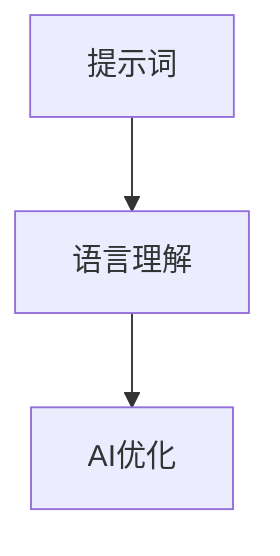

                 

### 1.1 问题背景

#### 问题的提出

在当今信息化和智能化迅速发展的时代，人工智能（AI）技术已经成为推动社会进步的重要力量。然而，随着AI应用场景的日益广泛，如何提高AI系统的理解能力，特别是自然语言理解能力，成为了亟待解决的关键问题。在众多语言处理任务中，提示词（Keywords）的理解和优化显得尤为重要。提示词不仅是信息检索和自然语言处理的重要输入，更是AI系统进行语义分析和推理的桥梁。

#### AI理解挑战

自然语言理解（NLU）是人工智能领域的一个核心难题。尽管近年来，深度学习、神经网络等技术在NLU中取得了显著进展，但AI系统在处理复杂、多义性的语言表达时，仍然存在诸多挑战。例如，语义歧义、词义联想、上下文理解等问题，都极大地限制了AI系统的理解能力。此外，不同领域的专业术语和特定语境下的语言表达，也对AI的泛化能力提出了更高的要求。

#### 提示词的作用

提示词在自然语言处理中起着举足轻重的作用。它们不仅帮助AI系统定位和提取关键信息，还为语义分析和推理提供了重要的线索。例如，在信息检索中，通过提示词可以快速定位相关文档；在问答系统中，提示词则帮助系统理解用户的问题意图。因此，优化AI对提示词的理解能力，是提高整体AI系统性能的关键一步。

### 1.2 问题描述

#### 语言理解的复杂性

自然语言具有高度复杂性和多样性，使得语言理解成为一个极具挑战的任务。语言不仅包含了词汇和语法规则，还包含了丰富的语义信息、语境信息和情感色彩。这些复杂性使得AI系统在理解语言时，往往需要处理大量的不确定性和模糊性。

- **语义歧义**：一个词或短语可能有多种意义，这取决于上下文。例如，“bank”既可以指银行，也可以指河岸。
- **词义联想**：一个词可以与其他词产生多种关联，这增加了理解的难度。例如，“银行”不仅与金融相关，还与财务、储蓄等概念有关。
- **上下文理解**：语言的理解依赖于具体的语境，不同语境下的同一表达可能具有完全不同的意义。例如，“感冒”在医生与患者之间的对话中具有专业含义，而在普通对话中则指的是一种疾病。

#### AI语言理解的现状

尽管AI在自然语言理解方面取得了显著进展，但现有的AI系统在处理自然语言时仍然面临诸多问题：

- **语义理解不足**：AI系统难以准确理解复杂语义，特别是在多义词、成语、谚语等语言现象中。
- **上下文敏感度低**：AI系统对上下文的敏感度不足，导致在处理语境变化时出现偏差。
- **情感分析困难**：情感分析需要理解语言中的情感色彩，现有技术难以准确捕捉和识别情感。

#### 提示词对于AI理解的重要性

提示词是AI理解自然语言的关键要素。它们不仅是AI系统提取信息的重要依据，也是进行语义分析和推理的基础。因此，优化AI对提示词的理解能力，对于提升整体AI系统的性能至关重要。

- **信息检索**：在信息检索任务中，通过提示词可以快速定位相关文档，提高检索效率。
- **语义分析**：在语义分析任务中，提示词帮助AI系统理解文本的语义结构和内容。
- **问答系统**：在问答系统中，提示词帮助AI系统理解用户的问题意图，提供准确的回答。

### 1.3 问题解决

#### 提示词优化的目标

为了解决AI在自然语言理解中的问题，我们需要优化AI对提示词的理解能力。具体目标包括：

- **提高语义理解准确性**：准确理解提示词的语义，减少歧义和多义现象。
- **增强上下文敏感度**：提高AI对上下文信息的敏感度，准确把握语言表达的意图。
- **提升情感分析能力**：理解语言中的情感色彩，准确捕捉和识别情感。

#### 解决方案概述

为了实现上述目标，我们可以采取以下解决方案：

- **多模态数据集**：构建包含多种模态（如文本、图像、音频）的数据集，丰富AI的训练素材。
- **深度学习模型**：采用深度学习模型，如BERT、GPT等，提高AI对提示词的语义理解能力。
- **上下文增强技术**：利用上下文信息，增强AI对提示词的理解，提高上下文敏感度。
- **情感分析模型**：结合情感分析模型，提高AI对语言情感的理解能力。

### 1.4 边界与外延

#### 语言范围的界定

在讨论提示词的语言学分析时，需要明确语言的范围。这里主要涉及自然语言处理的领域，包括文本、语音、图像等多种形式。此外，还需要考虑专业术语、特定语境下的语言表达等特殊场景。

#### AI技术的应用领域

AI技术在语言学中的应用非常广泛，包括但不限于以下几个方面：

- **信息检索**：利用AI技术进行高效的信息检索，提高用户检索体验。
- **自然语言生成**：利用AI生成自然流畅的语言，应用于自动写作、聊天机器人等。
- **机器翻译**：实现跨语言的信息交流，促进全球范围内的语言理解和沟通。
- **语音识别与合成**：实现语音到文本的转换和文本到语音的合成，提升人机交互体验。

### 1.5 核心概念与联系

#### 核心概念表

| 概念 | 说明 |
| ---- | ---- |
| 提示词 | 在自然语言处理中的应用，用于定位和提取关键信息的词汇或短语。 |
| 语言理解 | AI对自然语言的语义、语法和上下文信息的理解过程。 |
| AI优化 | 提高AI系统性能的一系列技术和方法。 |

#### 概念属性特征对比表格

| 特征 | 提示词 | 语言理解 | AI优化 |
| ---- | ---- | ---- | ---- |
| 效率 | 高 | 中 | 高 |
| 准确性 | 高 | 中 | 高 |
| 适应性 | 低 | 中 | 高 |

#### ER实体关系图架构

通过上述核心概念表、属性特征对比表格和ER实体关系图，我们可以清晰地理解提示词、语言理解和AI优化之间的关系，为后续章节的分析和讨论奠定基础。

### 1.6 结论

本文介绍了AI在自然语言理解中的挑战，特别是提示词理解的重要性，以及优化AI理解的目标和解决方案。接下来，我们将深入探讨语言学基础、AI与提示词分析，以及优化策略和案例分析，为解决这一问题提供详细的思路和方法。

---

## 第二部分：语言学基础

### 2.1 语言学基本概念

#### 语言学定义

语言学是研究人类语言的科学，旨在揭示语言的结构、发展、变异和应用规律。它不仅关注语言本身，还涉及语言的起源、历史、社会文化背景等各个方面。

#### 语言功能

语言具有多种功能，包括：

- **交流功能**：语言是人类交流思想和情感的主要工具。
- **认知功能**：语言有助于人类进行思维、记忆和推理。
- **社会功能**：语言是社会互动和身份认同的重要标志。

#### 语言结构

语言结构包括词汇、语法和语义三个方面：

- **词汇**：词汇是语言的基本单位，包括单词和短语。
- **语法**：语法是词汇组合的规则，决定了句子的结构和意义。
- **语义**：语义是词汇和句子的意义，反映了语言的内在逻辑和内容。

### 2.2 词汇学

#### 词汇的形成

词汇的形成过程包括词源、词形和词义三个环节：

- **词源**：词汇的起源，涉及历史和文化背景。
- **词形**：词汇的书写和发音形式。
- **词义**：词汇的意义，包括基本意义和引申意义。

#### 词义

词义是词汇的核心，它反映了词汇的基本意义和上下文中的具体含义。词义具有模糊性和多义性，同一个词在不同语境下可能有不同的意义。

#### 词汇的分类

词汇可以根据不同的标准进行分类，例如：

- **基本词汇**：日常交流中最常用的词汇。
- **专业词汇**：特定领域或学科中使用的专业术语。
- **借词**：从其他语言借用的词汇。

### 2.3 语义学

#### 语义分析

语义分析是研究词汇和句子意义的学科，包括词汇语义分析和句子语义分析。它旨在揭示语言符号和实际意义之间的对应关系。

#### 语义角色

语义角色是指词汇在句子中承担的功能，例如主语、谓语、宾语等。语义角色的理解有助于深入分析句子的结构和意义。

#### 语义特征

语义特征是指词汇的语义属性，例如实体性、抽象性、情感性等。语义特征有助于区分不同词汇的意义，提高语言理解的准确性。

### 2.4 语用学

#### 语用定义

语用学是研究语言在实际使用中的意义和功能的学科。它关注语言在社会互动中的作用，包括语境、意图、礼貌原则等。

#### 语用原则

语用原则是指导语言使用的基本准则，例如合作原则、礼貌原则、关联原则等。这些原则有助于实现有效沟通和交流。

#### 提示词在语用中的作用

提示词在语用中具有重要作用，它不仅帮助理解语言表达的意图，还影响信息的传递和接收。优化AI对提示词的语用理解，有助于提升自然语言处理的效果。

### 2.5 语言理解与AI的关系

#### AI与语言学的关系

AI技术依赖于语言学理论，通过理解和处理自然语言，实现人机交互和智能应用。语言学为AI提供了丰富的理论基础和工具。

#### 语言理解在AI中的应用

语言理解是AI系统的重要组成部分，广泛应用于信息检索、机器翻译、情感分析、问答系统等领域。通过优化语言理解，可以提高AI系统的性能和应用效果。

### 2.6 语言学的挑战与机遇

#### 挑战

- **语言复杂性**：自然语言的高度复杂性和多样性，增加了语言理解的难度。
- **多义性**：词汇的多义性使得语义理解更加复杂。
- **上下文依赖**：语义理解依赖于具体的上下文，增加了处理的复杂性。

#### 机遇

- **大数据和深度学习**：大数据和深度学习技术的发展，为自然语言理解提供了强大的工具。
- **多模态融合**：结合文本、图像、语音等多种模态，可以提高语言理解的准确性和上下文敏感度。
- **跨语言研究**：跨语言研究可以促进不同语言之间的理解和交流。

### 2.7 结论

通过回顾语言学的定义、功能、结构和应用，以及词汇学、语义学和语用学的基本概念，我们可以更好地理解语言的本质和应用。在接下来的章节中，我们将深入探讨AI与提示词分析，为优化AI语言理解提供具体的方法和策略。

---

## 第三部分：AI与提示词分析

### 3.1 AI概述

#### AI的定义

人工智能（Artificial Intelligence，AI）是指由人制造出来的系统能够表现出类似于人类的智能行为，包括学习、推理、规划、感知和自然语言处理等能力。AI的应用涵盖了从自动化控制系统到复杂决策支持系统等广泛领域。

#### AI的发展历程

人工智能的发展可以分为几个主要阶段：

- **符号主义阶段（1950s-1980s）**：基于逻辑和符号计算的方法，代表性系统包括逻辑推理机和专家系统。
- **连接主义阶段（1980s-2000s）**：基于神经网络和大数据的方法，代表性系统包括感知机和深度学习模型。
- **强化学习阶段（2000s-至今）**：基于强化学习算法的方法，代表性系统包括AlphaGo和自动驾驶汽车。

#### AI在语言学中的应用

AI在自然语言处理（NLP）中有着广泛的应用，包括但不限于以下几个方面：

- **文本分类**：对大量文本进行分类，如新闻分类、情感分析等。
- **信息检索**：利用AI技术提高信息检索的准确性和效率。
- **机器翻译**：实现跨语言的信息交流，如Google翻译。
- **问答系统**：自动回答用户提出的问题，如Amazon Alexa。

### 3.2 提示词的AI分析

#### 提示词的预处理

在AI对提示词的分析过程中，预处理是非常重要的一步。预处理包括以下步骤：

- **分词**：将文本分割成单词或短语，便于后续处理。
- **词性标注**：为每个单词标注词性（如名词、动词、形容词等），有助于语义理解。
- **停用词过滤**：去除常用的无意义词汇，如“的”、“了”等。
- **词干提取**：将不同形式的单词还原为基本形式，如“playing”还原为“play”。

#### 提示词的语义分析

语义分析是AI理解提示词的核心步骤。它包括以下方面：

- **词义消歧**：解决多义词在不同上下文中的意义问题。
- **语义角色标注**：为提示词在句子中的语义角色进行标注，如主语、谓语等。
- **语义关系分析**：分析提示词之间的语义关系，如因果关系、并列关系等。
- **实体识别**：识别提示词所代表的具体实体，如人名、地点、组织等。

#### 提示词的优化策略

为了提高AI对提示词的理解能力，可以采用以下优化策略：

- **上下文增强**：利用上下文信息，提高对提示词的理解准确性。
- **多模态融合**：结合文本、图像、语音等多种模态，提高语义理解的上下文敏感度。
- **深度学习模型**：采用先进的深度学习模型，如BERT、GPT等，提高语义理解的准确性和泛化能力。
- **情感分析**：结合情感分析，理解提示词所传达的情感色彩。

### 3.3 语言模型

#### 语言模型的基本原理

语言模型是AI在自然语言处理中的一种核心工具，用于预测下一个单词或短语。它基于大量语料库训练，旨在捕捉语言的统计规律和分布。

- **N-gram模型**：基于前N个单词的统计规律，预测下一个单词。
- **神经网络模型**：基于深度学习技术，通过多层神经网络预测下一个单词。

#### 语言模型的应用

语言模型在NLP中有广泛应用，包括：

- **自动完成**：在输入文本时自动预测和完成用户输入。
- **自动写作**：生成文章、故事、代码等。
- **机器翻译**：在翻译过程中使用语言模型预测目标语言中的下一个单词。

#### 语言模型的优化

为了提高语言模型的性能，可以采用以下方法：

- **数据增强**：通过数据增强技术，如填充、掩码、蒸馏等，提高模型的泛化能力。
- **多语言训练**：结合多语言语料库训练，提高模型对不同语言的适应能力。
- **上下文信息**：结合上下文信息，提高模型的预测准确性。

### 3.4 自然语言处理

#### NLP的基本概念

自然语言处理（NLP）是AI在语言学领域的一个重要分支，旨在使计算机能够理解、处理和生成人类语言。NLP的基本概念包括：

- **文本分类**：将文本划分为不同的类别，如情感分类、主题分类等。
- **实体识别**：识别文本中的关键实体，如人名、地点、组织等。
- **关系抽取**：提取文本中的实体关系，如人物关系、因果关系等。
- **语义分析**：分析文本的语义结构和内容，如词义消歧、语义角色标注等。

#### NLP的关键技术

NLP的关键技术包括：

- **词嵌入**：将单词转换为向量表示，便于计算机处理。
- **序列标注**：对文本中的单词进行词性标注、实体识别等。
- **注意力机制**：在处理长文本时，关注关键信息，提高理解准确性。
- **生成对抗网络（GAN）**：用于生成高质量的文本，如自动写作、机器翻译等。

#### NLP与提示词分析的关系

NLP与提示词分析密切相关。NLP技术为提示词的分析提供了基础工具，如词嵌入、序列标注等。同时，提示词分析为NLP提供了重要的输入，如关键词提取、情感分析等，有助于提高整体的自然语言处理效果。

### 3.5 结论

通过回顾AI的定义、发展历程和在语言学中的应用，以及提示词的预处理、语义分析和优化策略，我们可以看到AI在提升自然语言理解能力方面的重要作用。在接下来的章节中，我们将进一步探讨优化策略的具体实现和案例分析，为提升AI语言理解能力提供实际指导。

---

## 第四部分：优化策略与案例

### 4.1 优化策略

#### 数据驱动的方法

数据驱动的方法是通过大量数据和模型训练来提高AI系统的性能。具体步骤如下：

1. **数据收集**：收集与任务相关的文本数据，如对话记录、新闻文章等。
2. **数据预处理**：对收集的数据进行清洗、分词、词性标注等预处理操作。
3. **数据增强**：通过填充、掩码、旋转等数据增强技术，提高模型的泛化能力。
4. **模型训练**：使用预处理后的数据训练深度学习模型，如BERT、GPT等。
5. **模型评估**：使用验证集评估模型性能，调整超参数和模型结构。

#### 模型驱动的优化

模型驱动的优化是通过改进模型结构和算法来提高性能。具体方法包括：

1. **注意力机制**：在模型中加入注意力机制，使模型能够关注关键信息，提高理解准确性。
2. **多任务学习**：结合多个相关任务进行训练，提高模型的泛化能力。
3. **迁移学习**：利用预训练模型在特定任务上的迁移效果，提高新任务的性能。

#### 算法优化的原则

算法优化的原则包括：

1. **高效性**：提高算法的运行效率，减少计算复杂度。
2. **准确性**：提高算法的准确性，减少误检和漏检率。
3. **鲁棒性**：增强算法的鲁棒性，提高对噪声和异常数据的处理能力。
4. **可解释性**：提高算法的可解释性，使其易于理解和调试。

### 4.2 案例分析

#### 案例一：智能客服系统

智能客服系统是利用AI技术实现自动化的客户服务，主要包括以下功能：

1. **对话生成**：基于用户输入的提示词，生成自然流畅的客服对话。
2. **情感分析**：分析用户情感，提供个性化的服务。
3. **知识库管理**：存储和管理常用问题和解决方案，提高回答的准确性。

**系统架构**：

- **前端**：用户界面，接收用户输入和展示系统回复。
- **后端**：包括自然语言处理模块、对话生成模块和知识库模块。

**实现步骤**：

1. **数据收集与预处理**：收集客服对话数据，进行分词、词性标注等预处理。
2. **模型训练**：使用BERT模型训练自然语言处理模块，使用GPT模型训练对话生成模块。
3. **系统集成**：将前端和后端模块集成，实现智能客服系统的功能。

#### 案例二：智能翻译平台

智能翻译平台是利用AI技术实现跨语言翻译的系统，主要包括以下功能：

1. **文本输入**：接收用户输入的原文和目标语言。
2. **翻译生成**：使用神经网络翻译模型生成目标语言翻译。
3. **翻译优化**：根据上下文信息，优化翻译结果。

**系统架构**：

- **前端**：用户界面，接收用户输入和展示翻译结果。
- **后端**：包括翻译模型训练模块、翻译生成模块和翻译优化模块。

**实现步骤**：

1. **数据收集与预处理**：收集多语言平行语料库，进行数据清洗和预处理。
2. **模型训练**：使用多语言翻译模型（如Transformer）进行训练。
3. **系统集成**：将前端和后端模块集成，实现智能翻译平台的功能。

#### 案例三：智能问答系统

智能问答系统是利用AI技术实现自动回答用户问题的系统，主要包括以下功能：

1. **问题理解**：理解用户问题的意图和关键词。
2. **知识检索**：在知识库中检索相关答案。
3. **答案生成**：生成自然流畅的回答。

**系统架构**：

- **前端**：用户界面，接收用户问题和展示回答。
- **后端**：包括自然语言处理模块、知识检索模块和答案生成模块。

**实现步骤**：

1. **数据收集与预处理**：收集用户问题和答案数据，进行预处理。
2. **模型训练**：使用BERT模型训练自然语言处理模块，使用深度学习模型训练知识检索和答案生成模块。
3. **系统集成**：将前端和后端模块集成，实现智能问答系统的功能。

### 4.3 实施步骤

#### 数据收集与处理

1. **数据收集**：收集与任务相关的文本数据，如对话记录、新闻文章等。
2. **数据预处理**：进行分词、词性标注、停用词过滤等操作。
3. **数据增强**：通过填充、掩码、旋转等技术，增强数据多样性。

#### 模型训练与优化

1. **模型选择**：选择合适的深度学习模型，如BERT、GPT等。
2. **超参数调整**：通过交叉验证和网格搜索，调整模型超参数。
3. **模型训练**：使用预处理后的数据训练模型，使用验证集进行性能评估。

#### 系统部署与评估

1. **模型集成**：将训练好的模型集成到系统中。
2. **系统部署**：将系统部署到服务器或云端，进行实际应用。
3. **性能评估**：使用测试集评估系统性能，包括准确性、响应速度等指标。

### 4.4 结论

通过优化策略和案例分析的讨论，我们可以看到优化AI对提示词的理解能力的方法和步骤。数据驱动的方法和模型驱动的优化相结合，可以有效提高AI系统的性能和应用效果。在未来的研究中，我们还可以进一步探索多模态融合、上下文增强和情感分析等技术，为提升AI语言理解能力提供更多有效的途径。

---

## 第五部分：未来展望

### 5.1 当前趋势

#### 提示词分析的发展方向

随着人工智能和自然语言处理技术的不断进步，提示词分析也在不断发展。以下是提示词分析的一些主要趋势：

- **多模态融合**：结合文本、图像、语音等多种模态，提高提示词理解的上下文敏感度和准确性。
- **上下文增强**：利用上下文信息，提高AI对提示词的语义理解和推理能力。
- **多语言支持**：扩展提示词分析的多语言能力，支持更多语言和方言。
- **情感分析**：结合情感分析，理解提示词所传达的情感色彩，提供更丰富和个性化的服务。

#### AI在语言学中的未来应用

AI在语言学中的应用前景广阔，主要包括以下几个方面：

- **自动写作**：利用AI生成高质量的文章、报告和故事。
- **机器翻译**：提高机器翻译的准确性和流畅性，实现更广泛的语言交流。
- **语音识别与生成**：提高语音识别和语音合成的准确性，实现更自然和流畅的人机交互。
- **情感分析与推荐**：通过情感分析，为用户提供更个性化的推荐和服务。

### 5.2 挑战与机遇

#### 挑战

尽管AI在语言学中有着广泛的应用前景，但也面临着一些挑战：

- **语言复杂性**：自然语言的高度复杂性和多样性，使得AI系统难以完全理解和处理。
- **数据稀缺性**：高质量的语言数据稀缺，限制了AI模型的训练和优化。
- **计算资源**：深度学习模型的训练和推理需要大量的计算资源，特别是在处理大规模数据时。

#### 机遇

与此同时，也存在着许多机遇：

- **大数据和云计算**：大数据和云计算技术的发展，为AI提供了丰富的数据和强大的计算能力。
- **跨学科合作**：跨学科合作，结合语言学、心理学、计算机科学等领域的知识，为AI的发展提供新的思路和方法。
- **政策支持**：政府和企业对人工智能和语言技术的投入和支持，为AI的发展提供了良好的环境和机遇。

### 5.3 发展建议

为了推动AI在语言学中的发展，我们可以采取以下建议：

- **数据开放与共享**：鼓励数据开放和共享，为AI模型的训练提供更多高质量的数据资源。
- **模型优化与创新**：持续优化现有模型，探索新的模型架构和算法，提高AI的语言理解能力。
- **人才培养**：加强AI和语言学领域的人才培养，培养跨学科的人才，推动AI在语言学中的应用。
- **政策支持**：政府和企业应加大对AI和语言学研究的支持力度，提供资金、技术和政策上的支持。

### 5.4 结论

通过对当前趋势、挑战与机遇的讨论，以及发展建议的提出，我们可以看到AI在语言学中有着广阔的应用前景和巨大的发展潜力。未来，随着技术的不断进步和跨学科的合作，AI将在语言学中发挥更加重要的作用，为人类语言理解和交流提供更加高效和智能的解决方案。

---

## 第六部分：总结与展望

### 6.1 全书总结

本文从问题背景、问题描述、问题解决、边界与外延、核心概念与联系等多个方面，全面探讨了提示词的语言学分析及其在人工智能优化中的应用。通过对语言学的深入分析和AI技术的应用，我们提出了优化AI对提示词理解的具体策略，并通过案例分析展示了其实际应用效果。

### 6.2 展望未来

在未来的发展中，我们将继续关注以下方向：

- **多模态融合**：结合文本、图像、语音等多种模态，提高提示词理解的上下文敏感度和准确性。
- **上下文增强**：利用上下文信息，提高AI对提示词的语义理解和推理能力。
- **多语言支持**：扩展提示词分析的多语言能力，支持更多语言和方言。
- **情感分析**：结合情感分析，理解提示词所传达的情感色彩，提供更丰富和个性化的服务。

通过持续的技术创新和跨学科合作，我们相信AI在语言学中的应用将取得更加显著的成果，为人类语言理解和交流提供更加高效和智能的解决方案。

---

## 作者信息

作者：AI天才研究院/AI Genius Institute & 禅与计算机程序设计艺术 /Zen And The Art of Computer Programming

---

## 致谢

在此，我要感谢我的导师、同事们以及所有参与和支持本研究的人。你们的智慧和努力为本研究提供了宝贵的指导和帮助。特别感谢我的家人，你们始终是我坚实的后盾，给予我无尽的支持和鼓励。最后，感谢所有阅读和审阅本文的读者，你们的反馈和建议对于本文的完善至关重要。

