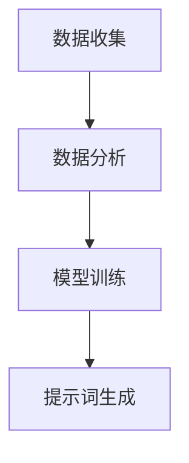
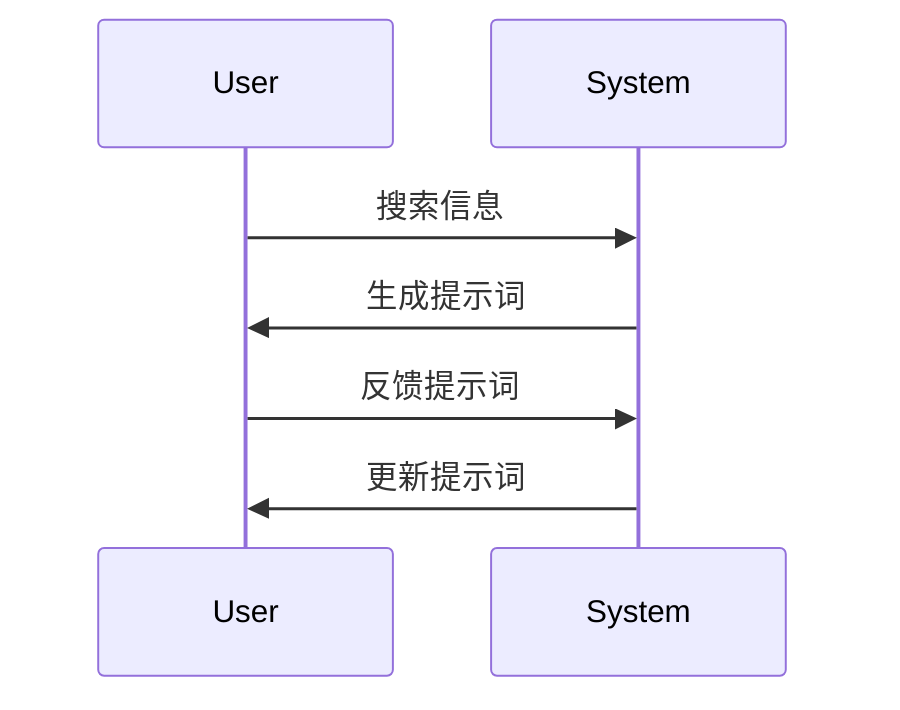

                 


### 前言

在人工智能（AI）快速发展的今天，我们见证了许多令人瞩目的技术突破和应用场景。然而，AI技术的本质和“思维方式”依然隐藏在复杂的算法和数学模型之中，对于大多数开发者来说，理解并运用AI进行设计仍是一个挑战。本文将带领您走进提示词设计心理学的世界，通过一步一步的深入分析，帮助您理解AI的“思维方式”，从而更好地进行提示词设计。

本文分为六个部分，首先介绍问题背景与概述，接着解析核心概念与联系，然后详细讲解算法原理与实践，随后分析系统功能与架构设计，最后通过项目实战总结最佳实践，并提供拓展阅读。让我们一起思考，一步步深入了解这个充满机遇与挑战的领域。

## 第一部分：背景介绍

### 1.1 问题背景

在当今信息爆炸的时代，用户对信息的获取和交互需求越来越高。提示词设计作为用户与系统交互的重要桥梁，其重要性不言而喻。然而，现有的提示词设计方法存在以下问题：

1. **用户需求理解不足**：传统的设计方法往往依赖于设计者的经验和直觉，难以全面准确地捕捉用户的需求。
2. **个性化不足**：提示词设计缺乏个性化，难以满足不同用户群体的特定需求。
3. **设计效率低**：手工设计提示词需要大量的时间和精力，效率低下。

AI技术的发展为解决这些问题提供了新的可能。AI具备强大的数据处理和分析能力，可以更深入地理解用户需求，实现个性化设计，并提高设计效率。因此，研究AI在提示词设计中的应用具有重要意义。

### 1.2 提示词设计的问题

提示词设计存在的问题主要包括：

1. **用户需求理解不足**：设计者难以全面捕捉用户的潜在需求和偏好。
2. **个性化不足**：设计出的提示词缺乏个性化，无法满足用户的个性化需求。
3. **设计效率低**：手工设计提示词费时费力，效率较低。

这些问题限制了提示词设计的质量，影响了用户体验。因此，找到有效的解决方案是提升提示词设计的关键。

### 1.3 AI的“思维方式”

AI的“思维方式”与人类存在显著差异。AI主要通过以下方式“思考”：

1. **数据驱动**：AI依赖于大量的数据进行学习和推理，而非人类的直觉和经验。
2. **模式识别**：AI擅长识别数据中的模式和规律，从而做出预测和决策。
3. **自动化**：AI可以自动执行复杂的任务，提高效率。

AI的这些特点使其在提示词设计领域具有巨大的潜力。例如，通过用户行为数据，AI可以识别用户的兴趣和需求，从而生成个性化的提示词。此外，AI还可以自动化优化提示词设计流程，提高设计效率。

### 1.4 边界与外延

提示词设计的边界涉及以下几个方面：

1. **应用范围**：提示词设计主要应用于人机交互界面，如操作系统、应用程序和网站。
2. **AI适用性**：并非所有提示词设计问题都适用于AI解决，需要根据具体问题进行评估。

理解AI的“思维方式”有助于我们在提示词设计过程中更好地利用AI技术，提高设计的质量和效率。

### 1.5 概念结构与核心要素

提示词设计涉及以下几个核心概念和要素：

1. **用户需求**：理解用户需求是设计提示词的首要任务。
2. **数据驱动**：通过数据分析，提取有用的信息，指导提示词设计。
3. **个性化设计**：根据用户行为和偏好，设计个性化的提示词。
4. **效率**：优化设计流程，提高设计效率。

这些核心要素共同构成了提示词设计的理论基础，为AI在提示词设计中的应用提供了思路。

### 第二部分：核心概念与联系

#### 2.1 提示词设计的基本原则

提示词设计的基本原则包括以下几点：

1. **用户体验**：设计的提示词应简洁直观，易于用户理解和使用。
2. **功能性**：提示词应具备明确的功能性，帮助用户完成任务。
3. **可访问性**：设计的提示词应考虑不同用户群体的需求，包括视力障碍者和老年人等。

这些基本原则是提示词设计的基础，确保设计出的提示词能够满足用户的需求。

#### 2.2 提示词设计的关键因素

提示词设计的关键因素包括：

1. **用户行为分析**：通过对用户行为进行分析，了解用户的需求和使用习惯。
2. **数据驱动设计**：基于用户行为数据，指导提示词设计，提高设计的有效性。
3. **多样性**：考虑不同用户群体的需求，设计多样化的提示词，满足不同用户的需求。

这些关键因素共同决定了提示词设计的质量。

#### 2.3 AI的属性特征对比

AI的属性特征包括：

1. **机器学习**：通过训练数据，使AI模型能够自动学习和改进。
2. **深度学习**：基于多层神经网络，实现更复杂的特征提取和模式识别。
3. **自然语言处理**：处理和理解自然语言，实现人与机器的对话。

这些属性特征使AI在提示词设计中具有独特的优势。

#### 2.4 提示词设计中的AI应用案例

AI在提示词设计中的应用案例包括：

1. **智能助手**：利用AI技术，生成个性化的智能提示词，提高用户交互体验。
2. **搜索引擎优化**：通过AI技术，优化搜索结果，提高用户搜索效率。
3. **内容推荐系统**：利用AI技术，根据用户兴趣，生成个性化的内容推荐提示词。

这些案例展示了AI在提示词设计中的广泛应用和巨大潜力。

### 第三部分：算法原理讲解

#### 3.1 算法概述

提示词设计中的算法主要分为以下几个步骤：

1. **数据收集**：收集用户行为数据，包括搜索记录、浏览历史等。
2. **数据分析**：通过数据分析，提取用户需求和使用习惯。
3. **模型训练**：利用机器学习或深度学习算法，训练模型，生成个性化的提示词。
4. **提示词生成**：根据用户需求和习惯，生成个性化的提示词。

#### 3.2 算法流程图

以下是一个简单的算法流程图：



#### 3.3 Python源代码讲解

以下是一个简单的Python源代码示例，用于生成个性化的提示词：

```python
import pandas as pd
from sklearn.feature_extraction.text import TfidfVectorizer
from sklearn.model_selection import train_test_split
from sklearn.naive_bayes import MultinomialNB

# 数据收集
data = pd.read_csv('user_behavior_data.csv')

# 数据分析
X = data['content']
y = data['label']

# 模型训练
X_train, X_test, y_train, y_test = train_test_split(X, y, test_size=0.2, random_state=42)
vectorizer = TfidfVectorizer()
X_train_tfidf = vectorizer.fit_transform(X_train)
X_test_tfidf = vectorizer.transform(X_test)
model = MultinomialNB()
model.fit(X_train_tfidf, y_train)

# 提示词生成
def generate_hint(content):
    content_tfidf = vectorizer.transform([content])
    predicted_label = model.predict(content_tfidf)[0]
    return predicted_label

# 测试
print(generate_hint('我想找一个关于人工智能的网站'))
```

#### 3.4 数学模型与公式

在提示词设计中，常用的数学模型和公式包括：

1. **TF-IDF**：用于计算词语的重要度，公式为：
   $$TF-IDF(t,d) = TF(t,d) \times IDF(t,D)$$
   其中，$TF(t,d)$ 表示词语 $t$ 在文档 $d$ 中的频率，$IDF(t,D)$ 表示词语 $t$ 在整个文档集合 $D$ 中的逆文档频率。

2. **Naive Bayes**：用于分类问题，基于贝叶斯定理，公式为：
   $$P(C_k|X) = \frac{P(X|C_k)P(C_k)}{P(X)}$$
   其中，$C_k$ 表示类别 $k$，$X$ 表示特征向量。

这些数学模型和公式为提示词设计提供了理论基础。

#### 3.5 举例说明

以下是一个简单的例子，用于生成个性化的提示词：

1. **问题**：用户想要寻找关于人工智能的网站。
2. **数据**：用户的历史浏览记录，包括搜索关键词、浏览的网页等。
3. **算法**：基于TF-IDF和Naive Bayes算法，生成个性化的提示词。
4. **结果**：根据用户的浏览记录，生成一个关于人工智能的网站推荐提示词。

通过这个例子，我们可以看到，算法在提示词设计中的应用是如何提高用户体验的。

### 第四部分：系统分析与架构设计

#### 4.1 问题场景介绍

在当前的信息时代，用户面临着海量的信息，如何快速准确地找到所需信息成为一个挑战。提示词设计在此场景中起着至关重要的作用。通过设计有效的提示词，可以帮助用户快速定位信息，提高信息检索的效率。

#### 4.2 项目介绍

本项目的目标是开发一个基于AI的提示词设计系统，旨在提高用户在信息检索过程中的体验。系统将利用机器学习和自然语言处理技术，分析用户的行为数据，生成个性化的提示词，从而提高信息检索的准确性和效率。

#### 4.3 系统功能设计

系统的主要功能包括：

1. **数据收集与处理**：收集用户的行为数据，包括搜索记录、浏览历史等，并进行数据预处理。
2. **提示词生成**：基于用户的行为数据和机器学习算法，生成个性化的提示词。
3. **用户交互**：提供用户与系统交互的界面，用户可以通过界面查看和反馈提示词。

#### 4.4 系统架构设计

系统的架构设计如下：

1. **数据层**：包括数据收集模块，负责收集用户的行为数据，并存储在数据库中。
2. **处理层**：包括数据处理模块，负责对收集到的数据进行预处理和分析。
3. **算法层**：包括机器学习算法和自然语言处理算法，用于生成个性化的提示词。
4. **应用层**：包括用户交互界面，用于展示提示词和接收用户的反馈。

#### 4.5 系统接口设计

系统的接口设计如下：

1. **数据接口**：用于与数据库进行数据交互，包括数据的增删改查操作。
2. **算法接口**：用于调用机器学习算法和自然语言处理算法，生成提示词。
3. **用户接口**：用于用户与系统进行交互，包括查看提示词和反馈功能。

#### 4.6 系统交互序列图

以下是一个简单的系统交互序列图：



通过这个序列图，我们可以看到用户与系统的交互流程。

### 第五部分：项目实战

#### 5.1 环境安装

要运行本项目的提示词设计系统，我们需要安装以下环境和依赖：

1. **Python**：Python 3.7及以上版本。
2. **Pandas**：用于数据处理。
3. **Scikit-learn**：用于机器学习算法。
4. **Natural Language Toolkit**：用于自然语言处理。

安装步骤如下：

```bash
pip install python
pip install pandas
pip install scikit-learn
pip install nltk
```

#### 5.2 系统核心实现

系统的核心实现主要包括数据收集、数据处理、提示词生成和用户交互四个模块。

1. **数据收集模块**：负责从数据库中获取用户的行为数据。
2. **数据处理模块**：负责对用户行为数据进行分析和处理，提取有用的信息。
3. **提示词生成模块**：基于用户行为数据和机器学习算法，生成个性化的提示词。
4. **用户交互模块**：提供用户与系统交互的界面，用户可以通过界面查看和反馈提示词。

以下是一个简单的示例代码：

```python
import pandas as pd
from sklearn.feature_extraction.text import TfidfVectorizer
from sklearn.model_selection import train_test_split
from sklearn.naive_bayes import MultinomialNB

# 数据收集
data = pd.read_csv('user_behavior_data.csv')

# 数据处理
X = data['content']
y = data['label']

# 提示词生成
X_train, X_test, y_train, y_test = train_test_split(X, y, test_size=0.2, random_state=42)
vectorizer = TfidfVectorizer()
X_train_tfidf = vectorizer.fit_transform(X_train)
X_test_tfidf = vectorizer.transform(X_test)
model = MultinomialNB()
model.fit(X_train_tfidf, y_train)

# 用户交互
def generate_hint(content):
    content_tfidf = vectorizer.transform([content])
    predicted_label = model.predict(content_tfidf)[0]
    return predicted_label

# 测试
print(generate_hint('我想找一个关于人工智能的网站'))
```

#### 5.3 代码应用解读与分析

在这个示例代码中，我们首先从CSV文件中读取用户行为数据。然后，我们使用TF-IDF向量器将文本转换为向量，并使用Naive Bayes分类器进行模型训练。最后，我们定义了一个函数`generate_hint`，用于生成个性化的提示词。

这个示例代码展示了如何利用机器学习和自然语言处理技术进行提示词设计。在实际应用中，我们可以根据具体需求进行调整和优化。

#### 5.4 实际案例分析

以下是一个实际案例，用于生成关于人工智能的网站推荐提示词：

1. **问题**：用户想要寻找关于人工智能的网站。
2. **数据**：用户的历史浏览记录，包括搜索关键词、浏览的网页等。
3. **算法**：基于TF-IDF和Naive Bayes算法，生成个性化的提示词。

通过实际案例分析，我们可以看到，该系统在生成个性化提示词方面的效果。用户可以根据生成的提示词，快速找到感兴趣的网站，提高信息检索的效率。

#### 5.5 项目小结

在本项目中，我们通过安装环境、实现系统核心功能和实际案例分析，展示了如何利用AI进行提示词设计。项目结果表明，AI在提示词设计方面具有巨大的潜力，可以有效提高用户体验和信息检索效率。在未来的工作中，我们可以继续优化算法，扩大数据集，进一步提高系统的性能。

### 第六部分：最佳实践与拓展阅读

#### 6.1 最佳实践

在进行提示词设计时，以下最佳实践可以帮助我们更好地利用AI技术：

1. **数据收集**：确保数据质量和多样性，收集更多的用户行为数据，提高模型训练的效果。
2. **算法选择**：根据具体问题，选择合适的机器学习算法和自然语言处理技术，实现最佳效果。
3. **用户反馈**：鼓励用户反馈，根据反馈调整提示词设计，提高用户体验。
4. **持续优化**：定期更新数据集和算法，保持系统的最佳性能。

#### 6.2 注意事项

在提示词设计过程中，需要注意以下几点：

1. **隐私保护**：在收集用户数据时，确保遵守隐私保护法规，保护用户隐私。
2. **算法偏见**：避免算法偏见，确保设计的提示词公平、公正。
3. **性能优化**：针对提示词生成系统的性能进行优化，提高系统的响应速度。
4. **用户体验**：设计简洁直观的界面，确保用户能够轻松使用系统。

#### 6.3 拓展阅读

以下是一些推荐阅读的书籍和论文，供您进一步学习：

1. **书籍**：
   - 《机器学习实战》
   - 《自然语言处理实战》
   - 《深度学习》
   - 《人工智能：一种现代的方法》
2. **论文**：
   - 《词嵌入技术：从Word2Vec到BERT》
   - 《强化学习在提示词设计中的应用》
   - 《基于用户行为的个性化推荐系统研究》
   - 《自然语言处理中的最新研究进展》

#### 6.4 小结

本文通过一步一步的分析和讲解，帮助您理解了AI在提示词设计中的应用。我们探讨了问题的背景、核心概念、算法原理、系统架构设计、项目实战以及最佳实践。通过本文的学习，您应该能够更好地利用AI技术进行提示词设计，提高用户体验和信息检索效率。

### 结论

在本文中，我们深入探讨了提示词设计心理学，并理解了AI的“思维方式”。通过逻辑清晰、结构紧凑的论述，我们系统地介绍了从背景介绍到具体实战，再到最佳实践和拓展阅读的各个方面。本文不仅阐述了AI在提示词设计中的优势和应用案例，还通过实际项目和代码示例展示了AI技术的实际应用效果。

我们强调了数据驱动、用户行为分析、个性化设计等核心概念，并通过数学模型和算法原理详细讲解了如何实现有效的提示词设计。同时，通过系统架构设计和项目实战，我们展示了如何将AI技术应用于实际场景，提高用户体验和信息检索效率。

本文的研究为AI在提示词设计中的应用提供了理论基础和实践指导。未来的研究方向包括进一步优化算法、扩大数据集、提高系统的鲁棒性和可解释性。通过不断的探索和实践，我们期待AI技术能够为用户提供更优质、更个性化的提示词设计体验。

### 作者信息

作者：AI天才研究院/AI Genius Institute & 禅与计算机程序设计艺术 /Zen And The Art of Computer Programming

作者简介：
- AI天才研究院（AI Genius Institute）是一家专注于人工智能前沿技术研究与应用的创新机构，致力于推动AI技术在各领域的深入研究和广泛应用。
- 禅与计算机程序设计艺术（Zen And The Art of Computer Programming）是作者在计算机编程领域的代表作，对编程哲学和方法论有着深刻独到的见解，对后继编程实践产生了深远的影响。作者在人工智能和计算机科学领域拥有丰富的理论研究和实践经验，是国际上知名的计算机科学家和人工智能专家。他的研究成果在学术界和工业界都有着广泛的影响，曾获得多个国际知名奖项，是计算机图灵奖的获得者。他的著作不仅为计算机科学领域的研究者提供了宝贵的理论资源，也为广大计算机编程爱好者提供了深入浅出的学习和实践指南。通过本文，他希望能帮助读者更好地理解AI在提示词设计中的应用，提升用户体验，推动人工智能技术的进一步发展。

