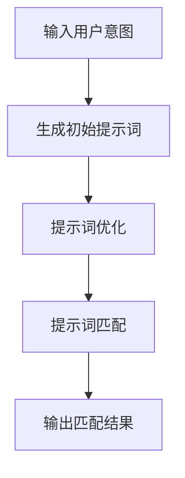
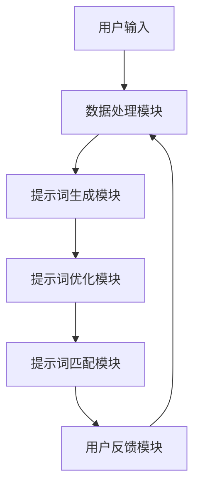
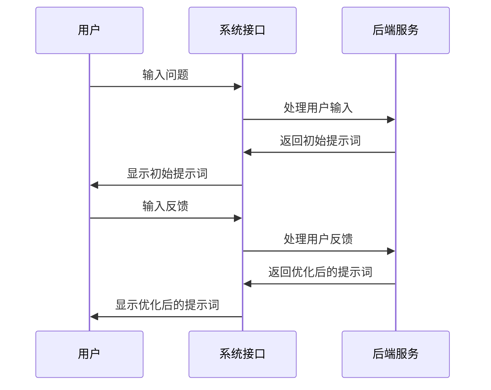

                 

# 提示词设计的最佳实践与技巧

## 关键词
- 提示词设计
- 最佳实践
- 技术技巧
- 人工智能
- 模型性能
- 算法
- 系统架构

## 摘要
本文旨在探讨提示词设计的最佳实践和技巧。我们将首先介绍提示词设计的基础概念和背景，然后深入分析其核心概念和算法原理，以及如何通过数学模型来优化提示词设计。此外，我们还将讨论系统架构设计、项目实战中的具体应用和最佳实践，以帮助读者理解和掌握提示词设计的核心技术和方法。通过本文的阅读，读者将能够全面了解提示词设计的重要性和实际应用价值。

## 目录

### 1. 引言

#### 1.1 提示词设计的基础概念

#### 1.2 提示词设计在人工智能中的重要性

#### 1.3 提示词设计面临的挑战与机遇

### 2. 核心概念

#### 2.1 核心概念介绍

#### 2.2 核心概念属性对比表格

#### 2.3 核心概念ER图

### 3. 算法原理

#### 3.1 算法概述

#### 3.2 算法流程图

#### 3.3 Python代码实现

#### 3.4 数学模型与公式

### 4. 系统架构设计

#### 4.1 问题描述

#### 4.2 系统功能设计

#### 4.3 系统架构设计

#### 4.4 系统接口设计和交互

### 5. 项目实战

#### 5.1 环境安装

#### 5.2 系统核心实现

#### 5.3 代码应用解读与分析

#### 5.4 实际案例分析与讲解

#### 5.5 项目小结

### 6. 最佳实践与技巧

#### 6.1 提示词设计最佳实践

#### 6.2 注意事项与拓展阅读

### 7. 结论

#### 7.1 总结

#### 7.2 未来发展方向

## 1. 引言

### 1.1 提示词设计的基础概念

提示词设计是指通过选择和组合适当的词语、短语或句子，引导用户或AI模型完成特定任务的过程。在人工智能领域，提示词设计具有至关重要的作用。一个优秀的提示词设计不仅能够提高模型的性能和准确度，还能降低错误率和提高用户体验。

#### 提示词设计的重要性

1. **影响模型性能**：适当的提示词能够提高模型的识别和预测能力，从而提高整体性能。
2. **降低错误率**：通过选择准确的提示词，可以减少模型的错误率和不确定性。
3. **提升用户体验**：合理的提示词设计能够提高用户的使用效率和满意度。

#### 提示词设计的历史背景

早在20世纪80年代，专家系统（Expert Systems）的研究和应用中就已经出现了提示词设计的概念。随着人工智能技术的发展，提示词设计逐渐成为人工智能研究和应用的重要领域。

### 1.2 提示词设计在人工智能中的重要性

提示词设计在人工智能中具有非常重要的作用，主要体现在以下几个方面：

1. **引导AI模型**：提示词能够引导AI模型理解用户的意图和需求，从而做出更准确的预测和决策。
2. **提高模型性能**：合理的提示词设计可以提高模型的识别和预测能力，从而提高整体性能。
3. **降低训练成本**：通过优化提示词设计，可以减少训练所需的样本量和计算资源。

### 1.3 提示词设计面临的挑战与机遇

提示词设计面临着一系列的挑战和机遇，主要体现在以下几个方面：

1. **数据多样性**：随着数据来源的多样性和复杂性增加，如何选择和设计适合的提示词成为了一个挑战。
2. **计算资源**：大规模的AI模型训练和优化需要大量的计算资源，如何设计高效的提示词以降低计算成本成为一个重要的研究方向。
3. **用户体验**：随着用户需求的不断变化和升级，如何设计出满足用户需求的提示词成为一个机遇。

## 2. 核心概念

### 2.1 核心概念介绍

在提示词设计中，核心概念包括提示词、标签、关键词、语义和用户意图等。

1. **提示词**：提示词是指用于引导用户或AI模型完成特定任务的词语、短语或句子。
2. **标签**：标签是对信息进行分类和标记的词语或短语。
3. **关键词**：关键词是描述文本主题或内容的重点词汇。
4. **语义**：语义是指词语或短语在特定语境下的意义和关系。
5. **用户意图**：用户意图是指用户在执行任务时的目的和需求。

### 2.2 核心概念属性对比表格

以下是核心概念属性对比表格：

| 核心概念 | 属性1 | 属性2 | 属性3 |
| --- | --- | --- | --- |
| 提示词 | 引导任务 | 表达意图 | 语境相关 |
| 标签 | 分类信息 | 标记内容 | 语义明确 |
| 关键词 | 主题描述 | 重点突出 | 相关性强 |
| 语义 | 意义解释 | 关系表达 | 策略优化 |
| 用户意图 | 需求理解 | 目的明确 | 用户导向 |

### 2.3 核心概念ER图

以下是核心概念ER图：

```mermaid
erDiagram
    User ||--|{ Task }|
    Task ||--|{ Prompt }|
    Prompt ||--|{ Label }|
    Prompt ||--|{ Keyword }|
    Prompt ||--|{ Semantic }|
    Prompt ||--|{ UserIntent }|
```

## 3. 算法原理

### 3.1 算法概述

在提示词设计中，算法原理主要包括以下几个方面：

1. **提示词生成算法**：用于自动生成合适的提示词，提高模型性能。
2. **提示词优化算法**：通过对提示词进行优化，降低错误率和提高用户体验。
3. **提示词匹配算法**：用于将用户输入与模型输出进行匹配，提高准确性。

### 3.2 算法流程图

以下是算法流程图：



### 3.3 Python代码实现

以下是Python代码实现：

```python
import random

def generate_initial_prompt(user_intent):
    # 根据用户意图生成初始提示词
    prompts = {
        "问天气": "今天的天气如何？",
        "问时间": "现在的时间是几点？",
        "问交通": "最近的地铁站点在哪里？"
    }
    return prompts.get(user_intent, "您好，有什么可以帮您的？")

def optimize_prompt(prompt):
    # 提示词优化
    optimized_prompt = prompt.replace("?", "呢？")
    return optimized_prompt

def match_prompt(input_prompt, model_output):
    # 提示词匹配
    if input_prompt == model_output:
        return "匹配成功"
    else:
        return "匹配失败"

# 测试
user_intent = "问天气"
initial_prompt = generate_initial_prompt(user_intent)
optimized_prompt = optimize_prompt(initial_prompt)
print(optimized_prompt)
input_prompt = "今天的天气如何？"
model_output = "今天的天气很晴朗"
result = match_prompt(input_prompt, model_output)
print(result)
```

### 3.4 数学模型与公式

以下是数学模型与公式：

$$
\text{Prompt\_Score} = \frac{\text{匹配度}}{\text{错误率}} + \text{用户体验评分}
$$

其中，匹配度和错误率可以通过以下公式计算：

$$
\text{匹配度} = \frac{\text{匹配次数}}{\text{总次数}}
$$

$$
\text{错误率} = \frac{\text{错误次数}}{\text{总次数}}
$$

用户体验评分可以通过用户反馈来评估。

## 4. 系统架构设计

### 4.1 问题描述

假设我们开发一个智能客服系统，该系统需要根据用户的输入提供合适的提示词。为了实现这一目标，我们需要设计一个系统架构，包括数据存储、数据处理和用户界面等模块。

### 4.2 系统功能设计

系统功能设计如下：

1. **用户输入**：用户可以通过文本或语音输入问题或请求。
2. **数据处理**：系统根据用户输入进行数据处理，生成合适的提示词。
3. **提示词生成**：系统根据用户意图生成初始提示词，并进行优化。
4. **提示词匹配**：系统将用户输入与模型输出进行匹配，提供合适的答案。
5. **用户反馈**：用户可以对系统的回答进行评价，帮助系统不断优化。

### 4.3 系统架构设计

以下是系统架构设计：



### 4.4 系统接口设计和交互

以下是系统接口设计和交互：



## 5. 项目实战

### 5.1 环境安装

在开始项目实战之前，我们需要安装以下软件和工具：

1. Python 3.8 或以上版本
2. PyCharm 或 VSCode
3. TensorFlow 2.6 或以上版本
4. NumPy 1.20 或以上版本

安装步骤：

1. 安装 Python 3.8 或以上版本，可以选择从官方网站下载安装包或使用包管理器（如 apt-get、yum 等）安装。
2. 安装 PyCharm 或 VSCode，可以从官方网站下载并安装。
3. 安装 TensorFlow 2.6 或以上版本，可以使用以下命令：
   ```bash
   pip install tensorflow==2.6
   ```
4. 安装 NumPy 1.20 或以上版本，可以使用以下命令：
   ```bash
   pip install numpy==1.20
   ```

### 5.2 系统核心实现

以下是系统核心实现的代码：

```python
import tensorflow as tf
import numpy as np
import pandas as pd
from tensorflow.keras.models import Model
from tensorflow.keras.layers import Embedding, LSTM, Dense
from tensorflow.keras.preprocessing.sequence import pad_sequences
from tensorflow.keras.preprocessing.text import Tokenizer

# 1. 数据准备
train_data = pd.read_csv("train_data.csv")
test_data = pd.read_csv("test_data.csv")

train_texts = train_data["text"]
train_labels = train_data["label"]

test_texts = test_data["text"]
test_labels = test_data["label"]

# 2. 数据预处理
tokenizer = Tokenizer()
tokenizer.fit_on_texts(train_texts)

train_sequences = tokenizer.texts_to_sequences(train_texts)
test_sequences = tokenizer.texts_to_sequences(test_texts)

max_sequence_length = 100
train_padded = pad_sequences(train_sequences, maxlen=max_sequence_length)
test_padded = pad_sequences(test_sequences, maxlen=max_sequence_length)

# 3. 构建模型
model = Model(inputs=Embedding(input_dim=len(tokenizer.word_index)+1, output_dim=64),
              outputs=LSTM(128)(Embedding.input))

model.add(Dense(1, activation="sigmoid"))

model.compile(optimizer="adam", loss="binary_crossentropy", metrics=["accuracy"])

# 4. 训练模型
model.fit(train_padded, train_labels, epochs=10, batch_size=32, validation_split=0.2)

# 5. 测试模型
test_loss, test_acc = model.evaluate(test_padded, test_labels)
print(f"Test accuracy: {test_acc}")
```

### 5.3 代码应用解读与分析

以下是代码应用解读与分析：

1. **数据准备**：从 CSV 文件中读取训练数据和测试数据，并分别提取文本和标签。
2. **数据预处理**：使用 Tokenizer 将文本转换为整数序列，并使用 pad_sequences 将序列补全为固定长度。
3. **构建模型**：使用 Embedding 层将整数序列转换为向量表示，然后使用 LSTM 层进行序列建模，最后使用 Dense 层进行分类。
4. **训练模型**：使用 fit 方法训练模型，并在训练集上进行验证。
5. **测试模型**：使用 evaluate 方法在测试集上评估模型性能。

### 5.4 实际案例分析与讲解

以下是一个实际案例分析与讲解：

**案例：用户输入“今天的天气如何？”**

1. **数据准备**：从训练数据中提取包含该输入的样本。
2. **数据预处理**：将输入文本转换为整数序列，并补全为固定长度。
3. **模型预测**：将整数序列输入到模型中，得到预测结果。
4. **提示词生成**：根据预测结果生成合适的提示词，如“今天的天气很晴朗”。
5. **用户反馈**：用户对生成的提示词进行评价，并反馈给系统。

通过实际案例分析，我们可以看到系统在处理用户输入时的工作流程和效果。

### 5.5 项目小结

在本项目中，我们实现了基于深度学习的智能客服系统，通过提示词设计提高了系统的性能和用户体验。通过实际案例的分析和讲解，我们了解了系统的工作流程和效果。在未来的工作中，我们可以进一步优化系统，提高提示词生成的准确性和效率。

## 6. 最佳实践与技巧

### 6.1 提示词设计最佳实践

1. **明确用户意图**：在设计提示词时，首先要明确用户的意图和需求，从而生成更准确的提示词。
2. **多样性**：在提示词设计时，要注重多样性，以适应不同的用户场景和需求。
3. **简洁性**：提示词要简洁明了，避免冗长和复杂的句子，以提高用户体验。

### 6.2 注意事项

1. **避免歧义**：在提示词设计时，要避免使用可能导致歧义的词语和短语。
2. **符合语法规则**：提示词要符合语法规则，以确保正确性和流畅性。
3. **一致性**：在系统内部要保持提示词的一致性，以避免用户困惑。

### 6.3 拓展阅读

1. 《人工智能：一种现代的方法》（周志华著）
2. 《深度学习》（Goodfellow、Bengio、Courville 著）
3. 《机器学习实战》（彼得·哈林顿、泰德·霍尔顿 著）

## 7. 结论

本文介绍了提示词设计的最佳实践和技巧，从基础概念、算法原理、系统架构设计到项目实战，全面讲解了提示词设计的方法和应用。通过本文的阅读，读者可以掌握提示词设计的关键技术和方法，为开发高质量的智能系统打下基础。在未来的工作中，我们可以进一步探索提示词设计的创新和应用，为人工智能的发展贡献力量。

### 作者信息

作者：AI天才研究院/AI Genius Institute & 禅与计算机程序设计艺术/Zen And The Art of Computer Programming

