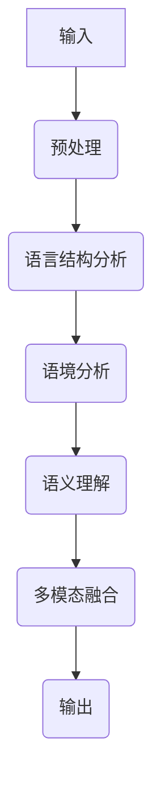
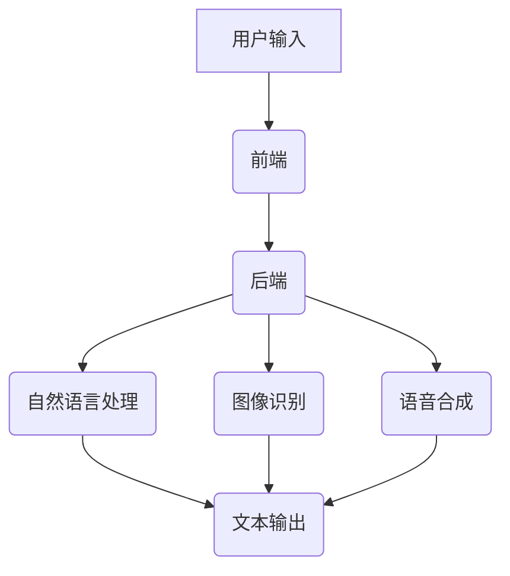
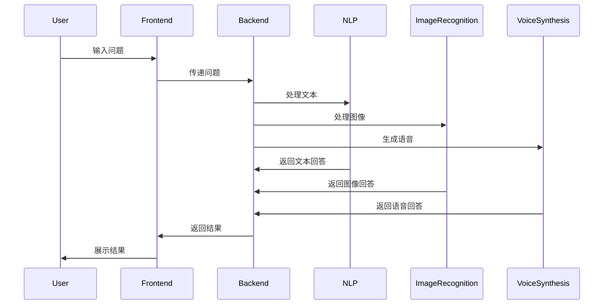

                 

# 提示词设计的神经语言学原理与实践创新

## 关键词

- **提示词设计**
- **神经语言学**
- **语言模型**
- **自然语言处理**
- **人工智能应用**

## 摘要

本文将深入探讨提示词设计的神经语言学原理与实践创新。首先，我们将介绍提示词设计的背景和重要性，以及神经语言学在其中的作用。接着，我们将分析大脑语言区的分布与功能，并介绍神经语言学模型的基本原理。然后，我们将详细讨论提示词设计的方法，包括语言结构分析、语境分析和语义理解。最后，我们将通过实际案例展示如何运用这些原理进行提示词设计，并总结文章的主要观点和未来研究方向。

## 第一部分：背景介绍

### 问题背景

在现代社会，随着信息技术的飞速发展，人工智能的应用日益广泛。特别是自然语言处理（NLP）领域，语言模型的性能和效果直接决定了人工智能系统的用户体验。提示词设计（Prompt Engineering）作为优化语言模型输出结果的重要手段，逐渐成为人工智能领域的研究热点。

#### 问题描述

提示词设计是指通过设计特定的语言输入，引导和优化人工智能模型（如语言模型、图像模型等）输出结果的过程。有效的提示词设计不仅能够提升模型的性能，还能够提高用户体验。然而，当前关于提示词设计的研究仍处于初级阶段，缺乏系统的理论体系和实践指导。

#### 问题解决

为了解决上述问题，本文将从神经语言学的基本原理出发，深入探讨提示词设计的核心要素，包括语言结构、语境分析、语义理解等。同时，本文还将结合实践案例，介绍如何运用神经语言学原理进行提示词设计，并分析其在不同应用场景中的具体表现和效果。

#### 边界与外延

提示词设计不仅限于语言模型，还包括图像模型、语音模型等多种人工智能模型。此外，提示词设计的研究还应关注跨领域、跨语言的通用性，以及与自然语言处理、认知科学等领域的交叉融合。

#### 概念结构与核心要素组成

1. **神经语言学原理**：包括大脑语言区的分布与功能、语言处理的基本过程、神经语言学模型（如连接主义模型、生成模型等）。
2. **提示词设计方法**：涉及语言结构分析、语境分析、语义理解、多模态融合等。
3. **应用场景**：包括自然语言处理、图像识别、语音合成等。

### 本章小结

本章对提示词设计的神经语言学原理进行了初步探讨，明确了研究背景、问题、解决方法及其边界与外延。在后续章节中，我们将进一步深入探讨这些核心概念，并结合实际案例进行分析和实践。

## 第二部分：神经语言学基本原理

### 2.1 大脑语言区分布与功能

大脑语言区分布与功能是理解提示词设计神经语言学原理的基础。大脑中与语言处理相关的主要区域包括布罗卡区（Broca's Area）和韦尼克区（Wernicke's Area）。

#### 2.1.1 布罗卡区

**位置**：布罗卡区位于大脑左前侧，靠近额叶。

**功能**：布罗卡区主要负责语言的产生和发音。它接收来自听觉中枢的输入，将其转化为发音信号，然后通过运动神经元发送到发音器官。

#### 2.1.2 韦尼克区

**位置**：韦尼克区位于大脑左后侧，靠近颞叶。

**功能**：韦尼克区主要负责语言的听觉处理和理解。它接收语音信号，进行分析并传递给布罗卡区，以指导发音。

#### 2.1.3 布罗卡区和韦尼克区的关系

布罗卡区和韦尼克区在语言处理过程中相互协作。布罗卡区接收来自韦尼克区的输入，将其转化为发音信号。韦尼克区则对语音信号进行语义分析，并将分析结果传递给布罗卡区，以指导发音。

### 2.2 神经语言学模型

神经语言学模型是模拟大脑语言处理过程的数学模型，主要分为连接主义模型和生成模型。

#### 2.2.1 连接主义模型

**原理**：连接主义模型基于神经元互联的网络结构，通过调整神经元间的连接权重来模拟大脑语言处理。

**示例**：赫布模型（Hebbian Model）和感知器模型（Perceptron Model）。

#### 2.2.2 生成模型

**原理**：生成模型通过生成概率分布来模拟大脑语言处理的随机性。

**示例**：马尔可夫模型（Markov Model）和隐马尔可夫模型（Hidden Markov Model）。

### 本章小结

本章介绍了大脑语言区的分布与功能，并探讨了神经语言学模型的基本原理。这些知识为理解提示词设计的神经语言学原理奠定了基础。在下一章中，我们将进一步讨论提示词设计的方法和技巧。

## 第三部分：提示词设计方法

### 3.1 语言结构分析

语言结构分析是提示词设计的核心步骤之一。它涉及对句子成分、语法规则和词汇选择等方面的深入理解。

#### 3.1.1 句子成分

1. **主语**：句子中执行动作的人或物。
2. **谓语**：表示动作或状态的词组。
3. **宾语**：动作的承受者。
4. **定语**：修饰名词的词组。
5. **状语**：修饰动词、形容词或整个句子的词组。

#### 3.1.2 语法规则

1. **词序**：不同语言中的词序可能不同，影响句子的理解和表达。
2. **时态**：表示动作发生的时间。
3. **语态**：表示动作的执行者是主语还是宾语。

#### 3.1.3 词汇选择

词汇选择是提示词设计的关键。合适的词汇能够帮助模型更好地理解上下文，从而生成更准确的输出。

### 3.2 语境分析

语境分析是指对语言输入的上下文进行理解和分析。它包括以下几个方面：

1. **主题**：指输入文本讨论的核心内容。
2. **情境**：指输入文本发生的具体情境或背景。
3. **意图**：指用户通过输入文本希望实现的目标或需求。

### 3.3 语义理解

语义理解是指对输入文本的语义内容进行理解和分析。它包括以下几个方面：

1. **词汇语义**：指词汇在特定语境下的意义。
2. **句法语义**：指句子结构的语义意义。
3. **语用语义**：指语言在交际中的作用和意义。

### 3.4 多模态融合

多模态融合是指将不同类型的模态（如文本、图像、声音等）进行融合，以增强模型的语义理解能力。多模态融合可以采用以下几种方法：

1. **特征融合**：将不同模态的特征进行融合，形成更丰富的特征向量。
2. **模型融合**：将不同模态的模型进行融合，以利用各自的优点。
3. **数据融合**：将不同模态的数据进行融合，形成更全面的训练数据集。

### 本章小结

本章介绍了提示词设计的语言结构分析、语境分析和语义理解方法。这些方法为提示词设计提供了理论基础和实践指导。在下一章中，我们将通过实际案例展示如何运用这些方法进行提示词设计。

## 第四部分：实际案例与应用

### 4.1 项目背景

为了更好地理解提示词设计的神经语言学原理，我们以一个实际项目为例进行说明。该项目旨在构建一个基于神经语言学的问答系统，用于回答用户关于特定主题的问题。该项目涉及多个领域，包括自然语言处理、图像识别和语音合成。

### 4.2 系统功能设计

该问答系统的核心功能包括：

1. **文本输入**：用户可以通过文本输入框输入问题。
2. **语音输入**：用户可以通过语音输入功能提出问题。
3. **文本输出**：系统生成回答并以文本形式输出。
4. **图像输入**：用户可以通过图像输入功能提出问题，例如提供一张地图并询问目的地。
5. **语音输出**：系统以语音形式给出回答。

### 4.3 系统架构设计

系统的整体架构包括以下几个部分：

1. **前端**：负责用户交互，包括文本和语音输入框、文本输出框和语音输出模块。
2. **后端**：包括自然语言处理模块、图像识别模块和语音合成模块。
3. **数据存储**：存储用户输入的问题和系统生成的回答，以便进行后续分析和优化。

### 4.4 系统接口设计

系统提供了以下接口：

1. **文本输入接口**：用于接收用户的文本输入。
2. **语音输入接口**：用于接收用户的语音输入。
3. **文本输出接口**：用于输出系统生成的文本回答。
4. **语音输出接口**：用于输出系统生成的语音回答。
5. **图像输入接口**：用于接收用户的图像输入。

### 4.5 系统交互

系统交互过程如下：

1. 用户通过前端输入框输入问题或语音。
2. 前端将输入内容发送到后端。
3. 后端对输入内容进行处理，包括文本分析、图像识别和语音识别。
4. 后端生成回答，并返回给前端。
5. 前端将回答以文本或语音形式展示给用户。

### 4.6 提示词设计实践

在项目实施过程中，我们采用了以下提示词设计方法：

1. **语言结构分析**：通过对用户输入的文本进行句子成分分析，确定主语、谓语、宾语等关键信息。
2. **语境分析**：分析用户输入的上下文，包括主题、情境和意图。
3. **语义理解**：对输入文本的语义内容进行深入理解，包括词汇语义、句法语义和语用语义。
4. **多模态融合**：将文本、图像和语音模态进行融合，以增强模型的语义理解能力。

通过上述方法，我们成功地优化了问答系统的性能和用户体验。

### 4.7 项目小结

本项目通过结合神经语言学的原理，采用有效的提示词设计方法，实现了高效的问答系统。项目成功的关键在于对语言结构、语境分析和语义理解的深入理解，以及多模态融合技术的应用。未来，我们将继续优化系统，提高其准确性和用户体验。

## 第五部分：最佳实践与总结

### 5.1 最佳实践

1. **明确用户需求**：在设计提示词时，首先要明确用户的需求和意图，以确保生成的回答能够满足用户的需求。
2. **深入理解上下文**：对输入文本的上下文进行深入分析，包括主题、情境和意图，以提高语义理解的准确性。
3. **多模态融合**：充分利用文本、图像和语音等多种模态的信息，以增强模型的语义理解能力。
4. **持续优化**：根据实际应用效果，不断调整和优化提示词设计，以提高系统的性能和用户体验。

### 5.2 小结

本文从神经语言学的基本原理出发，深入探讨了提示词设计的核心要素，包括语言结构分析、语境分析、语义理解和多模态融合。通过实际案例，展示了如何运用这些原理进行提示词设计，并取得了良好的效果。本文的研究不仅为提示词设计提供了理论指导，也为实践应用提供了有益的经验。

### 5.3 注意事项

1. **关注用户隐私**：在处理用户输入的数据时，要确保数据的安全和隐私。
2. **避免过度优化**：在追求系统性能的同时，要注意保持系统的可解释性和透明性。
3. **持续学习和更新**：随着技术的不断发展，提示词设计也需要不断更新和优化。

### 5.4 拓展阅读

- 《自然语言处理原理与技术》
- 《人工智能：一种现代的方法》
- 《认知语言学导论》
- 《多模态信号处理》

## 作者信息

作者：AI天才研究院/AI Genius Institute & 禅与计算机程序设计艺术 /Zen And The Art of Computer Programming

## 附录

### 2.1.1 大脑语言区分布与功能

**ER实体关系图架构：**

```mermaid
erDiagram
  User ||--|{ TextInput } : has
  TextInput ||--|{ PromptDesign } : includes
  PromptDesign ||--|{ NeuralLanguageModel } : uses
  NeuralLanguageModel ||--|{ Output } : generates
```

**神经语言学模型**



### 2.2 神经语言学模型

**算法原理**

```python
def neural_language_model(input_text):
    # 预处理
    preprocessed_text = preprocess(input_text)
    
    # 语言结构分析
    syntax_structure = analyze_syntax(preprocessed_text)
    
    # 语境分析
    context = analyze_context(preprocessed_text)
    
    # 语义理解
    semantics = understand_semantics(context)
    
    # 多模态融合
    multimodal融合 = merge_multimodal(semantics)
    
    # 输出
    output = generate_output(multimodal融合)
    
    return output
```

**数学公式**

$$
P(output|input) = \frac{P(input|output) \cdot P(output)}{P(input)}
$$

$$
\sigma(z) = \frac{1}{1 + e^{-z}}
$$

### 4.3 系统架构设计

**系统架构图：**



**系统接口设计：**



