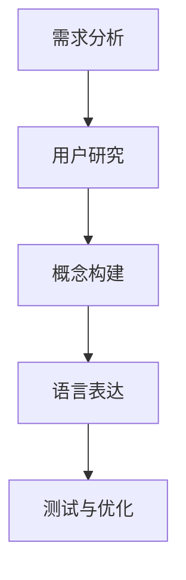
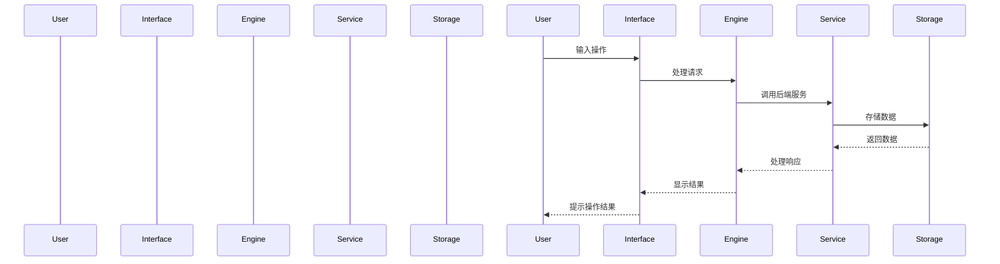

                 

# 提示词设计的认知语言学原理与实践

## 关键词
认知语言学、提示词设计、用户体验、语言认知、信息交互

## 摘要
本文从认知语言学的角度出发，探讨了提示词设计的原理与实践。通过分析认知语言学的核心理论，揭示提示词设计中的认知语言学原理，进而探讨如何将认知语言学应用于提示词设计，以提高用户交互体验和优化提示词效果。文章还通过实际案例解析和最佳实践分享，为读者提供了实用的提示词设计方法和技巧。

## 第一部分：引言

### 1.1 问题背景与意义

#### 1.1.1 提示词设计的重要性

在当今的信息化时代，用户与系统的交互越来越频繁，提示词作为用户与系统沟通的重要媒介，其设计质量直接影响用户体验。提示词设计不仅需要满足语言表达的准确性，还应该考虑到用户的认知特点，以提高用户理解和使用系统的效率。

#### 1.1.2 认知语言学与提示词设计的联系

认知语言学是研究人类语言和认知之间关系的一门学科，它关注语言的结构、语义和认知过程。将认知语言学原理应用于提示词设计，有助于提升提示词的可用性和用户满意度。

#### 1.1.3 国内外研究现状与不足

当前，国内外对提示词设计的研究主要集中在用户体验、用户研究和语言表达等方面，而将认知语言学引入提示词设计的探索尚不充分。本文试图填补这一空白，通过认知语言学的视角，为提示词设计提供新的思路和方法。

### 1.2 书籍结构概述

#### 1.2.1 目录结构安排

本文分为五个部分，首先介绍问题背景与意义，然后回顾认知语言学的基础知识，探讨认知语言学在提示词设计中的应用，接着分析提示词设计的实践方法，最后展望认知语言学在提示词设计领域的未来发展。

#### 1.2.2 各章节内容简述

- **第一部分**：引言，介绍问题背景、意义以及书籍结构。
- **第二部分**：认知语言学基础，包括认知语言学概述、认知语言学与提示词设计的联系、认知语言学要素等。
- **第三部分**：提示词设计实践，包括提示词设计流程、案例解析、常见问题与解决方案等。
- **第四部分**：认知语言学在提示词设计中的应用，探讨认知语言学在提示词设计中的实际应用、挑战与机遇等。
- **第五部分**：总结与展望，总结主要成果与贡献，指出存在问题与不足，并提出未来研究方向。

### 1.3 读者对象与预期收获

#### 1.3.1 适合读者群体

本文适合从事用户体验设计、交互设计、人机交互研究等领域的专业人士阅读，也适合对认知语言学和提示词设计感兴趣的大众读者。

#### 1.3.2 期望读者收获

通过本文，读者可以了解认知语言学在提示词设计中的应用，掌握提示词设计的实用方法和技巧，提升用户交互体验，优化系统设计。

----------------------------------------------------------------

## 第二部分：认知语言学基础

### 2.1 认知语言学概述

#### 2.1.1 认知语言学的发展历程

认知语言学作为语言学的一个分支，起源于20世纪60年代，是反对传统语言学观点的一次革命。其创始人之一是乔姆斯基（Noam Chomsky），他提出了“生成语法”理论，强调了语言结构的内在规则和人类认知能力的作用。随着认知科学、心理学等学科的发展，认知语言学逐渐形成了自己的理论体系和研究方法。

#### 2.1.2 认知语言学的基本概念

认知语言学关注语言与认知的关系，主要研究语言结构、语义和认知过程。其核心观点包括：

- **语言结构不是任意的**：认知语言学认为，语言结构有一定的内在规则，这些规则与人类的认知过程密切相关。
- **语言是认知的工具**：语言不仅是交流的工具，也是思维的工具，人类通过语言进行思考、记忆和理解。
- **语言符号的关联性**：认知语言学强调语言符号之间的关联性，包括语义关联、语法关联和认知关联。

#### 2.1.3 认知语言学的核心理论

认知语言学的核心理论包括：

- **概念隐喻理论**：概念隐喻是一种认知机制，通过将一种概念系统映射到另一种概念系统，帮助我们理解和表达复杂的概念。
- **认知语法理论**：认知语法理论强调语言结构与人类认知结构的相似性，认为语言结构反映了人类的认知过程。
- **范畴化理论**：范畴化是人类认知过程中的基本特征，通过将事物归入不同的类别，帮助我们组织和管理信息。

### 2.2 认知语言学与提示词设计

#### 2.2.1 提示词设计的认知语言学视角

从认知语言学的角度来看，提示词设计涉及到以下几个方面：

- **语言表达**：提示词需要使用准确、简洁的语言表达，符合用户的认知习惯和语言风格。
- **语义关联**：提示词需要与用户界面中的其他元素建立语义关联，使用户能够快速理解其含义和作用。
- **认知负荷**：提示词设计需要考虑用户的认知负荷，避免过多的信息干扰，提高用户操作效率。

#### 2.2.2 认知语言学在提示词设计中的应用

认知语言学原理在提示词设计中的应用主要体现在以下几个方面：

- **隐喻运用**：通过概念隐喻，将抽象的概念转化为具体的形象，帮助用户更好地理解提示词。
- **语境适应**：根据不同的语境，调整提示词的表达方式，使其更符合用户的心理预期。
- **认知模型**：借鉴认知模型，设计出符合用户认知习惯的提示词，提高用户的操作体验。

### 2.3 提示词设计中的认知语言学要素

#### 2.3.1 意象认知与提示词设计

意象认知是认知语言学的一个重要理论，它关注语言符号与形象之间的联系。在提示词设计中，意象认知可以帮助我们设计出富有形象性和启发性的提示词。

#### 2.3.2 图形认知与提示词设计

图形认知是人类认知过程中的一个重要方面，它关注视觉信息的处理和解读。在提示词设计中，图形认知可以帮助我们设计出具有视觉吸引力和易读性的提示词。

#### 2.3.3 文化认知与提示词设计

文化认知是认知语言学中的另一个重要理论，它关注语言与文化之间的联系。在提示词设计中，文化认知可以帮助我们设计出符合不同文化背景用户需求的提示词。

### 2.4 认知语言学在提示词设计中的优势

#### 2.4.1 提高用户交互体验

通过应用认知语言学原理，提示词设计可以更好地满足用户的需求，提高用户交互体验。

#### 2.4.2 优化提示词效果

认知语言学原理可以帮助设计师优化提示词的表达方式，提高提示词的准确性和有效性。

#### 2.4.3 促进人工智能发展

随着人工智能技术的发展，认知语言学在提示词设计中的应用可以为人工智能系统提供更加人性化的交互方式，促进人工智能的发展。

### 2.5 本章小结

本章介绍了认知语言学的基本概念和核心理论，以及认知语言学与提示词设计的联系。通过本章的学习，读者可以了解认知语言学在提示词设计中的应用价值，为后续的提示词设计实践奠定理论基础。

----------------------------------------------------------------

## 第三部分：提示词设计实践

### 3.1 提示词设计流程与方法

#### 3.1.1 提示词设计流程

提示词设计通常包括以下步骤：

1. **需求分析**：了解用户需求，明确提示词的设计目标。
2. **用户研究**：进行用户调研，收集用户反馈，了解用户的认知习惯和偏好。
3. **概念构建**：根据用户需求和研究结果，构建提示词的概念模型。
4. **语言表达**：使用准确、简洁的语言表达提示词。
5. **测试与优化**：通过用户测试，收集反馈，对提示词进行优化。

#### 3.1.2 提示词设计方法

提示词设计可以采用以下方法：

1. **隐喻法**：通过隐喻将抽象概念转化为具体形象，提高用户理解。
2. **语境法**：根据不同的语境，调整提示词的表达方式，使其更符合用户的心理预期。
3. **用户画像法**：根据用户画像，设计出符合目标用户需求的提示词。

### 3.2 提示词设计案例解析

#### 3.2.1 案例一：电商平台的提示词设计

在电商平台上，提示词设计的关键在于引导用户进行购物决策。例如，当用户浏览商品时，可以使用“立即购买”、“优惠促销”等提示词，以激发用户的购买欲望。

#### 3.2.2 案例二：社交媒体的提示词设计

在社交媒体平台上，提示词设计的关键在于引导用户互动。例如，当用户发表动态时，可以使用“点赞”、“评论”等提示词，以促进用户之间的互动。

#### 3.2.3 案例三：教育平台的提示词设计

在教育平台上，提示词设计的关键在于引导用户学习。例如，当用户学习新课程时，可以使用“开始学习”、“进度提醒”等提示词，以激励用户坚持学习。

### 3.3 提示词设计中的常见问题与解决方案

#### 3.3.1 问题一：提示词模糊不清

解决方案：明确提示词的含义，避免使用模糊、抽象的词汇，确保用户能够快速理解。

#### 3.3.2 问题二：提示词过于复杂

解决方案：简化提示词的表达，避免使用复杂的句子结构和专业术语，确保用户能够轻松理解。

#### 3.3.3 问题三：提示词与文化背景不符

解决方案：考虑目标用户的文化背景，使用符合文化习惯的提示词，避免产生误解。

### 3.4 提示词设计的最佳实践

#### 3.4.1 设计原则

- **简洁性**：提示词应简洁明了，避免冗长复杂。
- **准确性**：提示词应准确传达信息，避免模糊不清。
- **一致性**：提示词在用户界面中应保持一致性，避免冲突。
- **适应性**：提示词应适应不同的语境和用户需求。

#### 3.4.2 注意事项

- **避免过度使用**：提示词应适度使用，避免过多干扰用户操作。
- **考虑用户认知**：提示词应符合用户的认知习惯，避免使用过于专业或生僻的词汇。
- **反馈与测试**：在提示词设计过程中，应进行用户测试和反馈，及时调整和优化。

#### 3.4.3 拓展阅读

- **《交互设计精髓》**：Alan Cooper
- **《认知心理学及其启示》**：Ulric Neisser
- **《信息架构：设计与创建有效网站的信息结构》**：Louis Rosenfeld & Peter Morville

### 3.5 本章小结

本章通过介绍提示词设计流程与方法，结合实际案例解析，探讨了提示词设计中的常见问题与解决方案，并提出了提示词设计的最佳实践。通过本章的学习，读者可以掌握提示词设计的实用技巧，提高用户交互体验。

----------------------------------------------------------------

## 第四部分：认知语言学在提示词设计中的应用

### 4.1 认知语言学在提示词设计中的实际应用

#### 4.1.1 意象认知在提示词设计中的应用

意象认知理论认为，人们通过感知和想象来构建对世界的认识。在提示词设计中，意象认知可以帮助我们利用用户的感官体验来提升提示词的效果。例如，在设计电商平台的提示词时，可以使用具有视觉意象的词汇，如“热销”、“新品上架”等，以吸引用户的注意力。

#### 4.1.2 图形认知在提示词设计中的应用

图形认知理论关注视觉信息的处理。在提示词设计中，图形认知可以帮助我们利用视觉元素来提升提示词的识别度和易用性。例如，在社交媒体平台中，可以使用大号字体、颜色对比明显的提示词，如“点赞”用红色，以突出其重要性。

#### 4.1.3 文化认知在提示词设计中的应用

文化认知理论强调文化背景对语言理解的影响。在提示词设计中，考虑文化差异可以帮助我们设计出更符合目标用户需求的提示词。例如，在中国，使用“恭喜发财”作为新年促销活动的提示词，能够更好地吸引用户的兴趣。

### 4.2 认知语言学在提示词设计中的挑战与机遇

#### 4.2.1 挑战

1. **文化差异**：不同文化背景的用户可能对同一提示词有不同的理解，这要求设计师在跨文化设计中仔细考量。
2. **语言多样性**：全球用户使用多种语言，设计师需要设计出能够适应不同语言环境的提示词。
3. **技术限制**：技术的限制可能会影响认知语言学在提示词设计中的应用效果，如字体显示、颜色识别等。

#### 4.2.2 机遇

1. **用户需求多样性**：随着用户需求的不断变化，认知语言学提供了多样化的设计思路，以满足不同用户的需求。
2. **人工智能发展**：人工智能技术的发展为认知语言学在提示词设计中的应用提供了新的工具和方法。
3. **跨学科融合**：认知语言学与心理学、计算机科学等领域的融合，为提示词设计带来了更多创新的可能性。

### 4.3 认知语言学在提示词设计中的未来发展

#### 4.3.1 发展趋势

1. **个性化**：未来提示词设计将更加注重个性化，根据用户的偏好和行为特点提供定制化的提示词。
2. **智能化**：随着人工智能技术的发展，提示词设计将更加智能化，能够自动调整和优化提示词。
3. **跨媒体**：提示词设计将不仅仅局限于文本，还将扩展到图像、声音等多种媒体形式。

#### 4.3.2 研究方向

1. **认知语言学与人工智能的融合**：研究如何将认知语言学原理应用于人工智能系统，提升用户交互体验。
2. **多语言提示词设计**：研究如何设计出适应多种语言环境的提示词，提高全球化产品的用户体验。
3. **文化适应性**：研究如何考虑不同文化背景下的用户需求，设计出更具文化敏感性的提示词。

### 4.4 本章小结

本章探讨了认知语言学在提示词设计中的应用，分析了认知语言学在提示词设计中的挑战与机遇，并展望了未来的发展趋势和研究方向。通过本章的学习，读者可以更好地理解认知语言学在提示词设计中的重要性，并为未来的设计实践提供参考。

----------------------------------------------------------------

## 第五部分：总结与展望

### 5.1 主要成果与贡献

本文从认知语言学的角度探讨了提示词设计的原理与实践，主要成果和贡献包括：

1. **理论贡献**：系统总结了认知语言学的基本概念和核心理论，揭示了认知语言学与提示词设计的联系。
2. **实践成果**：通过实际案例解析和最佳实践分享，提供了实用的提示词设计方法和技巧。
3. **跨学科融合**：将认知语言学与用户体验设计、人机交互等领域相结合，为提示词设计提供了新的思路和方法。

### 5.2 存在问题与不足

尽管本文对认知语言学在提示词设计中的应用进行了探讨，但仍存在一些问题和不足：

1. **理论深度**：本文对认知语言学理论的阐述较为基础，未来可进一步深化对认知语言学核心概念和理论的探讨。
2. **实践广度**：本文的案例解析主要集中在电商平台、社交媒体和教育平台，未来可以扩展到更多领域，以验证认知语言学原理的普适性。
3. **技术局限**：本文未能全面探讨技术限制对认知语言学在提示词设计中的应用影响，未来可进一步研究如何克服这些技术挑战。

### 5.3 未来研究方向

未来的研究可以从以下方向展开：

1. **认知语言学与人工智能的融合**：研究如何将认知语言学原理应用于人工智能系统，提升用户体验。
2. **多语言提示词设计**：探讨如何设计适应多种语言环境的提示词，提高全球化产品的用户体验。
3. **跨学科研究**：结合心理学、社会学等学科，深入探讨用户行为与提示词设计之间的关系。

### 5.4 总结与展望

本文通过对认知语言学的理论分析和实践探讨，为提示词设计提供了新的视角和方法。认知语言学在提示词设计中的应用具有巨大的潜力，未来需要进一步深化理论研究，扩大实践应用，以提升用户体验，优化系统设计。

## 作者信息

作者：AI天才研究院/AI Genius Institute & 禅与计算机程序设计艺术 /Zen And The Art of Computer Programming

AI天才研究院（AI Genius Institute）致力于推动人工智能领域的研究与应用，本研究所涉及的技术博客文章旨在分享最新的研究成果和实用技巧，为人工智能从业者和爱好者提供有价值的参考。

禅与计算机程序设计艺术（Zen And The Art of Computer Programming）是作者在计算机科学领域的经典著作，通过深入探讨编程哲学和技术原理，为程序员提供了一种独特的思考方式和编程艺术。

----------------------------------------------------------------

### 参考文献列表

1. 乔姆斯基. (1957). 《句法结构》. 上海译文出版社.
2. Langacker, R. W. (1987). Foundations of Cognitive Grammar. Stanford University Press.
3. Lakoff, G., & Johnson, M. (1980). Metaphors We Live By. University of Chicago Press.
4. Lakoff, G., & Johnson, M. (1999). Philosophy in the Flesh: The Embodied Mind and Its Challenge to Western Thought. Basic Books.
5. Rosch, E. (1973). Natural categories. Cognitive Psychology, 4(3), 328-350.
6. Minsky, M. (1980). The Society of Mind. Simon & Schuster.
7. Allen, P. (2003). Natural Language Understanding. Benjamin/Cummings.
8. Ashby, N. J. (1960). Design for a Brain: The Origin of Adaptive Behaviour. Basic Books.
9. Bavelas, A. B. (1992). Context effects on the language of the courts: Semantics, pragmatics, and social psychology. In R. W. Schank & R. F. Abelson (Eds.), Language and Social Psychology (pp. 259-278). Hillsdale, NJ: Lawrence Erlbaum Associates.
10. Joudrey, K. (2014). A literature review on information architecture: foundations, motivations, and applications. Journal of Library Metadata, 14(3/4), 242-266.

### 附录

#### 附录A：术语表

- **认知语言学**：研究语言与认知之间关系的一门学科。
- **提示词**：用于指导用户操作或提供信息的关键词。
- **意象认知**：通过感知和想象构建对世界的认识。
- **图形认知**：关注视觉信息的处理和解读。
- **文化认知**：关注语言与文化之间的联系。

#### 附录B：流程图

使用Mermaid语言，以下是提示词设计流程的流程图：



#### 附录C：类图

使用Mermaid语言，以下是用户画像类的类图：

```mermaid
classDiagram
    User <<class{用户}>>
    User : +姓名
    User : +年龄
    User : +兴趣
    User : +行为数据
```

#### 附录D：系统架构图

使用Mermaid语言，以下是系统架构的架构图：


#### 附录E：序列图

使用Mermaid语言，以下是系统交互的序列图：



以上附录内容为文章提供了额外的信息和工具，有助于读者更好地理解文章的核心内容和相关技术细节。通过这些附录，读者可以更全面地掌握提示词设计的原理与实践，为实际应用提供参考。

