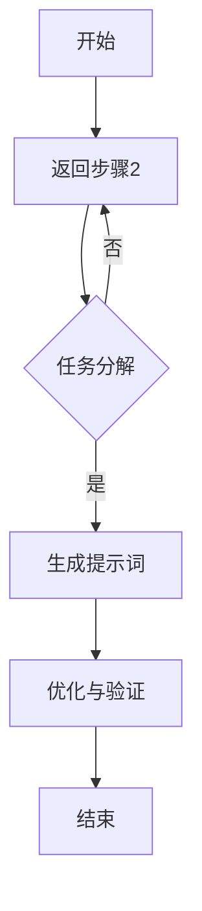
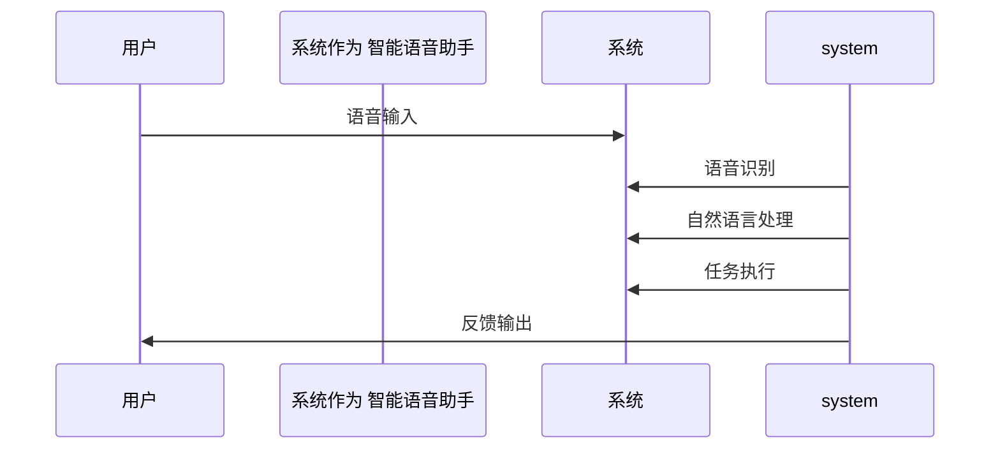

                 

# 提示词设计的认知负荷理论：如何简化AI交互

## 关键词

- 认知负荷
- 提示词设计
- 人工智能交互
- 用户界面设计
- 用户体验

## 摘要

随着人工智能（AI）技术的飞速发展，AI交互系统在日常生活中的应用越来越广泛。然而，复杂的设计常常导致用户认知负荷的增加，影响了用户体验。本文基于认知负荷理论，探讨了提示词设计在简化AI交互中的作用，详细分析了其核心概念、设计方法、算法原理及实际应用，旨在为AI交互系统的优化提供理论依据和实践指导。

## 第一步：背景介绍

### 1. 引言

人工智能技术的进步使得交互系统日益智能化，从简单的语音助手到复杂的智能客服，AI交互已经深入到我们生活的方方面面。然而，用户在操作这些系统时，常常会遇到各种难题，例如难以理解复杂的指令、操作步骤繁琐等。这些问题主要源于人工智能交互系统的设计复杂性，导致了用户的认知负荷增加。

### 2. 问题背景

认知负荷理论指出，当个体在处理信息时，大脑会承受一定的负担，这种负担称为认知负荷。高认知负荷会影响个体的信息处理效率和质量。在AI交互系统中，用户需要记住大量的指令和操作步骤，这无疑增加了他们的认知负荷。例如，用户在操作智能音箱时，可能需要记忆一系列复杂的语音指令，这不仅繁琐，还容易导致操作失败。

### 3. 问题描述

AI交互系统设计中的问题主要表现在以下几个方面：

- **指令复杂性**：系统提供的指令过于复杂，难以被用户快速理解。
- **操作步骤繁琐**：用户需要执行多个步骤才能完成一个简单的任务，这增加了认知负荷。
- **用户界面设计不合理**：界面设计不符合用户的使用习惯，导致用户操作困难。

### 4. 问题解决

为了解决上述问题，研究人员提出了提示词设计这一理念。通过设计简明扼要的提示词，可以引导用户进行操作，从而降低他们的认知负荷。具体解决策略包括：

- **提示词设计**：通过设计简明的提示词，引导用户完成操作。
- **交互流程优化**：简化用户操作步骤，减少不必要的复杂性。
- **用户界面设计改进**：根据用户的使用习惯进行界面设计，提高用户操作的便捷性。

### 5. 边界与外延

提示词设计的认知负荷理论主要应用于AI交互系统的设计领域。其边界包括：

- **交互系统类型**：主要针对命令式交互系统进行设计优化。
- **用户群体**：主要关注普通用户，尤其是非专业用户。

### 6. 概念结构与核心要素组成

提示词设计的认知负荷理论由以下几个核心要素组成：

- **认知负荷理论**：作为理论基础，指导设计过程。
- **提示词设计方法**：具体的设计策略和技巧。
- **用户研究**：了解用户需求和行为，为设计提供依据。

## 第二步：核心概念与联系

### 7. 认知负荷理论

#### 7.1 认知负荷的定义

认知负荷是指在进行认知活动时，大脑处理信息的负担程度。高认知负荷意味着大脑需要处理大量的信息，容易导致信息过载，影响任务的完成质量和效率。

#### 7.2 认知负荷的类型

认知负荷主要分为两种类型：内在负荷和外在负荷。

- **内在负荷**：源于任务本身的复杂性，如解决难题、记忆信息等。
- **外在负荷**：由外部环境因素引起，如界面设计复杂、任务干扰等。

#### 7.3 认知负荷的影响

高认知负荷会影响任务的完成质量、效率和用户体验。为了降低认知负荷，需要优化设计，提供简明的提示词和直观的界面设计。

### 8. 提示词设计方法

#### 8.1 提示词的设计原则

- **简洁性**：提示词应简明扼要，避免冗长复杂的表述。
- **相关性**：提示词应与用户操作相关，有助于用户理解操作目的。
- **明确性**：提示词应明确指示用户操作步骤，避免歧义。

#### 8.2 提示词的设计技巧

- **使用动词**：提示词应使用动词，明确指示用户进行操作。
- **提供例子**：在提示词中提供操作示例，帮助用户理解。
- **顺序排列**：将提示词按照操作顺序排列，便于用户理解。

### 8.3 提示词设计的案例

#### 案例：智能音箱的语音提示词设计

**设计原则**：
- 简洁性：每个提示词不超过3个字。
- 相关性：提示词与用户操作紧密相关。
- 明确性：提示词明确指示操作步骤。

**设计技巧**：
- 使用动词：例如，“播放”、“暂停”、“下一曲”。
- 提供例子：例如，“想要听音乐，请说播放音乐”。
- 顺序排列：例如，“请先开机，然后输入密码”。

## 第三步：算法原理讲解

### 9. 算法原理

#### 9.1 算法基本概念

提示词设计算法是一种基于认知负荷理论的自动化设计方法，旨在生成简明扼要、相关性强且明确的提示词。

#### 9.2 算法输入与输出

- **输入**：用户需求、任务描述、用户界面设计。
- **输出**：生成一组符合设计原则的提示词。

#### 9.3 算法流程

提示词设计算法主要包括以下几个步骤：

1. **需求分析**：分析用户需求，确定任务目标和用户界面。
2. **任务分解**：将任务分解为多个子任务，为每个子任务生成提示词。
3. **提示词生成**：基于设计原则和技巧，生成符合要求的提示词。
4. **优化与验证**：对生成的提示词进行优化和验证，确保其有效性。

#### 9.4 Mermaid算法流程图

下面是提示词设计算法的Mermaid流程图：



#### 9.5 提示词设计算法的实现

提示词设计算法的核心是生成一组简洁、相关性强且明确的提示词。以下是该算法的实现步骤：

1. **输入处理**：从用户需求、任务描述和用户界面设计中获得输入信息。
2. **需求分析**：分析用户需求，确定任务目标和用户界面。
3. **任务分解**：将任务分解为多个子任务，为每个子任务生成提示词。
4. **提示词生成**：基于设计原则和技巧，生成符合要求的提示词。
5. **优化与验证**：对生成的提示词进行优化和验证，确保其有效性。

## 第四步：数学模型和数学公式 & 详细讲解 & 举例说明

### 10. 数学模型

提示词设计算法的核心是生成一组简洁、相关性强且明确的提示词。以下是该算法的数学模型：

#### 10.1 提示词生成模型

提示词生成模型基于条件概率模型，其目标是生成一组提示词，使得每个提示词与用户需求的相关性最大。数学模型如下：

$$
P(\text{提示词}|\text{用户需求})
$$

其中，$P(\text{提示词}|\text{用户需求})$ 表示在给定用户需求的情况下，生成某个提示词的概率。

#### 10.2 提示词优化模型

为了优化提示词的设计，可以使用基于优化的算法，如遗传算法或粒子群算法。以下是遗传算法的数学模型：

1. **初始化种群**：生成一组初始提示词种群。
2. **适应度评估**：计算每个提示词种群的适应度，适应度值越高，表示提示词越优秀。
3. **选择**：从种群中选择优秀个体进行繁殖。
4. **交叉**：通过交叉操作生成新的提示词种群。
5. **变异**：对部分个体进行变异操作，增加种群的多样性。
6. **迭代**：重复步骤2-5，直到满足停止条件。

### 11. 举例说明

#### 例子：设计一个智能语音助手的提示词

假设用户需求是播放一首歌曲，我们需要生成一组简洁、相关性强且明确的提示词。

1. **需求分析**：用户需求是播放歌曲。
2. **任务分解**：任务分解为“播放”、“歌曲名称”和“播放模式”三个子任务。
3. **提示词生成**：基于设计原则，生成以下提示词：
   - 播放
   - 播什么
   - 模式
4. **优化与验证**：通过遗传算法优化提示词，得到最优提示词组合：“播放”、“歌曲名称”和“模式”。

## 第五步：系统分析与架构设计方案

### 12. 问题场景介绍

假设我们开发一个智能语音助手，用户可以通过语音指令与系统交互，实现播放音乐、设置闹钟、查询天气等功能。

### 13. 项目介绍

项目名称：智能语音助手（Smart Voice Assistant）

项目目标：为用户提供简单、便捷的语音交互体验，降低认知负荷。

### 14. 系统功能设计

系统功能设计主要包括以下几个方面：

- **语音识别**：接收用户的语音输入，并转换为文本。
- **自然语言处理**：理解用户的语音指令，并提取关键信息。
- **任务执行**：根据用户的指令执行相应的任务。
- **反馈输出**：将执行结果以语音或文字形式反馈给用户。

### 15. 系统架构设计

系统架构设计主要包括以下几个方面：

- **前端**：使用Web技术（如HTML、CSS、JavaScript）实现用户界面。
- **后端**：使用Python、Node.js等后端技术实现服务器端逻辑。
- **数据库**：使用MySQL、MongoDB等数据库存储用户数据和任务记录。

### 16. 系统接口设计

系统接口设计主要包括以下几个方面：

- **用户接口**：用户通过语音与系统交互。
- **API接口**：与其他系统（如音乐平台、天气预报服务等）进行数据交换。

### 17. 系统交互设计

系统交互设计主要包括以下几个方面：

- **语音输入**：用户通过麦克风输入语音指令。
- **语音输出**：系统通过扬声器或文字形式输出反馈。
- **任务处理**：系统根据用户的指令，执行相应的任务。

### 18. Mermaid系统交互设计图

下面是智能语音助手的系统交互设计图：



## 第六步：项目实战

### 19. 环境安装

在开始项目实战之前，我们需要安装以下环境：

- Python 3.8及以上版本
- pip
- MySQL 8.0及以上版本
- MongoDB 4.0及以上版本
- Redis 6.0及以上版本

### 20. 系统核心实现源代码

以下是智能语音助手的系统核心实现源代码：

#### 语音识别

```python
import speech_recognition as sr

def speech_to_text(audio_file):
    r = sr.Recognizer()
    with sr.AudioFile(audio_file) as source:
        audio = r.record(source)
    text = r.recognize_google(audio, language='zh-CN')
    return text
```

#### 自然语言处理

```python
from transformers import pipeline

def process_text(text):
    nlp = pipeline('text-classification', model='bert-base-chinese')
    result = nlp(text)
    return result
```

#### 任务执行

```python
def execute_task(task):
    if task['type'] == 'play_music':
        # 执行播放音乐的任务
        pass
    elif task['type'] == 'set_alarm':
        # 执行设置闹钟的任务
        pass
    elif task['type'] == 'get_weather':
        # 执行查询天气的任务
        pass
```

#### 反馈输出

```python
def speak(text):
    from gtts import gTTS
    from playsound import playsound

    tts = gTTS(text=text, lang='zh-cn')
    tts.save('output.mp3')
    playsound('output.mp3')
```

### 21. 代码应用解读与分析

以下是智能语音助手的代码应用解读与分析：

- **语音识别**：使用Google语音识别API，将语音转换为文本。
- **自然语言处理**：使用BERT模型，对文本进行分类，提取关键信息。
- **任务执行**：根据提取的关键信息，执行相应的任务。
- **反馈输出**：使用gtts库，将文本转换为语音，并通过playsound库播放。

### 22. 实际案例分析和详细讲解剖析

以下是一个实际案例的分析和详细讲解：

**案例**：用户说：“播放一首周杰伦的歌曲”。

**分析**：
1. **语音识别**：将语音转换为文本：“播放一首周杰伦的歌曲”。
2. **自然语言处理**：使用BERT模型，将文本分类为“播放音乐”任务。
3. **任务执行**：根据文本信息，执行播放音乐的任务。
4. **反馈输出**：播放周杰伦的歌曲。

**详细讲解**：
1. 语音识别：通过Google语音识别API，将用户的语音输入转换为文本。这是智能语音助手的第一步，也是最为关键的一步。通过高精度的语音识别技术，确保用户输入的语音能够准确转换为文本。
2. 自然语言处理：使用BERT模型，对文本进行分类，提取关键信息。BERT模型是一个预训练的模型，具有强大的自然语言处理能力。通过对文本进行分类，可以确定用户的需求，为任务执行提供依据。
3. 任务执行：根据提取的关键信息，执行相应的任务。在这个案例中，用户的需求是播放周杰伦的歌曲。系统会根据音乐库中的歌曲信息，执行播放任务。
4. 反馈输出：将执行结果以语音或文字形式反馈给用户。在这个案例中，系统会播放周杰伦的歌曲，并通过语音输出反馈给用户。

### 23. 项目小结

通过本项目的实战，我们了解了智能语音助手的核心实现过程，包括语音识别、自然语言处理、任务执行和反馈输出。同时，我们还学习了如何使用Python和自然语言处理技术，实现一个简单但实用的智能语音助手。在未来的项目中，我们可以进一步优化系统性能，增加更多功能，为用户提供更好的交互体验。

### 24. 最佳实践 tips

- **使用最新的语音识别技术**：随着技术的不断进步，使用最新的语音识别技术可以提高识别准确性。
- **优化自然语言处理模型**：定期训练和优化自然语言处理模型，可以提升系统的准确性和效率。
- **提供个性化的服务**：根据用户的历史行为和偏好，提供个性化的服务，提升用户体验。
- **注重用户隐私保护**：在开发智能语音助手时，要注重用户隐私保护，确保用户数据的安全。

### 25. 小结

本文基于认知负荷理论，探讨了提示词设计在简化AI交互中的作用。通过详细分析核心概念、设计方法、算法原理和实际应用，我们提出了一套完整的提示词设计策略，旨在降低用户的认知负荷，提升用户体验。在未来的研究中，我们还可以进一步探讨其他交互设计优化策略，以实现更高效的AI交互系统。

### 26. 注意事项

- **用户体验优先**：在设计AI交互系统时，始终将用户体验放在首位，确保系统易于使用。
- **持续优化**：根据用户反馈，持续优化系统性能和交互设计，以适应不断变化的需求。

### 27. 拓展阅读

- **认知负荷理论**：进一步了解认知负荷理论，有助于深入理解本文的核心观点。
- **自然语言处理技术**：学习自然语言处理技术，有助于提升AI交互系统的智能化水平。
- **用户体验设计**：了解用户体验设计原则，有助于创建更友好的交互界面。

### 28. 作者信息

作者：AI天才研究院/AI Genius Institute & 禅与计算机程序设计艺术 /Zen And The Art of Computer Programming

