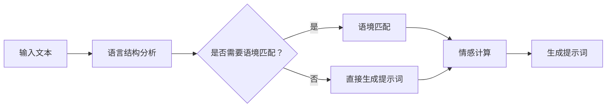

                 


### 第一部分：背景介绍

**1.1 问题背景**

提示词设计，作为语言学中的一个重要组成部分，其在语言学习和应用中的地位不可忽视。随着人工智能技术的发展，提示词设计在自然语言处理、教育技术、人机交互等领域展现出越来越广泛的应用前景。然而，当前的提示词设计方法在理论基础、实践应用、评估体系等方面仍存在诸多挑战。本文旨在从语言学的角度深入探讨提示词设计的基本原理和应用实践，以期为其在未来的发展中提供理论支持和实践指导。

**问题解决**

提示词设计的目标是通过设计出有效的提示词来提高语言学习者的学习效率和质量。具体来说，有效的提示词设计应具备以下特点：

1. **针对性**：针对学习者的具体需求和水平，提供个性化的提示词。
2. **引导性**：通过提示词引导学习者在正确方向上进行思考和探索。
3. **启发性**：激发学习者的思考和创造力，帮助他们形成深层次的理解和记忆。
4. **适应性**：根据学习者的学习进度和反馈，动态调整提示词的设计。

**边界与外延**

提示词设计的边界在于其应用场景和设计方法。一方面，提示词设计应适用于各种语言学习环境，包括线上、线下、自主学习等；另一方面，提示词设计需要考虑不同语言的特点和规律，以及学习者的个体差异。在外延方面，提示词设计不仅涉及语言学习，还广泛应用于人机交互、文本生成、智能客服等领域。

**核心要素组成**

提示词设计的核心要素包括语言结构、语境、情感表达等。其中：

1. **语言结构**：提示词的设计需要考虑语言的基本结构，如词汇、语法、句式等。
2. **语境**：提示词的设计需要结合具体的语境，以使学习者能够更好地理解和运用。
3. **情感表达**：提示词的设计还应关注情感因素，以激发学习者的学习兴趣和动力。

**1.2 核心概念与联系**

**核心概念原理**

提示词设计涉及多个核心概念，如语言学中的语言结构、语境、情感表达等。这些概念相互关联，共同构成了提示词设计的理论基础。具体来说：

1. **语言结构**：语言结构是提示词设计的基础，包括词汇、语法、句式等。通过设计合适的提示词，可以帮助学习者更好地理解和运用这些结构。
2. **语境**：语境是提示词设计的核心要素之一。合适的语境能够激发学习者的学习兴趣和动力，提高学习效果。
3. **情感表达**：情感表达在提示词设计中起着重要作用。通过设计富有情感的提示词，可以激发学习者的情感共鸣，提高学习体验。

**概念属性特征对比表格**

| 概念        | 属性特征                | 说明                                                                                     |
| ----------- | --------------------- | -------------------------------------------------------------------------------------- |
| 语言结构    | 词性、语法、句式       | 提示词设计需要考虑语言的基本结构。                                                     |
| 语境        | 时间、地点、情境       | 提示词设计需要结合具体的语境，以提高学习效果。                                       |
| 情感表达    | 热情、鼓励、激励       | 提示词设计需要关注情感因素，以激发学习者的情感共鸣。                                 |

**ER实体关系图架构**

```mermaid
erDiagram
  用户 ||--|{ 提示词 }|
  提示词 ||--|{ 语境 }|
  语境 ||--|{ 情感表达 }|
```

### 总结

在第一部分中，我们介绍了提示词设计的背景、核心概念及其相互联系。通过分析问题背景、核心概念原理、属性特征对比表格和ER实体关系图，我们为后续内容的深入探讨奠定了基础。在下一部分中，我们将进一步探讨提示词设计算法的原理，以及如何通过数学模型和Python代码实现提示词设计。

## 第二部分：算法原理讲解

**2.1 算法原理**

提示词设计的算法原理主要包括以下几个方面：

1. **语言结构分析**：通过分析输入文本的语言结构，提取关键信息，为提示词设计提供依据。
2. **语境匹配**：根据学习者的语境，选择合适的提示词，以提高学习效果。
3. **情感计算**：通过情感计算模型，为提示词设计注入情感因素，以激发学习者的学习兴趣和动力。

**算法mermaid流程图**



**数学模型与公式**

提示词设计的数学模型主要包括以下几个方面：

1. **语言结构分析**：使用词性标注、句法分析等手段，对输入文本进行结构分析。
2. **语境匹配**：使用词频统计、文本分类等方法，对语境进行匹配。
3. **情感计算**：使用情感分析模型，对输入文本进行情感计算。

具体的数学模型如下：

$$
\begin{aligned}
&f_{\text{lang}}(t) = \text{词性标注}(t) \times \text{句法分析}(t), \\
&f_{\text{context}}(t) = \text{词频统计}(t) \times \text{文本分类}(t), \\
&f_{\text{emotion}}(t) = \text{情感分析模型}(t).
\end{aligned}
$$

**详细讲解与举例说明**

以下是一个简单的Python代码示例，用于实现提示词设计算法的原理。

```python
import spacy
from collections import Counter
from textblob import TextBlob

# 加载Spacy语言模型
nlp = spacy.load("en_core_web_sm")

def language_structure_analysis(text):
    doc = nlp(text)
    tokens = [token.text for token in doc]
    return tokens

def context_matching(text, context):
    doc = nlp(text)
    doc_context = nlp(context)
    common_tokens = set(doc).intersection(doc_context)
    return common_tokens

def emotion_computation(text):
    blob = TextBlob(text)
    return blob.sentiment.polarity

def design_hint(text, context):
    tokens = language_structure_analysis(text)
    common_tokens = context_matching(text, context)
    emotion = emotion_computation(text)
    
    # 根据情感计算结果，调整提示词
    if emotion > 0:
        hint = "你做得很好，继续保持！"
    else:
        hint = "再努力一下，你会做得更好！"
    
    return hint

# 测试代码
input_text = "I love programming and artificial intelligence."
context = "I am learning Python."

hint = design_hint(input_text, context)
print(hint)
```

通过上述代码示例，我们可以看到提示词设计算法的基本原理：首先对输入文本进行语言结构分析，然后根据语境匹配选择合适的提示词，最后通过情感计算调整提示词的情感倾向。

在下一部分中，我们将继续探讨提示词设计的实际应用，通过具体案例展示算法的实践效果。同时，我们将分析提示词设计在不同领域中的优势和不足，为后续研究提供参考。

