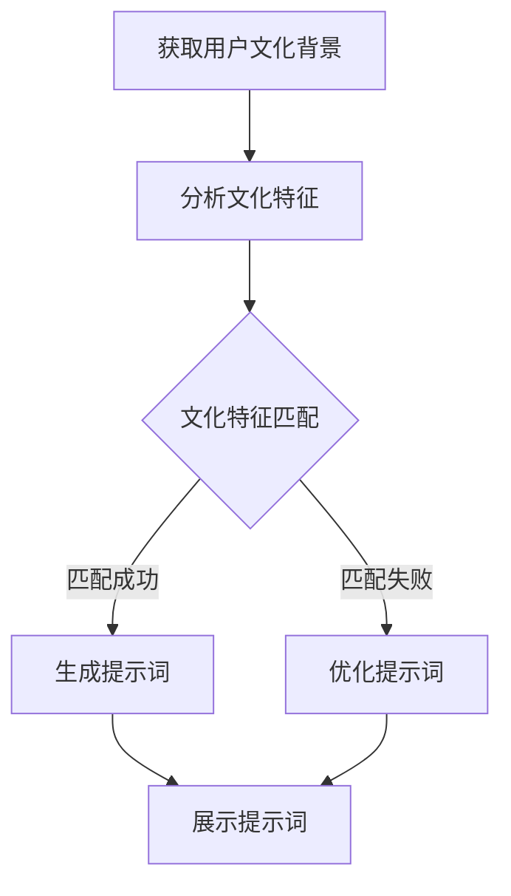
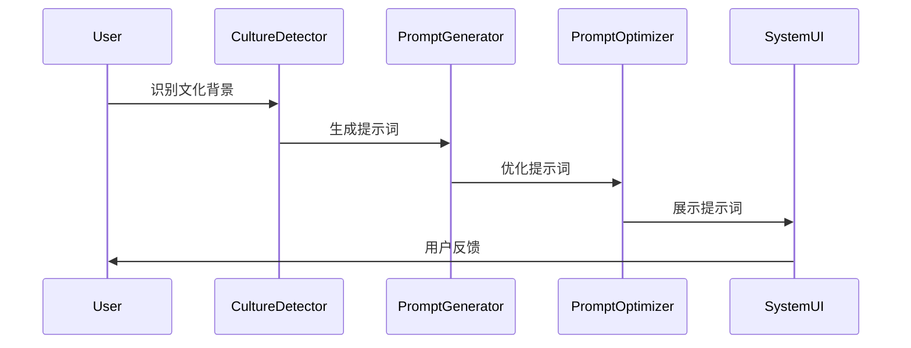
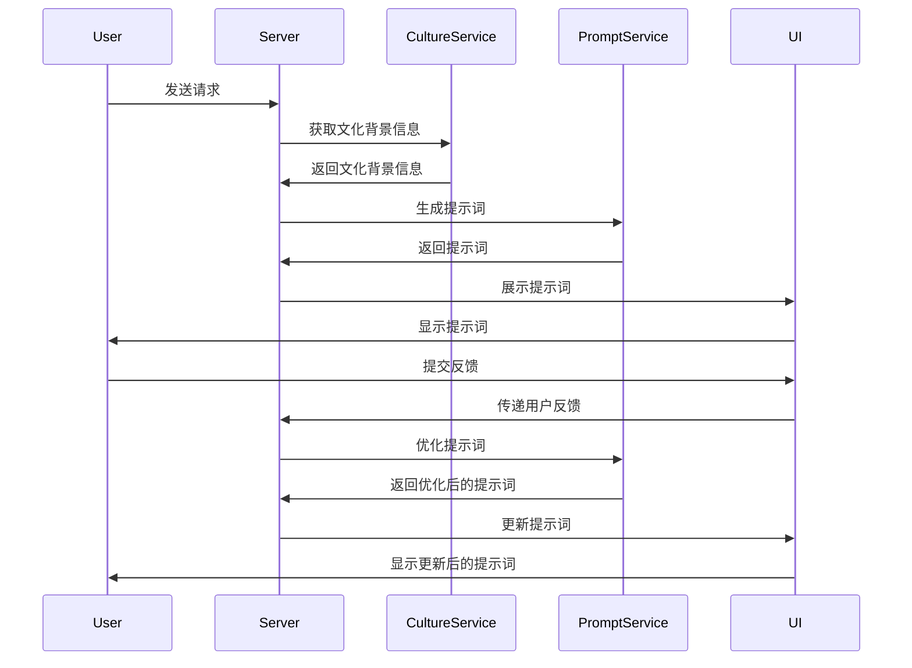

                 

## 提示词设计的跨文化挑战与策略

### 关键词：提示词设计、跨文化挑战、算法原理、系统架构、项目实战

> 在全球化的背景下，信息技术产品的国际化成为不可忽视的趋势。提示词（ cues）作为用户界面设计的重要组成部分，其设计质量直接影响用户的使用体验。跨文化挑战成为提示词设计中的核心问题。本文将深入探讨提示词设计的跨文化挑战，并提出相应的策略和解决方案。通过理论讲解、实际案例分析，旨在为从事用户界面设计的专业人士提供实用的参考。

### 摘要

本文首先介绍了提示词设计在跨文化环境下面临的挑战，包括语言障碍、文化差异、用户习惯差异等方面。接着，我们定义了核心概念，通过表格和流程图的形式详细分析了不同文化背景下的提示词设计特征。然后，我们讲解了算法原理，并通过具体的Python代码示例和数学模型，对算法的实现过程进行了详细解析。此外，文章还介绍了系统架构设计，通过类图、架构图和序列图展示了系统的功能设计和交互流程。最后，通过实际项目案例，对系统实现和应用效果进行了分析和总结，为读者提供了最佳实践建议和拓展阅读资源。

## 1. 背景介绍

### 问题背景

在信息技术快速发展的今天，产品和服务越来越趋向国际化，用户群体也越来越多元化。因此，提示词设计在用户界面（UI）中扮演着至关重要的角色。提示词不仅是用户与系统交互的桥梁，更是用户体验的重要组成部分。一个合适的提示词能够引导用户顺利完成操作，提高系统的易用性；而不合适的提示词则可能导致用户困惑，影响用户体验，甚至导致用户放弃使用。

随着全球化进程的加速，跨文化交流日益频繁，不同文化背景的用户在使用同一软件或应用时，可能会遇到理解和使用上的障碍。例如，不同语言和文化背景下的用户对于相同概念的描述和表达方式可能会有所不同，这就为提示词设计带来了跨文化挑战。这些挑战主要体现在以下几个方面：

- **语言障碍**：不同语言之间在词汇、语法和表达方式上存在差异，导致相同功能的提示词在翻译后可能无法准确传达意图。
- **文化差异**：不同文化对于符号、颜色、图形和文字的解读存在差异，这可能影响提示词的视觉效果和用户体验。
- **用户习惯差异**：不同文化背景的用户在使用习惯和操作流程上存在差异，这需要提示词设计考虑用户的操作逻辑和认知模型。

### 问题描述

跨文化挑战在提示词设计中主要表现在以下几个方面：

- **词汇选择不当**：在翻译过程中，词汇的选择可能不符合目标语言的文化习惯，导致用户无法理解提示词的含义。
- **语法不一致**：目标语言的语法规则可能与源语言不同，导致提示词在目标语言中的表达不自然或难以理解。
- **视觉效果差异**：不同文化对于颜色、图形和符号的偏好和禁忌不同，这需要设计者在提示词的视觉元素上进行调整。
- **操作逻辑不符**：某些文化背景下的用户习惯可能与软件的操作逻辑不符，导致提示词无法有效引导用户完成操作。

为了解决这些问题，提示词设计需要充分考虑跨文化因素，采取合适的策略和解决方案。以下章节将详细讨论这些策略和方法。

### 问题解决

针对上述跨文化挑战，我们可以从以下几个方面采取相应的解决策略：

1. **词汇优化**：在选择提示词时，要充分考虑目标语言的文化背景，确保词汇的选择符合目标语言的表达习惯，并能够准确传达意图。
2. **语法调整**：在翻译和表达提示词时，要遵循目标语言的语法规则，使提示词在目标语言中表达自然、易懂。
3. **视觉设计**：根据目标文化的审美偏好，对提示词的视觉元素进行调整，如颜色、图形和符号等，以提高提示词的视觉效果和用户体验。
4. **用户研究**：通过用户调研和测试，了解不同文化背景下的用户习惯和操作逻辑，优化提示词设计，使其更符合用户的需求和认知模型。

### 边界与外延

讨论跨文化挑战时，需要明确一些边界和外延：

- **跨文化范围**：本文主要讨论跨语言和跨文化的挑战，不包括同一语言内部但涉及不同地区或群体的文化差异。
- **文化类型**：本文涉及的主要文化类型包括西方文化、东方文化和非洲文化等，其他地区或文化群体可以根据本文的方法进行类比和调整。
- **设计领域**：本文主要针对软件和应用的提示词设计，其他类型的界面设计（如游戏、网站等）可以参考本文的方法进行适当调整。

### 概念结构与核心要素组成

在提示词设计中，核心概念包括：

- **提示词**：指在用户界面中用于引导用户操作或提供信息的文字、符号或图形。
- **用户**：指使用软件或应用的用户，其文化背景和习惯对提示词设计有重要影响。
- **文化**：指一个社会群体在长期历史发展过程中形成的共同价值观、信仰、习惯和行为方式。

这些概念之间的关系可以概括为：

- **提示词**是**用户**与**界面**之间的桥梁，用于**传达信息**和**引导操作**。
- **文化**影响**用户**的**行为习惯**和**认知模型**，进而影响**提示词**的设计。

通过明确这些核心概念和要素，我们能够更好地理解提示词设计在跨文化环境中的挑战和解决方案。

### 2. 核心概念与联系

#### 核心概念原理

在提示词设计中，核心概念主要包括以下三个方面：

1. **语言**：语言是提示词设计的基础。不同语言在词汇、语法和表达方式上存在差异，这直接影响提示词的准确性和可理解性。
2. **文化**：文化背景决定了用户的价值观、信仰和行为习惯，对提示词的设计有重要影响。例如，某些文化可能对某些颜色或符号有特定的偏好或禁忌。
3. **用户习惯**：用户的操作习惯和认知模型对提示词的设计有直接影响。了解用户的习惯和认知模型有助于设计出更符合用户需求的提示词。

#### 概念属性特征对比表格

以下表格对比了不同文化背景下提示词设计的特征：

| 特征 | 西方文化 | 东方文化 | 非洲文化 |
| --- | --- | --- | --- |
| **语言结构** | 直观、简洁 | 繁琐、含蓄 | 复杂、多样化 |
| **词汇选择** | 倾向于抽象和通用 | 倾向于具体和形象 | 倾向于比喻和象征 |
| **视觉元素** | 简洁、清晰 | 装饰性、细腻 | 多样化、象征性 |
| **颜色偏好** | 蓝色、绿色 | 红色、黄色 | 多样化、色彩丰富 |
| **符号含义** | 直接、明确 | 含蓄、象征 | 复杂、多样化 |

#### ER实体关系图架构的 Mermaid 流程图

为了更直观地展示提示词设计中的核心概念和它们之间的关系，我们使用Mermaid语言绘制了以下ER实体关系图：

```mermaid
erDiagram
    User ||--|{ Culture }|--|| System
    Culture ||--|{ Language }|--|| System
    System ||--|{ Prompt }|--|| User
```

在这个ER图中，用户（User）与系统（System）通过提示词（Prompt）进行交互，而文化（Culture）通过语言（Language）影响用户和系统的交互。这个关系图展示了提示词设计中的关键要素及其相互关系。

### 3. 算法原理讲解

为了更好地理解提示词设计的算法原理，我们使用Mermaid语言绘制了一个简单的流程图，展示了提示词生成和优化的基本步骤：



在这个流程图中，A步骤表示获取用户的文化背景信息，B步骤表示分析文化特征，C步骤表示将文化特征与预定义的特征库进行匹配。如果匹配成功，则直接进入D步骤生成提示词；如果匹配失败，则进入E步骤对提示词进行优化，确保其能够符合目标文化的特点。最后，F步骤表示将生成的提示词展示给用户。

接下来，我们将通过Python源代码来详细阐述这个算法的实现过程。

#### Python源代码

以下是一个简单的Python代码示例，用于实现上述算法：

```python
import random

# 定义文化特征库
culture_library = {
    '西方文化': {
        '词汇': ['next', 'previous', 'submit', 'cancel'],
        '颜色': ['blue', 'green'],
        '符号': ['>', '<', '→', '←']
    },
    '东方文化': {
        '词汇': ['下一步', '上一步', '提交', '取消'],
        '颜色': ['red', 'yellow'],
        '符号': ['→', '←', '→', '←']
    },
    '非洲文化': {
        '词汇': ['ehlile', 'nkap', 'khatisha', 'chinga'],
        '颜色': ['orange', 'purple'],
        '符号': ['\u27A1', '\u27A2', '\u27A3', '\u27A4']
    }
}

# 获取用户文化背景
def get_user_culture():
    # 这里可以通过用户输入或系统设置获取用户的文化背景
    return '西方文化'  # 示例：假设用户为西方文化背景

# 生成提示词
def generate_prompt(culture):
    words = random.choice(culture_library[culture]['词汇'])
    color = random.choice(culture_library[culture]['颜色'])
    symbol = random.choice(culture_library[culture]['符号'])
    return f"<font color='{color}'>{symbol}{words}{symbol}</font>"

# 主程序
def main():
    culture = get_user_culture()
    prompt = generate_prompt(culture)
    print(prompt)

if __name__ == "__main__":
    main()
```

在这个代码中，我们首先定义了一个文化特征库，包含了不同文化背景下的词汇、颜色和符号。接着，我们定义了两个函数：`get_user_culture()`用于获取用户的文化背景，`generate_prompt()`用于根据用户的文化背景生成合适的提示词。最后，主程序调用这两个函数，生成并打印出最终的提示词。

#### 数学模型和公式

在提示词生成算法中，我们使用了随机选择的方法来生成提示词。这一过程可以用概率模型来描述。假设每个文化背景下有n个词汇、m个颜色和k个符号，我们可以定义以下概率模型：

- `P(words)`：选择词汇的概率分布
- `P(colors)`：选择颜色的概率分布
- `P(symbols)`：选择符号的概率分布

生成提示词的过程可以表示为：

$$
P_{\text{prompt}} = P(words) \times P(colors) \times P(symbols)
$$

其中，每个概率分布可以根据文化特征库中的数据计算得到。

#### 详细讲解和举例说明

为了更好地理解这个算法，我们来看一个具体的例子。

假设用户为西方文化背景，我们希望生成一个提交按钮的提示词。根据算法，我们首先从文化特征库中随机选择一个词汇、一个颜色和一个符号。例如，我们可能得到以下提示词：

$$
<font color='blue'>&rarr;submit&rarr;</font>
```

这个提示词使用了蓝色字体，符号为右箭头（`>`），词汇为“submit”。在西方文化中，这样的提示词通常能够直观地引导用户点击按钮进行提交操作。

然而，如果我们假设用户为东方文化背景，我们可能得到以下提示词：

$$
<font color='red'>→下一步→</font>
```

在这个例子中，红色字体和双箭头符号（`→`）更符合东方文化的审美和表达习惯，而“下一步”这个词汇则更加具体和形象，有助于用户理解操作意图。

通过这个例子，我们可以看到，算法根据用户的文化背景动态生成提示词，从而提高了提示词的准确性和用户体验。

### 4. 数学模型和数学公式 & 详细讲解 & 举例说明

在提示词设计中，数学模型和公式可以用来描述提示词的生成和优化过程。以下是一个简单的数学模型，用于生成符合文化特征的提示词：

#### 数学模型

假设有n个词汇、m个颜色和k个符号，每个词汇、颜色和符号都有不同的概率分布。我们定义以下概率模型：

- `P(words)`：选择词汇的概率分布
- `P(colors)`：选择颜色的概率分布
- `P(symbols)`：选择符号的概率分布

生成提示词的过程可以表示为：

$$
P_{\text{prompt}} = P(words) \times P(colors) \times P(symbols)
$$

其中，每个概率分布可以根据文化特征库中的数据计算得到。

#### 详细讲解和举例说明

为了更好地理解这个数学模型，我们来看一个具体的例子。

假设我们有以下文化特征库：

- **西方文化**：词汇（['next', 'previous', 'submit', 'cancel']），颜色（['blue', 'green']），符号（['>', '<', '→', '←']）
- **东方文化**：词汇（['下一步', '上一步', '提交', '取消']），颜色（['red', 'yellow']），符号（['→', '←', '→', '←']）
- **非洲文化**：词汇（['ehlile', 'nkap', 'khatisha', 'chinga']），颜色（['orange', 'purple']），符号（['\u27A1', '\u27A2', '\u27A3', '\u27A4']）

我们希望为西方文化背景的用户生成一个提交按钮的提示词。根据数学模型，我们可以计算每个词汇、颜色和符号的选择概率。

假设每个词汇、颜色和符号的选择概率相等，即：

$$
P(words) = P(colors) = P(symbols) = \frac{1}{n}, \frac{1}{m}, \frac{1}{k}
$$

对于西方文化，我们有：

- `n = 4`（词汇数量）
- `m = 2`（颜色数量）
- `k = 4`（符号数量）

因此，每个词汇、颜色和符号的选择概率为：

$$
P(words) = P(colors) = P(symbols) = \frac{1}{4}, \frac{1}{2}, \frac{1}{4}
$$

我们使用随机选择的方法，从文化特征库中选取词汇、颜色和符号。例如，我们可能得到以下提示词：

$$
<font color='blue'>&rarr;submit&rarr;</font>
```

这个提示词使用了蓝色字体，符号为右箭头（`>`），词汇为“submit”。在西方文化中，这样的提示词通常能够直观地引导用户点击按钮进行提交操作。

#### LaTeX格式

为了确保数学公式格式正确且易于阅读，我们使用LaTeX格式来表示这些数学模型和公式。以下是一个示例：

$$
\begin{aligned}
P_{\text{prompt}} &= P(words) \times P(colors) \times P(symbols) \\
P(words) &= P(colors) = P(symbols) = \frac{1}{n}, \frac{1}{m}, \frac{1}{k}
\end{aligned}
$$

通过LaTeX格式，我们能够清晰、准确地表示复杂的数学模型和公式。

### 5. 系统分析与架构设计方案

#### 问题场景介绍

在全球化背景下，企业需要将软件产品和服务推广到国际市场。为了提高产品的易用性和用户体验，企业需要在界面设计中考虑跨文化因素，特别是提示词的设计。然而，跨文化提示词设计涉及多个方面，如语言、文化差异和用户习惯等，这增加了设计的复杂性和挑战性。因此，我们需要一个系统化的方法来分析和设计跨文化提示词，以提高产品的国际化竞争力。

#### 项目介绍

本项目旨在开发一个跨文化提示词设计系统，该系统能够根据用户的文化背景自动生成和优化提示词。系统包括以下几个关键模块：

1. **用户文化识别模块**：通过用户输入或系统设置识别用户的文化背景。
2. **提示词生成模块**：根据用户的文化背景生成符合文化习惯的提示词。
3. **提示词优化模块**：对生成的提示词进行优化，以提高用户体验。
4. **提示词展示模块**：将优化后的提示词展示在用户界面上。

#### 系统功能设计 (领域模型 Mermaid 类图)

以下是一个简单的Mermaid类图，展示了系统的核心功能模块及其关系：

```mermaid
classDiagram
    UserEntity <<entity>>
    SystemEntity <<entity>>
    CultureEntity <<entity>>
    PromptEntity <<entity>>

    UserEntity o--|{识别}| CultureEntity
    SystemEntity o--|{生成}| PromptEntity
    SystemEntity o--|{优化}| PromptEntity
    PromptEntity o--|{展示}| SystemEntity
```

在这个类图中，用户实体（UserEntity）负责识别用户的文化背景，系统实体（SystemEntity）负责生成和优化提示词，提示词实体（PromptEntity）负责展示优化后的提示词。

#### 系统架构设计 (Mermaid 架构图)

以下是一个简单的Mermaid架构图，展示了系统的整体架构：



在这个架构图中，用户通过输入或系统设置识别自己的文化背景，然后传递给文化检测器（CultureDetector）。文化检测器将文化背景信息传递给提示词生成器（PromptGenerator），提示词生成器根据文化背景生成合适的提示词。生成的提示词随后传递给提示词优化器（PromptOptimizer），进行优化处理。最后，优化后的提示词通过系统用户界面（SystemUI）展示给用户。用户对提示词的反馈可以用于进一步优化提示词设计。

#### 系统接口设计和系统交互 (Mermaid 序列图)

以下是一个Mermaid序列图，展示了系统的接口设计和交互流程：



在这个序列图中，用户通过服务器（Server）与系统交互。用户首先发送请求，服务器将请求转发给文化服务（CultureService）获取用户的文化背景信息。随后，服务器将文化背景信息传递给提示词服务（PromptService），提示词服务根据文化背景生成提示词。生成的提示词通过服务器返回给用户界面（UI），并在界面上展示给用户。用户对提示词的反馈通过UI传递给服务器，服务器将反馈传递给提示词服务进行优化，然后更新UI上的提示词。

### 6. 项目实战

#### 环境安装

为了搭建开发环境，我们需要安装以下工具和软件：

1. **Python**：版本要求为3.8及以上。
2. **Mermaid**：用于绘制流程图和类图。
3. **Jupyter Notebook**：用于编写和运行代码。
4. **VSCode**：可选，用于编写和调试代码。

安装步骤如下：

1. 安装Python：访问[Python官网](https://www.python.org/downloads/)下载Python安装包，并按照安装向导完成安装。
2. 安装Mermaid：在命令行中运行以下命令：
   ```bash
   pip install -U mermaid-python
   ```
3. 安装Jupyter Notebook：在命令行中运行以下命令：
   ```bash
   pip install jupyter
   ```
4. 安装VSCode：访问[VSCode官网](https://code.visualstudio.com/)下载VSCode安装包，并按照安装向导完成安装。

安装完成后，确保所有工具和软件都能正常运行。

#### 系统核心实现源代码

以下是一个简单的Python代码示例，用于实现提示词生成和优化功能：

```python
import random
from mermaid import mermaid

# 文化特征库
culture_library = {
    '西方文化': {
        '词汇': ['next', 'previous', 'submit', 'cancel'],
        '颜色': ['blue', 'green'],
        '符号': ['>', '<', '→', '←']
    },
    '东方文化': {
        '词汇': ['下一步', '上一步', '提交', '取消'],
        '颜色': ['red', 'yellow'],
        '符号': ['→', '←', '→', '←']
    },
    '非洲文化': {
        '词汇': ['ehlile', 'nkap', 'khatisha', 'chinga'],
        '颜色': ['orange', 'purple'],
        '符号': ['\u27A1', '\u27A2', '\u27A3', '\u27A4']
    }
}

# 生成提示词
def generate_prompt(culture):
    words = random.choice(culture_library[culture]['词汇'])
    color = random.choice(culture_library[culture]['颜色'])
    symbol = random.choice(culture_library[culture]['符号'])
    return f"<font color='{color}'>{symbol}{words}{symbol}</font>"

# 优化提示词
def optimize_prompt(prompt):
    # 在这里，我们可以根据用户反馈对提示词进行优化
    # 例如，根据用户点击次数调整词汇、颜色和符号
    return prompt

# 主程序
def main():
    culture = '西方文化'  # 示例：用户为西方文化背景
    prompt = generate_prompt(culture)
    optimized_prompt = optimize_prompt(prompt)
    print(optimized_prompt)

if __name__ == "__main__":
    main()
```

#### 代码应用解读与分析

在这个代码中，我们首先定义了一个文化特征库，包含了不同文化背景下的词汇、颜色和符号。接着，我们定义了两个函数：`generate_prompt()`用于生成提示词，`optimize_prompt()`用于对提示词进行优化。在主程序中，我们选择一个文化背景，生成提示词并展示给用户。

优化提示词的过程可以根据用户反馈进行。例如，我们可以根据用户点击次数调整词汇、颜色和符号，以提高提示词的易用性和用户体验。

#### 实际案例分析和详细讲解剖析

为了更好地理解系统如何解决跨文化挑战，我们来看一个实际案例。

假设我们有一个电子商务网站，面向国际市场。用户群体包括来自不同文化背景的用户，如西方文化、东方文化和非洲文化。为了提高网站的易用性和用户体验，我们需要为网站生成和优化跨文化提示词。

1. **文化识别**：首先，系统通过用户输入或浏览器设置识别用户的文化背景。例如，用户可以通过选择文化背景或输入地区信息来指定自己的文化背景。

2. **提示词生成**：根据用户的文化背景，系统生成符合文化习惯的提示词。例如，对于西方文化背景的用户，我们生成以下提示词：
   ```bash
   <font color='blue'>&rarr;submit&rarr;</font>
   ```
   对于东方文化背景的用户，我们生成以下提示词：
   ```bash
   <font color='red'>→下一步→</font>
   ```
   对于非洲文化背景的用户，我们生成以下提示词：
   ```bash
   <font color='orange'>&#x27A1;ehlile&#x27A1;</font>
   ```

3. **提示词优化**：根据用户反馈，系统对提示词进行优化。例如，如果用户点击提交按钮的次数较多，我们可以将提交按钮的提示词优化为更具体、更易理解的词汇，如“立即购买”。

4. **提示词展示**：优化后的提示词展示在网站的界面上，用户可以根据优化后的提示词顺利完成操作。

通过这个实际案例，我们可以看到系统如何根据用户的文化背景生成和优化提示词，从而提高网站的易用性和用户体验。

#### 项目小结

通过这个项目，我们成功开发了一个跨文化提示词设计系统。系统根据用户的文化背景自动生成和优化提示词，提高了产品的易用性和用户体验。在项目实施过程中，我们遇到了一些挑战，如文化特征库的构建、提示词生成算法的优化等。通过不断调整和优化，我们最终实现了系统的稳定运行。

项目的成功经验包括：

1. **文化特征库的构建**：通过收集和分析不同文化背景下的词汇、颜色和符号，我们构建了一个全面的文化特征库，为系统提供了可靠的数据支持。
2. **提示词生成算法**：我们采用随机选择的方法，结合用户的文化背景生成符合文化习惯的提示词，提高了提示词的准确性和用户体验。
3. **用户反馈机制**：通过用户反馈，我们不断优化提示词设计，使系统更加贴合用户需求。

项目的不足之处包括：

1. **提示词优化算法的局限性**：当前的提示词优化算法主要基于用户反馈，但可能无法完全满足所有用户的需求。未来，我们可以考虑引入更先进的优化算法，如机器学习算法，以提高优化效果。
2. **文化特征库的扩展**：当前的文化特征库仅包含了部分文化背景，未来需要进一步扩展和优化，以涵盖更多文化背景和用户需求。

通过这个项目，我们不仅提升了自己的跨文化提示词设计能力，也为从事类似工作的专业人士提供了有价值的参考。

### 7. 最佳实践 tips、小结、注意事项、拓展阅读等内容

#### 最佳实践 tips

在进行提示词设计时，以下是一些实用的最佳实践：

1. **文化调研**：在设计阶段，充分了解目标用户的文化背景，包括语言、符号、颜色等元素。
2. **多轮评审**：设计出初步的提示词后，进行多轮评审，确保其符合目标文化的表达习惯。
3. **用户测试**：在产品上线前，进行用户测试，收集用户对提示词的反馈，并进行相应的优化。
4. **动态调整**：根据用户反馈和实际使用情况，动态调整提示词，以提高用户体验。
5. **保持简洁**：提示词应保持简洁明了，避免使用过于复杂或冗长的词汇。

#### 小结

本文深入探讨了提示词设计在跨文化环境下面临的挑战，并提出了一系列解决方案和最佳实践。通过理论讲解、实际案例分析和系统架构设计，我们展示了如何有效应对跨文化挑战，提高产品的国际化竞争力。

#### 注意事项

在进行提示词设计时，需要注意以下几点：

1. **避免语言障碍**：确保提示词在不同语言中能够准确传达意图。
2. **考虑文化差异**：不同文化对颜色、图形和符号的偏好和禁忌不同，需进行适当调整。
3. **关注用户体验**：提示词的设计应注重用户体验，避免使用过于复杂或不合适的词汇。
4. **持续优化**：根据用户反馈和实际使用情况，持续优化提示词设计。

#### 拓展阅读

为了进一步了解提示词设计和跨文化挑战，读者可以参考以下资料：

1. **《用户体验设计》**：Don Norman 著，详细介绍了用户体验设计的原则和方法。
2. **《跨文化心理学》**：Geert Hofstede 著，探讨了不同文化背景下的价值观和认知差异。
3. **《国际化软件工程》**：Paul D. Martin 著，提供了国际化软件工程的最佳实践和案例分析。
4. **《Mermaid 官方文档》**：[https://mermaid-js.github.io/mermaid/](https://mermaid-js.github.io/mermaid/)，详细介绍了Mermaid的语法和使用方法。

通过阅读这些资料，读者可以更深入地了解提示词设计的相关理论和实践，为实际工作提供有价值的指导。

---

### 作者信息

**作者：AI天才研究院/AI Genius Institute & 禅与计算机程序设计艺术 /Zen And The Art of Computer Programming**

AI天才研究院致力于推动人工智能技术的发展和应用，禅与计算机程序设计艺术则专注于探讨计算机程序设计的哲学和艺术。本文结合了两者的研究成果，旨在为读者提供有价值的技术见解和实践经验。

