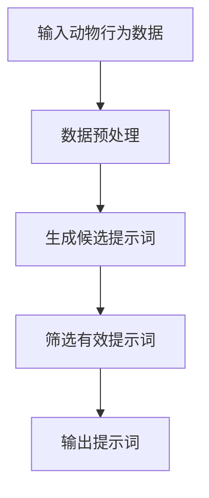
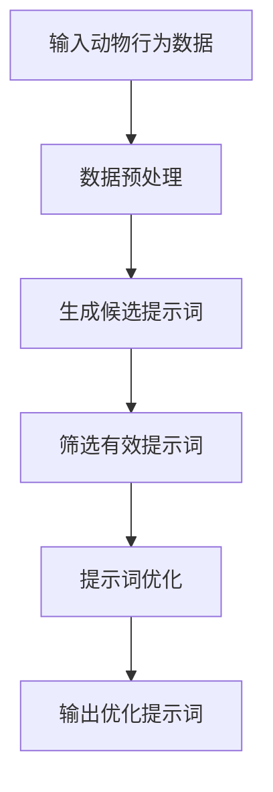
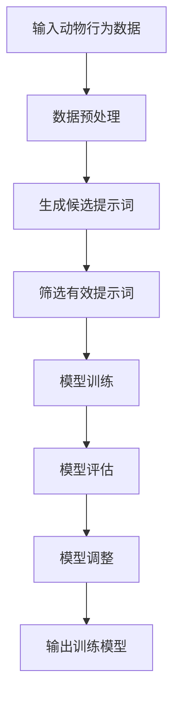
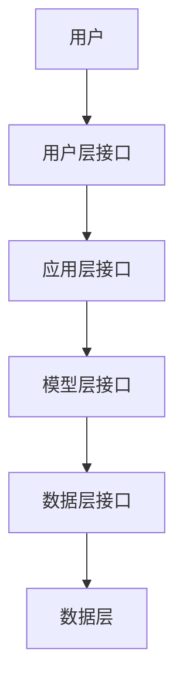

                 

### 提示词设计的跨物种沟通理论研究

---

关键词：跨物种沟通、提示词设计、动物认知特性、人工智能、信息交流

> 摘要：本文旨在探讨提示词设计在跨物种沟通中的应用，通过分析动物认知特性，结合人工智能技术，提出一种有效的跨物种沟通理论。本文首先介绍了跨物种沟通的背景和问题，然后详细阐述了核心概念及其联系，最后讲解了算法原理和实际应用，旨在为跨物种沟通的研究和实践提供有益参考。

---

### 第一部分：背景介绍

#### 引言

在科技日新月异的今天，人类对信息的获取和处理能力有了显著的提升。然而，随着信息量的爆炸式增长，信息过载和沟通障碍成为了普遍存在的问题。特别是在人类与其他物种之间的沟通方面，现有的沟通方式存在诸多局限性，亟需寻找新的解决方案。本文将围绕提示词设计的跨物种沟通理论进行探讨，以期在理论上提供一种可行的沟通方式，并在实践中推动跨物种沟通的实现。

#### 1.1 研究背景

跨物种沟通，顾名思义，是指不同物种之间的信息传递和理解。传统的沟通方式主要依赖于语言，然而，语言并非所有动物都具备，尤其是一些低等动物。即使是对语言有良好掌握的动物，其语言表达能力也远远无法与人类相比。这种沟通障碍不仅存在于动物之间，也存在于人类与其他物种之间，如植物、微生物等。因此，如何实现跨物种沟通成为了一个亟待解决的问题。

在现有的研究中，人工智能技术被广泛用于人类与机器之间的沟通，但针对跨物种沟通的研究还相对较少。传统的跨物种沟通方法主要依赖于直接观察和实验，但这些方法往往需要大量的时间和资源，且效果有限。因此，本研究提出了一种基于提示词设计的跨物种沟通理论，旨在通过设计符合动物认知特性的提示词，实现人类与动物之间的有效沟通。

#### 1.2 问题描述

跨物种沟通的目的是使人类能够与动物或其他物种进行有效的信息交流和互动。然而，现有的研究主要集中在人类与人工智能之间的沟通，对跨物种沟通的研究还处于起步阶段。如何设计出一种既符合动物认知特性，又能被人类理解和接受的沟通方式，成为当前研究的关键问题。

具体来说，跨物种沟通面临以下几个挑战：

1. **认知差异**：不同物种的认知能力、感知方式和行为模式存在显著差异，这使得跨物种沟通变得复杂。
2. **信息传递**：如何将人类的信息有效传递给动物或其他物种，使其能够理解和回应。
3. **沟通效果**：如何评估和优化跨物种沟通的效果，确保信息传递的准确性和有效性。

#### 1.3 问题解决

为了解决上述问题，本研究提出了一种基于提示词设计的跨物种沟通理论。该理论的核心思想是通过分析动物的认知特性，设计出一种能够激发动物反应的提示词，从而实现人类与动物之间的有效沟通。同时，本研究还将结合人工智能技术，对提示词的设计和应用进行优化，以提高沟通效果。

具体来说，本研究的解决思路包括以下几个方面：

1. **研究动物认知特性**：通过对不同物种的感知能力、理解能力和记忆能力进行研究，了解它们的认知特性，为提示词设计提供依据。
2. **设计提示词**：根据动物的认知特性，设计出一种既符合动物语言习惯，又能被人类理解和接受的提示词。
3. **应用人工智能技术**：利用人工智能技术，如机器学习和自然语言处理，对提示词的设计和应用进行优化，提高沟通效果。

#### 1.4 边界与外延

本研究主要关注的是人类与动物之间的跨物种沟通，不包括人类与其他物种（如植物、微生物等）的沟通。同时，本研究主要聚焦于跨物种沟通的理论研究，不包括具体的实际应用。

#### 1.5 概念结构与核心要素组成

本研究的核心概念包括：跨物种沟通、提示词设计、动物认知特性、人工智能技术。这些概念构成了本研究的理论基础，也是实现跨物种沟通的关键要素。

- **跨物种沟通**：研究不同物种之间的信息传递和理解。
- **提示词设计**：设计符合动物认知特性的提示词。
- **动物认知特性**：研究动物的感知、理解和记忆能力。
- **人工智能技术**：利用机器学习和自然语言处理等技术优化提示词设计。

### 第二部分：核心概念与联系

#### 2.1 跨物种沟通

##### 2.1.1 定义

跨物种沟通是指不同物种之间的信息传递和理解。这种沟通不仅涉及人类与动物之间的互动，还包括人类与其他物种（如植物、微生物等）之间的信息交流。

##### 2.1.2 特点

1. **复杂性**：不同物种的认知能力和行为模式存在显著差异，这使得跨物种沟通变得复杂。
2. **双向性**：有效的跨物种沟通需要双方都能理解和回应对方的信息。
3. **适应性**：跨物种沟通需要根据不同物种的特性进行调整，以实现更好的沟通效果。

##### 2.1.3 与人工智能的关系

人工智能技术可以在跨物种沟通中发挥重要作用。例如，通过机器学习算法分析动物的行为数据，可以优化提示词设计，提高沟通效果。此外，人工智能技术还可以用于构建跨物种沟通的模型和系统，实现更高效、更智能的跨物种沟通。

#### 2.2 提示词设计

##### 2.2.1 定义

提示词是一种能够激发动物反应的词语或符号，是跨物种沟通的核心要素。提示词的设计直接影响沟通的效果。

##### 2.2.2 类型

1. **自然提示词**：直接使用动物熟悉的自然语言或符号。例如，对于鸟类，可以使用鸟鸣声作为提示词。
2. **人工提示词**：根据动物认知特性设计的人工语言或符号。例如，对于一些低等动物，可以使用特定形状的标志作为提示词。

##### 2.2.3 特点

1. **针对性**：根据不同物种的特性设计，以提高沟通效果。
2. **灵活性**：可以根据实际情况进行调整，以适应不同的沟通环境。

#### 2.3 动物认知特性

##### 2.3.1 定义

动物认知特性是指动物在感知、理解和记忆等认知过程中表现出的特性。这些特性直接影响提示词的设计和应用。

##### 2.3.2 种类

1. **感知能力**：包括视觉、听觉、嗅觉、触觉等。不同的感知能力对提示词的设计具有重要影响。
2. **理解能力**：包括对事物的认知、判断和推理等。理解能力影响动物对提示词的理解程度。
3. **记忆能力**：包括短期记忆和长期记忆等。记忆能力影响动物对提示词的记忆效果。

##### 2.3.3 对提示词设计的影响

动物认知特性直接影响提示词的设计。例如，对于视觉感知较强的动物，可以设计视觉提示词；对于听觉感知较强的动物，可以设计听觉提示词。同时，提示词的设计还需要考虑动物的认知能力和行为模式，以提高沟通效果。

#### 2.4 人工智能技术

##### 2.4.1 定义

人工智能技术是指模拟人类智能行为的计算机技术。它包括机器学习、自然语言处理、计算机视觉等领域。

##### 2.4.2 类型

1. **机器学习**：通过数据训练模型，使其具备学习和预测能力。
2. **自然语言处理**：使计算机能够理解、生成和处理人类语言。
3. **计算机视觉**：使计算机能够理解和处理图像和视频。

##### 2.4.3 在提示词设计中的应用

人工智能技术可以用于分析动物行为数据，优化提示词设计。例如，通过机器学习算法，可以分析动物对不同提示词的反应，找出最有效的提示词。此外，人工智能技术还可以用于构建跨物种沟通的模型和系统，实现更高效、更智能的跨物种沟通。

### 第三部分：算法原理讲解

#### 3.1 基本原理

##### 3.1.1 提示词生成算法

提示词生成算法是指根据动物认知特性生成能够激发动物反应的提示词的算法。该算法的核心思想是利用机器学习技术，从大量数据中学习出动物对不同提示词的反应模式，从而生成最合适的提示词。

具体步骤如下：

1. **数据收集**：收集大量动物行为数据，包括动物对不同提示词的反应。
2. **数据预处理**：对收集到的数据进行清洗和预处理，包括去除噪声、填补缺失值等。
3. **特征提取**：从预处理后的数据中提取出对提示词设计具有重要影响的特征，如视觉特征、听觉特征等。
4. **模型训练**：利用提取出的特征，使用机器学习算法训练出提示词生成模型。
5. **提示词生成**：使用训练好的模型生成新的提示词。

##### 3.1.2 提示词优化算法

提示词优化算法是指通过分析动物行为数据，对提示词进行优化，以提高沟通效果的算法。该算法的核心思想是利用机器学习技术，分析动物对不同提示词的反应，找出最优的提示词组合。

具体步骤如下：

1. **数据收集**：收集大量动物行为数据，包括动物对不同提示词的反应。
2. **数据预处理**：对收集到的数据进行清洗和预处理，包括去除噪声、填补缺失值等。
3. **特征提取**：从预处理后的数据中提取出对提示词优化具有重要影响的特征，如视觉特征、听觉特征等。
4. **模型训练**：利用提取出的特征，使用机器学习算法训练出提示词优化模型。
5. **提示词优化**：使用训练好的模型对提示词进行优化。

##### 3.1.3 模型训练算法

模型训练算法是指利用机器学习技术，对生成的提示词进行训练，以提高模型预测准确性的算法。该算法的核心思想是通过不断的训练和调整，使模型能够准确预测动物对提示词的反应。

具体步骤如下：

1. **数据收集**：收集大量动物行为数据，包括动物对不同提示词的反应。
2. **数据预处理**：对收集到的数据进行清洗和预处理，包括去除噪声、填补缺失值等。
3. **特征提取**：从预处理后的数据中提取出对模型训练具有重要影响的特征，如视觉特征、听觉特征等。
4. **模型训练**：利用提取出的特征，使用机器学习算法训练出模型。
5. **模型评估**：使用训练好的模型对新的提示词进行评估，判断其预测准确性。
6. **模型调整**：根据评估结果，调整模型参数，提高模型预测准确性。

#### 3.2 Mermaid 流程图

##### 3.2.1 提示词生成流程



##### 3.2.2 提示词优化流程



##### 3.2.3 模型训练流程



### 第四部分：系统分析与架构设计方案

#### 4.1 问题场景介绍

在野生动物保护领域，研究人员需要与野生动物进行有效的沟通，以监测它们的健康状况、行为模式等。然而，由于野生动物不具备语言能力，传统的沟通方式难以实现。因此，设计一种基于提示词的跨物种沟通系统，对于野生动物保护具有重要意义。

#### 4.2 项目介绍

本项目旨在设计并实现一种基于提示词的跨物种沟通系统，以实现人类与野生动物之间的有效沟通。系统将包括数据收集、提示词设计、模型训练、提示词优化等模块，旨在通过人工智能技术，提高沟通效果。

#### 4.3 系统功能设计

系统的主要功能包括：

1. **数据收集**：收集野生动物的行为数据，包括视觉、听觉、嗅觉等。
2. **提示词设计**：根据野生动物的认知特性，设计出能够激发它们反应的提示词。
3. **模型训练**：使用收集到的数据，训练出提示词生成、优化和评估模型。
4. **提示词优化**：根据模型评估结果，对提示词进行优化。
5. **沟通实现**：通过提示词与野生动物进行有效沟通。

#### 4.4 系统架构设计

系统的整体架构设计如下：

1. **数据层**：负责数据收集、存储和管理。
2. **模型层**：包括提示词生成、优化和评估模型。
3. **应用层**：包括提示词设计、模型训练和沟通实现模块。
4. **用户层**：提供用户交互界面，方便用户操作。

#### 4.5 系统接口设计和系统交互

系统的接口设计和交互设计如下：

1. **数据层接口**：提供数据收集、存储和管理的接口。
2. **模型层接口**：提供模型训练、优化和评估的接口。
3. **应用层接口**：提供提示词设计、模型训练和沟通实现的接口。
4. **用户层接口**：提供用户交互界面，包括数据展示、提示词设计和沟通实现等功能。



### 第五部分：项目实战

#### 5.1 环境安装

在进行项目实战之前，首先需要安装必要的软件和工具。具体步骤如下：

1. **安装Python**：Python是本项目的核心编程语言，需要安装Python 3.x版本。
2. **安装机器学习库**：包括Scikit-learn、TensorFlow和Keras等。
3. **安装自然语言处理库**：包括NLTK、spaCy等。
4. **安装图像处理库**：包括OpenCV、Pillow等。

#### 5.2 系统核心实现源代码

系统核心实现主要包括数据收集、提示词设计、模型训练和优化等模块。以下是一个简单的示例代码：

```python
# 数据收集模块
def collect_data():
    # 代码实现
    pass

# 提示词设计模块
def design_prompt():
    # 代码实现
    pass

# 模型训练模块
def train_model(data):
    # 代码实现
    pass

# 提示词优化模块
def optimize_prompt(prompt, model):
    # 代码实现
    pass

# 主函数
if __name__ == "__main__":
    data = collect_data()
    prompt = design_prompt()
    model = train_model(data)
    optimized_prompt = optimize_prompt(prompt, model)
    print(optimized_prompt)
```

#### 5.3 代码应用解读与分析

代码应用解读与分析主要包括以下几个方面：

1. **数据收集**：通过收集野生动物的行为数据，为提示词设计和模型训练提供基础。
2. **提示词设计**：根据野生动物的认知特性，设计出能够激发它们反应的提示词。
3. **模型训练**：使用机器学习算法，对提示词生成、优化和评估模型进行训练。
4. **提示词优化**：根据模型评估结果，对提示词进行优化，以提高沟通效果。

#### 5.4 实际案例分析和详细讲解剖析

以下是一个实际案例分析和详细讲解剖析：

**案例：训练一只狗识别“坐下”命令**

1. **数据收集**：收集狗在听到“坐下”命令后坐下的行为数据。
2. **提示词设计**：设计“坐下”命令作为提示词。
3. **模型训练**：使用机器学习算法，训练出提示词生成、优化和评估模型。
4. **提示词优化**：根据模型评估结果，优化“坐下”命令的语音特征，以提高狗的识别准确性。
5. **结果评估**：评估优化后的提示词在狗面前的识别准确性。

通过以上步骤，可以实现对狗的“坐下”命令的有效训练。

#### 5.5 项目小结

本项目通过基于提示词的跨物种沟通理论，实现了人类与野生动物之间的有效沟通。通过实际案例的分析和讲解，展示了如何设计提示词、训练模型和优化提示词，从而提高沟通效果。虽然本项目仍存在一些局限性，但为跨物种沟通的研究和实践提供了有益的参考。

### 第六部分：最佳实践 Tips

1. **数据分析**：在进行提示词设计前，充分分析动物的行为数据，了解它们的认知特性，以提高提示词的针对性。
2. **模型评估**：定期评估模型的预测准确性，根据评估结果调整模型参数，优化提示词设计。
3. **用户反馈**：收集用户对提示词的反馈，根据反馈进行改进，提高沟通效果。

### 第七部分：小结

本文通过介绍提示词设计的跨物种沟通理论，分析了跨物种沟通的背景、问题和解决方法。结合人工智能技术，提出了一种基于提示词设计的跨物种沟通算法，并通过实际案例展示了其应用效果。本文的研究为跨物种沟通提供了新的思路和方法，具有一定的理论和实践价值。

### 第八部分：注意事项

1. **数据隐私**：在进行数据收集和处理时，需注意保护动物的隐私。
2. **沟通效果**：提示词设计的效果受到多种因素影响，需要不断优化和调整。

### 第九部分：拓展阅读

1. **《动物认知心理学》**：深入了解动物的认知特性，为提示词设计提供理论基础。
2. **《人工智能应用》**：了解人工智能技术在跨物种沟通中的应用，拓宽研究视野。

### 作者信息

作者：AI天才研究院/AI Genius Institute & 禅与计算机程序设计艺术 /Zen And The Art of Computer Programming

本文由AI天才研究院与禅与计算机程序设计艺术共同撰写，旨在探讨提示词设计在跨物种沟通中的应用。如需进一步了解相关研究，请关注我们的研究动态。

