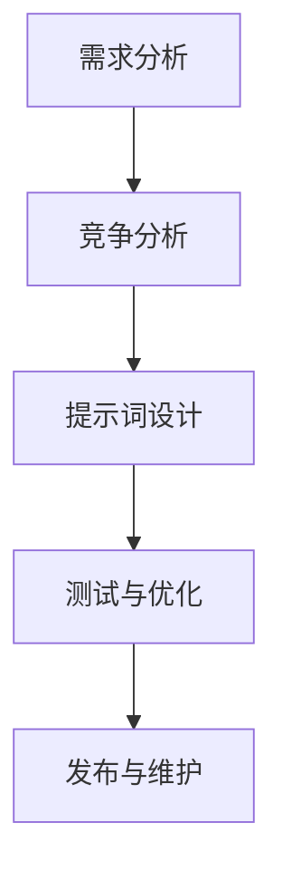
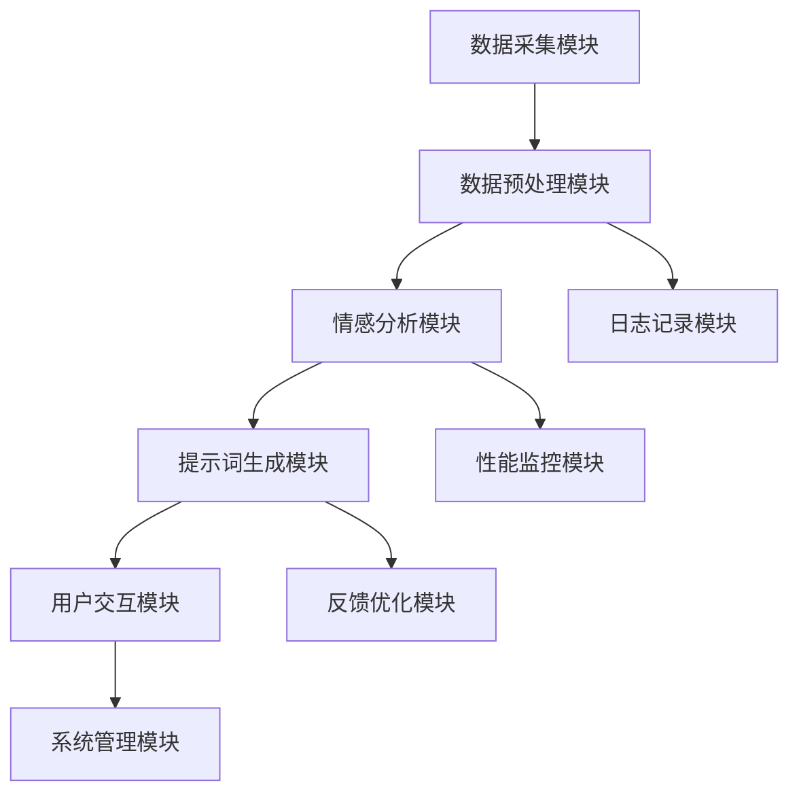

                 

# 提示词设计：优化AI情感表达能力

## 关键词：提示词设计，AI情感表达，优化策略，算法原理，数学模型，系统架构，项目实战

## 摘要：
本文旨在探讨如何通过优化提示词设计来提升人工智能（AI）的情感表达能力。我们将从背景介绍、核心概念与联系、算法原理讲解、数学模型和公式、系统分析与架构设计、项目实战以及最佳实践建议等多个方面，系统性地分析并解答这个问题。通过深入探讨提示词设计的关键要素、算法原理、数学模型和系统架构，并结合实际项目案例，本文将提供一系列实用的优化策略，以期为提升AI情感表达提供有力支持。

## 目录大纲：

### 第一部分：背景介绍

1. 第1章 提示词设计：优化AI情感表达能力
    1.1 提示词设计的背景
    1.2 当前AI情感表达存在的问题
    1.3 本书内容概述

### 第二部分：核心概念与联系

2. 第2章 提示词设计基础
    2.1 提示词的定义与作用
    2.2 提示词的类型与特点
    2.3 提示词设计的核心要素
    2.4 提示词设计流程

### 第三部分：算法原理讲解

3. 第3章 提示词生成算法
    3.1 提示词生成算法概述
    3.2 基于规则的方法
    3.3 基于机器学习的方法
    3.4 基于深度学习的方法

### 第四部分：数学模型和公式

4. 第4章 提示词设计的数学模型
    4.1 语言模型
    4.2 情感分析
    4.3 语义相似度

### 第五部分：系统分析与架构设计

5. 第5章 提示词设计系统架构
    5.1 系统介绍
    5.2 系统架构设计
    5.3 系统交互

### 第六部分：项目实战

6. 第6章 提示词设计项目实战
    6.1 环境安装与配置
    6.2 系统核心实现
    6.3 实际案例分析
    6.4 项目小结

### 第七部分：最佳实践 tips、小结、注意事项、拓展阅读

7. 最佳实践 tips
8. 小结
9. 注意事项
10. 拓展阅读

## 1.1 提示词设计的背景

### 1.1.1 人工智能与情感表达

人工智能（Artificial Intelligence，AI）是计算机科学的一个分支，旨在通过模拟人类智能行为来实现自动化和智能化。随着技术的不断进步，AI已经能够在语音识别、图像处理、自然语言处理等领域表现出色。然而，情感表达作为人类交流的重要组成部分，一直是AI领域的一个挑战。

情感表达是指通过语言、声音、姿态等方式传达情感信息的能力。在人类交流中，情感表达不仅能够增强信息的传递效果，还能够建立和维护人际关系。因此，具备情感表达能力是AI实现智能化交互的关键。

### 1.1.2 AI情感表达的重要性

AI情感表达在多个场景中具有重要应用价值：

1. **客户服务**：在客服机器人、语音助手等应用中，具备情感表达能力的AI能够更好地理解用户需求，提供个性化的服务，提高用户满意度。
2. **教育领域**：教育机器人可以通过情感表达来激励学生，提供情感支持，提高学习效果。
3. **医疗健康**：在医疗诊断和康复治疗中，AI可以通过情感表达提供心理支持和安慰，帮助患者更好地应对疾病。
4. **社交互动**：在社交媒体、在线游戏等场景中，具备情感表达能力的AI能够更好地模拟人类互动，增强用户体验。

### 1.1.3 提示词在AI情感表达中的作用

提示词（Prompt Word）是AI情感表达中的一个关键元素。它是指用于引导AI模型生成情感化响应的词语或短语。通过精心设计的提示词，可以引导AI模型在生成响应时更准确地传达情感信息。

提示词在AI情感表达中的作用主要体现在以下几个方面：

1. **情感引导**：通过选择合适的提示词，可以引导AI模型生成具有特定情感色彩的信息。例如，使用“温馨”、“关怀”等提示词，可以引导AI生成温暖、关怀的回应。
2. **语义丰富**：提示词可以提供更多的语义信息，帮助AI模型更准确地理解用户的意图。例如，在客服场景中，提示词可以提供用户的背景信息、情绪状态等，帮助AI提供更个性化的服务。
3. **交互流畅**：提示词的设计还需要考虑交互的流畅性，确保AI的回应自然、连贯，避免生硬或不恰当的回应。

### 1.1.4 当前AI情感表达存在的问题

尽管AI在情感表达方面已经取得了一定进展，但仍然存在一些问题：

1. **表现力不足**：许多AI模型的情感表达能力有限，难以在复杂情境中准确传达情感。
2. **个性缺失**：AI生成的情感化回应往往缺乏个性，难以模拟真实人类的情感表达。
3. **社交挑战**：在社交场景中，AI需要理解并适应复杂的人际关系和社交规则，但目前AI在这方面仍然存在很大挑战。

### 1.1.5 本书内容概述

本书将系统地探讨提示词设计在优化AI情感表达方面的应用。首先，我们将介绍提示词设计的基本概念、类型和设计流程。接着，我们将详细讲解提示词生成算法的原理，包括基于规则、机器学习和深度学习的方法。此外，我们还将介绍提示词设计的数学模型，如语言模型、情感分析和语义相似度。

在系统分析与架构设计部分，我们将描述一个典型的提示词设计系统架构，并分析其关键组件和交互流程。在项目实战部分，我们将结合实际项目案例，详细解析系统的环境安装、核心实现和案例分析。最后，我们将总结最佳实践建议，并提供进一步阅读的材料。

通过本书的学习，读者将能够深入理解提示词设计在AI情感表达中的应用，掌握优化策略，并为实际项目提供有力支持。让我们开始这次探索之旅吧！## 1.2 核心概念与联系

### 2.1 提示词的定义与作用

**定义**：提示词（Prompt Word）是指用于引导AI模型生成特定类型或情感色彩的文本输入。它是AI情感表达的核心组成部分，通过提示词，我们可以引导AI在生成响应时更准确地传达情感信息。

**作用**：
1. **情感引导**：提示词可以引导AI模型生成具有特定情感色彩的响应，如温馨、关怀等。
2. **语义丰富**：提示词可以提供额外的语义信息，帮助AI更好地理解用户的意图和情感状态。
3. **交互流畅**：提示词的设计需要考虑交互的流畅性，确保AI的回应自然、连贯。

### 2.2 提示词的类型与特点

根据不同的应用场景和功能需求，提示词可以分为以下几种类型：

1. **指令性提示词**：用于明确指导AI执行特定任务的词语，如“请提供帮助”、“请描述一下您的需求”等。
2. **情感化提示词**：用于传达情感信息的词语，如“我很高兴”、“我感到沮丧”等。
3. **互动性提示词**：用于促进用户与AI交互的词语，如“您的想法呢？”、“您可以告诉我更多信息吗？”等。

**特点**：
- **指令性提示词**：明确、具体，适用于需要明确指令的交互场景。
- **情感化提示词**：具有情感色彩，适用于需要表达情感支持的交互场景。
- **互动性提示词**：开放性问题，鼓励用户进一步互动。

### 2.3 提示词设计的核心要素

提示词设计需要考虑以下几个核心要素：

1. **语义丰富性**：提示词需要提供丰富的语义信息，以帮助AI更好地理解用户意图。
2. **情感准确性**：提示词需要准确传达用户的情感状态，以确保AI的回应具有情感共鸣。
3. **交互流畅性**：提示词的设计需要考虑交互的流畅性，确保AI的回应自然、连贯。

### 2.4 提示词设计流程

提示词设计流程可以分为以下几个步骤：

1. **需求分析**：分析用户需求和场景，明确提示词的功能和目标。
2. **竞争分析**：研究竞争对手的提示词设计，了解市场趋势和用户反馈。
3. **提示词设计**：基于需求分析和竞争分析，设计符合用户需求的提示词。
4. **测试与优化**：通过测试和用户反馈，对提示词进行优化和调整。

### 表格：不同类型提示词的属性对比

| 提示词类型 | 属性 | 说明 |
| --- | --- | --- |
| 指令性提示词 | 明确性 | 用于提供具体指令 |
| 情感化提示词 | 情感色彩 | 用于传达情感信息 |
| 互动性提示词 | 开放性问题 | 用于促进用户互动 |

### Mermaid流程图：提示词设计流程



通过上述核心概念与联系的介绍，我们可以更好地理解提示词设计的本质和重要性。在接下来的章节中，我们将进一步探讨提示词生成算法的原理和应用，以及如何通过数学模型和系统架构设计来优化AI情感表达能力。## 3. 算法原理讲解

### 3.1 提示词生成算法概述

提示词生成算法是AI情感表达的关键组成部分，其主要目标是通过输入文本生成具有情感表达力的提示词。根据生成方式的不同，提示词生成算法可以分为基于规则的方法、基于机器学习的方法和基于深度学习的方法。下面我们将分别介绍这三种方法。

### 3.2 基于规则的方法

基于规则的方法是指通过预先定义的规则来生成提示词。这种方法通常依赖于领域专家的知识和经验，将复杂的情感表达分解为一系列简单的规则。

**优点**：
- **可控性高**：通过定义明确的规则，可以确保生成的提示词符合预期。
- **效率较高**：规则可以直接应用，不需要复杂的计算过程。

**缺点**：
- **灵活性较差**：面对复杂多变的应用场景，规则可能不够灵活。
- **维护成本高**：随着应用场景的扩展，规则需要不断更新和优化。

**典型应用场景**：
- **简单的情感表达**：如聊天机器人中的基本情感表达。
- **领域特定任务**：如医疗咨询中的情绪安抚。

### 3.3 基于机器学习的方法

基于机器学习的方法是指利用训练数据集，通过机器学习算法来学习如何生成提示词。这种方法通常需要大量的标注数据和复杂的模型架构。

**优点**：
- **灵活性强**：能够适应不同应用场景和情感表达需求。
- **自动性高**：通过数据驱动的方式，可以实现自动化生成。

**缺点**：
- **对数据依赖性强**：需要大量高质量的数据支持。
- **计算复杂度较高**：训练过程可能需要大量计算资源和时间。

**典型应用场景**：
- **多样化的情感表达**：如社交平台中的情感化回应。
- **复杂情境下的情感分析**：如情绪障碍患者的心理辅导。

### 3.4 基于深度学习的方法

基于深度学习的方法是指利用深度神经网络来生成提示词。这种方法通常通过端到端的学习方式，直接从输入文本生成情感化回应。

**优点**：
- **自动性更高**：通过深度神经网络的学习，可以自动提取文本中的情感特征。
- **效果更好**：相比传统机器学习方法，深度学习方法在情感表达上具有更高的准确性。

**缺点**：
- **计算资源需求大**：深度学习模型通常需要大量的计算资源和时间进行训练。
- **调参复杂**：深度学习模型的训练过程需要精心调整超参数。

**典型应用场景**：
- **高精度的情感表达**：如智能客服中的情感化回应。
- **复杂的语言处理**：如自然语言生成（NLG）系统中的情感化文本生成。

### 3.5 案例分析

**基于规则的提示词生成方法**：
- **案例背景**：某电商平台的客服机器人需要为用户生成情感化回应。
- **实现步骤**：
  1. 定义规则集：如“用户表达愤怒情绪时，回应应包含安抚性词语”。
  2. 应用规则：在用户输入文本中，根据规则生成情感化回应。
  3. 测试与优化：通过用户反馈，不断调整规则，提高回应的准确性。

**基于机器学习的提示词生成方法**：
- **案例背景**：某社交平台的聊天机器人需要生成多样化情感化的回应。
- **实现步骤**：
  1. 数据集准备：收集大量情感化回应的标注数据。
  2. 模型训练：利用训练数据，通过机器学习算法训练生成模型。
  3. 应用模型：在用户输入文本中，利用训练好的模型生成情感化回应。
  4. 测试与优化：通过用户反馈，不断优化模型，提高回应的多样性和准确性。

**基于深度学习的提示词生成方法**：
- **案例背景**：某智能客服系统需要生成高精度的情感化回应。
- **实现步骤**：
  1. 数据集准备：收集大量高质量的情感化回应数据。
  2. 模型训练：利用训练数据，通过深度学习算法训练生成模型。
  3. 应用模型：在用户输入文本中，利用训练好的模型生成情感化回应。
  4. 测试与优化：通过用户反馈，不断优化模型，提高回应的精度和自然度。

### 3.6 总结

提示词生成算法在AI情感表达中扮演着重要角色。基于规则的方法虽然简单易行，但在灵活性和自动性方面有所欠缺。基于机器学习的方法能够更好地适应不同应用场景，但需要大量数据和复杂的模型训练过程。基于深度学习的方法在情感表达的精度和自然度上具有优势，但计算资源和调参要求较高。在实际应用中，可以根据具体需求和资源情况，选择合适的提示词生成方法。### 4. 数学模型和公式

在提示词设计中，数学模型和公式起到了至关重要的作用。它们不仅帮助我们理解算法的原理，还能够量化提示词设计的各个方面，从而优化AI情感表达能力。以下我们将介绍几个关键的数学模型和公式，并详细讲解它们的应用。

#### 4.1 语言模型

语言模型是自然语言处理（NLP）的核心组成部分，它用于预测文本序列的概率分布。最常见的是n-gram语言模型，其基本假设是当前单词的出现概率只与前面n-1个单词有关。

**数学表示**：

给定一个n-gram模型，下一个单词`w_t`的概率可以表示为：

$$
P(w_t | w_{t-1}, w_{t-2}, ..., w_{t-n+1}) = \prod_{i=1}^{n} P(w_i | w_{i-1}, w_{i-2}, ..., w_{i-n+1})
$$

其中，`P(w_i | w_{i-1}, w_{i-2}, ..., w_{i-n+1})`表示在给定前n-1个单词的情况下，第i个单词出现的条件概率。

**例子**：

假设有一个三元组语言模型，给定前两个词“我”和“今天”，下一个词是“很”的概率可以通过n-gram模型计算得到：

$$
P(很 | 我 今天) = P(很 | 我) \cdot P(今天 | 我)
$$

在实际应用中，语言模型可以通过最大似然估计（MLE）或神经网络等方法训练得到。

#### 4.2 情感分析

情感分析是判断文本中情感倾向的过程。常用的情感分析模型包括基于词典的方法和基于机器学习的方法。以下介绍一个简单的基于词典的情感分析模型。

**情感词典**：

情感词典是一个包含情感词及其对应情感的词典。例如：

| 情感词 | 情感 |
| --- | --- |
| 喜欢 | 正面 |
| 愤怒 | 负面 |
| 高兴 | 正面 |
| 难过 | 负面 |

**数学公式**：

给定一个文本，通过匹配情感词典中的情感词，我们可以计算文本的情感得分。情感得分可以简单表示为：

$$
\text{Sentiment Score} = \sum_{w \in \text{Text}} \text{Score}(w)
$$

其中，`Score(w)`是情感词`w`的情感得分。如果情感词是正面情感，则得分为正；如果情感词是负面情感，则得分为负。

**例子**：

假设有一个包含两个情感词的文本：“我很喜欢这个产品”。根据情感词典，我们可以得到：

$$
\text{Sentiment Score} = \text{Score}(\text{很}) + \text{Score}(\text{喜欢}) = 1 + 1 = 2
$$

由于情感得分是正数，我们可以判断该文本具有正面情感。

#### 4.3 语义相似度

语义相似度是衡量两个文本语义相似程度的一个度量。它可以用于文本分类、聚类和文本匹配等任务。常用的方法包括基于词向量的方法和基于图神经网络的方法。

**基于词向量的方法**：

词向量是将单词映射为高维空间中的向量，通过计算向量之间的余弦相似度来衡量语义相似度。给定两个词向量`v1`和`v2`，其语义相似度可以表示为：

$$
\text{Similarity}(v1, v2) = \frac{v1 \cdot v2}{\lVert v1 \rVert \lVert v2 \rVert}
$$

其中，`v1 \cdot v2`表示向量的点积，`\lVert v1 \rVert`和`\lVert v2 \rVert`分别表示向量的模长。

**例子**：

假设两个词向量`v1 = (1, 2, 3)`和`v2 = (0.5, 1, 1.5)`，则其语义相似度为：

$$
\text{Similarity}(v1, v2) = \frac{1 \cdot 0.5 + 2 \cdot 1 + 3 \cdot 1.5}{\sqrt{1^2 + 2^2 + 3^2} \cdot \sqrt{0.5^2 + 1^2 + 1.5^2}} = \frac{7.5}{\sqrt{14} \cdot \sqrt{3.25}} \approx 0.87
$$

**基于图神经网络的方法**：

图神经网络（GNN）是一种用于处理图结构数据的神经网络。在语义相似度计算中，GNN可以将文本表示为图结构，通过图卷积操作来学习文本的语义表示，从而计算语义相似度。

**例子**：

假设两个文本“A：我喜欢这个产品”和“B：这个产品很棒”，可以通过GNN生成它们的语义向量，然后计算两个向量的相似度。具体计算过程较为复杂，涉及多层图卷积操作和注意力机制等。

#### 总结

数学模型和公式在提示词设计中起着关键作用。通过语言模型，我们可以生成具有情感色彩的提示词；通过情感分析模型，我们可以准确判断文本的情感倾向；通过语义相似度计算，我们可以找到与用户输入最相似的提示词。这些模型和公式不仅帮助我们理解算法原理，还能够量化提示词设计的各个方面，从而实现AI情感表达的优化。在接下来的章节中，我们将进一步探讨如何通过系统架构设计来提升AI情感表达能力。## 5. 系统分析与架构设计

### 5.1 系统介绍

提示词设计系统是一个复杂的系统，旨在通过自动化和智能化的方式，为AI情感表达提供高质量的提示词。该系统主要由以下几个关键组件构成：

1. **数据采集模块**：负责收集和处理大量的文本数据，包括用户对话、社交媒体评论、新闻文章等。
2. **情感分析模块**：利用情感分析算法，对收集到的文本进行情感倾向分析，以提取情感信息。
3. **提示词生成模块**：基于情感分析结果，通过机器学习和深度学习算法生成情感化提示词。
4. **用户交互模块**：提供用户接口，允许用户提交需求、查看生成的提示词，并进行反馈。
5. **系统管理模块**：负责系统的配置管理、日志记录和性能监控。

### 5.2 系统架构设计

提示词设计系统架构设计需要考虑系统的可扩展性、性能和可靠性。以下是一个典型的系统架构设计，包括系统架构图和各组件的详细设计。

#### 系统架构图



#### 系统架构说明

1. **数据采集模块**：该模块负责从各种数据源（如社交媒体、用户评论等）采集文本数据。采集的数据经过初步清洗后，传递给数据预处理模块。
2. **数据预处理模块**：该模块对采集到的文本数据进行清洗、去噪和格式化处理，以便后续的情感分析和提示词生成。
3. **情感分析模块**：该模块使用情感分析算法对预处理后的文本进行情感倾向分析，提取情感信息。常用的情感分析算法包括基于词典的方法、机器学习方法等。
4. **提示词生成模块**：该模块基于情感分析结果，利用机器学习和深度学习算法生成情感化提示词。生成的提示词通过用户交互模块提供给用户。
5. **用户交互模块**：该模块提供用户接口，允许用户提交需求、查看生成的提示词，并进行反馈。用户反馈将传递给反馈优化模块，用于优化提示词生成算法。
6. **系统管理模块**：该模块负责系统的配置管理、日志记录和性能监控，确保系统的稳定运行。
7. **日志记录模块**：该模块记录系统的运行日志，用于问题排查和性能分析。
8. **性能监控模块**：该模块监控系统的性能指标，如响应时间、处理能力等，及时发现并解决性能瓶颈。
9. **反馈优化模块**：该模块根据用户反馈，对提示词生成算法进行优化和调整，以提高系统的准确性和用户体验。

### 5.3 系统交互

系统交互是确保各模块协同工作的关键。以下是一个典型的系统交互流程：

1. **用户提交需求**：用户通过用户交互模块提交情感表达需求。
2. **需求传递**：用户交互模块将需求传递给数据采集模块，开始数据采集过程。
3. **数据预处理**：数据采集模块采集到的文本数据经过数据预处理模块处理，生成预处理后的文本数据。
4. **情感分析**：预处理后的文本数据传递给情感分析模块，进行情感倾向分析。
5. **提示词生成**：情感分析结果传递给提示词生成模块，生成情感化提示词。
6. **提示词反馈**：生成的提示词通过用户交互模块反馈给用户，用户对提示词进行评估和反馈。
7. **反馈优化**：用户反馈传递给反馈优化模块，用于优化提示词生成算法。
8. **系统监控**：系统管理模块监控系统的运行状态，确保系统的稳定性和性能。

### 5.4 系统性能优化

系统性能优化是提升系统效率和用户体验的关键。以下是一些常见的系统性能优化策略：

1. **并行处理**：通过并行处理技术，如多线程和分布式计算，提高数据处理速度。
2. **缓存机制**：利用缓存机制，减少重复计算和数据检索，提高系统响应速度。
3. **负载均衡**：通过负载均衡技术，合理分配系统资源，避免单点过载，提高系统稳定性。
4. **内存管理**：合理管理内存资源，避免内存泄露和浪费，提高系统性能。
5. **算法优化**：对提示词生成算法进行优化，提高算法效率和准确性。
6. **监控与报警**：通过监控系统性能指标，及时发现和解决性能瓶颈。

通过系统架构设计和系统交互流程的优化，提示词设计系统可以高效地提供高质量的提示词，提升AI情感表达能力，满足不同场景下的情感化交互需求。## 6. 提示词设计项目实战

### 6.1 环境安装与配置

在开始提示词设计项目之前，我们需要搭建一个合适的环境。以下是一个典型的环境安装与配置步骤。

#### 硬件与软件要求

- **操作系统**：Linux或macOS
- **处理器**：至少双核CPU
- **内存**：至少8GB RAM
- **存储**：至少50GB可用硬盘空间
- **软件环境**：
  - Python 3.8或更高版本
  - TensorFlow 2.5或更高版本
  - Mermaid 9.1.0或更高版本
  - Jupyter Notebook

#### 环境搭建步骤

1. **安装操作系统**：安装Linux或macOS操作系统。
2. **更新系统包**：打开终端，执行以下命令更新系统包：

   ```bash
   sudo apt-get update
   sudo apt-get upgrade
   ```

3. **安装Python**：使用Python官方安装脚本安装Python 3.8或更高版本：

   ```bash
   sudo apt-get install python3-pip python3-venv
   ```

4. **创建虚拟环境**：创建一个虚拟环境，以便更好地管理项目依赖：

   ```bash
   python3 -m venv venv
   source venv/bin/activate
   ```

5. **安装TensorFlow**：通过pip安装TensorFlow：

   ```bash
   pip install tensorflow==2.5
   ```

6. **安装Mermaid**：安装Mermaid，以便在Markdown文件中使用Mermaid语法绘制图表：

   ```bash
   npm install -g mermaid
   ```

7. **安装Jupyter Notebook**：安装Jupyter Notebook，以便在浏览器中运行Python代码：

   ```bash
   pip install notebook
   ```

8. **启动Jupyter Notebook**：在终端启动Jupyter Notebook：

   ```bash
   jupyter notebook
   ```

#### 常见问题解决

- **Python版本问题**：如果遇到Python版本问题，可以检查系统是否有多个Python版本，并确保使用正确的版本。可以使用`which python`命令检查当前使用的Python版本。
- **依赖库安装失败**：如果依赖库安装失败，可以尝试更换pip源，如使用清华大学开源软件镜像源。修改pip源的方法如下：

  ```bash
  pip install -i https://pypi.tuna.tsinghua.edu.cn/simple some-package
  ```

### 6.2 系统核心实现

提示词设计系统的核心实现主要包括数据预处理、情感分析、提示词生成和用户交互等模块。以下是一个简单的实现框架。

#### 数据预处理

数据预处理是提示词设计的第一步，主要任务包括文本清洗、分词、去停用词等。

```python
import pandas as pd
from nltk.tokenize import word_tokenize
from nltk.corpus import stopwords

def preprocess_text(text):
    # 清洗文本，去除特殊字符和数字
    text = re.sub('[^a-zA-Z]', ' ', text)
    # 分词
    tokens = word_tokenize(text)
    # 去停用词
    stop_words = set(stopwords.words('english'))
    filtered_tokens = [word for word in tokens if word not in stop_words]
    return ' '.join(filtered_tokens)

# 示例
input_text = "I really love this product!"
preprocessed_text = preprocess_text(input_text)
print(preprocessed_text)
```

#### 情感分析

情感分析模块用于判断文本的情感倾向。以下是一个简单的基于词典的情感分析示例：

```python
from textblob import TextBlob

def analyze_sentiment(text):
    analysis = TextBlob(text)
    if analysis.sentiment.polarity > 0:
        return "Positive"
    elif analysis.sentiment.polarity == 0:
        return "Neutral"
    else:
        return "Negative"

# 示例
input_text = "I really love this product!"
sentiment = analyze_sentiment(input_text)
print(sentiment)
```

#### 提示词生成

提示词生成模块根据情感分析结果生成情感化提示词。以下是一个简单的规则基

