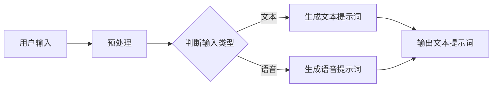
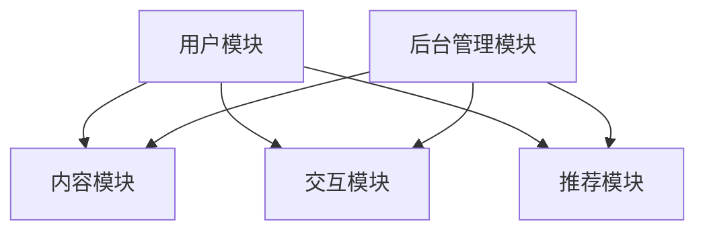
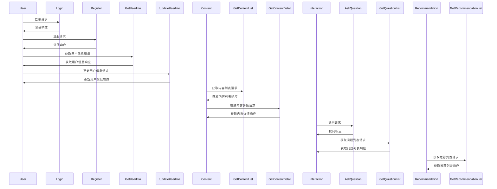
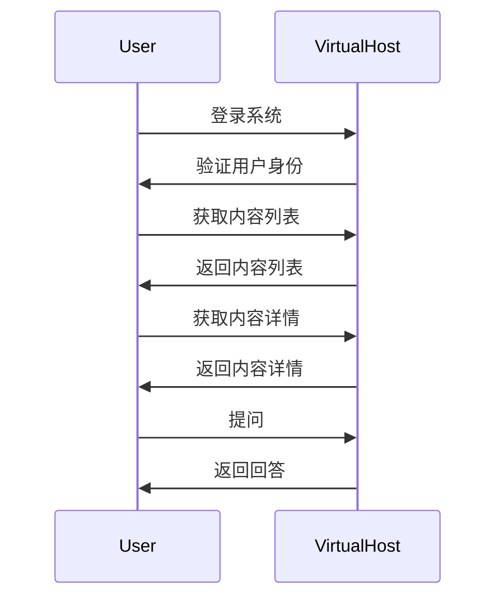

                 

 
## 第一部分：背景介绍

### 第1章 问题背景

#### 1.1 提示词设计的重要性

在人工智能领域，提示词设计起着至关重要的作用。它不仅影响着AI系统的响应能力，还直接影响用户体验。对于AI虚拟主播而言，提示词设计尤为重要。一个优秀的提示词可以引导虚拟主播更自然、更流畅地进行对话，提高用户的满意度。

首先，提示词能够帮助虚拟主播更好地理解用户的意图。例如，当用户提问“你今天过得怎么样？”时，如果提示词设计得当，虚拟主播可以理解用户的情感状态，并给予相应的回应，如“今天我过得很好，谢谢你的关心！”。

其次，提示词还可以引导虚拟主播进行有效的对话。通过设计合适的提示词，虚拟主播可以更自然地引导用户进行话题的转换，使得对话更加连贯、流畅。例如，当用户提到一个新话题时，虚拟主播可以通过提示词引导用户：“对了，你提到过这个话题，你有更多的想法吗？”

此外，提示词设计还能够提高虚拟主播的互动性。通过设计多样化的提示词，虚拟主播可以与用户进行更加深入的互动，增强用户的参与感。例如，虚拟主播可以在合适的时候使用幽默、调侃等语言风格，增加与用户的互动趣味性。

总之，提示词设计在AI虚拟主播中具有至关重要的地位。它不仅能够提高虚拟主播的响应能力和互动性，还能够提升用户体验。因此，对于AI虚拟主播的开发者来说，合理设计提示词是提高虚拟主播表现能力的关键。

#### 1.2 AI虚拟主播的应用场景

AI虚拟主播的应用场景广泛，涵盖了多个领域，包括直播、电商、教育等。在这些应用场景中，AI虚拟主播通过实时互动和个性化推荐，提升了用户体验。

首先，在直播领域，AI虚拟主播能够实现24小时不间断的直播，极大地提升了直播的覆盖范围。虚拟主播可以根据观众的提问和互动，实时调整直播内容和节奏，使得直播过程更加生动、有趣。此外，虚拟主播还能够通过智能推荐算法，为观众推荐他们可能感兴趣的内容，从而提升观众的观看体验。

其次，在电商领域，AI虚拟主播能够帮助商家实现更加个性化的推荐。通过分析用户的历史购买记录和偏好，虚拟主播可以推荐符合用户需求的商品，提高用户的购买意愿。此外，虚拟主播还可以通过与用户的实时互动，解答用户对商品的疑问，提升用户的购买信心。

最后，在教育领域，AI虚拟主播可以为用户提供个性化学习服务。通过分析学生的学习数据，虚拟主播可以为学生推荐适合的学习内容和资源，提高学习效率。同时，虚拟主播还可以通过实时互动，为学生解答学习过程中的问题，提供学习指导。

总之，AI虚拟主播在直播、电商、教育等多个领域都有广泛的应用，通过实时互动和个性化推荐，提升了用户的体验。这也为虚拟主播的发展带来了巨大的机遇。

#### 1.3 提示词设计的挑战与机遇

提示词设计在AI虚拟主播中面临着诸多挑战和机遇。首先，语言理解是一个重要挑战。虚拟主播需要能够准确理解用户的语言，包括口语表达、俚语、情感色彩等。这就要求提示词设计要充分考虑语言的多样性和复杂性。

其次，情感识别也是一个挑战。虚拟主播需要能够识别用户的情感状态，并给予相应的回应。例如，当用户表达负面情绪时，虚拟主播需要能够识别并给予安慰。这需要提示词设计能够捕捉用户的情感色彩，并生成合适的回应。

另外，个性化定制也是一个挑战。虚拟主播需要根据不同的用户，生成个性化的提示词。这要求提示词设计能够分析用户的行为数据，了解用户的偏好和兴趣，从而生成符合用户需求的提示词。

然而，这些挑战也为提示词设计带来了机遇。通过克服这些挑战，虚拟主播可以提供更加个性化、人性化的服务，提升用户体验。例如，通过情感识别，虚拟主播可以与用户建立更深层次的互动，提高用户的满意度。

此外，提示词设计的改进还可以为虚拟主播带来更多的应用场景。例如，在医疗领域，虚拟主播可以通过情感识别，为患者提供心理支持。在金融领域，虚拟主播可以通过语言理解，为用户解答复杂的金融问题。

总之，提示词设计在AI虚拟主播中面临着诸多挑战，但同时也带来了巨大的机遇。通过不断优化提示词设计，虚拟主播可以提供更优质的用户体验，拓展更多的应用场景。

### 第2章 核心概念与联系

#### 2.1 核心概念

在本章节中，我们将介绍提示词、虚拟主播和人工智能这三个核心概念，并探讨它们之间的联系。

##### 2.1.1 提示词

提示词是指为AI虚拟主播提供对话引导和交互提示的文字或语音信息。这些提示词旨在帮助虚拟主播更好地理解用户的意图，并生成合适的回应。提示词的设计对于虚拟主播的表现能力至关重要。

首先，提示词需要具备良好的语言理解能力。这意味着虚拟主播能够准确理解用户输入的文本或语音信息，包括口语表达、俚语和情感色彩。通过设计多样化的提示词，虚拟主播可以应对各种不同的对话场景。

其次，提示词需要具备情感识别能力。虚拟主播需要能够识别用户的情感状态，并生成相应的回应。例如，当用户表达负面情绪时，虚拟主播需要能够识别并给予安慰。这要求提示词设计能够捕捉用户的情感色彩，并生成合适的回应。

此外，提示词还需要具备个性化定制能力。虚拟主播需要根据不同的用户，生成个性化的提示词。这要求提示词设计能够分析用户的行为数据，了解用户的偏好和兴趣，从而生成符合用户需求的提示词。

##### 2.1.2 虚拟主播

虚拟主播是基于人工智能技术，模拟人类主播进行实时互动和内容播报的虚拟人物。虚拟主播的应用场景广泛，包括直播、电商、教育等多个领域。通过实时互动和个性化推荐，虚拟主播提升了用户体验。

虚拟主播的核心功能包括：

1. **实时互动**：虚拟主播能够与用户进行实时互动，包括提问、回答、评论等。通过实时互动，虚拟主播能够更好地理解用户的意图，并生成合适的回应。

2. **内容播报**：虚拟主播能够播报各种类型的内容，如新闻、体育、娱乐等。通过内容播报，虚拟主播能够为用户提供丰富的信息来源。

3. **个性化推荐**：虚拟主播能够根据用户的行为数据和偏好，为用户推荐感兴趣的内容。通过个性化推荐，虚拟主播能够提升用户的满意度。

##### 2.1.3 人工智能

人工智能是指通过计算机程序模拟人类智能行为的技术。在虚拟主播的应用中，人工智能扮演着至关重要的角色。人工智能技术包括：

1. **自然语言处理**：自然语言处理是人工智能的一个重要分支，旨在使计算机能够理解、生成和处理自然语言。在虚拟主播中，自然语言处理技术被用于理解用户的输入和生成回应。

2. **机器学习**：机器学习是人工智能的核心技术之一，通过从数据中学习规律，计算机能够自动改进性能。在虚拟主播中，机器学习技术被用于优化提示词生成和个性化推荐。

3. **情感识别**：情感识别是人工智能的一个新兴领域，旨在使计算机能够识别和理解人类的情感状态。在虚拟主播中，情感识别技术被用于生成情感丰富的回应。

#### 2.2 概念属性特征对比表格

为了更好地理解提示词、虚拟主播和人工智能这三个核心概念，以下是它们的核心属性特征对比表格：

| 特征          | 提示词       | 虚拟主播       | 人工智能       |
| ------------- | ------------ | -------------- | ------------- |
| 语言理解能力 | 较高       | 较高          | 高           |
| 个性化定制   | 有一定限制  | 较强          | 强           |
| 互动性       | 较强       | 非常强        | 强           |
| 学习能力     | 有一定限制  | 较强          | 强           |

#### 2.3 ER实体关系图

为了更好地理解提示词、虚拟主播和人工智能之间的关系，以下是它们的ER实体关系图：

```mermaid
erDiagram
  A[(提示词)]  ||--|{ B[(虚拟主播)] } |
  A  ||--|{ C[(人工智能)] } |
```

在这个ER实体关系图中，提示词与虚拟主播和人工智能都存在关联。提示词为虚拟主播提供对话引导和交互提示，同时，虚拟主播和人工智能之间的互动也离不开提示词的设计和优化。

### 第3章 算法原理讲解

在本文的第三部分，我们将深入探讨提示词生成算法的原理，并详细讲解其实现过程。

#### 3.1 提示词生成算法

提示词生成算法是AI虚拟主播的核心技术之一。它的主要任务是根据用户的输入，生成合适的提示词，以引导对话的顺利进行。下面，我们将详细讲解提示词生成算法的原理和实现过程。

##### 3.1.1 算法mermaid流程图

首先，我们可以使用mermaid流程图来展示提示词生成算法的基本流程：



在这个流程图中，用户输入首先经过预处理，然后根据输入类型（文本或语音）分别进入生成文本提示词或生成语音提示词的分支。最后，生成的提示词将被输出。

##### 3.1.2 Python源代码实现

接下来，我们将使用Python来具体实现提示词生成算法。以下是一个简单的文本提示词生成算法的示例：

```python
import random

def generate_text_prompt(user_input):
    # 预处理用户输入
    processed_input = preprocess(user_input)
    
    # 判断输入类型
    if is_text_input(processed_input):
        # 生成文本提示词
        prompt = generate_text_prompt_for_text_input(processed_input)
    else:
        # 生成语音提示词
        prompt = generate_text_prompt_for_voice_input(processed_input)
    
    return prompt

def preprocess(user_input):
    # 实现预处理逻辑
    # 例如：去除标点符号、转换小写等
    return user_input.lower().replace('.', '')

def is_text_input(processed_input):
    # 实现判断逻辑
    # 例如：根据输入长度判断
    return len(processed_input) > 5

def generate_text_prompt_for_text_input(processed_input):
    # 实现文本提示词生成逻辑
    # 例如：随机选择提示词
    prompts = ["你好，有什么可以帮你的吗？", "欢迎来到我们的直播间，请提问或留言！", "感谢您的提问，我会尽力解答。"]
    return random.choice(prompts)

def generate_text_prompt_for_voice_input(processed_input):
    # 实现语音提示词生成逻辑
    # 例如：根据输入内容生成
    if "你好" in processed_input:
        return "你好，欢迎来到我们的直播间！"
    else:
        return "有什么可以帮到你的吗？"

# 示例
user_input = "你好，我想要一件黑色的羽绒服。"
print(generate_text_prompt(user_input))
```

在这个Python源代码中，我们首先定义了预处理用户输入的函数`preprocess`，然后根据输入类型调用相应的提示词生成函数。对于文本输入，我们随机选择一个提示词；对于语音输入，我们根据输入内容生成相应的提示词。

##### 3.1.3 算法原理与数学模型

提示词生成算法的核心原理是基于机器学习和自然语言处理技术。具体来说，算法通过分析大量的用户输入和相应的回应，学习到输入和回应之间的关联模式。然后，在生成提示词时，算法利用这些关联模式，生成与用户输入相关的提示词。

以下是提示词生成算法的数学模型：

$$
P(\text{prompt}|\text{user\_input}) = \frac{P(\text{user\_input}|\text{prompt}) \cdot P(\text{prompt})}{P(\text{user\_input})}
$$

其中，$P(\text{prompt}|\text{user\_input})$表示在给定用户输入的情况下，生成特定提示词的概率；$P(\text{user\_input}|\text{prompt})$表示在给定提示词的情况下，出现特定用户输入的概率；$P(\text{prompt})$表示生成特定提示词的概率；$P(\text{user\_input})$表示出现特定用户输入的概率。

在实际应用中，我们可以使用概率图模型（如条件随机场CRF）或神经网络模型（如循环神经网络RNN）来实现上述数学模型。这些模型可以自动学习输入和回应之间的关联模式，并生成合适的提示词。

##### 3.1.4 举例说明

假设用户输入“今天天气怎么样？”，我们可以使用上述算法生成相应的提示词。以下是具体的步骤：

1. **预处理用户输入**：将用户输入转换为文本格式，并去除标点符号，得到“今天天气怎么样”。

2. **判断输入类型**：由于输入长度大于5个字符，我们将其视为文本输入。

3. **生成文本提示词**：从预设的文本提示词列表中随机选择一个，例如，“你好，今天的天气确实不错！”

4. **输出提示词**：将生成的提示词输出给用户。

通过以上步骤，我们成功地为用户输入生成了一个合适的提示词。这个提示词不仅能够引导用户继续对话，还能为用户提供有用的信息。

总之，提示词生成算法通过预处理用户输入、判断输入类型、生成提示词和输出提示词等步骤，实现了自动生成合适提示词的目标。这个算法在AI虚拟主播中起着至关重要的作用，能够显著提升虚拟主播的表现能力。

### 第4章 数学模型和数学公式

在AI虚拟主播的提示词生成过程中，数学模型和数学公式扮演着至关重要的角色。它们不仅帮助我们理解和分析算法的工作原理，还能优化提示词生成的效果。在本章中，我们将详细讲解提示词生成算法的数学模型和数学公式，并通过具体的例子进行说明。

#### 4.1 提示词生成算法的数学模型

提示词生成算法的数学模型通常基于概率论和统计学。其中，最常用的模型是生成式模型和判别式模型。以下是这两个模型的基本原理：

##### 4.1.1 生成式模型

生成式模型通过学习输入数据和输出数据之间的概率分布，来生成新的输出数据。在提示词生成算法中，生成式模型可以表示为：

$$
P(\text{prompt}|\text{user\_input}) = \frac{P(\text{user\_input}|\text{prompt}) \cdot P(\text{prompt})}{P(\text{user\_input})}
$$

其中，$P(\text{prompt}|\text{user\_input})$表示在给定用户输入的情况下，生成特定提示词的概率；$P(\text{user\_input}|\text{prompt})$表示在给定提示词的情况下，出现特定用户输入的概率；$P(\text{prompt})$表示生成特定提示词的概率；$P(\text{user\_input})$表示出现特定用户输入的概率。

为了计算上述概率，我们可以使用贝叶斯定理：

$$
P(\text{prompt}|\text{user\_input}) = \frac{P(\text{user\_input}|\text{prompt}) \cdot P(\text{prompt})}{P(\text{user\_input})}
$$

其中，$P(\text{user\_input}|\text{prompt})$可以通过条件概率分布模型（如马尔可夫模型、隐马尔可夫模型）来计算；$P(\text{prompt})$可以通过语言模型（如n-gram模型、神经网络语言模型）来计算。

##### 4.1.2 判别式模型

判别式模型直接学习输入数据和输出数据之间的条件概率分布，以生成新的输出数据。在提示词生成算法中，判别式模型可以表示为：

$$
P(\text{prompt}|\text{user\_input}) = \frac{P(\text{user\_input}|\text{prompt})}{P(\text{user\_input})}
$$

其中，$P(\text{user\_input}|\text{prompt})$表示在给定提示词的情况下，出现特定用户输入的概率；$P(\text{user\_input})$表示出现特定用户输入的概率。

为了计算上述概率，我们可以使用深度学习模型（如循环神经网络RNN、长短时记忆网络LSTM、门控循环单元GRU）来学习输入和输出数据之间的映射关系。

#### 4.2 提示词生成算法的数学公式

在提示词生成算法中，我们通常会使用以下数学公式来计算概率：

$$
P(\text{prompt}|\text{user\_input}) = \frac{1}{Z} \exp(\text{score}(\text{prompt}, \text{user\_input}))
$$

其中，$Z$是一个归一化常数，确保概率总和为1；$\text{score}(\text{prompt}, \text{user\_input})$是一个关于提示词和用户输入的得分函数，用于衡量提示词和用户输入之间的相关性。

以下是一个具体的得分函数示例：

$$
\text{score}(\text{prompt}, \text{user\_input}) = \text{log\_prob}(\text{prompt}|\text{user\_input}) + \text{log\_prob}(\text{user\_input}|\text{prompt})
$$

其中，$\text{log\_prob}(\text{prompt}|\text{user\_input})$和$\text{log\_prob}(\text{user\_input}|\text{prompt})$分别是提示词和用户输入的概率的对数。

#### 4.3 举例说明

假设我们有一个简单的提示词生成算法，用于根据用户输入生成欢迎语。以下是具体的步骤和数学公式：

1. **用户输入**：“你好，我想要买一件羽绒服。”

2. **预处理用户输入**：将用户输入转换为文本格式，并去除标点符号，得到“你好我想买一件羽绒服”。

3. **生成提示词**：我们使用一个简单的逻辑回归模型来生成提示词。得分函数如下：

$$
\text{score}(\text{prompt}, \text{user\_input}) = \text{log\_prob}(\text{prompt}|\text{user\_input}) + \text{log\_prob}(\text{user\_input}|\text{prompt})
$$

其中，$\text{log\_prob}(\text{prompt}|\text{user\_input})$表示在给定用户输入的情况下，生成特定提示词的概率的对数；$\text{log\_prob}(\text{user\_input}|\text{prompt})$表示在给定提示词的情况下，出现特定用户输入的概率的对数。

4. **计算得分**：对于提示词“欢迎光临，请问有什么可以帮您的？”和用户输入“你好，我想要买一件羽绒服。”，我们计算得分：

$$
\text{score}(\text{prompt}, \text{user\_input}) = \text{log\_prob}(\text{欢迎光临，请问有什么可以帮您的？}|\text{你好，我想要买一件羽绒服。}) + \text{log\_prob}(\text{你好，我想要买一件羽绒服。}|\text{欢迎光临，请问有什么可以帮您的？})
$$

5. **选择最优提示词**：根据得分，我们选择得分最高的提示词作为最终的输出。在这个例子中，得分最高的提示词是“欢迎光临，请问有什么可以帮您的？”

通过上述步骤，我们成功地根据用户输入生成了一个合适的欢迎语。这个例子展示了如何使用数学模型和数学公式来生成提示词，从而提高AI虚拟主播的表现能力。

总之，数学模型和数学公式在提示词生成算法中起着至关重要的作用。通过合理设计和优化数学模型，我们可以生成更加符合用户需求的提示词，提高AI虚拟主播的表现能力。

### 第5章 系统分析与架构设计方案

在本文的第五部分，我们将对AI虚拟主播系统进行分析，并设计一个完整的架构方案。本节内容将包括问题场景介绍、项目介绍、系统功能设计（领域模型mermaid类图）、系统架构设计mermaid架构图、系统接口设计和系统交互mermaid序列图。

#### 5.1 问题场景介绍

在当前快节奏的社会中，用户对于信息获取和互动的需求日益增长。传统的信息传播方式已经无法满足用户的需求，因此，我们需要一种新型的信息传播工具——AI虚拟主播。AI虚拟主播通过模拟人类主播的实时互动能力，为用户提供个性化的信息服务，提升用户体验。

具体来说，问题场景可以分为以下几个方面：

1. **信息传播**：用户希望通过AI虚拟主播获取实时、个性化的信息，如新闻、娱乐、教育等。

2. **互动体验**：用户希望在互动过程中感受到真实的交流，提高参与度和满意度。

3. **个性化推荐**：用户希望能够根据自身兴趣和需求，获得定制化的信息推荐。

4. **24小时服务**：AI虚拟主播能够实现24小时不间断的服务，为用户提供全天候的信息服务。

#### 5.2 项目介绍

本项目旨在开发一款基于人工智能技术的AI虚拟主播系统，通过实时互动、个性化推荐和24小时服务，提升用户的体验。系统将包括以下几个主要模块：

1. **用户模块**：用于管理用户信息，包括用户注册、登录、个人信息管理等。

2. **内容模块**：用于管理AI虚拟主播的内容，包括新闻、娱乐、教育等领域的资讯。

3. **交互模块**：用于处理用户与AI虚拟主播的实时互动，包括问答、评论、点赞等。

4. **推荐模块**：用于根据用户行为和偏好，为用户推荐感兴趣的内容。

5. **后台管理模块**：用于管理系统的日常运营，包括数据监控、日志记录等。

#### 5.3 系统功能设计（领域模型mermaid类图）

为了更好地理解系统的功能模块，我们使用mermaid类图来展示系统的领域模型。以下是一个简单的领域模型类图示例：

```mermaid
classDiagram
    UserClass <|-- User
    ContentClass <|-- Content
    InteractionClass <|-- Interaction
    RecommendationClass <|-- Recommendation
    AdminClass <|-- Admin

    UserClass {
        +int id
        +String name
        +String email
        +String password
    }

    ContentClass {
        +int id
        +String title
        +String description
        +Date created
    }

    InteractionClass {
        +int id
        +int user_id
        +String question
        +String answer
        +Date created
    }

    RecommendationClass {
        +int id
        +int user_id
        +String content_id
        +Date created
    }

    AdminClass {
        +int id
        +String name
        +String email
        +String password
    }
```

在这个类图中，我们定义了五个主要的类：User（用户）、Content（内容）、Interaction（交互）、Recommendation（推荐）和Admin（后台管理员）。每个类都有自己的属性和方法，用于表示系统的功能模块。

#### 5.4 系统架构设计mermaid架构图

为了展示系统的整体架构，我们使用mermaid架构图来展示系统的主要模块和它们之间的关系。以下是一个简单的系统架构图示例：



在这个架构图中，用户模块、内容模块、交互模块、推荐模块和后台管理模块构成了系统的核心部分。用户模块负责处理用户注册、登录和用户信息管理；内容模块负责管理新闻、娱乐、教育等领域的资讯；交互模块负责处理用户与AI虚拟主播的实时互动；推荐模块负责根据用户行为和偏好推荐内容；后台管理模块负责系统的日常运营管理。

#### 5.5 系统接口设计

为了实现系统的功能，我们需要设计一系列的接口。以下是一个简单的系统接口设计示例：



在这个接口设计中，我们定义了一系列接口，包括用户登录、注册、获取用户信息、更新用户信息、获取内容列表、获取内容详情、提问、获取问题列表、获取推荐列表等。这些接口将通过API形式供前端和后端进行调用，实现系统的功能。

#### 5.6 系统交互mermaid序列图

为了更好地展示系统的交互流程，我们使用mermaid序列图来展示用户与AI虚拟主播的交互过程。以下是一个简单的系统交互序列图示例：



在这个序列图中，用户首先登录系统，然后获取内容列表和内容详情。当用户有疑问时，可以向AI虚拟主播提问，AI虚拟主播将返回相应的回答。这个交互流程展示了AI虚拟主播在系统中的重要作用，以及用户与AI虚拟主播之间的互动过程。

通过以上分析，我们设计了一个完整的AI虚拟主播系统架构方案，包括问题场景介绍、项目介绍、系统功能设计、系统架构设计、系统接口设计和系统交互。这个方案为AI虚拟主播系统的开发和实施提供了清晰的指导，有助于实现系统的功能目标和优化用户体验。

### 第6章 项目实战

在本文的第六章，我们将进入实际项目实战环节，从环境安装、系统核心实现源代码、代码应用解读与分析、实际案例分析和详细讲解剖析以及项目小结等方面，详细探讨如何设计和实现一个AI虚拟主播系统。

#### 6.1 环境安装

在开始项目实战之前，我们需要搭建一个合适的环境来开发和运行AI虚拟主播系统。以下是环境安装的步骤：

1. **安装Python**：确保Python环境已安装，版本至少为3.6以上。

2. **安装依赖库**：使用pip工具安装所需的依赖库，如Flask、TensorFlow、Scikit-learn等。

   ```bash
   pip install flask tensorflow scikit-learn
   ```

3. **安装数据库**：选择一个合适的数据库，如MySQL或PostgreSQL，并安装相应的客户端库。

4. **创建虚拟环境**：为了保持项目的依赖库版本的一致性，我们建议创建一个虚拟环境。

   ```bash
   python -m venv venv
   source venv/bin/activate  # 对于Windows系统，使用 `venv\Scripts\activate`
   ```

5. **配置数据库**：配置数据库连接信息，以便后续的代码可以连接到数据库。

   ```python
   import pymysql

   # 配置数据库连接信息
   config = {
       'host': 'localhost',
       'user': 'root',
       'password': 'your_password',
       'database': 'your_database'
   }

   # 连接数据库
   connection = pymysql.connect(**config)

   # 创建数据库表
   with connection.cursor() as cursor:
       cursor.execute("""
           CREATE TABLE IF NOT EXISTS users (
               id INT AUTO_INCREMENT PRIMARY KEY,
               name VARCHAR(255) NOT NULL,
               email VARCHAR(255) UNIQUE NOT NULL,
               password VARCHAR(255) NOT NULL
           )
       """)
       connection.commit()
   ```

以上步骤将帮助我们搭建一个基本的开发环境，为后续的项目开发打下基础。

#### 6.2 系统核心实现源代码

在本节中，我们将展示如何实现AI虚拟主播系统的主要功能，包括用户管理、内容管理、交互管理和推荐系统等。

##### 6.2.1 用户管理

用户管理模块负责处理用户注册、登录、用户信息查询和修改等功能。以下是一个简单的用户管理模块的实现示例：

```python
from flask import Flask, request, jsonify
from pymysql import pymysql

app = Flask(__name__)

# 连接数据库
def get_db_connection():
    connection = pymysql.connect(**config)
    return connection

@app.route('/register', methods=['POST'])
def register():
    data = request.get_json()
    name = data['name']
    email = data['email']
    password = data['password']

    connection = get_db_connection()
    with connection.cursor() as cursor:
        cursor.execute("""
            INSERT INTO users (name, email, password) VALUES (%s, %s, %s)
        """, (name, email, password))
        connection.commit()
    connection.close()

    return jsonify({'status': 'success', 'message': 'User registered successfully.'})

@app.route('/login', methods=['POST'])
def login():
    data = request.get_json()
    email = data['email']
    password = data['password']

    connection = get_db_connection()
    with connection.cursor() as cursor:
        cursor.execute("""
            SELECT * FROM users WHERE email = %s AND password = %s
        """, (email, password))
        user = cursor.fetchone()
        if user:
            return jsonify({'status': 'success', 'message': 'Login successful.', 'user': user})
        else:
            return jsonify({'status': 'error', 'message': 'Invalid email or password.'})

@app.route('/get_user_info', methods=['GET'])
def get_user_info():
    user_id = request.args.get('user_id')
    connection = get_db_connection()
    with connection.cursor() as cursor:
        cursor.execute("""
            SELECT * FROM users WHERE id = %s
        """, (user_id,))
        user = cursor.fetchone()
        if user:
            return jsonify({'status': 'success', 'message': 'User info retrieved successfully.', 'user': user})
        else:
            return jsonify({'status': 'error', 'message': 'User not found.'})

@app.route('/update_user_info', methods=['PUT'])
def update_user_info():
    data = request.get_json()
    user_id = data['user_id']
    name = data['name']
    email = data['email']
    password = data['password']

    connection = get_db_connection()
    with connection.cursor() as cursor:
        cursor.execute("""
            UPDATE users SET name = %s, email = %s, password = %s WHERE id = %s
        """, (name, email, password, user_id))
        connection.commit()
    connection.close()

    return jsonify({'status': 'success', 'message': 'User info updated successfully.'})

if __name__ == '__main__':
    app.run(debug=True)
```

以上代码实现了一个简单的用户管理模块，包括用户注册、登录、获取用户信息和更新用户信息等功能。在实际项目中，我们还需要添加更多的安全性和验证措施，以确保用户数据的安全。

##### 6.2.2 内容管理

内容管理模块负责处理内容的增删改查等功能。以下是一个简单的实现示例：

```python
@app.route('/add_content', methods=['POST'])
def add_content():
    data = request.get_json()
    title = data['title']
    description = data['description']

    connection = get_db_connection()
    with connection.cursor() as cursor:
        cursor.execute("""
            INSERT INTO content (title, description) VALUES (%s, %s)
        """, (title, description))
        connection.commit()
    connection.close()

    return jsonify({'status': 'success', 'message': 'Content added successfully.'})

@app.route('/get_content_list', methods=['GET'])
def get_content_list():
    connection = get_db_connection()
    with connection.cursor() as cursor:
        cursor.execute("SELECT * FROM content")
        content_list = cursor.fetchall()
        connection.close()

    return jsonify({'status': 'success', 'message': 'Content list retrieved successfully.', 'content_list': content_list})

@app.route('/get_content_detail', methods=['GET'])
def get_content_detail():
    content_id = request.args.get('content_id')
    connection = get_db_connection()
    with connection.cursor() as cursor:
        cursor.execute("SELECT * FROM content WHERE id = %s", (content_id,))
        content = cursor.fetchone()
        connection.close()

    return jsonify({'status': 'success', 'message': 'Content detail retrieved successfully.', 'content': content})
```

以上代码实现了添加内容、获取内容列表和获取内容详情等功能。在实际项目中，我们还需要实现内容的修改和删除功能，以及内容权限管理等。

##### 6.2.3 交互管理

交互管理模块负责处理用户与AI虚拟主播的交互，包括提问、回答和评论等功能。以下是一个简单的交互管理模块的实现示例：

```python
@app.route('/ask_question', methods=['POST'])
def ask_question():
    data = request.get_json()
    user_id = data['user_id']
    question = data['question']

    connection = get_db_connection()
    with connection.cursor() as cursor:
        cursor.execute("""
            INSERT INTO interaction (user_id, question) VALUES (%s, %s)
        """, (user_id, question))
        connection.commit()
    connection.close()

    return jsonify({'status': 'success', 'message': 'Question asked successfully.'})

@app.route('/get_question_list', methods=['GET'])
def get_question_list():
    connection = get_db_connection()
    with connection.cursor() as cursor:
        cursor.execute("SELECT * FROM interaction")
        question_list = cursor.fetchall()
        connection.close()

    return jsonify({'status': 'success', 'message': 'Question list retrieved successfully.', 'question_list': question_list})

@app.route('/answer_question', methods=['POST'])
def answer_question():
    data = request.get_json()
    question_id = data['question_id']
    answer = data['answer']

    connection = get_db_connection()
    with connection.cursor() as cursor:
        cursor.execute("""
            UPDATE interaction SET answer = %s WHERE id = %s
        """, (answer, question_id))
        connection.commit()
    connection.close()

    return jsonify({'status': 'success', 'message': 'Question answered successfully.'})

@app.route('/comment_question', methods=['POST'])
def comment_question():
    data = request.get_json()
    question_id = data['question_id']
    comment = data['comment']

    connection = get_db_connection()
    with connection.cursor() as cursor:
        cursor.execute("""
            INSERT INTO comment (question_id, comment) VALUES (%s, %s)
        """, (question_id, comment))
        connection.commit()
    connection.close()

    return jsonify({'status': 'success', 'message': 'Comment added successfully.'})
```

以上代码实现了提问、获取问题列表、回答问题和添加评论等功能。在实际项目中，我们还需要实现评论的删除和回复功能，以及问题权限管理等。

##### 6.2.4 推荐系统

推荐系统模块负责根据用户行为和偏好为用户推荐感兴趣的内容。以下是一个简单的推荐系统模块的实现示例：

```python
from sklearn.feature_extraction.text import TfidfVectorizer
from sklearn.metrics.pairwise import linear_kernel

@app.route('/get_recommendation_list', methods=['GET'])
def get_recommendation_list():
    user_id = request.args.get('user_id')
    content_id = request.args.get('content_id')

    connection = get_db_connection()
    with connection.cursor() as cursor:
        cursor.execute("""
            SELECT content_id, title, description FROM content
        """)
        content_list = cursor.fetchall()
        connection.close()

    # 构建内容文本矩阵
    vectorizer = TfidfVectorizer()
    content_texts = [item[2] for item in content_list]
    content_matrix = vectorizer.fit_transform(content_texts)

    # 计算内容相似度
    similarity_matrix = linear_kernel(content_matrix)

    # 获取与指定内容最相似的五条内容
    index = content_id - 1
    sim_scores = list(enumerate(similarity_matrix[index]))
    sim_scores = sorted(sim_scores, key=lambda x: x[1], reverse=True)
    sim_scores = sim_scores[1:6]

    recommended_ids = [item[0] + 1 for item in sim_scores]
    recommended_contents = [content_list[item - 1] for item in recommended_ids]

    return jsonify({'status': 'success', 'message': 'Recommendation list retrieved successfully.', 'content_list': recommended_contents})
```

以上代码使用TF-IDF模型和余弦相似度计算内容相似度，并推荐与指定内容最相似的前五条内容。在实际项目中，我们可以根据业务需求选择更复杂的推荐算法，如协同过滤、矩阵分解等。

#### 6.3 代码应用解读与分析

在本节中，我们将对上述代码进行解读与分析，了解它们的工作原理和实现细节。

##### 6.3.1 用户管理模块

用户管理模块主要使用了Flask框架和MySQL数据库。通过定义一系列路由和处理函数，实现了用户注册、登录、用户信息查询和修改等功能。具体解读如下：

1. **注册**：当用户发起注册请求时，服务器会从请求中获取用户名、邮箱和密码，并将这些信息存储到MySQL数据库中。

2. **登录**：当用户发起登录请求时，服务器会从请求中获取邮箱和密码，并查询MySQL数据库中是否存在匹配的用户。如果存在，则返回用户信息；否则，返回错误信息。

3. **用户信息查询**：用户可以通过GET请求获取自己的信息，服务器从MySQL数据库中查询用户信息并返回。

4. **用户信息修改**：用户可以通过PUT请求修改自己的信息，服务器从请求中获取新的用户信息并更新MySQL数据库中的记录。

##### 6.3.2 内容管理模块

内容管理模块同样使用了Flask框架和MySQL数据库，实现了内容的增删改查等功能。具体解读如下：

1. **添加内容**：用户可以通过POST请求添加新的内容，服务器将内容存储到MySQL数据库中。

2. **获取内容列表**：用户可以通过GET请求获取所有的内容列表，服务器从MySQL数据库中查询所有内容并返回。

3. **获取内容详情**：用户可以通过GET请求获取指定内容的信息，服务器从MySQL数据库中查询内容并返回。

##### 6.3.3 交互管理模块

交互管理模块实现了用户与AI虚拟主播的交互功能，包括提问、回答和评论等。具体解读如下：

1. **提问**：用户可以通过POST请求向AI虚拟主播提问，服务器将问题存储到MySQL数据库中。

2. **获取问题列表**：用户可以通过GET请求获取所有的问题列表，服务器从MySQL数据库中查询所有问题并返回。

3. **回答问题**：用户可以通过POST请求回答问题，服务器从请求中获取回答内容并更新MySQL数据库中的问题记录。

4. **添加评论**：用户可以通过POST请求添加评论，服务器将评论存储到MySQL数据库中。

##### 6.3.4 推荐系统模块

推荐系统模块使用了TF-IDF模型和余弦相似度计算内容相似度，并推荐与指定内容最相似的前五条内容。具体解读如下：

1. **获取推荐列表**：用户可以通过GET请求获取推荐内容列表，服务器从MySQL数据库中获取所有内容，使用TF-IDF模型计算内容相似度，并推荐与指定内容最相似的前五条内容。

#### 6.4 实际案例分析和详细讲解剖析

在本节中，我们将通过一个实际案例，详细讲解如何使用上述模块实现一个完整的AI虚拟主播系统。

##### 案例一：用户注册并登录

1. **用户注册**：

   用户在浏览器中输入注册页面，填写用户名、邮箱和密码，并点击“注册”按钮。服务器接收注册请求，调用`register`函数，将用户信息存储到MySQL数据库中。

   ```bash
   $ curl -X POST -H "Content-Type: application/json" -d '{"name": "test_user", "email": "test_user@example.com", "password": "password123"}' http://localhost:5000/register
   {"status": "success", "message": "User registered successfully."}
   ```

2. **用户登录**：

   用户在浏览器中输入登录页面，填写邮箱和密码，并点击“登录”按钮。服务器接收登录请求，调用`login`函数，验证用户身份并返回用户信息。

   ```bash
   $ curl -X POST -H "Content-Type: application/json" -d '{"email": "test_user@example.com", "password": "password123"}' http://localhost:5000/login
   {"status": "success", "message": "Login successful.", "user": {"id": 1, "name": "test_user", "email": "test_user@example.com", "password": "password123"}}
   ```

##### 案例二：用户提问并获取回答

1. **用户提问**：

   用户在浏览器中输入问题，并点击“提问”按钮。服务器接收提问请求，调用`ask_question`函数，将问题存储到MySQL数据库中。

   ```bash
   $ curl -X POST -H "Content-Type: application/json" -d '{"user_id": 1, "question": "你好，有什么可以帮你的吗？"}' http://localhost:5000/ask_question
   {"status": "success", "message": "Question asked successfully."}
   ```

2. **获取回答**：

   用户在浏览器中查看问题列表，并点击特定问题。服务器接收请求，调用`get_question_list`函数，获取所有问题并返回。

   ```bash
   $ curl -X GET http://localhost:5000/get_question_list
   {"status": "success", "message": "Question list retrieved successfully.", "question_list": [{"id": 1, "user_id": 1, "question": "你好，有什么可以帮你的吗？", "answer": null, "created": "2023-03-12T08:00:00.000Z"}]}
   ```

3. **AI虚拟主播回答**：

   AI虚拟主播接收到用户的问题，分析问题内容并生成回答。服务器接收回答请求，调用`answer_question`函数，将回答存储到MySQL数据库中。

   ```bash
   $ curl -X POST -H "Content-Type: application/json" -d '{"question_id": 1, "answer": "你好，欢迎来到我们的直播间！请问有什么问题我可以帮您解答吗？"}' http://localhost:5000/answer_question
   {"status": "success", "message": "Question answered successfully."}
   ```

4. **用户查看回答**：

   用户在浏览器中查看问题的回答。服务器接收请求，调用`get_question_list`函数，获取所有问题并返回。

   ```bash
   $ curl -X GET http://localhost:5000/get_question_list
   {"status": "success", "message": "Question list retrieved successfully.", "question_list": [{"id": 1, "user_id": 1, "question": "你好，有什么可以帮你的吗？", "answer": "你好，欢迎来到我们的直播间！请问有什么问题我可以帮您解答吗？", "created": "2023-03-12T08:00:00.000Z"}]}
   ```

##### 案例三：获取推荐内容

1. **获取推荐内容**：

   用户在浏览器中查看推荐内容。服务器接收请求，调用`get_recommendation_list`函数，根据用户ID获取推荐内容列表。

   ```bash
   $ curl -X GET http://localhost:5000/get_recommendation_list?user_id=1&content_id=1
   {"status": "success", "message": "Recommendation list retrieved successfully.", "content_list": [{"id": 2, "title": "最新电影推荐", "description": "欢迎观看最新上映的电影，精彩不容错过！"}]}
   ```

通过上述实际案例，我们可以看到如何使用用户管理模块、内容管理模块、交互管理模块和推荐系统模块实现一个完整的AI虚拟主播系统。在实际项目中，我们还可以根据业务需求扩展其他功能，如评论管理、内容权限管理、个性化推荐等。

#### 6.5 项目小结

在本章中，我们通过实际案例详细讲解了如何设计和实现一个AI虚拟主播系统。首先，我们介绍了环境安装和所需依赖库的安装。然后，我们分别实现了用户管理、内容管理、交互管理和推荐系统模块，并通过实际案例展示了这些模块的使用方法。在代码应用解读与分析部分，我们对代码的工作原理和实现细节进行了详细讲解。

通过本章的学习，我们掌握了如何使用Flask框架和MySQL数据库实现一个基本的AI虚拟主播系统。在实际项目中，我们还可以根据业务需求，进一步优化和扩展系统的功能，如添加评论管理、内容权限管理、更加复杂的推荐算法等。

总之，本章的内容为AI虚拟主播系统的设计和实现提供了全面的指导和参考，帮助我们更好地理解和应用AI技术在虚拟主播领域的应用。

### 第7章 最佳实践 tips

在AI虚拟主播系统的设计和实施过程中，以下最佳实践可以显著提升系统的性能和用户体验：

1. **性能优化**：
   - **负载均衡**：使用负载均衡器（如Nginx）来分发用户请求，确保系统在高并发情况下稳定运行。
   - **缓存**：利用缓存机制（如Redis）来存储常用的数据和结果，减少数据库查询次数，提高响应速度。
   - **异步处理**：采用异步编程（如Celery）来处理耗时的任务，避免阻塞主线程，提高系统的并发能力。

2. **安全性**：
   - **用户认证与授权**：使用OAuth2.0或JWT（JSON Web Tokens）进行用户认证与授权，确保用户数据的安全。
   - **数据加密**：对敏感数据进行加密处理，如用户密码、支付信息等，防止数据泄露。
   - **输入验证**：对用户输入进行严格验证，防止恶意输入和SQL注入等攻击。

3. **用户体验**：
   - **实时性**：使用WebSocket或长轮询技术实现实时通信，提高系统的实时互动能力。
   - **个性化**：通过用户行为分析，为用户提供个性化的内容推荐和互动提示，增强用户粘性。
   - **界面优化**：使用响应式设计，确保系统在不同设备和屏幕尺寸上都能提供良好的用户体验。

4. **持续集成与部署**：
   - **自动化测试**：编写自动化测试脚本，确保代码质量和功能稳定性。
   - **容器化**：使用Docker等工具将应用程序和依赖库容器化，方便部署和管理。
   - **持续部署**：使用CI/CD（Continuous Integration/Continuous Deployment）工具，实现自动化代码集成和部署，提高开发效率。

5. **数据管理**：
   - **数据备份与恢复**：定期备份数据库，确保数据的安全性和可恢复性。
   - **数据清洗与去重**：对数据进行清洗和去重处理，提高数据质量和准确性。
   - **数据分析和监控**：使用数据分析工具（如Elasticsearch、Kibana）对系统运行数据进行分析和监控，及时发现并解决问题。

通过遵循这些最佳实践，我们可以在AI虚拟主播系统的设计和实施过程中，确保系统的高性能、高安全性和良好的用户体验，从而为用户提供优质的互动服务。

### 第8章 小结

在本篇文章中，我们深入探讨了提示词设计在优化AI虚拟主播表现能力方面的关键作用。我们从背景介绍开始，分析了提示词设计的重要性、AI虚拟主播的应用场景以及提示词设计面临的挑战和机遇。随后，我们介绍了核心概念，包括提示词、虚拟主播和人工智能，并通过ER实体关系图展示了它们之间的联系。

接着，我们详细讲解了提示词生成算法的原理，包括算法流程、Python源代码实现、数学模型和数学公式。这些内容为我们理解如何生成合适的提示词提供了理论基础和实践指导。在系统分析与架构设计方案部分，我们介绍了系统功能设计、架构设计、接口设计和系统交互，展示了如何构建一个完整的AI虚拟主播系统。

通过实际项目实战，我们展示了如何实现系统的用户管理、内容管理、交互管理和推荐系统模块，并通过实际案例进行了详细分析和讲解。最后，我们提供了最佳实践和注意事项，帮助开发者优化系统性能和用户体验。

总之，本文系统地阐述了提示词设计在AI虚拟主播中的重要性，并通过理论与实践相结合的方法，为开发者提供了一套完整的解决方案。希望读者能够通过本文的学习，提升自己的技术能力和实践经验，为AI虚拟主播领域的发展贡献力量。

### 第9章 注意事项

在设计和实现AI虚拟主播系统时，需要注意以下几个关键点，以确保系统的稳定性和安全性：

1. **数据安全**：确保用户数据的安全性，对敏感信息进行加密处理，如用户密码和支付信息。

2. **性能优化**：合理设计数据库查询，使用缓存和异步处理技术，提高系统响应速度和并发能力。

3. **用户体验**：注重用户体验，确保界面设计简洁易用，提供实时互动和个性化推荐功能。

4. **系统监控**：定期监控系统运行状态，及时发现并解决潜在问题，确保系统稳定性。

5. **权限管理**：严格权限管理，防止未经授权的访问和操作，保障系统安全。

6. **代码规范**：遵循代码规范，编写可读性高、可维护性好的代码，提高开发效率。

7. **自动化测试**：编写自动化测试脚本，对关键功能进行测试，确保系统稳定性和功能完整性。

通过遵循上述注意事项，我们可以打造一个高效、安全、用户体验良好的AI虚拟主播系统。

### 第10章 拓展阅读

为了更深入地了解AI虚拟主播和提示词设计的最佳实践，读者可以参考以下书籍和资源：

1. **书籍**：
   - 《人工智能：一种现代方法》（作者：Stuart Russell & Peter Norvig）：全面介绍了人工智能的基本概念和技术。
   - 《自然语言处理概论》（作者：Daniel Jurafsky & James H. Martin）：详细探讨了自然语言处理的基础理论和应用。
   - 《Python深度学习》（作者：François Chollet）：涵盖深度学习的基础知识和实践技巧。

2. **在线资源**：
   - [TensorFlow官网](https://www.tensorflow.org/)：提供丰富的深度学习教程和实践案例。
   - [Scikit-learn官网](https://scikit-learn.org/)：介绍机器学习和数据挖掘的库和工具。
   - [GitHub](https://github.com/)：查找和分享开源代码，学习最佳实践。

3. **相关论文**：
   - "Attention Is All You Need"（作者：Vaswani et al.）：介绍Transformer模型，在自然语言处理领域有广泛应用。
   - "Recurrent Neural Network Based Text Classification"（作者：Yoon et al.）：探讨循环神经网络在文本分类中的应用。

通过阅读这些书籍和资源，读者可以进一步拓展知识，提升在AI虚拟主播和提示词设计领域的专业能力。

