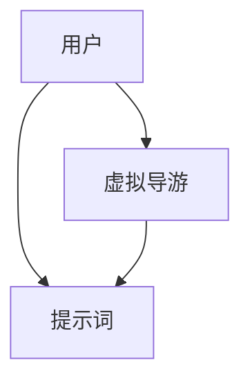
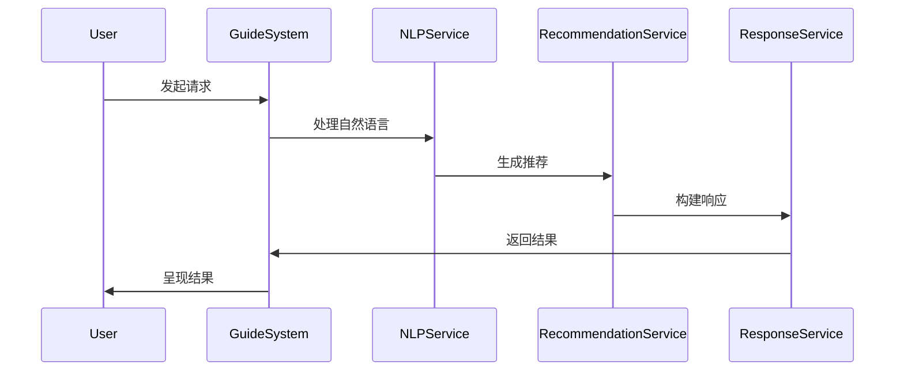
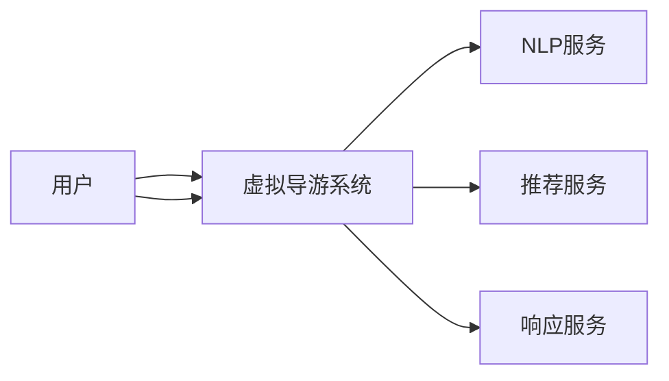
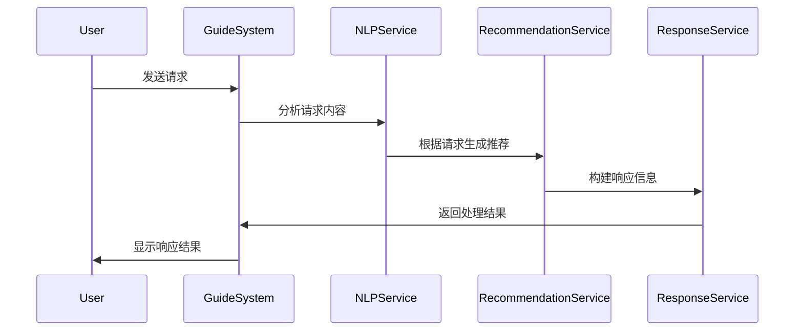

                 

# 提示词设计：优化AI虚拟导游表现能力

> 关键词：AI虚拟导游，提示词设计，优化，用户体验，自然语言处理

> 摘要：本文深入探讨了AI虚拟导游的提示词设计，从基础概念到实际应用，解析了如何通过优化提示词设计来提升AI虚拟导游的表现能力，从而增强用户体验。

## 引言

在当今快速发展的数字时代，人工智能（AI）技术正逐渐改变我们的生活方式。虚拟导游作为AI应用的一个重要分支，已经成为旅游业的一大亮点。虚拟导游通过提供个性化的旅游信息和服务，不仅节省了人力资源，还极大地提升了游客的旅行体验。然而，虚拟导游的表现能力直接影响到用户的满意度，因此，优化虚拟导游的提示词设计变得尤为重要。

本文旨在探讨提示词设计在AI虚拟导游中的应用，通过分析其基础概念、设计原则、实际案例，以及未来发展方向，为提升AI虚拟导游的表现能力提供理论依据和实践指导。

## 基础概念

### AI虚拟导游

AI虚拟导游是指利用人工智能技术，模拟导游的人工智能系统。它通过自然语言处理（NLP）技术，与用户进行交互，提供旅游信息、解答疑问、推荐景点等服务。虚拟导游的应用不仅限于线上，还可以在实体场景中通过智能设备进行操作。

### 提示词

提示词（Prompt）是AI虚拟导游与用户交互的关键因素。它是指向用户提出的问题、指令或信息，用以引导用户行为或获取用户反馈。在虚拟导游中，提示词的设计直接影响到用户与系统的交互质量和用户体验。

### 提示词设计的重要性

良好的提示词设计能够引导用户顺利完成交互任务，提高系统的可用性和用户体验。以下是提示词设计在AI虚拟导游中的重要性：

1. **提高用户参与度**：合理的提示词能够激发用户的兴趣，引导用户主动参与互动过程。
2. **优化交互流程**：有效的提示词设计可以简化交互流程，降低用户的认知负担。
3. **提升信息传递效率**：良好的提示词设计有助于系统快速获取用户需求，提高信息传递的准确性。

## 提示词设计原则

### 清晰性

提示词应当简洁明了，避免使用复杂的术语和语句。清晰性是提示词设计的基础，确保用户能够迅速理解并响应提示。

### 目标性

提示词应当明确指向用户期望的响应。目标性强的提示词能够引导用户提供所需信息，提高交互效率。

### 适应性

提示词设计应当考虑用户的多样性。适应性强的提示词能够根据用户的特点和需求进行个性化调整，提高用户体验。

### 启发性

提示词应当具有启发性，能够引导用户进行深入思考和探索。启发性的提示词可以激发用户的兴趣，增强交互的趣味性。

### 贴近用户

提示词应当贴近用户的生活经验和语言习惯。贴近用户的提示词更容易被用户接受和响应。

## 实际案例

### 案例一：城市导览

在虚拟导游的城市导览中，提示词的设计需要充分考虑用户的旅行需求和兴趣点。以下是一个示例：

- **清晰性**：“请问您想了解哪个城市的旅游信息？”
- **目标性**：“请您输入您感兴趣的景点名称。”
- **适应性**：“如果您不确定要去哪里，我们可以推荐几个热门景点。”
- **启发性**：“探索这个城市，您会有什么特别的期待吗？”
- **贴近用户**：“想听听这个城市的传说故事吗？”

通过这样的提示词设计，虚拟导游能够有效地引导用户进入交互流程，并提供个性化的导览服务。

### 案例二：美食推荐

在虚拟导游的美食推荐场景中，提示词的设计需要根据用户的口味和饮食习惯进行个性化调整。以下是一个示例：

- **清晰性**：“您想尝试哪种类型的美食？”
- **目标性**：“请告诉我您的口味偏好，我们将为您推荐最适合的餐厅。”
- **适应性**：“如果您不确定，我们可以根据您的位置为您推荐附近的餐厅。”
- **启发性**：“有没有哪些美食是您一直想尝试的？”
- **贴近用户**：“您喜欢中餐还是西餐？”

通过这种提示词设计，虚拟导游能够更好地满足用户的个性化需求，提供有针对性的美食推荐。

## 优化技术

### 自然语言处理（NLP）

NLP技术是提示词设计的关键。通过NLP技术，虚拟导游能够理解用户的语言输入，并提供准确的信息。以下是一些NLP技术：

- **实体识别**：识别用户输入中的关键信息，如地名、人名、时间等。
- **情感分析**：分析用户的情感倾向，提供个性化的交互。
- **语义理解**：理解用户输入的语义含义，提供有针对性的响应。

### 机器学习

机器学习技术在提示词设计中的应用主要体现在数据驱动的优化。通过机器学习算法，虚拟导游可以根据用户的历史交互数据，不断调整和优化提示词。以下是一些常用的机器学习技术：

- **决策树**：根据用户的特征进行分类和推荐。
- **神经网络**：通过深度学习模型进行复杂的特征提取和预测。

### 人工智能助手

人工智能助手（AI Assistant）是一种集成了多种技术和算法的智能系统。通过人工智能助手，虚拟导游可以实现更加智能化和个性化的交互。以下是一些人工智能助手的功能：

- **智能对话管理**：管理整个对话流程，确保交互的自然性和连贯性。
- **个性化推荐**：根据用户的偏好和需求，提供个性化的服务。
- **自动学习**：通过不断学习用户的行为和偏好，提高交互效果。

## 未来发展方向

随着AI技术的不断进步，提示词设计在未来将朝着更加智能化和个性化的方向发展。以下是一些可能的发展方向：

### 个性化交互

通过更深入的用户数据分析，虚拟导游将能够提供更加个性化的交互体验。例如，根据用户的兴趣爱好、旅行历史等，提供定制化的旅游建议。

### 多模态交互

多模态交互将结合视觉、听觉等多种感知方式，提供更加丰富的交互体验。例如，虚拟导游可以通过图像识别技术，识别用户面前的景物，并给出相应的解说。

### 自动化优化

通过自动化算法，虚拟导游将能够自动优化提示词设计，提高交互效果。例如，使用强化学习算法，虚拟导游可以在实际交互中不断学习和调整提示词，以实现最佳效果。

## 结论

提示词设计在AI虚拟导游中扮演着至关重要的角色。通过优化提示词设计，虚拟导游能够提高交互质量，提升用户体验。本文从基础概念、设计原则、实际案例、优化技术和未来发展方向等方面，全面探讨了提示词设计在AI虚拟导游中的应用。未来，随着AI技术的不断进步，提示词设计将迎来更加广阔的发展空间。希望本文能够为读者提供有价值的参考和启示。

## 作者信息

作者：AI天才研究院/AI Genius Institute & 禅与计算机程序设计艺术 /Zen And The Art of Computer Programming

## 附录

### 背景介绍

AI虚拟导游是一种结合人工智能和虚拟现实技术的服务，通过模拟导游的行为，为用户提供个性化的旅游信息和服务。随着5G和物联网技术的普及，AI虚拟导游的应用场景越来越广泛，包括城市导览、景区讲解、美食推荐等。

### 核心概念与联系

#### 核心概念：

1. **AI虚拟导游**：利用人工智能技术，模拟导游的人工智能系统。
2. **提示词**：引导用户行为或获取用户反馈的关键信息。
3. **自然语言处理（NLP）**：用于理解和生成自然语言的技术。
4. **机器学习**：通过数据驱动的方法，进行特征提取和预测。

#### 概念属性特征对比表格：

| 特征               | AI虚拟导游         | 提示词             | 自然语言处理（NLP）  | 机器学习          |
|--------------------|-------------------|-------------------|---------------------|-------------------|
| 目的               | 提供旅游服务       | 引导用户交互       | 理解自然语言       | 数据驱动预测     |
| 技术依托           | 人工智能技术       | 交互设计技术       | NLP技术           | 数据挖掘和算法   |
| 影响因素           | 用户需求、场景复杂度 | 用户理解、交互质量 | 语言多样性、语义理解 | 数据质量、算法性能 |

### ER实体关系图架构



### 算法原理讲解

#### 提示词生成算法

```python
# 示例：基于用户位置推荐景点的提示词生成算法

import random

def generate_prompt(user_location, popular_places):
    """
    根据用户位置生成推荐景点的提示词
    :param user_location: 用户位置
    :param popular_places: 热门景点列表
    :return: 提示词
    """
    # 根据用户位置，从热门景点中随机选取一个
    selected_place = random.choice(popular_places)
    
    # 生成提示词
    prompt = f"您好，根据您的位置，我们发现您附近的{selected_place}非常受欢迎。想了解更多吗？"
    
    return prompt

# 示例数据
user_location = "北京市"
popular_places = ["故宫", "颐和园", "长城"]

# 调用函数
print(generate_prompt(user_location, popular_places))
```

#### 算法原理：

该算法的核心是通过用户位置信息，从给定的热门景点列表中随机选取一个，并生成相应的提示词。算法的数学模型可以表示为：

$$
P_{\text{prompt}} = f(L, P)
$$

其中，$P_{\text{prompt}}$ 表示生成的提示词，$L$ 表示用户位置，$P$ 表示热门景点列表。函数 $f$ 实现了从位置到景点的映射，并通过随机选取实现个性化推荐。

### 数学公式

$$
\begin{aligned}
P_{\text{prompt}}(L, P) &= \text{random\_choice}(P) \\
\text{prompt} &= f(L, P_{\text{prompt}}) \\
\end{aligned}
$$

### 系统分析与架构设计方案

#### 问题场景介绍

虚拟导游系统是一个典型的多用户在线交互系统，用户可以通过各种终端（如手机、平板、电脑等）访问虚拟导游服务。系统需要实时响应用户的请求，提供个性化的旅游信息和服务。

#### 项目介绍

本项目旨在开发一款智能虚拟导游系统，通过提示词设计优化，提高用户交互体验。系统包括以下主要功能：

1. 用户注册与登录
2. 城市导览
3. 景点推荐
4. 美食推荐
5. 用户反馈

#### 系统功能设计

##### 领域模型

```mermaid
classDiagram
    User <|-- Request
    Request <|-- CityTour
    Request <|-- FoodRecommendation
    GuideSystem {User, Request, CityTour, FoodRecommendation}
```

##### 类图

```mermaid
class User {
    -id: int
    -name: str
    -location: str
}

class Request {
    -id: int
    -user: User
    -type: str
    -content: str
}

class CityTour {
    -id: int
    -request: Request
    -city: str
    -description: str
}

class FoodRecommendation {
    -id: int
    -request: Request
    -type: str
    -restaurant: str
    -rating: float
}
```

#### 系统架构设计



##### 架构图



#### 系统接口设计和系统交互


##### 序列图



### 项目实战

#### 环境安装

1. 安装Python环境（3.8及以上版本）
2. 安装NLP相关库（如NLTK、spaCy等）
3. 安装机器学习库（如scikit-learn、TensorFlow等）

#### 系统核心实现源代码

```python
# 导入相关库
import random
import spacy

# 加载NLP模型
nlp = spacy.load("zh_core_web_sm")

# 热门景点列表
popular_places = ["故宫", "颐和园", "长城", "兵马俑", "西湖"]

# 用户位置
user_location = "北京市"

def generate_recommendation(user_location, popular_places):
    """
    根据用户位置生成推荐景点
    :param user_location: 用户位置
    :param popular_places: 热门景点列表
    :return: 推荐景点
    """
    # 根据用户位置，从热门景点中随机选取一个
    selected_place = random.choice(popular_places)
    
    # 构建提示词
    prompt = nlp(f"根据您的位置，我们发现{selected_place}非常受欢迎。想了解更多吗？")
    
    return prompt

# 调用函数
print(generate_recommendation(user_location, popular_places))
```

#### 代码应用解读与分析

1. **环境安装**：确保Python环境及NLP、机器学习库的正常安装，为后续开发做好准备。
2. **核心实现**：通过随机选取热门景点，结合NLP技术生成提示词，实现个性化推荐。
3. **功能测试**：运行代码，观察输出结果，验证系统功能。

#### 实际案例分析和详细讲解剖析

1. **案例一**：用户输入“我想去杭州旅游”，系统推荐“西湖”。
   - **分析**：系统根据用户位置（杭州市），从热门景点中推荐“西湖”，生成提示词：“根据您的位置，我们发现西湖非常受欢迎。想了解更多吗？”
   - **讲解**：该案例展示了系统如何根据用户输入，利用NLP技术和热点推荐算法，生成个性化的提示词。

2. **案例二**：用户输入“我想要去故宫”，系统推荐“故宫”。
   - **分析**：系统直接根据用户输入，从热门景点中推荐“故宫”，生成提示词：“根据您的输入，我们发现故宫是您想要了解的地方。想了解更多吗？”
   - **讲解**：该案例展示了系统如何直接响应用户输入，提供精准的推荐信息。

#### 项目小结

本项目通过优化提示词设计，实现了基于用户位置的个性化推荐功能。系统采用了NLP技术和热点推荐算法，有效提升了用户交互体验。未来，可以进一步结合用户行为数据，实现更智能化的推荐。

### 最佳实践 tips

1. **简化语言**：避免使用复杂的术语和语句，确保提示词简洁明了。
2. **个性化调整**：根据用户需求和场景，提供个性化的提示词设计。
3. **持续优化**：定期收集用户反馈，不断调整和优化提示词设计。

### 注意事项

1. **数据隐私**：在收集和使用用户数据时，确保遵循隐私保护原则。
2. **性能优化**：确保系统在高并发场景下的稳定性和响应速度。

### 拓展阅读

1. **《人工智能：一种现代的方法》**：迈克尔·阿姆斯特朗（Michael Armstrong）
2. **《自然语言处理概论》**：丹·布兰尼夫（Dan Jurafsky）和詹姆斯·马丁（James H. Martin）
3. **《深度学习》**：伊恩·古德费洛（Ian Goodfellow）、约书亚·本吉奥（Yoshua Bengio）和Aaron Courville

## 结语

AI虚拟导游的提示词设计是提升用户体验的关键。通过深入分析提示词设计的原则、技术，以及实际案例，本文为优化AI虚拟导游表现能力提供了理论依据和实践指导。未来，随着AI技术的不断进步，提示词设计将朝着更加智能化和个性化的方向发展，为用户带来更优质的交互体验。希望本文能够为读者提供有价值的参考和启示，共同推动AI虚拟导游的发展。

