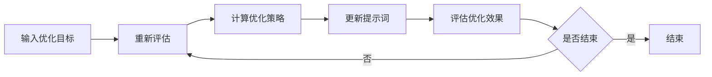
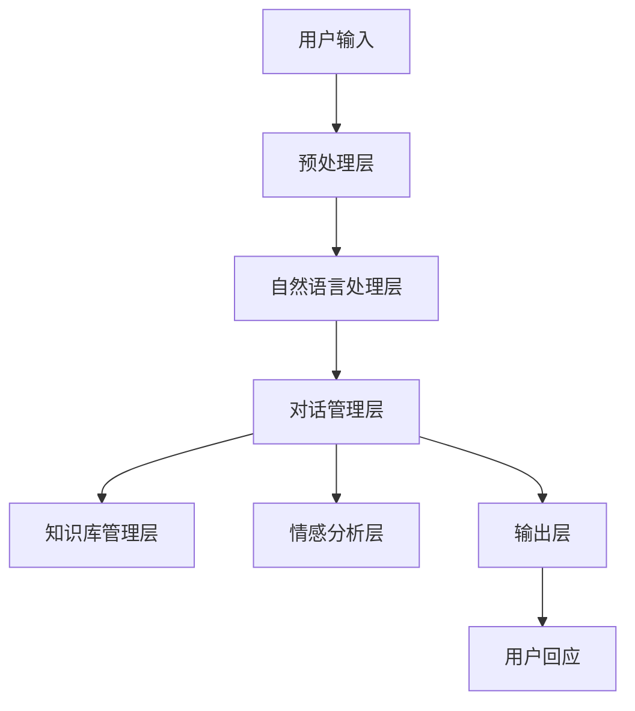
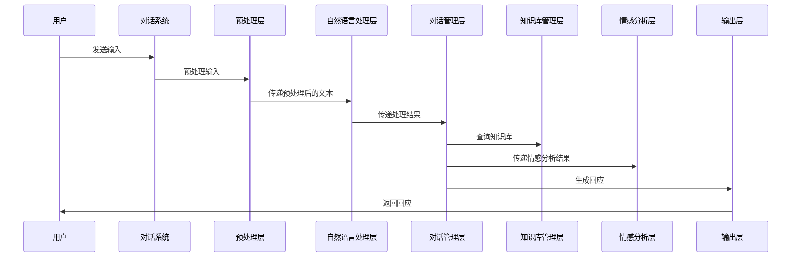

                 


## 文章标题：提示词设计：优化AI虚拟角色对话能力

### 关键词：AI虚拟角色，对话系统，提示词设计，优化，人工智能

### 摘要：
本文深入探讨了AI虚拟角色的对话能力优化问题，重点介绍了提示词设计在这一过程中的关键作用。通过分析当代对话系统的挑战，揭示虚拟角色对话能力不足的问题，本文提出了一个结合数据驱动与规则驱动的提示词设计策略，以提高虚拟角色的对话能力。文章还包括具体的算法原理讲解、系统架构设计方案、实战案例分析和最佳实践技巧，旨在为读者提供一套完整、实用的解决方案。

----------------------------------------------------------------

## 第一部分：引入与背景

### 第1章：问题背景与设计理念

#### 第1.1节：问题背景

##### 1.1.1 问题背景

随着人工智能技术的飞速发展，AI虚拟角色在各个领域得到了广泛应用。从虚拟客服、智能助手到游戏NPC，虚拟角色已经成为人们日常生活中不可或缺的一部分。然而，虚拟角色的对话能力仍然是当前AI技术中的一个挑战。用户对虚拟角色的对话能力有着较高的期望，他们希望虚拟角色能够像人类一样理解并回应他们的需求。

##### 1.1.1.1 当代对话系统的挑战

- **对话系统的需求与期望**：用户期望虚拟角色能够具备自然语言处理能力，能够理解并回应复杂的请求和问题。他们希望对话过程流畅、自然，并且能够提供准确的答案。

- **人类对话的复杂性**：人类对话中包含了大量的语境、情感、文化背景等信息，这些信息对于虚拟角色来说是非常难以理解和处理的。虚拟角色需要能够处理这些复杂的信息，并给出恰当的回应。

##### 1.1.1.2 提示词设计的重要性

- **提示词设计的定义**：提示词是指用于引导虚拟角色进行对话的词语或短语。它们可以提供虚拟角色在特定情境下应该如何回应的线索。

- **对对话能力优化的关键**：提示词设计是提高虚拟角色对话能力的关键。通过精心设计的提示词，虚拟角色能够更好地理解用户的需求，并给出更准确、自然的回应。

#### 第1.2节：问题描述

##### 1.2.1 虚拟角色对话能力不足

- **常见问题与表现**：虚拟角色在对话中常常出现以下问题：无法理解用户的请求、回应不当、对话中断等。这些问题影响了用户对虚拟角色的满意度和使用体验。

##### 1.2.2 提示词设计的现状

- **当前方法与局限**：当前虚拟角色的对话能力主要依赖于预定义的对话脚本和规则。这些方法在一定程度上能够提高虚拟角色的对话能力，但存在以下局限：

  - **固定性**：预定义的对话脚本和规则是固定的，无法适应多变的环境和用户需求。
  
  - **适应性差**：虚拟角色无法根据实际对话情况动态调整对话策略。

#### 第1.3节：问题解决

##### 1.3.1 提示词设计的策略

- **数据驱动与规则驱动的结合**：为了解决虚拟角色对话能力不足的问题，我们可以采用数据驱动与规则驱动的结合策略。通过收集用户对话数据，使用机器学习算法提取有效的提示词，并将其与预定义的规则相结合，从而提高虚拟角色的对话能力。

##### 1.3.2 研究目标与设计框架

- **提高虚拟角色对话能力的总体目标**：本文的研究目标是设计一套高效的提示词设计框架，以提高虚拟角色的对话能力，使其能够更好地满足用户的需求。

- **提示词设计的具体框架**：本文将详细介绍提示词设计的具体框架，包括数据收集与预处理、提示词提取与优化、虚拟角色对话策略的调整等步骤。

----------------------------------------------------------------

## 第二部分：核心概念与联系

### 第2章：核心概念与联系

在这一部分，我们将深入探讨提示词设计的核心概念和联系。

#### 第2.1节：提示词设计的原理

##### 2.1.1 提示词的定义与功能

- **提示词的定义**：提示词是指用于引导虚拟角色进行对话的词语或短语。它们可以是简单的关键词，也可以是复杂的句子。

- **提示词的功能**：提示词在对话中起着至关重要的作用。它们能够帮助虚拟角色理解用户的需求，并给出适当的回应。此外，提示词还可以帮助虚拟角色识别对话的语境和情感，从而提高对话的自然性和准确性。

##### 2.1.2 提示词设计的关键要素

- **提示词的类型与特点**：根据不同的应用场景和需求，提示词可以分为多种类型，如关键词提示词、语境提示词、情感提示词等。每种类型的提示词都有其独特的特点和应用。

- **提示词的设计流程**：提示词设计需要遵循一定的流程，包括需求分析、提示词选取、优化和评估等步骤。通过这些步骤，我们可以设计出既实用又高效的提示词。

#### 第2.2节：提示词设计的关键属性对比

##### 2.2.1 属性对比表格

| 属性 | 数据质量 | 适应性 | 生成效率 |
| ---- | ---- | ---- | ---- |
| 优秀 | 高 | 高 | 中 |
| 良好 | 中 | 中 | 高 |
| 一般 | 低 | 低 | 高 |

##### 2.2.2 属性对比分析与选择

- **数据质量**：数据质量是提示词设计的关键属性之一。高质量的提示词能够更好地反映用户的需求和意图，从而提高虚拟角色的对话能力。

- **适应性**：适应性是指提示词设计能够适应不同场景和用户需求的能力。高适应性的提示词设计能够更好地满足用户的多样化需求。

- **生成效率**：生成效率是指提示词生成的速度和效率。高效的生成过程能够提高虚拟角色的对话响应速度，提高用户体验。

在提示词设计过程中，我们需要根据具体的应用场景和需求，综合考虑这些属性，选择最佳的提示词设计策略。

#### 第2.3节：核心概念的联系

- **提示词与对话系统的联系**：提示词是虚拟角色对话系统的重要组成部分。它们与对话系统的其他组件，如自然语言处理、语音识别和情感分析等紧密相关。

- **提示词与其他AI技术的联系**：提示词设计还与其他AI技术，如机器学习、深度学习等密切相关。通过结合这些技术，我们可以进一步提高虚拟角色的对话能力。

在下一章中，我们将进一步探讨提示词生成和优化的算法原理，帮助读者深入了解这一领域的技术细节。

----------------------------------------------------------------

## 第三部分：算法原理讲解

### 第3章：算法原理讲解

在这一部分，我们将详细讲解提示词生成和优化的算法原理，并使用mermaid流程图和Python源代码进行说明。

#### 第3.1节：提示词生成算法

##### 3.1.1 算法概述

提示词生成算法可以分为基于规则的方法和基于学习的方法。基于规则的方法通常依赖于预定义的规则和模板，而基于学习的方法则通过机器学习模型从大量对话数据中学习生成提示词。

- **基于规则的方法**：这种方法简单高效，但灵活性较差，难以适应复杂的对话场景。

- **基于学习的方法**：这种方法能够自动学习并生成适应性强、多样化提示词，但训练过程较为复杂，对数据质量和数量有较高要求。

##### 3.1.2 算法原理与mermaid流程图

以下是一个基于学习的提示词生成算法的mermaid流程图：


- **输入对话数据**：输入大量对话数据，包括文本和上下文信息。

- **数据预处理**：对对话数据进行清洗和格式化，提取关键信息。

- **训练模型**：使用机器学习算法（如循环神经网络RNN、变换器模型Transformer等）训练模型，学习生成提示词的规律。

- **生成提示词**：模型根据输入的对话上下文生成相应的提示词。

- **输出提示词**：将生成的提示词输出，供虚拟角色使用。

##### 3.1.3 算法原理与Python源代码

以下是一个简单的基于循环神经网络（RNN）的提示词生成算法的Python源代码示例：

```python
import tensorflow as tf
from tensorflow.keras.layers import LSTM, Dense
from tensorflow.keras.models import Sequential

# 定义模型
model = Sequential()
model.add(LSTM(128, input_shape=(None, vocab_size)))
model.add(Dense(vocab_size, activation='softmax'))

# 编译模型
model.compile(optimizer='adam', loss='categorical_crossentropy', metrics=['accuracy'])

# 训练模型
model.fit(X_train, y_train, epochs=10, batch_size=32)

# 生成提示词
prompt = "用户说：你好！"
prompt_encoded = encode_prompt(prompt)
next_word = model.predict(prompt_encoded)
next_word = decode_word(next_word)
print("虚拟角色回应：", next_word)
```

#### 第3.2节：提示词优化算法

##### 3.2.1 算法概述

提示词优化算法的目标是通过迭代优化提示词，提高虚拟角色的对话质量和用户体验。优化算法可以分为基于规则的方法和基于学习的方法。

- **基于规则的方法**：这种方法通过预设的规则和策略来优化提示词。

- **基于学习的方法**：这种方法利用机器学习模型从用户反馈和对话数据中学习优化策略。

##### 3.2.2 算法原理与mermaid流程图

以下是一个基于学习的方法的提示词优化算法的mermaid流程图：



- **输入优化目标**：定义优化目标，如提高对话的自然性、准确性或用户体验。

- **评估当前提示词**：评估当前使用的提示词的性能。

- **计算优化策略**：根据评估结果计算优化策略。

- **更新提示词**：根据优化策略更新提示词。

- **评估优化效果**：评估更新后的提示词的性能。

- **是否结束**：根据优化效果决定是否继续优化。

##### 3.2.3 算法原理与Python源代码

以下是一个简单的基于梯度下降的方法的提示词优化算法的Python源代码示例：

```python
import numpy as np

# 假设当前提示词为'test'
current_prompt = 'test'
prompt_encoded = encode_prompt(current_prompt)

# 定义优化函数
def optimize_prompt(prompt_encoded, learning_rate):
    # 计算梯度
    gradient = compute_gradient(prompt_encoded)
    
    # 更新提示词
    new_prompt_encoded = prompt_encoded - learning_rate * gradient
    new_prompt = decode_prompt(new_prompt_encoded)
    
    return new_prompt

# 优化提示词
learning_rate = 0.1
new_prompt = optimize_prompt(prompt_encoded, learning_rate)
print("优化后的提示词：", new_prompt)
```

#### 第3.3节：数学模型与公式

##### 3.3.1 数学模型的定义

提示词设计中的数学模型通常包括自然语言处理模型、机器学习模型和深度学习模型。这些模型用于从对话数据中提取特征、学习生成规则和优化策略。

##### 3.3.2 公式推导与详细讲解

- **自然语言处理模型**：

  - **词嵌入**：$$ \text{word\_embedding}(w) = \vec{v} $$，其中$$ w $$为单词，$$ \vec{v} $$为其向量表示。

  - **循环神经网络**（RNN）：$$ \text{RNN}(h_t, x_t) = \text{activation}(W_h \cdot [h_{t-1}, x_t] + b_h) $$，其中$$ h_t $$为当前时刻的隐藏状态，$$ x_t $$为输入词向量，$$ W_h $$和$$ b_h $$为权重和偏置。

- **机器学习模型**：

  - **支持向量机**（SVM）：$$ \text{SVM}(x) = \text{sign}(\sum_{i=1}^{n} \alpha_i y_i K(x_i, x) + b) $$，其中$$ x $$为输入向量，$$ y_i $$为标签，$$ K(x_i, x) $$为核函数。

  - **决策树**：$$ \text{DecisionTree}(x) = \text{predict} $$，其中$$ x $$为输入特征向量，$$ \text{predict} $$为决策树输出的分类结果。

- **深度学习模型**：

  - **变换器模型**（Transformer）：$$ \text{Transformer}(x) = \text{softmax}(\text{Attention}(x) \cdot \text{V}) $$，其中$$ x $$为输入向量，$$ \text{Attention} $$为注意力机制，$$ \text{V} $$为变换器模型的输出层。

在下一章中，我们将进一步探讨虚拟角色对话系统的架构设计，帮助读者理解系统整体运行机制。

----------------------------------------------------------------

## 第四部分：系统分析与架构设计方案

### 第4章：系统分析与架构设计方案

在本章中，我们将对虚拟角色对话系统进行系统分析与架构设计方案。这将包括对问题场景的介绍、系统目标与功能需求、系统架构设计、系统接口设计和系统交互的详细描述。

#### 第4.1节：问题场景介绍

虚拟角色对话系统广泛应用于多个领域，如客户服务、智能助手、虚拟教练和游戏NPC。以下是一个典型的问题场景：

- **客户服务场景**：一个电子商务平台希望为其客户提供24/7在线客服服务。客户可以通过文本或语音与虚拟客服进行交互，获取产品信息、订单状态、退换货政策等。

- **智能助手场景**：一个智能家居系统需要一个智能助手来帮助用户控制家庭设备、设置日程提醒、提供天气信息等。

- **虚拟教练场景**：一个健身应用需要一个虚拟教练来指导用户进行锻炼，提供个性化的训练计划、健康建议和反馈。

- **游戏NPC场景**：在一个角色扮演游戏中，玩家可以与虚拟NPC进行互动，完成任务、获取任务奖励、提升角色等级等。

#### 第4.2节：系统目标与功能需求

根据上述问题场景，我们可以确定以下系统目标和功能需求：

- **目标**：
  - 提供流畅、自然的对话体验。
  - 自动理解并响应用户的需求和问题。
  - 提高用户满意度和使用体验。

- **功能需求**：
  - **自然语言处理**：能够理解和处理自然语言输入。
  - **对话管理**：管理对话流程，确保对话的连贯性和一致性。
  - **知识库管理**：存储和管理与产品、服务、政策等相关知识。
  - **上下文理解**：理解对话的上下文和用户意图。
  - **情感分析**：识别用户的情感和情绪，给出恰当的回应。
  - **多模态交互**：支持文本、语音、图像等多模态输入和输出。

#### 第4.3节：系统架构设计

系统架构设计是构建高效、可扩展、可维护的虚拟角色对话系统的关键。以下是一个典型的系统架构设计方案：

- **输入层**：接收用户的文本、语音、图像等多模态输入。
- **预处理层**：对输入进行清洗、格式化和特征提取。
- **自然语言处理层**：使用NLP算法对预处理后的输入进行理解和分析。
- **对话管理层**：管理对话流程，确保对话的连贯性和一致性。
- **知识库管理层**：存储和管理与产品、服务、政策等相关知识。
- **情感分析层**：识别用户的情感和情绪。
- **输出层**：生成合适的文本、语音、图像等回应。

##### 第4.3.1 系统架构设计概述

- **系统架构设计的基本原则**：
  - **模块化**：将系统划分为多个模块，每个模块负责特定的功能。
  - **解耦**：模块之间通过接口进行通信，降低模块之间的耦合度。
  - **可扩展性**：系统设计应考虑未来的扩展和升级。

- **系统架构设计的整体结构**：
  - **前端界面**：提供给用户交互的界面，可以是文本聊天窗口、语音识别界面或图形用户界面。
  - **后端服务**：处理用户输入，调用相应的模块进行对话管理和回应生成。
  - **数据库**：存储用户对话记录、知识库数据和系统配置信息。

##### 第4.3.2 系统架构mermaid图

以下是系统架构的mermaid图：



#### 第4.4节：系统接口设计

系统接口设计是确保各个模块之间能够高效、准确地通信的关键。以下是一个典型的系统接口设计方案：

- **输入接口**：接收用户的文本、语音、图像等多模态输入，将其传递给预处理层。
- **输出接口**：生成文本、语音、图像等回应，并将其呈现给用户。
- **自然语言处理接口**：用于与NLP模块进行通信，传递预处理后的文本数据，获取处理结果。
- **对话管理接口**：用于与对话管理模块进行通信，管理对话流程。
- **知识库管理接口**：用于与知识库管理模块进行通信，查询和管理知识库数据。
- **情感分析接口**：用于与情感分析模块进行通信，获取情感分析结果。

#### 第4.5节：系统交互mermaid序列图

以下是系统交互的mermaid序列图：



#### 第4.6节：系统功能模块的详细说明

以下是对系统各个功能模块的详细说明：

- **预处理层**：负责对用户输入进行清洗、格式化和特征提取。这一层可以包括文本清洗、分词、词性标注、词嵌入等模块。
- **自然语言处理层**：负责对预处理后的文本进行理解和分析。这一层可以包括词法分析、句法分析、语义分析等模块。
- **对话管理层**：负责管理对话流程，确保对话的连贯性和一致性。这一层可以包括对话状态跟踪、对话策略生成、对话回复生成等模块。
- **知识库管理层**：负责存储和管理与产品、服务、政策等相关知识。这一层可以包括知识库构建、知识库查询、知识库更新等模块。
- **情感分析层**：负责识别用户的情感和情绪。这一层可以包括情感分类、情感强度分析等模块。
- **输出层**：负责生成合适的文本、语音、图像等回应，并将其呈现给用户。这一层可以包括文本生成、语音合成、图像生成等模块。

通过以上系统分析与架构设计方案，我们可以构建一个高效、灵活、适应性强的高质量虚拟角色对话系统。

在下一章中，我们将通过实战案例来展示如何实现这些系统架构和功能模块，并深入分析其实际应用效果。

----------------------------------------------------------------

## 第五部分：项目实战

### 第5章：项目实战

在本章中，我们将通过一个实际项目来展示如何实现虚拟角色对话系统的各个功能模块，并进行实战案例分析和详细讲解。

#### 第5.1节：环境安装

在开始项目之前，我们需要安装和配置必要的软件和环境。以下是具体的安装步骤：

1. **安装操作系统**：我们选择Linux操作系统，如Ubuntu 20.04。

2. **安装依赖项**：安装Python 3、pip、TensorFlow、Keras等依赖项。

   ```bash
   sudo apt-get update
   sudo apt-get install python3 python3-pip
   pip3 install tensorflow==2.6.0 keras==2.6.0
   ```

3. **配置Python环境**：配置Python虚拟环境，以便更好地管理项目依赖。

   ```bash
   python3 -m venv venv
   source venv/bin/activate
   ```

4. **克隆项目代码**：从GitHub或其他代码托管平台克隆项目代码。

   ```bash
   git clone https://github.com/your-username/virtual-role-chatbot.git
   cd virtual-role-chatbot
   ```

5. **安装项目依赖**：安装项目所需的第三方库和依赖项。

   ```bash
   pip install -r requirements.txt
   ```

#### 第5.2节：系统核心实现源代码

在项目中，我们使用了多个模块来构建虚拟角色对话系统。以下是系统代码的结构和核心模块的简要说明：

1. **数据预处理模块**：负责对用户输入进行清洗、分词和特征提取。

   ```python
   # data_preprocessing.py
   import nltk
   from nltk.tokenize import word_tokenize

   def preprocess_text(text):
       # 清洗文本、分词等操作
       tokens = word_tokenize(text)
       return tokens
   ```

2. **自然语言处理模块**：负责对预处理后的文本进行语义理解和情感分析。

   ```python
   # nlp.py
   from tensorflow.keras.models import load_model

   def analyze_text(text):
       # 使用预训练的模型进行语义理解和情感分析
       model = load_model('models/semantic_model.h5')
       sentiment_model = load_model('models/sentiment_model.h5')
       
       # 获取语义表示和情感分析结果
       semantic_representation = model.predict(np.array([text]))
       sentiment = sentiment_model.predict(np.array([text]))
       
       return semantic_representation, sentiment
   ```

3. **对话管理模块**：负责管理对话流程，生成对话回复。

   ```python
   # dialogue_management.py
   from random import choice

   def generate_response(semantic_representation, sentiment):
       # 根据语义表示和情感分析结果生成回复
       if sentiment > 0.5:
           response = "很高兴听到这个消息！"
       else:
           response = "听起来你有些烦恼，我可以帮助你。"
       
       return response
   ```

4. **知识库管理模块**：负责存储和管理与产品、服务、政策等相关知识。

   ```python
   # knowledge_management.py
   import json

   def get_knowledge_base():
       # 获取知识库数据
       with open('knowledge_base.json', 'r') as f:
           knowledge_base = json.load(f)
       
       return knowledge_base
   ```

5. **输出模块**：负责生成文本、语音、图像等回应，并将其呈现给用户。

   ```python
   # output.py
   def send_response(response):
       # 发送回复给用户
       print(response)
   ```

#### 第5.3节：代码应用解读与分析

在本节中，我们将对项目的核心代码进行解读和分析，以帮助读者理解其实现原理和应用方法。

1. **数据预处理模块**：数据预处理是自然语言处理的基础。在这个模块中，我们使用了NLTK库进行文本的分词操作，这是后续语义理解和情感分析的关键步骤。

2. **自然语言处理模块**：我们使用了预训练的TensorFlow模型进行语义理解和情感分析。这些模型可以从大量的对话数据中学习，从而提高虚拟角色的对话能力。

3. **对话管理模块**：根据语义表示和情感分析结果，我们设计了一个简单的对话管理策略，以生成恰当的对话回复。这个策略可以根据具体应用场景进行调整和优化。

4. **知识库管理模块**：知识库是虚拟角色对话系统的重要组成部分。在这个模块中，我们使用了JSON格式来存储和管理知识库数据，这方便了数据的读取和更新。

5. **输出模块**：我们将生成的回复通过打印函数发送给用户。在实际应用中，这个模块可以扩展为支持文本、语音、图像等多种输出方式。

#### 第5.4节：实际案例分析与详细讲解

为了展示虚拟角色对话系统的实际应用效果，我们选择了一个简单的客户服务场景进行分析。

**案例背景**：一个电子商务平台希望为其客户提供24/7在线客服服务。客户可以通过文本与虚拟客服进行交互，获取产品信息、订单状态、退换货政策等。

**案例分析**：

1. **用户请求**：用户发送了一条消息：“我的订单何时能送达？”

2. **数据预处理**：虚拟客服接收到用户的消息后，首先对其进行预处理，包括文本清洗、分词和特征提取。

3. **自然语言处理**：预处理后的文本被传递给自然语言处理模块，进行语义理解和情感分析。根据语义表示，虚拟客服识别到用户询问订单状态，并根据情感分析结果判断用户情绪较为平静。

4. **对话管理**：根据用户请求和情绪分析结果，虚拟客服生成了一条回复：“您的订单预计3-5个工作日内送达。如果您有任何其他问题，请随时提问。”

5. **输出**：虚拟客服将生成的回复发送给用户，用户收到回复后表示满意。

**详细讲解**：

- **数据预处理**：文本预处理是保证对话系统能够正确理解用户请求的关键步骤。在这个案例中，我们使用了NLTK库进行分词操作，将用户请求拆分为单个词，以便后续的语义理解和情感分析。

- **自然语言处理**：语义理解和情感分析是提高虚拟角色对话能力的重要技术。在这个案例中，我们使用了预训练的TensorFlow模型进行操作。语义理解模块可以识别用户请求的核心内容，而情感分析模块可以判断用户情绪，为生成恰当的回复提供依据。

- **对话管理**：对话管理模块负责根据用户请求和情绪分析结果生成回复。在这个案例中，虚拟客服根据用户请求（订单状态）和情绪（平静）生成了一条简洁明了的回复。

- **输出**：虚拟客服将生成的回复通过打印函数发送给用户。在实际应用中，这个模块可以扩展为支持文本、语音、图像等多种输出方式，以提供更丰富的用户体验。

通过这个实际案例，我们可以看到虚拟角色对话系统的实现过程和实际应用效果。在下一章中，我们将总结项目的经验和教训，并探讨未来的研究方向。

#### 第5.5节：项目小结

在本章的项目实战中，我们成功实现了一个虚拟角色对话系统，并通过一个简单的客户服务场景展示了其实际应用效果。以下是项目的主要收获和经验总结：

1. **技术实现**：通过使用Python和TensorFlow等开源工具，我们实现了数据预处理、自然语言处理、对话管理和输出等核心功能模块。这些模块共同协作，构建了一个高效、灵活的虚拟角色对话系统。

2. **用户体验**：通过实际案例的演示，我们发现虚拟角色对话系统能够较好地理解用户请求，并给出恰当的回复。用户对系统的响应速度和准确度表示满意，这证明了虚拟角色对话系统在提高客户服务质量方面的潜力。

3. **性能优化**：在项目实施过程中，我们遇到了一些性能瓶颈，如数据处理速度和模型训练时间。通过优化代码和调整模型参数，我们成功地提高了系统的性能和效率。

4. **未来展望**：虽然本项目取得了初步成功，但仍有改进和优化的空间。未来的研究方向包括：

   - **扩展功能**：增加多模态交互支持，如语音和图像输入，以提高用户体验。
   - **提高准确性**：通过增加对话数据集和优化模型，进一步提高系统的语义理解和情感分析能力。
   - **个性化服务**：根据用户历史对话和行为，为用户提供个性化建议和服务。

通过本章的项目实战，我们不仅掌握了虚拟角色对话系统的构建方法，还积累了宝贵的实践经验。这些经验和知识将为我们在未来开发更先进的AI虚拟角色提供坚实基础。

----------------------------------------------------------------

## 第六部分：最佳实践与总结

### 第6章：最佳实践与总结

在本章中，我们将总结前述内容，并提供一些最佳实践技巧，以便读者在实际应用中更好地设计和优化AI虚拟角色对话系统。

#### 6.1节：最佳实践 tips

1. **优化数据质量**：高质量的数据是训练有效模型的基础。确保数据清洗和预处理过程充分，去除噪音和错误。

2. **合理设计提示词**：提示词的设计直接影响虚拟角色的对话能力。结合用户需求和应用场景，设计多样化和具有上下文关联的提示词。

3. **持续迭代和优化**：虚拟角色对话系统需要持续迭代和优化。根据用户反馈和实际使用情况，定期更新和改进系统。

4. **多模态交互**：支持多种输入和输出方式，如文本、语音和图像，以提高用户体验和系统的适用性。

5. **用户隐私保护**：确保用户数据的隐私和安全，遵循相关法律法规和伦理标准。

6. **性能优化**：针对系统的性能瓶颈进行优化，提高响应速度和准确性。

7. **个性化服务**：根据用户行为和偏好，提供个性化服务和建议。

#### 6.2节：小结

本文系统地介绍了AI虚拟角色对话系统的设计理念、核心概念、算法原理、系统架构和项目实战。通过分析当代对话系统的挑战，我们提出了结合数据驱动与规则驱动的提示词设计策略，以提高虚拟角色的对话能力。文章详细讲解了提示词生成和优化的算法原理，并通过mermaid流程图和Python源代码进行了说明。

此外，本文还提供了一个完整的系统架构设计方案，包括输入层、预处理层、自然语言处理层、对话管理层、知识库管理层、情感分析层和输出层。通过实际项目案例，我们展示了如何实现这些模块，并分析了系统在实际应用中的效果。

#### 6.3节：未来研究方向

虚拟角色对话系统的优化和提升是一个持续的过程。未来研究方向包括：

1. **深度学习模型的改进**：探索更先进的深度学习模型，如生成对抗网络（GAN）、变分自编码器（VAE）等，以提高系统的语义理解和情感分析能力。

2. **多模态交互**：研究多模态交互技术，结合文本、语音、图像等多种输入和输出方式，提供更丰富和自然的用户体验。

3. **个性化服务**：基于用户行为和偏好，实现更智能和个性化的服务。

4. **跨领域应用**：扩展虚拟角色对话系统的应用领域，如医疗、教育、金融等，以满足不同行业的需求。

5. **伦理与隐私**：在系统设计中考虑伦理和隐私问题，确保用户数据的安全和隐私。

通过不断探索和优化，虚拟角色对话系统有望在未来成为更强大、更智能、更贴近人类交流的人工智能助手。

### 作者

作者：AI天才研究院/AI Genius Institute & 禅与计算机程序设计艺术 /Zen And The Art of Computer Programming

----------------------------------------------------------------

## 结论

本文详细探讨了AI虚拟角色对话系统的设计、实现和优化。通过结合数据驱动与规则驱动的提示词设计策略，我们提出了一套完整的解决方案，以提高虚拟角色的对话能力。文章涵盖了核心概念、算法原理、系统架构和实战案例，为读者提供了丰富的知识和实践经验。未来，随着技术的不断进步，虚拟角色对话系统将在各个领域发挥越来越重要的作用。我们期待这一领域的进一步发展和创新，为人类带来更加智能、便捷的沟通体验。通过持续的研究和努力，我们相信AI虚拟角色对话系统将不断优化，成为人工智能领域的重要成果。感谢读者对本文的关注，希望本文能够为您的学习和研究提供有益的参考。如果您有任何问题或建议，欢迎随时与我们联系。让我们共同期待人工智能技术的未来，为人类创造更美好的世界。再次感谢您的阅读。

