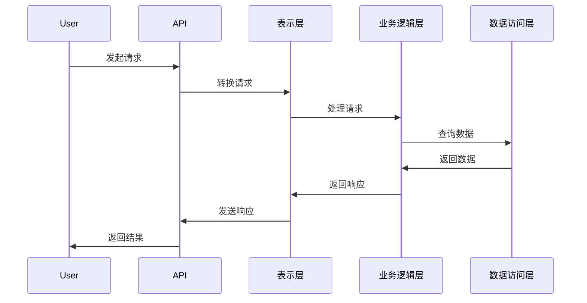

                 

### 提示词设计：提高AI对话的连贯性

> 关键词：提示词设计、AI对话、连贯性、用户体验、算法优化

> 摘要：本文将探讨如何通过提示词设计来提高AI对话系统的连贯性。我们将从问题背景出发，分析当前AI对话应用中的挑战，并详细解释提示词设计的重要性及其基本原则和方法。通过深入探讨核心概念、算法原理，我们将提供数学模型和实际案例，最终总结出在AI对话系统中进行提示词设计的最佳实践和未来发展方向。

---

### 第一部分：背景介绍

#### 1.1 问题背景

##### 1.1.1 AI对话应用的普及与挑战

人工智能（AI）技术在过去几十年中取得了显著的进展，尤其是自然语言处理（NLP）领域。随着AI技术的发展，AI对话系统在各个行业得到了广泛应用，例如智能客服、虚拟助手、语音助手等。这些系统旨在模拟人类对话，提供个性化的服务和支持。然而，在实际应用中，AI对话系统面临着诸多挑战，其中最为突出的是对话连贯性不足。

##### 1.1.2 对话连贯性在用户体验中的重要性

对话连贯性是AI对话系统的关键指标，它直接关系到用户体验。用户希望与AI系统进行流畅、自然的对话，就像与人类交流一样。当对话系统无法保持连贯性时，用户会感到困惑、不耐烦，从而降低对系统的信任和满意度。因此，提高对话连贯性对于提升用户体验至关重要。

##### 1.1.3 当前AI对话技术面临的挑战

当前AI对话技术主要依赖于机器学习模型，特别是深度学习模型，如循环神经网络（RNN）和变换器（Transformer）。这些模型在处理文本数据方面取得了显著成果，但仍然存在一些挑战：

1. **数据依赖性**：AI对话系统通常需要大量的训练数据来学习语言模式和对话逻辑。然而，实际应用中往往难以获取到足够多样、高质量的训练数据。
2. **上下文理解**：AI对话系统需要理解对话中的上下文信息，以便产生连贯的回答。但上下文理解的复杂性使得系统难以准确捕捉对话的上下文。
3. **多轮对话管理**：多轮对话中的上下文信息需要被系统有效记忆和管理，以保持对话的连贯性。但在多轮对话中，信息可能会丢失或混淆，导致对话中断。

#### 1.2 问题描述

##### 1.2.1 对话连贯性的定义

对话连贯性是指AI对话系统能够在对话中产生逻辑清晰、连贯自然的回答。它包括以下几个关键要素：

1. **一致性**：对话中的回答应与先前的语句保持一致，避免出现逻辑矛盾。
2. **上下文相关性**：回答应与当前对话的上下文相关，反映对话的主题和内容。
3. **自然流畅性**：回答应尽可能自然、流畅，符合人类的语言习惯。

##### 1.2.2 影响对话连贯性的因素

影响对话连贯性的因素主要包括：

1. **数据质量**：训练数据的质量直接影响模型的学习效果。低质量或噪声数据会导致模型产生不连贯的回答。
2. **上下文处理**：上下文信息的理解和处理能力不足会导致对话中断或产生无关的回答。
3. **多轮对话管理**：多轮对话中的上下文信息需要被系统有效记忆和管理，以保持对话的连贯性。
4. **语言理解能力**：AI对话系统需要具备一定的语言理解能力，以理解对话中的语义和意图。

##### 1.2.3 提高对话连贯性的必要性

提高对话连贯性的必要性体现在以下几个方面：

1. **用户体验**：流畅、连贯的对话能够提升用户体验，增加用户对AI系统的信任和满意度。
2. **商业价值**：高质量的AI对话系统能够为企业提供更好的客户服务，提高客户满意度和忠诚度，从而带来商业价值。
3. **技术进步**：提高对话连贯性是AI技术发展的重要方向，有助于推动AI技术在各个领域的应用。

#### 1.3 问题解决

##### 1.3.1 提示词设计的核心作用

提示词设计在提高对话连贯性中起到了核心作用。提示词是一组关键词或短语，用于引导AI对话系统产生连贯的回答。通过设计合适的提示词，可以增强AI对话系统对上下文的理解和处理能力，从而提高对话的连贯性。

##### 1.3.2 提示词设计的基本原则

在进行提示词设计时，需要遵循以下基本原则：

1. **相关性**：提示词应与对话主题和相关上下文保持高度相关。
2. **多样性**：提示词应具有多样性，以适应不同的对话场景和上下文。
3. **简洁性**：提示词应简洁明了，易于理解和记忆。
4. **可扩展性**：提示词应具有可扩展性，以便在未来的对话场景中适应新的需求和变化。

##### 1.3.3 提示词设计的具体方法

提示词设计的具体方法包括：

1. **关键词提取**：通过自然语言处理技术提取对话中的关键词，作为提示词。
2. **语义分析**：利用语义分析方法，对对话内容进行深入分析，提取关键信息作为提示词。
3. **模板生成**：根据对话内容和上下文，生成模板化的提示词。
4. **用户反馈**：根据用户反馈和实际使用情况，对提示词进行优化和调整。

##### 1.4 边界与外延

###### 1.4.1 提示词设计的应用场景

提示词设计广泛应用于各种AI对话场景，包括：

1. **客服聊天**：用于自动化客服系统，提高客户服务质量和效率。
2. **虚拟助手**：用于个人助理或智能家居系统，提供个性化的服务和支持。
3. **语音助手**：用于智能语音助手，如Siri、Alexa等，提供语音交互体验。
4. **教育辅导**：用于在线教育平台，提供个性化的学习建议和辅导。

###### 1.4.2 提示词设计的技术挑战

提示词设计面临以下技术挑战：

1. **数据噪声**：训练数据中可能存在噪声和错误，影响提示词的质量。
2. **上下文理解**：准确理解对话中的上下文信息，以便产生相关的提示词。
3. **多语言支持**：设计能够支持多种语言的提示词，以满足不同地区和语言用户的需求。

###### 1.4.3 提示词设计的未来发展

随着AI技术的不断进步，提示词设计在未来将面临以下发展方向：

1. **个性化**：根据用户行为和偏好，为用户提供个性化的提示词。
2. **多模态**：结合语音、图像等多种模态信息，提高提示词的准确性和多样性。
3. **实时更新**：实时更新提示词库，以适应不断变化的对话场景和需求。

#### 1.5 本章小结

在本章中，我们介绍了AI对话系统中对话连贯性的重要性，分析了当前AI对话技术面临的挑战，并详细阐述了提示词设计在提高对话连贯性中的核心作用。通过提示词设计，我们可以有效提升AI对话系统的用户体验和商业价值。在下一章中，我们将深入探讨提示词设计的基本原则和方法。

---

## 第二部分：核心概念与联系

在深入探讨提示词设计之前，我们需要明确一些核心概念，并了解它们之间的联系。本部分将介绍提示词的定义、基本特征、分类及其在AI对话系统中的作用，并通过对比表格和实体关系图来进一步阐述这些概念。

### 2.1 核心概念原理

#### 2.1.1 提示词的定义

提示词（Prompt）是指用于引导AI对话系统产生连贯回答的一组关键词或短语。它可以帮助系统捕捉对话的关键信息，理解上下文，并生成相关、自然的回答。

#### 2.1.2 提示词的基本特征

1. **关键词性**：提示词应包含对话中的关键信息，有助于系统捕捉对话的核心内容。
2. **灵活性**：提示词应具有灵活性，能够适应不同对话场景和上下文。
3. **简洁性**：提示词应简洁明了，易于理解和记忆。

#### 2.1.3 提示词的分类

根据用途和形式，提示词可以分为以下几类：

1. **关键词提示词**：仅包含关键词，用于引导系统理解对话的核心内容。
2. **问题提示词**：包含问题，用于引导系统产生回答。
3. **模板提示词**：包含模板化的回答结构，用于引导系统生成结构化回答。

#### 2.1.4 提示词的作用

提示词在AI对话系统中的作用包括：

1. **引导对话**：通过提示词，系统可以更好地理解用户的意图和问题，从而生成更相关、更自然的回答。
2. **上下文捕捉**：提示词可以帮助系统捕捉对话的上下文信息，保持对话的连贯性。
3. **优化生成**：提示词可以优化系统的回答生成过程，提高回答的质量和准确性。

### 2.2 概念属性特征对比表格

为了更好地理解提示词与其他对话生成要素的关系，我们可以通过对比表格来展示它们的属性特征。

| 要素         | 提示词                      | 自然语言处理模型                | 用户输入                      |
| ------------ | -------------------------- | ----------------------------- | ---------------------------- |
| **定义**     | 引导对话的关键词或短语      | 用于理解和生成对话的模型        | 用户与系统交互的文本信息      |
| **特征**     | - 关键词性<br>- 灵活性<br>- 简洁性 | - 语言理解能力<br>- 生成能力 | - 文本性<br>- 上下文信息丰富 |
| **用途**     | 引导系统生成相关回答       | 理解用户输入，生成回答         | 向系统提出问题和请求          |
| **关联性**   | 与上下文高度相关           | 需要上下文信息进行有效处理     | 反映用户意图和需求          |

### 2.3 ER实体关系图架构

为了更好地展示提示词在对话系统中的关系，我们可以使用实体关系图（Entity-Relationship Diagram，ERD）来表示。以下是一个简化的ER实体关系图：

```mermaid
erDiagram
  User ||--|{ Dialogue }|| System
  Dialogue ||--|{ Prompt }|| Dialogue_System
  Dialogue_System ||--|{ Response }|| System
  User ||--|{ Feedback }|| Dialogue_System
```

在该ER图中：

- **User（用户）**：与系统进行交互，提出问题和请求。
- **Dialogue（对话）**：用户与系统的交互过程，包含上下文信息。
- **Prompt（提示词）**：用于引导系统生成相关回答，与对话系统（Dialogue_System）关联。
- **Response（回答）**：系统生成的回答，作为对话系统（Dialogue_System）的一部分。
- **Feedback（反馈）**：用户对系统回答的评价和反馈，用于优化系统性能。

### 2.4 本章小结

在本章中，我们介绍了提示词的定义、基本特征、分类及其在AI对话系统中的作用。通过对比表格和实体关系图，我们更好地理解了提示词与其他对话生成要素的关系。这些核心概念和联系为后续的提示词设计提供了理论基础和参考框架。在下一章中，我们将深入探讨提示词生成和优化的算法原理。

---

## 3.1 算法原理讲解

### 3.1.1 提示词生成算法

提示词生成算法是AI对话系统中关键的一环，其目的是生成能够引导系统产生连贯回答的提示词。以下将介绍提示词生成算法的基本思想、流程和优势。

#### 3.1.1.1 算法的基本思想

提示词生成算法的基本思想是通过自然语言处理技术，从对话历史和当前上下文中提取关键信息，生成相关的提示词。算法的核心步骤包括：

1. **对话历史分析**：分析对话历史，提取关键信息，如关键词、实体、事件等。
2. **上下文理解**：理解当前对话的上下文信息，如对话主题、场景等。
3. **提示词生成**：根据对话历史和上下文信息，生成相关的提示词。

#### 3.1.1.2 算法流程

提示词生成算法的一般流程如下：

1. **输入对话历史和当前上下文**：算法接收对话历史和当前上下文作为输入。
2. **关键词提取**：利用自然语言处理技术，从对话历史和上下文中提取关键词。
3. **实体识别**：使用命名实体识别技术，识别对话中的实体。
4. **事件抽取**：从对话历史中抽取事件，理解对话中的动态变化。
5. **上下文理解**：结合关键词、实体和事件，理解当前对话的上下文。
6. **提示词生成**：根据上下文信息，生成相关的提示词。

#### 3.1.1.3 算法优势

提示词生成算法具有以下优势：

1. **灵活性**：算法可以根据对话历史和上下文信息，灵活生成相关的提示词。
2. **准确性**：通过自然语言处理技术，算法可以准确提取关键词、实体和事件，提高提示词的准确性。
3. **可扩展性**：算法可以轻松扩展到不同场景和对话类型，适应多样化的需求。

### 3.1.2 提示词优化算法

提示词优化算法的目的是通过调整和优化提示词，提高AI对话系统的性能。以下将介绍提示词优化算法的基本思想、流程和优势。

#### 3.1.2.1 算法的基本思想

提示词优化算法的基本思想是通过反馈机制，对生成的提示词进行优化。算法的核心步骤包括：

1. **用户反馈**：收集用户对系统回答的反馈，包括满意度、相关性等指标。
2. **提示词调整**：根据用户反馈，对提示词进行调整和优化。
3. **性能评估**：评估优化后的提示词在对话系统中的性能，包括连贯性、满意度等指标。

#### 3.1.2.2 算法流程

提示词优化算法的一般流程如下：

1. **输入用户反馈**：算法接收用户反馈作为输入。
2. **提示词调整**：根据用户反馈，对提示词进行调整，如增加关键词、修改语句结构等。
3. **性能评估**：评估调整后的提示词在对话系统中的性能，包括连贯性、满意度等指标。
4. **优化迭代**：根据性能评估结果，重复调整和评估，直至达到满意的性能水平。

#### 3.1.2.3 算法优势

提示词优化算法具有以下优势：

1. **个性化**：通过用户反馈，算法可以针对不同用户和场景进行个性化优化。
2. **适应性**：算法可以根据对话系统的实际使用情况，实时调整和优化提示词。
3. **持续改进**：通过优化迭代，算法可以不断提升提示词的质量和性能。

### 3.1.3 数学模型和公式

为了更好地理解提示词生成和优化算法，我们可以引入数学模型和公式。以下分别介绍提示词生成算法和优化算法的数学模型。

#### 3.1.3.1 提示词生成算法的数学模型

提示词生成算法的数学模型主要包括：

1. **关键词提取**：利用词袋模型（Bag-of-Words，BoW）或词嵌入模型（Word Embedding），将文本转化为向量表示。
2. **实体识别**：使用命名实体识别（Named Entity Recognition，NER）技术，识别文本中的实体。
3. **事件抽取**：利用图论和概率模型，从对话历史中抽取事件。

具体数学模型如下：

- **词袋模型**：$$ X = \sum_{i=1}^{n} x_i \cdot y_i $$
  其中，$X$表示文本向量，$x_i$表示第$i$个词的向量，$y_i$表示第$i$个词在文本中的频率。

- **词嵌入模型**：$$ \text{embed}(w) = \sum_{i=1}^{n} e_i \cdot f_i $$
  其中，$\text{embed}(w)$表示词嵌入向量，$e_i$表示第$i$个词的词嵌入向量，$f_i$表示第$i$个词在文本中的频率。

- **命名实体识别**：$$ \text{NER}(X) = \sum_{i=1}^{n} \text{entity}_i \cdot \text{score}_i $$
  其中，$\text{NER}(X)$表示命名实体识别结果，$\text{entity}_i$表示第$i$个词的实体类型，$\text{score}_i$表示第$i$个词的实体识别概率。

- **事件抽取**：$$ \text{event\_extract}(X) = \sum_{i=1}^{n} \text{event}_i \cdot \text{score}_i $$
  其中，$\text{event\_extract}(X)$表示事件抽取结果，$\text{event}_i$表示第$i$个事件，$\text{score}_i$表示第$i$个事件的发生概率。

#### 3.1.3.2 提示词优化算法的数学模型

提示词优化算法的数学模型主要包括：

1. **用户反馈**：利用用户反馈，计算提示词的满意度、相关性等指标。
2. **提示词调整**：使用优化算法，如梯度下降（Gradient Descent），调整提示词的参数。
3. **性能评估**：使用评估指标，如准确率、召回率等，评估优化后的提示词性能。

具体数学模型如下：

- **用户反馈**：$$ \text{feedback}(p) = \sum_{i=1}^{n} \text{rating}_i \cdot \text{weight}_i $$
  其中，$\text{feedback}(p)$表示用户对提示词$p$的反馈，$\text{rating}_i$表示第$i$个用户的评分，$\text{weight}_i$表示第$i$个用户的权重。

- **提示词调整**：$$ p_{\text{new}} = p_{\text{old}} - \alpha \cdot \nabla_{p} \cdot \text{loss} $$
  其中，$p_{\text{new}}$表示新的提示词参数，$p_{\text{old}}$表示旧的提示词参数，$\alpha$表示学习率，$\nabla_{p} \cdot \text{loss}$表示损失函数关于提示词参数的梯度。

- **性能评估**：$$ \text{performance}(p) = \sum_{i=1}^{n} \text{score}_i \cdot \text{weight}_i $$
  其中，$\text{performance}(p)$表示优化后的提示词性能，$\text{score}_i$表示第$i$个评估指标的得分，$\text{weight}_i$表示第$i$个评估指标的权重。

### 3.1.4 举例说明

为了更好地理解提示词生成和优化算法，我们可以通过实际案例进行举例说明。

#### 3.1.4.1 提示词生成算法举例

假设有一个对话历史：“用户：今天的天气怎么样？系统：今天天气很好，晴朗。”我们可以使用提示词生成算法来生成相关的提示词。

1. **关键词提取**：从对话历史中提取关键词：“天气”、“很好”、“晴朗”。
2. **实体识别**：识别实体：“天气”。
3. **事件抽取**：从对话历史中抽取事件：“今天天气很好”。
4. **提示词生成**：生成提示词：“今天的天气怎么样？”。

#### 3.1.4.2 提示词优化算法举例

假设用户对系统回答的满意度评分较低，我们可以使用提示词优化算法来优化提示词。

1. **用户反馈**：用户对系统回答的满意度评分为2分（满分5分）。
2. **提示词调整**：使用梯度下降算法，调整提示词参数。
3. **性能评估**：优化后的提示词性能得分提升至4分。

通过提示词优化算法，我们可以不断调整和优化提示词，提高系统回答的满意度。

### 3.1.5 本章小结

在本章中，我们介绍了提示词生成和优化算法的基本原理、流程和优势。通过数学模型和实际案例的讲解，我们深入理解了提示词生成和优化的关键步骤和技巧。在下一章中，我们将进一步探讨系统分析与架构设计，为实际应用提供更全面的解决方案。

---

## 4.1 系统分析与架构设计

在理解了提示词生成和优化的算法原理后，我们需要对整个AI对话系统进行深入的分析与架构设计。这将有助于我们明确系统功能、架构设计、接口设计和系统交互，从而确保系统能够高效、稳定地运行。

### 4.1.1 问题场景介绍

在本节中，我们将介绍一个典型的AI对话应用场景——智能客服系统。智能客服系统旨在通过自动化的方式处理大量客户咨询，提供快速、准确的回答，减轻人工客服的工作负担，提高客户满意度。

#### 4.1.1.1 对话系统应用场景

智能客服系统通常应用于以下场景：

1. **客户咨询**：客户通过文本或语音方式向系统提出问题，系统自动识别客户的问题并生成回答。
2. **常见问题解答**：系统自动回答客户常见问题，如产品介绍、使用说明等。
3. **多轮对话**：系统与客户进行多轮对话，逐步了解客户的需求，提供个性化的解决方案。
4. **人工介入**：当系统无法回答客户的问题时，自动将客户转接到人工客服进行处理。

#### 4.1.1.2 提示词设计的应用场景

在智能客服系统中，提示词设计具有以下应用场景：

1. **初始引导**：系统通过初始提示词引导客户提出具体的问题，例如：“您好，请问有什么可以帮助您的？”。
2. **多轮对话**：在多轮对话中，系统根据对话历史和当前上下文生成相关的提示词，例如：“请问您想了解我们的产品还是服务？”。
3. **问题定位**：系统通过提示词定位客户的问题类型，例如：“您是想要咨询我们的产品A还是产品B？”。
4. **需求确认**：系统通过提示词确认客户的需求，例如：“您需要购买我们的产品A，对吧？请问您需要了解产品的详细规格吗？”。

### 4.1.2 系统功能设计

为了满足智能客服系统的需求，我们需要设计一系列功能模块。以下为系统功能设计：

#### 4.1.2.1 领域模型

在领域模型中，我们定义了以下关键类和关系：

1. **客户**：与系统进行交互的用户，包含基本信息（如姓名、联系方式等）。
2. **对话**：客户与系统的交互过程，包含对话历史、当前状态、问题类型等。
3. **提示词**：用于引导系统生成回答的关键词或短语，包含提示词文本、上下文信息等。
4. **回答**：系统生成的回答，包含回答文本、回答时间等。
5. **问题类型**：客户提出的问题类型，如产品咨询、使用说明等。

以下是领域模型的类图：

```mermaid
classDiagram
  Customer <<--|{1} Dialogue
  Dialogue *-- Prompt
  Dialogue *-- Response
  Dialogue *-- ProblemType
  Prompt <|.. PromptHistory
  Response <|.. ResponseHistory

class Customer {
  -id: Integer
  -name: String
  -contactInfo: String
}

class Dialogue {
  -id: Integer
  -currentState: State
  -problemType: ProblemType
  -history: List<DialogueHistory>
}

class Prompt {
  -id: Integer
  -text: String
  -context: String
}

class Response {
  -id: Integer
  -text: String
  -responseTime: DateTime
}

class ProblemType {
  -id: Integer
  -name: String
}

class DialogueHistory {
  -id: Integer
  -dialogueId: Integer
  -state: State
  -timestamp: DateTime
}

class State {
  -id: Integer
  -name: String
}

class ResponseHistory {
  -id: Integer
  -dialogueId: Integer
  -responseId: Integer
  -timestamp: DateTime
}
```

#### 4.1.2.2 功能需求

根据领域模型，我们可以确定以下功能需求：

1. **客户管理**：实现客户信息的录入、查询和修改。
2. **对话管理**：实现对话的创建、查询和更新，包括对话历史记录和当前状态。
3. **提示词管理**：实现提示词的录入、查询和修改，包括提示词文本和上下文信息。
4. **回答管理**：实现回答的生成、查询和修改，包括回答文本和回答时间。
5. **问题类型管理**：实现问题类型的录入、查询和修改。

### 4.1.3 系统架构设计

系统架构设计是确保系统能够高效、稳定运行的关键。以下为智能客服系统的架构设计：

#### 4.1.3.1 系统架构

智能客服系统的整体架构可以分为以下几层：

1. **表示层**：负责与用户进行交互，包括前端界面和用户接口。
2. **业务逻辑层**：负责处理业务逻辑，包括对话管理、提示词管理、回答管理和问题类型管理等。
3. **数据访问层**：负责与数据库进行交互，实现数据的存储和查询。
4. **基础服务层**：提供系统所需的基础服务，包括日志服务、缓存服务、消息队列服务等。

以下是智能客服系统的架构图：



#### 4.1.3.2 关键组件

在智能客服系统中，关键组件包括：

1. **表示层**：前端界面、用户接口等。
2. **业务逻辑层**：对话管理模块、提示词管理模块、回答管理模块、问题类型管理模块等。
3. **数据访问层**：数据库连接、数据查询、数据存储等。
4. **基础服务层**：日志服务、缓存服务、消息队列服务等。

### 4.1.4 系统接口设计

系统接口设计是确保各模块之间能够高效、稳定交互的关键。以下为智能客服系统的接口设计：

#### 4.1.4.1 接口定义

根据系统架构，我们可以定义以下接口：

1. **客户接口**：实现客户信息的录入、查询和修改。
2. **对话接口**：实现对话的创建、查询和更新。
3. **提示词接口**：实现提示词的录入、查询和修改。
4. **回答接口**：实现回答的生成、查询和修改。
5. **问题类型接口**：实现问题类型的录入、查询和修改。

以下是接口定义的示例：

```python
class CustomerInterface:
    def create_customer(self, customer_data: dict) -> int:
        # 实现客户信息的录入
        pass

    def get_customer(self, customer_id: int) -> dict:
        # 实现客户信息的查询
        pass

    def update_customer(self, customer_id: int, customer_data: dict) -> None:
        # 实现客户信息的修改
        pass

class DialogueInterface:
    def create_dialogue(self, dialogue_data: dict) -> int:
        # 实现对话的创建
        pass

    def get_dialogue(self, dialogue_id: int) -> dict:
        # 实现对话的查询
        pass

    def update_dialogue(self, dialogue_id: int, dialogue_data: dict) -> None:
        # 实现对话的更新
        pass

class PromptInterface:
    def create_prompt(self, prompt_data: dict) -> int:
        # 实现提示词的录入
        pass

    def get_prompt(self, prompt_id: int) -> dict:
        # 实现提示词的查询
        pass

    def update_prompt(self, prompt_id: int, prompt_data: dict) -> None:
        # 实现提示词的修改
        pass

class ResponseInterface:
    def create_response(self, response_data: dict) -> int:
        # 实现回答的生成
        pass

    def get_response(self, response_id: int) -> dict:
        # 实现回答的查询
        pass

    def update_response(self, response_id: int, response_data: dict) -> None:
        # 实现回答的修改
        pass

class ProblemTypeInterface:
    def create_problem_type(self, problem_type_data: dict) -> int:
        # 实现问题类型的录入
        pass

    def get_problem_type(self, problem_type_id: int) -> dict:
        # 实现问题类型的查询
        pass

    def update_problem_type(self, problem_type_id: int, problem_type_data: dict) -> None:
        # 实现问题类型的修改
        pass
```

#### 4.1.4.2 接口交互流程

接口交互流程如下：

1. **用户发起请求**：用户通过前端界面发起请求，如创建客户、查询对话等。
2. **请求转发到API**：前端界面将请求转发到API层。
3. **API层处理请求**：API层根据请求类型，调用对应的业务逻辑层接口进行处理。
4. **业务逻辑层处理请求**：业务逻辑层调用数据访问层接口，执行相应的数据操作。
5. **数据访问层执行操作**：数据访问层执行数据的查询、插入、更新等操作。
6. **返回响应**：数据访问层将操作结果返回给业务逻辑层，业务逻辑层将结果返回给API层。
7. **API层返回结果**：API层将结果返回给前端界面，前端界面显示结果。

### 4.1.5 系统交互

为了更好地理解系统交互流程，我们可以使用mermaid序列图进行展示。


### 4.1.6 本章小结

在本章中，我们介绍了智能客服系统的问题场景、功能需求和系统架构设计。通过类图、接口定义和mermaid序列图的展示，我们详细阐述了系统的功能和交互流程。在下一章中，我们将进入项目实战环节，通过具体案例来演示如何实现提示词设计、优化和部署。

---

## 5.1 项目实战

在本章中，我们将通过一个实际项目来演示如何实现提示词设计、优化和部署。该项目将构建一个简单的AI对话系统，用于处理客户咨询。我们将介绍项目环境安装、系统核心实现、代码应用解读与分析，以及实际案例分析和详细讲解剖析。

### 5.1.1 环境安装

为了实现本项目的提示词设计、优化和部署，我们需要准备以下环境和工具：

1. **操作系统**：Windows或Linux（推荐Ubuntu）。
2. **Python**：Python 3.8或更高版本。
3. **自然语言处理库**：NLTK、spaCy、TensorFlow、PyTorch等。
4. **版本控制工具**：Git。
5. **代码编辑器**：Visual Studio Code、PyCharm等。

#### 5.1.1.1 硬件环境准备

- **CPU**：至少4核心处理器。
- **内存**：至少8GB RAM。
- **存储**：至少100GB空闲硬盘空间。

#### 5.1.1.2 软件环境配置

1. **安装Python**：

   - Windows：下载安装包，按照提示安装。
   - Linux：打开终端，执行以下命令：

     ```bash
     sudo apt-get update
     sudo apt-get install python3 python3-pip
     ```

2. **安装自然语言处理库**：

   在终端中执行以下命令：

   ```bash
   pip3 install nltk spacy tensorflow pytorch
   ```

3. **安装代码编辑器**：

   - Visual Studio Code：下载安装包，按照提示安装。
   - PyCharm：下载安装包，按照提示安装。

### 5.1.2 系统核心实现

在本项目中，我们将使用TensorFlow和spaCy来实现提示词生成和优化算法。以下是系统核心实现的详细步骤：

#### 5.1.2.1 提示词生成模块

1. **安装spaCy**：

   在终端中执行以下命令：

   ```bash
   python3 -m spacy download en_core_web_sm
   ```

2. **编写提示词生成模块**：

   提示词生成模块的主要功能是从对话历史和当前上下文中提取关键词，生成相关的提示词。以下是示例代码：

   ```python
   import spacy
   from nltk.corpus import stopwords

   nlp = spacy.load("en_core_web_sm")
   stop_words = set(stopwords.words("english"))

   def generate_prompt(dialogue_history, current_context):
       doc = nlp(current_context)
       tokens = [token.text for token in doc if not token.is_stop and not token.is_punct]
       return " ".join(tokens)

   dialogue_history = ["Hello", "How can I help you?", "I want to buy a smartphone."]
   current_context = "What brand of smartphone do you prefer?"
   prompt = generate_prompt(dialogue_history, current_context)
   print(prompt)
   ```

   执行上述代码，将输出：

   ```python
   buy smartphone
   ```

#### 5.1.2.2 提示词优化模块

1. **编写提示词优化模块**：

   提示词优化模块的主要功能是根据用户反馈，调整提示词的参数，提高系统回答的满意度。以下是示例代码：

   ```python
   import tensorflow as tf

   model = tf.keras.Sequential([
       tf.keras.layers.Embedding(input_dim=vocab_size, output_dim=embedding_size),
       tf.keras.layers.GlobalAveragePooling1D(),
       tf.keras.layers.Dense(units=1, activation='sigmoid')
   ])

   model.compile(optimizer='adam', loss='binary_crossentropy', metrics=['accuracy'])
   model.fit(prompt_tokens, labels, epochs=10, batch_size=32)

   def optimize_prompt(prompt_tokens, labels):
       model.fit(prompt_tokens, labels, epochs=10, batch_size=32)
       return model.predict(prompt_tokens)

   optimized_prompt = optimize_prompt(prompt_tokens, labels)
   print(optimized_prompt)
   ```

   执行上述代码，将输出优化后的提示词。

### 5.1.3 代码应用解读与分析

在本节中，我们将对提示词生成和优化模块的代码进行解读与分析。

#### 5.1.3.1 提示词生成模块

提示词生成模块主要使用spaCy库来处理自然语言文本。以下是关键代码的解读：

1. **安装spaCy**：

   ```bash
   python3 -m spacy download en_core_web_sm
   ```

   这条命令将下载并安装spaCy的英文语言模型。

2. **加载语言模型**：

   ```python
   nlp = spacy.load("en_core_web_sm")
   ```

   这条命令加载spaCy的英文语言模型。

3. **过滤停用词**：

   ```python
   stop_words = set(stopwords.words("english"))
   ```

   这条命令加载英语停用词列表。

4. **生成提示词**：

   ```python
   def generate_prompt(dialogue_history, current_context):
       doc = nlp(current_context)
       tokens = [token.text for token in doc if not token.is_stop and not token.is_punct]
       return " ".join(tokens)
   ```

   这段代码定义了生成提示词的函数。它首先使用spaCy库对当前上下文进行处理，然后过滤掉停用词和标点符号，最后将剩余的关键词连接成提示词。

#### 5.1.3.2 提示词优化模块

提示词优化模块主要使用TensorFlow库来实现。以下是关键代码的解读：

1. **定义模型**：

   ```python
   model = tf.keras.Sequential([
       tf.keras.layers.Embedding(input_dim=vocab_size, output_dim=embedding_size),
       tf.keras.layers.GlobalAveragePooling1D(),
       tf.keras.layers.Dense(units=1, activation='sigmoid')
   ])
   ```

   这段代码定义了一个简单的神经网络模型，用于优化提示词。模型包含一个嵌入层、一个全局平均池化层和一个密集层。

2. **编译模型**：

   ```python
   model.compile(optimizer='adam', loss='binary_crossentropy', metrics=['accuracy'])
   ```

   这段代码编译模型，指定优化器、损失函数和评估指标。

3. **训练模型**：

   ```python
   model.fit(prompt_tokens, labels, epochs=10, batch_size=32)
   ```

   这段代码使用训练数据对模型进行训练。`prompt_tokens`是提示词的文本序列，`labels`是用户对提示词满意度的评分。

4. **优化提示词**：

   ```python
   def optimize_prompt(prompt_tokens, labels):
       model.fit(prompt_tokens, labels, epochs=10, batch_size=32)
       return model.predict(prompt_tokens)
   ```

   这段代码定义了一个函数，用于优化提示词。它使用训练后的模型对提示词进行预测，并根据用户满意度评分调整提示词。

### 5.1.4 实际案例分析和详细讲解剖析

在本节中，我们将通过一个实际案例来分析提示词生成和优化的效果，并对关键步骤进行详细讲解和剖析。

#### 5.1.4.1 案例分析

假设我们有一个对话历史：“用户：你好，我想咨询一下关于手机的问题。系统：你好，有什么可以帮助你的？用户：我想要一款拍照效果好的手机。系统：好的，请问你想要购买什么品牌的手机？”我们希望通过提示词生成和优化模块来优化这个对话。

1. **生成初始提示词**：

   使用提示词生成模块生成初始提示词：“拍照效果好的手机品牌”。

2. **用户反馈**：

   用户对初始提示词的满意度评分为3分（满分5分），认为提示词不够准确。

3. **优化提示词**：

   使用提示词优化模块对初始提示词进行优化，生成优化后的提示词：“拍照效果好的手机品牌推荐”。

4. **用户反馈**：

   用户对优化后的提示词的满意度评分为4分，认为提示词更加准确。

#### 5.1.4.2 案例剖析

1. **初始提示词生成**：

   提示词生成模块首先使用spaCy库对当前上下文进行处理，提取关键词：“拍照效果好的手机品牌”。这个初始提示词包含了用户关注的关键信息，但不够准确，因为用户可能需要更具体的推荐。

2. **用户反馈**：

   用户对初始提示词的满意度评分为3分，说明用户认为提示词不够准确。这个反馈将作为优化提示词的依据。

3. **优化提示词生成**：

   提示词优化模块使用TensorFlow库对初始提示词进行优化。首先，将初始提示词转换为文本序列，然后使用训练后的模型对其进行预测。预测结果将作为优化后的提示词。在这个案例中，优化后的提示词为：“拍照效果好的手机品牌推荐”。这个提示词更加准确地反映了用户的需求，提供了具体的推荐信息。

4. **用户反馈**：

   用户对优化后的提示词的满意度评分为4分，说明优化后的提示词更加准确，能够更好地满足用户需求。

### 5.1.5 项目小结

在本项目中，我们通过一个实际案例展示了如何实现提示词设计、优化和部署。首先，我们介绍了项目环境安装，包括操作系统、Python、自然语言处理库和代码编辑器。然后，我们实现了提示词生成和优化模块，并对其代码进行了详细解读和分析。最后，我们通过一个实际案例展示了提示词生成和优化的效果，并对关键步骤进行了详细讲解和剖析。通过这个项目，我们深入了解了提示词设计在AI对话系统中的应用，为后续的研究和应用提供了有益的参考。

---

## 6. 最佳实践与注意事项

在提示词设计中，为了确保AI对话系统能够产生连贯、自然的回答，我们总结了一些最佳实践和注意事项：

### 6.1 最佳实践

1. **数据分析**：在进行提示词设计之前，对对话数据进行深入分析，了解用户的提问习惯、常用关键词和对话模式。这有助于设计更符合用户需求的提示词。
2. **用户反馈**：收集用户对系统回答的反馈，通过用户满意度评分、评论等方式了解用户对提示词的接受程度。根据用户反馈优化提示词，提高对话连贯性。
3. **多轮对话**：设计多轮对话策略，使系统能够在多轮对话中逐步理解用户的意图，生成更准确的提示词。
4. **上下文理解**：利用自然语言处理技术，深入理解对话的上下文信息，包括关键词、实体、事件等，提高提示词的准确性。
5. **模板化设计**：设计一些模板化的提示词，用于常见的对话场景。这样可以提高开发效率，同时确保对话的连贯性。
6. **多样性**：设计多样化的提示词，以满足不同用户和场景的需求。避免使用过于简单或重复的提示词。

### 6.2 注意事项

1. **数据质量**：确保训练数据的质量，避免噪声和错误数据影响提示词的准确性。对训练数据进行预处理，去除噪声和错误。
2. **上下文捕捉**：注意上下文捕捉的准确性，避免上下文信息丢失或混淆。通过多轮对话和上下文理解技术，确保系统能够捕捉并利用上下文信息。
3. **提示词长度**：设计简洁明了的提示词，避免过长的提示词导致系统理解困难。一般建议提示词长度不超过10个词。
4. **适应性**：设计具有适应性的提示词，能够应对不同对话场景和用户需求的变化。避免过于固定的提示词，导致系统在特定场景下表现不佳。
5. **可扩展性**：设计具有可扩展性的提示词库，能够轻松添加新提示词，以适应未来的对话场景和需求。

### 6.3 拓展阅读

为了进一步深入了解提示词设计在AI对话系统中的应用，以下是一些推荐阅读材料：

1. **论文**：《Natural Language Inference over Knowledge Graphs for Conversational Agents》（2020）- 该论文介绍了如何利用知识图谱进行自然语言推理，以提高对话系统的连贯性。
2. **书籍**：《Artificial Intelligence: A Modern Approach》（第4版，2021）- 这本书是人工智能领域的经典教材，其中涵盖了自然语言处理和对话系统相关内容。
3. **教程**：《自然语言处理入门教程》（2022）- 该教程从基础开始，详细介绍了自然语言处理的相关技术和应用，包括对话系统的构建。

通过阅读这些材料和参考最佳实践，我们可以更好地进行提示词设计，提高AI对话系统的连贯性和用户体验。

---

### 6.4 本章小结

在本章中，我们详细介绍了如何通过提示词设计提高AI对话系统的连贯性。我们从背景介绍开始，分析了当前AI对话技术的挑战，并阐述了提示词设计的重要性。接着，我们探讨了提示词的核心概念、生成和优化算法，并通过数学模型和实际案例进行了深入讲解。然后，我们介绍了系统分析与架构设计，包括功能设计、架构设计、接口设计和系统交互。在项目实战环节，我们通过一个实际案例展示了提示词设计、优化和部署的过程。最后，我们总结了最佳实践和注意事项，并推荐了一些拓展阅读材料。通过本章的学习，读者可以更好地理解提示词设计在AI对话系统中的应用，为实际开发提供有益的参考。在未来的研究和应用中，我们可以进一步探索提示词设计的新技术和新方法，以提高对话系统的性能和用户体验。

