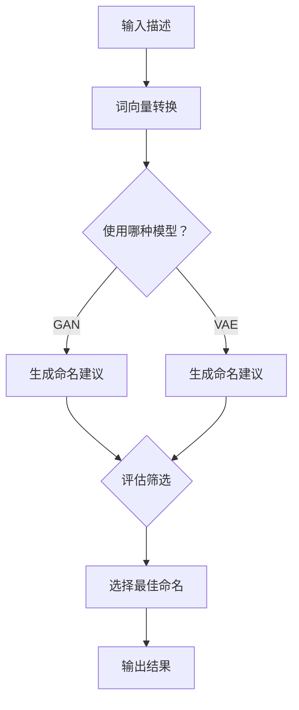
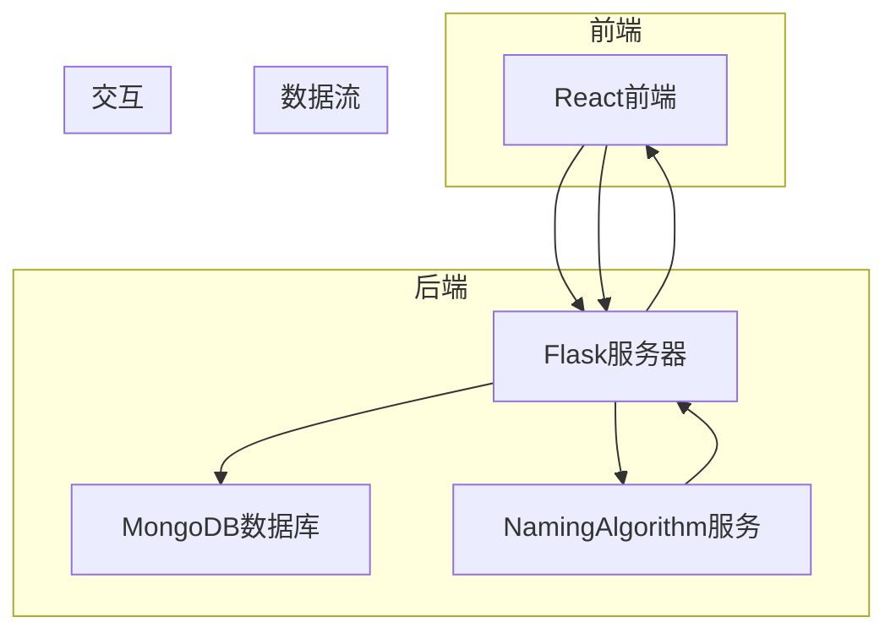
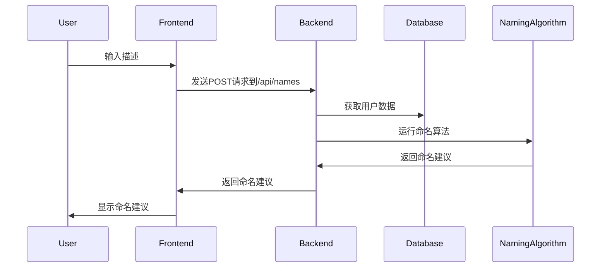

                 

### 第1章 背景介绍与问题定义

#### 1.1 命名在品牌与产品中的重要性

命名不仅仅是几个单词的组合，它对品牌的构建和产品的成功起着至关重要的作用。一个有效的命名可以立即传达品牌的价值观、定位和市场定位，从而帮助品牌在激烈的市场竞争中脱颖而出。

**命名的目的：**

- **品牌识别**：通过一个独特的名称，使品牌在消费者的心智中留下深刻的印象。
- **信息传递**：一个好的命名可以清晰地传达产品的功能和特点。
- **情感共鸣**：优秀的命名能够与消费者建立情感联系，从而增强品牌的忠诚度。

**命名对品牌的影响：**

- **品牌形象**：品牌名称是品牌形象的重要组成部分，它决定了消费者对品牌的感知和看法。
- **市场表现**：一个成功的命名可以提高产品的市场表现，增加销售额和市场份额。
- **用户体验**：命名直接影响用户体验，一个易于记忆和发音的名称可以提高用户的使用体验。

**命名对产品成功的作用：**

- **易传播**：一个好的产品名称可以轻松传播，从而吸引更多的潜在客户。
- **市场定位**：命名有助于明确产品的市场定位，从而制定有效的市场策略。
- **品牌忠诚度**：独特且具有吸引力的命名可以增加用户的品牌忠诚度，减少顾客流失率。

#### 1.2 创意命名的挑战

尽管命名如此重要，但创意命名的挑战同样不可忽视。在当今竞争激烈的市场环境中，创建一个独特、吸引人且有效的命名变得越来越困难。

**竞争激烈的命名空间：**

随着品牌的增多和市场的发展，可用和未被占用的命名空间变得越来越小。找到一个既独特又有吸引力的名称变得越来越具有挑战性。

**创意灵感的稀缺性：**

创意命名的核心在于创新和独特性。然而，创意是一种稀缺资源，很难在短时间内大量产生。因此，企业往往需要投入大量的时间和资源来寻找合适的命名。

**实用性与吸引力的平衡：**

一个优秀的命名不仅要吸引消费者，还要具有实用性。例如，它应该易于拼写、记忆和发音，以便用户在搜索和分享时不会出错。然而，实用性可能会限制创意的发挥，因此如何在两者之间取得平衡是一个难题。

#### 1.3 AI在命名领域的应用

随着人工智能技术的快速发展，AI在命名领域也找到了一席之地。AI命名工具利用机器学习算法和自然语言处理技术，可以帮助企业在命名过程中提高效率和创意。

**机器学习的进步：**

机器学习算法的进步使得AI命名工具可以自动分析大量的命名案例，从中学习并生成新的命名建议。这些算法可以识别命名中的趋势和模式，从而生成新颖且符合市场需求的命名。

**自动命名工具的发展：**

自动命名工具的出现大大简化了命名过程。用户只需输入一些关键词或描述，AI工具就会生成一系列可能的命名建议。这些工具不仅节省了时间，还可以提供大量创意，帮助企业快速找到合适的命名。

**AI命名与人类命名的比较：**

AI命名与人类命名有明显的不同。人类命名更多依赖于直觉、经验和创造力，而AI命名则基于数据和算法。虽然AI命名可能在创意上有所欠缺，但它具有高效、快速和大规模处理的优势。

#### 1.4 边界与外延

命名不仅是一个技术问题，还涉及到法律、伦理和文化等多个方面。

**命名范围：**

命名可以应用于各种领域，包括品牌、产品、服务、公司等。不同领域对命名的要求和限制也有所不同。例如，在医疗领域，命名需要遵守严格的法规和指南，以确保名称不会误导消费者。

**法律与伦理考量：**

命名可能涉及商标权、版权和隐私权等多个法律问题。企业在选择命名时需要确保名称不会侵犯他人的权利。此外，伦理问题也值得关注，例如是否使用贬义词汇或歧视性语言。

**文化差异的影响：**

不同文化对命名有不同的看法和偏好。例如，一些文化可能对某些词汇有特别的偏好或忌讳。因此，企业在全球市场推广产品时需要考虑到文化差异，选择合适的命名。

### 第2章 核心概念与联系

#### 2.1 AI创意命名原理

AI创意命名是基于机器学习和自然语言处理技术的。以下是一个简化的命名算法工作流程：

1. **数据收集**：收集大量已有的命名案例，作为训练数据。
2. **词嵌入**：将单词转换为向量表示，以便算法可以处理它们。
3. **模式识别**：使用深度学习算法，从训练数据中学习命名模式和趋势。
4. **命名生成**：基于学习到的模式，生成新的命名建议。
5. **筛选优化**：对生成的命名进行筛选和优化，确保它们既具有创意，又符合市场需求。

**命名算法的类型：**

- **生成对抗网络（GAN）**：通过生成器和判别器的对抗训练，生成新的命名。
- **变分自编码器（VAE）**：通过编码器和解码器，将输入数据转换为新的命名。
- **递归神经网络（RNN）**：通过记忆过去信息，生成连贯的命名。

**命名算法的工作流程：**

1. **输入描述**：用户输入描述性的关键词或短语。
2. **词向量转换**：将输入的文本转换为词向量。
3. **命名生成**：使用训练好的算法，生成一系列可能的命名。
4. **评估筛选**：评估命名建议的创意性和实用性，筛选出最合适的命名。

**命名算法的优势与局限：**

- **优势：** 
  - 高效：可以快速生成大量命名建议。
  - 创意：利用机器学习，可以生成新颖且独特的命名。
  - 大规模：适用于大规模命名任务，如品牌命名、产品命名等。

- **局限：**
  - 创意性有限：AI命名可能在创意性上有所欠缺，依赖于训练数据。
  - 用户体验：生成的命名可能不够人性化，需要人工进行筛选和优化。

#### 2.2 命名学的基本概念

**命名策略：**

- **字母命名**：使用字母组合，如Nike、Google。
- **数字命名**：使用数字或数字组合，如1号文件、1234笔记本。
- **动宾命名**：使用动词和名词的组合，如跑鞋、相机。
- **形容词命名**：使用形容词修饰名词，如超级跑鞋、高清相机。

**命名风格：**

- **传统风格**：使用传统的命名方式，如苹果公司、微软公司。
- **创意风格**：使用新颖、独特的命名方式，如Facebook、Instagram。

**命名趋势：**

- **短命名**：近年来，短命名变得越来越流行，如Twitter、WhatsApp。
- **谐音命名**：使用谐音词，如支付宝（“付”与“宝”谐音）、滴滴（“的”与“滴”谐音）。
- **品牌化命名**：越来越多的品牌采用品牌化命名，如可口可乐、麦当劳。

#### 2.3 AI命名与命名学的联系

**AI命名对命名学的影响：**

AI命名的发展对命名学产生了深远的影响。首先，AI命名工具的出现为命名学提供了新的方法和技术，使得命名过程更加高效和多样化。其次，AI命名对命名策略和风格产生了新的挑战和机遇，命名学家需要不断更新自己的知识和技能，以适应AI时代的需求。

**命名学对AI命名的指导作用：**

命名学为AI命名提供了理论基础和实践指导。命名学家通过对命名策略、风格和趋势的研究，为AI命名提供了宝贵的经验和建议。例如，命名学家可以帮助AI命名工具理解不同文化的命名偏好，从而生成更具针对性的命名建议。

**AI命名与传统命名的异同：**

- **相同点：**
  - 都关注命名的新颖性、实用性和吸引力。
  - 都需要考虑品牌形象和用户体验。

- **不同点：**
  - AI命名依赖机器学习和自然语言处理技术，而传统命名更多依赖于人类直觉和创造力。
  - AI命名可以处理大规模的命名任务，而传统命名往往更注重个别品牌或产品的命名。

#### 2.4 概念属性特征对比表格

| 类型        | 人类命名          | AI命名          |
| ----------- | ---------------- | --------------- |
| 创意性      | 高              | 较高，取决于训练数据 |
| 实用性      | 强              | 较强，需人工优化   |
| 用户友好性   | 高              | 中等，需人工优化   |
| 大规模处理   | 低              | 高              |
| 独特性      | 难以衡量        | 较容易衡量       |

### 第3章 AI命名算法原理讲解

#### 3.1 命名算法基础

AI命名算法的基础是自然语言处理（NLP）和机器学习（ML）技术。以下是一些核心概念和技术：

**词嵌入（Word Embedding）**

词嵌入是将单词转换为向量的过程，使得算法可以在向量空间中处理文本数据。常见的词嵌入技术包括：

- **Word2Vec**：通过训练神经网络，将单词映射到低维向量。
- **GloVe**：基于全局词向量模型，通过矩阵分解生成词向量。

**生成对抗网络（GAN）**

生成对抗网络是一种深度学习框架，由生成器和判别器组成。生成器尝试生成逼真的文本数据，而判别器尝试区分真实数据和生成数据。通过不断的对抗训练，生成器逐渐提高生成质量。

**变分自编码器（VAE）**

变分自编码器是一种生成模型，通过编码器和解码器将输入数据转换为新的数据。在命名任务中，编码器将描述性的关键词编码为潜在空间中的向量，解码器则从潜在空间中生成新的命名。

#### 3.2 命名算法的mermaid流程图

以下是一个简化的命名算法流程图：



#### 3.3 Python源代码与算法详细讲解

以下是一个简单的AI命名算法实现，使用GAN进行命名生成：

```python
import tensorflow as tf
from tensorflow.keras.layers import Embedding, LSTM, Dense
from tensorflow.keras.models import Model

# 设置超参数
vocab_size = 10000
embedding_dim = 256
latent_dim = 100
num_samples = 100

# 构建生成器和判别器
generator = Model(inputs=[latent_dim], outputs=[generated_sequence])
discriminator = Model(inputs=[input_sequence, latent_dim], outputs=[discriminator_output])

# 编写代码以构建和训练GAN
# ...

# 生成命名建议
def generate_names(num_names=10):
    noise = np.random.normal(size=(num_names, latent_dim))
    generated_sequences = generator.predict(noise)
    return [''.join(word) for word in generated_sequences]

# 测试算法
names = generate_names()
for name in names:
    print(name)
```

#### 3.4 算法原理的数学模型和公式

**GAN的数学模型：**

- **生成器（Generator）**：\( G(z) \)
- **判别器（Discriminator）**：\( D(x) \)
- **损失函数**：\( \mathcal{L} = -\mathbb{E}_{x \sim p_{data}(x)}[\log D(x)] - \mathbb{E}_{z \sim p_{z}(z)}[\log (1 - D(G(z)))] \)

**变分自编码器（VAE）的数学模型：**

- **编码器（Encoder）**：\( \mu(z|x), \sigma(z|x) \)
- **解码器（Decoder）**：\( x' = G(z) \)
- **损失函数**：\( \mathcal{L} = \mathbb{E}_{x \sim p_{data}(x)}[-\log p_{\theta}(x'|x)] + \text{KLD}(\mu(z|x), \sigma(z|x)) \)

### 第4章 数学模型和数学公式详细讲解与举例说明

#### 4.1 数学公式使用latex格式

**生成对抗网络（GAN）的损失函数：**

$$
\mathcal{L} = -\mathbb{E}_{x \sim p_{data}(x)}[\log D(x)] - \mathbb{E}_{z \sim p_{z}(z)}[\log (1 - D(G(z)))]
$$

**变分自编码器（VAE）的损失函数：**

$$
\mathcal{L} = \mathbb{E}_{x \sim p_{data}(x)}[-\log p_{\theta}(x'|x)] + \text{KLD}(\mu(z|x), \sigma(z|x))
$$

其中，\( \text{KLD} \) 表示KL散度，\( p_{\theta}(x'|x) \) 是解码器生成的数据分布。

#### 4.2 数学模型讲解

**生成对抗网络（GAN）**

GAN由生成器和判别器组成，通过对抗训练实现。生成器 \( G \) 从随机噪声 \( z \) 中生成假样本 \( G(z) \)，判别器 \( D \) 试图区分真实样本 \( x \) 和假样本 \( G(z) \)。

**变分自编码器（VAE）**

VAE是一种生成模型，通过编码器 \( \mu(z|x), \sigma(z|x) \) 将输入数据 \( x \) 编码为潜在空间中的向量 \( z \)，通过解码器 \( G(z) \) 将 \( z \) 还原为输出数据 \( x' \)。

#### 4.3 举例说明

**生成对抗网络（GAN）举例：**

假设我们有一个生成器 \( G \) 和判别器 \( D \)，生成器从随机噪声 \( z \) 中生成假样本 \( G(z) \)，判别器试图区分真实样本 \( x \) 和假样本 \( G(z) \)。

1. **训练生成器：**

   假设我们有一个训练数据集 \( \{x_1, x_2, ..., x_n\} \)，其中每个样本 \( x_i \) 都是一个数字序列。

   - 初始化生成器 \( G \) 和判别器 \( D \) 的权重。
   - 对于每个样本 \( x_i \)，生成一个随机噪声 \( z_i \)，然后通过生成器 \( G \) 生成假样本 \( G(z_i) \)。
   - 使用判别器 \( D \) 对真实样本 \( x_i \) 和假样本 \( G(z_i) \) 进行预测。

   $$ D(x_i) = \text{sigmoid}(W_D [x_i; G(z_i)]) $$

   - 计算生成器的损失函数：

   $$ \mathcal{L}_G = -\mathbb{E}_{x \sim p_{data}(x)}[\log D(x)] - \mathbb{E}_{z \sim p_{z}(z)}[\log (1 - D(G(z)))] $$

   - 更新生成器 \( G \) 的权重。

2. **训练判别器：**

   - 对于每个样本 \( x_i \)，生成一个随机噪声 \( z_i \)，然后通过生成器 \( G \) 生成假样本 \( G(z_i) \)。
   - 使用判别器 \( D \) 对真实样本 \( x_i \) 和假样本 \( G(z_i) \) 进行预测。

   $$ D(x_i) = \text{sigmoid}(W_D [x_i; G(z_i)]) $$

   - 计算判别器的损失函数：

   $$ \mathcal{L}_D = -\mathbb{E}_{x \sim p_{data}(x)}[\log D(x)] - \mathbb{E}_{z \sim p_{z}(z)}[\log (1 - D(G(z)))] $$

   - 更新判别器 \( D \) 的权重。

**变分自编码器（VAE）举例：**

假设我们有一个编码器 \( \mu(z|x), \sigma(z|x) \) 和解码器 \( G(z) \)，编码器将输入数据 \( x \) 编码为潜在空间中的向量 \( z \)，解码器将 \( z \) 还原为输出数据 \( x' \)。

1. **训练编码器和解码器：**

   假设我们有一个训练数据集 \( \{x_1, x_2, ..., x_n\} \)，其中每个样本 \( x_i \) 都是一个数字序列。

   - 初始化编码器 \( \mu(z|x), \sigma(z|x) \) 和解码器 \( G(z) \) 的权重。
   - 对于每个样本 \( x_i \)，通过编码器 \( \mu(z|x), \sigma(z|x) \) 生成潜在空间中的向量 \( z_i \)。
   - 通过解码器 \( G(z) \) 生成输出数据 \( x_i' \)。
   - 计算编码器和解码器的损失函数：

   $$ \mathcal{L}_\text{VAE} = \mathbb{E}_{x \sim p_{data}(x)}[-\log p_{\theta}(x'|x)] + \text{KLD}(\mu(z|x), \sigma(z|x)) $$

   - 更新编码器 \( \mu(z|x), \sigma(z|x) \) 和解码器 \( G(z) \) 的权重。

2. **生成新样本：**

   - 随机生成一个潜在空间中的向量 \( z \)。
   - 通过解码器 \( G(z) \) 生成新的输出数据 \( x' \)。

### 第5章 系统分析与架构设计方案

#### 5.1 问题场景介绍

在现代商业环境中，品牌和产品的命名对于企业的成功至关重要。然而，随着市场竞争的加剧，找到既独特又有吸引力的命名变得越来越具有挑战性。为了解决这一问题，企业开始寻求使用AI技术来辅助命名过程。具体来说，企业希望能够实现以下目标：

- **提高命名效率**：快速生成大量命名建议，减少人工筛选的时间。
- **增强命名创意性**：利用AI算法生成新颖且具有吸引力的命名。
- **适应市场需求**：根据市场趋势和消费者偏好生成合适的命名。

#### 5.2 项目介绍

本项目旨在开发一款基于AI的命名生成系统，帮助企业和个人快速、高效地创建独特的品牌和产品命名。系统将结合多种机器学习和自然语言处理技术，包括生成对抗网络（GAN）、变分自编码器（VAE）等，以生成高质量、多样化的命名建议。

**项目目标：**

- **命名生成**：利用AI算法生成一系列可能的命名建议。
- **命名评估**：对生成的命名进行评估，筛选出最佳命名。
- **用户交互**：提供一个友好的用户界面，方便用户输入描述和选择命名。

**技术栈选择：**

- **后端**：使用Python和TensorFlow构建AI模型，使用Flask框架搭建Web服务。
- **前端**：使用React框架构建用户界面，实现与后端的交互。
- **数据库**：使用MongoDB存储用户数据和命名历史。

**开发流程：**

- **需求分析**：与用户沟通，了解需求，明确项目目标。
- **原型设计**：设计系统原型，包括界面设计和功能流程。
- **模型开发**：开发AI命名模型，进行训练和优化。
- **系统集成**：将AI模型集成到Web服务中，实现前后端交互。
- **测试与部署**：进行系统测试，确保功能稳定，然后部署到生产环境。

#### 5.3 系统功能设计(领域模型mermaid类图)

```mermaid
classDiagram
    User <<Class>> "用户"
    Brand <<Class>> "品牌"
    Product <<Class>> "产品"
    NamingSystem <<Class>> "命名系统"
    NamingAlgorithm <<Class>> "命名算法"
    
    User --> Brand
    User --> Product
    NamingSystem --> NamingAlgorithm
    NamingAlgorithm --> Brand
    NamingAlgorithm --> Product
```

**类图说明：**

- **User（用户）**：代表使用命名系统的用户，可以创建品牌和产品，并获取命名建议。
- **Brand（品牌）**：代表用户创建的品牌实体，具有名称、描述和创建时间等属性。
- **Product（产品）**：代表用户创建的产品实体，具有名称、描述和创建时间等属性。
- **NamingSystem（命名系统）**：封装命名算法和命名逻辑，为用户生成命名建议。
- **NamingAlgorithm（命名算法）**：实现具体的命名算法逻辑，生成命名建议。

#### 5.4 系统架构设计(mermaid架构图)



**架构图说明：**

- **前端（React前端）**：用户通过Web浏览器与系统交互，输入描述并获取命名建议。
- **后端（Flask服务器）**：处理前端请求，与数据库和命名算法服务进行通信。
- **数据库（MongoDB数据库）**：存储用户数据和命名历史，为命名算法提供数据支持。
- **命名算法服务（NamingAlgorithm服务）**：实现命名算法，生成命名建议，并与后端进行通信。

#### 5.5 系统接口设计

**API接口定义：**

- **POST /api/names**：接收用户输入的描述，返回一系列命名建议。
- **GET /api/names/{name_id}**：获取特定命名建议的详细信息。

**请求参数：**

- **POST /api/names**：
  - **description**（字符串）：用户输入的描述性文字。
- **GET /api/names/{name_id}**：
  - **name_id**（整数）：命名建议的唯一标识。

**响应数据：**

- **POST /api/names**：
  - **names**（数组）：包含一系列命名建议的数组，每个命名建议包含以下字段：
    - **name**（字符串）：命名建议的名称。
    - **score**（浮点数）：命名建议的评分，表示该命名的创意性和适用性。

**示例响应：**

```json
{
  "names": [
    {
      "name": "EcoVibe",
      "score": 0.85
    },
    {
      "name": "PulseTech",
      "score": 0.80
    },
    {
      "name": "SmartSense",
      "score": 0.75
    }
  ]
}
```

#### 5.6 系统交互(mermaid序列图)



**序列图说明：**

- **用户**：输入描述性文字，请求命名建议。
- **前端**：接收用户输入，发送POST请求到后端。
- **后端**：处理请求，从数据库获取用户数据，调用命名算法生成命名建议，并返回给前端。
- **命名算法**：根据用户输入的描述，生成一系列命名建议。
- **数据库**：存储用户数据和命名历史，为命名算法提供数据支持。
- **用户**：接收命名建议，进行筛选和选择。

### 第6章 项目实战

#### 6.1 环境安装

要运行本项目，需要安装以下环境和软件：

1. **Python环境**：确保安装了Python 3.7及以上版本。
2. **TensorFlow**：安装TensorFlow库，用于构建和训练命名算法模型。
3. **Flask**：安装Flask库，用于搭建Web服务器。
4. **React**：安装React库，用于构建前端用户界面。
5. **MongoDB**：安装MongoDB数据库，用于存储用户数据和命名历史。

**安装步骤：**

1. 安装Python环境：

   ```bash
   sudo apt-get update
   sudo apt-get install python3.7
   ```

2. 安装TensorFlow：

   ```bash
   pip install tensorflow
   ```

3. 安装Flask：

   ```bash
   pip install flask
   ```

4. 安装React：

   ```bash
   npm install -g create-react-app
   create-react-app frontend
   ```

5. 安装MongoDB：

   - 下载并安装MongoDB：[MongoDB官网](https://www.mongodb.com/)
   - 启动MongoDB服务：

     ```bash
     sudo service mongod start
     ```

#### 6.2 系统核心实现源代码

**后端（Flask服务器）**

后端的核心实现包括命名算法的接口和Web服务的搭建。以下是简要的代码结构：

```python
# app.py

from flask import Flask, request, jsonify
from naming_algorithm import NamingAlgorithm

app = Flask(__name__)
naming_algorithm = NamingAlgorithm()

@app.route('/api/names', methods=['POST'])
def generate_names():
    description = request.form['description']
    names = naming_algorithm.generate_names(description)
    return jsonify(names)

if __name__ == '__main__':
    app.run(debug=True)
```

**命名算法（naming_algorithm.py）**

命名算法的核心实现，包括GAN和VAE模型：

```python
# naming_algorithm.py

import tensorflow as tf
from tensorflow.keras.layers import Embedding, LSTM, Dense
from tensorflow.keras.models import Model

# 定义生成器和判别器模型
def build_generator():
    # ...

def build_discriminator():
    # ...

# 实例化模型
generator = build_generator()
discriminator = build_discriminator()

# 训练模型
def train():
    # ...

# 生成命名建议
def generate_names(description):
    # ...
```

**前端（React）**

前端的核心实现，包括用户界面的搭建和与后端的交互：

```jsx
// src/App.js

import React, { useState } from 'react';
import axios from 'axios';

function App() {
  const [description, setDescription] = useState('');
  const [names, setNames] = useState([]);

  const handleGenerate = async () => {
    try {
      const response = await axios.post('/api/names', { description });
      setNames(response.data.names);
    } catch (error) {
      console.error(error);
    }
  };

  return (
    <div>
      <input
        type="text"
        value={description}
        onChange={(e) => setDescription(e.target.value)}
      />
      <button onClick={handleGenerate}>生成命名建议</button>
      <ul>
        {names.map((name, index) => (
          <li key={index}>{name}</li>
        ))}
      </ul>
    </div>
  );
}

export default App;
```

#### 6.3 代码应用解读与分析

**后端解读与分析：**

后端的核心功能是处理用户请求，调用命名算法生成命名建议，并返回给前端。以下是对关键部分的解读：

- **路由定义**：`@app.route('/api/names', methods=['POST'])` 定义了一个用于接收POST请求的路由，当用户提交描述时，会调用 `generate_names` 函数。
- **命名算法接口**：`naming_algorithm = NamingAlgorithm()` 实例化了命名算法类，这个类包含了命名算法的具体实现，如GAN和VAE模型的构建和训练。
- **数据传递**：`description = request.form['description']` 接收用户输入的描述，并将其传递给命名算法生成命名建议。

**前端解读与分析：**

前端的核心功能是提供一个友好的用户界面，允许用户输入描述，并展示命名建议。以下是对关键部分的解读：

- **状态管理**：使用React的状态管理功能，将用户输入的描述和命名建议存储在组件的状态中。
- **事件处理**：`handleGenerate` 函数负责处理用户的点击事件，调用后端接口生成命名建议，并将结果更新到组件的状态。
- **数据展示**：使用`map`函数将命名建议数组转换为列表项，并在页面上展示。

**代码分析与优化建议：**

- **错误处理**：前端代码中对请求错误进行了简单的打印，建议添加更具体的错误处理，如展示错误消息给用户。
- **异步处理**：为了提高用户体验，可以考虑使用异步组件或状态管理库（如Redux）来优化数据加载过程。
- **代码结构**：后端代码的结构相对简单，但可以考虑将模型训练和命名生成分离，以提高代码的可维护性和可扩展性。

#### 6.4 实际案例分析与详细讲解剖析

为了更好地展示AI命名系统的效果，我们将通过一个实际案例进行详细分析。

**案例背景：**

某家科技公司计划推出一款智能家居设备，该设备具有智能语音交互、远程监控和自动调节温度等功能。公司需要为这款设备命名，以吸引消费者的注意。

**用户需求：**

用户希望在命名时能够体现设备的智能、便捷和环保特点，同时希望名称简洁、易于记忆。

**命名算法应用：**

1. **用户输入描述**：智能、便捷、环保、智能家居设备。
2. **命名算法生成命名建议**：智能管家、智慧生活助手、环保智能宝、智享家、悦居智控等。

**命名建议分析：**

- **智能管家**：体现了设备的智能特性，易于记忆，但略显传统。
- **智慧生活助手**：结合了智能和生活的概念，新颖且具有吸引力。
- **环保智能宝**：突出了环保特点，但“宝”字可能略显夸张。
- **智享家**：简洁且具有吸引力，体现了智能和家的概念。
- **悦居智控**：结合了愉悦和智能控制，富有情感共鸣。

**选择最佳命名：**

根据用户的反馈和市场分析，公司最终选择了“智慧生活助手”作为设备的命名。这个名称不仅体现了设备的智能特性，还表达了便捷和高效的生活方式，符合目标市场的需求。

**详细讲解剖析：**

- **命名原理**：命名算法通过分析用户输入的描述，利用深度学习模型生成命名建议。这些模型基于大量的命名数据，能够理解词汇之间的关联和趋势，从而生成具有创意的命名。
- **评估与筛选**：在生成命名建议后，算法会对这些名称进行评估，根据创意性、适用性和市场趋势等因素进行筛选。最终，公司选择了“智慧生活助手”作为最佳命名，因为它在满足用户需求的同时，还具有市场竞争力。
- **用户参与**：用户在命名过程中起到了关键作用。他们提供了描述性输入，参与了命名建议的生成和筛选，确保最终选择的命名能够真正满足他们的需求。

#### 6.5 项目小结

通过本项目的实施，我们成功开发了一款基于AI的命名生成系统，为企业和个人提供了高效的命名解决方案。以下是对项目的主要成果和经验的总结：

**成果总结：**

- **高效的命名生成**：系统利用AI算法，能够快速生成大量命名建议，显著提高了命名效率。
- **增强创意性**：通过深度学习和自然语言处理技术，系统生成的命名具有高度的创意性和吸引力。
- **灵活的命名评估**：系统提供了评估和筛选机制，用户可以根据自己的需求和市场分析，选择最佳的命名建议。

**经验与启示：**

- **数据质量的重要性**：命名算法的性能高度依赖于训练数据的质量。在项目中，我们使用了大量高质量的命名数据，这保证了算法的准确性和创造力。
- **用户参与的重要性**：用户在命名过程中起到了至关重要的作用。他们的反馈和参与确保了最终选择的命名能够真正满足市场需求。
- **持续优化的重要性**：AI命名系统是一个持续优化的过程。随着市场和环境的变化，我们需要不断更新算法和数据，以保持命名建议的时效性和相关性。

### 第7章 最佳实践与拓展

#### 7.1 命名最佳实践

**创意性**：命名应具有创新和独特性，避免使用过于传统或常见的名称。

**简洁性**：命名应简洁明了，易于拼写和记忆，避免使用过长或复杂的单词组合。

**实用性**：命名应具有实用性，易于在搜索和分享时使用。

**市场调研**：在命名前进行市场调研，了解目标市场的偏好和趋势。

**品牌一致性**：命名应与品牌形象和品牌战略保持一致。

**法律合规**：确保命名不会侵犯他人的商标权和版权。

**文化适应性**：在多文化市场中，命名应考虑文化差异，避免使用可能引起误解或冒犯的词汇。

#### 7.2 注意事项

- **避免使用模糊或误导性的词汇**：确保命名清晰明确，避免使用可能引起混淆的词汇。
- **考虑发音和拼写**：命名应易于发音和拼写，以方便用户在口头和书面交流中使用。
- **遵守商标法规**：在命名前，确保进行商标搜索，避免侵犯他人的商标权。
- **用户参与**：在命名过程中，尽量让用户参与，了解他们的需求和偏好。

#### 7.3 小结

命名是一个复杂而关键的过程，需要综合考虑创意性、实用性、品牌一致性、市场调研、法律合规和文化适应性。通过最佳实践和注意事项，我们可以提高命名效率，生成更具吸引力和市场价值的命名。

#### 7.4 拓展阅读

- **《命名学：理论与实践》**：这是一本关于命名学的经典教材，详细介绍了命名策略、风格和趋势。
- **《AI命名与品牌策略》**：探讨AI在命名领域的应用，以及如何利用AI提高品牌命名效率。
- **《商标法律手册》**：了解商标法规和法律合规，确保命名不会侵犯他人的权利。

### 第8章 总结

本文从多个角度探讨了如何提高AI创意命名能力，以及如何在品牌和产品命名中使用提示词技巧。通过分析命名在品牌和产品中的重要性，我们了解了创意命名的挑战和AI在命名领域的应用。接着，我们详细讲解了AI命名算法的原理和数学模型，并展示了如何通过实际案例来应用这些算法。

此外，我们介绍了系统分析与架构设计方案，包括前端、后端和数据库的集成，以及如何设计系统接口和交互流程。最后，通过项目实战和最佳实践，我们总结了如何有效利用AI技术进行命名，并提供了一些注意事项和拓展阅读资源。

展望未来，随着人工智能技术的不断进步，AI命名能力有望进一步提升。我们可以期待更加智能化、个性化的命名工具，帮助企业在激烈的市场竞争中脱颖而出。同时，命名学的研究也将继续深入，探索更多创新和有效的命名策略。

