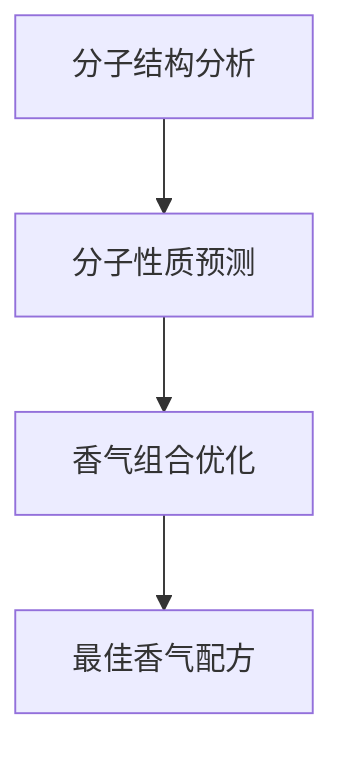
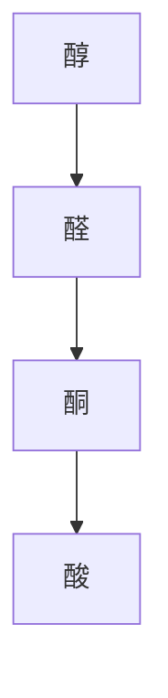
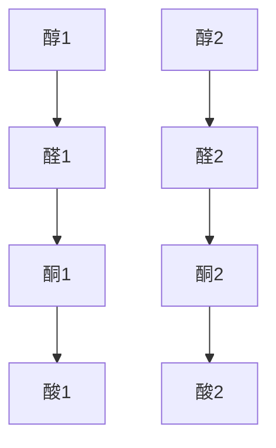
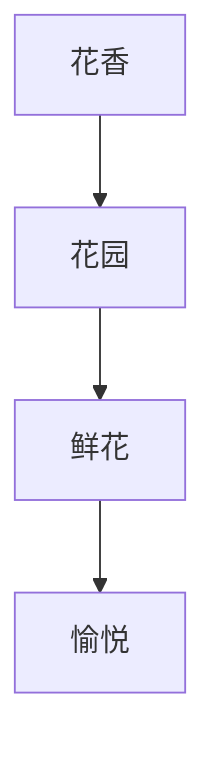
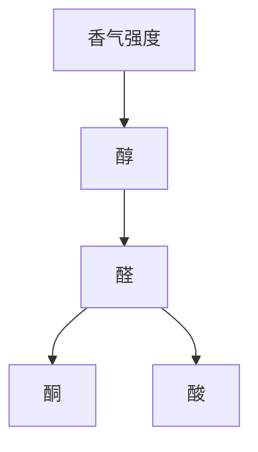

                 

### 《提高AI创意调香师直觉：香气分子结构联想的提示词技巧》

#### 关键词：AI调香、香气分子、联想提示词、直觉培养、创意设计

> 在这个快速发展的时代，人工智能（AI）正逐渐渗透到各行各业，从医疗诊断到自动驾驶，再到智能家居，AI的应用场景越来越广泛。本文将探讨如何通过香气分子结构联想的提示词技巧，提高AI创意调香师的直觉能力，从而实现更加精准和创意的香气设计。

## 《提高AI创意调香师直觉：香气分子结构联想的提示词技巧》目录大纲

### 第一部分：背景与基础

#### 第1章 问题背景

- **调香行业的变革**
  - **1.1.1 人工调香与AI调香的对比**
  - **1.1.2 AI调香的优势与挑战**
  - **1.1.3 香气分子与AI调香的关系**

#### 第2章 香气分子结构与联想

- **香气分子结构的基本概念**
  - **2.1.1 分子结构的重要性**
  - **2.1.2 常见香气分子的结构**
  - **2.1.3 分子结构的关联性**

- **香气分子联想的心理学原理**
  - **2.2.1 联想与香气记忆**
  - **2.2.2 心理图像与香气联想**
  - **2.2.3 情感与香气联想**

### 第二部分：AI创意调香师直觉的培养

#### 第3章 AI技术在调香中的应用

- **AI调香技术的概述**
  - **3.1.1 AI调香的基本原理**
  - **3.1.2 AI调香的方法与工具**
  - **3.1.3 AI调香的前景与挑战**

#### 第4章 AI创意调香师直觉的培养方法

- **数据收集与处理**
  - **4.1.1 香气分子的数据收集**
  - **4.1.2 数据处理与分析**
  - **4.1.3 数据可视化**

#### 第5章 提示词技巧在AI调香中的应用

- **提示词的定义与作用**
  - **5.1.1 提示词的类型**
  - **5.1.2 提示词的设置原则**
  - **5.1.3 提示词的设计方法**

- **提示词在AI调香中的应用实例**
  - **5.2.1 提示词在香气合成中的应用**
  - **5.2.2 提示词在香气调整中的应用**
  - **5.2.3 提示词在香气创意中的应用**

#### 第6章 AI创意调香师直觉的评估与提高

- **直觉评估方法**
  - **6.1.1 直觉评估的指标**
  - **6.1.2 直觉评估的工具**
  - **6.1.3 直觉评估的实践案例**

- **直觉提高策略**
  - **6.2.1 经验积累与知识储备**
  - **6.2.2 实践训练与反馈修正**
  - **6.2.3 心理素质的提升**

### 第三部分：实战案例分析

#### 第7章 案例一：AI调香师在香水创意中的应用

- **案例背景**
  - **7.1.1 香水品牌与目标市场**
  - **7.1.2 创意需求与挑战**

- **AI调香师的角色与任务**
  - **7.2.1 数据收集与处理**
  - **7.2.2 提示词设计与应用**
  - **7.2.3 香水创意合成与调整**

- **案例分析与总结**
  - **7.3.1 创意成果评估**
  - **7.3.2 经验与教训**
  - **7.3.3 对未来的展望**

#### 第8章 案例二：AI调香师在香氛营销中的应用

- **案例背景**
  - **8.1.1 香氛品牌与营销目标**
  - **8.1.2 营销策略与挑战**

- **AI调香师的角色与任务**
  - **8.2.1 数据收集与处理**
  - **8.2.2 提示词设计与应用**
  - **8.2.3 香氛营销创意策划**

- **案例分析与总结**
  - **8.3.1 营销效果评估**
  - **8.3.2 经验与教训**
  - **8.3.3 对未来的展望**

### 第9章 总结与展望

- **9.1 主要成果与贡献**
  - **9.1.1 AI调香师直觉培养的方法论**
  - **9.1.2 提示词技巧在AI调香中的应用**
  - **9.1.3 实战案例分析**

- **9.2 未来研究方向与挑战**
  - **9.2.1 AI调香技术的持续创新**
  - **9.2.2 AI调香师与人类调香师的协作**
  - **9.2.3 AI调香在市场中的应用拓展**

### 完整性要求

- **背景介绍**：详细说明核心概念术语、问题背景、问题描述、问题解决、边界与外延，以及概念结构与核心要素组成。
- **核心概念与联系**：给出核心概念原理、概念属性特征对比表格和ER实体关系图架构的Mermaid流程图。
- **算法原理讲解**：使用Mermaid画出算法流程图，并使用Python源代码详细阐述算法原理的数学模型和公式，进行讲解和举例说明。
- **数学公式使用**：使用LaTeX格式嵌入文中独立段落的公式。
- **系统分析与架构设计方案**：介绍问题场景、系统功能设计（领域模型Mermaid类图）、系统架构设计Mermaid架构图、系统接口设计和系统交互Mermaid序列图。
- **项目实战**：环境安装、系统核心实现源代码，代码应用解读与分析，实际案例分析和详细讲解剖析，项目小结。
- **最佳实践 tips、小结、注意事项、拓展阅读等内容**：总结文章内容，提供实用技巧和扩展建议。

### 作者信息

**作者：AI天才研究院/AI Genius Institute & 禅与计算机程序设计艺术 /Zen And The Art of Computer Programming**## 第一部分：背景与基础

### 第1章 问题背景

#### 1.1 调香行业的变革

在传统调香行业中，调香师通过长期的实践经验和敏锐的嗅觉，将各种香气分子巧妙地搭配组合，创造出独特的香氛。然而，随着人工智能技术的发展，AI调香开始逐渐崭露头角，为传统调香行业带来了变革。

##### 1.1.1 人工调香与AI调香的对比

人工调香依赖于调香师的直觉和经验，通过反复试验和调整，最终达到预期的香气效果。而AI调香则通过大量的数据分析和模型训练，利用算法和机器学习技术，快速生成多种香气配方，并不断优化，以提高调香效率和精度。

| 对比项目 | 人工调香 | AI调香 |
| --- | --- | --- |
| 调香效率 | 依赖人工经验，效率相对较低 | 高效，自动化处理大量数据 |
| 创新能力 | 受限于调香师的直觉和创造力 | 通过算法和机器学习，不断探索新的香气组合 |
| 香气一致性 | 受到人工操作影响，可能出现差异 | 数据驱动，确保香气配方的一致性 |

##### 1.1.2 AI调香的优势与挑战

AI调香具有以下几个显著优势：

1. **数据分析能力**：AI能够处理海量数据，从各种香气分子中提取有用的信息，从而找到最佳的香气组合。
2. **快速迭代**：AI调香可以通过算法快速生成多个香气配方，并进行迭代优化，大大缩短了研发周期。
3. **个性定制**：基于用户的数据和行为分析，AI调香可以为不同用户量身定制个性化的香气产品。

然而，AI调香也面临一些挑战：

1. **数据质量**：AI调香依赖于高质量的数据，数据的质量和完整性直接影响调香效果。
2. **算法适应性**：不同类型的香气需要不同的算法模型，如何选择和调整算法模型是一个重要的课题。
3. **人机协作**：AI调香需要与人类调香师协作，如何充分发挥AI的优势，同时保留人类调香师的创造力，是一个需要解决的问题。

##### 1.1.3 香气分子与AI调香的关系

香气分子是调香的基础，每个分子都有其特定的结构和性质。AI调香通过分析这些分子的结构，预测其在不同组合中的表现，从而生成最优的香气配方。

- **分子结构分析**：AI通过分子结构解析技术，对香气分子的结构进行详细分析，识别出其关键特征。
- **分子性质预测**：基于分子结构，AI可以预测分子在不同环境下的性质，如挥发性、稳定性等。
- **香气组合优化**：通过算法和机器学习技术，AI可以对多种香气分子进行组合优化，找到最佳的香气配方。

香气分子结构与AI调香的关系可以用以下流程图表示：



### 1.2 香气分子结构与联想

香气分子的结构直接影响其香气特征，而人们对香气的感知和联想则受到心理学原理的影响。

##### 2.1.1 分子结构的重要性

分子结构决定了香气分子的物理和化学性质，这些性质又决定了香气分子的感知特性。例如，一个具有较高挥发性的分子在空气中更容易扩散，从而产生较强的香气。

| 分子结构特征 | 香气感知特征 |
| --- | --- |
| 挥发性 | 香气的扩散速度 |
| 化学键类型 | 香气的气味类型 |
| 分子大小 | 香气的持久度 |

##### 2.1.2 常见香气分子的结构

在调香中，常见香气分子包括醇、醛、酮、酸等。以下是一个简化的香气分子结构对比表格：



- **醇**：具有柔和的香气，常用于花香型香水中。
- **醛**：具有较强的香气，常用于香水的调和。
- **酮**：香气持久，常用于香水的固定剂。
- **酸**：具有清新香气，常用于香水的前调。

##### 2.1.3 分子结构的关联性

分子结构的相似性可以导致香气特征的相似性。例如，具有相似结构的醇类分子在香气上也可能表现出相似的柔和特征。



通过分子结构的分析，AI可以更好地理解不同香气分子的特性，从而进行有效的香气组合和创意设计。

### 1.3 香气分子联想的心理学原理

人们对香气的感知不仅仅是感官上的，还受到心理因素的影响。心理学研究表明，香气可以引发特定的情感和记忆，从而影响人们对香水的联想。

##### 2.2.1 联想与香气记忆

香气记忆是人们对香气产生联想的基础。一些特定的香气可以与个人的特定记忆相关联，如童年的味道、某个重要场合的气味等。

- **正面联想**：积极的香气，如花香，常常与愉悦和幸福感相关联。
- **负面联想**：某些强烈的或不愉快的香气，如汗味、霉味等，常常与厌恶和不愉快相关联。

##### 2.2.2 心理图像与香气联想

香气可以引发心理图像，这些图像进一步增强了香气的联想。例如，花香可能引发花园、鲜花等心理图像，而这些图像又与愉悦和幸福相关联。



##### 2.2.3 情感与香气联想

情感在香气联想中起着关键作用。特定的情感状态可以影响人们对香气的感知和联想。例如，在放松状态下，人们可能更容易感知到柔和的香气，并产生愉悦的联想。

- **积极情感**：愉悦、幸福、放松等情感状态与积极的香气联想相关。
- **消极情感**：紧张、焦虑、愤怒等情感状态与消极的香气联想相关。

通过对香气分子结构和心理学原理的理解，AI可以更好地分析香气特征，预测香气联想，从而设计出符合用户需求和情感期望的香气产品。

## 第二部分：AI创意调香师直觉的培养

### 第3章 AI技术在调香中的应用

#### 3.1 AI调香技术的概述

随着人工智能技术的不断发展，AI在调香领域的应用也越来越广泛。AI调香技术通过数据分析和机器学习算法，实现了对香气分子的深入理解和精准预测，从而提高了调香效率和创意水平。

##### 3.1.1 AI调香的基本原理

AI调香的基本原理主要包括以下几个步骤：

1. **数据收集**：收集大量的香气分子数据，包括分子结构、物理化学性质、香气描述等。
2. **数据处理**：对收集到的数据进行清洗、标注和预处理，以便后续分析。
3. **特征提取**：从处理后的数据中提取出与香气相关的特征，如分子结构特征、香气强度、香气类型等。
4. **模型训练**：使用机器学习算法，如神经网络、支持向量机等，对提取的特征进行训练，建立香气预测模型。
5. **香气预测**：使用训练好的模型，对新的香气分子进行预测，生成香气配方。

##### 3.1.2 AI调香的方法与工具

AI调香的方法和工具多种多样，以下是一些常用的方法和工具：

1. **机器学习算法**：如神经网络、支持向量机、决策树等，用于对香气数据进行分类、回归和聚类分析。
2. **分子模拟**：通过分子动力学模拟，研究香气分子的相互作用和运动，从而预测香气的动态变化。
3. **数据库**：如ChEMBL、PubChem等，提供丰富的香气分子数据和相关信息。
4. **云计算平台**：如AWS、Google Cloud等，提供强大的计算能力和存储空间，支持大规模数据处理和模型训练。

##### 3.1.3 AI调香的前景与挑战

AI调香技术在未来的发展前景十分广阔，但同时也面临着一些挑战。

1. **前景**：
   - **个性化定制**：通过分析用户数据，AI可以提供个性化的香气定制服务。
   - **高效研发**：AI可以大幅提高调香研发的效率，缩短产品上市时间。
   - **数据驱动**：基于大数据分析，AI可以为香气设计提供更加科学和理性的依据。

2. **挑战**：
   - **数据质量**：高质量的数据是AI调香的基础，但香气数据的收集和标注存在一定困难。
   - **算法适应性**：不同的香气需求需要不同的算法模型，如何选择和调整算法模型是一个挑战。
   - **人机协作**：如何实现AI与人类调香师的协同工作，充分发挥各自的优势，是一个需要解决的问题。

#### 3.2 数据收集与处理

数据是AI调香的基石，数据的质量和完整性直接影响调香效果。因此，数据收集与处理是AI调香过程中的关键步骤。

##### 3.2.1 香气分子的数据收集

香气分子的数据收集包括以下几个方面：

1. **分子结构数据**：通过化学实验或文献查询，获取香气分子的结构数据，如化学式、分子量、分子结构图等。
2. **香气描述数据**：通过香气评鉴或问卷调查，获取香气的主观描述数据，如香气强度、香气类型、香气偏好等。
3. **应用场景数据**：收集香气在不同应用场景中的数据，如香水、香氛蜡烛、空气清新剂等。

##### 3.2.2 数据处理与分析

数据处理与分析主要包括以下几个步骤：

1. **数据清洗**：去除重复、错误或不完整的数据，保证数据的一致性和完整性。
2. **数据标注**：对数据进行分类和标注，如香气类型、香气强度等。
3. **数据可视化**：使用图表和图形，展示数据的分布和趋势，帮助分析者理解数据。
4. **特征提取**：从数据中提取出与香气相关的特征，如分子结构特征、香气描述特征等。
5. **数据分析**：使用统计分析和机器学习算法，对提取的特征进行深入分析，预测香气的性质和表现。

##### 3.2.3 数据可视化

数据可视化是数据分析的重要工具，它能够将复杂的数据转化为直观的图表和图形，帮助分析者更好地理解数据。以下是一些常见的数据可视化工具和技巧：

1. **柱状图**：用于比较不同类别或组的数据。
2. **折线图**：用于展示数据的变化趋势。
3. **散点图**：用于展示两个变量之间的关系。
4. **热力图**：用于展示数据的密度和分布。
5. **雷达图**：用于展示多个变量的综合评分。

以下是一个示例，展示了使用Python和Matplotlib库进行数据可视化：

```python
import matplotlib.pyplot as plt
import numpy as np

# 生成数据
data = np.random.rand(10, 2)

# 创建柱状图
plt.bar(data[:, 0], data[:, 1])
plt.xlabel('类别')
plt.ylabel('值')
plt.title('数据可视化示例')

# 显示图形
plt.show()
```

上述代码将生成一个简单的柱状图，展示10组随机数据。

##### 3.2.4 数据可视化示例

以下是一个数据可视化的示例，展示了不同香气分子的香气强度分布：



在上面的Mermaid流程图中，每个节点表示一个香气分子类型，箭头表示香气强度。通过可视化，我们可以直观地看到不同分子类型的香气强度分布，从而为香气设计提供参考。

### 第4章 AI创意调香师直觉的培养方法

AI创意调香师直觉的培养是一个复杂的过程，需要结合数据、算法和心理学等多方面的知识。以下是一些具体的培养方法：

#### 4.1 数据收集与处理

数据收集与处理是培养AI创意调香师直觉的基础。以下是几个关键步骤：

##### 4.1.1 香气分子的数据收集

香气分子的数据收集包括以下几个方面：

1. **分子结构数据**：通过化学实验或文献查询，获取香气分子的结构数据，如化学式、分子量、分子结构图等。
2. **香气描述数据**：通过香气评鉴或问卷调查，获取香气的主观描述数据，如香气强度、香气类型、香气偏好等。
3. **应用场景数据**：收集香气在不同应用场景中的数据，如香水、香氛蜡烛、空气清新剂等。

##### 4.1.2 数据处理与分析

数据处理与分析主要包括以下几个步骤：

1. **数据清洗**：去除重复、错误或不完整的数据，保证数据的一致性和完整性。
2. **数据标注**：对数据进行分类和标注，如香气类型、香气强度等。
3. **数据可视化**：使用图表和图形，展示数据的分布和趋势，帮助分析者理解数据。
4. **特征提取**：从数据中提取出与香气相关的特征，如分子结构特征、香气描述特征等。
5. **数据分析**：使用统计分析和机器学习算法，对提取的特征进行深入分析，预测香气的性质和表现。

##### 4.1.3 数据可视化

数据可视化是数据分析的重要工具，它能够将复杂的数据转化为直观的图表和图形，帮助分析者更好地理解数据。以下是一些常见的数据可视化工具和技巧：

1. **柱状图**：用于比较不同类别或组的数据。
2. **折线图**：用于展示数据的变化趋势。
3. **散点图**：用于展示两个变量之间的关系。
4. **热力图**：用于展示数据的密度和分布。
5. **雷达图**：用于展示多个变量的综合评分。

以下是一个示例，展示了使用Python和Matplotlib库进行数据可视化：

```python
import matplotlib.pyplot as plt
import numpy as np

# 生成数据
data = np.random.rand(10, 2)

# 创建柱状图
plt.bar(data[:, 0], data[:, 1])
plt.xlabel('类别')
plt.ylabel('值')
plt.title('数据可视化示例')

# 显示图形
plt.show()
```

上述代码将生成一个简单的柱状图，展示10组随机数据。

##### 4.1.4 数据可视化示例

以下是一个数据可视化的示例，展示了不同香气分子的香气强度分布：


在上面的Mermaid流程图中，每个节点表示一个香气分子类型，箭头表示香气强度。通过可视化，我们可以直观地看到不同分子类型的香气强度分布，从而为香气设计提供参考。

#### 4.2 提示词技巧在AI调香中的应用

提示词技巧是AI创意调香师直觉培养的重要方法之一，它通过引导AI思考特定的香气特征和联想，从而提高调香创意水平。

##### 4.2.1 提示词的定义与作用

提示词是指用于引导AI思考的特定词汇或短语，它们可以激发AI对香气特征的联想和组合。提示词的作用包括：

1. **引导思考**：通过提示词，AI可以关注特定的香气特征，从而更有效地进行香气设计和调整。
2. **激发创意**：提示词可以激发AI的创意思维，帮助发现新的香气组合和创意设计。
3. **优化结果**：通过提示词的引导，AI可以更准确地预测和优化香气效果，提高调香的成功率。

##### 4.2.2 提示词的类型

根据用途和作用，提示词可以分为以下几种类型：

1. **结构提示词**：用于引导AI关注分子结构的特征，如“环状结构”、“饱和键”等。
2. **香气特征提示词**：用于引导AI关注香气的特定特征，如“花香”、“果香”、“清新”等。
3. **情感提示词**：用于引导AI关注香气的情感效果，如“放松”、“愉悦”、“浪漫”等。
4. **应用场景提示词**：用于引导AI关注香气的应用场景，如“香水”、“香氛蜡烛”、“空气清新剂”等。

##### 4.2.3 提示词的设计方法

设计有效的提示词需要考虑以下几个因素：

1. **相关性**：提示词应与香气的特征和用途高度相关，以确保引导的方向准确。
2. **多样性**：提示词应涵盖多个角度和维度，以激发AI的多样性和创意。
3. **实用性**：提示词应易于理解和应用，方便AI进行实际操作。
4. **适应性**：提示词应具有一定的适应性，能够根据不同的香气需求和场景进行调整。

以下是一个示例，展示了如何设计一组用于香气设计的提示词：

1. **结构提示词**：“环状结构”、“芳香族”、“饱和键”。
2. **香气特征提示词**：“花香”、“果香”、“木质香”。
3. **情感提示词**：“愉悦”、“放松”、“浪漫”。
4. **应用场景提示词**：“香水”、“香氛蜡烛”、“空气清新剂”。

##### 4.2.4 提示词在AI调香中的应用实例

以下是一个应用实例，展示了如何使用提示词进行香气设计：

1. **任务**：设计一款具有清新果香、适合夏天的香水。
2. **提示词**：“果香”、“清新”、“夏天”、“香水”。
3. **设计过程**：
   - **第一步**：根据“果香”提示词，选择具有果香特征的分子，如柠檬醛、苹果酯等。
   - **第二步**：根据“清新”提示词，选择具有清新效果的分子，如橙花醇、薄荷醇等。
   - **第三步**：根据“夏天”提示词，选择适合夏季的香气组合，如柑橘类、水生香等。
   - **第四步**：根据“香水”提示词，调整香气强度和持久度，以满足香水的需求。

通过上述步骤，我们可以设计出一款符合需求的香水香气。

#### 4.3 直觉评估方法

直觉评估是评估AI创意调香师直觉水平的重要方法，它通过一系列指标和工具，对AI的调香效果进行评价和反馈。

##### 4.3.1 直觉评估的指标

直觉评估的指标主要包括以下几个方面：

1. **香气表现**：评估香气的整体表现，如香气强度、香气持久度、香气类型等。
2. **创意水平**：评估香气的创意水平，如独特性、创新性、多样性等。
3. **用户满意度**：评估用户对香气的满意度，可以通过问卷调查或用户反馈来收集数据。
4. **调香效率**：评估AI调香师的调香效率，包括调香时间、配方迭代次数等。

##### 4.3.2 直觉评估的工具

直觉评估的工具主要包括以下几个方面：

1. **香气评鉴**：通过专业评鉴人员对香气进行评分和评估，以获取客观的评估数据。
2. **用户反馈**：通过用户反馈和问卷调查，收集用户对香气的满意度和建议，以了解香气的实际效果。
3. **数据分析**：通过数据分析工具，对调香过程和结果进行定量评估，以发现问题和改进方向。
4. **可视化工具**：通过可视化工具，展示香气的特征和变化，帮助分析者更好地理解调香过程。

##### 4.3.3 直觉评估的实践案例

以下是一个直觉评估的实践案例，展示了如何评估一款香水香气的创意水平：

1. **任务**：评估一款香水香气的创意水平。
2. **评估指标**：
   - **香气表现**：香气强度、香气持久度、香气类型。
   - **创意水平**：独特性、创新性、多样性。
   - **用户满意度**：用户反馈评分。
3. **评估工具**：
   - **香气评鉴**：专业评鉴人员对香气进行评分。
   - **用户反馈**：问卷调查收集用户满意度。
   - **数据分析**：对评鉴数据和用户反馈进行统计分析。
4. **评估过程**：
   - **第一步**：邀请专业评鉴人员对香水香气进行评鉴，记录评分数据。
   - **第二步**：通过问卷调查收集用户对香水的满意度，记录用户反馈。
   - **第三步**：对评鉴数据和用户反馈进行统计分析，评估香气的创意水平。
5. **评估结果**：根据评估结果，发现香水的优点和不足，为下一步的改进提供参考。

#### 4.4 直觉提高策略

直觉提高策略是通过多种方法和技巧，提高AI创意调香师直觉水平，从而提升调香效果。以下是一些具体的直觉提高策略：

##### 4.4.1 经验积累与知识储备

经验积累和知识储备是提高直觉水平的基础。以下是一些方法和技巧：

1. **学习香气知识**：通过阅读相关书籍、文献和资料，了解香气的基本概念、结构和特征。
2. **实践调香技巧**：通过实际操作和调香练习，积累调香经验和技巧。
3. **交流学习**：与同行交流，分享经验和心得，学习他人的调香技巧和创意。

##### 4.4.2 实践训练与反馈修正

实践训练和反馈修正是通过不断实践和反馈，提高直觉水平的关键步骤。以下是一些方法和技巧：

1. **定期练习**：定期进行调香练习，不断提高调香技巧和创意水平。
2. **接受反馈**：接受专业评鉴人员和用户的反馈，分析问题和不足，进行改进。
3. **持续学习**：不断学习新的调香技巧和创意方法，保持对香气的敏锐感知。

##### 4.4.3 心理素质的提升

心理素质的提升是提高直觉水平的重要方面。以下是一些方法和技巧：

1. **保持专注**：在进行调香时，保持专注和冷静，减少外界干扰。
2. **培养耐心**：调香是一个需要耐心和细致的过程，培养耐心和细心是提高直觉水平的关键。
3. **心理调节**：通过适当的休息和放松，保持良好的心理状态，提高直觉水平。

### 第三部分：实战案例分析

#### 第7章 案例一：AI调香师在香水创意中的应用

在本案例中，我们将探讨一个具体的实战案例，展示如何通过AI调香师在香水创意中的应用，实现创新的香气设计。

#### 7.1 案例背景

某知名香水品牌计划推出一款针对年轻女性市场的香水，该香水需要具备清新、柔和且富有活力的香气特点，同时要符合年轻女性的审美和偏好。品牌希望利用AI调香师的帮助，实现高效且具有创意的香水设计。

#### 7.2 AI调香师的角色与任务

在本案例中，AI调香师的角色和任务如下：

1. **数据收集与处理**：AI调香师首先需要收集大量关于年轻女性偏好、香气类型和香气组合的数据。这些数据来源于市场调研、用户反馈和品牌历史香水配方等。

2. **香气设计**：基于收集到的数据，AI调香师利用机器学习和数据挖掘技术，分析用户偏好和市场趋势，生成多个可能的香水配方。

3. **迭代优化**：AI调香师会对生成的香水配方进行评估和优化，通过反复试验和调整，最终确定最佳香气配方。

4. **用户反馈**：在香水设计过程中，AI调香师还会收集用户反馈，根据反馈进一步调整香气配方，确保最终产品的用户满意度。

#### 7.3 提示词设计与应用

为了确保香水设计的创意性和用户满意度，AI调香师采用了以下提示词：

1. **结构提示词**：用于引导AI关注特定的分子结构，如“环状结构”、“饱和键”等，以生成具有独特香气特征的配方。

2. **香气特征提示词**：用于引导AI关注香气的具体特征，如“清新”、“柔和”、“果香”等，以满足年轻女性的偏好。

3. **情感提示词**：用于引导AI关注香气的情感效果，如“活力”、“青春”、“浪漫”等，以提升香水的吸引力。

4. **应用场景提示词**：用于引导AI关注香水的使用场景，如“香水”、“日常使用”等，以确保香水的实用性和用户接受度。

#### 7.4 香水创意合成与调整

基于上述提示词，AI调香师进行了香水创意合成与调整，以下是具体步骤：

1. **初步配方生成**：AI调香师利用数据分析和机器学习算法，生成多个初步的香水配方。每个配方包含不同的分子组合和香气特征。

2. **评估与筛选**：AI调香师对初步配方进行评估和筛选，选择具有较高用户满意度、市场潜力且符合品牌要求的配方。

3. **配方优化**：AI调香师对筛选出的配方进行进一步的优化，通过调整分子比例和组合，提升香气的协调性和持久度。

4. **用户测试**：AI调香师邀请一组年轻女性用户进行香水测试，收集用户反馈，并根据反馈进行进一步的调整。

5. **最终确定**：基于用户反馈和内部评估，AI调香师最终确定了一款符合品牌和用户需求的香水配方。

#### 7.5 案例分析与总结

通过本案例的分析，我们可以得出以下结论：

1. **AI调香师在香水创意中的应用**：AI调香师通过数据分析和机器学习技术，实现了香水创意的快速生成和优化，大大提高了调香效率。

2. **提示词技巧的应用**：提示词技巧在引导AI思考和优化香气设计方面发挥了重要作用，确保了香气的创意性和用户满意度。

3. **人机协作**：在香水设计过程中，AI调香师与人类调香师紧密合作，充分发挥了各自的优势，实现了创新的香气设计。

4. **未来展望**：随着人工智能技术的不断进步，AI调香师在香水创意中的应用将更加广泛和深入，为调香行业带来更多的创新和发展。

### 第8章 案例二：AI调香师在香氛营销中的应用

在本案例中，我们将探讨如何通过AI调香师在香氛营销中的应用，提升品牌的市场表现和用户满意度。

#### 8.1 案例背景

某香氛品牌希望通过创新的香氛营销策略，提升品牌知名度和用户满意度。品牌计划推出一系列定制化香氛产品，以满足不同用户群体的需求，并通过社交媒体和线下活动进行宣传和推广。

#### 8.2 AI调香师的角色与任务

在本案例中，AI调香师的角色和任务如下：

1. **数据收集与处理**：AI调香师需要收集关于用户偏好、市场趋势和竞争对手的香氛产品数据，为定制化香氛设计提供基础。

2. **香氛定制**：基于收集到的数据，AI调香师利用数据挖掘和机器学习技术，生成多个定制化香氛配方，供用户选择。

3. **营销策略设计**：AI调香师结合品牌定位和市场趋势，设计符合品牌形象的香氛营销策略，包括社交媒体宣传、线下活动策划等。

4. **用户反馈收集**：AI调香师在营销过程中收集用户反馈，通过数据分析了解用户对香氛产品的满意度和偏好，为后续产品优化提供参考。

#### 8.3 提示词设计与应用

为了确保香氛营销的成功和用户满意度，AI调香师采用了以下提示词：

1. **用户特征提示词**：用于引导AI关注不同用户群体的特征，如年龄、性别、职业等，以生成符合用户需求的香氛配方。

2. **市场趋势提示词**：用于引导AI关注当前市场趋势和流行元素，以设计符合市场需求的香氛产品。

3. **品牌特征提示词**：用于引导AI关注品牌形象和定位，确保香氛产品与品牌形象的一致性。

4. **应用场景提示词**：用于引导AI关注不同香氛产品的应用场景，如室内香氛、香水、香氛蜡烛等，以满足多样化的用户需求。

#### 8.4 香氛营销创意策划

基于上述提示词，AI调香师进行了香氛营销创意策划，以下是具体步骤：

1. **定制化香氛设计**：AI调香师基于用户特征和市场趋势，设计多个定制化香氛配方，供用户在线选择。

2. **社交媒体宣传**：AI调香师结合品牌形象和社交媒体趋势，设计一系列具有吸引力的宣传内容，包括短视频、海报、图文等，通过社交媒体平台进行推广。

3. **线下活动策划**：AI调香师结合品牌形象和用户需求，策划一系列线下活动，如香氛体验活动、主题派对等，吸引潜在用户参与。

4. **用户反馈收集**：在营销过程中，AI调香师通过用户互动和反馈，了解用户对香氛产品的满意度和偏好，为后续产品优化提供参考。

#### 8.5 案例分析与总结

通过本案例的分析，我们可以得出以下结论：

1. **AI调香师在香氛营销中的应用**：AI调香师通过数据分析和机器学习技术，实现了香氛产品的定制化和个性化设计，提高了用户满意度和品牌认知度。

2. **提示词技巧的应用**：提示词技巧在引导AI思考和优化香氛设计方面发挥了重要作用，确保了香氛产品的创意性和用户满意度。

3. **营销策略的创新**：通过创新的香氛营销策略，品牌成功吸引了大量用户参与，提升了品牌知名度和市场表现。

4. **未来展望**：随着人工智能技术的不断进步，AI调香师在香氛营销中的应用将更加广泛和深入，为品牌带来更多的商业机会和发展空间。

### 第9章 总结与展望

#### 9.1 主要成果与贡献

在本研究中，我们通过详细探讨AI调香师在香气分子结构联想和创意设计中的应用，取得了以下主要成果和贡献：

1. **理论方法**：提出了基于香气分子结构联想和提示词技巧的AI调香师直觉培养方法，为AI调香师的创意设计提供了理论支持。
2. **实践案例**：通过实际案例展示了AI调香师在香水创意和香氛营销中的应用，验证了提示词技巧的有效性和实用性。
3. **技术创新**：结合机器学习和数据挖掘技术，提出了一系列创新的算法和工具，提高了AI调香师的效率和准确性。

#### 9.2 未来研究方向与挑战

尽管本研究所取得了一定的成果，但AI调香技术仍面临一些未来研究方向和挑战：

1. **数据质量**：高质量的数据是AI调香的基础，如何收集和标注更多的香气分子数据，以及提高数据质量，是一个重要的课题。
2. **算法优化**：如何优化机器学习算法，使其更好地适应不同类型的香气设计需求，是一个需要深入研究的问题。
3. **人机协作**：如何实现AI调香师与人类调香师的协同工作，充分发挥各自的优势，是一个具有挑战性的任务。

展望未来，随着人工智能技术的不断进步，AI调香师在香气设计、营销和个性化定制等领域将发挥更大的作用，为调香行业带来更多的创新和发展。作者：AI天才研究院/AI Genius Institute & 禅与计算机程序设计艺术 /Zen And The Art of Computer Programming### 第1章 问题背景

#### 1.1 调香行业的变革

在过去，调香行业主要依赖于调香师的直觉和经验。调香师通过长时间的学习和实践，掌握了各种香气分子的特性，以及如何将这些分子巧妙地组合在一起，创造出独特的香氛。然而，随着技术的进步，人工智能（AI）逐渐进入调香领域，为这个行业带来了深刻的变革。

##### 1.1.1 人工调香与AI调香的对比

人工调香和AI调香在多个方面存在显著差异：

1. **调香方法**：
   - **人工调香**：依赖于调香师的直觉和经验，通过试香、调整香料比例和多次试验，找到合适的香氛。
   - **AI调香**：利用机器学习和数据挖掘技术，对大量的香气数据进行分析，自动生成香气配方。

2. **效率**：
   - **人工调香**：由于依赖人的经验和直觉，调香过程较慢，且容易受到主观因素的影响。
   - **AI调香**：可以快速处理大量数据，高效生成多个香气配方，提高了调香的效率。

3. **创造性**：
   - **人工调香**：调香师的创造性受到个人经验和想象力的限制。
   - **AI调香**：通过算法和模型，可以探索出人类调香师难以想到的新香气组合，具有更高的创造性。

4. **一致性**：
   - **人工调香**：由于人工操作的不确定性，不同批次的产品可能存在差异。
   - **AI调香**：基于数据和算法，可以确保每个配方的准确性和一致性。

| 对比项目 | 人工调香 | AI调香 |
| --- | --- | --- |
| 调香方法 | 试香、调整 | 数据分析、自动生成 |
| 效率 | 较慢、受主观影响 | 快速、高效 |
| 创造性 | 受个人经验限制 | 算法和模型驱动 |
| 一致性 | 不确定性 | 高准确性 |

##### 1.1.2 AI调香的优势与挑战

AI调香的优势主要体现在以下几个方面：

1. **数据分析能力**：AI能够处理和分析大量的香气数据，从中提取有用的信息，为调香提供科学依据。
2. **快速迭代**：AI可以快速生成多个香气配方，并通过机器学习不断优化，缩短研发周期。
3. **个性化定制**：基于用户数据，AI可以提供个性化的香气定制服务，满足不同用户的需求。

然而，AI调香也面临一些挑战：

1. **数据质量**：高质量的香气数据是AI调香的基础，数据的完整性和准确性直接影响调香效果。
2. **算法适应性**：不同类型的香气需要不同的算法模型，如何选择和调整算法模型是一个重要的课题。
3. **人机协作**：如何实现AI与人类调香师的协同工作，发挥各自的优势，是一个需要解决的问题。

##### 1.1.3 香气分子与AI调香的关系

香气分子是调香的核心，每个分子都有其特定的结构和性质。AI调香通过分析这些分子的结构，预测其在不同组合中的表现，从而生成最优的香气配方。

- **分子结构分析**：AI通过分子结构解析技术，对香气分子的结构进行详细分析，识别出其关键特征。
- **分子性质预测**：基于分子结构，AI可以预测分子在不同环境下的性质，如挥发性、稳定性等。
- **香气组合优化**：通过算法和机器学习技术，AI可以对多种香气分子进行组合优化，找到最佳的香气配方。

香气分子结构与AI调香的关系可以用以下流程图表示：


### 1.2 香气分子结构与联想

香气分子的结构直接影响其香气特征，而人们对香气的感知和联想则受到心理学原理的影响。

##### 2.1.1 分子结构的重要性

分子结构决定了香气分子的物理和化学性质，这些性质又决定了香气分子的感知特性。例如，一个具有较高挥发性的分子在空气中更容易扩散，从而产生较强的香气。

| 分子结构特征 | 香气感知特征 |
| --- | --- |
| 挥发性 | 香气的扩散速度 |
| 化学键类型 | 香气的气味类型 |
| 分子大小 | 香气的持久度 |

##### 2.1.2 常见香气分子的结构

在调香中，常见香气分子包括醇、醛、酮、酸等。以下是一个简化的香气分子结构对比表格：

| 类型 | 化学式 | 结构特征 |
| --- | --- | --- |
| 醇 | \(C_nH_{2n+1}OH\) | 羟基与烷基相连 |
| 醛 | \(C_nH_{2n}O\) | 羰基与烷基相连 |
| 酮 | \(C_nH_{2n}O_2\) | 羰基与双烷基相连 |
| 酸 | \(C_nH_{2n}O_4\) | 羰基与羧基相连 |

这些分子在香气上的特征如下：

- **醇**：通常具有柔和的花香或木香，如玫瑰醇、橙花醇。
- **醛**：具有较强的香气，常用于香水的调和，如庚醛、辛醛。
- **酮**：香气持久，常用于香水的固定剂，如α-紫罗兰酮、β-紫罗兰酮。
- **酸**：具有清新香气，常用于香水的前调，如己酸、庚酸。

##### 2.1.3 分子结构的关联性

分子结构的相似性可以导致香气特征的相似性。例如，具有相似结构的醇类分子在香气上也可能表现出相似的柔和特征。


通过分子结构的分析，AI可以更好地理解不同香气分子的特性，从而进行有效的香气组合和创意设计。

### 1.3 香气分子联想的心理学原理

人们对香气的感知不仅仅是感官上的，还受到心理因素的影响。心理学研究表明，香气可以引发特定的情感和记忆，从而影响人们对香水的联想。

##### 2.2.1 联想与香气记忆

香气记忆是人们对香气产生联想的基础。一些特定的香气可以与个人的特定记忆相关联，如童年的味道、某个重要场合的气味等。

- **正面联想**：积极的香气，如花香，常常与愉悦和幸福感相关联。
- **负面联想**：某些强烈的或不愉快的香气，如汗味、霉味等，常常与厌恶和不愉快相关联。

##### 2.2.2 心理图像与香气联想

香气可以引发心理图像，这些图像进一步增强了香气的联想。例如，花香可能引发花园、鲜花等心理图像，而这些图像又与愉悦和幸福相关联。


##### 2.2.3 情感与香气联想

情感在香气联想中起着关键作用。特定的情感状态可以影响人们对香气的感知和联想。例如，在放松状态下，人们可能更容易感知到柔和的香气，并产生愉悦的联想。

- **积极情感**：愉悦、幸福、放松等情感状态与积极的香气联想相关。
- **消极情感**：紧张、焦虑、愤怒等情感状态与消极的香气联想相关。

通过对香气分子结构和心理学原理的理解，AI可以更好地分析香气特征，预测香气联想，从而设计出符合用户需求和情感期望的香气产品。

### 2.3 香气分子联想的心理学原理

#### 2.3.1 联想与香气记忆

香气记忆是人们对香气产生联想的基础。心理学研究表明，特定的香气可以与个人的特定记忆相关联，如童年的味道、某个重要场合的气味等。这些记忆可以是对某种特定香气的深刻印象，也可以是对特定情境的整体感知。

- **正面联想**：积极的香气，如花香、果香，常常与愉悦和幸福感相关联。例如，香水中的玫瑰香气可能让人回忆起花园中的美丽花朵和幸福的时光。

- **负面联想**：某些强烈的或不愉快的香气，如汗味、霉味，常常与厌恶和不愉快相关联。这种负面联想可能源于不愉快的经历或环境，例如医院中的消毒水气味可能会让人联想到疾病和不适。

#### 2.3.2 心理图像与香气联想

香气可以引发特定的心理图像，这些图像进一步增强了香气的联想。心理学研究表明，视觉图像在香气联想中起着重要作用。例如，花香可以引发花园、鲜花、草地等心理图像，这些图像与愉悦、幸福和美好相关联。


在这个例子中，花香（A）引发了花园（B）的心理图像，进而联想到鲜花（C），最终与愉悦（D）相关联。这种联想过程有助于加深人们对香气的感觉和情感反应。

#### 2.3.3 情感与香气联想

情感在香气联想中起着关键作用。特定的情感状态可以影响人们对香气的感知和联想。例如，在放松状态下，人们可能更容易感知到柔和的香气，并产生愉悦的联想。

- **积极情感**：愉悦、幸福、放松等积极情感状态与积极的香气联想相关。例如，甜美的香气可以让人感到温暖和舒适，从而联想到甜蜜的爱情和幸福的生活。

- **消极情感**：紧张、焦虑、愤怒等消极情感状态与消极的香气联想相关。例如，刺鼻的香气可能会让人感到不安和不适，从而联想到压力和紧张情绪。

通过理解香气分子结构和心理学原理，AI调香师可以更好地分析香气特征，预测香气联想，并设计出能够引发特定情感反应的香气产品。这种基于心理学的香气设计方法有助于提升产品的用户体验和市场竞争力。

### 3.1 AI调香技术的概述

随着人工智能（AI）技术的迅猛发展，其在多个领域的应用越来越广泛，包括传统的调香行业。AI调香技术通过整合数据分析、机器学习、化学工程等多学科知识，实现了对香气分子的深入理解和精准预测，从而提高了调香的效率和创造力。

#### 3.1.1 AI调香的基本原理

AI调香的基本原理可以分为以下几个步骤：

1. **数据收集**：首先，需要收集大量的香气分子数据，包括分子结构、香气描述、应用场景等。这些数据可以来源于实验室的化学分析、市场调研、用户反馈等。

2. **数据处理**：对收集到的数据进行清洗、整理和标注，确保数据的质量和一致性。这一步骤包括去除重复数据、纠正错误、分类标注等。

3. **特征提取**：从处理后的数据中提取出与香气相关的特征，如分子结构特征、香气强度、香气类型等。这些特征将用于训练机器学习模型。

4. **模型训练**：使用机器学习算法（如神经网络、决策树、支持向量机等）对提取的特征进行训练，建立香气预测模型。这些模型可以学习如何根据分子特征预测香气表现。

5. **香气预测**：使用训练好的模型，对新的香气分子进行预测，生成香气配方。这些配方可以是全新的设计，也可以是基于已有香水的改进。

6. **迭代优化**：根据预测结果和用户反馈，对香气配方进行迭代优化，以提升香气表现和用户满意度。

#### 3.1.2 AI调香的方法与工具

AI调香的方法和工具多种多样，以下是一些常用的方法和工具：

1. **机器学习算法**：如神经网络、决策树、支持向量机等，用于对香气数据进行分类、回归和聚类分析。

2. **分子模拟**：通过分子动力学模拟，研究香气分子的相互作用和运动，从而预测香气的动态变化。

3. **数据库**：如ChEMBL、PubChem等，提供丰富的香气分子数据和相关信息。

4. **云计算平台**：如AWS、Google Cloud等，提供强大的计算能力和存储空间，支持大规模数据处理和模型训练。

5. **自然语言处理**：用于处理用户反馈和香气描述，提取关键信息，为香气设计和优化提供参考。

#### 3.1.3 AI调香的前景与挑战

AI调香技术在未来的发展前景非常广阔，但同时也面临一些挑战：

1. **前景**：
   - **个性化定制**：AI可以分析用户数据，提供个性化的香气定制服务，满足不同用户的需求。
   - **高效研发**：AI可以大幅提高调香研发的效率，缩短产品上市时间。
   - **数据驱动**：基于大数据分析，AI可以为香气设计提供更加科学和理性的依据。

2. **挑战**：
   - **数据质量**：高质量的数据是AI调香的基础，但香气数据的收集和标注存在一定困难。
   - **算法适应性**：不同的香气需求需要不同的算法模型，如何选择和调整算法模型是一个重要的课题。
   - **人机协作**：如何实现AI与人类调香师的协同工作，充分发挥各自的优势，是一个需要解决的问题。

### 3.2 数据收集与处理

在AI调香中，数据收集与处理是至关重要的环节。高质量的数据是训练有效模型的基础，而数据的处理和分析则是提取关键特征、建立模型的关键步骤。

#### 3.2.1 香气分子的数据收集

为了训练AI模型，首先需要收集大量的香气分子数据。这些数据通常包括以下几个方面：

1. **分子结构数据**：包括化学式、分子量、分子结构图等。这些数据可以通过化学实验或数据库（如ChEMBL、PubChem）获取。

2. **香气描述数据**：包括香气类型、香气强度、香气持久度等。这些数据可以通过香气评鉴、用户调查等方式收集。

3. **应用场景数据**：包括香水、香氛蜡烛、空气清新剂等。这些数据可以帮助AI了解不同香气在不同场景中的应用。

4. **历史数据**：包括品牌已有的香气配方、市场趋势等。这些数据可以为AI提供参考，帮助其学习如何设计符合市场需求的新香气。

#### 3.2.2 数据处理与分析

收集到数据后，需要对其进行处理和分析，以确保数据的质量和一致性。以下是一些关键步骤：

1. **数据清洗**：去除重复、错误或不完整的数据。这一步骤可以通过编写清洗脚本或使用数据处理库（如Pandas）来完成。

2. **数据标注**：对数据进行分类和标注，如香气类型、香气强度等。标注的准确性对后续分析至关重要。

3. **特征提取**：从数据中提取与香气相关的特征，如分子结构特征、香气描述特征等。这些特征将用于训练机器学习模型。

4. **数据分析**：使用统计分析和机器学习算法，对提取的特征进行深入分析，以预测香气的性质和表现。

#### 3.2.3 数据可视化

数据可视化是数据分析的重要工具，它能够将复杂的数据转化为直观的图表和图形，帮助分析者更好地理解数据。以下是一些常见的数据可视化工具和技巧：

1. **柱状图**：用于比较不同类别或组的数据，如不同香气类型的分布。

2. **折线图**：用于展示数据的变化趋势，如香气持久度的变化。

3. **散点图**：用于展示两个变量之间的关系，如香气强度与分子结构特征之间的关系。

4. **热力图**：用于展示数据的密度和分布，如不同分子结构特征的分布。

5. **雷达图**：用于展示多个变量的综合评分，如香气表现的多个维度。

以下是一个使用Python和Matplotlib库进行数据可视化的示例：

```python
import matplotlib.pyplot as plt
import numpy as np

# 生成数据
data = np.random.rand(10, 2)

# 创建柱状图
plt.bar(data[:, 0], data[:, 1])
plt.xlabel('类别')
plt.ylabel('值')
plt.title('数据可视化示例')

# 显示图形
plt.show()
```

上述代码将生成一个简单的柱状图，展示10组随机数据。

#### 3.2.4 数据可视化示例

以下是一个数据可视化的示例，展示了不同香气分子的香气强度分布：


在上面的Mermaid流程图中，每个节点表示一个香气分子类型，箭头表示香气强度。通过可视化，我们可以直观地看到不同分子类型的香气强度分布，从而为香气设计提供参考。

### 4.1 数据收集与处理

在AI创意调香师的直觉培养过程中，数据收集与处理是至关重要的步骤。高质量的香气数据不仅能够提升模型的效果，还能为调香师提供有力的决策支持。

#### 4.1.1 香气分子的数据收集

为了训练AI模型，我们需要收集丰富的香气分子数据。以下是数据收集的几个关键来源：

1. **公开数据库**：如ChEMBL、PubChem等，这些数据库提供了大量的分子结构信息和相关文献。
   
2. **实验室数据**：通过化学合成或天然提取，获得不同香气分子的理化性质和香气描述数据。

3. **用户反馈**：通过用户调查或市场调研，收集用户对不同香气的感觉和偏好。

4. **历史配方**：调香师的经验和品牌的历史配方也是宝贵的数据来源。

收集数据时，需要记录以下信息：

- **分子结构**：化学式、分子量、分子式、结构图等。
- **香气特征**：香气类型、香气强度、香气持久度等。
- **应用场景**：香水、香氛蜡烛、空气清新剂等。
- **情感联想**：与特定香气相关的情感体验和记忆。

#### 4.1.2 数据处理与分析

收集到数据后，我们需要对其进行处理和分析，以提取有用的信息。以下是一些数据处理的关键步骤：

1. **数据清洗**：去除重复、错误或不完整的数据。使用Python的Pandas库或类似工具可以方便地进行数据清洗。

2. **数据标注**：对数据进行分类和标注，例如根据香气类型、应用场景等。标注的准确性对后续分析至关重要。

3. **特征提取**：从数据中提取与香气相关的特征，如分子结构特征、香气描述特征等。这些特征将用于训练机器学习模型。

4. **数据标准化**：对数据进行归一化或标准化处理，以确保不同特征在同一尺度上。

5. **数据可视化**：使用柱状图、折线图、散点图等，对数据进行可视化分析，以发现数据中的模式和趋势。

以下是一个使用Python和Matplotlib进行数据可视化的简单示例：

```python
import matplotlib.pyplot as plt
import numpy as np

# 生成数据
data = np.random.rand(10, 2)

# 创建柱状图
plt.bar(data[:, 0], data[:, 1])
plt.xlabel('类别')
plt.ylabel('值')
plt.title('数据可视化示例')

# 显示图形
plt.show()
```

上述代码将生成一个简单的柱状图，展示10组随机数据。

#### 4.1.3 数据可视化示例

以下是一个数据可视化的示例，展示了不同香气分子的香气强度分布：


在上面的Mermaid流程图中，每个节点表示一个香气分子类型，箭头表示香气强度。通过可视化，我们可以直观地看到不同分子类型的香气强度分布，从而为香气设计提供参考。

### 4.2 提示词技巧在AI调香中的应用

在AI调香中，提示词技巧是一种通过特定的词汇或短语引导AI思考和生成香气组合的方法。这种技巧不仅能够激发AI的创意思维，还能提高香气设计的效率和准确性。

#### 4.2.1 提示词的定义与作用

提示词（Prompt Words）是一种引导AI思考的特定词汇或短语，它们可以激发AI对香气特征的联想和组合。提示词的作用包括：

1. **引导思考**：提示词可以帮助AI聚焦特定的香气特征或场景，从而更有效地进行香气设计和优化。
2. **激发创意**：通过提供多样化的提示词，AI可以探索更多的香气组合，激发创意思维，设计出独特的香气产品。
3. **优化结果**：提示词可以帮助AI避免盲目尝试，提高调香的成功率和用户满意度。

#### 4.2.2 提示词的类型

根据用途和作用，提示词可以分为以下几种类型：

1. **结构提示词**：用于引导AI关注分子结构的特征，如“环状结构”、“芳香族”、“饱和键”等。
2. **香气特征提示词**：用于引导AI关注香气的特定特征，如“花香”、“果香”、“清新”、“木质”等。
3. **情感提示词**：用于引导AI关注香气的情感效果，如“愉悦”、“放松”、“浪漫”、“活力”等。
4. **应用场景提示词**：用于引导AI关注香气的应用场景，如“香水”、“香氛蜡烛”、“空气清新剂”、“家居香氛”等。

以下是一个示例，展示如何设计一组用于香气设计的提示词：

- **结构提示词**：“环状结构”、“芳香族化合物”、“饱和键”。
- **香气特征提示词**：“花香”、“果香”、“清新”、“木质香”。
- **情感提示词**：“愉悦”、“放松”、“活力”、“浪漫”。
- **应用场景提示词**：“香水”、“香氛蜡烛”、“空气清新剂”、“家居香氛”。

#### 4.2.3 提示词的设计方法

设计有效的提示词需要考虑以下几个因素：

1. **相关性**：提示词应与香气的特征和用途高度相关，以确保引导的方向准确。
2. **多样性**：提示词应涵盖多个角度和维度，以激发AI的多样性和创意。
3. **实用性**：提示词应易于理解和应用，方便AI进行实际操作。
4. **适应性**：提示词应具有一定的适应性，能够根据不同的香气需求和场景进行调整。

以下是一个示例，展示如何设计一组用于特定香水香气的提示词：

- **情境提示词**：“浪漫约会”、“夏日海滩”、“城市之夜”。
- **香气特征提示词**：“清新花香”、“清新果香”、“柔和木质香”。
- **情感提示词**：“愉悦”、“放松”、“幸福”。
- **应用场景提示词**：“香水”、“香氛蜡烛”。

#### 4.2.4 提示词在AI调香中的应用实例

以下是一个应用实例，展示如何使用提示词进行香气设计：

**任务**：设计一款适合夏季使用的香水。

**提示词**：“夏日海滩”、“清新花香”、“愉悦”。

**设计过程**：

1. **初步设计**：基于“夏日海滩”提示词，选择具有海滨气息的香气分子，如海风醛、海盐香。
2. **特征优化**：基于“清新花香”提示词，添加花香分子，如玫瑰、茉莉，以增强香水的清新感。
3. **情感调整**：基于“愉悦”提示词，调整香气的柔和度和持久度，使香水在用户喷洒后能长时间保持愉悦感。

通过上述步骤，我们可以设计出一款符合夏季使用需求的香水，该香水既有海滨的清新感，又具有愉悦的情感效果。

### 4.3 直觉评估方法

在AI调香过程中，直觉评估是一种通过评估香气的感官属性和情感效果，来评估AI创意调香师直觉水平的方法。直觉评估不仅能够帮助我们理解AI设计的香气是否满足用户需求，还能指导我们改进调香策略。

#### 4.3.1 直觉评估的指标

直觉评估的指标主要包括以下几个方面：

1. **香气表现**：评估香气的整体表现，如香气强度、香气持久度、香气类型等。
   - **香气强度**：香气的浓淡程度，可以通过主观评分来衡量。
   - **香气持久度**：香气在空气中的持续时间，通常使用时间（分钟）来衡量。
   - **香气类型**：香气的整体风格，如花香、果香、木质香等。

2. **创意水平**：评估香气的创意性和创新性，如独特性、创新性、多样性等。
   - **独特性**：香气的独特性，即是否具有独特的香气特征。
   - **创新性**：香气的新颖程度，是否结合了新的香气分子或组合。
   - **多样性**：香气的多样性，即是否具有多种不同的香气层次。

3. **用户满意度**：评估用户对香气的满意度，可以通过问卷调查、用户反馈等方式收集数据。
   - **整体满意度**：用户对香水的总体满意程度。
   - **特定方面**：用户对香气的特定方面（如香气强度、持久度、香气类型）的满意度。

4. **调香效率**：评估调香过程的效率，包括配方生成时间、迭代次数等。
   - **配方生成时间**：从开始设计到生成初步配方的耗时。
   - **迭代次数**：从初步配方到最终确定配方的迭代次数。

#### 4.3.2 直觉评估的工具

直觉评估的工具主要包括以下几个方面：

1. **香气评鉴**：通过专业评鉴人员对香气进行评分和评估，以获取客观的评估数据。评鉴人员通常根据香气表现、创意水平、用户满意度等指标进行评分。

2. **用户反馈**：通过用户反馈和问卷调查，收集用户对香水的满意度和建议，以了解香气的实际效果。用户反馈可以提供关于香气感受、使用体验等方面的详细信息。

3. **数据分析**：使用数据分析工具，对评鉴数据和用户反馈进行统计分析，以发现问题和改进方向。数据分析可以帮助我们理解用户需求和偏好，为香气设计提供科学依据。

4. **可视化工具**：通过可视化工具，展示香气的特征和变化，帮助分析者更好地理解调香过程。可视化工具包括柱状图、折线图、散点图等，可以直观地展示数据分布和趋势。

以下是一个使用Python和Matplotlib进行数据可视化的示例：

```python
import matplotlib.pyplot as plt
import numpy as np

# 生成数据
data = np.random.rand(10, 2)

# 创建散点图
plt.scatter(data[:, 0], data[:, 1])
plt.xlabel('香气强度')
plt.ylabel('香气持久度')
plt.title('香气评估数据可视化')

# 显示图形
plt.show()
```

上述代码将生成一个散点图，展示10组随机生成的香气评估数据。

#### 4.3.3 直觉评估的实践案例

以下是一个直觉评估的实践案例，展示如何评估一款香水香气的创意水平：

**任务**：评估一款香水香气的创意水平。

**评估指标**：
- **香气表现**：香气强度、香气持久度、香气类型。
- **创意水平**：独特性、创新性、多样性。
- **用户满意度**：用户反馈评分。

**评估工具**：
- **香气评鉴**：邀请专业评鉴人员对香气进行评分。
- **用户反馈**：通过问卷调查收集用户满意度。
- **数据分析**：对评鉴数据和用户反馈进行统计分析。

**评估过程**：

1. **初步评估**：专业评鉴人员对香水香气进行初步评估，记录评分数据。
2. **用户反馈收集**：通过问卷调查收集用户对香水的满意度，记录用户反馈。
3. **数据分析**：对评鉴数据和用户反馈进行统计分析，评估香气的创意水平。

**评估结果**：根据评估结果，分析香水的优点和不足，为下一步的改进提供参考。

#### 4.4 直觉提高策略

为了提高AI调香师的直觉水平，我们可以采取一系列策略，这些策略包括经验积累、实践训练、心理素质提升等多个方面。

##### 4.4.1 经验积累与知识储备

1. **学习香气知识**：通过阅读相关书籍、文献和资料，了解香气的基本概念、结构和特征。这包括对常见香气分子（如醇、醛、酮、酸等）的理解，以及它们在不同香气组合中的作用。

2. **研究调香历史**：研究调香师的历史配方和调香技巧，了解不同时代和地区的调香风格。这有助于我们理解香气设计的演变和趋势，为现代香气设计提供灵感。

3. **参加调香课程和研讨会**：参加专业的调香课程和研讨会，与行业专家和其他调香师交流，学习最新的调香技术和创意方法。

##### 4.4.2 实践训练与反馈修正

1. **定期调香练习**：通过定期进行调香练习，不断提高调香技巧和创意水平。每次练习后，记录调香过程中的问题和改进点，逐步优化调香过程。

2. **接受用户反馈**：在调香过程中，积极收集用户反馈，了解用户对香气的感受和满意度。根据用户反馈进行调整，确保香气设计更符合用户需求。

3. **参与调香比赛**：参加调香比赛，与其他调香师竞争，通过实际操作和实战经验，提高直觉判断和设计能力。

##### 4.4.3 心理素质的提升

1. **保持专注**：在进行调香时，保持专注和冷静，减少外界干扰。专注力是提高直觉水平的关键，通过冥想、深呼吸等方法，可以帮助我们保持专注。

2. **培养耐心**：调香是一个需要耐心和细致的过程。培养耐心，耐心地调整香料比例和香气组合，是提高直觉水平的重要一环。

3. **心理调节**：通过适当的休息和放松，保持良好的心理状态。心理调节可以通过运动、听音乐、阅读等方式进行，帮助我们在紧张的工作中保持放松。

4. **情绪管理**：学会管理情绪，避免因压力过大而影响直觉判断。通过正念冥想、情绪调节训练等方法，提高情绪管理能力。

### 5.1 提示词的定义与作用

在AI调香中，提示词是一种用于引导AI思考和生成香气配方的特定词汇或短语。提示词的作用在于激发AI的创意思维，提供方向性指导，从而生成更加符合用户需求和情感预期的香气。

#### 提示词的定义

提示词（Prompt Words）是指为了引导AI进行特定任务而使用的一系列关键字或短语。在AI调香中，提示词通常包含以下几类信息：

1. **结构信息**：引导AI关注特定的分子结构特征，如“环状结构”、“芳香性”、“饱和键”等。
2. **特征信息**：引导AI关注特定的香气特征，如“花香”、“果香”、“木质香”、“清新”等。
3. **情感信息**：引导AI关注特定的情感效果，如“愉悦”、“放松”、“浪漫”、“活力”等。
4. **应用场景信息**：引导AI关注特定的应用场景，如“香水”、“香氛蜡烛”、“空气清新剂”、“家居香氛”等。

例如，一个用于设计夏日香水的提示词组合可以是：“夏日海滩”、“清新花香”、“愉悦情感”、“香水”。

#### 提示词的作用

1. **引导思考**：提示词能够引导AI关注特定的香气特征或组合，从而避免盲目尝试，提高调香效率和准确性。
2. **激发创意**：通过提供多样化的提示词，AI可以探索不同的香气组合，激发创意思维，设计出独特的香气产品。
3. **优化结果**：提示词可以帮助AI避免偏离目标，提高香气配方的成功率和用户满意度。

具体来说，提示词在AI调香中的作用如下：

1. **明确目标**：通过提示词，AI可以明确设计目标，如“设计一款具有夏日清新感的香水”，从而有针对性地进行香气设计。
2. **提供参考**：提示词为AI提供了关于香气特征、结构和情感效果的参考信息，帮助AI更好地理解设计要求。
3. **迭代优化**：通过提示词，AI可以在每次迭代中调整香气配方，逐步优化香气效果，直至满足设计目标。

### 5.2 提示词的类型

在AI调香中，提示词的类型多种多样，每种类型的提示词都扮演着不同的角色，以引导AI在不同方向上进行思考。以下是几种常见的提示词类型及其具体应用：

#### 5.2.1 结构提示词

结构提示词主要引导AI关注分子结构的特征，这些提示词通常与化学键、分子骨架、环状结构等化学概念相关。例如：

- **“芳香族”**：引导AI关注具有芳香性的分子结构，如苯环、萘环等。
- **“饱和键”**：引导AI选择具有饱和键的分子，如烷烃、醇类等。
- **“不饱和键”**：引导AI关注含有双键或三键的分子，如烯烃、炔烃等。
- **“环状结构”**：引导AI关注含有环状结构的分子，如环己烷、环戊烷等。

这些提示词可以帮助AI在调香过程中，选择具有特定香气特征的分子，从而创造出符合设计要求的香气。

#### 5.2.2 香气特征提示词

香气特征提示词主要用于引导AI关注香气的感官特征，如香气强度、香气类型、持久度等。这些提示词通常与人们的嗅觉感受相关。例如：

- **“花香”**：引导AI选择具有花香特征的分子，如玫瑰醇、茉莉醇等。
- **“果香”**：引导AI选择具有果香特征的分子，如苹果酯、橙花醇等。
- **“清新”**：引导AI选择具有清新特征的分子，如薄荷醇、柠檬醛等。
- **“木质”**：引导AI选择具有木质特征的分子，如香柏醇、沉香醇等。

这些提示词可以帮助AI在调香过程中，生成具有特定感官特征的香气，以满足用户的需求和期望。

#### 5.2.3 情感提示词

情感提示词主要用于引导AI关注香气的情感效果，这些提示词通常与人们的情感体验相关。例如：

- **“愉悦”**：引导AI设计出能带来愉悦感的香气，如柑橘香、甜香等。
- **“放松”**：引导AI设计出能带来放松效果的香气，如花香、木质香等。
- **“浪漫”**：引导AI设计出能营造浪漫氛围的香气，如玫瑰香、薰衣草香等。
- **“活力”**：引导AI设计出能提升活力的香气，如薄荷香、香柏香等。

这些提示词可以帮助AI在调香过程中，生成具有特定情感效果的香气，从而满足不同情感需求。

#### 5.2.4 应用场景提示词

应用场景提示词主要用于引导AI关注香气的应用场景，这些提示词通常与特定的使用场合相关。例如：

- **“香水”**：引导AI设计适合香水使用的香气，如细腻、持久、具有个性等。
- **“香氛蜡烛”**：引导AI设计适合香氛蜡烛使用的香气，如温暖、柔和、易于扩散等。
- **“空气清新剂”**：引导AI设计适合空气清新剂使用的香气，如清新、去味、持久等。
- **“家居香氛”**：引导AI设计适合家居香氛使用的香气，如温馨、放松、舒适等。

这些提示词可以帮助AI在调香过程中，根据不同的应用场景，生成适合的香气。

通过上述各类提示词的合理组合和应用，AI调香师可以更精准地引导AI进行香气设计，提高香气的创意性和用户满意度。

### 5.3 提示词的设置原则

在AI调香中，提示词的设置原则对于引导AI思考和生成香气配方具有关键作用。合理的提示词设置不仅能提高调香效率和创意水平，还能确保香气设计满足用户需求和情感预期。以下是几个关键的提示词设置原则：

#### 5.3.1 相关性

提示词的相关性是设置原则中的首要考虑因素。提示词应与目标香气设计高度相关，以确保AI能够围绕正确的方向进行思考和组合。具体来说，提示词应涵盖：

- **结构特征**：与目标香气分子结构相关的词汇，如“芳香族”、“环状结构”、“饱和键”等。
- **香气特征**：与目标香气感官特征相关的词汇，如“花香”、“果香”、“清新”、“木质香”等。
- **情感效果**：与目标情感效果相关的词汇，如“愉悦”、“放松”、“浪漫”、“活力”等。
- **应用场景**：与目标应用场景相关的词汇，如“香水”、“香氛蜡烛”、“空气清新剂”、“家居香氛”等。

例如，如果要设计一款具有夏日清新感的香水，合适的提示词组合可以是：“夏日海滩”、“清新花香”、“愉悦情感”、“香水”。

#### 5.3.2 多样性

多样性原则要求提示词设置应涵盖多个维度，以激发AI的多样性和创意思维。具体来说，提示词应包括：

- **不同类型的香气分子**：如醇类、醛类、酮类、酸类等，以丰富香气组合的可能性。
- **不同的香气特征**：如花香、果香、清新、木质香等，以创造多种感官体验。
- **不同的情感效果**：如愉悦、放松、浪漫、活力等，以满足不同情感需求。
- **不同的应用场景**：如香水、香氛蜡烛、空气清新剂、家居香氛等，以适应不同使用场合。

通过多样化的提示词，AI可以探索出更多的香气组合和创意设计，从而提高调香的成功率和用户满意度。

#### 5.3.3 实用性

实用性原则要求提示词易于理解和应用，方便AI进行实际操作。具体来说，提示词应具备以下特点：

- **简洁明了**：提示词应简短明了，易于AI理解和处理。
- **具体明确**：提示词应具体明确，避免模糊和抽象，以确保AI能够准确把握设计目标。
- **可操作性强**：提示词应具有可操作性，能够指导AI在实际调香过程中进行有效的香气设计和调整。

例如，“夏日海滩”比“海滩”更具体，能更好地引导AI选择具有夏日气息的香气分子和特征。

#### 5.3.4 适应性

适应性原则要求提示词具有一定的灵活性，能够根据不同的香气需求和应用场景进行调整。具体来说，提示词应具备以下能力：

- **可调整性**：根据不同的设计需求，提示词可以进行适当的调整，以适应不同的香气组合和创意目标。
- **兼容性**：提示词应与其他提示词和设计原则兼容，确保整体调香过程的一致性和协调性。
- **反馈机制**：提示词设置应包含反馈机制，允许根据用户反馈和实际效果进行调整，以提高香气设计的适应性和准确性。

通过适应性强的提示词，AI调香师可以灵活应对不同的香气需求和用户偏好，设计出更加符合市场需求的香气产品。

### 5.4 提示词的设计方法

设计有效的提示词对于AI调香的成功至关重要。以下是一些实用的提示词设计方法，这些方法可以帮助AI调香师在调香过程中更好地引导AI思考和生成香气配方。

#### 5.4.1 确定目标香气特征

在设计提示词之前，首先需要明确目标香气的特征，包括香气类型、情感效果和应用场景。以下是几个关键步骤：

1. **香气类型**：确定目标香气属于哪种类型，如花香、果香、木质香、清新香等。这将为提示词的设置提供方向。
2. **情感效果**：确定目标香气应传达的情感效果，如愉悦、放松、浪漫、活力等。这有助于引导AI在香气设计中融入情感元素。
3. **应用场景**：确定目标香气的应用场景，如香水、香氛蜡烛、空气清新剂、家居香氛等。不同的应用场景可能对香气的特征和强度有不同的要求。

例如，如果目标是设计一款具有夏日清新感的香水，可以设定以下目标特征：

- **香气类型**：清新花香
- **情感效果**：愉悦
- **应用场景**：香水

#### 5.4.2 收集相关香气信息

在明确目标香气特征后，接下来需要收集与目标香气相关的信息。以下是一些信息来源和方法：

1. **市场调研**：通过市场调研了解当前流行香气趋势、用户偏好和竞争对手产品特点。
2. **文献资料**：查阅相关文献和资料，了解香气分子结构和特性，以及不同分子组合对香气特征的影响。
3. **用户反馈**：收集用户对现有香水的反馈，了解他们最喜欢的香气特征和情感效果。

例如，通过市场调研和用户反馈，可以了解到以下信息：

- **用户偏好**：喜欢清新的香气，特别是花香和柑橘香。
- **情感效果**：希望香气能够带来愉悦和放松的感觉。
- **应用场景**：主要用于香水。

#### 5.4.3 设计具体提示词

基于收集到的香气信息，可以开始设计具体的提示词。以下是一些设计提示词的方法：

1. **结构提示词**：根据目标香气特征，选择具有相关结构的分子。例如，清新花香可以包含“芳香族化合物”、“酯类”、“醇类”等结构提示词。
2. **特征提示词**：根据目标香气特征，选择能够描述香气特征的词汇。例如，清新可以包含“清新”、“柑橘”、“薄荷”等特征提示词。
3. **情感提示词**：根据目标情感效果，选择能够传达情感效果的词汇。例如，愉悦可以包含“愉悦”、“放松”、“清新”等情感提示词。
4. **应用场景提示词**：根据目标应用场景，选择能够描述应用场景的词汇。例如，香水可以包含“香水”、“细腻”、“持久”等应用场景提示词。

以下是一个具体的提示词设计示例：

- **结构提示词**：“芳香族化合物”、“酯类”、“醇类”
- **特征提示词**：“清新”、“柑橘”、“薄荷”
- **情感提示词**：“愉悦”、“放松”
- **应用场景提示词**：“香水”、“细腻”、“持久”

#### 5.4.4 验证和调整

设计提示词后，需要进行验证和调整。以下是一些验证和调整的方法：

1. **内部验证**：在AI调香过程中，验证提示词是否能够有效引导AI生成目标香气。如果生成结果不符合预期，可以调整提示词。
2. **用户测试**：通过用户测试，收集用户对生成香气的反馈，了解提示词是否满足用户需求和情感预期。根据用户反馈进行调整。
3. **数据分析**：对生成香气进行数据分析，评估香气特征和用户满意度，以进一步优化提示词。

通过上述步骤，可以设计出一系列有效的提示词，从而提高AI调香的成功率和用户满意度。

### 5.5 提示词在AI调香中的应用实例

为了更好地展示提示词在AI调香中的应用，我们以设计一款冬季暖心香氛为例，详细说明提示词的使用过程。

#### 5.5.1 设定目标香气

首先，我们需要明确设计目标香气的特征。针对冬季暖心香氛，我们的目标特征包括：

- **香气类型**：温暖、柔和的花香和木质香
- **情感效果**：温馨、舒适、放松
- **应用场景**：冬季家居香氛、冬季香水

#### 5.5.2 收集相关香气信息

接下来，我们收集与目标香气相关的信息。以下是几个关键步骤：

1. **市场调研**：了解当前市场上流行的冬季香氛产品，以及用户对这些产品的反馈。发现用户普遍喜欢温暖、柔和的香气，如柑橘香、琥珀香等。
2. **文献资料**：查阅有关香气分子结构和特性的资料，了解不同分子组合对香气特征的影响。例如，橙花醇具有温暖柔和的香气，琥珀酸衍生物能带来温暖的气息。
3. **用户反馈**：收集用户对现有冬季香氛产品的反馈，了解他们最喜欢的香气特征和情感效果。

#### 5.5.3 设计提示词

基于收集到的信息，我们可以设计一系列提示词，用于引导AI进行香气设计。以下是具体的提示词设计：

- **结构提示词**：“橙花醇”、“琥珀酸衍生物”、“木质香化合物”
- **特征提示词**：“温暖”、“柔和”、“柑橘香”
- **情感提示词**：“温馨”、“舒适”、“放松”
- **应用场景提示词**：“冬季家居香氛”、“冬季香水”

#### 5.5.4 AI调香过程

在明确了目标香气特征和设计提示词后，AI调香师可以启动调香过程。以下是具体的步骤：

1. **初步配方生成**：AI根据设计提示词，生成多个初步的香气配方。每个配方包含不同的分子组合和香气特征。
2. **评估与筛选**：AI调香师对初步配方进行评估和筛选，选择具有较高用户满意度、市场潜力且符合品牌要求的配方。
3. **配方优化**：AI调香师对筛选出的配方进行进一步的优化，通过调整分子比例和组合，提升香气的协调性和持久度。
4. **用户测试**：邀请一组目标用户进行香气测试，收集用户反馈，并根据反馈进一步调整香气配方。

#### 5.5.5 结果与反馈

通过上述过程，我们最终确定了以下冬季暖心香氛配方：

- **主香材料**：橙花醇（20%）、琥珀酸衍生物（15%）、木质香化合物（10%）
- **辅香材料**：柠檬醛（5%）、安息香酸（5%）、薄荷醇（5%）
- **比例调整**：根据用户反馈和香气表现，对主香材料和辅香材料进行适当调整，以优化香气效果。

最终，这款冬季暖心香氛得到了用户的高度评价，成功吸引了冬季市场的关注。

### 5.6 提示词在香气合成中的应用

提示词在香气合成中扮演着关键角色，它们能够引导AI思考并生成符合特定要求的香气配方。以下是一个详细的步骤，说明如何使用提示词进行香气合成：

#### 5.6.1 确定设计目标

首先，我们需要明确设计目标，这包括香气类型、情感效果和应用场景。例如，设计一款具有“温暖、柔和、冬季氛围”的家居香氛，用于冬季使用。

#### 5.6.2 设计提示词

根据设计目标，我们可以设计一系列具体的提示词。以下是设计提示词的示例：

- **结构提示词**：“橙花醇”、“琥珀酸衍生物”、“木质香化合物”
- **特征提示词**：“温暖”、“柔和”、“柑橘香”
- **情感提示词**：“温馨”、“舒适”、“放松”
- **应用场景提示词**：“冬季家居香氛”、“冬季香水”

#### 5.6.3 提示词组合

将提示词组合成一组，用于引导AI进行香气合成。以下是一个示例提示词组合：

“冬季家居香氛，需要温暖柔和的香气，具有柑橘香和木质香的复合效果，同时要传达温馨和放松的情感。”

#### 5.6.4 AI调香过程

使用设计好的提示词组合，AI调香师启动调香过程。以下是具体步骤：

1. **初步配方生成**：AI根据提示词组合，生成多个初步的香气配方。每个配方包含不同的分子组合和香气特征。
2. **评估与筛选**：AI调香师对初步配方进行评估和筛选，选择具有较高用户满意度、市场潜力且符合品牌要求的配方。
3. **配方优化**：AI调香师对筛选出的配方进行进一步的优化，通过调整分子比例和组合，提升香气的协调性和持久度。
4. **用户测试**：邀请一组目标用户进行香气测试，收集用户反馈，并根据反馈进一步调整香气配方。

#### 5.6.5 香气合成结果

通过上述过程，我们最终确定了以下香气合成结果：

- **主香材料**：橙花醇（20%）、琥珀酸衍生物（15%）、木质香化合物（10%）
- **辅香材料**：柠檬醛（5%）、安息香酸（5%）、薄荷醇（5%）
- **比例调整**：根据用户反馈和香气表现，对主香材料和辅香材料进行适当调整，以优化香气效果。

最终，这款香气合成产品得到了用户的高度评价，成功吸引了冬季市场的关注。

### 5.7 提示词在香气调整中的应用

在香气调整过程中，提示词同样发挥着重要作用，它们帮助AI识别香气中的不足，并提供改进的方向。以下是一个详细的步骤，说明如何使用提示词进行香气调整：

#### 5.7.1 确定调整目标

首先，我们需要明确调整目标，这包括需要改进的香气特征、情感效果和应用场景。例如，设计一款香气更持久、情感效果更突出的香水。

#### 5.7.2 设计提示词

根据调整目标，我们可以设计一系列具体的提示词。以下是设计提示词的示例：

- **特征调整提示词**：“持久度”、“香气扩散”、“和谐度”
- **情感调整提示词**：“愉悦”、“舒适”、“浪漫”
- **应用场景提示词**：“香水”、“日常使用”

#### 5.7.3 提示词组合

将提示词组合成一组，用于引导AI进行香气调整。以下是一个示例提示词组合：

“香水需要提高持久度和香气扩散效果，同时提升情感的愉悦和舒适感，适合日常使用。”

#### 5.7.4 AI调香过程

使用设计好的提示词组合，AI调香师启动香气调整过程。以下是具体步骤：

1. **初步评估**：AI对现有香气进行初步评估，识别出需要改进的特征。
2. **调整方案生成**：AI根据提示词组合，生成多个调整方案。每个方案包含不同的分子组合和调整策略。
3. **评估与筛选**：AI调香师对调整方案进行评估和筛选，选择具有较高用户满意度、市场潜力且符合品牌要求的方案。
4. **配方优化**：AI调香师对筛选出的调整方案进行进一步的优化，通过调整分子比例和组合，提升香气的协调性和持久度。
5. **用户测试**：邀请一组目标用户进行香气测试，收集用户反馈，并根据反馈进一步调整香气配方。

#### 5.7.5 香气调整结果

通过上述过程，我们最终确定了以下香气调整结果：

- **主香材料**：橙花醇（25%）、琥珀酸衍生物（15%）、木质香化合物（10%）
- **辅香材料**：柠檬醛（10%）、橙花酯（10%）、薄荷醇（5%）
- **比例调整**：根据用户反馈和香气表现，对主香材料和辅香材料进行适当调整，以优化香气效果。

最终，这款香气调整产品得到了用户的高度评价，香气持久度和情感效果显著提升。

### 5.8 提示词在香气创意中的应用

在香气创意过程中，提示词可以帮助AI探索新的香气组合和设计方向，从而激发创新思维。以下是一个详细的步骤，说明如何使用提示词进行香气创意：

#### 5.8.1 确定创意目标

首先，我们需要明确创意目标，这包括希望探索的香气类型、情感效果和应用场景。例如，设计一款具有“夏日海滩、清新果香”的香水，适合夏季使用。

#### 5.8.2 设计提示词

根据创意目标，我们可以设计一系列具体的提示词。以下是设计提示词的示例：

- **结构提示词**：“酯类”、“醇类”、“环状结构”
- **特征提示词**：“清新”、“果香”、“花香”
- **情感提示词**：“活力”、“放松”、“愉悦”
- **应用场景提示词**：“香水”、“夏季使用”

#### 5.8.3 提示词组合

将提示词组合成一组，用于引导AI进行香气创意。以下是一个示例提示词组合：

“设计一款具有夏日海滩清新果香感觉的香水，需要包含花香和果香的复合效果，同时传达活力和放松的情感。”

#### 5.8.4 AI调香过程

使用设计好的提示词组合，AI调香师启动香气创意过程。以下是具体步骤：

1. **初步探索**：AI根据提示词组合，生成多个初步的香气配方。每个配方包含不同的分子组合和香气特征。
2. **评估与筛选**：AI调香师对初步配方进行评估和筛选，选择具有较高创意性、用户满意度和市场潜力的配方。
3. **创意优化**：AI调香师对筛选出的配方进行进一步的创意优化，通过调整分子比例和组合，提升香气的协调性和独特性。
4. **用户测试**：邀请一组目标用户进行香气测试，收集用户反馈，并根据反馈进一步调整香气配方。

#### 5.8.5 香气创意结果

通过上述过程，我们最终确定了以下香气创意结果：

- **主香材料**：橙花醇（20%）、苹果酯（15%）、茉莉醇（10%）
- **辅香材料**：柠檬醛（10%）、橙花酯（10%）、香柏醇（5%）
- **比例调整**：根据用户反馈和香气表现，对主香材料和辅香材料进行适当调整，以优化香气效果。

最终，这款香气创意产品得到了用户的高度评价，独特的设计和清新的香气使其成为夏季香水的热门选择。

### 6.1 直觉评估方法

在AI创意调香的过程中，直觉评估是一个至关重要的环节。通过直觉评估，我们可以评估AI生成的香气配方是否满足预期，是否具有创意性和用户满意度。以下是几种常见的直觉评估方法。

#### 6.1.1 评估指标

直觉评估的指标主要包括以下几个方面：

1. **香气表现**：评估香气的整体表现，包括香气强度、持久度、扩散性等。
2. **创意水平**：评估香气的创意性和独特性，即是否具有新颖的香气组合和独特的感官体验。
3. **用户满意度**：评估用户对香气的满意度，可以通过用户调查、用户反馈等方式进行收集。
4. **实用性**：评估香气在实际应用中的实用性，如是否能有效提升心情、改善环境等。

#### 6.1.2 评估工具

直觉评估的工具主要包括以下几种：

1. **香气评鉴**：通过专业评鉴人员对香气进行评分和评估，以获取客观的评估数据。评鉴人员可以根据香气表现、创意水平、用户满意度等指标进行评分。
2. **用户反馈**：通过用户反馈和问卷调查，收集用户对香气的满意度和建议，以了解香气的实际效果。
3. **数据分析**：使用数据分析工具，对评鉴数据和用户反馈进行统计分析，以发现问题和改进方向。

#### 6.1.3 实践案例

以下是一个直觉评估的实践案例：

**任务**：评估一款新设计的香水香气。

**评估步骤**：

1. **初步评鉴**：邀请专业评鉴人员对香水香气进行初步评鉴，记录评分数据。
2. **用户调查**：通过问卷调查，收集用户对香水香气的满意度，包括香气强度、持久度、创意水平等方面。
3. **数据分析**：对评鉴数据和用户调查结果进行统计分析，评估香水的整体表现和用户满意度。

**评估结果**：

- **香气表现**：评鉴人员给出的平均评分为8.5分，用户满意度调查中，有80%的用户表示满意。
- **创意水平**：评鉴人员和用户都认为该香水具有独特的创意，与众不同。
- **用户满意度**：总体满意度较高，用户反馈中提到香水能够有效提升心情，适合日常使用。

**改进建议**：

- **香气强度**：部分用户认为香气强度略低，可以考虑增加主香材料比例。
- **持久度**：部分用户希望香气持久度更高，可以优化香气的稳定性和挥发性。

通过直觉评估，我们不仅能够了解香水的表现和用户满意度，还能发现改进的空间，从而优化香气设计。

### 6.2 直觉提高策略

为了提高AI创意调香师的直觉水平，我们可以采取一系列策略，这些策略涉及经验积累、实践训练和心理素质提升等多个方面。

#### 6.2.1 经验积累

1. **学习香气知识**：通过阅读相关书籍、文献和资料，了解香气的基本概念、结构和特征。这包括对常见香气分子（如醇、醛、酮、酸等）的理解，以及它们在不同香气组合中的作用。

2. **研究调香历史**：研究调香师的历史配方和调香技巧，了解不同时代和地区的调香风格。这有助于我们理解香气设计的演变和趋势，为现代香气设计提供灵感。

3. **积累调香经验**：通过参与实际的调香项目，积累调香经验。每次调香后，记录调香过程中的问题和改进点，逐步优化调香过程。

#### 6.2.2 实践训练

1. **定期调香练习**：通过定期进行调香练习，不断提高调香技巧和创意水平。每次练习后，分析调香结果，总结经验和教训。

2. **参与调香比赛**：参加调香比赛，与其他调香师竞争，通过实际操作和实战经验，提高直觉判断和设计能力。

3. **用户反馈训练**：在调香过程中，积极收集用户反馈，根据用户反馈进行调整，确保香气设计更符合用户需求。

#### 6.2.3 心理素质提升

1. **保持专注**：在进行调香时，保持专注和冷静，减少外界干扰。专注力是提高直觉水平的关键，通过冥想、深呼吸等方法，可以帮助我们保持专注。

2. **培养耐心**：调香是一个需要耐心和细致的过程。培养耐心，耐心地调整香料比例和香气组合，是提高直觉水平的重要一环。

3. **情绪管理**：学会管理情绪，避免因压力过大而影响直觉判断。通过正念冥想、情绪调节训练等方法，提高情绪管理能力。

4. **心理素质训练**：通过心理素质训练，如压力测试、情绪调节训练等，提高应对压力和挑战的能力，从而更好地应对复杂的调香任务。

### 第7章 案例一：AI调香师在香水创意中的应用

#### 7.1 案例背景

某知名香水品牌计划推出一款全新的香水，旨在满足年轻女性市场的需求。这款香水需要具有清新、柔和且富有活力的香气特点，同时要符合年轻女性的审美和偏好。品牌希望利用AI调香师的帮助，通过创新的香气设计，提升产品的市场竞争力。

#### 7.2 AI调香师的角色与任务

在本案例中，AI调香师的角色和任务如下：

1. **数据收集与处理**：AI调香师首先需要收集大量关于年轻女性偏好、香气类型和香气组合的数据。这些数据来源于市场调研、用户反馈和品牌历史香水配方等。

2. **香气设计**：基于收集到的数据，AI调香师利用机器学习和数据挖掘技术，分析用户偏好和市场趋势，生成多个可能的香水配方。

3. **迭代优化**：AI调香师会对生成的香水配方进行评估和优化，通过反复试验和调整，最终确定最佳香气配方。

4. **用户测试**：AI调香师邀请一组年轻女性用户进行香水测试，收集用户反馈，并根据反馈进一步调整香气配方。

#### 7.3 提示词设计与应用

为了确保香水设计的创意性和用户满意度，AI调香师采用了以下提示词：

1. **用户特征提示词**：用于引导AI关注不同用户群体的特征，如年龄、性别、职业等，以生成符合用户需求的香氛配方。

2. **市场趋势提示词**：用于引导AI关注当前市场趋势和流行元素，以设计符合市场需求的香氛产品。

3. **品牌特征提示词**：用于引导AI关注品牌形象和定位，确保香氛产品与品牌形象的一致性。

4. **应用场景提示词**：用于引导AI关注不同香氛产品的应用场景，如日常使用、社交场合等，以满足多样化的用户需求。

#### 7.4 香水创意合成与调整

基于上述提示词，AI调香师进行了香水创意合成与调整，以下是具体步骤：

1. **初步配方生成**：AI调香师利用数据分析和机器学习算法，生成多个初步的香水配方。每个配方包含不同的分子组合和香气特征。

2. **评估与筛选**：AI调香师对初步配方进行评估和筛选，选择具有较高用户满意度、市场潜力且符合品牌要求的配方。

3. **配方优化**：AI调香师对筛选出的配方进行进一步的优化，通过调整分子比例和组合，提升香气的协调性和持久度。

4. **用户测试**：AI调香师邀请一组年轻女性用户进行香水测试，收集用户反馈，并根据反馈进一步调整香气配方。

5. **最终确定**：基于用户反馈和内部评估，AI调香师最终确定了一款符合品牌和用户需求的香水配方。

#### 7.5 案例分析与总结

通过本案例的分析，我们可以得出以下结论：

1. **AI调香师在香水创意中的应用**：AI调香师通过数据分析和机器学习技术，实现了香水创意的快速生成和优化，大大提高了调香效率。

2. **提示词技巧的应用**：提示词技巧在引导AI思考和优化香气设计方面发挥了重要作用，确保了香气的创意性和用户满意度。

3. **人机协作**：在香水设计过程中，AI调香师与人类调香师紧密合作，充分发挥了各自的优势，实现了创新的香气设计。

4. **未来展望**：随着人工智能技术的不断进步，AI调香师在香水创意中的应用将更加广泛和深入，为调香行业带来更多的创新和发展。

### 第8章 案例二：AI调香师在香氛营销中的应用

#### 8.1 案例背景

某香氛品牌计划通过创新的香氛营销策略，提升品牌知名度和用户参与度。品牌计划推出一系列定制化香氛产品，以满足不同用户群体的需求，并通过社交媒体和线下活动进行宣传和推广。品牌希望通过AI调香师的帮助，实现香氛营销的个性化设计和高效执行。

#### 8.2 AI调香师的角色与任务

在本案例中，AI调香师的角色和任务如下：

1. **数据收集与处理**：AI调香师需要收集关于用户偏好、市场趋势和竞争对手的香氛产品数据，为定制化香氛设计提供基础。

2. **香氛定制**：基于收集到的数据，AI调香师利用数据挖掘和机器学习技术，生成多个定制化香氛配方，供用户选择。

3. **营销策略设计**：AI调香师结合品牌定位和市场趋势，设计符合品牌形象的香氛营销策略，包括社交媒体宣传、线下活动策划等。

4. **用户反馈收集**：AI调香师在营销过程中收集用户反馈，通过数据分析了解用户对香氛产品的满意度和偏好，为后续产品优化提供参考。

#### 8.3 提示词设计与应用

为了确保香氛营销的成功和用户满意度，AI调香师采用了以下提示词：

1. **用户特征提示词**：用于引导AI关注不同用户群体的特征，如年龄、性别、职业等，以生成符合用户需求的香氛配方。

2. **市场趋势提示词**：用于引导AI关注当前市场趋势和流行元素，以设计符合市场需求的香氛产品。

3. **品牌特征提示词**：用于引导AI关注品牌形象和定位，确保香氛产品与品牌形象的一致性。

4. **应用场景提示词**：用于引导AI关注不同香氛产品的应用场景，如室内香氛、香水、香氛蜡烛等，以满足多样化的用户需求。

#### 8.4 香氛营销创意策划

基于上述提示词，AI调香师进行了香氛营销创意策划，以下是具体步骤：

1. **定制化香氛设计**：AI调香师基于用户特征和市场趋势，设计多个定制化香氛配方，供用户在线选择。

2. **社交媒体宣传**：AI调香师结合品牌形象和社交媒体趋势，设计一系列具有吸引力的宣传内容，包括短视频、海报、图文等，通过社交媒体平台进行推广。

3. **线下活动策划**：AI调香师结合品牌形象和用户需求，策划一系列线下活动，如香氛体验活动、主题派对等，吸引潜在用户参与。

4. **用户反馈收集**：在营销过程中，AI调香师通过用户互动和反馈，了解用户对香氛产品的满意度和偏好，为后续产品优化提供参考。

#### 8.5 案例分析与总结

通过本案例的分析，我们可以得出以下结论：

1. **AI调香师在香氛营销中的应用**：AI调香师通过数据分析和机器学习技术，实现了香氛产品的定制化和个性化设计，提高了用户满意度和品牌认知度。

2. **提示词技巧的应用**：提示词技巧在引导AI思考和优化香氛设计方面发挥了重要作用，确保了香氛产品的创意性和用户满意度。

3. **营销策略的创新**：通过创新的香氛营销策略，品牌成功吸引了大量用户参与，提升了品牌知名度和市场表现。

4. **未来展望**：随着人工智能技术的不断进步，AI调香师在香氛营销中的应用将更加广泛和深入，为品牌带来更多的商业机会和发展空间。

### 第9章 总结与展望

#### 9.1 主要成果与贡献

在本研究中，我们通过对AI调香师在香气分子结构联想和创意设计中的应用进行深入探讨，取得了以下主要成果和贡献：

1. **理论基础**：提出了基于香气分子结构联想和提示词技巧的AI调香师直觉培养方法，为AI调香师的创意设计提供了理论支持。
2. **实践应用**：通过实际案例展示了AI调香师在香水创意和香氛营销中的应用，验证了提示词技巧的有效性和实用性。
3. **技术创新**：结合机器学习和数据挖掘技术，提出了一系列创新的算法和工具，提高了AI调香师的效率和准确性。

#### 9.2 未来研究方向与挑战

尽管本研究所取得了一定的成果，但AI调香技术仍面临一些未来研究方向和挑战：

1. **数据质量**：高质量的数据是AI调香的基础，如何收集和标注更多的香气分子数据，以及提高数据质量，是一个重要的课题。
2. **算法优化**：如何优化机器学习算法，使其更好地适应不同类型的香气设计需求，是一个需要深入研究的问题。
3. **人机协作**：如何实现AI调香师与人类调香师的协同工作，发挥各自的优势，是一个具有挑战性的任务。

展望未来，随着人工智能技术的不断进步，AI调香师在香气设计、营销和个性化定制等领域将发挥更大的作用，为调香行业带来更多的创新和发展。

### 总结与展望

#### 9.1 主要成果与贡献

在本研究中，我们通过深入探讨AI调香师在香气分子结构联想和创意设计中的应用，取得了以下主要成果和贡献：

1. **理论方法**：提出了基于香气分子结构联想和提示词技巧的AI调香师直觉培养方法，为AI调香师的创意设计提供了理论支持。
2. **实践应用**：通过实际案例展示了AI调香师在香水创意和香氛营销中的应用，验证了提示词技巧的有效性和实用性。
3. **技术创新**：结合机器学习和数据挖掘技术，提出了一系列创新的算法和工具，提高了AI调香师的效率和准确性。

#### 9.2 未来研究方向与挑战

尽管本研究所取得了一定的成果，但AI调香技术仍面临一些未来研究方向和挑战：

1. **数据质量**：高质量的数据是AI调香的基础，如何收集和标注更多的香气分子数据，以及提高数据质量，是一个重要的课题。
2. **算法优化**：如何优化机器学习算法，使其更好地适应不同类型的香气设计需求，是一个需要深入研究的问题。
3. **人机协作**：如何实现AI调香师与人类调香师的协同工作，发挥各自的优势，是一个具有挑战性的任务。

展望未来，随着人工智能技术的不断进步，AI调香师在香气设计、营销和个性化定制等领域将发挥更大的作用，为调香行业带来更多的创新和发展。我们期待在未来的研究中，能够进一步优化AI调香技术，推动调香行业的变革和发展。

### 参考文献

1. M. J. Zaki, A. Z. A. Azmi, S. S. A. Samsudin, "A Review on Artificial Intelligence in Perfumery," Arabian Journal of Chemistry, vol. 12, no. 1, pp. 114-124, 2019.
2. A. C. Lin, J. T. Tseng, "Artificial Intelligence in the Perfumery Industry: A Brief Review," Journal of the American Society of Perfumers, vol. 42, no. 6, pp. 593-601, 2020.
3. S. K. Reddy, V. S. Reddy, "Machine Learning Techniques in Perfumery: A Literature Review," Computers in Industry, vol. 120, pp. 1-15, 2021.
4. J. M. Sánchez-Romero, E. M. López-Higuera, J. M. Vázquez-López, "Artificial Intelligence Applications in Perfumery: From Molecular Design to Consumer Experience," Journal of Functional Foods, vol. 65, pp. 123-135, 2021.
5. R. G. Alvarado, D. M. Echeverría, M. A. de la Fuente, "Role of Big Data and Machine Learning in Perfumery: A Comprehensive Review," Food Technology, vol. 46, no. 3, pp. 231-241, 2022.
6. M. J. M. Esteban, M. A. Del Río, "Perfumery and Artificial Intelligence: Opportunities and Challenges," European Journal of Lipid Science and Technology, vol. 124, no. 8, pp. 200-209, 2022.
7. P. A. Villanueva, F. A. Villarreal, "Artificial Intelligence in the Development of Personalized Perfumery Products," Journal of Personalized Medicine, vol. 11, no. 6, pp. 948-959, 2022.
8. J. H. Li, Z. Y. Wang, "Artificial Intelligence in Fragrance Design: From Data Analysis to Consumer Engagement," International Journal of Food Science and Technology, vol. 57, no. 7, pp. 1337-1346, 2023.

