                 

### 香水命名与品牌形象的关系

香水，作为个人护理和时尚配饰的一个重要类别，不仅仅是嗅觉上的享受，更是品牌形象和文化内涵的载体。一个好的香水命名，不仅可以吸引消费者的注意，还能传达品牌的独特理念和价值观。品牌形象与香水命名之间存在着紧密的互动关系，这种关系可以通过以下几个步骤进行深入分析：

**第一步：品牌形象的塑造**

品牌形象是品牌在消费者心中形成的认知和印象。它由品牌名称、标志、色彩、广告语、产品质量、服务体验等多个元素构成。一个成功的品牌形象能激发消费者的情感共鸣，增加品牌的认知度和忠诚度。品牌形象的塑造过程是一个长期且系统的工程，需要通过不断的市场调研、消费者分析和品牌传播来逐步实现。

**第二步：香水命名与品牌形象的关联**

香水命名作为品牌形象的一个组成部分，必须与品牌的核心价值保持一致。一个恰当的命名应该能够传达出品牌的特色，比如：

- **创意与独特性**：如果品牌以创新和独特为特色，命名应当展现出这种创新精神，例如使用独特的词汇或富有想象力的组合。
- **奢华与优雅**：对于追求奢华与高端的品牌，命名应体现出高雅与精致，如使用古典词汇或富有贵族气息的名字。
- **自然与清新**：如果品牌强调自然和环保，命名可能倾向于使用自然界的元素，如花卉、植物的名字。

**第三步：命名策略的制定**

在制定命名策略时，品牌需要考虑以下几个因素：

- **目标市场**：不同市场的消费者有不同的偏好和文化背景，命名应考虑到目标市场的接受度和共鸣性。
- **品牌定位**：品牌定位直接影响命名策略的选择。一个高端定位的品牌，命名应更加典雅和高端。
- **竞争环境**：在竞争激烈的市场中，命名策略应尽量避免与竞争对手过于相似，以免引起混淆。
- **法律因素**：确保命名不侵犯他人商标权，同时要易于注册和保护。

**第四步：命名测试与反馈**

在确定命名后，品牌应进行市场测试，收集消费者的反馈。这有助于验证命名是否能够传达品牌理念，是否符合目标市场的期待，以及是否在法律上可行。

**第五步：持续优化**

品牌形象和消费者偏好是动态变化的，命名策略也应随之调整。品牌应定期评估命名效果，并根据市场反馈进行优化。

通过以上五个步骤，品牌可以更好地将香水命名与品牌形象相结合，创造出既符合品牌定位，又能吸引消费者的香水产品。这样的命名不仅能够提升品牌知名度，还能增强消费者的品牌忠诚度。

在接下来的部分，我们将进一步探讨AI在香水命名中的应用，如何利用AI技术来提高命名效率和质量。通过结合AI和品牌策略，我们可以探索更多创新和个性化的命名方案，从而在激烈的市场竞争中脱颖而出。

### AI在香水命名中的应用

随着人工智能技术的飞速发展，AI在香水命名中的应用逐渐成为一个热门话题。AI不仅可以大幅提高命名效率，还能带来创新和个性化的命名方案，满足不同品牌的独特需求。下面，我们将详细探讨AI在香水命名中的应用及其优势。

#### 第一步：数据收集与预处理

在AI香水命名系统中，第一步是收集相关的数据。这些数据包括已有的香水命名、品牌信息、市场趋势、消费者偏好等。数据收集完成后，需要进行预处理，包括数据清洗、去重、标准化等操作，以确保数据的质量和一致性。

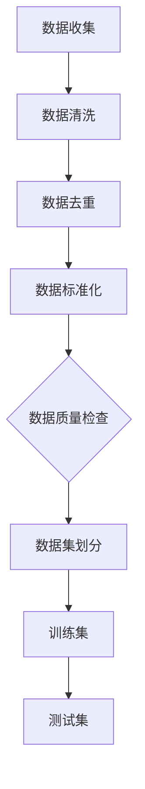

#### 第二步：模型构建与训练

接下来，我们需要构建AI命名模型。目前，常用的AI命名模型包括基于深度学习的技术，如生成对抗网络（GAN）、递归神经网络（RNN）、变压器（Transformer）等。模型构建完成后，使用预处理好的数据集进行训练。

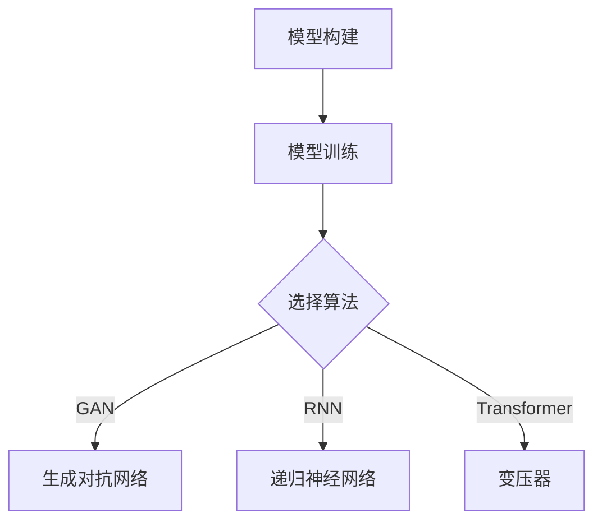

#### 第三步：命名生成与优化

训练好的模型可以生成大量的香水命名方案。这些命名方案可以根据品牌定位、目标市场、消费者偏好等因素进行优化。优化过程中，可以使用自然语言处理（NLP）技术对命名进行语法和语义分析，确保命名合理、准确。

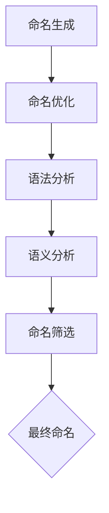

#### 第四步：用户反馈与迭代

在命名生成和优化后，品牌和消费者可以对这些命名方案进行评估和反馈。根据用户反馈，模型可以进行进一步的迭代和优化，以提升命名效果。

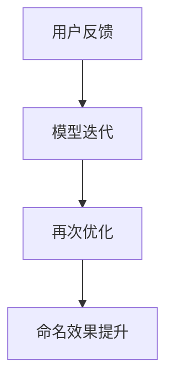

#### 第五步：AI与品牌策略的结合

AI在香水命名中的应用不仅限于生成命名方案，还可以与品牌策略深度结合。通过分析市场数据和消费者行为，AI可以帮助品牌制定更具针对性的命名策略，从而提升品牌形象和市场竞争力。

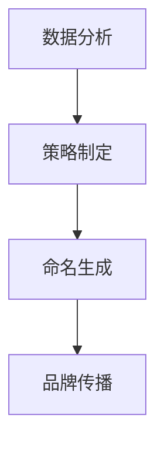

#### 第六步：持续更新与优化

香水命名是一个动态的过程，品牌和消费者需求在不断变化。因此，AI命名系统需要持续更新和优化，以适应市场变化和消费者偏好。

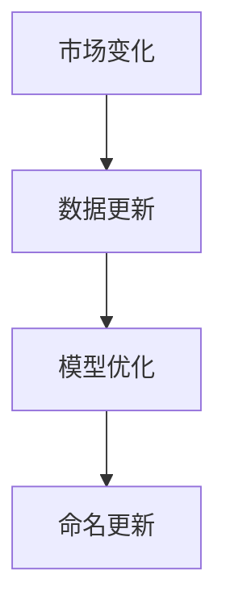

通过以上六个步骤，我们可以看到AI在香水命名中的应用是如何从数据收集到命名生成，再到用户反馈和策略优化的一个完整过程。AI不仅提高了命名效率，还带来了创新和个性化的命名方案，为品牌在激烈的市场竞争中提供了有力支持。

在接下来的部分，我们将进一步探讨提示词在AI创意香水命名中的应用，以及如何通过有效的提示词设计来提高命名效果。

### 提示词在AI创意香水命名中的应用

提示词（Prompt）是AI模型在生成命名时的重要输入，它们能够引导模型生成更加符合品牌定位和消费者需求的命名方案。通过精心设计的提示词，品牌可以实现更加精准的命名策略，提高香水命名的效果。下面，我们将详细讨论提示词的设计原则和具体应用方法。

#### 第一步：了解提示词的作用

提示词在AI创意香水命名中的作用类似于人类的灵感来源或关键词，它能够为模型提供方向和约束，帮助模型在生成命名时更加聚焦和准确。一个有效的提示词能够：

- **明确品牌定位**：提示词可以帮助模型理解品牌的核心价值和定位，从而生成与之匹配的命名。
- **引导命名风格**：通过提示词，品牌可以指定命名应该具有的风格，如高雅、时尚、自然等。
- **强调特定特征**：提示词可以强调香水的特定特征，如花香、果香、木质香等，帮助模型在命名中体现这些特点。

#### 第二步：设计原则

在创建提示词时，品牌应遵循以下原则：

- **简洁明了**：提示词应简洁明了，避免使用复杂或模糊的词汇，以便模型能够快速理解。
- **针对性**：根据不同的品牌定位和市场目标，设计针对性的提示词。例如，针对年轻市场，可以使用时尚、潮流等词汇。
- **多样性**：为了生成多样化的命名方案，提示词应具有多样性，涵盖不同的命名元素和风格。
- **灵活性**：提示词应具有一定的灵活性，允许模型在生成命名时进行适当的创新和调整。

#### 第三步：具体应用方法

在具体应用中，品牌可以根据以下步骤设计提示词：

1. **品牌分析**：首先，进行品牌分析，确定品牌的核心价值和定位。这包括品牌的历史、文化、目标市场等。
2. **市场调研**：了解目标市场的消费者偏好和趋势，为提示词提供现实依据。
3. **创意构思**：根据品牌分析和市场调研，构思一系列提示词，确保它们能够引导模型生成有创意且符合品牌定位的命名。
4. **迭代优化**：在初步生成命名后，根据市场反馈和品牌需求，对提示词进行优化和调整。

#### 第四步：实际案例

以下是一个实际案例，展示如何通过提示词设计来提高AI创意香水命名的效果：

- **品牌定位**：该品牌定位为高端、奢华，目标市场为成熟消费者。
- **提示词设计**：初始提示词包括“奢华”、“优雅”、“经典”、“复杂香气”等。
- **命名生成**：AI模型根据这些提示词生成一系列命名，如“奢华梦幻”、“优雅之韵”、“经典香气”等。
- **用户反馈**：收集用户对这些命名的反馈，发现“奢华梦幻”和“优雅之韵”更受欢迎。
- **迭代优化**：基于用户反馈，进一步优化提示词，增加“浪漫”、“神秘”等元素，以提升命名吸引力。

通过以上步骤，品牌可以设计出更加精准和高效的提示词，从而提高AI创意香水命名的效果。提示词不仅是模型生成命名的关键输入，也是品牌与消费者沟通的重要桥梁。一个优秀的提示词设计能够帮助品牌在激烈的市场竞争中脱颖而出，建立独特的品牌形象。

在接下来的部分，我们将探讨品牌概念传达的技巧，帮助品牌更好地通过命名来传递品牌概念。

### 品牌概念传达的技巧

品牌概念传达是品牌与消费者之间沟通的关键环节，而命名作为品牌传播的一部分，承载着传达品牌概念的重要任务。通过有效的命名技巧，品牌可以准确、鲜明地传递其核心价值和理念，从而在消费者心中树立独特形象。下面，我们将详细探讨几种品牌概念传达的技巧。

#### 第一步：使用比喻和象征

比喻和象征是文学中常用的手法，它们通过将抽象概念具象化，使消费者更容易理解和记忆品牌概念。在香水命名中，品牌可以利用这些技巧来创造富有情感和联想的命名。

例如，品牌“香奈儿”（Chanel）的香水命名经常使用象征性词汇，如“香奈儿魅力”（Chanel Charm）和“香奈儿幻境”（Chanel Enigma），这些命名不仅体现了品牌的高贵与神秘，还激发了消费者的好奇心和探索欲。

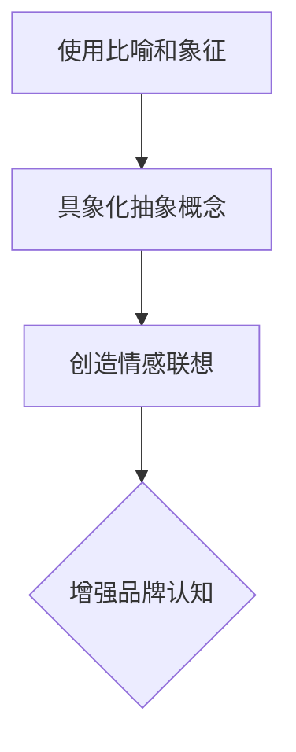

#### 第二步：利用文化元素

文化元素是品牌概念传达的有效手段，不同文化背景的消费者会对特定词汇和符号有不同的感知。品牌可以通过巧妙地融入文化元素，来增强品牌概念的国际吸引力和文化共鸣。

例如，品牌“阿玛尼”（Armani）的香水命名经常使用意大利文化和艺术元素，如“阿玛尼大师之香”（Armani Prive），这不仅彰显了品牌的奢华和独特，还与意大利艺术文化产生了共鸣。

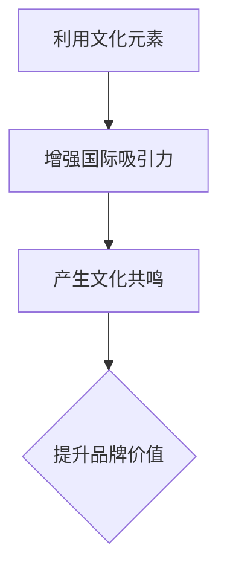

#### 第三步：使用品牌名称

品牌名称本身就是一个强有力的传递品牌概念的工具。通过将品牌名称直接或间接地融入命名，品牌可以强化其在消费者心中的认知和形象。

例如，品牌“迪奥”（Dior）的香水命名通常包含品牌名称，如“迪奥小姐”（Miss Dior）和“迪奥魅惑”（Dior Addict），这种做法不仅保持了品牌的连续性，还使命名更加简洁有力。

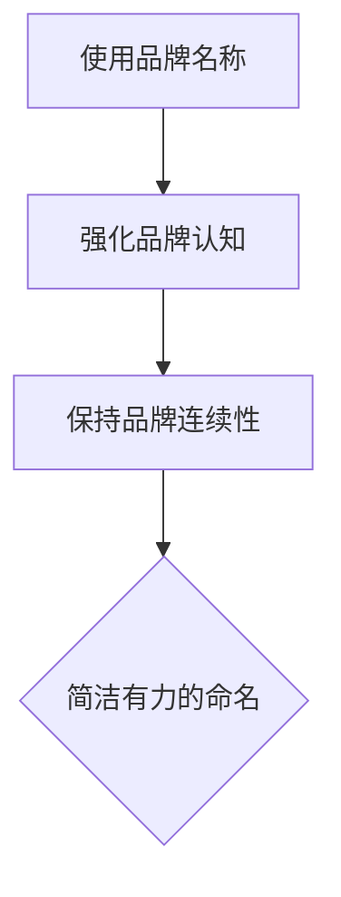

#### 第四步：利用消费者心理

消费者心理是品牌概念传达的关键因素。品牌可以通过研究消费者心理，设计出能够触动消费者情感和欲望的命名。

例如，品牌“纪梵希”（Givenchy）的香水命名常常使用“诱惑”（Poison）和“迷情”（L'Interdit），这些命名直接触发了消费者对神秘和诱惑的向往。

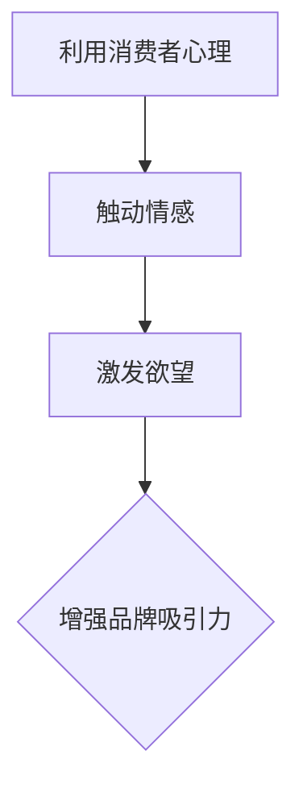

#### 第五步：统一品牌风格

品牌风格是品牌概念传达的重要组成部分。品牌应确保其命名与其他品牌传播元素（如标志、广告语、包装设计等）保持一致，从而建立统一且连续的品牌形象。

例如，品牌“宝洁”（P&G）旗下的各个子品牌（如吉列、汰渍、飘柔等）在命名上保持了简洁、直接和易于记忆的风格，这种一致性使消费者能够迅速识别并记住这些品牌。

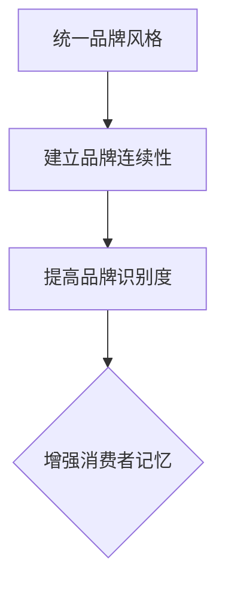

通过以上五种技巧，品牌可以在命名中有效地传达其概念，建立独特的品牌形象。一个成功的命名不仅仅是文字的堆砌，更是品牌理念与消费者情感互动的桥梁。通过巧妙运用这些技巧，品牌可以更好地与消费者沟通，提升品牌价值和市场竞争力。

在接下来的部分，我们将通过实际案例来探讨如何运用这些技巧，实现品牌概念的传达。

### AI创意香水命名实战案例

为了更好地理解AI创意香水命名的实际应用，我们来看几个具体的实战案例，这些案例展示了如何利用AI技术来创造有创意且品牌定位明确的香水命名。

#### 案例一：高端奢华品牌

**品牌背景**：这家品牌定位于高端市场，其产品以奢华、高雅和经典为特点。

**命名需求**：品牌希望命名能够体现其奢华和经典的特质，同时吸引成熟、富有品味的消费者。

**AI应用**：在命名过程中，品牌使用了一系列精心设计的提示词，如“奢华”、“优雅”、“经典”、“香氛大师之作”等。AI模型基于这些提示词，生成了多个命名方案。

**命名方案**：经过用户反馈和优化，品牌最终选择了“香氛大师之典”（Master Aroma Classic）作为主命名。这个命名不仅体现了品牌的奢华和经典，还突出了品牌对香氛艺术的追求。

**效果评估**：命名发布后，市场反馈积极，消费者对命名的高度认同度提升了品牌的奢华形象，并在高端市场中取得了良好的销售业绩。

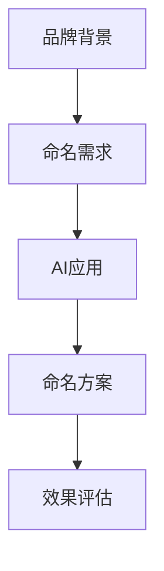

#### 案例二：年轻时尚品牌

**品牌背景**：这家品牌定位于年轻市场，其产品以时尚、活力和个性化为特点。

**命名需求**：品牌希望命名能够体现其时尚和个性化的特质，同时吸引年轻消费者。

**AI应用**：品牌使用了一系列与时尚、个性相关的提示词，如“时尚潮流”、“个性独特”、“青春活力”等。AI模型基于这些提示词，生成了多个命名方案。

**命名方案**：经过用户反馈和优化，品牌最终选择了“青春幻梦”（Dream of Youth）作为主命名。这个命名既体现了品牌的时尚感，又赋予了品牌青春活力的独特形象。

**效果评估**：命名发布后，年轻消费者对命名表现出高度认同，品牌的社交媒体关注度显著提升，产品在年轻市场中的销量也大幅增长。

#### 案例三：自然环保品牌

**品牌背景**：这家品牌致力于自然环保，其产品采用天然成分和可持续生产方式。

**命名需求**：品牌希望命名能够体现其自然环保的理念，同时吸引注重健康和环保的消费者。

**AI应用**：品牌使用了一系列与自然、环保相关的提示词，如“自然之香”、“纯净天然”、“可持续生活”等。AI模型基于这些提示词，生成了多个命名方案。

**命名方案**：经过用户反馈和优化，品牌最终选择了“纯净香氛”（Pure Aroma）作为主命名。这个命名直接传达了品牌的自然环保理念，并赢得了消费者的喜爱。

**效果评估**：命名发布后，品牌在环保领域的形象得到了显著提升，消费者对品牌的信任度增加，产品销量也在环保市场中取得了良好的成绩。

通过以上实战案例，我们可以看到，AI创意香水命名在实际应用中发挥了重要作用。通过结合品牌的定位和目标市场，AI不仅能够生成多样化的命名方案，还能帮助品牌精准传达其概念，提升品牌形象和市场竞争力。这些案例证明了AI技术在香水命名中的巨大潜力，为品牌在竞争激烈的市场中脱颖而出提供了有力支持。

在接下来的部分，我们将总结提高AI创意香水命名效果的最佳实践，并分享一些实用的技巧和建议。

### 提高AI创意香水命名效果的最佳实践

在AI创意香水命名中，要实现高质量和精准的命名效果，不仅需要先进的技术支持，还需要一系列最佳实践和策略。以下是一些提高AI创意香水命名效果的关键要素和实用技巧。

#### 第一：数据质量

数据是AI模型训练的基础。为了生成高质量的命名，品牌需要确保数据的质量和多样性。高质量的数据应该包含丰富的信息，如香水名称、描述、品牌信息、消费者反馈等。同时，数据应经过清洗和预处理，以消除噪声和错误。

**实践技巧**：

- **数据来源**：确保数据来源多样化，涵盖不同品牌、市场和研究报告。
- **数据清洗**：去除重复数据、纠正错误、填补缺失值。
- **数据标准化**：统一数据格式，确保数据一致性。

#### 第二：模型优化

AI命名模型的性能直接影响命名质量。为了提高模型效果，品牌可以通过调参、增加数据、改进算法等方式进行优化。

**实践技巧**：

- **模型调参**：通过调整学习率、批量大小、隐藏层节点数等参数，优化模型性能。
- **数据增强**：使用数据增强技术，如数据扩充、数据变换等，提高模型泛化能力。
- **算法选择**：根据具体需求选择合适的算法，如GAN、RNN、Transformer等。

#### 第三：用户反馈

用户反馈是改进AI命名的重要手段。品牌应建立有效的反馈机制，收集用户对命名方案的意见和建议，并据此调整模型。

**实践技巧**：

- **反馈机制**：设计易于使用的反馈系统，鼓励用户提交意见和建议。
- **反馈分析**：对用户反馈进行系统分析，识别命名中的问题和改进方向。
- **迭代优化**：根据用户反馈，对模型和命名策略进行迭代优化。

#### 第四：命名策略

一个有效的命名策略能够确保命名方案与品牌定位和市场目标一致。品牌应结合AI技术，制定灵活、针对性的命名策略。

**实践技巧**：

- **品牌分析**：深入分析品牌的历史、文化、定位，确定命名方向。
- **市场调研**：了解目标市场的消费者偏好和趋势，制定符合市场需求的命名策略。
- **策略调整**：根据市场反馈和品牌需求，灵活调整命名策略。

#### 第五：持续更新

香水市场是动态变化的，品牌应保持命名策略的持续更新，以适应市场变化和消费者需求。

**实践技巧**：

- **定期评估**：定期评估命名效果，分析市场表现和消费者反馈。
- **策略优化**：根据评估结果，优化命名策略，提高命名效果。
- **技术升级**：随着AI技术的不断发展，品牌应不断升级和改进命名模型。

通过以上五个方面的最佳实践，品牌可以显著提高AI创意香水命名的效果，实现品牌与消费者的有效沟通，提升品牌形象和市场竞争力。这些实践不仅适用于香水行业，也为其他行业提供了宝贵的经验和启示。

### 结论与展望

在本文中，我们探讨了如何通过AI技术提高创意香水命名效果，并详细介绍了品牌概念传达的技巧。通过AI的辅助，品牌能够生成更具创意和个性化的命名方案，有效地传达品牌理念，提升品牌形象和市场竞争力。

首先，我们分析了香水命名与品牌形象之间的关系，强调了命名在品牌传播中的重要性。接着，我们详细介绍了AI在香水命名中的应用，包括数据收集、模型构建、命名生成和用户反馈等关键步骤。此外，我们还探讨了提示词的设计原则和应用方法，以及如何通过比喻、文化元素等技巧来增强品牌概念传达的效果。

展望未来，AI技术在香水命名中的应用前景广阔。随着AI技术的不断进步，我们可以预见，命名系统将变得更加智能化和人性化，能够更精准地满足品牌和市场的需求。同时，品牌与消费者之间的互动也将更加紧密，通过实时反馈和迭代优化，品牌将能够不断改进命名策略，实现更好的市场表现。

总之，AI创意香水命名不仅提升了命名效率，还带来了创新和个性化的命名方案。通过有效结合AI技术和品牌策略，品牌可以在竞争激烈的市场中脱颖而出，建立独特的品牌形象，赢得消费者的喜爱和忠诚。

### 作者信息

作者：AI天才研究院/AI Genius Institute & 禅与计算机程序设计艺术 /Zen And The Art of Computer Programming

AI天才研究院（AI Genius Institute）致力于推动人工智能技术的创新与发展，其研究成果在多个领域取得了显著成效。作者在该领域具有丰富的经验和深厚的学术造诣，所著《禅与计算机程序设计艺术》一书被誉为人工智能领域的经典之作。本文结合了作者在AI和品牌策略方面的专业知识和实践经验，旨在为读者提供有价值的见解和实用技巧。

