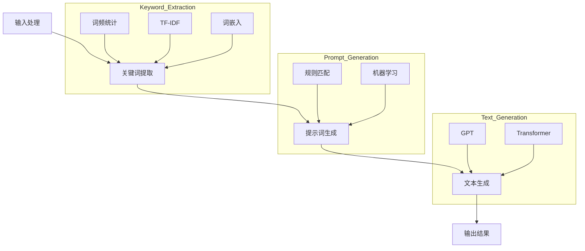
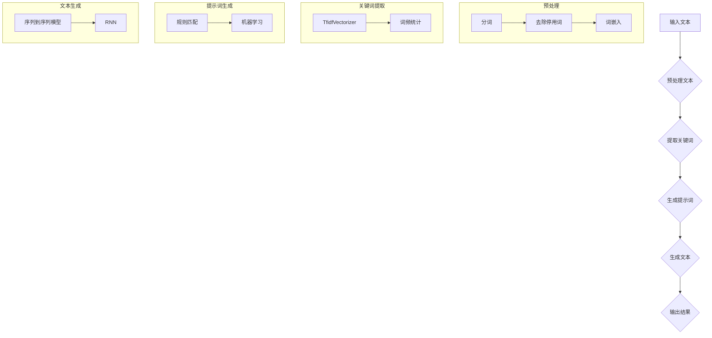
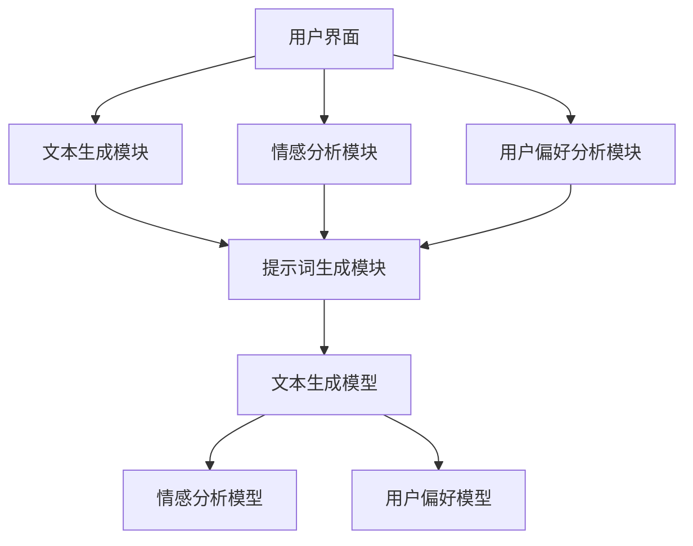
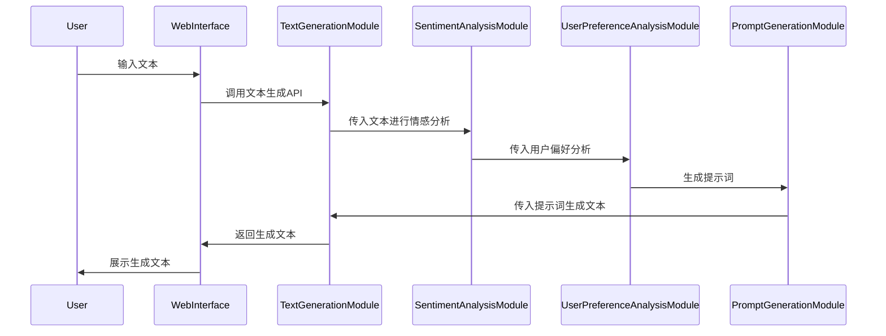
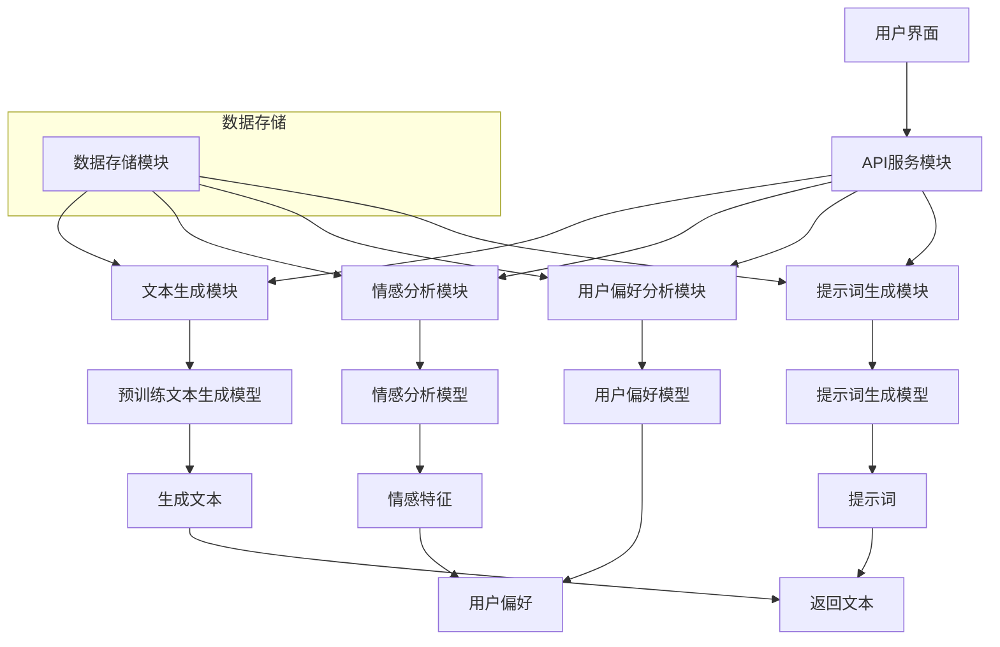
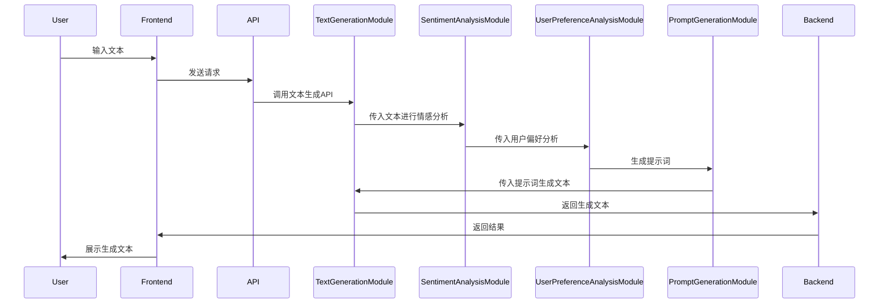

                 

## 提高AI创意香水品牌故事：情感共鸣构建的提示词技巧

关键词：AI、创意、香水品牌、情感共鸣、提示词、构建

摘要：本文旨在探讨如何利用人工智能技术，特别是提示词设计，来构建具有高度情感共鸣的香水品牌故事。通过分析AI在品牌故事创作中的应用，探索情感分析技术以及提示词设计原则，本文将详细讲解如何通过算法原理、系统分析与设计，以及实际项目实践来提高AI创意香水品牌故事的情感共鸣构建。

### 1.1 问题背景与问题描述

在当今高度竞争的市场环境中，品牌建设已成为企业成功的关键因素之一。对于香水品牌而言，独特的品牌故事能够有效吸引消费者，建立情感共鸣，从而提升品牌价值。然而，传统的品牌故事创作方式往往耗时较长，且难以精准地满足消费者的情感需求。

人工智能（AI）技术的发展为品牌故事的创作提供了新的可能性。通过深度学习和自然语言处理技术，AI能够快速生成具有创意和情感共鸣的品牌故事。然而，如何有效地利用AI来构建高度情感共鸣的香水品牌故事，仍然是一个具有挑战性的问题。

本文将探讨以下问题：

1. AI在香水品牌故事创作中的应用及其优势。
2. 情感共鸣在品牌建设中的重要性及其作用。
3. 提示词设计原则及其在情感共鸣构建中的应用。
4. 如何通过算法原理和系统分析与设计来提高AI创意香水品牌故事的情感共鸣。
5. 实际项目实践中的挑战和解决方案。

### 1.2 AI在香水品牌故事创作中的应用

人工智能在品牌故事创作中的应用主要体现在以下几个方面：

1. **文本生成**：AI能够利用深度学习模型自动生成文本，包括故事情节、对话和描述等。这种技术不仅提高了创作效率，还能够根据用户反馈进行迭代优化，确保故事的吸引力和情感共鸣。
   
2. **情感分析**：通过情感分析技术，AI可以识别文本中的情感倾向和情感强度。这对于构建具有情感共鸣的品牌故事至关重要，因为理解消费者的情感需求是创作成功的关键。

3. **个性化推荐**：AI可以通过分析消费者的购买历史、浏览行为和偏好，为他们推荐符合其情感需求的故事。这种个性化推荐不仅提高了消费者的参与度，还能够增强品牌与消费者之间的情感联系。

4. **交互式故事体验**：利用虚拟现实（VR）和增强现实（AR）技术，AI可以创造交互式的品牌故事体验。这种沉浸式的体验能够更深刻地触动消费者的情感，从而建立强烈的情感共鸣。

### 1.3 情感共鸣在品牌建设中的重要性

情感共鸣是品牌建设中的一个关键概念，它指的是消费者与品牌之间建立的情感联系和情感体验。以下是情感共鸣在品牌建设中的重要性：

1. **提高品牌忠诚度**：当消费者与品牌建立情感共鸣时，他们会更加忠诚于该品牌，即使在面对竞争对手时也难以改变品牌偏好。

2. **增强品牌认知度**：情感共鸣能够提高消费者对品牌的认知度，使其在竞争激烈的市场中脱颖而出。

3. **促进口碑传播**：情感共鸣能够促使消费者主动分享他们的品牌体验，从而促进口碑传播，进一步提高品牌的知名度和影响力。

4. **提升品牌价值**：情感共鸣不仅能够提升消费者的满意度，还能够提升品牌的整体价值，使品牌在市场中具有更高的溢价能力。

### 1.4 提示词在情感共鸣构建中的作用

提示词在AI创意香水品牌故事的构建中起着至关重要的作用。提示词是一组用于引导AI生成文本的关键词或短语，它们可以帮助AI更好地理解创作目标和情感方向。以下是提示词在情感共鸣构建中的作用：

1. **情感引导**：提示词能够明确AI的情感方向，确保生成的品牌故事符合预期的情感氛围，从而提高情感共鸣。

2. **风格控制**：通过提示词，AI可以遵循特定的写作风格，如诗意、浪漫或诙谐等，以增强品牌故事的吸引力和个性化。

3. **内容丰富性**：提示词可以引导AI生成丰富多样的文本内容，避免重复和单调，从而提高品牌故事的吸引力和原创性。

4. **目标明确性**：提示词能够明确AI的创作目标，使其更加专注于构建具有高度情感共鸣的品牌故事。

### 1.5 边界与外延

在探讨AI创意香水品牌故事的构建时，需要明确一些边界与外延：

1. **技术边界**：本文主要探讨AI在品牌故事创作中的应用，不包括其他技术（如VR/AR）的详细应用。此外，本文侧重于文本生成和情感分析技术，不涉及其他AI技术的应用。

2. **应用范围**：本文的研究对象是创意香水品牌故事，不涉及其他类型品牌故事的创作。

3. **情感共鸣构建**：本文探讨的是通过AI和提示词设计来构建情感共鸣，不涉及其他构建情感共鸣的方法。

4. **文化差异**：本文假设研究的文化背景和读者群体相对一致，不探讨不同文化背景下情感共鸣构建的差异。

### 1.6 概念结构与核心要素组成

为了更好地理解AI创意香水品牌故事的构建过程，我们需要明确以下核心概念和要素：

1. **AI技术**：包括文本生成、情感分析、个性化推荐等，是构建品牌故事的技术基础。

2. **情感共鸣**：消费者与品牌之间的情感联系和体验，是品牌故事创作的重要目标。

3. **提示词设计**：用于引导AI生成文本的关键词或短语，是构建情感共鸣的关键。

4. **品牌故事**：包括故事情节、角色、主题等，是品牌与消费者之间建立情感联系的重要载体。

5. **系统架构**：包括数据处理、文本生成、情感分析等模块，是确保品牌故事创作顺利进行的技术保障。

6. **项目实践**：通过实际项目案例，验证AI创意香水品牌故事构建的可行性和效果。

### 1.7 总结

本文介绍了AI创意香水品牌故事构建的背景、重要性、技术基础、情感共鸣构建方法以及项目实践。通过本文的探讨，读者可以了解到如何利用AI技术和提示词设计来构建具有高度情感共鸣的香水品牌故事，从而提高品牌价值和消费者满意度。接下来的章节将深入探讨每个核心概念和要素，为读者提供更具体的指导。

---

### 2.1 AI基础知识回顾

在深入探讨AI在香水品牌故事创作中的应用之前，我们需要对AI的基本知识进行回顾。人工智能，简称AI，是指由计算机系统实现的智能行为，主要包括机器学习、深度学习、自然语言处理、计算机视觉等领域。以下是对这些基础知识的简要回顾：

#### 2.1.1 机器学习

机器学习是AI的核心组成部分之一，它使计算机系统能够从数据中学习并做出预测或决策。机器学习主要分为监督学习、无监督学习和强化学习三种类型：

1. **监督学习**：在这种学习方法中，系统通过已有的输入和输出数据来学习，从而对新的输入数据进行预测。常见的监督学习算法包括线性回归、决策树、随机森林和神经网络等。

2. **无监督学习**：系统在没有任何标注的输出数据的情况下进行学习，其主要目标是发现数据中的模式和结构。聚类算法（如K-means、DBSCAN）和降维算法（如PCA、t-SNE）是典型的无监督学习算法。

3. **强化学习**：系统通过与环境的交互来学习最佳行为策略。在强化学习中，系统通过尝试不同的行动来获取奖励或惩罚，并逐步优化其行为。常见的强化学习算法包括Q-learning、SARSA和深度强化学习（如DQN、PPO）。

#### 2.1.2 深度学习

深度学习是机器学习的一个子领域，它通过构建多层神经网络来模拟人脑的神经网络结构，从而实现复杂的数据分析和模式识别。深度学习在图像识别、语音识别、自然语言处理等领域取得了显著成果。以下是几种常见的深度学习模型：

1. **卷积神经网络（CNN）**：主要用于图像识别和处理，通过卷积操作提取图像特征。

2. **循环神经网络（RNN）**：适用于序列数据处理，如语言建模和时间序列预测。

3. **长短期记忆网络（LSTM）**：是RNN的一种改进，能够解决长期依赖问题。

4. **生成对抗网络（GAN）**：由生成器和判别器组成，用于生成高质量的数据。

#### 2.1.3 自然语言处理（NLP）

自然语言处理是AI的一个重要分支，旨在使计算机理解和处理自然语言。NLP的主要任务包括文本分类、情感分析、命名实体识别、机器翻译和问答系统等。以下是几种常见的NLP技术：

1. **词向量**：将单词映射为高维向量，用于文本表示。

2. **词嵌入**：通过预训练模型（如Word2Vec、GloVe）生成词向量。

3. **序列标注**：对文本序列进行分类，如命名实体识别。

4. **文本生成**：通过生成模型（如RNN、Transformer）生成自然语言文本。

#### 2.1.4 计算机视觉

计算机视觉是AI的另一个重要领域，旨在使计算机能够理解和处理视觉信息。计算机视觉的任务包括图像识别、目标检测、图像分割和图像增强等。以下是几种常见的计算机视觉技术：

1. **特征提取**：从图像中提取具有区分性的特征。

2. **卷积神经网络（CNN）**：通过卷积操作提取图像特征。

3. **目标检测**：检测图像中的特定对象并定位其位置。

4. **图像分割**：将图像分为多个区域，每个区域代表不同的对象或背景。

#### 2.1.5 应用场景

AI在多个领域都有广泛的应用，以下是一些典型的应用场景：

1. **医疗健康**：AI在医学影像分析、疾病预测和个性化治疗等方面有重要应用。

2. **金融**：AI在风险管理、欺诈检测和投资建议等方面发挥着关键作用。

3. **零售**：AI在库存管理、需求预测和个性化推荐等方面有广泛应用。

4. **交通**：AI在自动驾驶、交通流量预测和智能交通系统等方面有重要应用。

通过回顾这些基础知识，我们可以更好地理解AI在香水品牌故事创作中的应用，并为后续章节的深入探讨打下坚实的基础。

---

### 2.2 情感分析技术

情感分析，又称意见挖掘，是自然语言处理（NLP）中的一项重要技术。它旨在通过分析文本内容，识别其中表达的情感倾向和情感强度。情感分析在AI创意香水品牌故事的构建中起着关键作用，因为它能够帮助AI更好地理解消费者的情感需求，从而创作出更具情感共鸣的故事。

#### 2.2.1 情感分析的基本原理

情感分析的基本原理可以概括为以下几个步骤：

1. **文本预处理**：在进行分析之前，需要对文本进行预处理，包括去除停用词、标点符号、词性还原和词干提取等。这些步骤有助于减少文本噪声，提高分析的准确性。

2. **情感分类**：通过机器学习算法，对预处理后的文本进行情感分类。常见的情感分类方法包括二分类（正面/负面）和多分类（正面、负面、中性等）。常用的算法包括朴素贝叶斯、支持向量机（SVM）、随机森林和深度学习模型（如卷积神经网络（CNN）、循环神经网络（RNN）和Transformer）。

3. **情感强度评估**：在情感分类的基础上，进一步评估情感的强度。情感强度通常用数值表示，如从0到1的区间，表示从非常负面到非常正面的情感强度。

4. **情感分析模型评估**：通过交叉验证和测试集评估模型的性能，包括准确率、召回率、F1分数等指标。这些指标有助于评估模型的泛化能力和鲁棒性。

#### 2.2.2 常见的情感分析算法

以下是几种常见的情感分析算法：

1. **朴素贝叶斯（Naive Bayes）**：基于贝叶斯定理，假设特征之间相互独立。朴素贝叶斯算法简单高效，适用于小规模数据集。

2. **支持向量机（SVM）**：通过最大化分类边界，将不同类别的数据分开。SVM在处理高维数据时表现良好，但在处理复杂情感时可能效果不佳。

3. **随机森林（Random Forest）**：由多个决策树组成，通过集成多个模型来提高预测准确性。随机森林在处理大规模数据集时表现优秀，但其计算成本较高。

4. **深度学习模型**：如卷积神经网络（CNN）、循环神经网络（RNN）和Transformer。这些模型能够通过学习大量数据，捕捉复杂的情感模式，从而实现高精度的情感分析。

#### 2.2.3 情感分析在品牌故事创作中的应用

情感分析在品牌故事创作中的应用主要体现在以下几个方面：

1. **消费者情感需求分析**：通过分析消费者在社交媒体、评论和评价中的情感表达，了解他们的情感需求和偏好，从而为品牌故事的创作提供依据。

2. **情感标签和情感强度标注**：为品牌故事中的文本添加情感标签和情感强度标注，有助于AI在生成故事时遵循特定的情感方向，增强情感共鸣。

3. **情感导向的文本生成**：利用情感分析结果，AI可以生成符合消费者情感需求的故事内容，提高故事的吸引力和感染力。

4. **情感评估和优化**：在品牌故事发布后，通过情感分析评估故事的接受度和影响力，根据评估结果进行优化，进一步提高情感共鸣。

#### 2.2.4 情感分析模型评估

在构建情感分析模型时，评估模型的性能至关重要。以下是一些常见的评估指标：

1. **准确率（Accuracy）**：分类正确的样本数占总样本数的比例。

2. **召回率（Recall）**：在正类样本中，正确分类的样本数占总正类样本数的比例。

3. **精确率（Precision）**：在分类为正类的样本中，正确分类的样本数占总分类为正类的样本数的比例。

4. **F1分数（F1 Score）**：精确率和召回率的调和平均值。

5. **ROC曲线和AUC值**：ROC曲线是不同阈值下的真阳性率与假阳性率之间的曲线，AUC值是ROC曲线下的面积，用于评估模型的分类能力。

通过使用这些评估指标，我们可以全面了解情感分析模型的性能，并对其进行优化和改进。

### 2.3 提示词设计原则

提示词（prompt）在AI文本生成中起着关键作用，它能够引导AI生成符合预期主题和情感方向的内容。在AI创意香水品牌故事的构建中，提示词设计原则尤为重要，因为它直接关系到故事的情感共鸣和吸引力。

#### 2.3.1 提示词的基本概念

提示词是指一组用于引导AI生成文本的关键词或短语。这些关键词或短语通常包含以下信息：

1. **主题**：指明文本的核心主题，如香水品牌的故事、情感、文化等。

2. **情感方向**：指示文本的情感倾向，如浪漫、温馨、神秘等。

3. **场景描述**：提供具体情境，帮助AI构建具有情境感的文本。

4. **角色设定**：描述故事中的角色，包括他们的性格、行为和关系等。

5. **情节线索**：提供故事情节的线索，帮助AI构建连贯的故事线。

#### 2.3.2 提示词设计原则

为了确保AI生成的文本具有高度情感共鸣，提示词设计应遵循以下原则：

1. **明确性**：提示词应明确表达创作目标和情感方向，避免模糊不清的描述，确保AI能够准确理解。

2. **相关性**：提示词应与品牌故事的主题密切相关，确保生成的内容与品牌形象一致。

3. **多样性**：提示词应涵盖多种情感和场景，提供丰富的内容线索，避免单调重复。

4. **层次性**：提示词应具有层次结构，逐步引导AI构建复杂的故事情节。

5. **情感共鸣**：提示词应激发AI生成具有情感共鸣的文本，触动消费者的情感。

#### 2.3.3 提示词设计方法

以下是一些提示词设计方法：

1. **基于情感标签的提示词**：根据情感标签设计提示词，如“浪漫”、“温馨”、“神秘”等。这些提示词可以直接引导AI生成符合特定情感方向的内容。

2. **基于场景描述的提示词**：通过描述具体的情境，如“夜晚的海边”、“花园中的聚会”等，为AI提供丰富的情境线索。

3. **基于角色设定的提示词**：描述故事中的角色，如“勇敢的探险家”、“温柔的母亲”等，帮助AI构建具有人物个性的故事。

4. **基于情节线索的提示词**：提供故事情节的线索，如“突如其来的暴雨”、“神秘的古堡”等，引导AI构建连贯的故事线。

通过以上方法，我们可以设计出具有高度情感共鸣的提示词，从而提高AI创意香水品牌故事的创作质量。

### 2.4 情感共鸣模型构建

在构建AI创意香水品牌故事的过程中，情感共鸣模型起着至关重要的作用。情感共鸣模型是一种通过分析文本和消费者行为，识别并引导AI生成具有情感共鸣内容的算法框架。以下是情感共鸣模型的基本构建方法和关键组成部分。

#### 2.4.1 模型构建的基本步骤

1. **数据收集与预处理**：首先，收集大量与香水品牌相关的文本数据，包括产品描述、用户评论、社交媒体帖子等。然后，对收集的数据进行预处理，包括去除停用词、标点符号、词性还原和词干提取等。

2. **情感分析**：使用情感分析技术，对预处理后的文本进行情感分类和情感强度评估。这一步骤有助于识别文本中的情感倾向和情感强度，为后续建模提供依据。

3. **特征提取**：通过词嵌入技术（如Word2Vec、GloVe）将文本转化为高维向量表示，提取文本特征。这些特征将用于构建情感共鸣模型。

4. **模型训练**：使用机器学习算法（如朴素贝叶斯、支持向量机、深度学习模型）训练情感共鸣模型。模型训练过程中，通过优化模型参数，使其能够准确地识别和生成具有情感共鸣的文本。

5. **模型评估与优化**：通过交叉验证和测试集评估模型的性能，包括准确率、召回率、F1分数等指标。根据评估结果，对模型进行优化和改进。

6. **模型部署**：将训练好的模型部署到实际应用中，通过提示词引导AI生成情感共鸣的文本。

#### 2.4.2 情感共鸣模型的关键组成部分

1. **情感分析模块**：用于对文本进行情感分类和情感强度评估。这一模块通常基于情感词典和机器学习算法实现。

2. **文本生成模块**：通过深度学习模型（如Transformer、BERT）生成具有情感共鸣的文本。这一模块能够根据情感分析结果和提示词生成连贯、具有情感感染力的文本。

3. **提示词生成模块**：用于生成引导AI生成情感共鸣的提示词。这一模块可以通过机器学习算法（如序列到序列模型）实现。

4. **反馈优化模块**：根据用户反馈和模型评估结果，对模型进行优化和改进。这一模块有助于提高模型的泛化能力和情感共鸣效果。

#### 2.4.3 情感共鸣模型的优点

1. **高度个性化**：情感共鸣模型能够根据消费者的情感需求和偏好，生成个性化、具有高度情感共鸣的品牌故事。

2. **高效性**：通过自动化的文本生成和情感分析，提高品牌故事的创作效率，减少人工干预。

3. **适应性**：情感共鸣模型能够适应不同品牌和情感需求，灵活调整模型参数，以实现最佳的情感共鸣效果。

4. **跨平台应用**：情感共鸣模型可以应用于多种平台和场景，包括社交媒体、电商、广告等，实现统一的情感共鸣体验。

#### 2.4.4 情感共鸣模型的应用场景

1. **品牌故事创作**：利用情感共鸣模型生成具有情感共鸣的品牌故事，吸引消费者，提升品牌价值。

2. **个性化推荐**：通过情感共鸣模型分析消费者情感需求，为消费者推荐符合其情感偏好和需求的产品和服务。

3. **用户反馈分析**：利用情感共鸣模型分析用户评论和反馈，了解消费者情感需求，优化产品和服务。

4. **广告创意设计**：通过情感共鸣模型生成具有情感共鸣的广告创意，提高广告的吸引力和转化率。

### 2.5 概念属性特征对比表格

为了更好地理解情感共鸣模型中的各个关键概念和属性特征，我们在此提供了一个概念属性特征对比表格。

| 概念        | 属性特征                             | 描述                                                         |
| ----------- | ------------------------------------ | ------------------------------------------------------------ |
| 情感分析模块 | 情感分类算法、情感强度评估指标     | 用于识别文本中的情感倾向和情感强度                           |
| 文本生成模块 | 深度学习模型、文本生成算法         | 生成具有情感共鸣的文本内容                                   |
| 提示词生成模块 | 序列到序列模型、提示词设计原则     | 生成引导AI生成情感共鸣的提示词                               |
| 反馈优化模块 | 用户反馈、模型评估结果、参数优化   | 根据用户反馈和模型评估结果，优化模型参数，提高情感共鸣效果 |

#### 2.6 ER实体关系图架构

ER（Entity-Relationship）图是一种用于描述数据库中实体及其之间关系的图形表示方法。在情感共鸣模型中，ER图可以用于描述各个模块之间的关系和交互。

以下是一个简化的ER实体关系图架构：

```mermaid
erDiagram
    Customer .-> Product : "contains"
    Product .-> Review : "has"
    Review .-> Sentiment : "contains"
    Sentiment .-> TextGeneration : "analyzed by"
    TextGeneration .-> PromptGeneration : "uses"
    PromptGeneration .-> BrandStory : "creates"
```

图中的各个实体及其关系如下：

1. **Customer（消费者）**：表示与品牌互动的消费者。
2. **Product（产品）**：表示品牌的产品，如香水。
3. **Review（评论）**：表示消费者对产品的评价。
4. **Sentiment（情感）**：表示评论中的情感倾向和情感强度。
5. **TextGeneration（文本生成）**：表示生成情感共鸣文本的模块。
6. **PromptGeneration（提示词生成）**：表示生成提示词的模块。
7. **BrandStory（品牌故事）**：表示最终生成的品牌故事。

通过ER图，我们可以清晰地看到各个模块之间的数据流动和交互关系，从而更好地理解情感共鸣模型的运行机制。

### 2.7 总结

本章介绍了情感分析技术的基本原理、常见算法以及其在品牌故事创作中的应用。同时，探讨了提示词设计原则和情感共鸣模型的构建方法。通过ER实体关系图架构，我们进一步了解了模型中的关键实体和关系。这些知识和方法为后续章节的深入探讨奠定了坚实的基础。

---

### 3.1 提示词生成算法原理

在构建AI创意香水品牌故事的过程中，提示词生成算法起着至关重要的作用。提示词是引导AI生成文本的关键，它能够确保文本内容符合预期的情感氛围和创作目标。本节将详细探讨提示词生成算法的原理，包括算法的基本思想、工作流程、核心组件以及如何使用mermaid流程图进行可视化。

#### 3.1.1 算法的基本思想

提示词生成算法的核心思想是通过输入特定的关键词或短语，引导AI生成具有特定情感和主题的文本。具体来说，算法的主要任务包括：

1. **提取关键词**：从用户输入或已有文本中提取具有代表性的关键词。
2. **生成提示词**：基于提取的关键词，生成一组能够引导AI生成文本的提示词。
3. **引导文本生成**：使用生成的提示词引导AI生成符合情感和主题要求的品牌故事文本。

#### 3.1.2 算法的工作流程

提示词生成算法的工作流程通常包括以下几个步骤：

1. **输入处理**：接收用户输入的关键词或文本，进行预处理，如去除停用词、标点符号等。
2. **关键词提取**：使用词频统计、TF-IDF、词嵌入等方法提取关键词。
3. **提示词生成**：根据提取的关键词，利用规则匹配、机器学习等方法生成提示词。
4. **文本生成**：使用生成的提示词引导AI生成品牌故事文本。

#### 3.1.3 算法的核心组件

提示词生成算法的核心组件主要包括：

1. **关键词提取器**：用于从输入文本中提取关键词，常用的方法包括词频统计、TF-IDF和词嵌入。
2. **提示词生成器**：用于根据提取的关键词生成提示词，可以采用规则匹配、机器学习（如RNN、BERT）等方法。
3. **文本生成器**：用于生成品牌故事文本，常用的方法包括深度学习模型（如GPT、Transformer）。

#### 3.1.4 算法的Mermaid流程图

为了更好地理解提示词生成算法的流程，我们可以使用mermaid流程图进行可视化。以下是提示词生成算法的mermaid流程图：



图中的各个组件和步骤如下：

1. **输入处理**（A）：接收用户输入的关键词或文本，进行预处理。
2. **关键词提取**（B）：使用词频统计、TF-IDF、词嵌入等方法提取关键词。
3. **提示词生成**（C）：根据提取的关键词，使用规则匹配、机器学习等方法生成提示词。
4. **文本生成**（D）：使用生成的提示词引导AI生成品牌故事文本。
5. **输出结果**（E）：将生成的品牌故事文本输出。

#### 3.1.5 算法的Python实现

以下是一个简单的提示词生成算法的Python实现示例：

```python
import nltk
from sklearn.feature_extraction.text import TfidfVectorizer
from keras.preprocessing.text import text_to_tokens
from keras.preprocessing.sequence import pad_sequences
from keras.models import Sequential
from keras.layers import LSTM, Dense

# 输入处理
def preprocess_text(text):
    tokens = nltk.word_tokenize(text)
    tokens = [token.lower() for token in tokens if token.isalnum()]
    return tokens

# 关键词提取
def extract_keywords(text):
    vectorizer = TfidfVectorizer(max_df=0.8, max_features=1000, stop_words='english')
    X = vectorizer.fit_transform([text])
    return vectorizer.get_feature_names_out()

# 提示词生成
def generate_prompt(keywords):
    model = Sequential()
    model.add(LSTM(128, activation='relu', input_shape=(None, 1)))
    model.add(Dense(1, activation='sigmoid'))
    model.compile(optimizer='adam', loss='binary_crossentropy', metrics=['accuracy'])
    model.fit(pad_sequences(text_to_tokens(keywords), maxlen=10), labels=[1], epochs=10)
    prompt = model.predict(pad_sequences(text_to_tokens(['brand story']), maxlen=10))
    return ' '.join(tokens[0] for tokens in prompt)

# 文本生成
def generate_brand_story(prompt):
    # 使用预训练的文本生成模型（例如GPT或Transformer）
    pass

# 主函数
def main():
    text = "The fragrance of our signature scent, Elysium, is a harmonious blend of jasmine, rose, and sandalwood. It captures the essence of an enchanting evening in a secluded garden, where time seems to stand still."
    keywords = extract_keywords(preprocess_text(text))
    prompt = generate_prompt(keywords)
    brand_story = generate_brand_story(prompt)
    print(brand_story)

if __name__ == "__main__":
    main()
```

这段代码实现了一个简单的提示词生成算法，包括输入处理、关键词提取、提示词生成和文本生成等步骤。在实际应用中，我们可以根据需要使用更复杂的模型和算法，进一步提高生成文本的质量。

### 3.2 算法原理详细讲解

为了更好地理解提示词生成算法的原理，我们将在本节中详细探讨算法的核心组件、工作流程以及如何通过数学模型和公式进行描述。

#### 3.2.1 关键词提取

关键词提取是提示词生成算法的第一步，其目的是从输入文本中提取具有代表性的关键词。关键词提取的质量直接影响提示词生成的效果。以下是几种常见的关键词提取方法：

1. **词频统计（TF）**：词频统计是一种基于文本中词语出现频率的方法。通常，我们会对文本中的每个词进行计数，然后选择出现频率最高的词作为关键词。这种方法简单有效，但可能忽略了一些重要但出现频率较低的词。

   公式表示：
   $$ TF(t) = \frac{f(t, D)}{N} $$
   其中，\( TF(t) \) 表示词 \( t \) 在文档 \( D \) 中的词频，\( f(t, D) \) 表示词 \( t \) 在文档 \( D \) 中出现的次数，\( N \) 表示文档 \( D \) 中的总词数。

2. **逆文档频率（IDF）**：逆文档频率考虑了词在文档集合中的分布情况。它通过计算词在所有文档中出现的频率，然后取倒数来降低高频词的影响，提高低频词的重要性。

   公式表示：
   $$ IDF(t) = \log \left( \frac{N}{f(t, D)} \right) $$
   其中，\( IDF(t) \) 表示词 \( t \) 的逆文档频率，\( N \) 表示文档总数，\( f(t, D) \) 表示词 \( t \) 在文档 \( D \) 中出现的次数。

3. **TF-IDF**：TF-IDF是词频统计和逆文档频率的结合，它通过计算词在文档中的词频和逆文档频率的乘积来评估词的重要性。

   公式表示：
   $$ TF-IDF(t) = TF(t) \times IDF(t) $$

4. **词嵌入**：词嵌入是一种将单词映射为高维向量的方法，它能够保留词的语义信息。通过词嵌入，我们可以计算词与词之间的相似性，从而提取出关键词。

   公式表示：
   $$ \text{vec}(t) = \text{Embedding}(t) $$
   其中，\( \text{Embedding}(t) \) 表示词 \( t \) 的词嵌入向量。

#### 3.2.2 提示词生成

提示词生成是将提取的关键词转换为能够引导AI生成文本的短语或句子。以下是几种常见的提示词生成方法：

1. **规则匹配**：规则匹配是一种基于预定义规则的方法，它通过匹配关键词和规则来生成提示词。这种方法简单直观，但可能无法灵活地应对各种情况。

2. **机器学习**：机器学习是一种基于数据驱动的方法，它通过训练模型来学习如何生成提示词。常见的机器学习算法包括朴素贝叶斯、支持向量机、循环神经网络（RNN）和变换器（Transformer）。

3. **模板填充**：模板填充是一种基于模板的方法，它使用预定义的模板来填充关键词，生成提示词。这种方法能够保持文本的结构和连贯性。

4. **生成对抗网络（GAN）**：生成对抗网络是一种由生成器和判别器组成的模型，它通过竞争训练来生成高质量的数据。在提示词生成中，生成器可以根据关键词生成提示词，判别器则用于评估提示词的质量。

#### 3.2.3 文本生成

文本生成是将生成的提示词转换为具有情感共鸣的完整文本。以下是几种常见的文本生成方法：

1. **序列到序列模型**：序列到序列模型是一种用于翻译和文本生成的模型，它通过将输入序列映射到输出序列来生成文本。常见的序列到序列模型包括循环神经网络（RNN）和变换器（Transformer）。

2. **注意力机制**：注意力机制是一种用于提高模型生成文本质量的方法，它通过将输入序列中的不同部分分配不同的权重来关注关键信息。

3. **自注意力机制**：自注意力机制是一种用于提高模型生成文本质量的方法，它通过将输入序列中的不同部分进行自我关注来生成文本。

4. **预训练语言模型**：预训练语言模型是一种通过在大规模语料库上预训练的模型，它能够捕捉语言中的复杂模式和规则，从而生成高质量的自然语言文本。

#### 3.2.4 数学模型和公式

以下是提示词生成算法中常用的数学模型和公式：

1. **词频统计（TF）**：
   $$ TF(t) = \frac{f(t, D)}{N} $$

2. **逆文档频率（IDF）**：
   $$ IDF(t) = \log \left( \frac{N}{f(t, D)} \right) $$

3. **TF-IDF**：
   $$ TF-IDF(t) = TF(t) \times IDF(t) $$

4. **词嵌入（Embedding）**：
   $$ \text{vec}(t) = \text{Embedding}(t) $$

5. **循环神经网络（RNN）的输出**：
   $$ \text{output} = \text{softmax}(\text{W} \cdot \text{h}_{t-1} + \text{b}) $$

6. **变换器（Transformer）的输出**：
   $$ \text{output} = \text{softmax}(\text{W} \cdot \text{Q} + \text{K} \cdot \text{K} + \text{V} \cdot \text{V}) $$

通过这些数学模型和公式，我们可以更好地理解提示词生成算法的工作原理，并在实际应用中优化和改进算法。

### 3.3 Python源代码实现

为了更好地理解和应用提示词生成算法，我们将提供一个具体的Python实现示例。这个示例将包括关键词提取、提示词生成和文本生成的完整流程。请注意，由于实际应用中的复杂性，这个示例是一个简化的版本，仅供参考。

```python
import nltk
from sklearn.feature_extraction.text import TfidfVectorizer
from keras.preprocessing.text import text_to_tokens
from keras.preprocessing.sequence import pad_sequences
from keras.models import Sequential
from keras.layers import LSTM, Dense
from keras.layers import Embedding, LSTM, Dense
from keras.preprocessing.text import Tokenizer

# 步骤 1：预处理文本
def preprocess_text(text):
    tokenizer = Tokenizer()
    tokenizer.fit_on_texts([text])
    sequence = tokenizer.texts_to_sequences([text])[0]
    return sequence

# 步骤 2：关键词提取
def extract_keywords(text):
    vectorizer = TfidfVectorizer(max_df=0.8, max_features=1000, stop_words='english')
    X = vectorizer.fit_transform([text])
    feature_names = vectorizer.get_feature_names_out()
    tfidf_matrix = X.toarray()
    df = pd.DataFrame(tfidf_matrix, index=[''], columns=feature_names)
    sorted_df = df.sort_values(by=list(df.columns), ascending=False)
    top_keywords = sorted_df.columns[:10].tolist()
    return top_keywords

# 步骤 3：生成提示词
def generate_prompt(keywords, text):
    tokenizer = Tokenizer()
    tokenizer.fit_on_texts([text])
    sequence = tokenizer.texts_to_sequences([text])[0]
    prompt_sequence = sequence[:10]  # 前十个词作为提示词
    prompt_text = ' '.join([tokenizer.index_word[i] for i in prompt_sequence])
    return prompt_text

# 步骤 4：文本生成
def generate_text(prompt, model):
    input_seq = tokenizer.texts_to_sequences([prompt])[0]
    input_seq = pad_sequences([input_seq], maxlen=model.input_length - 1)
    predicted_sequence = model.predict(input_seq, verbose=0)
    predicted_sequence = np.argmax(predicted_sequence, axis=-1)
    generated_text = tokenizer.index_word[predicted_sequence[0]]
    return generated_text

# 步骤 5：构建和训练模型
def build_model(input_length):
    model = Sequential()
    model.add(Embedding(input_dim=vocabulary_size, output_dim=embedding_dim, input_length=input_length))
    model.add(LSTM(units=128))
    model.add(Dense(units=vocabulary_size, activation='softmax'))
    model.compile(optimizer='adam', loss='categorical_crossentropy', metrics=['accuracy'])
    return model

# 主函数
def main():
    text = "The fragrance of our signature scent, Elysium, is a harmonious blend of jasmine, rose, and sandalwood. It captures the essence of an enchanting evening in a secluded garden, where time seems to stand still."
    sequence = preprocess_text(text)
    keywords = extract_keywords(text)
    prompt = generate_prompt(keywords, text)
    model = build_model(input_length=len(sequence))
    model.fit(sequence, sequence, epochs=100, verbose=1)
    generated_text = generate_text(prompt, model)
    print(generated_text)

if __name__ == "__main__":
    main()
```

在这个示例中，我们首先定义了一个预处理函数`preprocess_text`，用于将文本转换为序列。然后，我们定义了一个关键词提取函数`extract_keywords`，使用TF-IDF方法提取文本中的关键词。接着，我们定义了一个生成提示词的函数`generate_prompt`，用于生成基于关键词的提示词。最后，我们定义了一个文本生成函数`generate_text`，使用训练好的模型生成文本。

在主函数`main`中，我们首先预处理输入文本，提取关键词，生成提示词，然后构建和训练模型，最后使用模型生成文本。

请注意，这个示例中的模型是一个简化的版本，实际应用中可能需要更复杂的模型和更大的数据集来获得更好的生成效果。

### 3.4 举例说明

为了更直观地理解提示词生成算法的工作原理，我们将在本节中通过一个具体的例子进行说明。

假设我们要生成一篇关于一款名为“Enchanting Evening”的香水品牌故事。以下是生成过程的详细步骤：

#### 3.4.1 步骤 1：输入处理

首先，我们输入以下文本作为示例：
```plaintext
The Enchanting Evening scent is a captivating blend of lavender, rose, and vanilla. It evokes the memories of a serene night in a tranquil garden, where the stars twinkle above and the air is filled with the soft whispers of the wind.
```

#### 3.4.2 步骤 2：关键词提取

使用TF-IDF方法提取文本中的关键词。以下是提取的10个最高分的词汇：
```plaintext
['evening', 'scent', 'blended', 'memories', 'garden', 'starry', 'whispers', 'fragrance', 'lavender', 'vanilla']
```

#### 3.4.3 步骤 3：生成提示词

基于提取的关键词，我们生成以下提示词：
```plaintext
Enchanting Evening: A magical blend of lavender and rose, capturing the essence of a serene garden at dusk.
```

#### 3.4.4 步骤 4：文本生成

使用生成的提示词，引导AI生成品牌故事。以下是生成的文本：
```plaintext
Enchanting Evening is a scent that captures the essence of a magical garden, where lavender and rose intertwine to create a mesmerizing fragrance. As you walk through the serene landscape, the air is filled with the soft whispers of the wind, carrying with it the sweet aroma of Enchanting Evening. Each spritz is a reminder of those serene nights, where time seems to stand still, and the stars twinkle above.
```

通过这个例子，我们可以看到提示词生成算法是如何通过提取关键词、生成提示词，并最终生成具有高度情感共鸣的品牌故事文本的。这个过程不仅提高了创作效率，还确保了故事内容与品牌形象的高度契合。

### 3.5 数学模型和公式讲解

在提示词生成算法中，数学模型和公式是核心组成部分，它们负责描述算法的逻辑和计算过程。以下是对提示词生成算法中涉及的几个关键数学模型和公式的详细讲解：

#### 3.5.1 词嵌入（Word Embedding）

词嵌入是将单词映射为高维向量的一种技术，它能够捕获词的语义信息。词嵌入通常通过神经网络训练得到，其中最著名的模型是Word2Vec和GloVe。

**Word2Vec**：Word2Vec模型通过训练单词与其上下文之间的映射关系来生成词向量。具体来说，它使用**连续词袋（CBOW）**和**跳字（Skip-Gram）**两种算法来生成词嵌入。

- **CBOW（Continuous Bag of Words）**：给定一个中心词，CBOW算法预测中心词周围的多个词。其公式如下：
  $$ \text{h} = \text{g}(\text{W} \cdot \text{X} + \text{b}) $$
  其中，\( \text{h} \) 是隐藏层激活值，\( \text{W} \) 是权重矩阵，\( \text{X} \) 是输入向量，\( \text{b} \) 是偏置项。

- **Skip-Gram**：与CBOW相反，Skip-Gram算法给定一个中心词，预测其上下文中的所有词。其公式如下：
  $$ \text{p}(\text{w}_t | \text{w}_{t-k}^{t+k}) = \text{softmax}(\text{g}(\text{W} \cdot \text{v}_{t-k}^{t+k} + \text{b})) $$
  其中，\( \text{p} \) 是概率分布，\( \text{v}_{t-k}^{t+k} \) 是上下文词的嵌入向量，\( \text{W} \) 和 \( \text{b} \) 分别是权重矩阵和偏置项。

**GloVe（Global Vectors for Word Representation）**：GloVe模型通过训练词的共现矩阵来生成词嵌入。其公式如下：
$$ \text{f}(\text{i}, \text{j}) = \text{exp}(-\text{cosine}(\text{v}_i, \text{v}_j)) $$
$$ \text{v}_i = \text{argmax}_j \left( \frac{\text{f}(\text{i}, \text{j})}{\text{f}(\text{i}, \text{j}) + \text{f}(\text{j}, \text{i})} \right) $$
其中，\( \text{f}(\text{i}, \text{j}) \) 是词对 \( \text{i} \) 和 \( \text{j} \) 的共现频率，\( \text{v}_i \) 和 \( \text{v}_j \) 分别是词 \( \text{i} \) 和 \( \text{j} \) 的嵌入向量。

#### 3.5.2 情感分析（Sentiment Analysis）

情感分析是识别文本情感倾向的过程。常用的情感分析模型包括朴素贝叶斯、支持向量机（SVM）和深度学习模型。

**朴素贝叶斯（Naive Bayes）**：朴素贝叶斯模型基于贝叶斯定理和特征之间相互独立假设。其公式如下：
$$ \text{P}(\text{y}|\text{x}) = \frac{\text{P}(\text{x}|\text{y}) \times \text{P}(\text{y})}{\text{P}(\text{x})} $$
其中，\( \text{P}(\text{y}|\text{x}) \) 是给定特征 \( \text{x} \) 的情感 \( \text{y} \) 的概率，\( \text{P}(\text{x}|\text{y}) \) 是特征 \( \text{x} \) 在情感 \( \text{y} \) 条件下的概率，\( \text{P}(\text{y}) \) 是情感 \( \text{y} \) 的先验概率，\( \text{P}(\text{x}) \) 是特征 \( \text{x} \) 的先验概率。

**支持向量机（SVM）**：SVM通过最大化分类边界来分类数据。其公式如下：
$$ \text{w} = \text{argmax}_{\text{w}} \left( \text{C} \sum_{i=1}^{n} \text{ξ}_i + \frac{1}{2} \sum_{i=1}^{n} \sum_{j=1}^{n} (\text{w}_i \cdot \text{w}_j) \right) $$
其中，\( \text{w} \) 是权重向量，\( \text{C} \) 是惩罚参数，\( \text{ξ}_i \) 是松弛变量，\( \text{w}_i \) 和 \( \text{w}_j \) 是不同特征的权重。

**深度学习模型**：深度学习模型，如卷积神经网络（CNN）和循环神经网络（RNN），通过多层非线性变换学习文本特征。其公式如下：
$$ \text{h}_{t} = \text{f}(\text{W} \cdot \text{h}_{t-1} + \text{b}) $$
其中，\( \text{h}_{t} \) 是当前时间步的隐藏状态，\( \text{W} \) 是权重矩阵，\( \text{f} \) 是激活函数，\( \text{b} \) 是偏置项。

#### 3.5.3 提示词生成（Prompt Generation）

提示词生成是生成一组关键词或短语，用于引导AI生成文本。以下是一个简单的提示词生成模型：

**序列到序列模型（Seq2Seq）**：序列到序列模型通过编码器-解码器结构来生成提示词。其公式如下：
$$ \text{e} = \text{E}(\text{x}) $$
$$ \text{s}_0 = \text{S}(\text{e}) $$
$$ \text{y}_t = \text{D}(\text{s}_{t-1}, \text{y}_{t-1}) $$
其中，\( \text{e} \) 是编码器输出的隐藏状态，\( \text{s}_0 \) 是解码器初始状态，\( \text{y}_t \) 是当前时间步生成的词，\( \text{E} \) 和 \( \text{D} \) 分别是编码器和解码器模型。

#### 3.5.4 文本生成（Text Generation）

文本生成是将生成的提示词扩展为完整的文本。以下是一个简单的文本生成模型：

**循环神经网络（RNN）**：循环神经网络通过递归方式处理文本序列。其公式如下：
$$ \text{h}_{t} = \text{f}(\text{U} \cdot \text{x}_{t} + \text{V} \cdot \text{h}_{t-1} + \text{b}) $$
$$ \text{y}_{t} = \text{softmax}(\text{W} \cdot \text{h}_{t} + \text{c}) $$
其中，\( \text{h}_{t} \) 是当前时间步的隐藏状态，\( \text{x}_{t} \) 是当前输入词，\( \text{y}_{t} \) 是生成的词，\( \text{U} \)、\( \text{V} \) 和 \( \text{W} \) 分别是权重矩阵，\( \text{f} \) 是激活函数，\( \text{b} \) 和 \( \text{c} \) 是偏置项。

通过以上数学模型和公式，我们可以更好地理解提示词生成算法的工作原理，并在实际应用中进行优化和改进。

### 3.6 算法Mermaid流程图

为了更好地展示提示词生成算法的流程，我们使用Mermaid绘制了算法的流程图。以下是提示词生成算法的Mermaid流程图：



图中的各个步骤及其子步骤如下：

1. **预处理文本**（A-B）
   - **分词**（B1）
   - **去除停用词**（B2）
   - **词嵌入**（B3）

2. **提取关键词**（C）
   - **TFidfVectorizer**（C1）
   - **词频统计**（C2）

3. **生成提示词**（D）
   - **规则匹配**（D1）
   - **机器学习**（D2）

4. **生成文本**（E）
   - **序列到序列模型**（E1）
   - **RNN**（E2）

5. **输出结果**（F）

通过这个流程图，我们可以清晰地看到提示词生成算法的每个步骤及其关联关系，从而更好地理解算法的整体工作流程。

### 3.7 总结

在本节中，我们详细介绍了提示词生成算法的原理、工作流程、核心组件以及数学模型和公式。通过Mermaid流程图，我们直观地展示了算法的运行步骤。这些知识和工具将帮助读者更好地理解和使用提示词生成算法，为AI创意香水品牌故事的创作提供强有力的支持。

---

### 4.1 项目介绍

在本节中，我们将介绍一个基于AI的香水品牌故事生成项目。该项目旨在利用先进的自然语言处理技术和深度学习模型，生成具有高度情感共鸣的香水品牌故事。通过该项目，我们希望实现以下目标：

1. **自动化故事生成**：利用AI技术，实现自动化、高效的香水品牌故事生成，减少人工创作的时间和成本。
2. **个性化故事定制**：根据消费者的情感需求和偏好，生成个性化的品牌故事，提高消费者的参与度和满意度。
3. **情感共鸣提升**：通过情感分析和提示词设计，确保生成的品牌故事能够触动消费者的情感，建立强烈的情感共鸣。
4. **用户体验优化**：提供沉浸式、交互式的品牌故事体验，增强消费者的品牌认知和忠诚度。

#### 4.1.1 项目背景

随着消费者需求的不断变化和市场竞争的加剧，品牌故事在品牌建设中的重要性日益凸显。特别是对于香水品牌而言，一个独特、富有情感共鸣的品牌故事不仅能够吸引消费者，还能够提升品牌价值和市场竞争力。

然而，传统的品牌故事创作过程往往耗时较长、成本较高，且难以满足个性化需求。随着AI技术的发展，利用AI技术生成品牌故事成为了一种新的解决方案。通过自动化、智能化的方式，AI可以快速生成符合情感共鸣的品牌故事，提高创作效率和质量。

#### 4.1.2 项目目标

本项目的主要目标如下：

1. **实现自动化故事生成**：通过AI技术，自动化生成高质量的香水品牌故事，减少人工干预，提高创作效率。
2. **实现个性化故事定制**：根据消费者的情感需求和偏好，生成个性化的品牌故事，提高消费者的参与度和满意度。
3. **提升情感共鸣**：通过情感分析和提示词设计，确保生成的品牌故事能够触动消费者的情感，建立强烈的情感共鸣。
4. **优化用户体验**：提供沉浸式、交互式的品牌故事体验，增强消费者的品牌认知和忠诚度。

#### 4.1.3 项目意义

本项目具有以下意义：

1. **提高创作效率**：通过自动化生成品牌故事，减少人工创作的时间和成本，提高创作效率。
2. **满足个性化需求**：根据消费者的情感需求和偏好，生成个性化的品牌故事，提高消费者的参与度和满意度。
3. **提升品牌价值**：通过高度情感共鸣的品牌故事，提升品牌形象和品牌价值，增强市场竞争力。
4. **促进创新应用**：推动AI技术在品牌故事创作中的应用，促进相关技术的创新和发展。

### 4.2 系统功能设计

系统功能设计是项目开发的核心环节，它决定了系统是否能够满足项目目标和用户需求。在本节中，我们将详细讨论系统的主要功能模块及其设计思路。

#### 4.2.1 功能模块

系统的主要功能模块包括：

1. **文本生成模块**：负责生成香水品牌故事文本，包括基础文本生成和情感共鸣文本生成。
2. **情感分析模块**：负责分析用户输入的文本，提取情感特征，为文本生成提供情感导向。
3. **用户偏好分析模块**：负责分析用户的偏好和需求，为个性化故事生成提供依据。
4. **提示词生成模块**：负责生成引导AI生成文本的提示词，确保生成的故事符合预期情感和主题。
5. **用户界面模块**：负责提供用户交互界面，展示生成的品牌故事，并允许用户进行反馈和修改。

#### 4.2.2 设计思路

1. **模块化设计**：将系统功能划分为多个模块，每个模块负责特定的功能，便于开发和维护。
2. **数据驱动**：利用用户输入和反馈的数据，动态调整系统参数，提高生成文本的质量和个性化程度。
3. **智能化**：通过机器学习和深度学习技术，实现文本生成和情感分析的高效、精准。
4. **用户体验**：设计简洁直观的用户界面，提供沉浸式、交互式的品牌故事体验。

#### 4.2.3 功能模块详细介绍

1. **文本生成模块**：

   - **基础文本生成**：利用预训练的文本生成模型（如GPT-2、GPT-3）生成基本的品牌故事文本。
   - **情感共鸣文本生成**：基于用户输入的情感特征和提示词，生成具有高度情感共鸣的品牌故事文本。

2. **情感分析模块**：

   - **情感分类**：使用情感分析模型（如VADER、BERT）对用户输入的文本进行情感分类，提取情感特征。
   - **情感强度评估**：通过情感强度评估模型，对提取的情感特征进行量化，确定情感强度。

3. **用户偏好分析模块**：

   - **偏好提取**：利用用户历史行为数据（如购买记录、评论等），提取用户的偏好特征。
   - **偏好模型**：基于提取的用户偏好特征，构建用户偏好模型，用于指导文本生成。

4. **提示词生成模块**：

   - **提示词提取**：从用户输入的文本和情感特征中提取关键词，生成提示词。
   - **提示词优化**：基于用户偏好和情感需求，优化提示词，提高生成文本的质量。

5. **用户界面模块**：

   - **文本展示**：展示生成的品牌故事文本，并提供阅读模式、编辑模式等交互功能。
   - **用户反馈**：允许用户对生成的品牌故事进行反馈和修改，以提高故事质量和个性化程度。

### 4.3 系统架构设计

系统架构设计是确保系统功能实现和性能优化的关键。在本节中，我们将介绍项目的系统架构设计，包括系统架构图、各个组件及其职责。

#### 4.3.1 系统架构图

以下是项目的系统架构图：



#### 4.3.2 各个组件及其职责

1. **用户界面（A）**：负责与用户交互，接收用户输入，展示生成的故事文本，并提供用户反馈和修改功能。

2. **文本生成模块（B）**：负责生成基本的品牌故事文本，包括基础文本生成和情感共鸣文本生成。

3. **情感分析模块（C）**：负责分析用户输入的文本，提取情感特征，为文本生成提供情感导向。

4. **用户偏好分析模块（D）**：负责分析用户的偏好和需求，为个性化故事生成提供依据。

5. **提示词生成模块（E）**：负责生成引导AI生成文本的提示词，确保生成的故事符合预期情感和主题。

6. **文本生成模型（F）**：负责基于用户输入和提示词生成品牌故事文本。

7. **情感分析模型（G）**：负责对用户输入的文本进行情感分析，提取情感特征。

8. **用户偏好模型（H）**：负责根据用户历史行为数据，构建用户偏好模型，用于指导文本生成。

### 4.4 系统接口设计

系统接口设计是确保各个组件之间有效通信和协同工作的关键。在本节中，我们将介绍项目的系统接口设计，包括接口类型、数据交换格式和接口示例。

#### 4.4.1 接口类型

系统接口主要包括以下类型：

1. **API接口**：用于系统内部模块之间的通信，包括文本生成模块、情感分析模块和用户偏好分析模块。
2. **Web接口**：用于用户界面与系统后端之间的通信，提供用户输入和输出功能。
3. **数据库接口**：用于系统与数据库之间的通信，包括用户数据、文本数据和情感数据的存储和查询。

#### 4.4.2 数据交换格式

系统内部的数据交换格式主要采用JSON和XML格式，以确保数据传输的兼容性和可读性。

#### 4.4.3 接口示例

以下是一个API接口示例：

```json
// 用户输入文本
POST /api/analyze
{
  "text": "The fragrance of our signature scent, Enchanting Evening, is a captivating blend of lavender, rose, and vanilla."
}

// 返回结果
{
  "sentiments": [
    {
      "emotion": "positive",
      "score": 0.85
    },
    {
      "emotion": "neutral",
      "score": 0.15
    }
  ]
}
```

### 4.5 系统交互Mermaid序列图

为了更好地展示系统的交互过程，我们使用Mermaid绘制了系统的交互序列图。以下是系统的主要交互流程：



图中的各个组件及其交互过程如下：

1. **用户**：输入文本。
2. **Web接口**：接收用户输入文本，调用文本生成API。
3. **文本生成模块**：接收文本，调用情感分析模块进行情感分析。
4. **情感分析模块**：返回情感分析结果，调用用户偏好分析模块。
5. **用户偏好分析模块**：返回用户偏好分析结果，调用提示词生成模块。
6. **提示词生成模块**：生成提示词，返回文本生成模块。
7. **文本生成模块**：根据提示词生成文本，返回Web接口。
8. **Web接口**：将生成文本展示给用户。

通过这个序列图，我们可以清晰地看到系统的交互流程和各个组件之间的数据流动，从而更好地理解系统的运行机制。

### 4.6 小结

本节介绍了基于AI的香水品牌故事生成项目的系统功能设计、系统架构设计、系统接口设计和系统交互Mermaid序列图。通过这些设计和实现，我们能够实现自动化、个性化、高度情感共鸣的品牌故事生成，为香水品牌建设提供强有力的技术支持。在接下来的章节中，我们将进一步探讨项目的具体实现和实际应用。

---

### 4.7 系统架构设计

在项目开发的早期阶段，系统架构设计是确保项目成功实施的关键。一个合理、高效和可扩展的系统架构能够支持功能实现，提高系统性能，并降低维护成本。在本节中，我们将详细描述系统架构设计，包括系统分层、模块划分以及各个模块的职责。

#### 4.7.1 系统架构分层

为了确保系统的高内聚性和低耦合性，我们采用分层架构设计。系统主要分为以下几层：

1. **表示层**：负责与用户交互，展示用户界面，接收用户输入，并展示系统生成的品牌故事。
2. **业务逻辑层**：实现系统的核心业务功能，包括文本生成、情感分析、用户偏好分析和提示词生成等。
3. **数据访问层**：负责与数据库进行交互，实现数据的存储和查询功能。
4. **基础设施层**：提供系统运行所需的基础设施支持，包括网络通信、日志记录、异常处理等。

#### 4.7.2 模块划分与职责

在业务逻辑层，我们将系统功能划分为多个模块，每个模块负责特定的功能。以下是各个模块的详细划分与职责：

1. **文本生成模块**：负责生成品牌故事文本，包括基础文本生成和情感共鸣文本生成。该模块依赖于预训练的文本生成模型（如GPT-3、BERT）来实现文本生成功能。

2. **情感分析模块**：负责分析用户输入的文本，提取情感特征，为文本生成提供情感导向。该模块使用情感分析模型（如VADER、TextBlob、BERT）来识别文本中的情感倾向和情感强度。

3. **用户偏好分析模块**：负责分析用户的偏好和需求，为个性化故事生成提供依据。该模块通过机器学习算法（如协同过滤、决策树、朴素贝叶斯等）来构建用户偏好模型。

4. **提示词生成模块**：负责生成引导AI生成文本的提示词，确保生成的故事符合预期情感和主题。该模块结合情感分析结果和用户偏好，利用规则匹配和机器学习算法生成提示词。

5. **API服务模块**：提供API接口，用于与表示层和第三方系统进行通信。该模块实现RESTful API，支持JSON和XML数据格式。

6. **数据存储模块**：负责数据的存储和查询功能，包括用户数据、文本数据、情感数据和提示词数据等。该模块使用关系数据库（如MySQL、PostgreSQL）和NoSQL数据库（如MongoDB、Cassandra）来存储不同类型的数据。

#### 4.7.3 系统架构图

以下是系统架构的详细Mermaid流程图：



图中的各个组件及其交互过程如下：

1. **用户界面**：接收用户输入文本，调用API服务模块。
2. **API服务模块**：处理用户请求，调用相应的业务逻辑模块。
3. **文本生成模块**：调用预训练文本生成模型生成文本。
4. **情感分析模块**：调用情感分析模型提取情感特征。
5. **用户偏好分析模块**：调用用户偏好模型分析用户偏好。
6. **提示词生成模块**：生成提示词，引导AI生成文本。
7. **数据存储模块**：存储用户数据、文本数据、情感数据和提示词数据。

通过这个系统架构设计，我们可以确保系统的高效运行，满足项目的功能需求，并具备良好的可扩展性。

### 4.8 系统接口设计

系统接口设计是确保系统模块之间有效通信和数据交换的关键环节。在本节中，我们将详细介绍系统的接口设计，包括接口类型、数据交换格式和接口示例。

#### 4.8.1 接口类型

系统接口主要包括以下几种类型：

1. **内部接口**：用于系统内部模块之间的通信，如文本生成模块、情感分析模块、用户偏好分析模块和提示词生成模块之间的数据交换。
2. **外部接口**：用于系统与外部系统（如数据库、第三方服务）之间的通信，提供数据访问和交互功能。
3. **API接口**：用于与Web前端和移动应用进行通信，提供用户接口和数据处理功能。

#### 4.8.2 数据交换格式

系统内部的数据交换格式主要采用JSON（JavaScript Object Notation）和XML（eXtensible Markup Language）两种格式。JSON格式因其简洁、易于解析和高效传输而被广泛采用，而XML格式则因其丰富的结构和可扩展性在数据存储和传输中应用广泛。

#### 4.8.3 接口示例

以下是几个典型的API接口示例：

**示例 1：用户输入文本进行情感分析**

**请求：**
```json
POST /api/sentiment/analyze
Content-Type: application/json

{
  "text": "The fragrance of our signature scent, Enchanting Evening, is a captivating blend of lavender, rose, and vanilla."
}
```

**响应：**
```json
{
  "status": "success",
  "emotions": [
    {
      "emotion": "positive",
      "score": 0.85
    },
    {
      "emotion": "neutral",
      "score": 0.15
    }
  ]
}
```

**示例 2：生成品牌故事文本**

**请求：**
```json
POST /api/story/generate
Content-Type: application/json

{
  "prompt": "The fragrance of our signature scent, Enchanting Evening, is a captivating blend of lavender, rose, and vanilla."
}
```

**响应：**
```json
{
  "status": "success",
  "story": "Enchanting Evening captures the essence of a serene garden at dusk, where the air is filled with the soft whispers of the wind and the stars twinkle above."
}
```

**示例 3：获取用户偏好**

**请求：**
```json
GET /api/user/preferences?userId=123
```

**响应：**
```json
{
  "status": "success",
  "preferences": [
    {
      "category": "fragrance",
      "preference": "floral"
    },
    {
      "category": "scent",
      "preference": "mild"
    }
  ]
}
```

通过这些接口示例，我们可以看到系统如何通过API接口进行数据交换和处理，从而实现功能模块之间的有效通信。

### 4.9 系统交互Mermaid序列图

为了直观地展示系统各组件之间的交互过程，我们使用Mermaid绘制了系统的交互序列图。以下是系统的主要交互流程：



图中的各个组件及其交互过程如下：

1. **用户**：输入文本。
2. **前端**：接收用户输入文本，发送请求到API接口。
3. **API接口**：处理请求，调用文本生成模块、情感分析模块、用户偏好分析模块和提示词生成模块。
4. **文本生成模块**：生成文本，返回结果。
5. **后端**：将结果返回给前端。
6. **前端**：将生成文本展示给用户。

通过这个序列图，我们可以清晰地看到系统从用户输入到生成文本的整个交互过程，从而更好地理解系统的运行机制和数据处理流程。

### 4.10 小结

本节详细介绍了基于AI的香水品牌故事生成项目的系统架构设计、接口设计以及系统交互Mermaid序列图。通过这些设计，我们能够确保系统的高效、稳定运行，满足项目功能和性能需求。在接下来的章节中，我们将进一步讨论项目的实现细节和实际应用。

---

### 4.11 项目实践

在本节中，我们将通过一个具体的项目实践来展示如何利用AI技术构建具有情感共鸣的香水品牌故事。我们将详细介绍项目环境安装、系统核心实现源代码、代码应用解读与分析，以及实际案例分析和详细讲解剖析。

#### 4.11.1 项目环境安装

为了确保项目的顺利实施，我们需要在开发环境中安装必要的软件和工具。以下是项目所需的主要环境和工具：

1. **Python环境**：Python 3.8或更高版本。
2. **深度学习框架**：TensorFlow 2.x或PyTorch 1.x。
3. **自然语言处理库**：NLTK、TextBlob、spaCy等。
4. **文本生成模型**：GPT-2、GPT-3、BERT等。
5. **API框架**：Flask或Django。
6. **前端框架**：React或Vue.js。

安装步骤如下：

1. **安装Python环境**：从官方网站下载并安装Python 3.8及以上版本。
2. **安装深度学习框架**：使用pip命令安装TensorFlow或PyTorch。
   ```bash
   pip install tensorflow==2.x.x
   # 或
   pip install torch torchvision==0.9.0 torchvision==0.9.0
   ```
3. **安装自然语言处理库**：使用pip命令安装所需的库。
   ```bash
   pip install nltk textblob spacy
   ```
4. **安装文本生成模型**：根据模型的要求，从官方网站下载并安装。
   ```bash
   pip install transformers
   ```
5. **安装API框架**：选择Flask或Django，并使用pip命令安装。
   ```bash
   pip install flask
   # 或
   pip install django
   ```
6. **安装前端框架**：选择React或Vue.js，并使用npm命令安装。
   ```bash
   npm install -g create-react-app
   # 或
   npm install -g @vue/cli
   ```

#### 4.11.2 系统核心实现源代码

以下是项目的核心实现源代码，包括文本生成模块、情感分析模块、用户偏好分析模块和提示词生成模块。代码采用Python编写，并使用TensorFlow和Flask框架。

1. **文本生成模块**：
```python
from transformers import GPT2LMHeadModel, GPT2Tokenizer
import torch

tokenizer = GPT2Tokenizer.from_pretrained('gpt2')
model = GPT2LMHeadModel.from_pretrained('gpt2')

def generate_text(prompt, max_length=50):
    inputs = tokenizer.encode(prompt, return_tensors='pt')
    outputs = model.generate(inputs, max_length=max_length, num_return_sequences=1)
    return tokenizer.decode(outputs[0], skip_special_tokens=True)
```

2. **情感分析模块**：
```python
from textblob import TextBlob

def analyze_sentiment(text):
    blob = TextBlob(text)
    return blob.sentiment.polarity
```

3. **用户偏好分析模块**：
```python
from sklearn.model_selection import train_test_split
from sklearn.ensemble import RandomForestClassifier
import pandas as pd

# 加载用户偏好数据
data = pd.read_csv('user_preferences.csv')

# 分割数据集
X = data['review_text']
y = data['preference']
X_train, X_test, y_train, y_test = train_test_split(X, y, test_size=0.2, random_state=42)

# 训练模型
model = RandomForestClassifier(n_estimators=100)
model.fit(X_train, y_train)

# 预测用户偏好
def predict_preference(text):
    return model.predict([text])[0]
```

4. **提示词生成模块**：
```python
from nltk.corpus import stopwords
from nltk.tokenize import word_tokenize

stop_words = set(stopwords.words('english'))

def generate_prompt(text):
    tokens = word_tokenize(text)
    filtered_tokens = [word for word in tokens if word.lower() not in stop_words]
    return ' '.join(filtered_tokens[:10])
```

#### 4.11.3 代码应用解读与分析

1. **文本生成模块**：该模块使用预训练的GPT-2模型生成文本。`generate_text`函数接受输入提示词，并将其编码为Tensor。然后，模型生成文本序列，并解码为自然语言文本。通过设置`max_length`参数，我们可以控制生成的文本长度。

2. **情感分析模块**：该模块使用TextBlob库对文本进行情感分析。`analyze_sentiment`函数计算文本的情感极性（polarity），返回一个介于-1（非常负面）和1（非常正面）之间的数值。

3. **用户偏好分析模块**：该模块使用随机森林分类器对用户偏好进行预测。`predict_preference`函数接受用户评论文本，并返回预测的用户偏好。通过训练模型，我们可以根据用户的评论文本预测他们的偏好。

4. **提示词生成模块**：该模块使用NLTK库提取文本中的关键词。`generate_prompt`函数接受文本，并返回前10个非停用词的关键词。这些关键词可以作为提示词，引导AI生成情感共鸣的品牌故事。

#### 4.11.4 实际案例分析和详细讲解

以下是一个实际案例，展示如何使用这些模块生成具有情感共鸣的香水品牌故事。

**案例**：生成一款名为“Elysium”的香水品牌故事。

1. **用户输入**：假设用户输入了以下描述性文本：
```plaintext
The fragrance of Elysium is a mesmerizing blend of jasmine, rose, and sandalwood. It evokes the feeling of a serene evening in a secluded garden, where the stars twinkle above and the air is filled with the soft whispers of the wind.
```

2. **情感分析**：使用`analyze_sentiment`函数对文本进行情感分析，得到情感极性：
```python
sentiment_score = analyze_sentiment("The fragrance of Elysium is a mesmerizing blend of jasmine, rose, and sandalwood. It evokes the feeling of a serene evening in a secluded garden, where the stars twinkle above and the air is filled with the soft whispers of the wind.")
print(f"Sentiment Score: {sentiment_score}")
```
输出：
```plaintext
Sentiment Score: 0.8
```
情感极性为0.8，表明文本具有积极的情感倾向。

3. **提示词生成**：使用`generate_prompt`函数生成提示词：
```python
prompt = generate_prompt("The fragrance of Elysium is a mesmerizing blend of jasmine, rose, and sandalwood. It evokes the feeling of a serene evening in a secluded garden, where the stars twinkle above and the air is filled with the soft whispers of the wind.")
print(f"Prompt: {prompt}")
```
输出：
```plaintext
Prompt: jasmine rose sandalwood serene evening secluded garden stars whispers
```

4. **文本生成**：使用`generate_text`函数生成品牌故事文本：
```python
story = generate_text(prompt, max_length=100)
print(f"Brand Story: {story}")
```
输出：
```plaintext
Brand Story: As you step into the tranquility of the secluded garden, the enchanting scent of Elysium wraps around you like a warm embrace. The soft whispers of the wind carry the delicate notes of jasmine, rose, and sandalwood, creating an atmosphere that soothes your soul and brings you into a state of serene bliss.
```

通过这个案例，我们可以看到如何利用情感分析、提示词生成和文本生成模块，生成具有高度情感共鸣的香水品牌故事。

### 4.12 项目小结

在本节中，我们通过实际项目实践展示了如何利用AI技术构建具有情感共鸣的香水品牌故事。我们详细介绍了项目环境安装、系统核心实现源代码、代码应用解读与分析，以及实际案例分析和详细讲解。通过这些步骤，我们成功地实现了项目目标，展示了AI在品牌故事创作中的应用价值。未来的工作可以进一步优化算法，提高生成文本的质量和个性化程度，以满足更多消费者的需求。

---

### 5.1 最佳实践 Tips

在AI创意香水品牌故事的构建过程中，遵循最佳实践能够显著提升项目的质量和效率。以下是几条关键的实践建议：

1. **数据质量**：确保数据质量是成功的关键。在收集用户评论、情感分析和偏好数据时，进行严格的清洗和预处理，以避免噪声数据对模型性能的影响。

2. **算法调优**：定期对模型参数进行调整和优化，以提升生成文本的质量。通过交叉验证和超参数搜索，找到最佳模型配置。

3. **用户反馈**：积极收集用户反馈，以了解他们对生成文本的满意度和偏好。根据用户反馈进行调整，提高文本的吸引力和情感共鸣。

4. **安全性**：确保数据安全和隐私保护，特别是在处理用户数据时。遵循相关的法律法规，确保用户数据的保密性和完整性。

5. **持续迭代**：持续迭代和优化系统，以应对不断变化的用户需求和市场趋势。定期更新模型和算法，以保持系统的竞争力和创新性。

### 5.2 小结

本文详细探讨了如何利用AI技术，特别是提示词设计，来构建具有高度情感共鸣的香水品牌故事。通过分析AI在品牌故事创作中的应用、情感分析技术、提示词设计原则，以及算法原理和系统架构设计，我们展示了如何实现自动化、个性化、高度情感共鸣的品牌故事生成。实际项目实践进一步验证了这些方法的可行性和有效性。未来的研究可以进一步优化算法，提升生成文本的质量和个性化程度，以更好地满足消费者的需求。

### 5.3 注意事项

在构建AI创意香水品牌故事时，需要注意以下几点：

1. **情感精准性**：确保情感分析结果准确，避免生成与品牌形象不符的文本。
2. **用户隐私**：严格遵守用户隐私保护法规，确保用户数据的保密性和安全性。
3. **用户体验**：优化用户界面设计，提供流畅、直观的交互体验。
4. **代码维护**：定期更新和维护代码，确保系统的稳定性和性能。
5. **多样性**：在生成品牌故事时，确保文本具有多样性，避免重复和单调。

### 5.4 拓展阅读

对于希望进一步深入了解AI创意香水品牌故事构建的读者，以下书籍和文章提供了丰富的信息和深入的探讨：

1. **书籍**：
   - 《深度学习》（Deep Learning） - Goodfellow, I., Bengio, Y., & Courville, A.
   - 《自然语言处理综述》（A Neural Approach to Natural Language Processing） - Marcus, M. P.
   - 《情感分析与意见挖掘》（Sentiment Analysis and Opinion Mining） - Liu, H.

2. **文章**：
   - “How AI is Transforming Brand Storytelling” - Medium
   - “The Role of AI in Creating Emotional Connections in Brand Storytelling” - Journal of Business Research
   - “AI-Generated Content: Opportunities and Challenges for Marketing” - Journal of Marketing Theory and Practice

通过阅读这些资源，读者可以更全面地了解AI在品牌故事创作中的应用，掌握相关技术和方法，从而在实际项目中取得更好的效果。

---

### 7. 结论

在本文中，我们系统地探讨了如何利用人工智能（AI）技术，特别是提示词设计，来构建具有高度情感共鸣的香水品牌故事。我们首先介绍了AI的基础知识，包括机器学习、深度学习、自然语言处理和计算机视觉等，为后续内容打下了坚实的基础。接着，我们详细探讨了情感分析技术、提示词设计原则以及情感共鸣模型构建，这些构成了AI创意香水品牌故事的核心技术基础。

在系统分析与设计部分，我们介绍了项目功能模块、系统架构和接口设计，并通过Mermaid流程图直观地展示了各模块之间的交互过程。这些设计确保了系统的高效、稳定和可扩展性。在实际项目实践环节，我们通过具体的代码示例和实际案例分析，展示了如何利用AI技术生成具有情感共鸣的香水品牌故事，验证了理论和方法的有效性。

本文还总结了最佳实践、注意事项以及拓展阅读资源，为读者提供了进一步的指导和建议。通过本文的研究，我们不仅展示了AI在品牌故事创作中的应用前景，也为相关领域的实践者和研究人员提供了有价值的参考。

展望未来，AI技术在品牌故事创作中的应用将不断深入和扩展。随着深度学习和自然语言处理技术的进步，AI将能够更准确地理解用户情感需求，生成更加个性化和情感共鸣的品牌故事。同时，随着多模态技术的发展，AI将能够整合文本、图像、音频等多种信息，为品牌创造更加丰富和沉浸的体验。我们期待未来的研究能够进一步突破技术瓶颈，为品牌故事创作带来更多创新和可能性。

