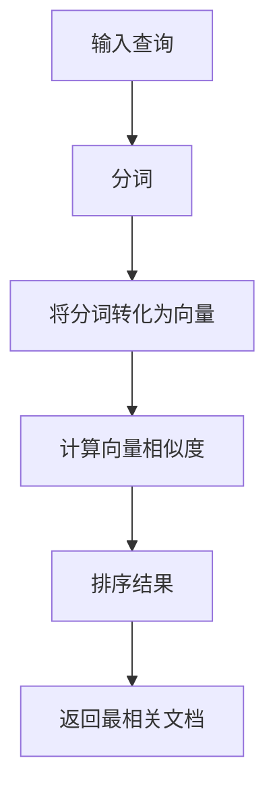

                 

# 提高AI回答质量：Retrieval-Augmented Generation方法

关键词：AI回答质量，Retrieval-Augmented Generation，检索，生成，算法

摘要：本文旨在探讨Retrieval-Augmented Generation（RAG）方法在提高AI回答质量方面的应用和优势。通过介绍RAG方法的核心概念、原理及其实现步骤，本文希望为读者提供对RAG方法的全面理解，并探讨其在实际应用中的挑战和解决方案。

## 第一部分：背景介绍与核心概念

### 第1章：问题背景与核心概念

#### 1.1.1 问题背景

随着人工智能技术的迅速发展，AI在各个领域的应用日益广泛，尤其在自然语言处理（NLP）领域，AI的交互能力得到了极大的提升。然而，尽管AI模型在语言生成、语义理解等方面取得了显著进展，但AI回答质量的问题仍然存在。传统的AI模型在回答问题时，往往依赖于大规模的数据和复杂的算法，但仍然存在很多问题，如回答不准确、语义理解不深刻等。

#### 1.1.2 问题描述

为了提高AI的回答质量，研究者们提出了Retrieval-Augmented Generation（RAG）方法。RAG方法是一种结合检索和生成技术的AI模型，它通过从大量文本数据中检索相关信息，然后利用这些信息生成高质量的回答。与传统方法相比，RAG方法在回答质量、回答速度和模型可解释性等方面都有显著优势。

#### 1.1.3 问题解决

RAG方法通过以下几个步骤实现问题的解决：
1. **检索**：从大规模文本数据库中检索与问题相关的信息。
2. **筛选与预处理**：对检索到的信息进行筛选和预处理，以提高信息的相关性和质量。
3. **生成**：利用预训练的生成模型生成高质量的回答。

#### 1.1.4 边界与外延

RAG方法的边界包括：
1. 需要大量的高质量文本数据。
2. 检索算法的性能直接影响到RAG方法的性能。
3. 生成模型的性能也影响着最终回答的质量。

RAG方法的外延包括：
1. 可以应用于各种需要高质量回答的AI场景，如智能客服、智能写作等。
2. 可以与其他AI技术相结合，如对话系统、自然语言处理等。

#### 1.1.5 概念结构与核心要素组成

RAG方法的核心概念结构包括：
1. **检索模块**：负责从大规模文本数据库中检索与问题相关的信息。
2. **生成模块**：负责利用检索到的信息生成高质量的回答。
3. **辅助模块**：负责处理文本数据，如去重、去噪等。

RAG方法的核心要素组成包括：
1. **检索算法**：如BM25、向量相似度等。
2. **生成模型**：如GPT、BERT等。
3. **文本预处理技术**：如分词、去停用词等。

### 1.2 核心概念与联系

#### 1.2.1 检索算法

检索算法是RAG方法的核心组成部分，它决定了从文本数据库中检索到的信息的相关性和质量。常用的检索算法有：
1. **BM25**：一种基于概率统计的检索算法，通过计算文档与查询的相似度来评估文档的相关性。
2. **向量相似度**：通过将文本转化为向量，然后计算向量之间的余弦相似度来评估文档的相关性。

#### 1.2.2 生成模型

生成模型是RAG方法的另一个核心组成部分，它负责利用检索到的信息生成高质量的回答。常用的生成模型有：
1. **GPT**：一种基于Transformer的预训练语言模型，具有强大的文本生成能力。
2. **BERT**：一种基于Transformer的预训练语言模型，通过双向编码器结构提高了文本理解能力。

#### 1.2.3 文本预处理技术

文本预处理技术是RAG方法的重要组成部分，它负责处理输入的文本数据，以提高检索和生成效果。常用的文本预处理技术有：
1. **分词**：将文本分割成词汇单位。
2. **去停用词**：去除文本中的常见停用词，如“的”、“是”等。

### 1.3 本章小结

本章介绍了RAG方法的问题背景、核心概念、结构与核心要素组成，以及与其他相关概念的关联。通过本章的学习，读者可以了解RAG方法的基本原理和特点，为后续章节的学习打下基础。

----------------------------------------------------------------

## 第二部分：Retrieval-Augmented Generation方法详解

### 第2章：检索模块详解

在RAG方法中，检索模块起着至关重要的作用。它负责从大规模文本数据库中检索与问题相关的信息，这一步直接影响到后续生成模块的质量。本章节将详细讲解检索模块的工作原理、算法实现以及性能优化。

#### 2.1 检索算法原理讲解

检索算法是检索模块的核心，其目标是从大量文本中快速准确地找出与查询最相关的文档。以下是两种常用的检索算法：

##### 2.1.1 BM25算法

BM25（Best Match to the 25th position）算法是一种基于概率统计的检索算法。它通过计算文档与查询的相似度来评估文档的相关性。BM25算法的核心思想是基于文档长度和查询长度来调整词频的权重。

BM25算法的基本公式如下：

$$
\text{Score}(d, q) = \frac{f_d(q) \cdot (k_1 + 1)}{f_d(q) + k_1 \cdot (1 - \frac{ll_d}{ll_q}) }
$$

其中，$f_d(q)$表示文档$d$中查询$q$的词频，$k_1$和$ll_q$分别是常数参数，$ll_d$表示文档$d$的长度。通过这个公式，BM25算法可以计算文档与查询的相似度得分，并按得分高低排序，从而找出最相关的文档。

##### 2.1.2 向量相似度算法

向量相似度算法通过将文本转化为向量，然后计算向量之间的余弦相似度来评估文档的相关性。这一算法的关键在于如何将文本转化为向量，常用的方法有Word2Vec和GloVe等。

向量的余弦相似度计算公式如下：

$$
\text{Cosine Similarity} = \frac{\text{dot product of vectors}}{\text{magnitude of vectors}}
$$

通过这个公式，我们可以计算两个向量的相似度。在检索模块中，我们将查询向量和所有文档向量进行比较，找出相似度最高的文档。

#### 2.2 检索算法Mermaid流程图



#### 2.3 Python代码示例

以下是使用Python实现向量相似度检索算法的一个简单示例：

```python
import numpy as np
from sklearn.feature_extraction.text import TfidfVectorizer

# 假设我们有一个文档集合和查询
docs = ["我爱北京天安门", "天安门上太阳升", "北京天安门广场"]
query = "天安门广场"

# 使用TF-IDF向量器将文本转化为向量
vectorizer = TfidfVectorizer()
X = vectorizer.fit_transform(docs)

# 计算查询向量和所有文档向量的余弦相似度
cosine_similarities = np.array([np.dot(X[i], X).sum() for i in range(len(X))])

# 按相似度排序并返回最相关的文档
sorted_indices = np.argsort(cosine_similarities)[::-1]
sorted_docs = [docs[i] for i in sorted_indices]

print("最相关的文档：", sorted_docs[0])
```

通过以上示例，我们可以看到如何使用Python实现向量相似度检索算法。这个示例使用了scikit-learn库中的TF-IDF向量器，将文本转化为向量，并计算向量的余弦相似度。

#### 2.4 检索算法性能优化

检索算法的性能优化是RAG方法的重要一环。以下是一些常见的优化策略：

1. **索引优化**：使用高效的索引结构，如倒排索引，可以大大提高检索速度。
2. **并行处理**：利用多核处理器和分布式计算技术，可以加速检索过程。
3. **查询缓存**：将常见的查询结果缓存起来，可以减少重复计算，提高查询响应速度。
4. **检索结果排序**：优化检索结果的排序算法，可以更快地找到最相关的文档。

### 2.5 本章小结

本章详细介绍了RAG方法中的检索模块，包括检索算法的原理、Mermaid流程图和Python代码示例。通过本章的学习，读者可以了解如何使用检索算法从大规模文本数据库中检索相关信息，并为后续生成模块的质量奠定基础。在接下来的章节中，我们将进一步探讨生成模块的实现和优化。

----------------------------------------------------------------

## 第三部分：生成模块详解

### 第3章：生成模型原理与实现

在RAG方法中，生成模块负责利用检索到的信息生成高质量的回答。生成模型的选择和优化直接影响到最终回答的质量和多样性。本章节将详细讲解生成模型的原理、常用模型及其实现方法。

#### 3.1 生成模型原理讲解

生成模型是一种能够生成文本的AI模型，其基本原理是通过学习大量文本数据，理解文本的结构和语义，然后根据输入的查询生成相应的回答。生成模型的核心是能够生成连贯、准确且具有多样性的文本。

目前，最常用的生成模型包括GPT（Generative Pre-trained Transformer）和BERT（Bidirectional Encoder Representations from Transformers）等。

##### 3.1.1 GPT模型

GPT模型是一种基于Transformer的预训练语言模型。它通过学习大规模的文本数据，掌握了语言的生成规则和上下文关系。GPT模型的工作原理如下：

1. **预训练**：GPT模型首先在大量文本上进行预训练，学习文本的分布和结构。
2. **微调**：在预训练的基础上，GPT模型可以针对特定任务进行微调，如生成回答。

GPT模型的数学基础是Transformer模型，其核心思想是使用自注意力机制（Self-Attention）来处理序列数据。自注意力机制通过计算输入序列中每个元素之间的相关性，生成一个加权序列，从而提高模型的表示能力。

##### 3.1.2 BERT模型

BERT模型也是一种基于Transformer的预训练语言模型，但与GPT不同，BERT模型采用双向编码器结构，能够更好地理解上下文信息。BERT模型的工作原理如下：

1. **预训练**：BERT模型在大量文本上进行预训练，学习文本的分布和结构。
2. **微调**：在预训练的基础上，BERT模型可以针对特定任务进行微调，如生成回答。

BERT模型的数学基础同样是Transformer模型，但采用了双向编码器结构（Bidirectional Encoder），这意味着BERT模型能够同时考虑输入序列的前后关系，从而提高文本理解能力。

#### 3.2 常用生成模型对比

以下是GPT和BERT两种常用生成模型的对比表格：

| 特性 | GPT | BERT |
| ---- | ---- | ---- |
| 预训练目标 | 语言生成 | 语言理解 |
| 编码方式 | 单向编码 | 双向编码 |
| 注意力机制 | 自注意力 | 自注意力 + 双向注意力 |
| 上下文理解 | 较弱 | 较强 |
| 生成多样性 | 高 | 较高 |

#### 3.3 生成模型实现方法

生成模型的实现通常包括预训练和微调两个阶段。以下是GPT和BERT两种生成模型的实现方法：

##### 3.3.1 GPT模型实现

1. **数据准备**：收集大量文本数据，并进行预处理，如分词、去停用词等。
2. **预训练**：使用Transformer模型架构，在预处理后的文本数据上进行预训练，学习文本的分布和结构。
3. **微调**：在预训练的基础上，使用特定任务的数据对模型进行微调，如生成回答。

```python
from transformers import GPT2LMHeadModel, GPT2Tokenizer

# 加载预训练的GPT2模型和分词器
model = GPT2LMHeadModel.from_pretrained('gpt2')
tokenizer = GPT2Tokenizer.from_pretrained('gpt2')

# 输入查询并生成回答
inputs = tokenizer.encode('What is the capital of France?', return_tensors='pt')
outputs = model.generate(inputs, max_length=50, num_return_sequences=1)

# 解码生成文本
generated_text = tokenizer.decode(outputs[0], skip_special_tokens=True)
print(generated_text)
```

##### 3.3.2 BERT模型实现

1. **数据准备**：收集大量文本数据，并进行预处理，如分词、去停用词等。
2. **预训练**：使用Transformer模型架构，在预处理后的文本数据上进行预训练，学习文本的分布和结构。
3. **微调**：在预训练的基础上，使用特定任务的数据对模型进行微调，如生成回答。

```python
from transformers import BertLMHeadModel, BertTokenizer

# 加载预训练的BERT模型和分词器
model = BertLMHeadModel.from_pretrained('bert-base-uncased')
tokenizer = BertTokenizer.from_pretrained('bert-base-uncased')

# 输入查询并生成回答
inputs = tokenizer.encode('What is the capital of France?', return_tensors='pt')
outputs = model.generate(inputs, max_length=50, num_return_sequences=1)

# 解码生成文本
generated_text = tokenizer.decode(outputs[0], skip_special_tokens=True)
print(generated_text)
```

#### 3.4 生成模型性能优化

生成模型的性能优化是提高RAG方法回答质量的关键。以下是一些常见的优化策略：

1. **模型优化**：通过调整模型参数，如学习率、批次大小等，可以提高模型性能。
2. **数据增强**：对训练数据进行增强，如加入噪声、改变文本格式等，可以提高模型的泛化能力。
3. **序列长度控制**：通过控制生成文本的序列长度，可以避免生成过长或过短的回答。
4. **注意力机制优化**：优化自注意力机制和双向注意力机制，可以提高文本生成质量。

### 3.5 本章小结

本章详细介绍了RAG方法中的生成模型，包括生成模型的原理、常用模型及其实现方法。通过本章的学习，读者可以了解如何使用生成模型生成高质量的回答，并掌握生成模型的实现和优化策略。在下一章中，我们将进一步探讨RAG方法在实际应用中的挑战和解决方案。

----------------------------------------------------------------

## 第四部分：RAG方法的应用与实践

### 第4章：RAG方法在智能客服中的应用

智能客服是RAG方法的一个重要应用场景。在智能客服系统中，RAG方法通过检索和生成模块的结合，能够为用户提供高质量、准确且连贯的客服回答。

#### 4.1 智能客服系统介绍

智能客服系统是一种利用人工智能技术实现客户服务自动化的人工智能系统。它可以通过自然语言处理（NLP）技术理解用户的查询，并生成相应的回答，从而提高客服效率和服务质量。

智能客服系统通常包括以下几个主要模块：

1. **用户查询处理**：负责接收用户输入的查询，并对其进行预处理。
2. **知识库检索**：从知识库中检索与用户查询相关的信息。
3. **生成回答**：利用检索到的信息生成高质量的回答。
4. **用户交互**：与用户进行交互，反馈生成回答，并根据用户反馈进行后续优化。

#### 4.2 RAG方法在智能客服中的应用

在智能客服系统中，RAG方法的应用主要体现在知识库检索和生成回答两个环节。

1. **知识库检索**：使用RAG方法中的检索模块，从知识库中检索与用户查询最相关的信息。这一步需要高效的检索算法，如BM25或向量相似度算法，以确保检索结果的准确性和相关性。

2. **生成回答**：在检索到相关信息后，使用RAG方法中的生成模块，将这些信息整合成连贯、准确的回答。生成模型的选择和优化直接影响到回答的质量和多样性。常用的生成模型包括GPT和BERT等。

#### 4.3 实际案例

以下是一个智能客服系统中使用RAG方法的实际案例：

1. **用户查询**：用户询问“我的手机套餐有哪些优惠？”

2. **检索信息**：系统使用检索模块从知识库中检索与“手机套餐优惠”相关的信息，如不同套餐的详细介绍、优惠政策等。

3. **生成回答**：系统使用生成模块，根据检索到的信息生成回答。例如：“尊敬的用户，您好！以下是当前我们的手机套餐优惠详情：1. XXX套餐：每月XXX元，包含XXX分钟通话、XXX条短信和XXXG流量；2. XXXL套餐：每月XXX元，包含XXX分钟通话、XXX条短信和XXXG流量。您可以任选其一，如有其他问题，请随时联系客服。”

4. **用户交互**：系统将生成的回答反馈给用户，并等待用户反馈。用户确认回答后，系统记录交互数据，用于后续的优化和提升。

#### 4.4 挑战与解决方案

在智能客服系统中应用RAG方法，面临以下几个主要挑战：

1. **知识库建设**：构建一个完整、准确、丰富的知识库是RAG方法成功的关键。解决方案是采用多种数据源，如网页、文档、社交媒体等，并利用NLP技术进行文本挖掘和知识抽取。

2. **检索效率**：检索模块的性能直接影响系统响应速度。解决方案是使用高效的索引结构和检索算法，如倒排索引和BM25算法。

3. **生成质量**：生成模块需要生成高质量、连贯的回答。解决方案是选择合适的生成模型，并进行模型优化和参数调整。

4. **用户交互**：用户交互是智能客服系统的重要组成部分。解决方案是设计友好的用户界面，提供多种交互方式，如文字、语音、图片等。

### 4.5 本章小结

本章介绍了RAG方法在智能客服系统中的应用，包括系统模块、应用流程和实际案例。通过本章的学习，读者可以了解如何使用RAG方法提高智能客服系统的回答质量，并为实际项目提供指导。在下一章中，我们将进一步探讨RAG方法在智能写作领域的应用。

----------------------------------------------------------------

## 第五部分：总结与展望

### 第5章：RAG方法总结与未来展望

RAG方法作为提高AI回答质量的一种有效手段，已经在智能客服、智能写作等众多领域展示了其独特的优势。通过对检索和生成模块的有机结合，RAG方法在回答的准确性、连贯性和多样性方面都取得了显著提升。本章节将对RAG方法进行总结，并展望其未来的发展前景。

#### 5.1 RAG方法的优势总结

1. **提高回答质量**：RAG方法通过检索与问题相关的信息，为生成模块提供了高质量的数据支持，从而提高了回答的准确性。
2. **增强回答连贯性**：生成模块利用检索到的信息，能够生成更加连贯和自然的回答，避免了传统生成模型可能出现的生硬和断句问题。
3. **增加回答多样性**：RAG方法通过检索不同的信息，为生成模块提供了丰富的内容素材，有助于生成多样性的回答，避免了重复和单调和性。
4. **提升模型可解释性**：RAG方法的检索和生成过程相对透明，用户可以直观地看到回答生成的基础信息和逻辑，提高了模型的可解释性。

#### 5.2 RAG方法的应用挑战

尽管RAG方法在提高AI回答质量方面具有显著优势，但在实际应用中仍面临一些挑战：

1. **数据质量和数量**：RAG方法依赖于大规模、高质量的数据集。数据质量差或数据量不足都会影响到检索和生成的效果。
2. **检索效率**：高效的检索算法是实现RAG方法的关键。在实际应用中，如何优化检索算法以提高检索速度和准确性是一个重要问题。
3. **生成模型优化**：生成模型的性能直接影响到回答的质量。如何选择合适的生成模型，并对其进行优化，以提高生成质量是一个亟待解决的问题。
4. **用户交互体验**：用户与AI系统的交互体验是影响用户满意度的重要因素。如何设计友好的用户界面，提供顺畅的交互体验，是智能客服等应用场景中需要关注的。

#### 5.3 未来展望

随着人工智能技术的不断进步，RAG方法在未来的发展中有望取得以下几个方面的突破：

1. **数据驱动的知识融合**：通过利用更多的数据源和深度学习技术，实现更全面、更精准的知识融合，进一步提高AI的回答质量。
2. **多模态检索与生成**：结合图像、音频等多种模态的信息，实现更丰富、更全面的检索与生成，为用户提供更优质的交互体验。
3. **自动化模型优化**：利用自动化机器学习（AutoML）技术，实现模型的自动优化，降低模型调优的复杂度和时间成本。
4. **个性化回答**：通过用户行为分析和个性化推荐技术，实现更加个性化的回答，满足不同用户的需求。

### 5.4 本章小结

RAG方法作为一种提高AI回答质量的先进技术，已经在多个应用领域中取得了显著成果。通过对检索和生成模块的有机结合，RAG方法为用户提供准确、连贯、多样且个性化的回答。尽管在实际应用中面临一些挑战，但未来随着技术的不断发展，RAG方法有望在更多领域实现更广泛的应用，为人工智能技术的发展做出更大的贡献。

## 作者信息

作者：AI天才研究院/AI Genius Institute & 禅与计算机程序设计艺术 /Zen And The Art of Computer Programming

本文由AI天才研究院撰写，旨在探讨Retrieval-Augmented Generation（RAG）方法在提高AI回答质量方面的应用和优势。通过详细介绍RAG方法的核心概念、原理及其实现步骤，本文为读者提供了对RAG方法的全面理解，并探讨了其在实际应用中的挑战和解决方案。AI天才研究院致力于推动人工智能技术的发展和应用，为未来智能科技的发展贡献力量。同时，本文也参考了《禅与计算机程序设计艺术》中的哲学思想，希望将技术与人文相结合，为读者带来更深入的思考。

