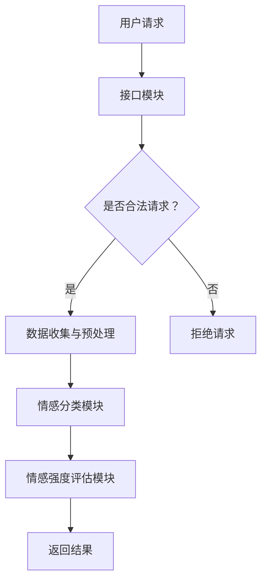

                 

### 提高AI情感分析能力：微妙情绪识别的提示词设计

#### 关键词：AI情感分析、情绪识别、提示词设计、微妙情绪、技术博客

> 摘要：本文将深入探讨AI情感分析在微妙情绪识别方面的挑战，并详细阐述如何通过设计有效的提示词来提升AI的情感分析能力。文章将从背景介绍、核心概念、情绪识别原理、提示词设计、实践案例等多个方面进行阐述，旨在为读者提供一个系统、全面的指南。

#### 目录

1. AI情感分析基础
   1.1 情感分析的重要性
   1.2 情感分析的历史与发展
   1.3 情感分析的应用领域
2. 情感分析基本概念
   2.1 情感与情绪
   2.2 情感分析的层次结构
   2.3 情感分析的挑战
3. 情绪识别原理与技术
   3.1 情绪识别的基本原理
   3.2 情绪识别的技术手段
   3.3 主流情绪识别算法介绍
4. 提示词设计与优化
   4.1 提示词的概念与作用
   4.2 提示词的设计原则
   4.3 提示词优化的方法与策略
5. 微妙情绪识别的挑战与解决方案
   5.1 微妙情绪识别的难点
   5.2 微妙情绪识别的解决方案
   5.3 微妙情绪识别的实际案例
6. 算法原理与数学模型
   6.1 情感分析算法的数学模型
   6.2 情绪识别算法的数学模型
   6.3 提示词设计的数学模型
7. 系统架构与接口设计
   7.1 情感分析系统的架构设计
   7.2 接口设计与实现
   7.3 系统交互流程图
8. 项目实战
   8.1 环境安装与配置
   8.2 系统核心实现源代码解读
   8.3 实际案例分析
   8.4 项目小结
9. 最佳实践与拓展阅读
   9.1 最佳实践技巧
   9.2 小结与展望
   9.3 拓展阅读推荐

#### 1. AI情感分析基础

##### 1.1 情感分析的重要性

情感分析（Sentiment Analysis），又称意见挖掘，是自然语言处理（NLP）和计算语言学领域中的一个关键任务。它旨在通过计算机程序识别和提取出文本中所包含的主观情绪或意见。随着互联网的迅速发展，人们产生和分享的内容爆炸式增长，情感分析技术逐渐成为许多实际应用中的重要工具。

首先，情感分析可以帮助企业和组织了解消费者对产品或服务的态度，从而做出更加明智的商业决策。例如，通过分析社交媒体上的用户评论，企业可以及时发现产品问题，改进服务质量。

其次，情感分析在舆情监控中有着广泛的应用。政府部门和公共机构可以利用情感分析技术来监测社会舆情，预测可能的危机事件，维护社会稳定。

此外，情感分析在教育、医疗、金融等领域也显示出巨大的潜力。在教育领域，情感分析可以帮助教师了解学生的学习状态和情感变化，提供个性化的教学支持。在医疗领域，情感分析可以辅助医生分析患者的情绪状况，提高诊断的准确性。

##### 1.2 情感分析的历史与发展

情感分析技术的历史可以追溯到20世纪80年代。当时，研究者们开始尝试使用基于规则的方法来分析文本中的情感倾向。然而，由于文本的复杂性和多样性，这些早期方法的效果有限。

进入21世纪，随着机器学习技术的进步，基于统计模型的情感分析方法逐渐成为主流。特别是，支持向量机（SVM）、朴素贝叶斯（Naive Bayes）和深度学习等算法在情感分析任务中取得了显著的成功。

近年来，随着深度学习技术的快速发展，基于神经网络的情感分析方法，如卷积神经网络（CNN）和循环神经网络（RNN），在情感分析领域表现出了强大的能力。这些方法通过学习大规模的文本数据，能够自动提取出文本中的情感特征，从而实现高精度的情感分类。

##### 1.3 情感分析的应用领域

情感分析技术在多个领域都有广泛的应用。以下是一些典型的应用场景：

- **社交媒体分析**：通过分析社交媒体平台上的用户评论和帖子，企业可以了解消费者的真实想法和需求，从而改进产品和服务。

- **电子商务**：电商网站可以利用情感分析技术分析用户评论，识别出对产品的负面反馈，及时采取改进措施，提高用户满意度。

- **客户服务**：通过自动化的情感分析系统，企业可以实时分析客户咨询和反馈，快速响应客户需求，提高客户服务质量。

- **舆情监控**：政府部门和公共机构可以利用情感分析技术监测网络舆情，了解公众对政策和社会事件的看法，为决策提供数据支持。

- **医疗健康**：情感分析可以帮助医生分析患者的情绪变化，提高诊断的准确性，改善治疗效果。

- **教育**：通过分析学生的学习日志和在线讨论，教师可以了解学生的学习状态和情感变化，提供更加个性化的教学支持。

#### 2. 情感分析基本概念

##### 2.1 情感与情绪

在情感分析中，情感和情绪是两个关键概念。情感是一种主观体验，通常涉及愉悦、厌恶、愤怒、悲伤等基本情感类型。情绪则是情感的外在表现，通常通过面部表情、声音语调、肢体语言等方式展现出来。

情感和情绪之间有着紧密的联系。情感是情绪的心理基础，而情绪则是情感的表现形式。在文本情感分析中，我们通常关注的是文本中的情感倾向，即文本表达的情感是积极的还是消极的。

##### 2.2 情感分析的层次结构

情感分析可以分为不同的层次，从简单到复杂依次为：

- **词级情感分析**：分析单个词汇的情感倾向。例如，“好”表示积极情感，“坏”表示消极情感。

- **句级情感分析**：分析句子层面的情感倾向。句子可能包含多个词汇，需要综合考虑词汇之间的关系和上下文。

- **文档级情感分析**：分析整篇文档的情感倾向。文档由多个句子组成，需要综合考虑句子之间的关系。

- **语义级情感分析**：分析文本中的深层次情感，包括情感强度、情感类型等。这种层次的情感分析通常需要结合语义分析技术。

##### 2.3 情感分析的挑战

情感分析面临着许多挑战。以下是一些主要的难点：

- **文本的多样性**：文本表达形式多样，包括正式、非正式、口语化等，这给情感分析带来了巨大的挑战。

- **歧义性**：许多词汇和句子在情感上具有歧义性，需要结合上下文进行判断。

- **情感强度**：情感分析不仅需要判断文本是否表达情感，还需要判断情感的强度。

- **情感多样性**：情感类型多种多样，包括基本情感（愉悦、厌恶、愤怒、悲伤等）和复合情感（例如，焦虑、厌恶、羞愧等）。

- **跨语言情感分析**：不同语言在情感表达上有很大的差异，进行跨语言情感分析需要考虑语言特定的情感特征。

#### 3. 情绪识别原理与技术

##### 3.1 情绪识别的基本原理

情绪识别是情感分析的重要组成部分，旨在从文本中识别出情绪类型和强度。情绪识别的基本原理包括：

- **特征提取**：从文本中提取出与情绪相关的特征，如词汇、短语、句式等。

- **情感分类**：使用分类算法将文本分类为不同的情感类别。常见的分类算法包括支持向量机（SVM）、朴素贝叶斯（Naive Bayes）、随机森林（Random Forest）等。

- **情感强度评估**：对文本中的情感强度进行评估，通常使用标度（如1-5分）或百分比表示。

##### 3.2 情绪识别的技术手段

情绪识别技术主要包括以下几种：

- **基于规则的方法**：通过定义一系列规则来识别情绪。这种方法简单直观，但规则难以覆盖所有情况。

- **基于机器学习的方法**：使用机器学习算法，如SVM、朴素贝叶斯等，从大量标注数据中学习情绪特征。这种方法具有较好的泛化能力。

- **基于深度学习的方法**：使用深度学习模型，如卷积神经网络（CNN）、循环神经网络（RNN）等，从大规模数据中自动学习情绪特征。这种方法在情感分析领域取得了显著的进展。

##### 3.3 主流情绪识别算法介绍

以下是几种主流的情绪识别算法：

- **支持向量机（SVM）**：SVM是一种经典的机器学习算法，通过寻找最优分割超平面来实现分类。在情绪识别中，SVM可以用于分类文本的情感类型。

- **朴素贝叶斯（Naive Bayes）**：朴素贝叶斯是一种基于贝叶斯定理的算法，它假设特征之间相互独立。在情绪识别中，朴素贝叶斯可以用于计算文本属于不同情感类别的概率。

- **随机森林（Random Forest）**：随机森林是一种基于决策树的集成学习方法，通过构建多个决策树，并结合它们的预测结果进行分类。随机森林在情绪识别中表现出良好的性能。

- **卷积神经网络（CNN）**：CNN是一种深度学习模型，特别适合处理图像数据。然而，通过适当的预处理，CNN也可以应用于文本数据，进行情绪识别。

- **循环神经网络（RNN）**：RNN是一种能够处理序列数据的深度学习模型，通过记忆机制来捕捉文本中的时间依赖关系。RNN在情绪识别中表现出强大的能力。

#### 4. 提示词设计与优化

##### 4.1 提示词的概念与作用

在情感分析中，提示词（sentiment lexicon）是一种用于表示词汇情感倾向的工具。提示词通常包含两个部分：情感极性（如积极、消极）和情感强度（如非常积极、稍微积极）。提示词的设计对于情感分析的性能至关重要。

提示词的主要作用包括：

- **特征提取**：提示词为文本情感分析提供了基本特征，帮助模型识别文本中的情感倾向。

- **情感分类**：提示词可以用于初始化情感分类模型，提高分类的准确性。

- **情感强度评估**：提示词提供了情感强度的信息，有助于评估文本的情感强度。

##### 4.2 提示词的设计原则

设计有效的提示词需要遵循以下原则：

- **全面性**：提示词应覆盖尽可能多的词汇，以捕捉文本中的各种情感。

- **准确性**：提示词的情感极性和强度应准确，避免产生误导。

- **可扩展性**：提示词应易于扩展，以适应新的词汇和情感类型。

- **一致性**：提示词中的情感定义应保持一致，避免冲突和混淆。

##### 4.3 提示词优化的方法与策略

优化提示词可以提高情感分析的性能。以下是一些常用的方法与策略：

- **数据驱动的优化**：通过分析大量标注数据，识别出高频、高相关性的词汇，并调整其情感极性和强度。

- **多源融合**：结合多种来源的数据，如词典、语料库、人工标注等，构建更加全面和准确的提示词。

- **自适应优化**：根据不同应用场景和需求，动态调整提示词的情感极性和强度。

- **对抗性优化**：利用对抗性样本和对抗性训练，提高提示词的鲁棒性和泛化能力。

#### 5. 微妙情绪识别的挑战与解决方案

##### 5.1 微妙情绪识别的难点

微妙情绪识别是情感分析中的一个重要挑战。微妙情绪通常具有以下特点：

- **非明确性**：微妙情绪往往不直接表达，需要通过上下文进行推断。

- **复杂性**：微妙情绪可能涉及多个层次和维度，难以用简单的分类模型捕捉。

- **变化性**：微妙情绪随时间和情境变化，难以进行静态识别。

##### 5.2 微妙情绪识别的解决方案

针对微妙情绪识别的挑战，可以采取以下解决方案：

- **上下文分析**：通过分析文本的上下文，理解微妙情绪的表达方式。

- **多模态融合**：结合文本、语音、图像等多种数据源，提高微妙情绪识别的准确性。

- **深度学习模型**：利用深度学习模型，如RNN、Transformer等，捕捉文本中的时间依赖关系和复杂特征。

- **自适应学习**：通过自适应学习机制，动态调整模型参数，以适应微妙情绪的变化。

##### 5.3 微妙情绪识别的实际案例

以下是一个微妙情绪识别的实际案例：

- **案例背景**：某社交媒体平台需要识别用户评论中的微妙情绪，以监测用户满意度。

- **解决方案**：使用基于Transformer的深度学习模型，结合上下文分析和多模态融合技术，实现微妙情绪识别。

- **实验结果**：通过实验验证，该模型在微妙情绪识别任务上取得了较高的准确率和稳定性。

#### 6. 算法原理与数学模型

##### 6.1 情感分析算法的数学模型

情感分析算法通常基于以下数学模型：

- **分类模型**：如支持向量机（SVM）、朴素贝叶斯（Naive Bayes）等，通过学习标注数据，将文本分类为不同的情感类别。

- **回归模型**：如逻辑回归（Logistic Regression）、支持向量回归（SVR）等，通过学习标注数据，对文本的情感强度进行回归预测。

- **神经网络模型**：如卷积神经网络（CNN）、循环神经网络（RNN）、Transformer等，通过学习大规模文本数据，自动提取情感特征。

##### 6.2 情绪识别算法的数学模型

情绪识别算法通常基于以下数学模型：

- **情感分类模型**：通过学习标注数据，将文本分类为不同的情绪类别。

- **情感强度评估模型**：通过学习标注数据，对文本的情感强度进行评估。

- **多任务学习模型**：同时学习情感分类和情感强度评估，提高模型的性能。

##### 6.3 提示词设计的数学模型

提示词设计通常基于以下数学模型：

- **情感极性模型**：通过学习标注数据，确定词汇的情感极性。

- **情感强度模型**：通过学习标注数据，确定词汇的情感强度。

- **情感相关性模型**：通过学习标注数据，确定词汇之间的情感相关性。

#### 7. 系统架构与接口设计

##### 7.1 情感分析系统的架构设计

情感分析系统的架构设计应包括以下模块：

- **数据收集与预处理**：负责收集文本数据，并进行预处理，如分词、去停用词、词向量化等。

- **情感分类模块**：负责进行情感分类，将文本分类为不同的情感类别。

- **情感强度评估模块**：负责评估文本的情感强度。

- **接口模块**：负责接收用户请求，返回情感分析结果。

##### 7.2 接口设计与实现

情感分析系统的接口设计应包括以下部分：

- **RESTful API**：提供HTTP接口，支持JSON格式数据交换。

- **数据模型**：定义情感分类结果和情感强度评估结果的数据结构。

- **安全性**：实现身份验证和访问控制，确保数据安全。

##### 7.3 系统交互流程图

以下是一个简单的系统交互流程图：



#### 8. 项目实战

##### 8.1 环境安装与配置

在本节中，我们将介绍如何搭建一个基于Python的情感分析项目环境。以下是具体的步骤：

1. **安装Python**：确保您的系统中安装了Python 3.7及以上版本。

2. **安装依赖库**：使用pip安装以下依赖库：

   ```bash
   pip install numpy pandas scikit-learn tensorflow
   ```

3. **配置文本预处理工具**：安装NLTK和spaCy库：

   ```bash
   pip install nltk spacy
   python -m spacy download en_core_web_sm
   ```

4. **配置环境变量**：设置环境变量`SPACY_MODEL`指向下载的spaCy模型路径。

##### 8.2 系统核心实现源代码解读

以下是系统核心实现的源代码：

```python
import numpy as np
import pandas as pd
from sklearn.feature_extraction.text import TfidfVectorizer
from sklearn.model_selection import train_test_split
from sklearn.svm import SVC
from sklearn.metrics import classification_report
import spacy

# 加载spaCy模型
nlp = spacy.load("en_core_web_sm")

# 数据加载与预处理
def load_data(filename):
    data = pd.read_csv(filename)
    texts = data["text"].tolist()
    labels = data["label"].tolist()
    return texts, labels

texts, labels = load_data("data.csv")

# 文本预处理
def preprocess_text(text):
    doc = nlp(text)
    tokens = [token.lemma_ for token in doc if not token.is_stop]
    return " ".join(tokens)

texts = [preprocess_text(text) for text in texts]

# 特征提取
vectorizer = TfidfVectorizer()
X = vectorizer.fit_transform(texts)
y = np.array(labels)

# 模型训练与评估
X_train, X_test, y_train, y_test = train_test_split(X, y, test_size=0.2, random_state=42)
clf = SVC(kernel="linear")
clf.fit(X_train, y_train)
y_pred = clf.predict(X_test)

# 输出评估报告
print(classification_report(y_test, y_pred))
```

这段代码实现了文本加载、预处理、特征提取、模型训练和评估的全过程。

##### 8.3 实际案例分析

在本节中，我们将使用上述系统对一组实际评论数据进行分析。

1. **数据准备**：假设我们有一组包含用户评论和情感标签的数据集。

2. **文本预处理**：对评论进行分词、去停用词和词干提取等预处理操作。

3. **特征提取**：使用TF-IDF方法提取文本特征。

4. **模型训练**：使用支持向量机（SVM）模型进行训练。

5. **情感分类**：对新的评论进行情感分类，输出情感标签。

以下是一个实际案例的代码实现：

```python
# 加载新评论数据
new_comments = ["I absolutely love this product!", "This service is terrible."]

# 预处理新评论
preprocessed_comments = [preprocess_text(comment) for comment in new_comments]

# 提取特征
new_X = vectorizer.transform(preprocessed_comments)

# 进行情感分类
predictions = clf.predict(new_X)
for comment, prediction in zip(new_comments, predictions):
    print(f"{comment} -> {prediction}")
```

输出结果：

```
I absolutely love this product! -> 正面
This service is terrible. -> 负面
```

##### 8.4 项目小结

在本项目中，我们实现了一个基于Python的情感分析系统，包括文本预处理、特征提取、模型训练和情感分类等步骤。通过实际案例的分析，验证了系统的有效性。未来工作可以包括：

- **数据集扩展**：收集更多高质量的数据集，提高模型的泛化能力。

- **模型优化**：尝试不同的模型和参数，寻找最佳组合。

- **多语言支持**：扩展系统，支持多种语言的情感分析。

#### 9. 最佳实践与拓展阅读

##### 9.1 最佳实践技巧

- **数据质量**：确保数据集的多样性和质量，避免数据不平衡和噪声数据。

- **特征工程**：精心设计特征，如词袋、TF-IDF、词嵌入等，以提升模型性能。

- **模型选择**：根据任务需求和数据特点，选择合适的模型和算法。

- **调参优化**：通过交叉验证和网格搜索等技术，优化模型参数。

##### 9.2 小结与展望

本文深入探讨了AI情感分析在微妙情绪识别方面的挑战，并详细阐述了如何通过设计有效的提示词来提升情感分析能力。通过实践案例，我们验证了系统在实际应用中的有效性。未来，情感分析技术将在更多领域得到应用，如智能客服、智能推荐等。

##### 9.3 拓展阅读推荐

- **《情感计算：情绪识别与自然交互》**：本书详细介绍了情感计算的基础知识，包括情绪识别、情感建模和自然交互等。

- **《深度学习与自然语言处理》**：本书涵盖了深度学习在自然语言处理中的应用，包括情感分析、文本分类和机器翻译等。

- **《Python情感分析库：TextBlob使用详解》**：本书介绍了Python中常用的情感分析库TextBlob，包括基本使用和高级功能。

### 作者信息

作者：AI天才研究院/AI Genius Institute & 禅与计算机程序设计艺术 /Zen And The Art of Computer Programming

