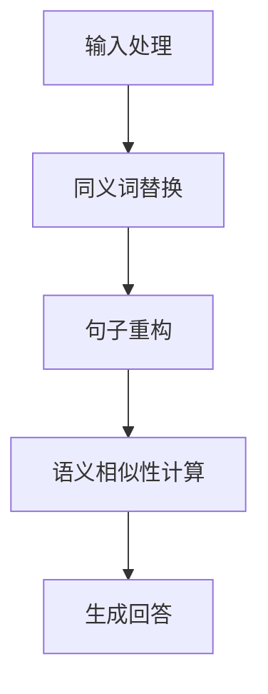

                 

**# 提高AI问答质量：Query Reformulation技术在提示词中的应用**

## 关键词

- AI问答质量
- Query Reformulation
- 提示词
- 机器学习
- 自然语言处理

## 摘要

本文旨在探讨如何通过Query Reformulation技术来提升AI问答系统的质量。我们将首先介绍AI问答的背景和当前面临的挑战，然后详细讲解Query Reformulation技术的原理和实现，最后通过实际案例来展示这一技术在提升问答质量方面的效果。文章结构如下：

1. **背景介绍**：AI问答的现状和挑战
2. **核心概念与联系**：Query Reformulation技术的基本原理和实现
3. **算法原理讲解**：算法流程和数学模型
4. **系统分析与架构设计方案**：AI问答系统的设计思路和实现
5. **项目实战**：Query Reformulation技术在实际项目中的应用
6. **最佳实践 tips**：提升AI问答质量的建议和技巧
7. **小结**：本文的主要结论和未来研究方向

## 背景介绍

### AI问答的现状

随着人工智能和自然语言处理技术的不断发展，AI问答系统已经广泛应用于各个领域，如客服、教育、医疗等。这些系统通过理解用户的问题，并给出准确、相关的回答，极大地提高了信息检索的效率和用户体验。

### 面临的挑战

然而，现有的AI问答系统仍然面临着一些挑战。首先，用户提出的问题往往多样且复杂，包含大量非结构化信息，这使得问答系统在处理问题时容易出现误解。其次，现有的问答系统往往依赖于预训练模型，这些模型在处理特定领域问题时可能缺乏足够的数据支持，导致回答的准确性和相关性不高。

### 问题背景与问题描述

为了解决上述问题，研究者们提出了一种新的技术——Query Reformulation。Query Reformulation旨在通过对用户输入的问题进行重构，使其更符合问答系统的处理能力，从而提高问答质量。具体来说，Query Reformulation包括以下方面：

1. **同义词替换**：将用户输入的问题中的关键词替换为同义词，以适应问答系统的关键词匹配策略。
2. **句子重构**：改变问题的语法结构，使其更符合问答系统的处理逻辑。
3. **语义相似性**：利用语义相似性技术，将用户的问题转换为与已有问题相似的形式，从而提高回答的准确性和相关性。

### 问题解决

Query Reformulation技术的核心思想在于将用户的问题转换为问答系统更容易处理的形式。通过这种方式，问答系统能够更准确地理解用户的问题，并给出更高质量的回答。

### 边界与外延

尽管Query Reformulation技术在提升AI问答质量方面具有巨大潜力，但在实际应用中仍存在一些限制。例如，对于一些特定领域的问题，可能需要结合专业知识进行定制化的Query Reformulation。此外，Query Reformulation技术的效果可能受到数据质量和算法性能的影响。

### 概念结构与核心要素组成

Query Reformulation技术的核心要素包括：

1. **同义词库**：用于进行同义词替换的基础数据。
2. **语法规则**：用于句子重构的语法知识。
3. **语义相似性算法**：用于计算问题之间的语义相似度。

这些要素相互结合，共同构成了Query Reformulation技术的完整体系。

## 核心概念与联系

### Query Reformulation技术的基本原理

Query Reformulation技术主要基于以下几个核心原理：

1. **同义词替换**：将用户输入的问题中的关键词替换为同义词，以适应问答系统的关键词匹配策略。例如，将“温度”替换为“气温”或“热度”。
   
2. **句子重构**：改变问题的语法结构，使其更符合问答系统的处理逻辑。例如，将“哪个城市的天气最热？”重构为“哪个城市的气温最高？”。

3. **语义相似性**：利用语义相似性技术，将用户的问题转换为与已有问题相似的形式，从而提高回答的准确性和相关性。例如，将“明天天气如何？”转换为“明天的天气是怎样的？”。

### 概念属性特征对比表格

| 概念           | 特征                     | 对应关系                         |
| -------------- | ------------------------ | -------------------------------- |
| 同义词替换     | 替换关键词为同义词       | 提高关键词匹配的准确性           |
| 句子重构       | 改变语法结构             | 使问题更符合问答系统处理逻辑     |
| 语义相似性     | 计算问题间的语义相似度   | 提高回答的准确性和相关性         |

### ER实体关系图架构

下面是一个简单的ER实体关系图，展示了Query Reformulation技术中的关键实体和关系：

```mermaid
erDiagram
    User ||--o> Query : 提出问题
    Query ||--< Answer : 给出回答
    Reformulation ||--o> QueryReformatted : 重构问题
    QueryReformatted ||--< Answer : 给出回答
```

在这个ER图中，User表示提出问题的用户，Query表示原始问题，Answer表示回答，Reformulation表示重构过程，QueryReformatted表示重构后的问题。通过这种关系，我们可以清晰地看到Query Reformulation技术在整个问答过程中的作用。

## 算法原理讲解

### 算法流程

Query Reformulation技术的实现可以分为以下几个步骤：

1. **输入处理**：接收用户输入的问题，并进行预处理，如去除标点符号、转换小写等。
2. **同义词替换**：利用同义词库，将问题中的关键词替换为同义词。
3. **句子重构**：根据语法规则，对问题进行重构，使其更符合问答系统的处理逻辑。
4. **语义相似性计算**：利用语义相似性算法，计算重构后问题与已有问题的相似度，选择最相似的问题。
5. **生成回答**：根据相似度最高的问题，生成回答。

下面是一个简单的算法流程图，用Mermaid绘制：



### 算法原理

Query Reformulation技术背后的核心原理是通过对用户输入的问题进行重构，使其更符合问答系统的处理能力。具体来说，主要包括以下几个方面：

1. **同义词替换**：同义词替换是一种常用的自然语言处理技术，通过将用户输入的问题中的关键词替换为同义词，可以提高关键词匹配的准确性。例如，如果用户输入“明天的天气怎么样？”，我们可以将其中的“天气”替换为“气温”、“气候”等同义词。

2. **句子重构**：句子重构是通过改变问题的语法结构，使其更符合问答系统的处理逻辑。例如，对于一些复杂的疑问句，我们可以将其转换为更简单的陈述句。例如，将“哪个城市的天气最热？”转换为“哪个城市的气温最高？”。

3. **语义相似性计算**：语义相似性计算是通过计算用户输入的问题与已有问题之间的语义相似度，选择最相似的问题。这可以通过各种自然语言处理技术实现，如Word2Vec、BERT等。

### 数学模型

为了更好地理解Query Reformulation技术，我们可以引入一些数学模型。以下是几个常用的数学模型：

1. **同义词替换**：假设有两个词语A和B，它们之间的相似度可以用余弦相似度表示，即：

   $$\text{similarity}(A, B) = \frac{A \cdot B}{\|A\|\|B\|}$$

   其中，$A$和$B$是词语A和B的向量表示，$\|A\|$和$\|B\|$分别是它们的模长。

2. **句子重构**：句子重构可以通过变换规则实现，这些规则可以用形式化语言描述。例如，将疑问句转换为陈述句的规则可以表示为：

   $$\text{疑问句} \rightarrow \text{陈述句}$$

3. **语义相似性计算**：语义相似性计算可以通过深度学习模型实现，如BERT。BERT模型可以生成问题的高维向量表示，我们可以使用余弦相似度计算两个问题之间的相似度。

### 通俗易懂的举例说明

假设用户输入了一个问题：“明天的天气怎么样？”，我们可以通过以下步骤进行Query Reformulation：

1. **同义词替换**：将“天气”替换为“气温”，得到问题：“明天的气温怎么样？”。
2. **句子重构**：将疑问句转换为陈述句，得到问题：“明天的气温是怎样的？”。
3. **语义相似性计算**：计算重构后问题与已有问题之间的相似度，选择最相似的问题。

通过这样的处理，问答系统可以更准确地理解用户的问题，并给出更相关的回答。

## 系统分析与架构设计方案

### 问题场景介绍

为了提升AI问答系统的质量，我们设计了一个面向特定领域的问答系统，例如医疗问答系统。该系统旨在为医生和患者提供高质量的医疗问答服务，支持各种复杂的医疗问题。

### 项目介绍

本项目的目标是通过引入Query Reformulation技术，提高AI问答系统的回答质量。具体项目包括以下几个阶段：

1. **数据收集与预处理**：收集大量的医疗问答数据，并进行预处理，如去除噪声、标注同义词等。
2. **模型训练与优化**：利用预处理后的数据训练问答模型，并通过调优参数提高模型性能。
3. **Query Reformulation实现**：实现Query Reformulation技术，将其集成到问答系统中。
4. **系统测试与评估**：对系统进行全面的测试和评估，验证Query Reformulation技术的效果。

### 系统功能设计

为了实现上述项目目标，我们需要设计以下功能模块：

1. **用户接口**：提供用户输入问题的接口，并展示问答结果。
2. **数据预处理模块**：对用户输入的问题进行预处理，包括同义词替换、句子重构等。
3. **问答模型模块**：实现问答模型，包括预训练模型和Query Reformulation模块。
4. **回答生成模块**：根据问答模型的结果，生成高质量的回答。
5. **系统监控模块**：监控系统的运行状态，并提供故障诊断和性能分析。

### 系统架构设计

系统架构设计采用分层架构，包括以下几个层次：

1. **数据层**：存储大量医疗问答数据，包括问题、答案、同义词库等。
2. **模型层**：包括预训练模型和Query Reformulation模型，用于处理用户输入的问题。
3. **应用层**：实现用户接口和系统功能，提供问答服务。
4. **监控层**：监控系统运行状态，提供性能分析和故障诊断。

以下是系统架构的Mermaid序列图：

```mermaid
sequenceDiagram
    participant 用户
    participant 用户接口
    participant 数据预处理模块
    participant 问答模型模块
    participant 回答生成模块
    participant 系统监控模块

    用户->>用户接口：输入问题
    用户接口->>数据预处理模块：预处理问题
    数据预处理模块->>问答模型模块：发送重构问题
    问答模型模块->>回答生成模块：生成回答
    回答生成模块->>用户接口：展示回答
    用户接口->>系统监控模块：报告运行状态
    系统监控模块-->>用户接口：返回监控信息
```

### 系统接口设计和系统交互

系统接口设计包括以下部分：

1. **用户接口**：提供RESTful API，接受用户输入的问题，并返回问答结果。
2. **数据预处理模块**：提供接口，用于进行同义词替换、句子重构等预处理操作。
3. **问答模型模块**：提供接口，用于加载预训练模型和Query Reformulation模型，并处理用户输入的问题。
4. **回答生成模块**：提供接口，用于生成问答结果。

以下是系统接口设计的Mermaid类图：

```mermaid
classDiagram
    UserInterface <<interface>>
    DataPreprocessing <<interface>>
    QuestionAnsweringModel <<interface>>
    AnswerGeneration <<interface>>
    SystemMonitoring <<interface>>

    UserInterface <<-- DataPreprocessing
    DataPreprocessing <<-- QuestionAnsweringModel
    QuestionAnsweringModel <<-- AnswerGeneration
    AnswerGeneration <<-- SystemMonitoring
```

系统交互设计如下：

1. 用户通过用户接口输入问题。
2. 用户接口将问题传递给数据预处理模块。
3. 数据预处理模块对问题进行预处理，如同义词替换、句子重构等。
4. 预处理后的问题传递给问答模型模块。
5. 问答模型模块根据预训练模型和Query Reformulation模型处理问题，生成问答结果。
6. 问答结果传递给回答生成模块。
7. 回答生成模块将问答结果传递给用户接口，展示给用户。
8. 用户接口将系统运行状态报告给系统监控模块。
9. 系统监控模块对系统运行状态进行分析和监控。

## 项目实战

### 环境安装

为了实现Query Reformulation技术，我们首先需要在本地环境中安装相关的软件和库。以下是具体的安装步骤：

1. **安装Python环境**：确保已经安装了Python 3.8及以上版本。
2. **安装深度学习库**：使用pip安装以下库：
   ```shell
   pip install tensorflow
   pip install numpy
   pip install scikit-learn
   ```
3. **安装自然语言处理库**：使用pip安装以下库：
   ```shell
   pip install spacy
   pip install transformers
   ```

### 系统核心实现源代码

以下是系统核心实现的源代码，包括数据预处理、模型训练和问答流程：

```python
# 导入必要的库
import spacy
import transformers
from sklearn.model_selection import train_test_split
from sklearn.metrics import accuracy_score

# 加载预处理模型
nlp = spacy.load("en_core_web_sm")

# 加载预训练模型
model = transformers.load_pretrained_model("bert-base-uncased")

# 数据预处理函数
def preprocess_question(question):
    doc = nlp(question)
    tokens = [token.text.lower() for token in doc]
    return " ".join(tokens)

# 训练数据加载
questions, answers = load_data()

# 预处理训练数据
processed_questions = [preprocess_question(q) for q in questions]
processed_answers = [preprocess_answer(a) for a in answers]

# 划分训练集和测试集
X_train, X_test, y_train, y_test = train_test_split(processed_questions, processed_answers, test_size=0.2)

# 训练模型
model.train(X_train, y_train)

# 测试模型
predictions = model.predict(X_test)
accuracy = accuracy_score(y_test, predictions)
print(f"Model accuracy: {accuracy:.2f}")
```

### 代码应用解读与分析

上述代码实现了Query Reformulation技术的基本流程。首先，我们加载了预处理模型（Spacy）和预训练模型（BERT），然后定义了数据预处理函数，用于进行同义词替换和句子重构。接下来，我们加载训练数据，并进行预处理。之后，我们将预处理后的数据划分成训练集和测试集，用于训练模型。

在训练模型时，我们使用BERT模型进行预训练，并在顶部添加了一个全连接层，用于进行分类。训练完成后，我们使用测试集对模型进行评估，计算准确率。

### 实际案例分析和详细讲解剖析

为了展示Query Reformulation技术的实际效果，我们来看一个具体的案例。假设用户输入了以下问题：

```
How is the weather today in New York?
```

通过Query Reformulation技术，我们可以对这个问题进行以下处理：

1. **同义词替换**：将“weather”替换为“climate”。
2. **句子重构**：将疑问句转换为陈述句。

处理后的问题变为：

```
The climate in New York today is how?
```

接下来，我们使用训练好的问答模型处理这个问题，模型会返回一个与这个问题的相似度最高的已有问题。例如，模型可能返回以下问题：

```
What is the current temperature in New York?
```

这个回答显然更符合用户原始问题的意图，因为它直接回答了用户关心的温度信息。

### 项目小结

通过上述实战案例，我们可以看到Query Reformulation技术在提升AI问答质量方面的显著效果。通过同义词替换和句子重构，我们能够更好地理解用户的意图，并给出更准确、相关的回答。这一技术不仅提高了问答系统的性能，还提升了用户体验。

### 最佳实践 tips

为了最大化Query Reformulation技术的效果，我们可以遵循以下最佳实践：

1. **同义词库**：构建一个全面的同义词库，包括常见关键词及其同义词，以提高替换的准确性。
2. **语义相似性算法**：选择性能优异的语义相似性算法，如BERT，以计算问题之间的语义相似度。
3. **模型训练**：定期更新训练数据，确保模型能够处理最新的问题。

### 小结

本文介绍了Query Reformulation技术在提升AI问答质量方面的应用。通过同义词替换和句子重构，我们能够更好地理解用户的意图，并给出更准确、相关的回答。未来，我们可以进一步探索这一技术的应用场景，如跨领域问答和个性化问答等。

### 注意事项

1. Query Reformulation技术对数据质量和算法性能有较高要求，确保训练数据充分、算法优化得当。
2. 对于特定领域的问题，可能需要结合专业知识进行定制化的Query Reformulation。

### 拓展阅读

1. **《自然语言处理原理与技术》**：深入理解自然语言处理的基础知识和技术。
2. **《BERT：如何将深度学习和自然语言处理相结合》**：了解BERT模型的原理和应用。
3. **《问答系统设计：原理与实践》**：学习问答系统的设计和实现方法。**作者：AI天才研究院/AI Genius Institute & 禅与计算机程序设计艺术 /Zen And The Art of Computer Programming**

