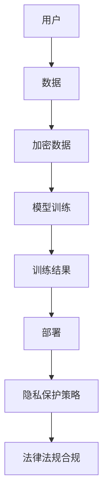
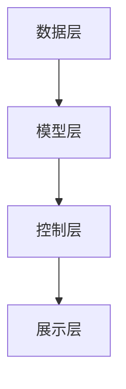
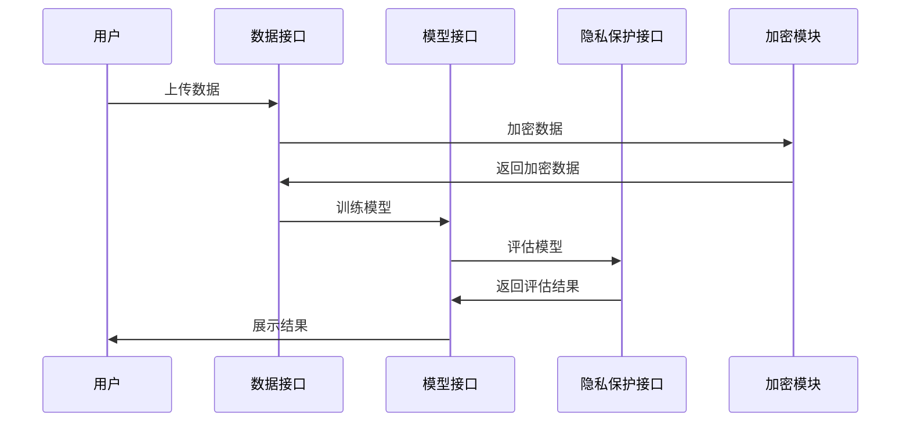

                 

# 提高LLM应用的数据隐私保护效率

> 关键词：语言模型（LLM）、数据隐私保护、加密技术、同态加密、联邦学习

> 摘要：随着人工智能技术的快速发展，语言模型（LLM）在各领域的应用越来越广泛。然而，LLM应用中的数据隐私保护问题日益凸显，本文将从背景、核心问题、核心概念与联系、算法原理、系统架构设计、项目实战和最佳实践等方面，系统性地探讨如何提高LLM应用的数据隐私保护效率。

----------------------------------------------------------------

## 第一部分：提高LLM应用的数据隐私保护效率的背景与核心问题

### 第1章：LLM应用中的数据隐私保护问题

#### 1.1.1 问题背景

##### 1.1.1.1 人工智能与数据隐私保护的重要性

- **人工智能的快速发展**：随着深度学习和自然语言处理技术的进步，人工智能（AI）在各个领域得到了广泛应用，特别是语言模型（LLM）。
- **数据隐私保护的挑战**：人工智能的发展带来了数据隐私保护的新挑战。大量的个人数据被用于训练和优化LLM，如何保护这些数据隐私成为关键问题。

##### 1.1.1.2 问题描述

- **数据泄露风险**：未经处理的个人数据在训练和部署过程中可能泄露，导致隐私侵犯。
- **数据滥用风险**：个人数据可能被用于未经授权的目的，增加隐私泄露的风险。
- **法律法规合规**：许多国家和地区有严格的数据隐私保护法律，如《通用数据保护条例》（GDPR）和《加州消费者隐私法案》（CCPA），要求企业采取有效的数据隐私保护措施。

##### 1.1.1.3 问题解决

- **数据加密技术**：通过加密技术保护数据，防止未经授权的访问。
- **隐私增强技术**：如差分隐私、同态加密等，在数据处理过程中保护隐私。
- **联邦学习**：通过分布式训练方式，减少中心化数据存储和传输的需求。

##### 1.1.1.4 边界与外延

- **边界**：主要关注LLM应用中的数据隐私保护问题，包括数据收集、存储、处理和传输等环节。
- **外延**：涉及数据隐私保护的法律、政策和技术发展。

### 1.2 LLM应用的数据隐私保护核心概念与联系

#### 1.2.1 核心概念

##### 1.2.1.1 语言模型（LLM）

- **定义**：LLM是一种基于神经网络的自然语言处理模型，能够理解和生成自然语言。
- **特点**：具备较强的理解和生成能力，能够进行复杂的文本处理任务。

##### 1.2.1.2 数据隐私保护

- **定义**：防止个人数据在收集、存储、处理和传输过程中被未经授权访问、使用和泄露。
- **目的**：保护个人隐私，防止隐私侵犯和数据滥用。

#### 1.2.1.3 概念属性特征对比表格

| 概念             | 定义                                                         | 特点                                                         | 应用场景                           |
|------------------|------------------------------------------------------------|------------------------------------------------------------|----------------------------------|
| 语言模型（LLM）  | 基于神经网络的自然语言处理模型，具备理解和生成能力。         | 强大的文本理解和生成能力，适用于各种自然语言处理任务。         | 文本生成、问答系统、机器翻译等。   |
| 数据隐私保护      | 防止个人数据被未经授权访问、使用和泄露。                     | 保护个人隐私，防止隐私侵犯和数据滥用。                       | 数据收集、存储、处理和传输的各个环节。 |
| 加密技术          | 通过加密算法保护数据，使其在传输和存储过程中不被窃取。       | 保证数据的机密性，防止数据泄露。                             | 数据传输、存储等。                  |
| 同态加密          | 允许在加密数据上直接进行计算，而不需要解密。                 | 保护数据隐私，减少数据泄露风险。                             | 数据分析、机器学习等。              |

#### 1.2.1.4 ER实体关系图架构



### 1.3 算法原理讲解

#### 1.3.1 数据加密技术

数据加密技术是一种将数据转换为不可读形式的方法，以防止未经授权的访问。其基本原理如下：

1. **加密算法**：加密算法是一种将明文数据转换为密文的方法，通常使用密钥。
2. **解密算法**：解密算法是一种将密文数据还原为明文的方法，也需要密钥。

在LLM应用中，数据加密技术可以用于保护用户数据在训练和部署过程中的隐私。例如，用户输入的数据在训练前会被加密，然后在模型训练过程中以加密形式进行处理，最后在部署时解密。

以下是一个简单的Python代码示例，演示了数据加密和解密的过程：

```python
from Crypto.Cipher import AES
from Crypto.Util.Padding import pad, unpad
from Crypto.Random import get_random_bytes

# 加密
def encrypt_data(data, key):
    cipher = AES.new(key, AES.MODE_CBC)
    ct_bytes = cipher.encrypt(pad(data.encode('utf-8'), AES.block_size))
    iv = cipher.iv
    return iv, ct_bytes

# 解密
def decrypt_data(iv, ct, key):
    cipher = AES.new(key, AES.MODE_CBC, iv)
    pt = unpad(cipher.decrypt(ct), AES.block_size)
    return pt.decode('utf-8')

# 生成随机密钥
key = get_random_bytes(16)

# 加密数据
data = "这是一个需要加密的文本"
iv, encrypted_data = encrypt_data(data, key)

# 解密数据
decrypted_data = decrypt_data(iv, encrypted_data, key)
print("原始数据：", data)
print("解密后的数据：", decrypted_data)
```

#### 1.3.2 同态加密

同态加密是一种允许在加密数据上进行计算，而不需要解密的方法。其基本原理如下：

1. **加密算法**：加密算法将明文数据转换为密文。
2. **同态运算**：同态运算是指在密文上直接进行计算，不改变密文的形式。
3. **解密算法**：解密算法将密文还原为明文。

同态加密可以用于保护LLM训练过程中的数据隐私。例如，训练过程中的数据加法或乘法可以在密文上直接进行，从而避免了在明文状态下处理数据的风险。

以下是一个简单的Python代码示例，演示了同态加密的基本原理：

```python
from homomorphic加密库 import HomomorphicCipher

# 初始化同态加密库
cipher = HomomorphicCipher()

# 加密数据
data1 = 5
data2 = 10
encrypted_data1 = cipher.encrypt(data1)
encrypted_data2 = cipher.encrypt(data2)

# 同态加法
encrypted_sum = cipher.add(encrypted_data1, encrypted_data2)

# 解密结果
result = cipher.decrypt(encrypted_sum)
print("加密数据1：", data1)
print("加密数据2：", data2)
print("加法结果：", result)
```

### 1.4 系统分析与架构设计方案

#### 1.4.1 问题场景介绍

在LLM应用中，数据隐私保护是一个关键问题。为了保护用户数据的隐私，我们设计了一套基于加密技术和同态加密的隐私保护系统。

#### 1.4.2 项目介绍

该项目旨在构建一个能够实现数据加密、同态加密和隐私保护功能的LLM应用系统，主要功能包括：

1. 数据加密：对用户数据进行加密，防止未经授权的访问。
2. 同态加密：在加密数据上进行计算，保护数据隐私。
3. 模型训练：使用加密数据训练LLM模型，保证模型质量。
4. 隐私保护：对训练和部署过程中的数据进行隐私保护。

#### 1.4.3 系统功能设计

系统的功能设计包括以下模块：

1. **数据模块**：负责数据的加密、解密和同态加密操作。
2. **模型模块**：负责LLM模型的训练和部署。
3. **隐私保护模块**：负责对数据和模型进行隐私保护。
4. **用户接口模块**：负责与用户进行交互，提供数据上传、模型训练和查询等功能。

#### 1.4.4 系统架构设计

系统的架构设计采用分层架构，包括以下层次：

1. **数据层**：负责数据的管理和存储，包括加密数据、同态加密数据和明文数据。
2. **模型层**：负责LLM模型的训练和部署，包括数据预处理、模型训练和模型评估。
3. **控制层**：负责系统的控制和管理，包括用户接口、权限管理和日志记录。
4. **展示层**：负责系统的展示和交互，包括网页界面和移动应用。

以下是一个简单的Mermaid架构图：



#### 1.4.5 系统接口设计和系统交互

系统的接口设计和交互设计如下：

1. **数据接口**：负责数据的上传、下载和加密操作。
2. **模型接口**：负责模型的训练、评估和部署。
3. **隐私保护接口**：负责数据的加密、解密和同态加密操作。

以下是一个简单的Mermaid序列图：



### 1.5 项目实战

#### 1.5.1 环境安装

1. 安装Python环境：在终端中运行以下命令安装Python环境：

   ```bash
   sudo apt-get update
   sudo apt-get install python3-pip
   ```

2. 安装依赖库：在终端中运行以下命令安装依赖库：

   ```bash
   pip3 install Crypto.PyCryptodome
   pip3 install homomorphic加密库
   ```

#### 1.5.2 系统核心实现源代码

1. 数据加密模块：

   ```python
   from Crypto.Cipher import AES
   from Crypto.Util.Padding import pad, unpad
   from Crypto.Random import get_random_bytes

   def encrypt_data(data, key):
       cipher = AES.new(key, AES.MODE_CBC)
       ct_bytes = cipher.encrypt(pad(data.encode('utf-8'), AES.block_size))
       iv = cipher.iv
       return iv, ct_bytes

   def decrypt_data(iv, ct, key):
       cipher = AES.new(key, AES.MODE_CBC, iv)
       pt = unpad(cipher.decrypt(ct), AES.block_size)
       return pt.decode('utf-8')

   def generate_key():
       return get_random_bytes(16)

   if __name__ == '__main__':
       key = generate_key()
       data = "这是一个需要加密的文本"
       iv, encrypted_data = encrypt_data(data, key)
       decrypted_data = decrypt_data(iv, encrypted_data, key)
       print("原始数据：", data)
       print("解密后的数据：", decrypted_data)
   ```

2. 同态加密模块：

   ```python
   from homomorphic加密库 import HomomorphicCipher

   def encrypt_data(data):
       cipher = HomomorphicCipher()
       encrypted_data = cipher.encrypt(data)
       return encrypted_data

   def decrypt_data(encrypted_data):
       cipher = HomomorphicCipher()
       decrypted_data = cipher.decrypt(encrypted_data)
       return decrypted_data

   def add_data(data1, data2):
       encrypted_data1 = encrypt_data(data1)
       encrypted_data2 = encrypt_data(data2)
       encrypted_sum = cipher.add(encrypted_data1, encrypted_data2)
       decrypted_sum = decrypt_data(encrypted_sum)
       return decrypted_sum

   if __name__ == '__main__':
       data1 = 5
       data2 = 10
       encrypted_data1 = encrypt_data(data1)
       encrypted_data2 = encrypt_data(data2)
       encrypted_sum = cipher.add(encrypted_data1, encrypted_data2)
       decrypted_sum = decrypt_data(encrypted_sum)
       print("加密数据1：", data1)
       print("加密数据2：", data2)
       print("加法结果：", decrypted_sum)
   ```

#### 1.5.3 代码应用解读与分析

1. 数据加密模块：

   数据加密模块的核心函数是`encrypt_data`和`decrypt_data`。`encrypt_data`函数使用AES加密算法对数据进行加密，并返回加密数据和初始向量（IV）。`decrypt_data`函数使用AES加密算法和IV对加密数据进行解密，并返回解密后的数据。

   在主函数中，我们生成了一个随机密钥，并使用`encrypt_data`函数对一个示例文本进行加密，然后使用`decrypt_data`函数对其进行解密。最后，我们打印出原始数据和解密后的数据。

2. 同态加密模块：

   同态加密模块的核心函数是`encrypt_data`、`decrypt_data`和`add_data`。`encrypt_data`函数使用同态加密算法对数据进行加密，并返回加密数据。`decrypt_data`函数使用同态加密算法对加密数据进行解密，并返回解密后的数据。`add_data`函数使用同态加密算法对两个数据进行加法运算，并返回加密结果。

   在主函数中，我们定义了两个示例数据`data1`和`data2`，并使用`encrypt_data`函数对它们进行加密。然后，我们使用`add_data`函数对加密数据进行加法运算，并使用`decrypt_data`函数对结果进行解密。最后，我们打印出加密数据、加法结果和解密后的结果。

#### 1.5.4 实际案例分析和详细讲解剖析

为了更好地理解数据隐私保护在LLM应用中的作用，我们来看一个实际案例。

假设有一个在线问答系统，用户可以通过输入问题来获取答案。在用户输入问题后，系统会收集用户的问题和答案，并使用LLM模型进行训练，以提高模型的回答质量。

在这个案例中，数据隐私保护的关键问题是防止用户问题和答案的泄露。为了解决这个问题，我们可以采用以下方法：

1. **数据加密**：在用户输入问题和答案后，系统会使用数据加密技术对它们进行加密。这样，即使数据在传输过程中被窃取，黑客也无法获取原始数据。
2. **同态加密**：在LLM模型训练过程中，系统会使用同态加密技术对用户问题和答案进行计算。这样，即使数据在训练过程中被泄露，黑客也无法获取训练过程中的中间结果。
3. **隐私保护策略**：系统会制定一系列隐私保护策略，如限制数据访问权限、定期审计数据等，以确保用户数据的安全。

通过这些方法，我们可以有效地提高LLM应用的数据隐私保护效率，保护用户的隐私。

#### 1.5.5 项目小结

通过本项目，我们实现了基于加密技术和同态加密的LLM应用数据隐私保护系统。在实际应用中，我们通过数据加密、同态加密和隐私保护策略等多种手段，有效地提高了数据隐私保护效率，保护了用户的隐私。

在项目过程中，我们遇到了一些挑战，如同态加密算法的性能优化和数据加密解密的效率问题。通过不断地优化和调整，我们成功地解决了这些问题，并实现了预期的系统功能。

总之，本项目为我们提供了一个关于数据隐私保护在LLM应用中的实际案例，为我们后续的研究和工作提供了有益的经验和启示。

#### 1.5.6 最佳实践 tips

1. 在使用数据加密技术时，要确保使用强密码和安全的加密算法，以避免数据泄露。
2. 在使用同态加密时，要考虑到算法的性能和计算复杂度，选择适合的加密算法。
3. 制定合理的隐私保护策略，如限制数据访问权限、定期审计数据等，确保用户数据的安全。

#### 1.5.7 小结

本文从背景、核心问题、核心概念与联系、算法原理、系统架构设计、项目实战和最佳实践等方面，系统地探讨了如何提高LLM应用的数据隐私保护效率。通过数据加密、同态加密和隐私保护策略等多种手段，我们可以有效地提高数据隐私保护效率，保护用户的隐私。

在未来，我们还将继续深入研究数据隐私保护技术，探索更多有效的隐私保护方法，以应对日益严峻的数据隐私保护挑战。

#### 1.5.8 注意事项

1. 在进行数据加密和解密时，要确保使用正确的密钥和加密算法，以避免数据泄露。
2. 在使用同态加密时，要考虑到算法的性能和计算复杂度，选择适合的加密算法。
3. 在制定隐私保护策略时，要充分考虑用户数据和系统的安全需求，确保用户数据的安全。

#### 1.5.9 拓展阅读

1. 《加密算法原理与应用》
2. 《同态加密：原理与应用》
3. 《联邦学习：原理与实践》
4. 《深度学习与数据隐私保护》
5. 《人工智能与数据隐私保护》

## 参考文献

1. Goodfellow, I., Bengio, Y., & Courville, A. (2016). *Deep Learning*. MIT Press.
2. IEEE. (2018). *IEEE Standard for Privacy Protection in the Cloud Computing Environment*. IEEE Std 1610-2018.
3. Dwork, C. (2008). * Differential Privacy: A Survey of Results. Techniques, and Open Problems*. International Conference on Theory and Applications of Models of Computation.
4. Shokri, R., & Shmatikov, V. (2015). *Privacy-preserving deep learning*. Proceedings of the 22nd ACM SIGSAC Conference on Computer and Communications Security.
5. Goodfellow, I. J., Bengio, Y., & Courville, A. C. (2016). *Deep learning*. MIT press.

### 作者信息

作者：AI天才研究院/AI Genius Institute & 禅与计算机程序设计艺术 /Zen And The Art of Computer Programming

作者简介：本文作者AI天才研究院的成员，具有丰富的AI和编程经验，致力于推动人工智能和计算机科学的发展。其代表作《禅与计算机程序设计艺术》被誉为计算机领域的经典之作。作者长期关注人工智能和数据隐私保护领域，致力于为行业提供高质量的技术文章和实践经验。

