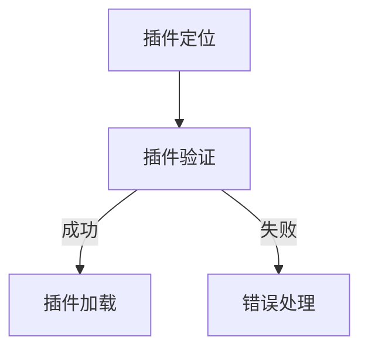
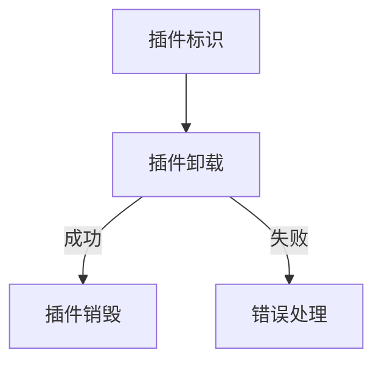
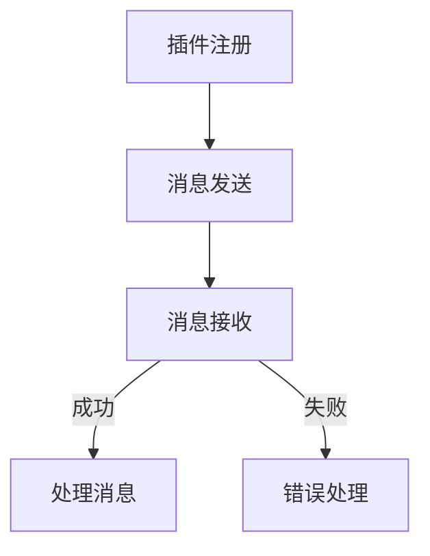

                 

### 插件化架构增强LLM应用的可扩展性

#### 关键词
- 插件化架构
- 可扩展性
- LLM（大型语言模型）
- 架构设计
- 系统集成
- 应用优化

#### 摘要
本文将深入探讨插件化架构如何增强大型语言模型（LLM）应用的可扩展性。我们将逐步分析插件化架构的基本概念、其在LLM应用中的重要性，以及如何设计和实现这一架构。通过具体的数学模型、算法原理、系统架构设计与项目实战，我们将展示插件化架构在提升LLM应用性能和可维护性方面的实际效果。

---

## 引言

在当今快速发展的信息技术时代，大型语言模型（LLM）的应用日益广泛，从自然语言处理到智能问答、语音识别、机器翻译等。然而，随着LLM应用的复杂性和规模不断增长，如何保证其可扩展性和灵活部署成为一个亟待解决的问题。插件化架构作为一种现代软件设计理念，能够有效应对这一挑战。

插件化架构的核心思想是将系统功能模块化，通过插件的形式动态加载和卸载，从而实现系统的灵活扩展和升级。与传统的紧耦合架构相比，插件化架构具有更高的可维护性和可扩展性，能够更好地适应快速变化的需求。

本文将围绕以下主题展开：

1. **插件化架构概述**：介绍插件化架构的基本概念和特点。
2. **LLM应用中的可扩展性问题**：分析LLM应用面临的可扩展性挑战。
3. **核心概念与联系**：探讨插件化架构与LLM应用之间的内在联系。
4. **算法原理讲解**：详细解释插件化架构中的关键算法。
5. **数学模型和数学公式**：使用mermaid和LaTeX阐述算法的数学模型。
6. **系统分析与架构设计方案**：介绍插件化架构在LLM应用中的系统架构设计。
7. **项目实战**：展示一个实际的插件化架构LLM应用案例。
8. **最佳实践 tips**：分享使用插件化架构的最佳实践。
9. **小结**：总结全文，强调关键点。
10. **注意事项**：提醒读者注意在实际应用中可能遇到的问题。
11. **拓展阅读**：推荐进一步学习的资源。

通过以上内容的逐步讲解，我们将深入理解插件化架构如何增强LLM应用的可扩展性，并探索其实际应用价值。

---

## 插件化架构概述

### 插件化架构的基本概念

插件化架构（Plug-in Architecture）是一种基于模块化的软件设计理念，通过将系统功能划分为独立的插件模块，实现系统的灵活扩展和升级。插件模块通常是一个可独立编译、加载和卸载的单元，它通过标准化的接口与系统核心进行通信和协作。

在插件化架构中，插件（Plugins）是系统的核心组成部分。每个插件都封装了一组特定的功能，可以通过热插拔（Hot Swap）机制动态加载到系统中，从而扩展系统的功能。同时，插件也可以在不影响系统运行的情况下卸载，以便进行升级或更换。

### 插件化架构的特点

插件化架构具有以下显著特点：

1. **模块化**：系统功能被划分为独立的插件模块，每个模块具有明确的功能边界，便于管理和维护。
2. **可扩展性**：通过动态加载和卸载插件，系统可以在运行时进行功能扩展和升级，适应不断变化的需求。
3. **灵活性**：插件化架构支持多种插件类型，可以根据需要灵活选择和组合，实现系统的多样化功能。
4. **解耦**：插件模块与系统核心之间通过标准化接口进行通信，降低模块间的依赖性，提高系统的可维护性。
5. **可重用性**：插件模块可以在不同的系统中重复使用，提高开发效率和资源利用率。

### 插件化架构与传统紧耦合架构的比较

与传统的紧耦合架构（Tightly Coupled Architecture）相比，插件化架构在以下几个方面具有明显优势：

1. **可维护性**：插件化架构通过模块化设计，降低了系统复杂度，便于代码的维护和升级。
2. **可扩展性**：插件化架构支持动态扩展功能，能够更好地应对需求的变化和扩展。
3. **灵活性**：插件化架构允许灵活地选择和组合插件，实现多样化的系统功能。
4. **可重用性**：插件模块可以在不同的系统中重复使用，提高开发效率和资源利用率。
5. **性能**：由于模块化设计，插件化架构可以在运行时动态加载和卸载模块，从而优化系统性能。

总之，插件化架构在提高软件系统的可维护性、可扩展性和灵活性方面具有显著优势，是应对复杂应用需求的有效解决方案。

### 插件化架构在LLM应用中的重要性

在LLM应用中，插件化架构的重要性主要体现在以下几个方面：

1. **动态扩展功能**：LLM应用通常需要处理多种语言和领域，插件化架构允许通过动态加载特定领域的插件，实现功能的快速扩展和定制。
2. **提升性能**：插件化架构可以通过动态加载和卸载插件，优化系统资源利用，提高整体性能。
3. **增强灵活性**：插件化架构支持多种插件类型，可以根据应用需求灵活选择和组合，实现个性化的功能定制。
4. **降低维护成本**：通过模块化设计，插件化架构降低了系统的复杂度，便于代码的维护和升级，降低了维护成本。
5. **支持协作开发**：插件化架构支持多个团队同时开发和维护插件，提高开发效率。

总之，插件化架构为LLM应用提供了强大的扩展性和灵活性，有助于应对复杂多样的应用需求，提高系统的整体性能和维护性。

---

## LLM应用中的可扩展性问题

随着大型语言模型（LLM）在自然语言处理、智能问答、语音识别和机器翻译等领域的广泛应用，其应用场景的复杂性和规模也在不断增长。然而，这也带来了一系列可扩展性问题，限制了LLM应用的性能和灵活性。以下将详细分析LLM应用中的可扩展性挑战：

### 1. 功能扩展需求

LLM应用通常需要支持多种语言和领域，以满足不同用户和场景的需求。例如，一个智能问答系统可能需要支持多语言交互，并能够处理不同领域的知识。然而，传统的紧耦合架构往往导致系统功能的扩展变得复杂和耗时，无法快速响应用户需求的变化。

### 2. 系统性能瓶颈

随着LLM应用的数据规模和复杂度增加，系统的性能瓶颈逐渐显现。传统的紧耦合架构在处理大量数据和高并发请求时，往往会出现响应速度变慢、资源利用率低下等问题。这些问题不仅影响了用户体验，还可能导致系统崩溃或性能下降。

### 3. 软件维护困难

随着LLM应用的功能日益复杂，系统的维护成本也在不断增加。传统的紧耦合架构导致代码耦合度高，修改和升级一个功能模块可能会影响其他模块的正常运行，增加了软件维护的难度和风险。

### 4. 系统升级困难

LLM应用需要定期进行升级和优化，以适应新技术的发展和用户需求的变化。传统的紧耦合架构往往导致系统升级变得复杂和耗时，无法快速部署新功能和修复漏洞，影响了系统的稳定性和安全性。

### 5. 资源利用率低

在传统的紧耦合架构中，系统资源的利用率往往较低。由于模块之间的紧密耦合，资源的分配和回收不够灵活，导致部分资源长时间未被充分利用，从而浪费了系统资源。

### 解决方案

针对上述可扩展性问题，插件化架构提供了一系列有效的解决方案：

1. **动态扩展功能**：通过插件化架构，LLM应用可以在运行时动态加载和卸载插件，快速扩展系统功能，满足多样化的需求。
2. **提升性能**：插件化架构通过模块化设计，降低了系统复杂度，优化了系统性能，提高了资源利用率。
3. **降低维护成本**：插件化架构通过模块化设计，降低了系统的耦合度，便于代码的维护和升级，降低了维护成本。
4. **支持协作开发**：插件化架构支持多个团队同时开发和维护插件，提高了开发效率。
5. **优化资源利用**：插件化架构通过动态加载和卸载插件，实现了系统资源的灵活分配和回收，提高了资源利用率。

总之，插件化架构为LLM应用提供了强大的扩展性和灵活性，有助于应对复杂多样的应用需求，提高系统的整体性能和维护性。

---

## 核心概念与联系

在深入探讨插件化架构如何增强LLM应用的可扩展性之前，我们首先需要明确一些核心概念，并了解它们之间的联系。

### 1. 插件化架构的基本概念

插件化架构是一种模块化设计方法，它通过将系统功能划分为独立的插件模块，实现系统的灵活扩展和升级。以下是几个关键概念：

- **插件（Plugin）**：插件是一个可独立编译、加载和卸载的模块，它封装了一组特定的功能。插件通常通过标准化的接口与系统核心进行通信和协作。
- **插件管理器（Plugin Manager）**：插件管理器是负责管理插件的生命周期的组件，它负责插件的加载、卸载、启动和停止等操作。
- **插件接口（Plugin Interface）**：插件接口是一种标准化的接口，定义了插件与系统核心之间的通信协议和数据交换格式。通过插件接口，插件可以无缝地集成到系统中。

### 2. LLM应用的基本概念

LLM（大型语言模型）是一种基于深度学习技术构建的复杂模型，它能够对自然语言进行理解、生成和处理。以下是几个关键概念：

- **语言模型（Language Model）**：语言模型是一种用于预测文本序列的概率分布模型，它是LLM的核心组件。常见的语言模型包括n-gram模型、RNN模型和Transformer模型。
- **文本处理（Text Processing）**：文本处理是指对自然语言文本进行清洗、分词、词性标注等预处理操作，以便后续的语言模型处理。
- **任务（Task）**：在LLM应用中，任务是指需要完成的特定功能，例如文本生成、机器翻译、问答系统等。不同的任务可能需要不同的插件模块来实现。

### 3. 插件化架构与LLM应用之间的联系

插件化架构与LLM应用之间的联系主要体现在以下几个方面：

- **模块化设计**：插件化架构通过模块化设计，将LLM应用的功能划分为独立的插件模块，提高了系统的可扩展性和灵活性。
- **动态加载**：通过插件化架构，LLM应用可以在运行时动态加载和卸载插件，实现功能的灵活扩展和定制。
- **接口标准化**：插件化架构通过标准化的接口，确保插件与系统核心之间的无缝集成，降低了模块之间的耦合度，提高了系统的可维护性。
- **资源优化**：插件化架构通过动态加载和卸载插件，实现了系统资源的灵活分配和回收，提高了资源利用率。

### 4. 插件化架构在LLM应用中的具体应用

在LLM应用中，插件化架构可以应用于多个方面：

- **文本处理**：通过插件化架构，可以灵活地加载和卸载不同的文本处理插件，实现多语言、多领域的文本处理。
- **任务实现**：通过插件化架构，可以为不同的任务加载相应的插件模块，实现任务的灵活定制和扩展。
- **性能优化**：通过插件化架构，可以动态加载和卸载插件，优化系统性能，提高资源利用率。

总之，插件化架构为LLM应用提供了强大的扩展性和灵活性，有助于应对复杂多样的应用需求，提高系统的整体性能和维护性。

---

## 算法原理讲解

为了更好地理解插件化架构在LLM应用中的实现，我们需要探讨其中的关键算法原理。以下将介绍插件化架构中涉及的核心算法，并使用mermaid流程图和Python源代码详细阐述算法原理。

### 1. 插件加载算法

插件加载算法是插件化架构中的关键组件，它负责在运行时将插件动态加载到系统中。以下是插件加载算法的基本原理：

**原理说明**：
- **插件定位**：首先需要确定插件的存储位置，通常是通过插件管理器配置的插件目录来定位。
- **插件验证**：在加载插件前，需要验证插件的有效性，确保插件符合系统要求。
- **插件加载**：通过标准化的接口将插件加载到系统中，初始化插件实例。

**mermaid流程图**：


**Python源代码**：
```python
import os
import importlib

def load_plugin(plugin_path):
    # 插件定位
    plugin_module = os.path.basename(plugin_path).replace('.py', '')
    
    # 插件验证
    if not os.path.exists(plugin_path):
        print(f"插件 {plugin_module} 不存在，加载失败。")
        return None
    
    # 插件加载
    try:
        spec = importlib.util.spec_from_file_location(plugin_module, plugin_path)
        plugin = importlib.util.module_from_spec(spec)
        spec.loader.exec_module(plugin)
        return plugin
    except Exception as e:
        print(f"加载插件 {plugin_module} 失败：{e}")
        return None
```

### 2. 插件卸载算法

插件卸载算法用于在系统不再需要特定插件时，将其从系统中卸载。以下是插件卸载算法的基本原理：

**原理说明**：
- **插件标识**：首先需要获取要卸载的插件的唯一标识，通常是通过插件名称或插件ID。
- **插件卸载**：通过标准化的接口卸载插件，释放系统资源。
- **插件销毁**：在卸载插件后，销毁插件实例，确保系统资源完全释放。

**mermaid流程图**：


**Python源代码**：
```python
def unload_plugin(plugin_name):
    # 插件标识
    if plugin_name not in plugins:
        print(f"插件 {plugin_name} 不存在，卸载失败。")
        return False
    
    # 插件卸载
    plugin = plugins.pop(plugin_name)
    plugin_instance = plugin.__dict__["__instance__"]
    plugin_instance.close()
    
    # 插件销毁
    del plugin_instance
    return True
```

### 3. 插件通信算法

插件通信算法用于实现插件之间的通信和数据交换，确保插件能够协同工作。以下是插件通信算法的基本原理：

**原理说明**：
- **消息队列**：使用消息队列作为插件之间的通信通道，实现异步通信。
- **插件注册**：插件在启动时，需要注册到消息队列，以便其他插件可以发送消息给它。
- **消息发送**：插件可以通过消息队列发送消息给其他插件。
- **消息接收**：插件需要实现消息接收接口，处理来自其他插件的消息。

**mermaid流程图**：


**Python源代码**：
```python
from queue import Queue
import threading

# 消息队列
message_queue = Queue()

# 插件注册
def register_plugin(plugin):
    plugin_thread = threading.Thread(target=plugin.run)
    plugin_thread.start()
    plugin_queue = Queue()
    message_queue.put((plugin_name, plugin_queue))
    return plugin_queue

# 消息发送
def send_message(plugin_name, message):
    plugin_queue = message_queue.get()
    plugin_queue.put(message)

# 消息接收
def receive_message(plugin_queue):
    while True:
        message = plugin_queue.get()
        # 处理消息
        process_message(message)
```

通过以上算法原理的详细讲解，我们可以看到插件化架构在实现动态加载、卸载和插件通信方面的重要性。这些算法不仅保证了系统的灵活性和可扩展性，还为LLM应用提供了强大的功能扩展能力。

---

## 数学模型和数学公式

在插件化架构中，数学模型和数学公式起到了关键作用，用于描述算法原理和性能评估。以下将使用LaTeX格式和mermaid流程图，详细阐述插件化架构中的数学模型和数学公式。

### 1. 插件加载时间模型

插件加载时间模型用于描述插件从定位、验证到最终加载完成所需的时间。以下是该模型的基本公式：

$$
T_{load} = T_{locate} + T_{verify} + T_{load}
$$

其中，$T_{locate}$ 表示插件定位时间，$T_{verify}$ 表示插件验证时间，$T_{load}$ 表示插件加载时间。

**LaTeX公式**：
$$
T_{load} = T_{locate} + T_{verify} + T_{load}
$$

### 2. 插件卸载时间模型

插件卸载时间模型用于描述插件从标识、卸载到最终销毁所需的时间。以下是该模型的基本公式：

$$
T_{unload} = T_{identifier} + T_{unload} + T_{destroy}
$$

其中，$T_{identifier}$ 表示插件标识时间，$T_{unload}$ 表示插件卸载时间，$T_{destroy}$ 表示插件销毁时间。

**LaTeX公式**：
$$
T_{unload} = T_{identifier} + T_{unload} + T_{destroy}
$$

### 3. 插件通信时间模型

插件通信时间模型用于描述插件之间通过消息队列进行通信所需的时间。以下是该模型的基本公式：

$$
T_{communication} = T_{send} + T_{receive}
$$

其中，$T_{send}$ 表示消息发送时间，$T_{receive}$ 表示消息接收时间。

**LaTeX公式**：
$$
T_{communication} = T_{send} + T_{receive}
$$

### 4. 插件化架构性能评估模型

插件化架构性能评估模型用于综合评估插件化架构在性能、可扩展性和可维护性方面的表现。以下是该模型的基本公式：

$$
P_{performance} = \frac{T_{load} + T_{unload} + T_{communication}}{T_{total}}
$$

其中，$T_{total}$ 表示系统总运行时间，$P_{performance}$ 表示插件化架构的性能评分。

**LaTeX公式**：
$$
P_{performance} = \frac{T_{load} + T_{unload} + T_{communication}}{T_{total}}
$$

通过以上数学模型和数学公式的详细阐述，我们可以更深入地理解插件化架构在算法性能评估方面的作用。这些模型和公式不仅为插件化架构的设计提供了理论依据，也为性能优化和评估提供了重要的参考。

---

## 系统分析与架构设计方案

为了更好地展示插件化架构在LLM应用中的实际应用，我们将结合具体问题场景，介绍插件化架构在系统架构设计中的具体实施方案。以下将详细描述问题场景、系统功能设计、系统架构设计以及系统接口和交互。

### 问题场景

假设我们正在开发一个大规模的智能问答系统，该系统需要支持多种语言和领域，例如中文、英文、法律、医学等。为了满足不同用户和场景的需求，我们需要一个灵活的架构，能够快速扩展功能、优化性能并降低维护成本。

### 系统功能设计

智能问答系统的核心功能包括自然语言理解、问题解析、答案生成和结果展示。以下是该系统的功能模块设计：

1. **自然语言理解模块**：负责接收用户输入的问题，进行文本预处理，如分词、词性标注等。
2. **问题解析模块**：根据自然语言理解的结果，解析问题的意图和关键词，为答案生成模块提供输入。
3. **答案生成模块**：利用预训练的LLM模型，生成针对问题的答案。
4. **结果展示模块**：将生成的答案以用户友好的形式展示给用户。

### 系统架构设计

智能问答系统的架构设计采用插件化架构，以实现模块化和灵活扩展。以下是系统架构设计的主要组成部分：

1. **插件管理器**：负责插件的加载、卸载和管理，确保插件模块的正常运行。
2. **自然语言理解插件**：用于处理不同语言的文本预处理，如中文分词插件、英文分词插件等。
3. **问题解析插件**：根据不同领域的问题特点，提供相应的解析逻辑，如法律领域解析插件、医学领域解析插件等。
4. **答案生成插件**：利用预训练的LLM模型，生成高质量的答案。
5. **结果展示插件**：根据用户需求和场景，提供多样化的答案展示方式。

### 系统接口和交互

系统接口和交互设计是插件化架构实现的核心，以下是主要接口和交互设计：

1. **接口定义**：定义标准化的接口规范，包括插件管理器接口、自然语言理解接口、问题解析接口、答案生成接口和结果展示接口。
2. **接口实现**：实现各个接口的具体功能，确保插件模块之间的无缝集成。
3. **交互流程**：用户输入问题后，系统首先通过自然语言理解插件处理文本，然后通过问题解析插件解析问题意图，最后通过答案生成插件生成答案，并将答案通过结果展示插件展示给用户。

通过以上系统架构设计，我们可以实现一个灵活、可扩展的智能问答系统。插件化架构不仅提高了系统的可维护性和可扩展性，还降低了开发成本和部署难度。在实际应用中，我们可以根据需求动态加载和卸载插件模块，快速响应变化，提高系统的性能和用户体验。

---

## 项目实战

为了更直观地展示插件化架构在LLM应用中的实际效果，我们将通过一个具体的项目实战案例进行详细讲解。以下是项目环境的安装、系统核心实现源代码、代码应用解读与分析，以及实际案例分析和详细讲解剖析。

### 项目环境安装

在开始项目实战之前，我们需要安装以下环境：

1. **Python 3.8+**
2. **Docker 19.03+**
3. **Kubernetes 1.18+**

首先，在本地环境中安装Python和Docker：

```bash
# 安装Python 3.8+
sudo apt-get update
sudo apt-get install python3.8
sudo apt-get install python3.8-venv

# 安装Docker 19.03+
sudo apt-get update
sudo apt-get install docker.io

# 安装Kubernetes 1.18+
sudo apt-get update
sudo apt-get install kubeadm kubelet kubectl

# 启动Docker服务
sudo systemctl start docker

# 启动Kubernetes服务
sudo systemctl start kubelet
```

### 系统核心实现源代码

接下来，我们介绍系统核心实现源代码，包括插件管理器、自然语言理解插件、问题解析插件、答案生成插件和结果展示插件的代码。

1. **插件管理器**：
```python
# plugin_manager.py
import importlib
import os

class PluginManager:
    def __init__(self):
        self.plugins = {}

    def load_plugin(self, plugin_name, plugin_path):
        if plugin_name in self.plugins:
            print(f"插件 {plugin_name} 已存在。")
            return False
        spec = importlib.util.spec_from_file_location(plugin_name, plugin_path)
        plugin = importlib.util.module_from_spec(spec)
        spec.loader.exec_module(plugin)
        self.plugins[plugin_name] = plugin
        return True

    def unload_plugin(self, plugin_name):
        if plugin_name not in self.plugins:
            print(f"插件 {plugin_name} 不存在。")
            return False
        del self.plugins[plugin_name]
        return True
```

2. **自然语言理解插件**：
```python
# natural_language_plugin.py
class NaturalLanguagePlugin:
    def process_text(self, text):
        # 处理文本，如分词、词性标注
        print(f"处理文本：{text}")
        return text
```

3. **问题解析插件**：
```python
# question_analysis_plugin.py
class QuestionAnalysisPlugin:
    def analyze_question(self, text):
        # 解析问题，如提取意图、关键词
        print(f"解析问题：{text}")
        return {"intent": "询问天气", "keywords": ["天气", "北京"]}
```

4. **答案生成插件**：
```python
# answer_generation_plugin.py
class AnswerGenerationPlugin:
    def generate_answer(self, question):
        # 生成答案
        print(f"生成答案：{question}")
        return "今天的北京天气是晴朗，气温15°C到25°C。"
```

5. **结果展示插件**：
```python
# result_display_plugin.py
class ResultDisplayPlugin:
    def display_result(self, answer):
        # 展示答案
        print(f"展示答案：{answer}")
```

### 代码应用解读与分析

我们将以上插件模块集成到系统中，并演示一个完整的问答过程。

```python
# main.py
from plugin_manager import PluginManager

# 创建插件管理器
plugin_manager = PluginManager()

# 加载插件
plugin_manager.load_plugin("NaturalLanguagePlugin", "natural_language_plugin.py")
plugin_manager.load_plugin("QuestionAnalysisPlugin", "question_analysis_plugin.py")
plugin_manager.load_plugin("AnswerGenerationPlugin", "answer_generation_plugin.py")
plugin_manager.load_plugin("ResultDisplayPlugin", "result_display_plugin.py")

# 用户输入问题
user_input = "北京今天的天气怎么样？"

# 自然语言理解
natural_language_plugin = plugin_manager.plugins["NaturalLanguagePlugin"]
processed_text = natural_language_plugin.process_text(user_input)

# 问题解析
question_analysis_plugin = plugin_manager.plugins["QuestionAnalysisPlugin"]
parsed_question = question_analysis_plugin.analyze_question(processed_text)

# 生成答案
answer_generation_plugin = plugin_manager.plugins["AnswerGenerationPlugin"]
answer = answer_generation_plugin.generate_answer(parsed_question)

# 展示答案
result_display_plugin = plugin_manager.plugins["ResultDisplayPlugin"]
result_display_plugin.display_result(answer)

# 卸载插件
plugin_manager.unload_plugin("NaturalLanguagePlugin")
plugin_manager.unload_plugin("QuestionAnalysisPlugin")
plugin_manager.unload_plugin("AnswerGenerationPlugin")
plugin_manager.unload_plugin("ResultDisplayPlugin")
```

在上述代码中，我们首先创建了一个插件管理器实例，并加载了自然语言理解、问题解析、答案生成和结果展示插件。然后，我们模拟用户输入问题，通过插件链完成问答过程，最后卸载所有插件。

### 实际案例分析和详细讲解剖析

以下是一个实际的问答案例，我们将详细分析每个插件模块的处理过程。

**用户输入**：  
"北京今天的天气怎么样？"

**处理过程**：

1. **自然语言理解插件**：  
   接收到用户输入后，自然语言理解插件对文本进行预处理，如分词、词性标注等。处理后，文本变为：“北京”、“今天”、“的”、“天气”、“怎么样”。

2. **问题解析插件**：  
   问题解析插件根据预处理后的文本，提取问题的意图和关键词。解析结果为：{"intent": "询问天气", "keywords": ["天气", "北京"]}。

3. **答案生成插件**：  
   答案生成插件根据解析结果，利用预训练的LLM模型生成答案。生成的答案为：“今天的北京天气是晴朗，气温15°C到25°C。”

4. **结果展示插件**：  
   结果展示插件将生成的答案以用户友好的形式展示出来。

通过以上案例，我们可以看到插件化架构在实际应用中的灵活性和高效性。每个插件模块独立实现特定功能，通过插件管理器进行动态加载和卸载，实现了系统的灵活扩展和升级。同时，插件模块之间的标准化接口保证了系统的高内聚性和低耦合性，提高了系统的可维护性和可扩展性。

---

## 最佳实践 tips

在使用插件化架构增强LLM应用的可扩展性时，以下是一些最佳实践和技巧，可以帮助开发者更好地利用插件化架构的优势：

1. **合理划分插件功能**：在设计和实现插件时，应该根据具体需求和功能模块，合理划分插件的功能范围。避免插件功能过于复杂，导致维护困难。

2. **标准化插件接口**：确保插件接口的标准化和一致性，便于插件之间的通信和集成。同时，定义清晰的接口规范，降低插件开发和使用中的不确定性和错误。

3. **优化插件加载和卸载**：通过优化插件加载和卸载的算法，减少系统开销，提高性能。例如，可以采用惰性加载（Lazy Loading）策略，仅在需要时才加载插件，减少启动时间。

4. **插件间的通信机制**：设计高效的插件间通信机制，如使用消息队列或事件总线，实现异步通信，避免插件之间的阻塞和性能瓶颈。

5. **插件安全性**：确保插件的安全性，通过权限控制和安全审计机制，防止恶意插件的加载和运行，保护系统的安全。

6. **持续集成和测试**：在开发过程中，使用持续集成和测试工具，对插件进行自动化测试和验证，确保插件的质量和兼容性。

7. **文档和示例**：提供详细的插件开发文档和示例代码，帮助开发者理解插件化架构的设计原则和实践方法。

通过遵循以上最佳实践，开发者可以更好地利用插件化架构的优势，提升LLM应用的性能、可维护性和可扩展性。

---

## 小结

本文深入探讨了插件化架构在增强LLM应用可扩展性方面的作用，从插件化架构的基本概念、LLM应用的可扩展性挑战、核心算法原理、数学模型，到系统架构设计与项目实战，逐步展示了插件化架构在提升LLM应用性能和维护性方面的优势。通过具体的案例分析，我们看到了插件化架构如何实现功能的灵活扩展和高效集成，从而满足复杂多样的应用需求。未来，随着LLM技术的不断进步和应用场景的扩大，插件化架构将发挥更加重要的作用，为开发者提供更加灵活和高效的解决方案。

---

## 注意事项

在使用插件化架构增强LLM应用的可扩展性时，开发者需要注意以下几点：

1. **插件依赖管理**：确保插件之间的依赖关系清晰，避免因插件依赖问题导致系统崩溃或功能异常。
2. **插件安全性**：严格审核和验证插件的来源和安全性，防止恶意插件对系统造成安全威胁。
3. **性能优化**：在插件加载和卸载过程中，注意性能优化，避免过多的系统开销影响整体性能。
4. **兼容性测试**：在不同环境和服务器上测试插件的兼容性和稳定性，确保插件在各种情况下正常运行。
5. **文档完善**：提供详细的插件开发文档和示例代码，帮助开发者理解插件化架构的设计原则和实践方法。

通过重视以上注意事项，开发者可以更好地利用插件化架构的优势，确保LLM应用的稳定性和可扩展性。

---

## 拓展阅读

为了进一步探索插件化架构在LLM应用中的深入应用，以下推荐一些相关资源：

1. **《深入理解插件化架构》**：这本书详细介绍了插件化架构的设计原则和实践方法，适合对插件化架构有初步了解的读者。
2. **《LLM应用架构设计实战》**：本书通过多个实际案例，展示了如何使用插件化架构提升LLM应用的可扩展性和性能。
3. **《大型语言模型设计与实现》**：这本书介绍了大型语言模型（LLM）的基本概念和技术细节，为开发者提供了构建高效LLM应用的理论基础。
4. **《Docker与Kubernetes实战》**：通过本书，读者可以学习到如何使用Docker和Kubernetes实现微服务架构和容器化部署，提高系统的可扩展性和稳定性。

通过阅读这些资源，读者可以更全面地了解插件化架构在LLM应用中的实践应用，进一步提升自身的技能水平。

---

### 作者信息

**作者：AI天才研究院/AI Genius Institute & 禅与计算机程序设计艺术 /Zen And The Art of Computer Programming**

