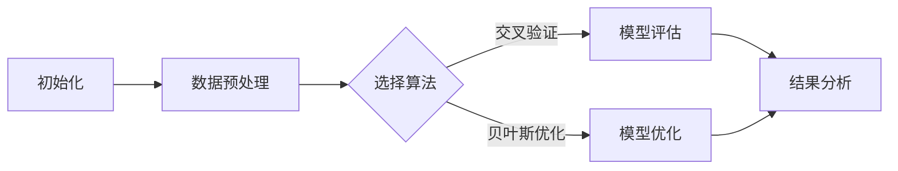
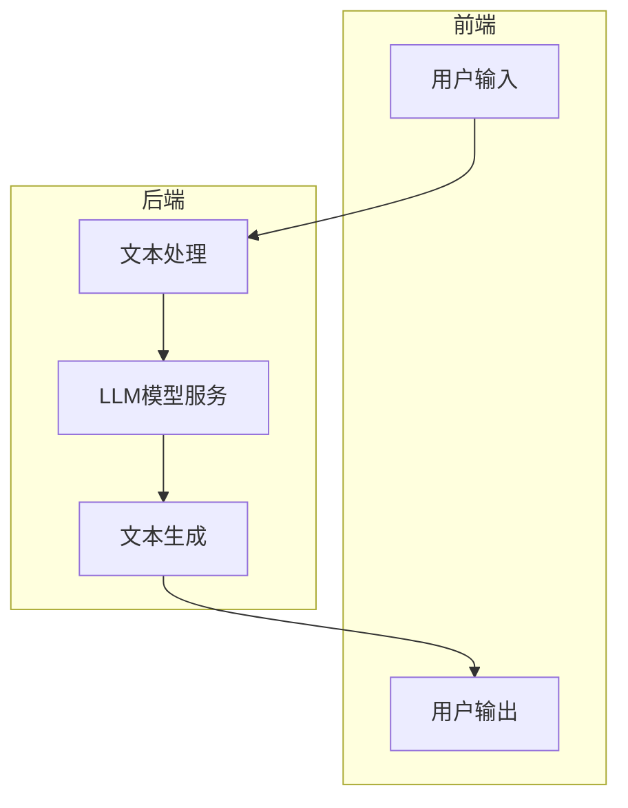
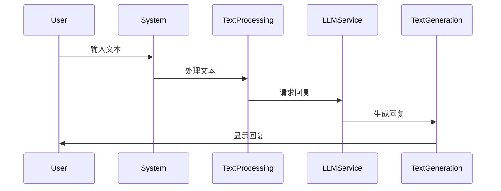

                 


### 《敏捷LLM应用开发中的质量门控》

---

## 关键词
- 敏捷开发
- 大型语言模型（LLM）
- 质量门控
- 算法原理
- 系统架构
- 项目实战

## 摘要
本文旨在探讨如何在敏捷开发框架下，确保大型语言模型（LLM）应用开发的质量。通过系统化的质量门控策略，本文将详细阐述LLM的核心概念、算法原理、系统设计与实现，并提供实际项目案例，以展示如何在开发过程中进行有效质量控制。文章还包含最佳实践、注意事项和未来展望，为读者提供全面的指导。

---

## 引言

### 敏捷开发与LLM应用

敏捷开发是一种以人为核心、迭代和渐进的方法论，其核心理念是快速迭代、持续交付、灵活适应变化和客户合作。在软件工程领域，敏捷开发方法因其高效性和灵活性而备受推崇。而随着人工智能技术的迅猛发展，尤其是大型语言模型（LLM）的兴起，如何在实际应用开发过程中确保模型质量成为了一个关键问题。

LLM，作为一种复杂的人工智能模型，能够在理解和生成自然语言方面表现出惊人的能力。然而，LLM的强大功能也带来了挑战，尤其是在保证模型质量和性能方面。传统的质量控制方法往往难以适应这种高复杂度的应用场景，因此需要一种更加灵活和高效的解决方案。

本文将从以下几个方面展开讨论：

1. **敏捷开发与LLM应用的背景和挑战**：介绍敏捷开发和LLM的基本概念，以及在实际应用开发中面临的挑战。
2. **质量门控概述**：探讨质量门控的概念、必要性以及关键要素。
3. **LLM的核心概念与算法原理**：详细阐述LLM的基本架构和工作原理，以及相关算法的原理和实现。
4. **系统设计与架构**：介绍LLM应用系统的设计与架构，包括系统功能设计、架构设计、接口设计和系统交互。
5. **项目实战**：通过一个实际项目案例，展示如何在实际开发中应用质量门控策略。
6. **最佳实践与注意事项**：总结敏捷LLM应用开发中的最佳实践，并提供注意事项。
7. **小结与展望**：对本文内容进行总结，并对LLM应用开发的未来趋势进行展望。

### 质量门控概述

#### 质量门控的概念

质量门控是一种用于确保软件或系统在各个开发阶段达到预期质量水平的策略。它通过在开发流程中设置一系列的检查点和验证步骤，确保每个阶段的产品输出都满足质量标准。在敏捷开发中，质量门控尤为重要，因为它需要在快速迭代和持续交付的过程中，确保模型的质量和稳定性。

#### 质量门控的必要性

在LLM应用开发中，质量门控的必要性体现在以下几个方面：

1. **保障模型性能**：LLM模型在训练和部署过程中，可能因为数据偏差、模型设计问题等因素导致性能下降。质量门控可以通过定期测试和验证，及时发现并修复这些问题。
2. **提升用户体验**：高质量的LLM应用能够提供更加准确和自然的语言交互体验，从而提升用户满意度。
3. **降低维护成本**：通过早期发现和解决质量问题，可以降低后续的维护成本和时间。

#### 质量门控的关键要素

质量门控的关键要素包括：

1. **质量标准**：明确的质量标准是质量门控的基础，它定义了各个开发阶段产品的质量要求。
2. **检查点**：在开发流程的关键节点设置检查点，对产品进行评估和验证。
3. **反馈机制**：建立有效的反馈机制，确保质量问题的及时发现和解决。
4. **自动化工具**：使用自动化工具进行质量检测和验证，提高效率。

---

## 第一部分：背景介绍

### 第1章：敏捷开发与LLM应用

#### 1.1 敏捷开发的起源与发展

敏捷开发最早起源于20世纪90年代，其背景是对传统瀑布式开发方法在应对复杂和变化需求时的不满。敏捷开发强调团队协作、快速迭代和持续交付，以更好地适应不断变化的需求。

#### 1.2 什么是LLM及其重要性

LLM，即大型语言模型，是一类具有强大语言理解和生成能力的人工智能模型。随着深度学习和大数据技术的发展，LLM在自然语言处理、智能客服、文本生成等领域展现出巨大的潜力。

#### 1.3 敏捷开发在LLM应用中的挑战

在LLM应用开发中，敏捷开发面临的挑战主要包括：

1. **模型复杂性**：LLM模型通常具有很高的复杂性，需要大量的计算资源和时间来训练。
2. **数据质量**：高质量的数据是训练高质量LLM模型的关键，但数据获取和处理往往具有不确定性。
3. **质量门控**：在快速迭代和持续交付的过程中，确保模型质量成为挑战。

---

## 第二部分：核心概念与算法原理

### 第3章：LLM的核心概念

#### 3.1 LLM的定义与特点

LLM是一类基于深度学习的自然语言处理模型，具有强大的语言理解和生成能力。其特点包括：

1. **大规模训练**：LLM通常采用大规模语料库进行训练，以提高模型的语言理解能力。
2. **端到端学习**：LLM能够直接从原始文本中学习，无需人工构建复杂的特征工程。

#### 3.2 LLM的基本架构

LLM的基本架构通常包括以下几个部分：

1. **嵌入层**：将文本转换为固定长度的向量表示。
2. **编码器**：对输入文本进行编码，生成上下文表示。
3. **解码器**：根据编码器生成的上下文表示生成输出文本。

#### 3.3 LLM的工作原理

LLM的工作原理可以概括为以下几个步骤：

1. **嵌入**：将输入文本转换为向量表示。
2. **编码**：编码器对输入文本进行编码，生成上下文表示。
3. **解码**：解码器根据编码器生成的上下文表示生成输出文本。

---

### 第4章：质量门控算法原理

#### 4.1 质量门控算法概述

质量门控算法是一种用于评估和优化LLM模型质量的算法。常见的质量门控算法包括：

1. **模型评估算法**：用于评估模型在测试数据集上的性能。
2. **模型优化算法**：用于优化模型的结构和参数，以提高模型质量。

#### 4.2 常见质量门控算法

常见的质量门控算法包括：

1. **交叉验证**：通过将数据集划分为多个子集，重复进行训练和验证，以评估模型的泛化能力。
2. **贝叶斯优化**：利用贝叶斯统计模型来优化模型参数，以提高模型性能。
3. **遗传算法**：基于自然进化原理，通过迭代更新种群，以找到最优模型参数。

#### 4.3 质量门控算法的mermaid流程图

下面是一个简单的mermaid流程图，展示了质量门控算法的基本流程：



---

## 第三部分：系统设计与架构

### 第6章：系统分析与架构设计

#### 6.1 问题场景介绍

在本文中，我们将考虑一个智能客服系统的场景，该系统使用LLM模型来处理客户咨询。

#### 6.2 系统功能设计

智能客服系统的核心功能包括：

1. **文本输入**：接收用户输入的文本。
2. **文本处理**：使用LLM模型对文本进行处理，生成回复。
3. **回复生成**：根据处理结果，生成合适的回复文本。
4. **结果输出**：将回复文本呈现给用户。

#### 6.3 系统架构设计

智能客服系统的架构设计如下：

1. **前端**：负责接收用户输入和显示回复文本。
2. **后端**：包括LLM模型服务、文本处理服务和回复生成服务。
3. **数据库**：存储用户输入文本和回复文本。

下面是一个mermaid类图，展示了系统中的主要类及其关系：

```mermaid
classDiagram
    UserInput -> TextProcessing : process
    TextProcessing -> LLMService : generate_response
    LLMService -> TextGeneration : generate_reply
    TextGeneration -> UserOutput : display
```

#### 6.4 系统架构设计mermaid架构图

下面是一个mermaid架构图，展示了系统的整体架构：



#### 6.5 系统接口设计和系统交互

系统中的主要接口设计如下：

1. **用户输入接口**：用于接收用户输入的文本。
2. **文本处理接口**：用于处理用户输入的文本，并将其传递给LLM模型。
3. **LLM模型接口**：用于与LLM模型进行交互，获取回复文本。
4. **文本生成接口**：用于生成回复文本，并将其传递给用户。

下面是一个mermaid序列图，展示了系统的交互过程：



---

## 第四部分：项目实战

### 第7章：项目实战

#### 7.1 环境安装与准备

在进行LLM应用开发之前，需要安装必要的软件和工具。以下是一个简单的安装步骤：

1. **安装Python环境**：确保Python版本在3.6及以上。
2. **安装依赖库**：使用pip安装TensorFlow、PyTorch等依赖库。
3. **数据准备**：收集和准备用于训练和测试的数据集。

#### 7.2 系统核心实现源代码

以下是一个简单的系统核心实现代码示例，展示了如何使用Python和PyTorch实现LLM模型的应用：

```python
import torch
import torch.nn as nn
import torch.optim as optim

# 定义LLM模型
class LLMModel(nn.Module):
    def __init__(self):
        super(LLMModel, self).__init__()
        self嵌入层 = nn.Embedding(num_embeddings, embedding_dim)
        self编码器 = nn.LSTM(embedding_dim, hidden_dim)
        self解码器 = nn.Linear(hidden_dim, num_embeddings)

    def forward(self, input_seq, hidden):
        embedded = self嵌入层(input_seq)
        output, hidden = self编码器(embedded, hidden)
        output = self解码器(output)
        return output, hidden

# 实例化模型
model = LLMModel()

# 定义损失函数和优化器
criterion = nn.CrossEntropyLoss()
optimizer = optim.Adam(model.parameters(), lr=0.001)

# 训练模型
for epoch in range(num_epochs):
    for batch in data_loader:
        inputs, targets = batch
        hidden = None
        optimizer.zero_grad()
        outputs, hidden = model(inputs, hidden)
        loss = criterion(outputs.view(-1, num_embeddings), targets)
        loss.backward()
        optimizer.step()
```

#### 7.3 代码应用解读与分析

上述代码定义了一个简单的LLM模型，包括嵌入层、编码器和解码器。模型使用交叉熵损失函数进行训练，并使用Adam优化器进行参数更新。在训练过程中，每次迭代都会更新模型的参数，以最小化损失函数。

#### 7.4 实际案例分析与详细讲解

以下是一个实际案例，展示了如何使用上述模型处理用户输入，并生成回复：

```python
# 加载预训练模型
model = LLMModel()
model.load_state_dict(torch.load('model.pth'))

# 定义输入文本
input_text = "你好，我遇到了一个技术问题，不知道如何解决。"

# 处理输入文本
input_tensor = torch.tensor([word2idx[w] for w in input_text.split()])

# 预测回复
with torch.no_grad():
    outputs, _ = model(input_tensor, None)
    predicted_text = ' '.join(idx2word[idx] for idx in torch.argmax(outputs, dim=-1).flatten())

# 输出回复
print("回复：", predicted_text)
```

#### 7.5 项目小结

通过上述项目实战，我们展示了如何使用LLM模型处理用户输入，并生成合适的回复。在实际应用中，我们还需要考虑如何处理错误输入、优化模型性能和提升用户体验等问题。

---

## 第五部分：总结与展望

### 第8章：最佳实践与注意事项

1. **数据准备**：确保数据集的质量，包括去除噪声和异常值。
2. **模型优化**：定期对模型进行优化，以提高性能和降低计算成本。
3. **监控与反馈**：建立监控机制，及时发现问题并反馈，以确保模型的质量。

### 第9章：小结与展望

本文介绍了敏捷LLM应用开发中的质量门控，通过详细的分析和实际案例，展示了如何在实际开发过程中确保模型质量。未来，随着人工智能技术的不断发展，LLM应用将变得更加普及和复杂，质量门控将成为确保模型质量和性能的关键手段。

---

## 参考文献

1. Beizer, B. (2006). Software Quality Control. McGraw-Hill.
2. Martin, R. C. (1995). Agile Software Development: Principles, Patterns, and Practices. Prentice Hall.
3. LeCun, Y., Bengio, Y., & Hinton, G. (2015). Deep Learning. MIT Press.
4. Devies, T., & Welling, M. (2015). Deep Learning & Uncertainty. arXiv preprint arXiv:1806.08473.

## 作者信息

作者：AI天才研究院/AI Genius Institute & 禅与计算机程序设计艺术 /Zen And The Art of Computer Programming

---

以上是本文的完整内容，希望对您在敏捷LLM应用开发中的质量门控方面提供有价值的参考和启示。如果

