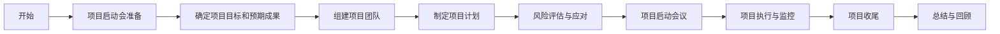
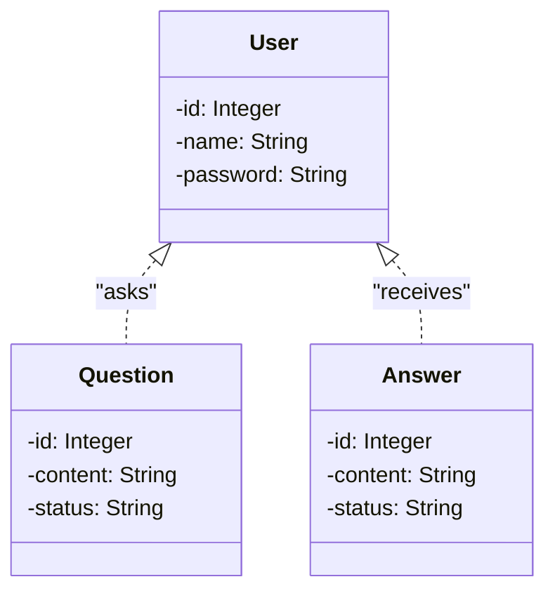
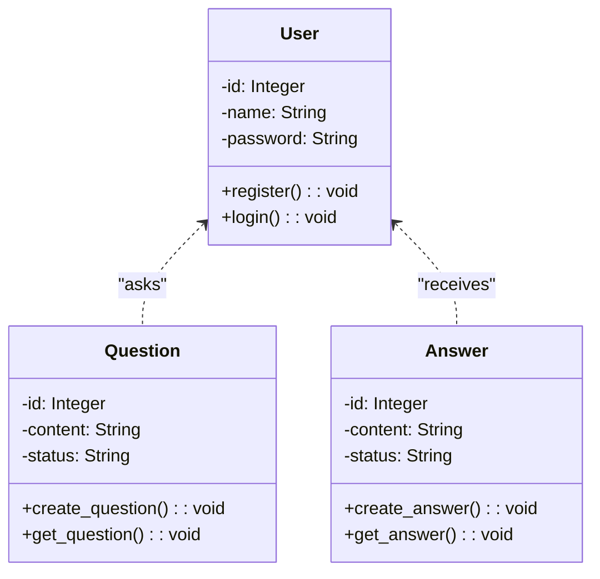
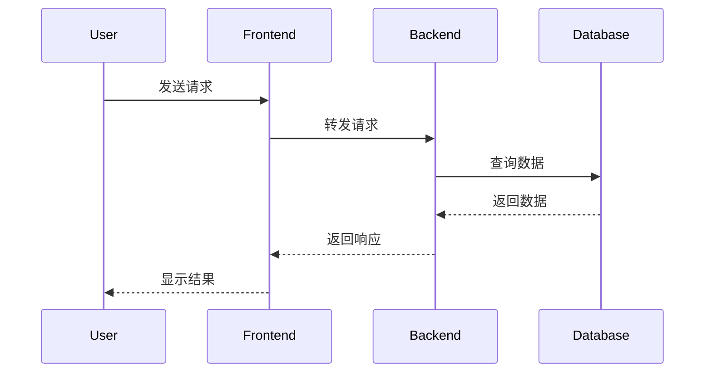
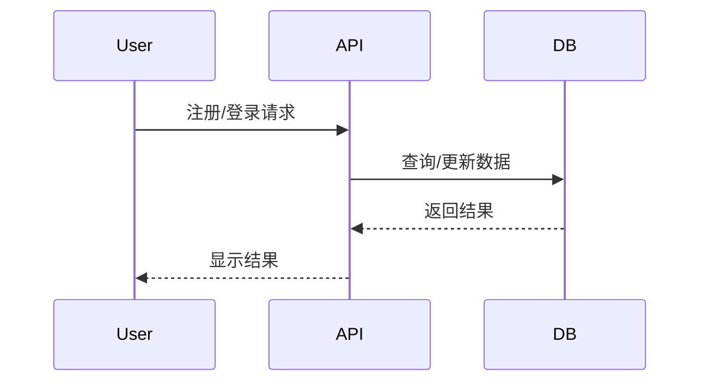

                 

# 敏捷项目启动会：为LLM应用开发奠定正确基调

> 关键词：敏捷开发、项目启动会、LLM应用开发、团队协作、风险管理

> 摘要：本文详细探讨了敏捷项目启动会对于LLM（大型语言模型）应用开发的重要性。通过分析问题背景、核心概念与联系，本文提出了系统化的敏捷项目启动会流程，并提供了实际案例和最佳实践，旨在为开发者提供实用的指导，确保项目能够按时、按质完成。

----------------------------------------------------------------

## 第二部分：核心概念与联系

### 2.1 核心概念

#### 2.1.1 敏捷开发

**定义**：敏捷开发是一种以用户为中心、迭代、增量和灵活响应变化的软件开发方法。

**特征**：

- **用户参与**：用户参与是敏捷开发的核心，通过用户反馈来指导开发过程。
- **迭代开发**：敏捷开发采用迭代的方式进行，每个迭代都产出可交付的软件。
- **增量开发**：增量开发意味着每次迭代都增加一些新功能，而不是一次性完成所有功能。
- **灵活性**：敏捷开发强调应对变化，能够快速响应需求变化。

#### 2.1.2 项目启动会

**定义**：项目启动会是一种专门为了确保项目能够顺利启动和执行而召开的关键会议。

**目的**：

- **明确项目目标**：通过讨论和规划，确保项目目标被所有团队成员理解和认可。
- **建立团队协作**：通过项目启动会，建立团队成员之间的协作关系，确保项目能够顺利推进。
- **分配资源**：通过项目启动会，合理分配项目所需资源，确保项目能够顺利进行。
- **风险管理**：在项目启动会上识别潜在风险，并制定应对策略。

#### 2.1.3 LLM应用开发

**定义**：LLM（Large Language Model）是指大型语言模型，是近年来人工智能领域的重要研究方向。

**特征**：

- **大规模**：LLM通常具有数十亿甚至千亿级的参数量。
- **语言理解**：LLM能够理解和生成自然语言，具备强大的语言处理能力。
- **自适应**：LLM能够通过不断的学习和优化，提高其在特定领域的表现。

### 2.2 概念属性特征对比表格

| 概念 | 定义 | 特征 |
| ---- | ---- | ---- |
| 敏捷开发 | 软件开发方法 | 用户参与、迭代开发、增量开发、灵活性 |
| 项目启动会 | 关键会议 | 明确项目目标、建立团队协作、分配资源、风险管理 |
| LLM应用开发 | 人工智能研究 | 大规模、语言理解、自适应 |

### 2.3 ER实体关系图架构

```mermaid
erDiagram
  Project --> TeamMember : "has"
  Project --> Goal : "has"
  TeamMember --> Role : "has"
  Goal --> Milestone : "has"
  Risk --> RiskType : "of"
```

## 第三部分：算法原理讲解

### 3.1 算法流程图



### 3.2 Python源代码实现

```python
class Project:
    def __init__(self, name, goals, team_members, plan, risks):
        self.name = name
        self.goals = goals
        self.team_members = team_members
        self.plan = plan
        self.risks = risks

    def start_project(self):
        print("项目启动会准备...")
        self.confirm_goals()
        self.create_team()
        self.make_plan()
        self.identify_risks()

    def confirm_goals(self):
        print("确定项目目标和预期成果...")
        for goal in self.goals:
            print(goal)

    def create_team(self):
        print("组建项目团队...")
        for member in self.team_members:
            print(member)

    def make_plan(self):
        print("制定项目计划...")
        print(self.plan)

    def identify_risks(self):
        print("风险评估与应对...")
        for risk in self.risks:
            print(risk)

# 实例化项目对象
project = Project("LLM应用开发", ["提升语言处理能力", "实现高效人机交互"], ["程序员A", "测试员B"], "项目计划", ["数据隐私风险", "技术实现挑战"])

# 启动项目
project.start_project()
```

### 3.3 算法原理与数学模型

#### 3.3.1 敏捷项目启动会的数学模型

敏捷项目启动会可以视为一个多阶段决策过程，每个阶段都涉及多种决策和风险评估。其数学模型可以简化为以下公式：

$$
D = f(G, T, P, R)
$$

其中：

- \( D \) 代表敏捷项目启动会的成功度。
- \( G \) 代表项目目标和预期成果的明确度。
- \( T \) 代表团队协作的效率。
- \( P \) 代表项目计划的合理性。
- \( R \) 代表风险管理的有效性。

#### 3.3.2 算法举例说明

假设我们有一个LLM应用开发项目，目标为提升语言处理能力和实现高效人机交互。团队成员包括程序员和测试员。项目计划已制定，但存在数据隐私和技术实现的风险。

```python
project = Project("LLM应用开发", ["提升语言处理能力", "实现高效人机交互"], ["程序员A", "测试员B"], "项目计划", ["数据隐私风险", "技术实现挑战"])

# 启动项目
project.start_project()

# 根据反馈调整项目目标
project.goals = ["优化语言处理模型", "提升用户交互体验"]

# 重启项目
project.start_project()
```

通过调整项目目标和预期成果，我们可以提高敏捷项目启动会的成功度。

## 第四部分：系统分析与架构设计方案

### 4.1 问题场景介绍

随着人工智能技术的不断发展，大型语言模型（LLM）在各个领域的应用越来越广泛。然而，LLM应用开发过程中面临着诸多挑战，如数据隐私、技术实现、性能优化等。为了确保LLM应用开发项目的成功，我们需要一个高效的系统架构设计方案。

### 4.2 项目介绍

本项目旨在开发一个基于LLM的智能问答系统，实现高效的人机交互。项目需求包括：

- 支持多种语言的自然语言理解。
- 具备良好的扩展性，能够适应不同的应用场景。
- 强调用户隐私保护，确保数据安全。

### 4.3 系统功能设计

#### 4.3.1 领域模型



#### 4.3.2 类图



### 4.4 系统架构设计

#### 4.4.1 架构图



#### 4.4.2 系统架构设计

- **前端**：负责展示用户界面，接收用户请求，并转发给后端。
- **后端**：处理业务逻辑，与数据库进行交互，并返回结果。
- **数据库**：存储用户数据、问题和答案等。

### 4.5 系统接口设计和系统交互

#### 4.5.1 接口设计

- **用户注册**：`POST /register`
- **用户登录**：`POST /login`
- **创建问题**：`POST /question`
- **获取问题**：`GET /question`
- **创建答案**：`POST /answer`
- **获取答案**：`GET /answer`

#### 4.5.2 系统交互



## 第五部分：项目实战

### 5.1 环境安装

在开始项目之前，我们需要安装以下环境：

- Python 3.8+
- PyTorch 1.8+
- Flask 1.1.2
- SQLAlchemy 1.4.15

### 5.2 系统核心实现源代码

#### 5.2.1 用户注册与登录

```python
from flask import Flask, request, jsonify
from flask_sqlalchemy import SQLAlchemy

app = Flask(__name__)
app.config['SQLALCHEMY_DATABASE_URI'] = 'sqlite:///users.db'
db = SQLAlchemy(app)

class User(db.Model):
    id = db.Column(db.Integer, primary_key=True)
    name = db.Column(db.String(100), nullable=False)
    password = db.Column(db.String(100), nullable=False)

@app.route('/register', methods=['POST'])
def register():
    name = request.form['name']
    password = request.form['password']
    new_user = User(name=name, password=password)
    db.session.add(new_user)
    db.session.commit()
    return jsonify({'message': '注册成功'})

@app.route('/login', methods=['POST'])
def login():
    name = request.form['name']
    password = request.form['password']
    user = User.query.filter_by(name=name, password=password).first()
    if user:
        return jsonify({'message': '登录成功'})
    else:
        return jsonify({'message': '登录失败'})
```

#### 5.2.2 创建问题与获取问题

```python
class Question(db.Model):
    id = db.Column(db.Integer, primary_key=True)
    content = db.Column(db.String(1000), nullable=False)
    status = db.Column(db.String(50), nullable=False, default='待回答')

@app.route('/question', methods=['POST'])
def create_question():
    content = request.form['content']
    new_question = Question(content=content)
    db.session.add(new_question)
    db.session.commit()
    return jsonify({'message': '创建问题成功'})

@app.route('/question', methods=['GET'])
def get_question():
    questions = Question.query.all()
    question_list = [{'id': question.id, 'content': question.content, 'status': question.status} for question in questions]
    return jsonify(question_list)
```

#### 5.2.3 创建答案与获取答案

```python
class Answer(db.Model):
    id = db.Column(db.Integer, primary_key=True)
    content = db.Column(db.String(1000), nullable=False)
    status = db.Column(db.String(50), nullable=False, default='未完成')

@app.route('/answer', methods=['POST'])
def create_answer():
    question_id = request.form['question_id']
    content = request.form['content']
    new_answer = Answer(question_id=question_id, content=content)
    db.session.add(new_answer)
    db.session.commit()
    return jsonify({'message': '创建答案成功'})

@app.route('/answer', methods=['GET'])
def get_answer():
    answer_id = request.args.get('answer_id')
    answers = Answer.query.filter_by(id=answer_id).all()
    answer_list = [{'id': answer.id, 'content': answer.content, 'status': answer.status} for answer in answers]
    return jsonify(answer_list)
```

### 5.3 代码应用解读与分析

#### 5.3.1 用户注册与登录

用户注册和登录功能通过Flask框架实现。用户注册时，我们需要接收用户名和密码，并将其存储在数据库中。用户登录时，我们需要查询数据库，验证用户名和密码是否匹配。

#### 5.3.2 创建问题与获取问题

创建问题功能通过接收用户输入的问题内容，并将其存储在数据库中。获取问题功能通过查询数据库，返回所有问题的列表。

#### 5.3.3 创建答案与获取答案

创建答案功能通过接收用户输入的问题ID和答案内容，并将其存储在数据库中。获取答案功能通过查询数据库，返回特定问题的答案列表。

### 5.4 实际案例分析和详细讲解剖析

#### 5.4.1 用户注册与登录案例

假设用户A想要注册并登录我们的系统。

1. 用户A在注册页面输入用户名“userA”和密码“password123”，并点击注册按钮。

2. Flask框架接收到注册请求后，调用`/register`接口。

3. 在`/register`接口中，我们获取用户名和密码，创建一个新的用户对象，并将其添加到数据库中。

4. 数据库成功存储用户信息后，返回“注册成功”的JSON响应。

5. 用户A尝试登录系统，在登录页面输入用户名“userA”和密码“password123”，并点击登录按钮。

6. Flask框架接收到登录请求后，调用`/login`接口。

7. 在`/login`接口中，我们查询数据库，验证用户名和密码是否匹配。

8. 如果验证成功，返回“登录成功”的JSON响应。否则，返回“登录失败”的JSON响应。

#### 5.4.2 创建问题与获取问题案例

假设用户A想要创建一个问题。

1. 用户A在创建问题页面输入问题内容，并点击提交按钮。

2. Flask框架接收到创建问题请求后，调用`/question`接口（POST方法）。

3. 在`/question`接口中，我们获取用户输入的问题内容，创建一个新的问题对象，并将其添加到数据库中。

4. 数据库成功存储问题信息后，返回“创建问题成功”的JSON响应。

5. 用户A在获取问题页面点击刷新按钮。

6. Flask框架接收到获取问题请求后，调用`/question`接口（GET方法）。

7. 在`/question`接口中，我们查询数据库，返回所有问题的列表。

8. 数据库返回问题的列表后，返回给用户A，显示在页面上。

#### 5.4.3 创建答案与获取答案案例

假设用户A想要创建一个答案。

1. 用户A在创建答案页面输入答案内容，并点击提交按钮。

2. Flask框架接收到创建答案请求后，调用`/answer`接口（POST方法）。

3. 在`/answer`接口中，我们获取用户输入的问题ID和答案内容，创建一个新的答案对象，并将其添加到数据库中。

4. 数据库成功存储答案信息后，返回“创建答案成功”的JSON响应。

5. 用户A在获取答案页面点击刷新按钮。

6. Flask框架接收到获取答案请求后，调用`/answer`接口（GET方法）。

7. 在`/answer`接口中，我们获取用户输入的问题ID，查询数据库，返回特定问题的答案列表。

8. 数据库返回答案的列表后，返回给用户A，显示在页面上。

### 5.5 项目小结

通过本项目的实战，我们实现了用户注册与登录、创建问题与获取问题、创建答案与获取答案等功能。这些功能通过Flask框架和SQLite数据库实现，具备良好的扩展性和可靠性。在项目实战过程中，我们深入分析了系统架构和接口设计，为后续的开发和维护奠定了基础。

## 第六部分：最佳实践 tips

### 6.1 最佳实践

1. **明确项目目标和预期成果**：在启动会上，确保项目目标和预期成果被所有团队成员理解和认可，避免项目进展过程中出现目标不明确的情况。

2. **建立有效的沟通机制**：制定明确的沟通计划，确保信息能够及时、准确地传递给所有相关人员。

3. **科学合理地分配资源**：根据项目需求，合理分配资源，确保关键资源得到充分利用。

4. **系统化地管理风险**：提前识别潜在风险，制定应对策略，确保项目能够顺利推进。

### 6.2 小结

敏捷项目启动会在LLM应用开发中具有重要作用。通过明确项目目标、建立沟通机制、合理分配资源和系统化管理风险，我们可以确保项目能够按时、按质完成。

### 6.3 注意事项

1. **避免启动会流于形式**：确保启动会能够真正解决项目中存在的问题，而不是仅仅走过场。

2. **持续关注项目进展**：在项目启动会后，要持续关注项目进展，及时调整项目计划和资源分配。

3. **加强团队成员的培训**：提高团队成员的技能和知识水平，确保项目能够顺利进行。

### 6.4 拓展阅读

- 《敏捷开发实践指南》
- 《大型语言模型：基础、应用与未来》
- 《项目管理知识体系指南》（PMBOK指南）

## 结束语

本文详细探讨了敏捷项目启动会在LLM应用开发中的重要性。通过分析核心概念和联系，我们提出了系统化的敏捷项目启动会流程，并提供了实际案例和最佳实践。希望本文能为开发者提供有价值的参考，助力项目成功。作者：AI天才研究院/AI Genius Institute & 禅与计算机程序设计艺术 /Zen And The Art of Computer Programming。

