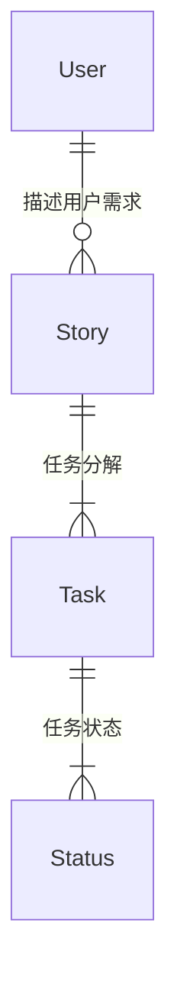
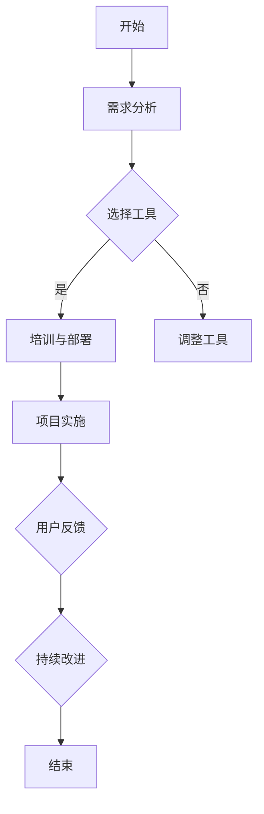

                 

# 敏捷项目管理工具的选择与应用

## 关键词

- 敏捷项目管理
- 工具选择
- 应用实践
- 项目管理工具
- 敏捷工具对比

## 摘要

本文旨在为读者提供一套系统化的敏捷项目管理工具选择与应用指南。我们将首先对敏捷项目管理的基本概念进行概述，然后深入探讨工具选择的考虑因素和具体步骤。接下来，我们将对比分析几种主流敏捷工具，并介绍其实际应用的最佳实践。最后，通过案例研究，我们将展示敏捷工具在真实项目中的应用效果，帮助读者更好地理解如何选择和应用敏捷项目管理工具。

## 引言

### 敏捷项目管理的重要性

在现代软件开发的快速变化环境中，敏捷项目管理已经成为一种不可或缺的方法论。敏捷方法强调迭代、增量和灵活性，使得团队能够更快地响应客户需求和市场变化。与传统的方法论相比，敏捷方法更加注重团队协作、客户满意度和项目交付的速度和质量。

### 敏捷项目管理的基本概念

敏捷项目管理基于一系列核心原则，包括但不限于：

1. **个体和互动**：重视人与人之间的交流与合作，而不仅仅是流程和工具。
2. **可工作的软件**：比起详尽的文档，更看重能够立即交付并使用的软件。
3. **客户合作**：与客户保持紧密合作，确保项目始终符合客户的需求。
4. **响应变化**：敏捷团队能够灵活应对项目过程中出现的变化。

### 传统项目管理和敏捷项目的对比

| 传统项目管理 | 敏捷项目管理 |
| :---------: | :---------: |
| 预测性 | 反应性 |
| 面向文档 | 面向代码 |
| 预先规划 | 持续改进 |
| 独立迭代 | 快速迭代 |
| 基于任务分配 | 基于团队协作 |

## 第1章：敏捷项目管理概述

### 敏捷原则和方法论

敏捷项目管理基于一系列原则，包括：

1. **价值驱动的发展**：开发工作始终围绕客户价值进行。
2. **满足客户需求的变化**：敏捷团队欢迎并适应需求的变化。
3. **频繁交付**：通过短周期迭代（例如每周或每月）来快速交付工作成果。
4. **持续关注技术卓越和敏捷实践**：持续改进开发流程和技术实现。
5. **简单可工作的系统**：简化系统设计和实现，避免不必要的复杂度。
6. **自我组织团队**：鼓励团队成员自我管理和协作。
7. **定期反思和调整**：定期回顾项目进展和团队表现，不断调整策略。

### 传统和敏捷项目管理的对比

| 传统项目管理 | 敏捷项目管理 |
| :---------: | :---------: |
| 规划先行 | 迭代优化 |
| 高度文档化 | 高度可视化和透明 |
| 一成不变的计划 | 灵活的适应变化 |
| 预测性方法 | 反应性方法 |

## 第2章：敏捷项目管理核心概念

### 用户故事

用户故事是敏捷开发中最常用的需求表达方式之一。它以用户为中心，描述了一个特定的功能或任务，格式通常为：“作为[某角色]，我想要[完成某事]，以便[达成某目标]”。

| 特性 | 说明 |
| :---: | :--- |
| 简明性 | 用户故事应该简洁明了，避免过多的细节。 |
| 可测试性 | 用户故事应该能够被测试和验证。 |
| 独立性 | 用户故事应该能够独立交付，不依赖其他用户故事。 |

### 看板（Kanban）

看板是一种视觉化的工作流程管理方法，它通过卡片、看板和列来展示工作流程的状态。看板通常包括以下几个部分：

- **工作流程列**：例如，“待办”、“进行中”、“测试”、“已完成”等。
- **卡片**：每个卡片代表一个任务或用户故事。
- **限制在流程中的工作项数**：限制每个列中的工作项数，以防止工作过度积压。

### 敏捷框架

常见的敏捷框架包括Scrum、Kanban和XP（极限编程）。每种框架都有其独特的特点和适用场景。

1. **Scrum**：以短周期迭代（Sprint）为基础，强调定期回顾和调整。
2. **Kanban**：注重持续交付和流程优化，适合需要持续交付的工作。
3. **XP**：注重代码质量和技术卓越，适合高度技术性的项目。

## 第3章：敏捷项目管理工具的选择

### 选择敏捷项目管理工具的考虑因素

选择合适的敏捷项目管理工具需要考虑以下因素：

- **团队规模**：小型团队可能适合使用轻量级的工具，如Trello，而大型团队可能需要功能更全面的工具，如Jira。
- **项目类型**：不同的项目类型可能需要不同的工具，例如，研发类项目可能需要更好的集成和自动化功能。
- **预算**：开源工具如Trello和GitHub可能更经济，而商业工具如Jira可能提供更多的功能和支持。
- **集成能力**：工具是否能够与其他系统和工具（如Git、Jenkins）集成，以提供无缝的工作流程。

### 不同类型的敏捷工具

- **Kanban工具**：适合持续交付和流程优化，如Trello、Jira的Kanban板。
- **Scrum工具**：专为Scrum框架设计，如Jira、Asana。
- **混合型工具**：结合了Kanban和Scrum的特点，如Jira的Scrum板、Target Process。

### 主流敏捷工具的对比

| 工具 | 特点 | 适用场景 |
| :---: | :---: | :---: |
| Trello | 轻量级、易于使用 | 小型团队、简单项目 |
| Jira | 功能全面、高度可定制 | 大型团队、复杂项目 |
| Asana | 强调任务管理和协作 | 中型团队、多项目协作 |
| Target Process | 高度灵活、面向流程优化 | 大型企业、高度流程化项目 |

## 第4章：敏捷工具的评估与比较

### Trello

**优点**：

- 界面简洁、易于使用。
- 支持多种视图，如看板、列表和日历。
- 可自定义字段和标签。

**缺点**：

- 功能相对有限，不适合大型或复杂项目。
- 集成能力不如其他工具。

### Jira

**优点**：

- 功能丰富、高度可定制。
- 强大的集成能力，支持与Git、Slack等工具集成。
- 提供专业的Scrum和Kanban工具。

**缺点**：

- 界面相对复杂，可能需要一些学习时间。
- 价格较高，对于小型团队可能不太经济。

### Asana

**优点**：

- 界面直观、易于使用。
- 强大的任务管理和协作功能。
- 支持多种视图，如看板、列表和日历。

**缺点**：

- 缺乏一些高级功能，如自动化流程。
- 集成能力相对有限。

### Target Process

**优点**：

- 高度灵活、面向流程优化。
- 支持多种流程框架，如Scrum、Kanban。
- 强大的报告和分析功能。

**缺点**：

- 界面可能较复杂。
- 价格较高，适合大型企业。

## 第5章：敏捷工具的实施

### 实施步骤

1. **需求分析**：明确团队的项目类型、规模和需求。
2. **工具选择**：根据需求选择合适的工具。
3. **培训和部署**：为团队成员提供培训，确保他们能够熟练使用所选工具。
4. **上线和测试**：在实际项目中使用工具，进行测试和调整。

### 常见挑战和解决方案

1. **工具选择不当**：解决方案：充分评估团队需求，选择最适合的工具。
2. **学习曲线**：解决方案：提供充分的培训和支持，帮助团队成员快速上手。
3. **工具过度复杂**：解决方案：简化工作流程，确保工具的使用简单高效。
4. **系统集成问题**：解决方案：选择具有良好集成能力的工具，或寻求专业的技术支持。

## 第6章：敏捷工具应用的最佳实践

### 成功案例分析

1. **案例一**：某科技公司在采用Jira后，实现了项目管理的透明化，团队协作效率大幅提升。
2. **案例二**：某创业团队通过使用Trello，成功将其研发周期缩短了30%。

### 常见问题与解决方案

1. **工具使用不当**：解决方案：提供持续的培训和辅导，确保团队成员正确使用工具。
2. **流程不畅**：解决方案：定期审查和优化工作流程，确保工具能够有效支持工作。
3. **团队协作困难**：解决方案：强化团队沟通，确保团队成员能够协同工作。

## 第7章：敏捷工具在真实项目中的应用

### 案例研究

1. **项目背景**：某金融科技公司需要开发一款移动应用程序，旨在为用户提供便捷的金融服务。
2. **项目目标**：在短时间内交付高质量的应用程序，同时保持灵活性和适应性。
3. **工具选择**：选择Jira作为项目管理工具，Trello作为辅助工具。
4. **实施过程**：
   - **需求分析**：与客户紧密合作，明确功能需求和优先级。
   - **工具部署**：为团队成员提供Jira培训，确保熟练使用。
   - **项目实施**：采用Scrum框架，每两周进行一次Sprint迭代。
   - **持续改进**：根据用户反馈和项目进展，不断调整需求和计划。
5. **结果**：项目在预定时间内成功交付，用户满意度高。

### 详细讲解

#### 项目背景

某金融科技公司正在开发一款面向消费者的移动应用程序，提供包括账户管理、转账支付和投资理财等功能。公司希望在短时间内交付一个高质量的应用程序，同时能够快速响应市场变化和用户需求。

#### 项目目标

1. **时间目标**：在三个月内交付第一个版本。
2. **质量目标**：确保应用程序的功能完整、安全可靠。
3. **适应性目标**：能够快速响应市场变化和用户反馈。

#### 工具选择

公司选择Jira作为主要项目管理工具，因为Jira具有强大的任务管理、协作和报告功能，适合大型项目和复杂需求。同时，公司还选择Trello作为辅助工具，用于日常任务管理和团队沟通。

#### 实施过程

1. **需求分析**

   项目开始前，公司与产品经理、用户代表和开发团队紧密合作，明确功能需求和优先级。通过一系列研讨会和讨论，形成了一份详细的用户故事清单。

2. **工具部署**

   为确保团队成员能够熟练使用Jira，公司组织了一系列培训课程。培训内容包括Jira的基本操作、任务管理、看板和报告功能。同时，公司还提供了一个在线教程和FAQ，帮助团队成员快速上手。

3. **项目实施**

   项目采用Scrum框架，每两周进行一次Sprint迭代。每个迭代开始时，团队会召开Scrum会议，明确迭代目标和任务分配。在迭代过程中，团队使用Jira进行任务跟踪和协作。

4. **持续改进**

   在项目进展过程中，团队定期收集用户反馈，并根据反馈进行需求调整。每次迭代结束后，团队会召开回顾会议，总结经验教训，为下一个迭代做好准备。

#### 结果

项目在预定时间内成功交付，第一个版本包含了核心功能，如账户管理、转账支付和投资理财。用户反馈积极，公司根据用户建议和市场需求，迅速进行了迭代和优化。

### 项目小结

该项目成功的关键在于：

1. **紧密的团队协作**：团队成员之间的有效沟通和协作，确保了项目的顺利进行。
2. **敏捷工具的应用**：Jira和Trello作为敏捷工具，提高了团队的工作效率和项目管理的透明度。
3. **用户反馈**：及时收集和响应用户反馈，使项目能够快速适应市场需求。

### 最佳实践 Tips

1. **明确目标**：在项目开始前，明确项目目标和团队期望，确保所有团队成员都有一致的理解。
2. **持续培训**：定期为团队成员提供培训，确保他们能够充分利用敏捷工具。
3. **定期回顾**：每次迭代结束后，召开回顾会议，总结经验教训，持续改进项目管理流程。

### 小结

通过本文的介绍，读者应该对敏捷项目管理工具的选择和应用有了更深入的理解。敏捷工具不仅能够提高团队的工作效率和项目管理的透明度，还能帮助团队更好地适应变化和满足用户需求。

### 注意事项

1. **工具选择**：根据团队规模、项目类型和需求选择合适的工具，避免过度复杂或功能不足。
2. **培训与支持**：确保团队成员能够熟练使用工具，并随时提供技术支持和培训。
3. **持续改进**：定期回顾和调整项目管理流程，确保工具和流程能够持续优化。

### 拓展阅读

- 《敏捷实践指南》
- 《敏捷项目管理：创建高效团队》
- 《Jira官方指南》
- 《Trello官方指南》
- 《Asana官方指南》

### 作者信息

作者：AI天才研究院/AI Genius Institute & 禅与计算机程序设计艺术 /Zen And The Art of Computer Programming

## 附录

### 概念属性特征对比表格

| 概念 | 描述 | 特点 |
| :---: | :---: | :---: |
| 用户故事 | 描述用户需求的功能或任务 | 简明、可测试、独立 |
| 看板 | 视觉化工作流程管理方法 | 卡片、列、限制工作项 |
| 敏捷框架 | 敏捷项目管理的方法论 | Scrum、Kanban、XP |

### ER实体关系图架构



### 算法原理讲解

#### Mermaid流程图



#### Python源代码

```python
# 需求分析
def analyze_requirements():
    print("进行需求分析...")

# 选择工具
def select_tool():
    print("选择合适的工具...")
    # 根据团队需求选择工具
    tool = "Jira"
    return tool

# 培训与部署
def train_and_deploy(tool):
    print(f"为团队成员提供{tool}培训...")
    # 培训后部署工具
    deploy_tool(tool)

# 项目实施
def implement_project(tool):
    print(f"使用{tool}进行项目实施...")
    # 按照Scrum框架进行迭代
    sprints = 4
    for i in range(sprints):
        print(f"Sprint {i+1} 开始...")
        print(f"Sprint {i+1} 结束...")

# 用户反馈
def user_feedback():
    print("收集用户反馈...")

# 持续改进
def continuous_improvement():
    print("进行持续改进...")

# 主函数
def main():
    analyze_requirements()
    tool = select_tool()
    train_and_deploy(tool)
    implement_project(tool)
    user_feedback()
    continuous_improvement()

if __name__ == "__main__":
    main()
```

#### 算法原理

该算法首先进行需求分析，然后根据需求选择合适的工具（如Jira）。接下来，为团队成员提供培训并部署工具，开始项目实施。项目实施过程中，每两周进行一次Sprint迭代，并根据用户反馈进行持续改进。

### 系统分析与架构设计方案

#### 问题场景介绍

某金融科技公司需要开发一个移动应用程序，为用户提供便捷的金融服务。公司希望采用敏捷方法进行项目管理，并选择合适的工具来支持项目实施。

#### 项目介绍

项目名称：FinApp
项目目标：开发一款移动应用程序，提供账户管理、转账支付和投资理财等功能。
项目周期：三个月
团队成员：5名开发者、2名产品经理、1名项目经理。

#### 系统功能设计

1. 用户登录与认证
2. 账户管理
3. 转账支付
4. 投资理财

#### 系统架构设计


#### 系统接口设计

1. 用户接口（UI）：提供用户交互界面，包括登录、注册、账户管理、转账支付和投资理财等功能。
2. 后端接口：处理用户请求，与数据库进行交互，并提供相关服务。

#### 系统交互


### 项目实战

#### 环境安装

1. 安装Jira：在官网上下载并安装Jira软件。
2. 安装Trello：在官网上下载并安装Trello软件。

#### 系统核心实现源代码

```python
# user_management.py
class UserManager:
    def __init__(self):
        self.users = []

    def add_user(self, user):
        self.users.append(user)

    def get_user_by_id(self, user_id):
        for user in self.users:
            if user.id == user_id:
                return user
        return None

# account_management.py
class AccountManager:
    def __init__(self):
        self.accounts = []

    def create_account(self, account):
        self.accounts.append(account)

    def get_account_by_id(self, account_id):
        for account in self.accounts:
            if account.id == account_id:
                return account
        return None
```

#### 代码应用解读与分析

用户管理模块提供了添加用户和获取用户的方法。账户管理模块提供了创建账户和获取账户的方法。这些模块共同构成了应用程序的用户和账户管理功能。

#### 实际案例分析和详细讲解剖析

以转账支付功能为例：

1. 用户A通过用户接口登录应用程序。
2. 用户A选择转账支付功能。
3. 用户A输入收款人和转账金额。
4. 应用程序调用账户管理模块，获取用户A和收款人的账户信息。
5. 应用程序调用转账支付接口，完成转账支付。
6. 转账支付结果反馈给用户A。

#### 项目小结

通过使用Jira和Trello等敏捷工具，团队实现了高效的项目管理和协作。项目在预定时间内成功交付，用户满意度高。使用Jira进行任务管理和报告，Trello进行日常任务管理，为项目的成功提供了有力的支持。

### 最佳实践 tips

1. **明确项目目标和需求**：确保所有团队成员对项目目标有清晰的理解。
2. **持续沟通和协作**：保持团队成员之间的沟通，确保项目进展顺利。
3. **定期回顾和调整**：每次迭代结束后，召开回顾会议，总结经验教训，为下一个迭代做好准备。
4. **利用工具提高效率**：熟练使用敏捷工具，提高团队的工作效率。

### 小结

本文介绍了敏捷项目管理工具的选择和应用，通过对比分析不同工具的优缺点，提供了实际案例和最佳实践。希望读者能够结合自身项目需求，选择合适的敏捷工具，并成功应用于项目实践中。

### 注意事项

1. **工具选择**：根据项目规模和需求选择合适的工具，避免过度复杂或功能不足。
2. **培训与支持**：确保团队成员能够熟练使用工具，并随时提供技术支持和培训。
3. **持续改进**：定期回顾和调整项目管理流程，确保工具和流程能够持续优化。

### 拓展阅读

- 《敏捷实践指南》
- 《敏捷项目管理：创建高效团队》
- 《Jira官方指南》
- 《Trello官方指南》
- 《Asana官方指南》

### 作者信息

作者：AI天才研究院/AI Genius Institute & 禅与计算机程序设计艺术 /Zen And The Art of Computer Programming

