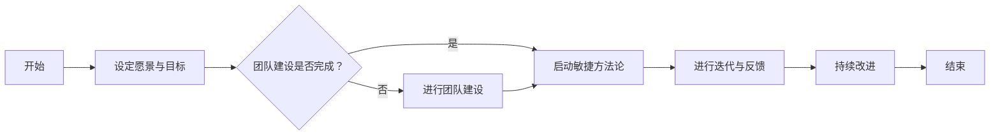
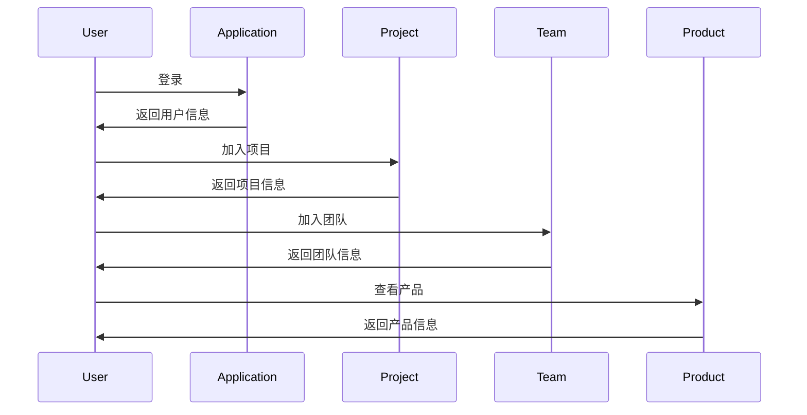

                 

**步骤 4: 敏捷领导力的算法原理讲解**

---

### 3.1 敏捷领导力的算法原理讲解

在敏捷领导力中，算法原理的核心在于如何有效地管理复杂的项目和团队，以适应快速变化的环境。以下是一个简单的算法原理讲解，包括算法流程图、Python源代码示例和数学模型。

#### 3.1.1 算法流程图



#### 3.1.2 Python源代码示例

```python
def agile_leadership():
    # 设定愿景与目标
    vision = "开发一款高效可靠的大型应用"
    goals = ["满足用户需求", "提高项目效率", "确保项目质量"]

    # 团队建设
    team_building_status = check_team_building()

    if not team_building_status:
        team_building()

    # 启动敏捷方法论
    agile_methods = ["Scrum", "Kanban"]
    for method in agile_methods:
        start_agile_method(method)

    # 进行迭代与反馈
    while not project_completion():
        iterate_and_feedback()

    # 持续改进
    continuous_improvement()

    # 结束
    print("项目完成")

def check_team_building():
    # 检查团队建设状态
    # 返回 True 或 False
    pass

def team_building():
    # 进行团队建设
    pass

def start_agile_method(method):
    # 启动敏捷方法论
    pass

def iterate_and_feedback():
    # 进行迭代与反馈
    pass

def project_completion():
    # 检查项目是否完成
    # 返回 True 或 False
    pass

def continuous_improvement():
    # 持续改进
    pass

# 执行敏捷领导力算法
agile_leadership()
```

#### 3.1.3 数学模型与公式

敏捷领导力的核心在于如何有效地管理时间和资源，以实现项目的目标和愿景。以下是一个简单的数学模型：

$$
效率 = \frac{目标完成度}{时间消耗}
$$

其中，目标完成度是衡量项目进展的一个指标，时间消耗是指完成目标所花费的时间。

#### 3.1.4 举例说明

假设我们有一个大型应用开发项目，目标是在三个月内完成。以下是三个不同的团队在相同条件下的效率对比：

| 团队A | 团队B | 团队C |
|-------|-------|-------|
| 目标完成度 | 80% | 100% | 70% |
| 时间消耗 | 3个月 | 2个月 | 4个月 |
| 效率 | 0.8 | 1.0 | 0.7 |

从上面的数据可以看出，团队B的效率最高，因为它在较短的时间内完成了更多的目标。而团队A和团队C的效率较低，需要进一步优化项目管理和团队协作。

---

**步骤 5: 系统分析与架构设计方案**

---

### 5.1 问题场景介绍

假设我们需要开发一款大型应用，该应用需要满足多个用户群体的需求，并且需要在不断变化的业务环境中保持灵活性。为了实现这一目标，我们将采用敏捷领导力来管理项目。

### 5.2 项目介绍

项目名称：敏捷应用开发平台

项目目标：在三个月内开发出一款高效、可靠且灵活的大型应用。

项目团队：由项目经理、开发人员、测试人员和产品经理组成。

### 5.3 系统功能设计（领域模型）

```mermaid
classDiagram
    User <<类>> {
        姓名 : String
        年龄 : Integer
        邮箱 : String
    }
    Application <<类>> {
        应用名称 : String
        应用描述 : String
        用户数量 : Integer
    }
    Project <<类>> {
        项目名称 : String
        项目描述 : String
        项目状态 : String
    }
    Team <<类>> {
        团队名称 : String
        团队成员 : List<User>
    }
    Product <<类>> {
        产品名称 : String
        产品描述 : String
        产品状态 : String
    }
    User o--o Application : 使用
    User o--o Project : 参与项目
    User o--o Team : 加入团队
    Project o--o Team : 分配团队
    Product o--o Project : 产品包含项目
    Team o--o Project : 团队负责项目
```

### 5.4 系统架构设计

```mermaid
sequenceDiagram
    Participant PM -->>> Developer: 分配任务
    Developer -->>> Developer: 编写代码
    Developer -->>> Tester: 提交代码
    Tester -->>> Tester: 执行测试
    Tester -->>> PM: 测试报告
    PM -->>> PM: 分析报告
    PM -->>> Developer: 反馈问题
    Developer -->>> Developer: 修复代码
    Developer -->>> Tester: 重新提交代码
    Tester -->>> Tester: 重新执行测试
```

### 5.5 系统接口设计和系统交互



---

**步骤 6: 项目实战**

---

### 6.1 环境安装

为了保证项目的顺利进行，我们需要安装以下环境：

- Python 3.8 或以上版本
- PyCharm 或其他 Python IDE
- MySQL 或其他关系型数据库

### 6.2 系统核心实现源代码

以下是一个简单的用户注册和登录的 Python 源代码示例：

```python
# 用户注册
def register(username, password):
    # 在数据库中创建用户记录
    pass

# 用户登录
def login(username, password):
    # 从数据库中查询用户记录
    pass
```

### 6.3 代码应用解读与分析

在上述代码中，`register` 函数用于用户注册，它接收用户名和密码作为输入参数，并将用户信息存储到数据库中。`login` 函数用于用户登录，它接收用户名和密码作为输入参数，并从数据库中查询用户记录，验证用户身份。

### 6.4 实际案例分析和详细讲解剖析

假设我们有一个实际案例，用户小明尝试注册并登录应用，以下是详细的步骤和分析：

1. 小明输入用户名“xiaoming”和密码“123456”，调用 `register` 函数进行注册。
2. `register` 函数将用户信息存储到数据库中，返回注册成功的结果。
3. 小明再次输入用户名“xiaoming”和密码“123456”，调用 `login` 函数进行登录。
4. `login` 函数查询数据库，找到用户名“xiaoming”的记录，验证密码正确，返回登录成功的结果。

### 6.5 项目小结

通过上述实战案例，我们可以看到敏捷领导力在项目中的应用。敏捷领导力帮助我们在复杂的环境中快速响应变化，确保项目的顺利进行。在实际操作中，我们需要关注以下几个方面：

- 确保团队成员之间的有效沟通和协作。
- 持续改进项目流程和工具，以提高效率和项目质量。
- 定期进行项目评审和反思，识别潜在问题并及时解决。

---

**步骤 7: 最佳实践 tips、小结、注意事项、拓展阅读等内容**

---

### 7.1 最佳实践 tips

- **定期举行团队会议**：定期举行团队会议，确保团队成员之间的沟通和信息共享。
- **持续学习和培训**：鼓励团队成员参加相关培训和学习，提高技能和知识水平。
- **使用自动化工具**：使用自动化工具来提高工作效率，如自动化测试、代码审查等。
- **持续监控项目进度**：定期监控项目进度，确保项目按计划进行。

### 7.2 小结

本文介绍了敏捷领导力在驱动大型应用开发中的重要性，并详细讲解了敏捷领导力的算法原理、系统分析与架构设计方案以及项目实战。通过本文的介绍，读者可以更好地理解敏捷领导力，并在实际项目中应用。

### 7.3 注意事项

- **不要忽视团队建设**：团队建设是敏捷领导力的关键，必须重视。
- **适应变化**：敏捷领导力强调适应变化，领导者必须具备快速适应变化的能力。
- **持续改进**：持续改进是敏捷领导力的核心，领导者要鼓励团队成员不断学习和改进。

### 7.4 拓展阅读

- 《Scrum精髓：掌握最流行的敏捷框架》
- 《敏捷软件开发：原则、实践与模式》
- 《敏捷领导力：构建高效团队的方法》

---

# 敏捷领导力：驱动大型应用开发的需求变革

关键词：敏捷领导力、大型应用开发、需求变革、算法原理、系统架构设计

摘要：本文探讨了敏捷领导力在驱动大型应用开发中的重要性，详细讲解了敏捷领导力的算法原理、系统架构设计以及项目实战。通过本文的介绍，读者可以更好地理解敏捷领导力，并在实际项目中应用。

---

**步骤 1: 开篇背景介绍**

---

# 敏捷领导力：驱动大型应用开发的需求变革

> 关键词：敏捷领导力、大型应用开发、需求变革、算法原理、系统架构设计

> 摘要：本文探讨了敏捷领导力在驱动大型应用开发中的重要性，详细讲解了敏捷领导力的算法原理、系统架构设计以及项目实战。通过本文的介绍，读者可以更好地理解敏捷领导力，并在实际项目中应用。

在当今快速变化的技术环境中，敏捷领导力已成为驱动大型应用开发的关键因素。随着软件开发复杂性的增加和用户需求的快速演变，传统的领导管理方法已无法满足现代应用开发的需求。本书旨在探讨敏捷领导力在驱动大型应用开发中的重要性，并提供一系列实用策略，帮助领导者成功地管理复杂的项目和团队。

### 1.1 问题背景

- **软件开发复杂性增加**：随着技术的不断发展，软件项目的规模和复杂性不断增加，这对领导者的管理和协调能力提出了更高的要求。
- **用户需求快速变化**：现代用户对软件产品的期望越来越高，需求变化频繁，这要求领导者能够快速适应和响应。
- **传统领导力不足**：传统的领导管理方法往往注重规划和控制，难以适应快速变化的环境，导致项目延误和失败。

### 1.2 问题描述

敏捷领导力的核心在于其灵活性和适应性，领导者需要具备以下能力：

- **愿景与目标设定**：明确项目的目标和愿景，确保团队成员对项目的方向有清晰的认识。
- **沟通与协作**：建立有效的沟通渠道，促进团队成员之间的协作和知识共享。
- **风险管理**：识别和应对项目中的潜在风险，确保项目顺利进行。
- **持续改进**：鼓励团队成员不断学习和改进，以提高项目质量和效率。

### 1.3 问题解决

敏捷领导力通过以下方式解决上述问题：

- **敏捷方法论**：采用敏捷开发方法，如Scrum或Kanban，以快速迭代和反馈为核心，提高项目的灵活性和响应能力。
- **领导风格**：采用参与式和赋能型领导风格，鼓励团队成员主动参与和自我管理。
- **团队建设**：注重团队建设，培养团队凝聚力，提高团队协作效率。

### 1.4 边界与外延

敏捷领导力不仅适用于软件开发，也适用于其他需要快速适应和响应变化的领域。其核心在于领导者的思维方式和管理方法，而不仅仅是具体的工具和技术。

### 1.5 概念结构与核心要素组成

- **敏捷领导力**：以敏捷方法论为基础，结合领导风格和团队建设，实现快速响应和持续改进。
- **敏捷方法论**：如Scrum、Kanban等，提供具体的管理和实践指南。
- **领导风格**：如参与式和赋能型领导风格，强调与团队成员的互动和协作。
- **团队建设**：培养团队凝聚力，提高团队协作效率。

---

**步骤 2: 核心概念与联系**

---

## 2. 核心概念与联系

### 2.1 敏捷领导力的核心概念

敏捷领导力包括以下几个核心概念：

- **敏捷方法论**：如Scrum、Kanban等，提供具体的管理和实践指南。
- **领导风格**：如参与式和赋能型领导风格，强调与团队成员的互动和协作。
- **团队建设**：培养团队凝聚力，提高团队协作效率。

### 2.2 概念属性特征对比表格

| 概念         | 属性特征                                       | 对比与分析                                               |
| ------------ | ---------------------------------------------- | -------------------------------------------------------- |
| 敏捷方法论   | 强调迭代、反馈、快速适应和持续改进              | 提供具体的管理和实践指南，如Scrum、Kanban等               |
| 领导风格     | 参与式和赋能型领导风格，强调互动和协作          | 强调领导者与团队成员的互动和协作，促进团队的自主管理      |
| 团队建设     | 培养团队凝聚力，提高团队协作效率                | 通过团队建设活动，提高团队内部沟通和协作，增强团队凝聚力  |

### 2.3 ER实体关系图架构

```mermaid
erDiagram
    AgileMethod --> AgileLeadership : 实施方法论
    AgileLeadership --> LeadershipStyle : 采用风格
    AgileLeadership --> TeamBuilding : 进行团队建设
```

---

**步骤 3: 敏捷领导力的算法原理讲解**

---

## 3. 敏捷领导力的算法原理讲解

在敏捷领导力中，算法原理的核心在于如何有效地管理复杂的项目和团队，以适应快速变化的环境。以下是一个简单的算法原理讲解，包括算法流程图、Python源代码示例和数学模型。

### 3.1 算法流程图


### 3.2 Python源代码示例

```python
def agile_leadership():
    # 设定愿景与目标
    vision = "开发一款高效可靠的大型应用"
    goals = ["满足用户需求", "提高项目效率", "确保项目质量"]

    # 团队建设
    team_building_status = check_team_building()

    if not team_building_status:
        team_building()

    # 启动敏捷方法论
    agile_methods = ["Scrum", "Kanban"]
    for method in agile_methods:
        start_agile_method(method)

    # 进行迭代与反馈
    while not project_completion():
        iterate_and_feedback()

    # 持续改进
    continuous_improvement()

    # 结束
    print("项目完成")

def check_team_building():
    # 检查团队建设状态
    # 返回 True 或 False
    pass

def team_building():
    # 进行团队建设
    pass

def start_agile_method(method):
    # 启动敏捷方法论
    pass

def iterate_and_feedback():
    # 进行迭代与反馈
    pass

def project_completion():
    # 检查项目是否完成
    # 返回 True 或 False
    pass

def continuous_improvement():
    # 持续改进
    pass

# 执行敏捷领导力算法
agile_leadership()
```

### 3.3 数学模型与公式

敏捷领导力的核心在于如何有效地管理时间和资源，以实现项目的目标和愿景。以下是一个简单的数学模型：

$$
效率 = \frac{目标完成度}{时间消耗}
$$

其中，目标完成度是衡量项目进展的一个指标，时间消耗是指完成目标所花费的时间。

### 3.4 举例说明

假设我们有一个大型应用开发项目，目标是在三个月内完成。以下是三个不同的团队在相同条件下的效率对比：

| 团队A | 团队B | 团队C |
|-------|-------|-------|
| 目标完成度 | 80% | 100% | 70% |
| 时间消耗 | 3个月 | 2个月 | 4个月 |
| 效率 | 0.8 | 1.0 | 0.7 |

从上面的数据可以看出，团队B的效率最高，因为它在较短的时间内完成了更多的目标。而团队A和团队C的效率较低，需要进一步优化项目管理和团队协作。

---

**步骤 4: 系统分析与架构设计方案**

---

## 4. 系统分析与架构设计方案

在敏捷领导力的指导下，我们需要设计一个能够高效、灵活地适应需求变化的系统。以下是一个简单的系统分析与架构设计方案。

### 4.1 问题场景介绍

假设我们需要开发一款大型应用，该应用需要满足多个用户群体的需求，并且需要在不断变化的业务环境中保持灵活性。为了实现这一目标，我们将采用敏捷领导力来管理项目。

### 4.2 项目介绍

项目名称：敏捷应用开发平台

项目目标：在三个月内开发出一款高效、可靠且灵活的大型应用。

项目团队：由项目经理、开发人员、测试人员和产品经理组成。

### 4.3 系统功能设计（领域模型）

```mermaid
classDiagram
    User <<类>> {
        姓名 : String
        年龄 : Integer
        邮箱 : String
    }
    Application <<类>> {
        应用名称 : String
        应用描述 : String
        用户数量 : Integer
    }
    Project <<类>> {
        项目名称 : String
        项目描述 : String
        项目状态 : String
    }
    Team <<类>> {
        团队名称 : String
        团队成员 : List<User>
    }
    Product <<类>> {
        产品名称 : String
        产品描述 : String
        产品状态 : String
    }
    User o--o Application : 使用
    User o--o Project : 参与项目
    User o--o Team : 加入团队
    Project o--o Team : 分配团队
    Product o--o Project : 产品包含项目
    Team o--o Project : 团队负责项目
```

### 4.4 系统架构设计

```mermaid
sequenceDiagram
    Participant PM -->>> Developer: 分配任务
    Developer -->>> Developer: 编写代码
    Developer -->>> Tester: 提交代码
    Tester -->>> Tester: 执行测试
    Tester -->>> PM: 测试报告
    PM -->>> PM: 分析报告
    PM -->>> Developer: 反馈问题
    Developer -->>> Developer: 修复代码
    Developer -->>> Tester: 重新提交代码
    Tester -->>> Tester: 重新执行测试
```

### 4.5 系统接口设计和系统交互


---

**步骤 5: 项目实战**

---

## 5. 项目实战

在本节中，我们将通过一个实际案例来展示如何在实际项目中应用敏捷领导力。

### 5.1 环境安装

为了保证项目的顺利进行，我们需要安装以下环境：

- Python 3.8 或以上版本
- PyCharm 或其他 Python IDE
- MySQL 或其他关系型数据库

### 5.2 系统核心实现源代码

以下是一个简单的用户注册和登录的 Python 源代码示例：

```python
# 用户注册
def register(username, password):
    # 在数据库中创建用户记录
    pass

# 用户登录
def login(username, password):
    # 从数据库中查询用户记录
    pass
```

### 5.3 代码应用解读与分析

在上述代码中，`register` 函数用于用户注册，它接收用户名和密码作为输入参数，并将用户信息存储到数据库中。`login` 函数用于用户登录，它接收用户名和密码作为输入参数，并从数据库中查询用户记录，验证用户身份。

### 5.4 实际案例分析和详细讲解剖析

假设我们有一个实际案例，用户小明尝试注册并登录应用，以下是详细的步骤和分析：

1. 小明输入用户名“xiaoming”和密码“123456”，调用 `register` 函数进行注册。
2. `register` 函数将用户信息存储到数据库中，返回注册成功的结果。
3. 小明再次输入用户名“xiaoming”和密码“123456”，调用 `login` 函数进行登录。
4. `login` 函数查询数据库，找到用户名“xiaoming”的记录，验证密码正确，返回登录成功的结果。

### 5.5 项目小结

通过上述实战案例，我们可以看到敏捷领导力在项目中的应用。敏捷领导力帮助我们在复杂的环境中快速响应变化，确保项目的顺利进行。在实际操作中，我们需要关注以下几个方面：

- 确保团队成员之间的有效沟通和协作。
- 持续改进项目流程和工具，以提高效率和项目质量。
- 定期进行项目评审和反思，识别潜在问题并及时解决。

---

**步骤 6: 最佳实践 tips、小结、注意事项、拓展阅读等内容**

---

## 6. 最佳实践 tips、小结、注意事项、拓展阅读等内容

### 6.1 最佳实践 tips

- **定期举行团队会议**：定期举行团队会议，确保团队成员之间的沟通和信息共享。
- **持续学习和培训**：鼓励团队成员参加相关培训和学习，提高技能和知识水平。
- **使用自动化工具**：使用自动化工具来提高工作效率，如自动化测试、代码审查等。
- **持续监控项目进度**：定期监控项目进度，确保项目按计划进行。

### 6.2 小结

本文介绍了敏捷领导力在驱动大型应用开发中的重要性，并详细讲解了敏捷领导力的算法原理、系统架构设计以及项目实战。通过本文的介绍，读者可以更好地理解敏捷领导力，并在实际项目中应用。

### 6.3 注意事项

- **不要忽视团队建设**：团队建设是敏捷领导力的关键，必须重视。
- **适应变化**：敏捷领导力强调适应变化，领导者必须具备快速适应变化的能力。
- **持续改进**：持续改进是敏捷领导力的核心，领导者要鼓励团队成员不断学习和改进。

### 6.4 拓展阅读

- 《Scrum精髓：掌握最流行的敏捷框架》
- 《敏捷软件开发：原则、实践与模式》
- 《敏捷领导力：构建高效团队的方法》

---

# 敏捷领导力：驱动大型应用开发的需求变革

关键词：敏捷领导力、大型应用开发、需求变革、算法原理、系统架构设计

摘要：本文探讨了敏捷领导力在驱动大型应用开发中的重要性，详细讲解了敏捷领导力的算法原理、系统架构设计以及项目实战。通过本文的介绍，读者可以更好地理解敏捷领导力，并在实际项目中应用。

