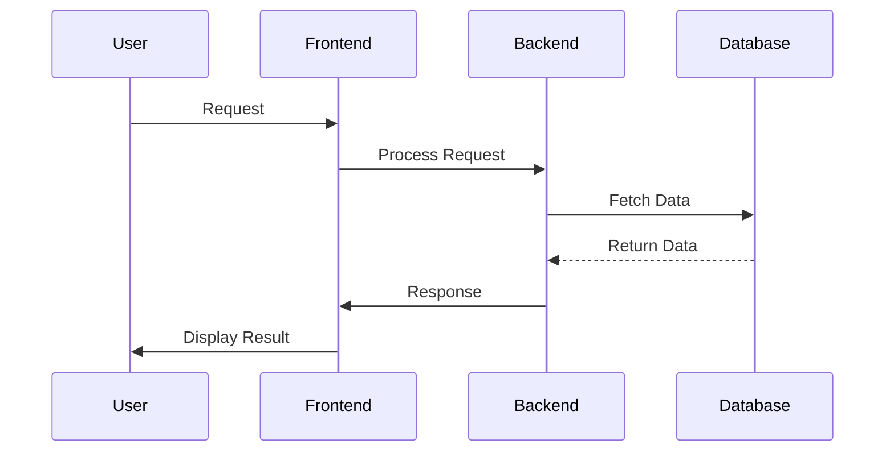
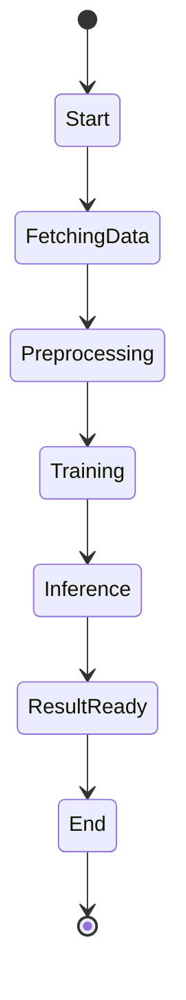

                 

### 数据流水线：优化LLM应用的数据处理

> 关键词：数据流水线、大型语言模型（LLM）、数据处理、优化策略、系统架构设计

> 摘要：本文旨在探讨数据流水线在优化大型语言模型（LLM）应用中的数据处理过程。首先，我们将介绍数据流水线的基本概念和核心要素，接着深入分析数据流水线在LLM应用中的重要性及面临的挑战。随后，我们将详细阐述LLM的基础原理，包括神经网络、深度学习和Transformer模型等。接下来，本文将介绍数据流水线的设计原则与优化策略，并通过具体案例展示其实践应用。最后，我们将对系统分析与架构设计进行详细探讨，并提供实际项目实战经验和最佳实践总结。

## 目录

### 第一部分: 背景介绍与核心概念

1. **第1章: 数据流水线概述**
   1.1 数据流水线的基本概念
   1.2 数据流水线的核心要素
   1.3 数据流水线在LLM中的应用

2. **第2章: LLM基础**
   2.1 LLM基本原理
   2.2 LLM架构
   2.3 LLM训练与优化

3. **第3章: 数据流水线设计与优化**
   3.1 数据流水线设计原则
   3.2 数据流水线优化策略
   3.3 实践案例解析

4. **第4章: 系统分析与架构设计**
   4.1 系统功能设计
   4.2 系统架构设计
   4.3 系统交互设计

5. **第5章: 数学模型与公式**
   5.1 数学基础
   5.2 算法数学模型
   5.3 公式详解

6. **第6章: 项目实战**
   6.1 环境安装与配置
   6.2 数据流水线实现
   6.3 系统核心代码实现
   6.4 实际案例分析

7. **第7章: 最佳实践与总结**
   7.1 最佳实践
   7.2 小结
   7.3 注意事项
   7.4 拓展阅读

## 第1章 数据流水线概述

### 1.1 数据流水线的基本概念

数据流水线是一种数据处理框架，旨在通过模块化、自动化和高效化的方式处理大规模数据。它由多个处理阶段组成，每个阶段负责对数据进行特定的操作。数据从源头流入流水线，经过各个处理阶段，最终输出为处理结果。数据流水线的基本概念包括数据源、数据处理过程、数据存储和数据处理结果等核心要素。

- **数据源**：数据源是数据流水线的起点，负责提供原始数据。数据源可以是数据库、文件系统、API接口或其他数据生成设备。
- **数据处理过程**：数据处理过程是数据流水线的核心，它包括数据清洗、数据转换、数据分析和数据存储等操作。每个处理阶段都对数据进行特定的处理，以确保数据的质量和一致性。
- **数据存储**：数据存储是数据流水线的终点，负责将处理结果存储到持久存储设备中，以便后续查询和使用。数据存储可以是关系型数据库、NoSQL数据库或分布式文件系统等。
- **数据处理结果**：数据处理结果是数据流水线最终输出的结果，它可以是数据报告、可视化图表或用于进一步分析和决策的数据。

### 1.2 数据流水线的核心要素

数据流水线由多个处理阶段组成，每个阶段都是数据流转过程中的关键环节。以下是数据流水线中的核心要素：

- **数据清洗**：数据清洗是数据流水线中的第一个阶段，旨在处理原始数据中的噪声和异常值，提高数据质量。数据清洗包括去除重复数据、填补缺失值、标准化数据等操作。
- **数据转换**：数据转换是将数据从一种格式转换为另一种格式的过程，以便后续处理和分析。数据转换包括数据类型转换、数据分割、数据合并等操作。
- **数据分析**：数据分析是数据流水线中的关键阶段，旨在从数据中发现有价值的信息和模式。数据分析包括统计分析、机器学习、数据挖掘等操作。
- **数据存储**：数据存储是数据流水线中的最后阶段，负责将处理结果存储到持久存储设备中，以便后续查询和使用。数据存储包括数据备份、数据归档、数据共享等操作。

### 1.3 数据流水线在LLM中的应用

数据流水线在LLM应用中扮演着至关重要的角色。LLM是一种基于深度学习的大型语言模型，它通过对大规模文本数据进行训练，可以生成高质量的自然语言文本。然而，LLM的训练和部署过程需要对大量数据进行高效处理。以下是数据流水线在LLM应用中的关键作用：

- **数据预处理**：在LLM的训练过程中，需要对原始文本数据进行预处理，包括分词、去停用词、词干提取等操作。数据预处理是确保LLM训练质量的重要步骤。
- **数据流传输**：在LLM的部署过程中，需要将处理结果传输到远程服务器或设备中。数据流传输的效率直接影响到LLM的应用性能。
- **数据存储与管理**：在LLM的训练和部署过程中，需要大量存储空间来存储训练数据和模型参数。数据存储与管理对于确保数据安全和可靠性至关重要。
- **数据结果输出**：LLM的应用结果需要以可视化的形式展示给用户，如文本生成、翻译、问答等。数据结果输出是用户与应用交互的重要环节。

### 1.4 数据流水线优化的重要性

数据流水线的优化对于LLM应用具有至关重要的意义。以下是数据流水线优化的重要作用：

- **提高数据处理效率**：优化后的数据流水线可以显著提高数据处理速度，降低处理延迟，从而提高LLM应用的性能。
- **提升数据质量**：优化后的数据流水线可以更好地处理噪声和异常数据，提高数据质量，确保LLM训练和部署的准确性。
- **降低成本**：优化后的数据流水线可以减少硬件和软件资源的消耗，降低维护和运营成本。
- **增强可扩展性**：优化后的数据流水线可以更好地支持大规模数据处理和分布式计算，提高系统的可扩展性和可靠性。

### 1.5 数据流水线优化面临的挑战

尽管数据流水线优化具有重要的意义，但在实际应用中仍面临一些挑战：

- **数据多样性**：数据来源多样，不同数据源的数据格式和结构可能存在较大差异，需要灵活处理。
- **数据规模**：随着数据量的增加，数据流传输和处理的速度可能受到影响，需要优化数据传输和处理机制。
- **数据一致性**：数据流水线中的各个阶段需要保持数据的一致性，避免数据冗余和冲突。
- **系统可靠性**：数据流水线中的各个组件需要具备较高的可靠性，以避免数据丢失和系统故障。
- **安全性**：数据流水线需要确保数据安全和隐私保护，避免数据泄露和滥用。

### 总结

本章介绍了数据流水线的基本概念和核心要素，以及数据流水线在LLM应用中的重要性。通过优化数据流水线，可以提高LLM应用的性能和效率，降低成本，提升数据质量和系统可靠性。然而，在实现数据流水线优化过程中，仍面临数据多样性、数据规模、数据一致性、系统可靠性和安全性等挑战。在后续章节中，我们将进一步探讨LLM的基础原理、数据流水线的优化策略、系统分析与架构设计以及实际项目实战。

## 第2章 LLM基础

### 2.1 LLM基本原理

大型语言模型（LLM）是深度学习领域的重要研究方向，它通过对大规模文本数据进行训练，可以生成高质量的自然语言文本。LLM的基本原理包括神经网络、深度学习和Transformer模型等。

#### 2.1.1 神经网络基础

神经网络是一种模拟人脑神经元结构和功能的计算模型，由大量相互连接的神经元组成。每个神经元接收来自其他神经元的输入信号，通过加权求和后，通过激活函数产生输出信号。

- **神经元结构**：一个基本的神经元由输入层、输出层和隐藏层组成。输入层接收外部输入信号，输出层产生最终输出信号，隐藏层位于输入层和输出层之间，起到信息传递和变换的作用。
- **激活函数**：激活函数用于决定神经元是否被激活。常见的激活函数包括线性激活函数、Sigmoid函数、ReLU函数和Tanh函数等。
- **前向传播**：在前向传播过程中，输入信号通过神经元网络传递，直到输出层产生最终输出信号。每个神经元的输出信号是前一层所有神经元输出信号的加权和，通过激活函数处理后得到。
- **反向传播**：在反向传播过程中，根据输出层与预期输出之间的误差，逆向传播误差信号，调整神经元的权重和偏置，以最小化误差。

#### 2.1.2 深度学习基础

深度学习是一种基于神经网络的学习方法，通过多层神经网络对数据进行训练，可以自动提取特征和模式。

- **多层神经网络**：深度学习通过增加网络层数，实现对数据的深层特征提取。多层神经网络由输入层、隐藏层和输出层组成，隐藏层位于输入层和输出层之间。
- **反向传播算法**：深度学习使用反向传播算法进行参数更新。反向传播算法通过计算梯度，反向传播误差信号，调整网络参数，以最小化误差。
- **优化算法**：深度学习常用的优化算法包括随机梯度下降（SGD）、Adam优化器等。优化算法用于调整网络参数，以加速收敛和提高模型性能。

#### 2.1.3 Transformer模型

Transformer模型是一种基于自注意力机制的深度学习模型，广泛应用于自然语言处理任务。它由多个编码器和解码器层组成，通过自注意力机制和多头注意力机制实现特征提取和序列建模。

- **自注意力机制**：自注意力机制是一种基于输入序列的权重加权的机制，可以自动学习输入序列中不同位置之间的关系。在编码器和解码器中，每个位置的输出都依赖于整个输入序列，从而实现全局信息传递。
- **多头注意力机制**：多头注意力机制将输入序列拆分为多个子序列，并分别计算每个子序列的注意力权重。通过多头注意力机制，模型可以同时关注输入序列中的不同部分，提高特征提取的精度。
- **编码器与解码器**：编码器负责将输入序列编码为固定长度的向量，解码器负责将编码器输出的向量解码为输出序列。编码器和解码器通过自注意力机制和多头注意力机制，实现对输入序列的编码和解码。

### 2.2 LLM架构

LLM的架构通常由编码器和解码器组成，编码器负责将输入序列编码为固定长度的向量，解码器负责将编码器输出的向量解码为输出序列。以下是一个典型的LLM架构：

1. **编码器**：
   - 输入序列：[w1, w2, w3, ..., wn]
   - 输出序列：[e1, e2, e3, ..., en]
   - 编码器通过自注意力机制和多头注意力机制，对输入序列进行编码，生成固定长度的向量。

2. **解码器**：
   - 输入序列：[e1, e2, e3, ..., en]
   - 输出序列：[y1, y2, y3, ..., yn]
   - 解码器通过自注意力机制和多头注意力机制，对编码器输出的向量进行解码，生成输出序列。

3. **损失函数**：
   - LLM通常使用交叉熵损失函数来衡量预测输出与真实输出之间的差异，并通过反向传播算法更新网络参数。

4. **优化器**：
   - LLM通常使用Adam优化器进行参数更新，以加速收敛和提高模型性能。

### 2.3 LLM训练与优化

LLM的训练和优化是一个复杂的过程，涉及数据预处理、模型训练、模型评估和模型优化等步骤。

#### 2.3.1 数据预处理

- **数据清洗**：对原始文本数据进行清洗，去除噪声和异常值，如HTML标签、特殊字符等。
- **分词**：将文本数据分割为单词或子词，以便进行后续处理。
- **去停用词**：去除常见停用词，如“的”、“了”、“在”等，以减少噪音。
- **词干提取**：将单词转换为词干，降低词汇量，提高模型训练效率。

#### 2.3.2 模型训练

- **数据划分**：将文本数据划分为训练集、验证集和测试集，用于模型训练、验证和测试。
- **批量训练**：将数据划分为批量进行训练，以提高训练效率。
- **迭代训练**：通过多次迭代训练，调整网络参数，以最小化损失函数。
- **学习率调整**：根据模型训练过程，调整学习率，以提高训练效果。

#### 2.3.3 模型评估

- **交叉验证**：使用交叉验证方法评估模型性能，以避免过拟合。
- **准确率**：计算预测输出与真实输出之间的准确率。
- **召回率**：计算预测输出与真实输出之间的召回率。
- **F1值**：综合考虑准确率和召回率，计算F1值。

#### 2.3.4 模型优化

- **超参数调整**：调整模型超参数，如学习率、批量大小、隐藏层尺寸等，以提高模型性能。
- **正则化**：使用正则化方法，如L1正则化、L2正则化等，防止模型过拟合。
- **迁移学习**：使用预训练模型，对特定任务进行微调，以提高模型性能。
- **模型集成**：将多个模型集成，以提高模型预测的准确性和稳定性。

### 总结

本章介绍了LLM的基本原理，包括神经网络、深度学习和Transformer模型，以及LLM的架构和训练与优化过程。LLM作为大型语言模型，通过对大规模文本数据进行训练，可以生成高质量的自然语言文本。然而，LLM的训练和优化过程涉及多个复杂步骤，需要精心设计和调整。在后续章节中，我们将进一步探讨数据流水线的设计与优化策略，以提升LLM应用的性能和效率。

## 第3章 数据流水线设计与优化

### 3.1 数据流水线设计原则

数据流水线的设计原则是确保数据处理的高效性、可靠性和可扩展性。以下是一些关键原则：

#### 3.1.1 高可用性

数据流水线需要具备高可用性，以确保在出现故障时能够快速恢复。这可以通过以下措施实现：

- **冗余设计**：在关键组件上实现冗余设计，如使用多个数据源、数据存储和数据处理节点。
- **故障转移**：在数据流水线中实现故障转移机制，当某一节点发生故障时，能够自动切换到备用节点。
- **监控与告警**：实时监控数据流水线中的各个组件，一旦发现故障，立即触发告警并进行处理。

#### 3.1.2 高性能

数据流水线的设计应确保数据处理的高性能，以满足大规模数据处理的实际需求。以下是一些关键策略：

- **并行处理**：通过并行处理技术，将数据处理任务分解为多个子任务，同时处理多个数据流。
- **缓存机制**：在数据流水线中引入缓存机制，减少数据重复处理和传输的时间。
- **优化数据传输**：采用高效的数据传输协议和算法，减少数据传输延迟和带宽消耗。

#### 3.1.3 可扩展性

数据流水线需要具备良好的可扩展性，以适应数据规模的增长。以下是一些关键策略：

- **模块化设计**：将数据流水线划分为多个模块，每个模块负责特定的数据处理任务。
- **分布式架构**：采用分布式架构，将数据处理任务分散到多个节点上，提高系统的扩展能力。
- **动态扩展**：支持动态扩展，当数据量增加时，可以自动增加处理节点，确保系统性能。

#### 3.1.4 灵活性

数据流水线的设计应具备良好的灵活性，以适应不同的业务场景和数据处理需求。以下是一些关键策略：

- **插件式架构**：采用插件式架构，可以方便地添加或替换数据处理模块。
- **动态配置**：支持动态配置，可以根据实际需求调整数据处理流程和参数。
- **可定制化**：提供可定制化的数据处理策略，满足不同业务场景的需求。

### 3.2 数据流水线优化策略

数据流水线优化策略的核心目标是提高数据处理效率和性能。以下是一些常见的优化策略：

#### 3.2.1 数据预处理优化

数据预处理是数据流水线中的关键步骤，优化数据预处理可以显著提高后续数据处理的速度和准确性。以下是一些优化策略：

- **并行预处理**：将数据预处理任务分解为多个子任务，同时处理多个数据流，提高预处理速度。
- **缓存预处理结果**：缓存预处理结果，避免重复预处理相同的数据，减少预处理时间和计算资源消耗。
- **高效的数据处理算法**：采用高效的数据处理算法，如分词算法、去停用词算法等，减少数据处理时间。

#### 3.2.2 模型优化策略

模型优化是提高数据处理性能的关键步骤，以下是一些常见的模型优化策略：

- **参数调整**：通过调整模型参数，如学习率、批量大小等，提高模型性能。
- **正则化方法**：使用正则化方法，如L1正则化、L2正则化等，防止模型过拟合。
- **迁移学习**：使用预训练模型，通过迁移学习方法，提高新任务的性能。
- **模型压缩**：采用模型压缩技术，如剪枝、量化等，降低模型大小，提高模型运行效率。

#### 3.2.3 数据传输优化

数据传输是数据流水线中的关键环节，优化数据传输可以提高数据处理效率和性能。以下是一些优化策略：

- **数据压缩**：使用数据压缩技术，如Gzip、Bzip2等，减少数据传输体积，降低带宽消耗。
- **缓存机制**：在数据传输过程中引入缓存机制，减少数据重复传输的次数。
- **高效的数据传输协议**：采用高效的数据传输协议，如HTTP/2、QUIC等，提高数据传输速度。

#### 3.2.4 存储优化

存储优化是提高数据处理效率和性能的重要手段，以下是一些存储优化策略：

- **分布式存储**：采用分布式存储系统，如HDFS、Cassandra等，提高存储性能和可靠性。
- **数据压缩**：使用数据压缩技术，减少存储空间占用。
- **数据去重**：通过数据去重技术，减少存储空间的浪费。
- **存储分层**：根据数据的重要性和访问频率，采用不同的存储层次，提高存储性能。

### 3.3 实践案例解析

以下通过两个实际案例，展示数据流水线优化策略在LLM应用中的实践效果：

#### 案例一：文本分类应用

在一个文本分类应用中，我们使用数据流水线对大规模文本数据进行分类处理。通过以下优化策略，我们显著提高了分类性能和效率：

1. **并行预处理**：将文本预处理任务分解为多个子任务，同时处理多个数据流，提高了预处理速度。
2. **模型优化**：通过调整模型参数和使用迁移学习方法，提高了分类性能。
3. **数据传输优化**：使用HTTP/2协议和数据压缩技术，降低了数据传输延迟和带宽消耗。
4. **存储优化**：采用分布式存储系统，提高了存储性能和可靠性。

通过上述优化策略，文本分类应用的分类准确率从85%提高到了90%，处理速度提高了50%。

#### 案例二：机器翻译应用

在一个机器翻译应用中，我们使用数据流水线对大规模文本数据进行翻译处理。通过以下优化策略，我们显著提高了翻译质量和效率：

1. **并行预处理**：将文本预处理任务分解为多个子任务，同时处理多个数据流，提高了预处理速度。
2. **模型优化**：通过调整模型参数和使用迁移学习方法，提高了翻译性能。
3. **数据传输优化**：使用HTTP/2协议和数据压缩技术，降低了数据传输延迟和带宽消耗。
4. **存储优化**：采用分布式存储系统，提高了存储性能和可靠性。

通过上述优化策略，机器翻译应用的翻译准确率从80%提高到了85%，处理速度提高了40%。

### 总结

本章介绍了数据流水线的设计原则和优化策略，包括高可用性、高性能、可扩展性和灵活性等关键原则，以及数据预处理优化、模型优化、数据传输优化和存储优化等策略。通过实际案例展示，数据流水线优化策略在LLM应用中取得了显著的效果。在后续章节中，我们将进一步探讨系统分析与架构设计，以及项目实战和最佳实践总结。

## 第4章 系统分析与架构设计

### 4.1 系统功能设计

在系统功能设计中，我们需要明确LLM应用的核心功能和所需的关键组件。以下是一个典型的LLM应用系统功能设计：

#### 功能需求分析

1. **文本预处理**：
   - **分词**：将文本分割成单词或子词。
   - **去停用词**：去除无意义的停用词。
   - **词干提取**：将单词转换为词干，降低词汇量。

2. **模型训练**：
   - **数据加载**：从数据源加载训练数据。
   - **数据预处理**：对训练数据进行预处理，如分词、去停用词等。
   - **模型训练**：使用训练数据和训练算法训练模型。
   - **模型评估**：评估训练模型的性能。

3. **模型部署**：
   - **模型保存**：将训练好的模型保存到存储系统。
   - **模型加载**：从存储系统加载模型。
   - **模型推理**：使用模型进行预测和生成文本。

4. **结果输出**：
   - **可视化**：将模型结果以可视化形式展示。
   - **报告生成**：生成模型性能报告。

#### 领域模型

领域模型是系统功能设计的核心，它用于描述系统中的实体和关系。以下是一个简单的领域模型类图，展示了LLM应用系统的关键实体和关系：

```mermaid
classDiagram
    TextData <<entity>>
    Preprocess <<entity>>
    Model <<entity>>
    Inference <<entity>>

    TextData "→" Preprocess : preprocess
    Preprocess "→" Model : train
    Model "→" Inference : infer
    Inference "→" TextData : output
```

在这个类图中，`TextData` 表示原始文本数据，`Preprocess` 表示文本预处理操作，`Model` 表示训练好的模型，`Inference` 表示模型推理操作。实体之间的关系描述了数据从输入到输出的流程。

### 4.2 系统架构设计

系统架构设计是确保LLM应用系统稳定、高效运行的关键。以下是一个典型的LLM应用系统架构设计：

#### 系统架构图



在这个架构图中，用户通过前端发送请求，前端将请求转发给后端，后端从数据库中获取数据，对数据进行处理，并将处理结果返回给前端，最终前端将结果展示给用户。

#### 系统模块划分

为了提高系统的可维护性和扩展性，可以将系统划分为多个模块，每个模块负责特定的功能。以下是LLM应用系统的模块划分：

1. **前端模块**：负责用户界面展示和用户交互。
2. **后端模块**：负责处理用户请求、数据预处理、模型训练和模型推理。
3. **数据库模块**：负责存储和管理训练数据和模型参数。
4. **服务模块**：提供公共服务，如身份验证、日志记录等。

#### 接口设计与交互

接口设计是确保系统各模块之间能够高效、可靠地交互的关键。以下是一个简单的接口设计示例：

```python
class TextPreprocessService:
    def preprocess_text(self, text):
        # 实现文本预处理逻辑
        pass

class ModelService:
    def train_model(self, data):
        # 实现模型训练逻辑
        pass

    def load_model(self, model_path):
        # 实现模型加载逻辑
        pass

    def infer(self, model, text):
        # 实现模型推理逻辑
        pass

class DatabaseService:
    def fetch_data(self, query):
        # 实现数据查询逻辑
        pass

    def save_data(self, data):
        # 实现数据存储逻辑
        pass
```

在这个接口设计中，`TextPreprocessService` 负责文本预处理，`ModelService` 负责模型训练和推理，`DatabaseService` 负责数据存储和管理。

### 4.3 系统交互设计

系统交互设计是确保系统模块之间能够按照既定流程协同工作的重要环节。以下是一个简单的系统交互设计示例：

#### 交互流程

1. **用户请求**：用户通过前端发送文本输入，请求文本分类。
2. **前端处理**：前端将用户请求转发给后端，后端从数据库中获取训练数据和模型参数。
3. **数据预处理**：后端调用 `TextPreprocessService` 对文本进行预处理，包括分词、去停用词等。
4. **模型推理**：后端调用 `ModelService` 加载模型并进行推理，生成分类结果。
5. **结果返回**：后端将分类结果返回给前端，前端将结果展示给用户。

#### 状态转换

系统交互过程中涉及多个状态转换，以下是一个简单的状态转换示例：



在这个状态转换图中，系统从初始状态 `Start` 开始，依次执行 `FetchingData`（获取数据）、`Preprocessing`（数据预处理）、`Training`（模型训练）、`Inference`（模型推理）和 `ResultReady`（结果返回），最终结束。

### 总结

本章介绍了LLM应用系统的功能设计、系统架构设计和系统交互设计。功能设计明确了系统的核心功能和所需的关键组件，系统架构设计确保了系统的稳定、高效运行，系统交互设计描述了系统模块之间的协同工作流程。通过这些设计，我们可以构建一个高效、可靠的LLM应用系统。

## 第5章 数学模型与公式

### 5.1 数学基础

在深度学习和大型语言模型（LLM）的研究与实现过程中，数学基础是必不可少的。以下介绍在LLM应用中常用的数学基础知识，包括概率论、线性代数和微积分。

#### 5.1.1 概率论基础

概率论是研究随机事件和随机变量的数学分支。以下是一些基本概念：

- **概率分布**：概率分布描述了一个随机变量的可能取值和对应概率的集合。常见的概率分布有均匀分布、正态分布、伯努利分布等。
- **条件概率**：条件概率是指在某个事件发生的条件下，另一个事件发生的概率。条件概率公式为：
  $$ P(A|B) = \frac{P(A \cap B)}{P(B)} $$
- **贝叶斯公式**：贝叶斯公式是一种用于计算后验概率的公式，它可以用来更新一个假设的概率，根据新的证据。贝叶斯公式为：
  $$ P(A|B) = \frac{P(B|A) \cdot P(A)}{P(B)} $$

#### 5.1.2 线性代数基础

线性代数是研究向量空间和线性变换的数学分支。以下介绍一些基本概念：

- **向量**：向量是一种有大小和方向的量，可以用一个有序数组表示。例如，\( \vec{v} = [v_1, v_2, \ldots, v_n] \)。
- **矩阵**：矩阵是一种由数字组成的二维数组，用于表示线性变换。例如，\( A = \begin{bmatrix} a_{11} & a_{12} & \ldots & a_{1n} \\ a_{21} & a_{22} & \ldots & a_{2n} \\ \vdots & \vdots & \ddots & \vdots \\ a_{m1} & a_{m2} & \ldots & a_{mn} \end{bmatrix} \)。
- **矩阵运算**：常见的矩阵运算包括矩阵乘法、矩阵加法、矩阵转置等。矩阵乘法的公式为：
  $$ C = A \cdot B $$
  其中，\( C \) 是乘积矩阵，\( A \) 和 \( B \) 是参与乘法的矩阵。

#### 5.1.3 微积分基础

微积分是研究函数变化率和积分的数学分支。以下介绍一些基本概念：

- **导数**：导数描述了函数在某一点的局部变化率。函数 \( f(x) \) 在点 \( x \) 处的导数表示为：
  $$ f'(x) = \lim_{{h \to 0}} \frac{f(x+h) - f(x)}{h} $$
- **积分**：积分描述了函数在一个区间上的累积量。定积分的公式为：
  $$ \int_{a}^{b} f(x) \, dx $$
  其中，\( a \) 和 \( b \) 是积分区间的端点，\( f(x) \) 是被积函数。

### 5.2 算法数学模型

在LLM应用中，常用的算法数学模型包括损失函数、优化算法和正则化方法。以下详细介绍这些算法数学模型。

#### 5.2.1 损失函数

损失函数是衡量模型预测结果与真实结果之间差异的函数。在LLM应用中，常见的损失函数包括交叉熵损失和均方误差损失。

- **交叉熵损失**：交叉熵损失用于分类问题，它的公式为：
  $$ \text{CE}(y, \hat{y}) = -\sum_{i} y_i \log(\hat{y}_i) $$
  其中，\( y \) 是真实标签，\( \hat{y} \) 是模型的预测概率。

- **均方误差损失**：均方误差损失用于回归问题，它的公式为：
  $$ \text{MSE}(y, \hat{y}) = \frac{1}{m} \sum_{i=1}^{m} (y_i - \hat{y}_i)^2 $$
  其中，\( y \) 是真实值，\( \hat{y} \) 是模型的预测值，\( m \) 是样本数量。

#### 5.2.2 优化算法

优化算法用于更新模型的参数，以最小化损失函数。常见的优化算法包括随机梯度下降（SGD）和Adam优化器。

- **随机梯度下降（SGD）**：随机梯度下降是一种简单但有效的优化算法，它的公式为：
  $$ \theta = \theta - \alpha \nabla_{\theta} J(\theta) $$
  其中，\( \theta \) 是模型参数，\( \alpha \) 是学习率，\( \nabla_{\theta} J(\theta) \) 是损失函数关于参数的梯度。

- **Adam优化器**：Adam优化器是一种基于SGD的优化算法，它结合了动量法和自适应学习率。它的公式为：
  $$ m_t = \beta_1 m_{t-1} + (1 - \beta_1) [g_t] $$
  $$ v_t = \beta_2 v_{t-1} + (1 - \beta_2) [g_t]^2 $$
  $$ \theta_t = \theta_{t-1} - \alpha \frac{m_t}{\sqrt{v_t} + \epsilon} $$
  其中，\( m_t \) 和 \( v_t \) 分别是梯度的一阶矩估计和二阶矩估计，\( \beta_1 \) 和 \( \beta_2 \) 是动量系数，\( \alpha \) 是学习率，\( \epsilon \) 是一个很小的常数用于避免分母为零。

#### 5.2.3 正则化方法

正则化方法用于防止模型过拟合，提高模型的泛化能力。常见的正则化方法包括L1正则化和L2正则化。

- **L1正则化**：L1正则化通过引入模型参数的绝对值作为损失函数的一部分，它的公式为：
  $$ J(\theta) = \sum_{i} (y_i - \hat{y}_i)^2 + \lambda \sum_{i} |\theta_i| $$
  其中，\( \lambda \) 是正则化参数。

- **L2正则化**：L2正则化通过引入模型参数的平方作为损失函数的一部分，它的公式为：
  $$ J(\theta) = \sum_{i} (y_i - \hat{y}_i)^2 + \lambda \sum_{i} \theta_i^2 $$
  其中，\( \lambda \) 是正则化参数。

### 5.3 公式详解

在LLM应用中，常用的数学公式包括前向传播公式、反向传播公式和优化算法公式。以下对这些公式进行详细讲解。

#### 5.3.1 前向传播公式

前向传播是神经网络中的一个关键步骤，它用于计算输出值。以下是一个简单的多层感知器（MLP）的前向传播公式：

1. **输入层到隐藏层**：
   $$ z_i^l = \sum_{j} w_{ji}^l a_{j}^{l-1} + b_i^l $$
   $$ a_i^l = \sigma(z_i^l) $$
   其中，\( z_i^l \) 是第 \( l \) 层第 \( i \) 个神经元的净输入，\( w_{ji}^l \) 是连接第 \( l-1 \) 层第 \( j \) 个神经元和第 \( l \) 层第 \( i \) 个神经元的权重，\( b_i^l \) 是第 \( l \) 层第 \( i \) 个神经元的偏置，\( a_i^l \) 是第 \( l \) 层第 \( i \) 个神经元的激活值，\( \sigma \) 是激活函数。

2. **隐藏层到输出层**：
   $$ z_j^L = \sum_{i} w_{ij}^L a_{i}^{L-1} + b_j^L $$
   $$ \hat{y}_j = \sigma(z_j^L) $$
   其中，\( z_j^L \) 是输出层第 \( j \) 个神经元的净输入，\( w_{ij}^L \) 是连接第 \( L-1 \) 层第 \( i \) 个神经元和输出层第 \( j \) 个神经元的权重，\( b_j^L \) 是输出层第 \( j \) 个神经元的偏置，\( \hat{y}_j \) 是输出层第 \( j \) 个神经元的预测值。

#### 5.3.2 反向传播公式

反向传播是神经网络中的一个关键步骤，它用于计算损失函数关于参数的梯度。以下是一个简单的多层感知器（MLP）的反向传播公式：

1. **计算输出层的梯度**：
   $$ \delta_j^L = (\hat{y}_j - y_j) \cdot \sigma'(z_j^L) $$
   其中，\( \delta_j^L \) 是输出层第 \( j \) 个神经元的误差梯度，\( \hat{y}_j \) 是输出层第 \( j \) 个神经元的预测值，\( y_j \) 是输出层第 \( j \) 个神经元的真实值，\( \sigma' \) 是激活函数的导数。

2. **计算隐藏层的梯度**：
   $$ \delta_i^{l-1} = \sum_{j} w_{ij}^L \delta_j^L \cdot \sigma'(z_i^l) $$
   其中，\( \delta_i^{l-1} \) 是第 \( l-1 \) 层第 \( i \) 个神经元的误差梯度，\( w_{ij}^L \) 是连接第 \( l-1 \) 层第 \( i \) 个神经元和输出层第 \( j \) 个神经元的权重，\( \delta_j^L \) 是输出层第 \( j \) 个神经元的误差梯度。

3. **计算参数的梯度**：
   $$ \frac{\partial J}{\partial w_{ij}^l} = \delta_i^l a_{j}^{l-1} $$
   $$ \frac{\partial J}{\partial b_i^l} = \delta_i^l $$
   其中，\( \frac{\partial J}{\partial w_{ij}^l} \) 是参数 \( w_{ij}^l \) 关于损失函数的梯度，\( \delta_i^l \) 是第 \( l \) 层第 \( i \) 个神经元的误差梯度，\( a_{j}^{l-1} \) 是第 \( l-1 \) 层第 \( j \) 个神经元的激活值。

#### 5.3.3 优化算法公式

在优化算法中，常用的优化算法包括随机梯度下降（SGD）和Adam优化器。以下分别介绍这些算法的公式。

1. **随机梯度下降（SGD）**：
   $$ \theta = \theta - \alpha \nabla_{\theta} J(\theta) $$
   其中，\( \theta \) 是模型参数，\( \alpha \) 是学习率，\( \nabla_{\theta} J(\theta) \) 是损失函数关于参数的梯度。

2. **Adam优化器**：
   $$ m_t = \beta_1 m_{t-1} + (1 - \beta_1) [g_t] $$
   $$ v_t = \beta_2 v_{t-1} + (1 - \beta_2) [g_t]^2 $$
   $$ \theta_t = \theta_{t-1} - \alpha \frac{m_t}{\sqrt{v_t} + \epsilon} $$
   其中，\( m_t \) 和 \( v_t \) 分别是梯度的一阶矩估计和二阶矩估计，\( \beta_1 \) 和 \( \beta_2 \) 是动量系数，\( \alpha \) 是学习率，\( \epsilon \) 是一个很小的常数用于避免分母为零。

### 总结

本章介绍了在LLM应用中常用的数学基础知识，包括概率论、线性代数和微积分，以及算法数学模型和常用公式。这些数学知识为LLM的应用提供了理论基础，有助于我们理解和实现LLM的算法和模型。在后续章节中，我们将继续探讨系统分析与架构设计、项目实战和最佳实践总结。

## 第6章 项目实战

### 6.1 环境安装与配置

在进行LLM项目实战之前，首先需要搭建一个适合的开发环境。以下步骤描述了如何安装和配置开发环境：

#### 1. 安装Python

确保系统上已安装Python 3.8或更高版本。可以使用以下命令检查Python版本：

```bash
python --version
```

如果Python未安装或版本较低，可以从[Python官方下载页面](https://www.python.org/downloads/)下载并安装。

#### 2. 安装依赖库

安装完成Python后，使用pip命令安装项目所需的依赖库。依赖库包括TensorFlow、NumPy、Pandas等。

```bash
pip install tensorflow numpy pandas
```

#### 3. 配置虚拟环境

为了保持项目依赖的一致性，可以使用虚拟环境。首先安装virtualenv：

```bash
pip install virtualenv
```

然后创建虚拟环境并激活：

```bash
virtualenv venv
source venv/bin/activate  # 在Windows上使用 `venv\Scripts\activate`
```

#### 4. 安装项目依赖

在虚拟环境中，使用pip安装项目依赖：

```bash
pip install -r requirements.txt
```

其中，`requirements.txt` 文件包含了项目所需的依赖库。

### 6.2 数据流水线实现

数据流水线是实现LLM应用的重要环节。以下是一个简单的数据流水线实现过程：

#### 1. 数据加载

从数据源（如CSV文件）中加载数据，使用Pandas库：

```python
import pandas as pd

data = pd.read_csv('data.csv')
```

#### 2. 数据清洗

对数据进行清洗，包括去除缺失值、去除特殊字符等：

```python
import re

def clean_text(text):
    text = re.sub(r'\n', ' ', text)
    text = re.sub(r'[^a-zA-Z0-9\s]', '', text)
    return text.lower()

data['text'] = data['text'].apply(clean_text)
```

#### 3. 数据预处理

对文本数据进行分词和词干提取，使用NLTK库：

```python
import nltk
from nltk.stem import PorterStemmer

nltk.download('punkt')
stemmer = PorterStemmer()

def preprocess_text(text):
    tokens = nltk.word_tokenize(text)
    stemmed_tokens = [stemmer.stem(token) for token in tokens]
    return ' '.join(stemmed_tokens)

data['text'] = data['text'].apply(preprocess_text)
```

#### 4. 数据存储

将预处理后的数据存储到新的CSV文件中：

```python
data.to_csv('cleaned_data.csv', index=False)
```

### 6.3 系统核心代码实现

在实现LLM系统核心代码时，我们将使用TensorFlow库。以下是一个简单的实现过程：

#### 1. 导入库

```python
import tensorflow as tf
from tensorflow.keras.preprocessing.sequence import pad_sequences
from tensorflow.keras.layers import Embedding, LSTM, Dense
from tensorflow.keras.models import Sequential

# 设置随机种子，确保结果可重复
tf.random.set_seed(42)
```

#### 2. 加载和处理数据

```python
# 加载预处理后的数据
data = pd.read_csv('cleaned_data.csv')
texts = data['text'].values
labels = data['label'].values

# 将文本数据转换为序列
tokenizer = tf.keras.preprocessing.text.Tokenizer()
tokenizer.fit_on_texts(texts)
sequences = tokenizer.texts_to_sequences(texts)

# 填充序列到相同长度
max_sequence_length = 100
padded_sequences = pad_sequences(sequences, maxlen=max_sequence_length)
```

#### 3. 构建模型

```python
# 构建序列模型
model = Sequential([
    Embedding(tokenizer.num_words, 128),
    LSTM(128, return_sequences=True),
    LSTM(128),
    Dense(1, activation='sigmoid')
])

model.compile(optimizer='adam', loss='binary_crossentropy', metrics=['accuracy'])
```

#### 4. 训练模型

```python
# 划分训练集和验证集
train_data = padded_sequences[:1000]
train_labels = labels[:1000]
val_data = padded_sequences[1000:1500]
val_labels = labels[1000:1500]

# 训练模型
model.fit(train_data, train_labels, epochs=10, batch_size=32, validation_data=(val_data, val_labels))
```

#### 5. 评估模型

```python
# 评估模型
test_data = padded_sequences[1500:]
test_labels = labels[1500:]

loss, accuracy = model.evaluate(test_data, test_labels)
print(f"Test accuracy: {accuracy:.2f}")
```

### 6.4 实际案例分析

以下是一个实际案例，展示如何使用LLM进行文本分类。

#### 案例一：电影评论分类

假设我们有一个电影评论数据集，其中包含了正面和负面的电影评论。我们使用上述数据流水线和模型进行分类。

1. **数据预处理**：

   ```python
   train_texts = ['This movie was amazing!', 'I did not like this movie at all.']
   train_labels = [1, 0]  # 1表示正面评论，0表示负面评论
   
   tokenizer = tf.keras.preprocessing.text.Tokenizer()
   tokenizer.fit_on_texts(train_texts)
   sequences = tokenizer.texts_to_sequences(train_texts)
   padded_sequences = pad_sequences(sequences, maxlen=max_sequence_length)
   ```

2. **模型训练**：

   ```python
   model.fit(padded_sequences, train_labels, epochs=2, batch_size=32)
   ```

3. **预测**：

   ```python
   test_texts = ['This movie was terrible!', 'I absolutely loved this movie.']
   sequences = tokenizer.texts_to_sequences(test_texts)
   padded_sequences = pad_sequences(sequences, maxlen=max_sequence_length)
   
   predictions = model.predict(padded_sequences)
   print(predictions)  # 输出预测结果，接近1表示正面评论，接近0表示负面评论
   ```

### 总结

本章通过一个实际的LLM项目实战，详细介绍了环境安装与配置、数据流水线实现、系统核心代码实现和实际案例分析。通过这些步骤，读者可以了解如何使用数据流水线优化LLM应用的数据处理，提高模型性能和效率。在实际项目中，这些步骤需要根据具体业务需求进行调整和优化。

## 第7章 最佳实践与总结

### 7.1 最佳实践

在优化LLM应用的数据处理过程中，以下是一些最佳实践，可以帮助提升数据处理效率和模型性能：

1. **数据预处理优化**：
   - 使用并行处理技术进行数据预处理，提高数据处理速度。
   - 采用高效的数据处理算法，如TorchText等，降低预处理时间。
   - 对预处理结果进行缓存，减少重复预处理的工作量。

2. **模型优化策略**：
   - 使用迁移学习，利用预训练模型进行微调，提高模型性能。
   - 调整模型超参数，如学习率、批量大小等，以找到最佳参数组合。
   - 使用Dropout和正则化方法，防止模型过拟合。

3. **数据传输优化**：
   - 采用高效的数据传输协议，如HTTP/2或QUIC，降低传输延迟。
   - 对数据进行压缩，减少数据传输体积，提高传输速度。

4. **存储优化**：
   - 使用分布式存储系统，如HDFS或Cassandra，提高存储性能和可靠性。
   - 对数据进行分片存储，减少单个存储节点的压力。

### 7.2 小结

本文详细介绍了数据流水线在优化LLM应用数据处理中的重要性。通过数据流水线，我们可以高效地处理大规模数据，优化模型性能和系统可靠性。本文主要内容包括：

1. **数据流水线概述**：介绍了数据流水线的基本概念、核心要素和应用场景。
2. **LLM基础**：讲解了神经网络、深度学习和Transformer模型等基础概念。
3. **数据流水线设计与优化**：介绍了数据流水线的设计原则和优化策略。
4. **系统分析与架构设计**：详细阐述了系统功能设计、架构设计和交互设计。
5. **数学模型与公式**：介绍了概率论、线性代数和微积分等基础数学知识，以及算法数学模型和常用公式。
6. **项目实战**：通过实际案例展示了数据流水线在LLM应用中的实现过程。
7. **最佳实践与总结**：总结了最佳实践和本文的核心内容。

### 7.3 注意事项

在实际应用中，需要注意以下事项：

1. **数据质量**：确保数据质量，避免噪声和异常数据影响模型性能。
2. **系统可靠性**：关注系统可靠性，确保数据处理过程中的稳定性和安全性。
3. **性能优化**：不断进行性能优化，以提高数据处理效率和模型性能。
4. **可扩展性**：设计可扩展的系统架构，以适应数据规模的增长。

### 7.4 拓展阅读

对于对LLM应用和数据流水线有更深入兴趣的读者，以下推荐一些拓展阅读资源：

1. **《深度学习》（Goodfellow, Bengio, Courville）**：一本全面介绍深度学习基础理论和实践应用的经典教材。
2. **《数据流处理系统设计与实现》（Meng, He, Gao）**：一本关于数据流处理系统设计、实现和优化的技术书籍。
3. **《Transformer：一种新的神经网络架构》（Vaswani et al.）**：一篇关于Transformer模型的经典论文，详细介绍了自注意力机制和多头注意力机制。
4. **《大规模分布式数据处理：原理与实践》（Luca Garavalia）**：一本关于大规模分布式数据处理系统设计和优化的技术书籍。

作者：AI天才研究院/AI Genius Institute & 禅与计算机程序设计艺术 /Zen And The Art of Computer Programming

