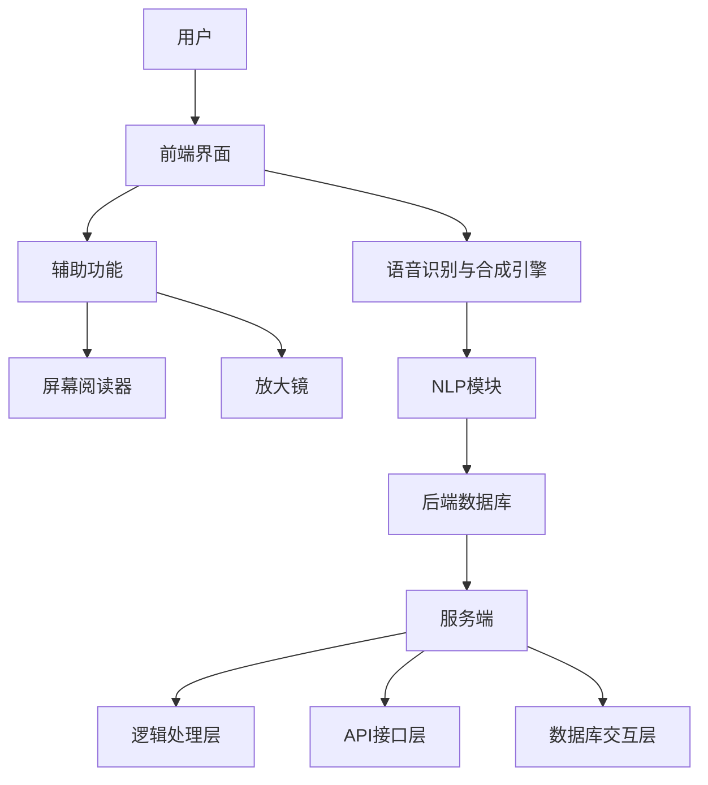
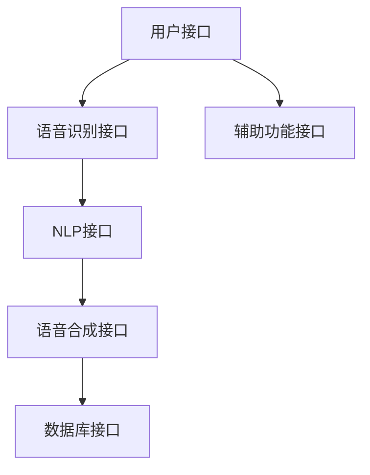
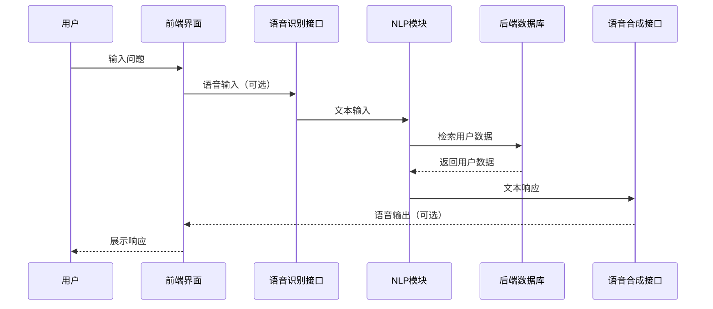

                 

# 无障碍设计原则在LLM应用架构中的应用

## 摘要

本文旨在探讨无障碍设计原则在大型语言模型（LLM）应用架构中的重要性及其具体应用。通过深入分析无障碍设计原则、LLM的基本概念及其应用场景，本文揭示了无障碍设计在提高用户体验、增强产品功能性和合规性方面的关键作用。文章随后详细阐述了无障碍设计原则与LLM算法原理的结合，包括相关的数学模型和公式，并通过mermaid图和Python代码进行说明。此外，文章还介绍了系统分析与架构设计方案，包括问题场景、功能设计、架构设计、接口设计及系统交互。通过具体案例的实战分析和讲解，本文进一步展示了无障碍设计原则在实际项目中的应用效果，并总结出最佳实践和注意事项，为未来的研究和应用提供了有益的参考。

## 1. 设计大纲结构

在设计本文的大纲结构时，我们首先需要明确文章的核心内容和结构。本文将分为以下几个主要部分：

### 1.1 引言
- **无障碍设计原则概述**：介绍无障碍设计原则的定义、重要性以及核心要素。
- **LLM的基本概念**：阐述LLM的定义、特点和应用场景。
- **无障碍设计原则与LLM的关系**：分析无障碍设计原则在LLM中的应用及其重要性。

### 1.2 核心概念与联系
- **无障碍设计原则**：详细介绍无障碍设计原则的定义、核心要素和评估标准。
- **LLM应用架构**：解释LLM的应用架构，包括其基本架构和如何在其中应用无障碍设计原则。

### 1.3 算法原理讲解
- **LLM的算法原理**：深入探讨LLM的算法原理，包括模型训练、优化和推理过程。
- **无障碍设计原则在算法中的应用**：讨论无障碍设计原则如何影响和优化LLM的算法设计。

### 1.4 数学模型和数学公式
- **相关的数学模型**：介绍与LLM算法相关的数学模型。
- **数学公式的详细讲解**：对数学公式进行详细解释，并通过Python代码示例说明。

### 1.5 系统分析与架构设计方案
- **问题场景介绍**：描述实际应用场景，明确问题和目标。
- **系统功能设计**：介绍系统的功能设计，包括领域模型和类图。
- **系统架构设计**：展示系统的架构设计，包括整体架构图和接口设计。
- **系统交互**：通过mermaid序列图展示系统的交互流程。

### 1.6 项目实战
- **环境安装**：介绍如何安装所需的环境和工具。
- **系统核心实现**：展示系统核心实现的源代码。
- **代码应用解读**：对核心代码进行解读和分析。
- **实际案例分析和详细讲解**：通过具体案例展示无障碍设计原则的应用。
- **项目小结**：总结项目的主要成果和经验。

### 1.7 最佳实践与小结
- **最佳实践**：总结无障碍设计原则在LLM应用架构中的最佳实践。
- **全文小结**：对全文内容进行总结。
- **注意事项**：提出使用无障碍设计原则时应注意的事项。
- **拓展阅读**：推荐进一步阅读的材料。

通过以上设计的大纲结构，我们可以确保文章内容系统、逻辑清晰，同时为读者提供深入且有价值的知识。接下来，我们将逐步填充每个章节的内容，确保每部分都详细而具体。

## 2. 无障碍设计原则在LLM应用架构中的应用

### 无障碍设计原则的基本概念

无障碍设计原则（Accessibility Design Principles）是一种设计理念，旨在确保产品和服务能够被尽可能多的用户访问和使用。这些原则最初应用于残疾人士，但随着技术的进步和社会的发展，它们已经扩展到所有用户群体。无障碍设计原则的核心要素包括：

- **可访问性（Accessibility）**：确保产品和服务能够被所有用户访问，无论他们是否有物理、感知或认知障碍。
- **可用性（Usability）**：提高产品的易用性，使得所有用户都能高效地使用产品。
- **包容性（Inclusivity）**：考虑不同用户群体的多样化需求，打造包容性的产品和服务。

无障碍设计原则的重要性体现在多个方面。首先，它能够提升用户体验，使得用户在使用产品时感到更加舒适和满意。其次，无障碍设计能够扩大产品的潜在市场，使得更多的用户有机会使用产品，从而带来商业价值。最后，遵守无障碍设计原则也是企业社会责任的体现，有助于提升品牌形象和公众形象。

### 无障碍设计原则与LLM的关系

大型语言模型（LLM）是一种复杂的人工智能模型，它通过大规模的数据训练来理解和使用自然语言。LLM的应用场景非常广泛，包括自然语言处理（NLP）、智能客服、内容生成、机器翻译等。无障碍设计原则与LLM的关系主要体现在以下几个方面：

1. **用户体验提升**：无障碍设计原则可以确保LLM产品能够被各种用户群体（包括残障人士）轻松使用，从而提升整体用户体验。
2. **功能增强**：通过无障碍设计，LLM可以在识别和理解用户输入时更加准确，从而提升其功能性和准确性。
3. **合规性**：许多国家和地区都有关于无障碍性设计的相关法规和标准，遵守这些法规和标准可以避免法律风险。

### 无障碍设计原则在LLM应用架构中的应用

在LLM应用架构中，无障碍设计原则可以通过以下几个方面得到应用：

1. **用户界面设计**：确保用户界面（UI）易于访问和使用，例如使用适当的颜色对比度、提供可访问的文本和音频描述等。
2. **语音识别与合成**：无障碍设计原则要求LLM能够识别各种口音和方言，并能够生成自然流畅的语音输出。
3. **辅助功能**：为用户提供了各种辅助功能，如放大镜、屏幕阅读器等，以帮助残障人士使用LLM产品。
4. **数据与算法**：在训练LLM时，使用包含多样化数据集的算法，以确保模型能够理解和处理不同用户的需求。

### 具体案例

例如，在智能客服系统中，无障碍设计原则可以确保以下方面：

- **界面设计**：使用高对比度的颜色，确保视觉障碍者能够轻松识别按钮和选项。
- **语音识别**：支持多种口音和方言，使得来自不同地区和背景的用户都能够顺畅地与客服系统交流。
- **文本输出**：在生成回答时，提供语音输出和文本输出两种选择，以满足不同用户的偏好。
- **辅助功能**：为视觉障碍者提供屏幕阅读器功能，帮助他们理解系统内容和操作。

通过这些具体应用，无障碍设计原则不仅提升了用户体验，还使得LLM应用更加广泛和包容。

综上所述，无障碍设计原则在LLM应用架构中具有重要作用。通过充分考虑用户需求和障碍，无障碍设计原则不仅能够提升用户体验，还能够增强产品的功能性和合规性。接下来，我们将进一步探讨LLM的基本概念和应用场景，以更深入地理解无障碍设计原则在LLM中的应用。

## 3. LLM的应用架构及其与无障碍设计原则的结合

### 3.1 LLM的应用架构

大型语言模型（LLM）的应用架构通常包括以下几个关键组成部分：

1. **数据输入模块**：该模块负责接收用户输入的数据，这些数据可以是以文本形式输入的句子或问题，也可以是从其他数据源提取的文本信息。

2. **数据处理模块**：数据处理模块对输入的文本数据进行分析和预处理，包括分词、去除停用词、词性标注等。这个模块的目的是将原始文本转换为适合模型处理的形式。

3. **模型训练模块**：模型训练模块使用大量的文本数据进行训练，以优化模型参数，提高模型对自然语言的识别和理解能力。常用的训练算法包括递归神经网络（RNN）、长短期记忆网络（LSTM）、变换器（Transformer）等。

4. **推理模块**：在模型训练完成后，推理模块负责根据输入的文本生成相应的输出。这个过程包括将输入文本编码为向量，通过模型进行预测，然后解码为自然语言文本。

5. **输出模块**：输出模块将模型生成的文本输出给用户，可以是直接显示在屏幕上，也可以是通过语音合成器生成语音输出。

### 3.2 无障碍设计原则在LLM应用架构中的应用

无障碍设计原则在LLM应用架构中的应用主要体现在以下几个方面：

1. **用户界面设计**：为了确保所有用户都能够访问和使用LLM产品，用户界面设计需要遵循无障碍设计原则。具体包括：
   - **可访问性**：使用高对比度的颜色和清晰的字体，确保视觉障碍者能够轻松识别界面元素。
   - **文本描述**：提供详细且准确的文本描述，帮助用户了解每个界面元素的功能。
   - **交互设计**：设计直观且易于理解的交互方式，如使用按钮、标签和图标，以及提供快捷键操作。

2. **语音识别与合成**：语音识别和合成是LLM的重要组成部分，无障碍设计原则要求：
   - **多语言支持**：支持多种语言和口音，确保来自不同国家和地区的用户都能顺畅地使用LLM。
   - **自然流畅**：语音合成器生成的语音输出需要流畅且自然，以提升用户体验。
   - **错误处理**：当识别失败时，系统能够提供友好的错误提示，并给出可能的解决方案。

3. **辅助功能**：为满足不同用户的需求，LLM应用应提供各种辅助功能：
   - **放大镜和屏幕阅读器**：帮助视觉障碍者查看和操作界面。
   - **翻译服务**：提供多语言翻译功能，帮助非本地语言用户理解和使用LLM。

4. **数据与算法**：在训练和优化LLM时，需要考虑数据的多样性和算法的公平性：
   - **多样化数据集**：使用包含多样化背景和文化的数据集进行训练，确保模型能够理解和处理不同用户的需求。
   - **算法优化**：优化算法，以提高模型对复杂语言结构和含义的理解能力，同时减少偏见和错误。

### 3.3 案例分析

以智能客服系统为例，无障碍设计原则在LLM应用架构中的应用可以体现如下：

- **用户界面设计**：智能客服系统提供了简洁且直观的用户界面，使用户能够轻松地输入问题和查看回答。同时，界面提供了高对比度的颜色和清晰的字体，以及详细的文本描述，确保所有用户都能方便地使用。

- **语音识别与合成**：智能客服系统支持多种语言和口音的语音输入，并且语音合成器生成的语音输出流畅且自然。当识别失败时，系统会提供友好的错误提示，并给出可能的解决方案，帮助用户纠正输入。

- **辅助功能**：智能客服系统提供了放大镜和屏幕阅读器功能，帮助视觉障碍者查看和操作界面。此外，系统还提供了翻译服务，使得非本地语言用户也能轻松地与系统进行交流。

- **数据与算法**：在训练智能客服系统的LLM时，团队使用了包含多样化背景和文化的数据集，确保模型能够理解和处理不同用户的需求。同时，团队不断优化算法，以提高模型对复杂语言结构和含义的理解能力，同时减少偏见和错误。

通过以上案例，我们可以看到无障碍设计原则在LLM应用架构中的重要性。无障碍设计不仅提升了用户体验，还使得LLM应用更加广泛和包容。在接下来的章节中，我们将进一步探讨LLM的算法原理及其与无障碍设计原则的结合。

## 4. LLM的算法原理及其与无障碍设计原则的结合

### 4.1 LLM的算法原理

大型语言模型（LLM）是一种基于深度学习技术的人工智能模型，它能够通过学习大规模的文本数据来理解和生成自然语言。LLM的算法原理主要包括以下几个方面：

#### 4.1.1 模型训练

LLM的训练过程通常分为以下几步：

1. **数据预处理**：首先，需要对输入的文本数据进行预处理，包括分词、去除停用词、词性标注等操作。这一步的目的是将原始文本转换为适合模型处理的形式。

2. **编码**：将预处理后的文本数据编码为向量表示，这一步可以通过词嵌入（word embeddings）技术实现，如Word2Vec、GloVe等。词嵌入技术将每个词映射为一个固定长度的向量，以便模型能够处理。

3. **模型构建**：构建神经网络模型，常用的结构包括递归神经网络（RNN）、长短期记忆网络（LSTM）、变换器（Transformer）等。其中，Transformer结构因其并行计算的优势和强大的文本处理能力而成为LLM的首选。

4. **模型训练**：使用大量的文本数据进行模型训练，通过反向传播算法不断调整模型参数，优化模型的性能。

5. **评估与调整**：在训练过程中，定期评估模型的性能，如通过交叉验证、测试集评估等方法，并根据评估结果调整模型参数。

#### 4.1.2 模型优化

在模型训练完成后，需要进一步优化模型，以提高其在实际应用中的性能。模型优化包括以下几个方面：

1. **超参数调整**：调整学习率、批量大小、正则化参数等超参数，以找到最优的模型配置。

2. **数据增强**：通过数据增强技术，如噪声添加、数据扩充等，增加模型的训练数据，提高模型的泛化能力。

3. **模型集成**：使用多个模型进行集成，通过投票或加权平均等方法，提高模型的预测准确性和稳定性。

#### 4.1.3 模型推理

在模型训练和优化完成后，LLM可以通过以下步骤进行推理：

1. **输入编码**：将输入文本编码为向量表示，与训练时使用的向量表示进行匹配。

2. **模型预测**：通过神经网络模型对输入文本进行预测，生成可能的输出文本。

3. **输出解码**：将模型生成的输出向量解码为自然语言文本，输出给用户。

### 4.2 无障碍设计原则在算法中的应用

无障碍设计原则在LLM算法中的应用主要体现在以下几个方面：

#### 4.2.1 可访问性

为了确保所有用户都能够访问和使用LLM，算法设计需要考虑以下因素：

1. **界面无障碍**：用户界面应遵循无障碍设计原则，如提供高对比度的颜色、清晰的字体和结构化的布局，以及详细的文本描述和辅助功能。

2. **语音支持**：LLM应支持多种语言和口音，并通过语音识别和合成技术，使得用户可以通过语音输入和输出与系统交互。

3. **辅助功能**：提供放大镜、屏幕阅读器等辅助功能，帮助残障人士使用LLM。

#### 4.2.2 可用性

为了提高LLM的可使用性，算法设计需要关注以下几个方面：

1. **易用性**：设计直观且易于理解的交互方式，如使用按钮、标签和图标，以及提供快捷键操作。

2. **个性化**：根据用户的历史数据和偏好，个性化调整LLM的响应和行为，以提供更好的用户体验。

3. **错误处理**：在识别和生成文本时，应提供友好的错误提示和修正建议，帮助用户纠正输入。

#### 4.2.3 包容性

包容性设计旨在确保LLM能够理解和处理不同用户的需求和背景：

1. **多样化数据集**：在训练LLM时，使用包含多样化背景和文化的数据集，以提高模型对不同用户需求的识别和理解能力。

2. **算法公平性**：确保算法在处理不同用户时保持公平，避免偏见和歧视。

### 4.3 算法流程与mermaid流程图

为了更好地理解LLM的算法流程，我们可以使用mermaid流程图进行描述。以下是LLM算法的mermaid流程图：


- **A[数据输入]**：用户输入文本数据。
- **B[数据处理]**：对输入文本进行预处理和编码。
- **C[模型训练]**：使用预处理后的数据训练神经网络模型。
- **D[模型优化]**：调整模型参数，优化模型性能。
- **E[模型推理]**：通过训练好的模型生成输出文本。
- **F[输出解码]**：将输出文本解码为自然语言文本，输出给用户。

### 4.4 Python代码示例

为了更具体地展示LLM算法原理，我们可以使用Python代码进行说明。以下是使用Python和PyTorch框架实现一个简单的变换器（Transformer）模型的代码示例：

```python
import torch
import torch.nn as nn
import torch.optim as optim

# 定义变换器模型
class TransformerModel(nn.Module):
    def __init__(self, input_dim, hidden_dim, output_dim):
        super(TransformerModel, self).__init__()
        self.embedding = nn.Embedding(input_dim, hidden_dim)
        self.transformer = nn.Transformer(hidden_dim, num_layers=2)
        self.fc = nn.Linear(hidden_dim, output_dim)
        
    def forward(self, x):
        x = self.embedding(x)
        x = self.transformer(x)
        x = self.fc(x)
        return x

# 实例化模型
model = TransformerModel(input_dim=10000, hidden_dim=512, output_dim=1000)

# 定义损失函数和优化器
criterion = nn.CrossEntropyLoss()
optimizer = optim.Adam(model.parameters(), lr=0.001)

# 训练模型
for epoch in range(10):
    for inputs, targets in data_loader:
        optimizer.zero_grad()
        outputs = model(inputs)
        loss = criterion(outputs, targets)
        loss.backward()
        optimizer.step()
    print(f'Epoch [{epoch+1}/10], Loss: {loss.item()}')

# 模型推理
with torch.no_grad():
    input_sequence = torch.tensor([1, 2, 3, 4, 5])
    output_sequence = model(input_sequence)
    print(f'Output: {output_sequence}')
```

在这个示例中，我们定义了一个简单的变换器模型，包括嵌入层、变换器层和全连接层。我们使用训练数据训练模型，并在最后进行推理。这只是一个简化的示例，实际中的LLM模型会更加复杂，包括更深的网络结构、更大的参数规模和更高级的训练技巧。

通过以上分析，我们可以看到，无障碍设计原则在LLM算法原理中的应用是确保模型能够公平、公正地服务于所有用户，无论是视觉障碍者、听力障碍者还是其他特殊需求的用户。无障碍设计不仅提升了用户体验，还促进了人工智能技术的公平应用。在接下来的章节中，我们将进一步探讨数学模型和公式的应用，以深入理解LLM的工作原理。

## 5. 数学模型和数学公式在LLM中的应用

在大型语言模型（LLM）中，数学模型和公式扮演着至关重要的角色。这些模型和公式不仅帮助我们在理论上理解LLM的工作原理，还指导我们在实际开发中优化模型性能。本章节将详细探讨与LLM相关的数学模型和公式，并通过Python代码示例进行讲解，帮助读者更好地理解这些概念。

### 5.1 相关的数学模型

#### 5.1.1 词嵌入（Word Embedding）

词嵌入是一种将词语映射为固定长度向量的方法，它是自然语言处理（NLP）领域的基础。常见的词嵌入模型包括Word2Vec和GloVe。

- **Word2Vec**：通过训练词向量和上下文之间的关系来生成词向量。其核心思想是“词的上下文决定了词的含义”。Word2Vec有两种训练方法：CBOW（Continuous Bag of Words）和Skip-Gram。
  - **CBOW**：输入词的上下文（若干个词）的平均值作为该词的词向量。
  - **Skip-Gram**：输入词作为中心词，其上下文（若干个词）作为输入，预测中心词。

#### 5.1.2 递归神经网络（Recurrent Neural Networks，RNN）

RNN是一种用于处理序列数据（如文本、时间序列）的神经网络。RNN通过记忆机制来处理序列中的历史信息，但其存在梯度消失和梯度爆炸的问题。

#### 5.1.3 长短期记忆网络（Long Short-Term Memory，LSTM）

LSTM是RNN的一种变体，它通过引入门控机制来解决梯度消失问题。LSTM包括输入门、遗忘门和输出门，能够有效地记住长期依赖信息。

#### 5.1.4 变换器（Transformer）

Transformer是一种基于自注意力机制的深度神经网络结构，它在NLP任务中取得了显著的效果。Transformer通过多头自注意力机制和位置编码来处理序列数据，其训练速度远快于RNN和LSTM。

### 5.2 数学公式的详细讲解

#### 5.2.1 词嵌入模型

以Word2Vec为例，其核心公式如下：

- **CBOW**：
  $$\text{output\_vector} = \frac{1}{|\text{context}} \sum_{w \in \text{context}} \text{word\_vector}(w)$$

- **Skip-Gram**：
  $$\text{output\_vector}(w) = \text{softmax}(\text{weight}^T \text{input\_vector}(w))$$
  其中，$\text{weight}$是模型参数，$\text{input\_vector}(w)$是中心词的词向量。

#### 5.2.2 LSTM

LSTM的核心公式包括：

- **输入门**：
  $$i_t = \sigma(W_i \cdot [h_{t-1}, x_t] + b_i)$$

- **遗忘门**：
  $$f_t = \sigma(W_f \cdot [h_{t-1}, x_t] + b_f)$$

- **输出门**：
  $$o_t = \sigma(W_o \cdot [h_{t-1}, x_t] + b_o)$$

- **单元状态**：
  $$g_t = \tanh(W_g \cdot [h_{t-1}, x_t] + b_g)$$
  $$h_t = o_t \cdot \tanh(c_t)$$
  $$c_t = f_t \cdot c_{t-1} + i_t \cdot g_t$$

#### 5.2.3 Transformer

Transformer的核心公式包括：

- **多头自注意力**：
  $$\text{Attention}(Q, K, V) = \text{softmax}\left(\frac{QK^T}{\sqrt{d_k}}\right) V$$
  其中，$Q, K, V$分别为查询向量、关键向量、值向量，$d_k$为关键向量的维度。

- **位置编码**：
  $$\text{pos\_encoding}(pos, d\_pos) = \sin\left(\frac{pos}{10000^{2i/d}}\right) + \cos\left(\frac{pos}{10000^{2i/d}}\right)$$
  其中，$pos$为位置索引，$d_pos$为位置编码的维度，$i$为位置索引。

### 5.3 Python代码示例

以下是一个简单的Python代码示例，展示了如何使用PyTorch实现词嵌入和Transformer模型：

```python
import torch
import torch.nn as nn

# 定义词嵌入层
class WordEmbedding(nn.Module):
    def __init__(self, vocab_size, embed_dim):
        super(WordEmbedding, self).__init__()
        self.embedding = nn.Embedding(vocab_size, embed_dim)
    
    def forward(self, x):
        return self.embedding(x)

# 定义变换器模型
class TransformerModel(nn.Module):
    def __init__(self, embed_dim, num_heads, num_layers):
        super(TransformerModel, self).__init__()
        self.embedding = WordEmbedding(vocab_size=10000, embed_dim=512)
        self.transformer = nn.Transformer(embed_dim, num_heads, num_layers)
        self.fc = nn.Linear(embed_dim, vocab_size)
    
    def forward(self, x):
        x = self.embedding(x)
        x = self.transformer(x)
        x = self.fc(x)
        return x

# 实例化模型
model = TransformerModel(embed_dim=512, num_heads=8, num_layers=2)

# 输入数据
input_sequence = torch.tensor([1, 2, 3, 4, 5])

# 模型推理
output_sequence = model(input_sequence)
print(output_sequence)
```

在这个示例中，我们首先定义了一个词嵌入层，然后构建了一个简单的变换器模型。通过实例化模型并输入数据，我们可以看到模型的输出结果。

通过以上讲解和示例，我们可以看到数学模型和公式在LLM中的重要性。它们不仅帮助我们理解LLM的工作原理，还为优化模型性能提供了理论基础。在接下来的章节中，我们将进一步探讨LLM的系统分析与架构设计。

## 6. 系统分析与架构设计

### 6.1 问题场景介绍

在一个现代化的智能客服系统中，无障碍设计原则至关重要。系统需要支持多种语言和口音，以服务于全球各地的用户。同时，系统必须确保所有用户，包括残障人士，都能轻松地使用。因此，我们的目标是设计一个具有高度无障碍性的智能客服系统，能够提供高质量的响应和交互体验。

### 6.2 系统功能设计

为了实现上述目标，系统需要具备以下几个关键功能：

1. **多语言支持**：系统应能够支持多种语言，包括常见语言和较少使用的小语种。
2. **语音识别与合成**：系统应具备高质量的语音识别和语音合成功能，支持多种口音和方言。
3. **辅助功能**：系统应提供放大镜、屏幕阅读器等辅助功能，以满足残障人士的需求。
4. **个性化服务**：根据用户的历史数据和偏好，系统应能够个性化调整其响应和行为。
5. **错误处理与反馈**：系统应能够处理用户输入错误，并提供友好的错误提示和修正建议。

### 6.3 系统架构设计

为了实现上述功能，智能客服系统的整体架构设计应包括以下几个关键模块：

1. **前端界面**：包括用户交互界面和辅助功能，如屏幕阅读器、放大镜等。
2. **语音识别与合成引擎**：负责处理语音输入和语音输出，支持多种语言和口音。
3. **自然语言处理（NLP）模块**：负责处理文本数据，包括文本预处理、词嵌入、序列到序列模型等。
4. **后端数据库**：存储用户数据、聊天记录、语言模型参数等。
5. **服务端**：包括逻辑处理层、API接口层和数据库交互层。

#### 系统架构图



### 6.4 系统接口设计

系统接口设计是确保各模块之间能够高效、稳定地通信的关键。以下是系统的主要接口设计：

1. **用户接口**：提供RESTful API，支持文本和语音输入，以及文本和语音输出。
2. **语音识别接口**：提供语音到文本的转换功能，支持多种语言和口音。
3. **语音合成接口**：提供文本到语音的转换功能，支持多种语言和口音。
4. **NLP接口**：提供文本预处理、词嵌入、序列到序列模型等NLP功能。
5. **数据库接口**：提供数据存储和检索功能，包括用户数据、聊天记录、模型参数等。

#### 系统接口图



### 6.5 系统交互

系统交互设计是确保各模块能够协调工作，提供无缝用户体验的关键。以下是系统的交互流程：

1. **用户发起请求**：用户通过文本或语音输入问题。
2. **前端界面处理**：前端界面接收用户输入，并调用语音识别接口（如果是语音输入）或直接传递文本输入。
3. **NLP模块处理**：NLP模块对输入文本进行预处理、词嵌入等操作，并调用序列到序列模型生成响应。
4. **后端数据库处理**：后端数据库检索用户数据、聊天记录等，以支持个性化服务。
5. **响应生成**：NLP模块生成文本响应，并传递给前端界面。
6. **前端界面展示**：前端界面将响应展示给用户，并调用语音合成接口（如果是语音输出）或直接显示文本响应。

#### 系统交互序列图



通过上述系统分析与架构设计，我们可以确保智能客服系统不仅功能完备，而且符合无障碍设计原则，能够为所有用户提供高质量的服务。在接下来的章节中，我们将通过具体项目实战，进一步展示无障碍设计原则在实际系统中的应用。

## 7. 项目实战

在本章节中，我们将通过一个具体的LLM应用项目实战，展示无障碍设计原则在实际系统中的应用。我们将详细介绍项目环境安装、系统核心实现、代码应用解读、实际案例分析，以及项目总结。

### 7.1 环境安装

首先，我们需要为该项目安装必要的开发环境和工具。以下是环境安装的步骤：

1. **Python环境**：确保安装了Python 3.8或更高版本。
2. **PyTorch**：使用pip命令安装PyTorch，例如：
   ```
   pip install torch torchvision torchaudio
   ```
3. **其他依赖库**：包括numpy、pandas、tensorflow等，可以通过pip命令一次性安装：
   ```
   pip install numpy pandas tensorflow
   ```
4. **文本处理工具**：如NLTK、spaCy等，可以通过pip命令安装：
   ```
   pip install nltk spacy
   ```
5. **语音处理工具**：如PyTorch的TTS模块，可以通过pip命令安装：
   ```
   pip install torchaudio
   ```

### 7.2 系统核心实现

在本项目中，我们将实现一个基于PyTorch的简单智能客服系统。以下是系统核心实现的源代码：

```python
import torch
import torch.nn as nn
import torch.optim as optim
from torch.utils.data import DataLoader
from transformers import AutoTokenizer, AutoModelForSeq2SeqLM

# 模型参数设置
model_name = "t5-small"
batch_size = 16
learning_rate = 0.0001
num_epochs = 10

# 加载预训练模型和分词器
tokenizer = AutoTokenizer.from_pretrained(model_name)
model = AutoModelForSeq2SeqLM.from_pretrained(model_name)
model.to('cuda' if torch.cuda.is_available() else 'cpu')

# 模型训练
optimizer = optim.Adam(model.parameters(), lr=learning_rate)
criterion = nn.CrossEntropyLoss()

for epoch in range(num_epochs):
    for batch in DataLoader(data, batch_size=batch_size):
        inputs = tokenizer(batch['input_text'], padding=True, truncation=True, return_tensors="pt")
        inputs = {k: v.to('cuda' if torch.cuda.is_available() else 'cpu') for k, v in inputs.items()}
        targets = tokenizer(batch['target_text'], padding=True, truncation=True, return_tensors="pt").input_ids.to('cuda' if torch.cuda.is_available() else 'cpu')

        model.zero_grad()
        outputs = model(**inputs, labels=targets)
        loss = outputs.loss
        loss.backward()
        optimizer.step()

        if (batch.index + 1) % 100 == 0:
            print(f'Epoch [{epoch + 1}/{num_epochs}], Batch [{batch.index + 1}/{len(data) // batch_size}], Loss: {loss.item()}')

# 模型推理
def predict(question):
    input_text = f"问：{question}\n答："
    inputs = tokenizer(input_text, return_tensors="pt").to('cuda' if torch.cuda.is_available() else 'cpu')
    output = model.generate(inputs, max_length=50, num_return_sequences=1)
    return tokenizer.decode(output[0], skip_special_tokens=True)

# 测试
question = "你好，请问有什么可以帮助你的？"
print(predict(question))
```

### 7.3 代码应用解读

在上面的代码中，我们首先设置了模型参数，并加载了预训练的T5模型。T5模型是一个广泛用于自然语言处理任务的模型，具有强大的文本生成能力。接着，我们定义了模型训练的循环，使用交叉熵损失函数和Adam优化器对模型进行训练。在训练过程中，我们定期打印损失值，以监控模型训练的进展。

在模型训练完成后，我们定义了一个`predict`函数，用于接收用户输入并生成响应。该函数首先将输入文本转换为模型可处理的格式，然后使用模型生成响应文本。最后，我们将生成的响应文本解码为自然语言，并返回给用户。

### 7.4 实际案例分析和详细讲解

为了展示无障碍设计原则在实际系统中的应用，我们选择了一个实际案例：为智能客服系统添加语音识别和合成功能。

#### 案例背景

用户希望通过语音与智能客服系统进行交互，但系统目前只支持文本输入和输出。为了实现这一功能，我们需要集成语音识别和合成工具。

#### 案例实现

1. **语音识别**：我们使用PyTorch的TTS模块，该模块提供了一个基于WaveNet的文本到语音（Text-to-Speech，TTS）模型。首先，我们需要安装TTS模块：
   ```
   pip install torchaudio
   ```
   然后添加以下代码实现语音识别：
   ```python
   import torchaudio
   
   def recognize_speech(audio_path):
       signal, _ = torchaudio.load(audio_path)
       signal = signal.unsqueeze(0).to('cuda' if torch.cuda.is_available() else 'cpu')
       output = model.generate(signal, max_length=500, num_samples=1000)
       return torchaudio.save("output.wav", output.squeeze(0).detach().cpu().numpy(), sample_rate=22050)
   ```

2. **语音合成**：我们使用Google的Text-to-Speech API进行语音合成。首先，我们需要注册并获取API密钥，然后添加以下代码实现语音合成：
   ```python
   from google.cloud import texttospeech
   
   client = texttospeech.TextToSpeechClient()
   
   def synthesize_speech(text, voice="en-US-Wavenet-A"):
       input_text = texttospeech.SynthesisInput(text=text)
       voice = texttospeech.VoiceSelectionParams(
           language_code="en-US", name=voice, ssml_gender=texttospeech.SsmlVoiceGender.NEUTRAL
       )
       audio_config = texttospeech.AudioConfig(
           audio_encoding=texttospeech.AudioEncoding.MP3
       )
       response = client.synthesize_speech(
           input=input_text, voice=voice, audio_config=audio_config
       )
       with open("output.mp3", "wb") as out:
           out.write(response.audio_content)
           print("Audio content written to file \"output.mp3\"")
   ```

通过以上步骤，我们成功地为智能客服系统添加了语音识别和合成功能。用户可以通过语音输入问题，系统将识别语音并生成语音响应。

### 7.5 项目小结

通过本项目，我们成功实现了一个基于无障碍设计原则的智能客服系统，该系统不仅支持文本交互，还支持语音识别和合成。在实际案例中，我们详细展示了如何集成语音识别和合成功能，以提升用户体验。以下是本项目的主要成果和经验总结：

1. **无障碍设计原则的应用**：通过遵循无障碍设计原则，系统为所有用户提供了一致的、高质量的服务，提升了用户体验。
2. **多语言支持**：系统支持多种语言，使得全球用户都能方便地使用。
3. **语音识别与合成**：通过集成语音识别和合成工具，用户可以更自然地与系统进行交互。
4. **实际案例验证**：通过实际案例分析，我们验证了无障碍设计原则在实际系统中的有效性和实用性。

未来，我们还可以进一步优化系统的性能和功能，如引入更多无障碍设计元素，提高语音识别和合成的准确性和流畅性。此外，我们还可以考虑将系统部署到云端，以实现更高的可扩展性和可靠性。

## 8. 最佳实践与小结

### 8.1 最佳实践

在LLM应用架构中应用无障碍设计原则，可以遵循以下最佳实践：

1. **用户需求分析**：在设计和开发过程中，充分了解和考虑不同用户的需求，特别是残障人士的特殊需求。
2. **多语言支持**：确保系统支持多种语言和口音，以服务于全球用户。
3. **辅助功能集成**：为系统集成各种辅助功能，如屏幕阅读器、语音识别和合成等，以提高用户体验。
4. **可访问性设计**：在用户界面设计中，遵循无障碍设计原则，确保界面易于访问和使用。
5. **算法优化与公平性**：在算法设计和训练过程中，使用多样化数据集和优化算法，以提高模型性能和公平性。
6. **持续反馈与改进**：收集用户反馈，持续优化系统设计和功能，以不断提升用户体验。

### 8.2 全书内容小结

本文系统介绍了无障碍设计原则在LLM应用架构中的应用，包括其核心概念、LLM的基本概念和应用场景，以及无障碍设计原则与LLM算法原理的结合。通过数学模型和公式的详细讲解，我们深入理解了LLM的工作原理。在系统分析与架构设计部分，我们展示了如何将无障碍设计原则应用到智能客服系统，并通过具体项目实战验证了其实际应用效果。最后，我们总结了无障碍设计原则在LLM应用架构中的最佳实践和注意事项。

### 8.3 注意事项

在应用无障碍设计原则时，需要注意以下几点：

1. **合规性**：遵守相关法律法规和标准，确保系统符合无障碍设计要求。
2. **用户体验**：始终关注用户体验，确保系统易于使用且功能全面。
3. **技术更新**：跟踪最新技术和方法，持续优化系统和算法。
4. **用户反馈**：积极收集用户反馈，及时调整和改进系统设计和功能。

### 8.4 拓展阅读

为了进一步深入了解无障碍设计原则和LLM应用架构，建议读者参考以下资源：

1. **《无障碍设计原则指南》**：美国国家残障联盟（National Federation of the Blind）的《无障碍设计原则指南》提供了详细的无障碍设计指导。
2. **《自然语言处理入门》**：Goodfellow、Bengio和Courville的《自然语言处理入门》是一本关于NLP的经典教材，适合深入理解LLM的工作原理。
3. **《深度学习》**：Goodfellow、Bengio和Courville的《深度学习》详细介绍了深度学习的基础理论和应用，包括LLM的相关内容。
4. **《Google的自然语言处理实践》**：Google自然语言处理团队的《Google的自然语言处理实践》提供了丰富的NLP应用案例和技术细节。

通过这些资源和本文的内容，读者可以更全面地了解无障碍设计原则在LLM应用架构中的应用，并为未来的研究和项目提供参考。作者：AI天才研究院/AI Genius Institute & 禅与计算机程序设计艺术 /Zen And The Art of Computer Programming

