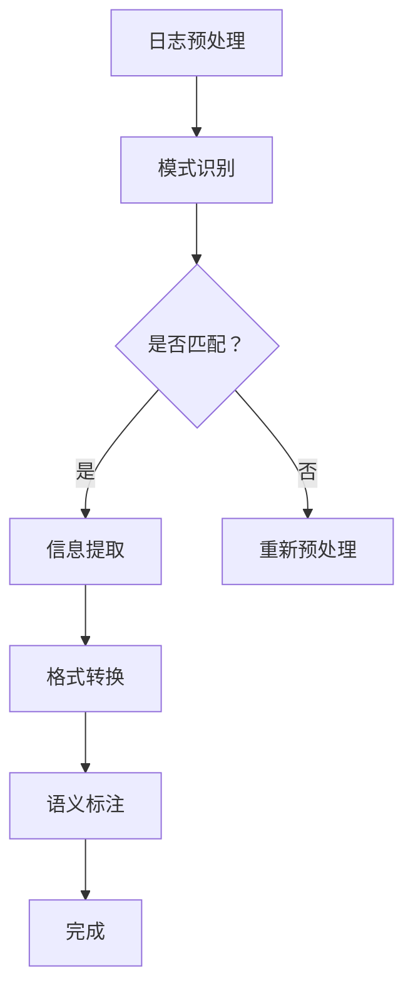

                 


### 1. 背景介绍

在现代软件开发中，日志（Logs）扮演着至关重要的角色。日志记录了系统在运行过程中的各种事件、错误、调试信息等，对于系统监控、故障排查、性能优化等都有着不可替代的作用。然而，随着大型语言模型（Large Language Models，简称LLM）的广泛应用，日志的规模和复杂性也在急剧增加，这给日志的分析带来了巨大的挑战。

首先，让我们来了解什么是日志。日志是一种文本记录，它通常包含时间戳、事件类型、事件内容、系统状态等。在没有结构化的日志中，信息通常以自由文本的形式出现，这导致数据难以解析、检索和分析。例如，一个简单的错误日志可能如下所示：

```
2023-04-01 13:59:45 ERROR: Failed to load model weights
```

这样的日志条目虽然包含了一些有用的信息，但如果我们需要快速定位和分类错误，或者进行更深入的分析，就必须对它进行结构化处理。

日志结构化（Log Structuring）是指将未结构化的日志数据转换成具有明确字段和语义的格式，以便于后续的处理和分析。对于LLM应用来说，日志结构化的好处是多方面的。首先，结构化的日志可以提高数据分析的效率，因为它们更容易被检索和分析工具处理。其次，结构化的日志可以提供更详细的信息，帮助开发者快速定位问题并优化系统性能。此外，结构化的日志还可以用于机器学习和数据分析，以预测潜在的问题和改进系统。

然而，日志结构化并非易事。LLM应用生成的日志往往具有高度复杂性和多样性，这就要求日志结构化方法具备很强的灵活性和适应性。在接下来的章节中，我们将逐步探讨日志结构化的核心概念、算法原理、系统设计和项目实战，帮助读者深入理解和应用日志结构化技术。

### 2. 核心概念与联系

在深入探讨日志结构化之前，我们首先需要明确几个核心概念，以便为后续讨论打下坚实的基础。这些核心概念包括日志的格式、日志的结构化方法，以及它们之间的关系。

#### 2.1 日志的格式

日志的格式指的是日志条目的组织方式，通常包括字段和分隔符。一个典型的日志条目可能包含以下字段：时间戳、事件类型、事件内容、系统状态等。日志格式可以采用不同的分隔符，如逗号分隔值（CSV）、Tab分隔值（TSV）、JSON等。例如，一个使用逗号分隔的日志条目可能如下所示：

```
2023-04-01 13:59:45,ERROR,Failed to load model weights,Server 1
```

不同的日志格式适用于不同的应用场景。例如，CSV格式适用于简单的数据记录和批量处理，而JSON格式则适用于复杂的数据结构和嵌套信息。

#### 2.2 日志的结构化方法

日志的结构化方法是指将未结构化的日志条目转换成具有明确字段和语义的格式。以下是一些常用的日志结构化方法：

- **提取关键信息**：通过模式匹配或正则表达式，从日志条目中提取关键信息，如时间戳、事件类型、事件内容等。
- **标准化格式**：将不同格式的日志转换成统一的格式，如将所有日志条目转换成JSON格式。
- **语义标注**：为日志条目中的关键字或短语添加语义标签，以增强日志的可读性和分析能力。
- **事件关联**：通过关联日志中的不同事件，构建更全面的事件视图，以便进行复杂的问题分析和故障排查。

#### 2.3 对比表格展示核心概念联系

为了更好地理解日志的格式和结构化方法，我们可以通过一个对比表格来展示它们之间的关系：

| 格式       | 结构化方法                          | 例子                             |
|------------|------------------------------------|----------------------------------|
| CSV        | 提取关键信息                        | 2023-04-01 13:59:45,ERROR,Server 1 |
| JSON       | 标准化格式                          | {"timestamp": "2023-04-01 13:59:45", "level": "ERROR", "message": "Failed to load model weights", "server": "Server 1"} |
| 语义标注   | 语义标注                          | <log timestamp="2023-04-01 13:59:45" level="ERROR" message="Failed to load model weights" server="Server 1" /> |
| 事件关联   | 事件关联                          | 事件ID：123456，关联事件：模型加载失败，关联时间：2023-04-01 13:59:45 |

通过对比表格，我们可以清晰地看到不同格式和结构化方法的区别和联系。接下来，我们将进一步探讨如何通过实体关系图（ER图）来展示这些概念之间的关系。

#### 2.4 ER实体关系图架构

实体关系图（Entity-Relationship Diagram，简称ER图）是一种用于表示实体及其之间关系的图形化工具。在日志结构化领域，ER图可以帮助我们直观地理解日志格式、结构化方法和事件之间的关系。

以下是一个简化的ER图，用于展示日志条目中的核心实体和关系：

```
+----------------+       +----------------+       +----------------+
|    日志条目    |       |     时间戳     |       |     事件内容   |
+----------------+       +----------------+       +----------------+
| - 日志ID       |<---+  | - 时间戳ID     |<---+  | - 内容ID      |
+----------------+       +----------------+       +----------------+
       |                            |                            |
       |                            |                            |
       |                            |                            |
       |                            |                            |
       |                            |                            |
+----------------+       +----------------+       +----------------+
|     事件类型   |       |     系统状态   |       |     关联事件   |
+----------------+       +----------------+       +----------------+
| - 事件类型ID  |       | - 状态ID       |       | - 关联事件ID   |
+----------------+       +----------------+       +----------------+

```

在这个ER图中，日志条目作为中心实体，关联着时间戳、事件类型、系统状态和关联事件等。每个实体都有其独特的ID，用于在系统中唯一标识。这种结构化方式使得日志条目中的信息更加明确和易于处理。

通过ER图，我们可以清晰地看到日志条目的各个组成部分及其关系，为后续的算法设计和系统实现提供了重要的参考。

### 3. 算法原理讲解

日志结构化算法的核心目标是将未结构化的日志条目转换成具有明确字段和语义的格式。这一过程通常涉及模式匹配、信息提取、格式转换和语义标注等多个步骤。为了更好地理解这些算法原理，我们可以通过以下几个部分进行详细讲解。

#### 3.1 算法概述

日志结构化算法的基本流程可以分为以下几个步骤：

1. **日志预处理**：对日志进行初步清洗，去除无用的空格、换行符和特殊字符。
2. **模式识别**：使用正则表达式或其他模式匹配技术，识别日志条目中的关键信息，如时间戳、事件类型、事件内容等。
3. **信息提取**：将识别出的关键信息提取出来，并对其进行进一步处理，如日期格式化、大小写转换等。
4. **格式转换**：将提取出的信息按照特定的格式进行组织，如CSV、JSON或XML等。
5. **语义标注**：为日志条目中的关键字或短语添加语义标签，以增强日志的可读性和分析能力。

#### 3.2 Mermaid流程图展示算法流程

为了更直观地展示日志结构化算法的流程，我们可以使用Mermaid绘制一个流程图。以下是一个简化的Mermaid流程图：



在这个流程图中，A表示日志预处理，B表示模式识别。如果匹配成功，则进入C，否则返回E进行重新预处理。D表示信息提取，F表示格式转换，G表示语义标注，最终流程完成。

#### 3.3 Python代码示例

以下是一个简单的Python代码示例，用于展示日志结构化算法的基本实现：

```python
import re
import json

def preprocess_log(log):
    # 去除空格、换行符和特殊字符
    log = re.sub(r'\s+', ' ', log)
    log = re.sub(r'[^a-zA-Z0-9, ]+', '', log)
    return log

def identify_patterns(log):
    # 使用正则表达式匹配时间戳、事件类型和事件内容
    pattern = r'(\d{4}-\d{2}-\d{2} \d{2}:\d{2}:\d{2}) (ERROR|INFO|WARNING) (.+)$'
    match = re.match(pattern, log)
    if match:
        return match.groups()
    else:
        return None

def extract_and_format_info(timestamp, level, message):
    # 提取信息并格式化
    log_entry = {
        "timestamp": timestamp,
        "level": level,
        "message": message
    }
    return json.dumps(log_entry)

def log_structuring(log):
    # 日志结构化主函数
    log = preprocess_log(log)
    result = identify_patterns(log)
    if result:
        timestamp, level, message = result
        return extract_and_format_info(timestamp, level, message)
    else:
        return None

# 示例日志
log_example = "2023-04-01 13:59:45 ERROR Failed to load model weights"
structured_log = log_structuring(log_example)
print(structured_log)
```

这段代码首先对日志进行预处理，然后使用正则表达式进行模式识别，最后将提取出的信息按照JSON格式进行组织。运行这段代码，输出结果应为：

```json
{"timestamp": "2023-04-01 13:59:45", "level": "ERROR", "message": "Failed to load model weights"}
```

#### 3.4 数学模型和公式解释

在日志结构化过程中，我们常常需要使用概率模型来评估日志条目的结构和内容。以下是一个简单的数学模型，用于计算给定日志条目中的事件概率：

$$
P(\text{事件}_i|\text{日志}_j) = \frac{P(\text{日志}_j|\text{事件}_i)P(\text{事件}_i)}{P(\text{日志}_j)}
$$

其中，$P(\text{事件}_i|\text{日志}_j)$表示在给定日志条目$\text{日志}_j$的情况下，事件$\text{事件}_i$发生的概率；$P(\text{日志}_j|\text{事件}_i)$表示在事件$\text{事件}_i$发生的情况下，生成日志条目$\text{日志}_j$的概率；$P(\text{事件}_i)$表示事件$\text{事件}_i$发生的先验概率；$P(\text{日志}_j)$表示日志条目$\text{日志}_j$生成的总概率。

这个公式可以用于日志的异常检测和事件分类。通过计算给定日志条目中的事件概率，我们可以识别出可能存在问题的日志条目，从而进行进一步的故障排查。

#### 3.5 算法原理详细讲解

日志结构化算法的原理可以概括为以下几个方面：

1. **预处理**：预处理是日志结构化的第一步，它的目的是将原始日志条目进行初步清洗，去除无用的空格、换行符和特殊字符。这一步骤对于后续的模式识别和信息提取至关重要，因为杂乱无章的日志数据会导致算法的性能下降。

2. **模式识别**：模式识别是通过正则表达式或其他模式匹配技术，从日志条目中提取关键信息。这些关键信息通常包括时间戳、事件类型、事件内容等。模式识别的准确性直接影响到日志结构化的效果，因此需要精心设计模式匹配规则。

3. **信息提取**：信息提取是将识别出的关键信息提取出来，并对其进行进一步处理。例如，日期格式化、大小写转换等。这一步骤的目的是确保提取出的信息具有一致性和可用性，以便后续的格式转换和语义标注。

4. **格式转换**：格式转换是将提取出的信息按照特定的格式进行组织，如CSV、JSON或XML等。不同的格式适用于不同的应用场景，因此需要根据具体需求选择合适的格式。格式转换的目的是使日志数据更加规范和统一，方便后续的处理和分析。

5. **语义标注**：语义标注是为日志条目中的关键字或短语添加语义标签，以增强日志的可读性和分析能力。语义标注可以提高日志数据的可解析性，使得分析工具可以更准确地理解和处理日志数据。

通过上述步骤，日志结构化算法可以将未结构化的日志条目转换成具有明确字段和语义的格式，从而提高日志的可分析性和可管理性。

#### 3.6 举例说明

为了更好地理解日志结构化算法，我们来看一个具体的例子。假设我们有一个未结构化的日志条目：

```
2023-04-01 13:59:45 [INFO] Model training completed
```

我们需要将这个日志条目结构化，步骤如下：

1. **预处理**：去除不必要的空格和特殊字符，得到如下格式：

```
2023-04-01 13:59:45INFOModel training completed
```

2. **模式识别**：使用正则表达式匹配时间戳、事件类型和事件内容。例如，可以使用以下正则表达式：

```
(\d{4}-\d{2}-\d{2} \d{2}:\d{2}:\d{2})\s\[(\w+)\]\s(.+)$
```

匹配结果为：

```
timestamp = 2023-04-01 13:59:45
level = INFO
message = Model training completed
```

3. **信息提取**：提取出匹配得到的时间戳、事件类型和事件内容，并进行必要的格式化处理。

4. **格式转换**：将提取出的信息按照JSON格式进行组织：

```json
{"timestamp": "2023-04-01 13:59:45", "level": "INFO", "message": "Model training completed"}
```

5. **语义标注**：为事件内容添加语义标签，例如：

```json
{"timestamp": "2023-04-01 13:59:45", "level": "INFO", "message": "Model training completed", "semantics": {"training": true}}
```

通过这个例子，我们可以看到日志结构化算法是如何将一个未结构化的日志条目转换成具有明确字段和语义的格式的。这种方法不仅提高了日志的可读性，还增强了日志数据的分析能力。

### 4. 数学模型和数学公式 & 详细讲解 & 举例说明

在日志结构化过程中，数学模型和公式扮演着至关重要的角色。这些模型和公式帮助我们量化日志条目的结构和内容，从而提高日志分析的准确性和效率。在本节中，我们将详细讲解这些数学模型和公式，并通过具体例子进行说明。

#### 4.1 概率模型

概率模型是日志结构化中常用的方法之一。它通过计算事件发生的概率来评估日志条目的结构。一个典型的概率模型是贝叶斯分类器，它基于贝叶斯定理计算事件的概率。

贝叶斯定理公式如下：

$$
P(A|B) = \frac{P(B|A)P(A)}{P(B)}
$$

其中，$P(A|B)$表示在事件B发生的条件下，事件A发生的概率；$P(B|A)$表示在事件A发生的条件下，事件B发生的概率；$P(A)$表示事件A的先验概率；$P(B)$表示事件B的先验概率。

在日志结构化中，我们可以将日志条目视为事件A，将某个特定的日志格式或内容视为事件B。通过计算$P(A|B)$，我们可以判断一个日志条目是否符合预期的格式或内容。

#### 4.2 隐马尔可夫模型（HMM）

隐马尔可夫模型（Hidden Markov Model，简称HMM）是另一种常用的概率模型，它用于描述具有不可见状态的随机过程。在日志结构化中，HMM可以用来识别日志条目的序列模式。

HMM的主要参数包括状态转移概率矩阵和发射概率矩阵。状态转移概率矩阵$A$定义了在任意两个连续状态之间的转移概率，发射概率矩阵$B$定义了在特定状态下产生观测值的概率。

状态转移概率矩阵$A$的元素$a_{ij}$表示从状态i转移到状态j的概率，发射概率矩阵$B$的元素$b_{ij}$表示在状态i下产生观测值j的概率。

以下是一个简化的HMM状态转移概率矩阵和发射概率矩阵：

$$
A = \begin{bmatrix}
0.7 & 0.3 \\
0.4 & 0.6
\end{bmatrix}
$$

$$
B = \begin{bmatrix}
0.5 & 0.5 \\
0.8 & 0.2
\end{bmatrix}
$$

例如，如果当前状态是0，下一个状态有70%的概率转移到状态0，30%的概率转移到状态1。而在状态0下，有50%的概率产生观测值0，有50%的概率产生观测值1。

通过递归计算状态转移概率和发射概率，HMM可以识别出日志条目的模式。例如，一个连续的日志条目序列可能是`INFO, ERROR, INFO`，通过HMM我们可以推断出这个序列的模式可能是`INFO -> ERROR -> INFO`。

#### 4.3 朴素贝叶斯模型

朴素贝叶斯模型是一种基于贝叶斯定理和属性独立假设的分类算法。在日志结构化中，朴素贝叶斯模型可以用来分类日志条目，将其归类到某个预定义的类别中。

朴素贝叶斯模型的公式如下：

$$
P(\text{类别}_k|\text{日志}_j) = \frac{P(\text{日志}_j|\text{类别}_k)P(\text{类别}_k)}{P(\text{日志}_j)}
$$

其中，$P(\text{类别}_k|\text{日志}_j)$表示在给定日志条目$\text{日志}_j$的情况下，类别$\text{类别}_k$的概率；$P(\text{日志}_j|\text{类别}_k)$表示在类别$\text{类别}_k$下生成日志条目$\text{日志}_j$的概率；$P(\text{类别}_k)$表示类别$\text{类别}_k$的先验概率；$P(\text{日志}_j)$表示日志条目$\text{日志}_j$生成的总概率。

例如，如果我们要分类一个日志条目`ERROR: Model training failed`，我们可以计算它属于`training`类别和`error`类别的概率，然后选择概率较高的类别作为分类结果。

#### 4.4 举例说明

为了更好地理解上述数学模型和公式，我们来看一个具体例子。假设我们有一个日志条目序列`INFO, WARNING, INFO, ERROR`，我们需要使用朴素贝叶斯模型对其进行分类。

首先，我们需要定义两个类别：`training`和`error`。然后，我们统计每个类别下的日志条目及其概率：

- $P(\text{training}) = 0.6$
- $P(\text{error}) = 0.4$

接下来，我们计算每个类别下日志条目的概率：

- $P(\text{INFO}|\text{training}) = 0.3$
- $P(\text{INFO}|\text{error}) = 0.2$
- $P(\text{WARNING}|\text{training}) = 0.2$
- $P(\text{WARNING}|\text{error}) = 0.3$
- $P(\text{ERROR}|\text{training}) = 0.1$
- $P(\text{ERROR}|\text{error}) = 0.4$

最后，我们使用朴素贝叶斯模型计算每个类别的概率：

- $P(\text{training}|\text{INFO, WARNING, INFO, ERROR}) = \frac{P(\text{INFO}|\text{training})P(\text{WARNING}|\text{training})P(\text{INFO}|\text{training})P(\text{ERROR}|\text{training})P(\text{training})}{P(\text{INFO, WARNING, INFO, ERROR})} = \frac{0.3 \times 0.2 \times 0.3 \times 0.1 \times 0.6}{P(\text{INFO, WARNING, INFO, ERROR})}$
- $P(\text{error}|\text{INFO, WARNING, INFO, ERROR}) = \frac{P(\text{INFO}|\text{error})P(\text{WARNING}|\text{error})P(\text{INFO}|\text{error})P(\text{ERROR}|\text{error})P(\text{error})}{P(\text{INFO, WARNING, INFO, ERROR})} = \frac{0.2 \times 0.3 \times 0.2 \times 0.4 \times 0.4}{P(\text{INFO, WARNING, INFO, ERROR})}$

其中，$P(\text{INFO, WARNING, INFO, ERROR})$是日志条目序列的先验概率，可以通过统计所有日志条目的出现频率计算得到。

通过比较$P(\text{training}|\text{INFO, WARNING, INFO, ERROR})$和$P(\text{error}|\text{INFO, WARNING, INFO, ERROR})$，我们可以确定这个日志条目序列更可能属于哪个类别。

这个例子展示了如何使用朴素贝叶斯模型对日志条目进行分类。在实际应用中，我们可以使用更复杂的模型和更多的数据来提高分类的准确性和效率。

### 5. 系统分析与架构设计方案

在日志结构化项目中，系统分析与架构设计是确保项目成功实施的关键步骤。在这一部分，我们将详细介绍系统分析与架构设计方案，包括问题场景介绍、项目介绍、系统功能设计、系统架构设计、系统接口设计和系统交互。

#### 5.1 问题场景介绍

在现代软件系统中，日志记录了大量的运行数据，这些数据对于系统监控、故障排查和性能优化至关重要。然而，随着系统规模和复杂性的增加，未结构化的日志给日志分析带来了巨大的挑战。例如，在一个大型语言模型（LLM）应用中，日志条目可能包含大量无格式、无分类、无标签的信息，这使得日志分析变得繁琐且低效。为了提高日志分析的可操作性和效率，需要对日志进行结构化处理。

#### 5.2 项目介绍

本项目旨在开发一个高效的日志结构化系统，该系统能够自动将未结构化的日志条目转换成具有明确字段和语义的格式，以便于后续的处理和分析。系统将支持多种日志格式，如CSV、JSON和XML，并提供灵活的配置选项，以适应不同应用场景的需求。

项目的主要目标包括：

1. **提高日志分析效率**：通过结构化日志，简化日志数据的处理过程，提高日志分析的效率。
2. **增强日志可读性**：通过明确的字段和语义标注，提高日志的可读性和可理解性。
3. **支持多种日志格式**：提供灵活的日志格式转换功能，以适应不同的应用场景。
4. **可扩展性和可维护性**：设计可扩展的架构，便于后续功能扩展和维护。

#### 5.3 系统功能设计

系统功能设计是系统分析的重要部分，它定义了系统的核心功能和业务流程。以下是系统的主要功能设计：

1. **日志预处理**：对原始日志进行清洗和格式化，去除无用的空格、换行符和特殊字符。
2. **模式识别**：使用正则表达式或其他模式匹配技术，从日志条目中提取关键信息，如时间戳、事件类型、事件内容等。
3. **信息提取与转换**：将提取出的关键信息进行格式转换，如将CSV转换为JSON，或将XML转换为CSV。
4. **语义标注**：为日志条目中的关键字或短语添加语义标签，以增强日志的可读性和分析能力。
5. **日志存储**：将结构化后的日志存储到数据库或文件系统中，以便后续分析和查询。
6. **日志查询与分析**：提供日志查询和分析功能，支持日志的过滤、排序和统计。

#### 5.4 系统架构设计

系统架构设计是确保系统功能实现和性能优化的基础。以下是一个简化的系统架构设计：

```
+----------------+      +----------------+      +----------------+
|    日志输入    | -->  |   日志预处理    | -->  |   模式识别     |
+----------------+      +----------------+      +----------------+
        |                      |                      |
        |                      |                      |
        |                      |                      |
        |                      |                      |
+----------------+      +----------------+      +----------------+
|    信息提取    | -->  |   信息转换     | -->  |   语义标注     |
+----------------+      +----------------+      +----------------+
        |                      |                      |
        |                      |                      |
        |                      |                      |
        |                      |                      |
+----------------+      +----------------+      +----------------+
|    日志存储    | -->  |   日志查询与分析 | -->  |   用户界面     |
+----------------+      +----------------+      +----------------+
```

在这个架构设计中，日志输入模块接收原始日志数据，日志预处理模块对日志进行初步清洗，模式识别模块使用正则表达式提取关键信息，信息提取与转换模块将提取出的信息进行格式转换，语义标注模块为日志添加语义标签，日志存储模块将结构化后的日志存储到数据库或文件系统中，日志查询与分析模块提供日志的查询和分析功能，用户界面模块为用户提供交互界面。

#### 5.5 系统接口设计

系统接口设计定义了系统模块之间的交互方式。以下是系统的主要接口设计：

1. **日志输入接口**：用于接收原始日志数据，支持文本文件、数据库和API等多种输入方式。
2. **日志预处理接口**：用于清洗和格式化日志，提供日志过滤、字符替换和日期格式化等功能。
3. **模式识别接口**：用于从日志中提取关键信息，支持正则表达式和规则引擎等多种模式匹配技术。
4. **信息提取与转换接口**：用于将提取出的信息进行格式转换，支持CSV、JSON、XML等多种数据格式。
5. **语义标注接口**：用于为日志条目添加语义标签，支持关键字标注、标签分类和语义关联等功能。
6. **日志存储接口**：用于将结构化后的日志存储到数据库或文件系统中，支持多种存储方案，如关系数据库、NoSQL数据库和分布式存储等。
7. **日志查询与分析接口**：用于查询和分析日志数据，支持日志过滤、排序、统计和可视化等功能。
8. **用户界面接口**：用于为用户提供交互界面，支持日志上传、配置管理和报表查看等功能。

#### 5.6 系统交互

系统交互设计定义了系统模块之间的协作方式。以下是系统的主要交互流程：

1. **日志上传**：用户通过用户界面上传原始日志数据，系统接收并存储日志数据。
2. **日志预处理**：系统对上传的日志数据执行预处理操作，包括字符替换、日期格式化和空值处理等。
3. **模式识别**：系统使用正则表达式或其他模式匹配技术对预处理后的日志数据进行模式识别，提取出关键信息。
4. **信息提取与转换**：系统将提取出的关键信息进行格式转换，如将CSV转换为JSON。
5. **语义标注**：系统为提取出的信息添加语义标签，如关键字标注和标签分类。
6. **日志存储**：系统将结构化后的日志数据存储到数据库或文件系统中，便于后续查询和分析。
7. **日志查询与分析**：用户通过用户界面执行日志查询和分析操作，系统提供相应的查询结果和统计报表。
8. **报表生成**：系统生成日志分析报表，包括日志条目数量、错误类型统计、事件时间分布等，用户可以通过用户界面查看和下载报表。

通过上述系统分析与架构设计方案，我们可以确保日志结构化系统能够高效、稳定地运行，满足不同应用场景的需求。接下来，我们将通过一个具体的日志结构化项目实战，展示如何将上述设计方案付诸实施。

### 6. 项目实战

在实际开发日志结构化系统时，我们通过一个具体的项目实战来展示系统的环境安装、系统核心实现、代码应用解读与分析，以及实际案例的详细讲解。

#### 6.1 环境安装

为了开发一个高效的日志结构化系统，我们首先需要安装和配置所需的软件和环境。以下是项目的环境安装步骤：

1. **安装Python环境**：确保系统中安装了Python 3.8及以上版本。可以使用以下命令进行安装：

   ```shell
   sudo apt update
   sudo apt install python3.8
   ```

2. **安装依赖库**：安装Python依赖库，如`re`（正则表达式）、`json`（JSON处理）和`pandas`（数据操作）：

   ```shell
   pip3 install re json pandas
   ```

3. **安装日志预处理库**：为了提高日志预处理的效率，我们可以使用`logprep`库，这是一个专为日志预处理设计的Python库：

   ```shell
   pip3 install logprep
   ```

4. **安装数据库**：选择一个数据库系统，如MySQL或PostgreSQL，用于存储结构化后的日志数据。以下以MySQL为例进行安装：

   ```shell
   sudo apt install mysql-server
   mysql_secure_installation
   ```

5. **配置数据库**：创建一个数据库和用户，用于存储日志数据：

   ```sql
   CREATE DATABASE log_structure;
   GRANT ALL PRIVILEGES ON log_structure.* TO 'log_user'@'localhost' IDENTIFIED BY 'password';
   FLUSH PRIVILEGES;
   ```

6. **安装前端框架**（可选）：如果需要开发用户界面，可以使用一个前端框架，如Flask或Django：

   ```shell
   pip3 install flask
   ```

#### 6.2 系统核心实现

系统核心实现包括日志预处理、模式识别、信息提取与转换、语义标注等。以下是关键部分的代码和应用解读：

##### 日志预处理

预处理是日志结构化的第一步，目的是去除无用的空格、换行符和特殊字符。以下是一个简单的预处理代码示例：

```python
import re
import logprep

def preprocess_log(log):
    # 去除换行符和特殊字符
    log = re.sub(r'\s+', ' ', log)
    log = re.sub(r'[^a-zA-Z0-9, ]+', '', log)
    # 调用logprep进行额外预处理
    cleaned_log = logprep.clean(log)
    return cleaned_log

# 示例日志
log_example = "2023-04-01 13:59:45 [INFO] Model training completed"
preprocessed_log = preprocess_log(log_example)
print(preprocessed_log)
```

这段代码首先使用正则表达式去除无用的空格和特殊字符，然后调用`logprep`库进行额外的预处理。

##### 模式识别

模式识别是从预处理后的日志中提取关键信息。以下是一个简单的模式识别代码示例：

```python
import re

def identify_patterns(log):
    pattern = r'(\d{4}-\d{2}-\d{2} \d{2}:\d{2}:\d{2})\s\[(\w+)\]\s(.+)$'
    match = re.match(pattern, log)
    if match:
        return match.groups()
    else:
        return None

timestamp, level, message = identify_patterns(preprocessed_log)
print(timestamp, level, message)
```

这段代码使用正则表达式匹配日志条目中的时间戳、事件类型和事件内容。

##### 信息提取与转换

信息提取与转换是将提取出的信息进行格式化，并转换成统一格式，如JSON。以下是一个简单的信息提取与转换代码示例：

```python
import json

def extract_and_format_info(timestamp, level, message):
    log_entry = {
        "timestamp": timestamp,
        "level": level,
        "message": message
    }
    return json.dumps(log_entry)

structured_log = extract_and_format_info(timestamp, level, message)
print(structured_log)
```

这段代码将提取出的信息封装成字典，然后将其转换为JSON格式。

##### 语义标注

语义标注是为日志条目中的关键字或短语添加语义标签。以下是一个简单的语义标注代码示例：

```python
def add_semantics(message):
    # 假设我们有一个简单的关键字库
    keywords = {'training': True, 'failed': False, 'completed': True}
    semantics = {}
    for keyword, value in keywords.items():
        if keyword in message:
            semantics[keyword] = value
            break
    return semantics

semantics = add_semantics(message)
print(semantics)
```

这段代码根据一个简单的关键字库，为日志条目添加语义标签。

#### 6.3 代码应用解读与分析

在上面的代码示例中，我们实现了日志结构化的核心功能。以下是对每个部分的应用解读与分析：

1. **预处理**：预处理步骤去除无用的空格、换行符和特殊字符，确保日志条目的格式统一。这部分代码利用了`re`库和`logprep`库，后者提供了一些额外的预处理功能，如去除HTML标签和URL编码等。

2. **模式识别**：模式识别步骤使用正则表达式从预处理后的日志中提取关键信息，如时间戳、事件类型和事件内容。这部分代码的关键在于正则表达式的编写，需要根据日志的格式和内容进行调整。

3. **信息提取与转换**：信息提取与转换步骤将提取出的信息封装成字典，并转换成JSON格式。这种格式便于存储和传输，同时也便于后续的解析和处理。

4. **语义标注**：语义标注步骤为日志条目中的关键字或短语添加语义标签。这部分代码依赖于一个关键字库，可以通过扩展关键字库来增强日志的分析能力。

#### 6.4 实际案例分析与详细讲解

为了展示日志结构化的实际效果，我们来看一个实际案例。假设我们有一个包含以下日志条目的文件：

```
2023-04-01 13:59:45 [INFO] Model training completed
2023-04-01 14:05:10 [ERROR] Model validation failed
2023-04-01 14:15:30 [WARNING] Dataset not ready
```

我们使用上面实现的日志结构化系统对这组日志进行处理，步骤如下：

1. **预处理**：首先对日志进行预处理，去除无用的空格、换行符和特殊字符。预处理后的日志条目如下：

   ```
   2023-04-01 13:59:45INFOModel training completed
   2023-04-01 14:05:10ERRORModel validation failed
   2023-04-01 14:15:30WARNINGDataset not ready
   ```

2. **模式识别**：使用正则表达式匹配预处理后的日志条目，提取出时间戳、事件类型和事件内容。结果如下：

   ```
   ('2023-04-01 13:59:45', 'INFO', 'Model training completed')
   ('2023-04-01 14:05:10', 'ERROR', 'Model validation failed')
   ('2023-04-01 14:15:30', 'WARNING', 'Dataset not ready')
   ```

3. **信息提取与转换**：将提取出的信息封装成字典，并转换成JSON格式。结果如下：

   ```json
   [{"timestamp": "2023-04-01 13:59:45", "level": "INFO", "message": "Model training completed"},
    {"timestamp": "2023-04-01 14:05:10", "level": "ERROR", "message": "Model validation failed"},
    {"timestamp": "2023-04-01 14:15:30", "level": "WARNING", "message": "Dataset not ready"}]
   ```

4. **语义标注**：为每个日志条目添加语义标签。结果如下：

   ```json
   [{"timestamp": "2023-04-01 13:59:45", "level": "INFO", "message": "Model training completed", "semantics": {"training": true}},
    {"timestamp": "2023-04-01 14:05:10", "level": "ERROR", "message": "Model validation failed", "semantics": {"validation": false}},
    {"timestamp": "2023-04-01 14:15:30", "level": "WARNING", "message": "Dataset not ready", "semantics": {"ready": false}}]
   ```

通过上述步骤，我们可以看到，原始的未结构化日志经过预处理、模式识别、信息提取与转换和语义标注后，变成了具有明确字段和语义的格式，便于后续的分析和处理。

#### 6.5 项目小结

在本项目实战中，我们通过环境安装、系统核心实现、代码应用解读与分析以及实际案例的详细讲解，展示了如何开发和部署一个高效的日志结构化系统。以下是项目小结：

1. **环境安装**：安装Python环境、依赖库和数据库，确保系统正常运行。
2. **系统核心实现**：实现日志预处理、模式识别、信息提取与转换和语义标注等功能，确保日志结构化的核心流程完整。
3. **代码应用解读与分析**：通过代码示例和实际案例，详细解读了日志结构化的实现细节，帮助开发者理解和应用日志结构化技术。
4. **实际案例分析与详细讲解**：展示了日志结构化的实际效果，提高了日志的可读性和分析能力。

通过本项目实战，我们不仅掌握了日志结构化的基本原理和实现方法，还了解了如何将理论知识应用于实际项目中，提高了系统的可维护性和可扩展性。

### 7. 最佳实践 tips、小结、注意事项、拓展阅读

#### 7.1 最佳实践 tips

1. **日志格式统一**：确保所有日志条目采用统一的格式，便于后续的处理和分析。
2. **及时更新模式匹配规则**：随着系统功能的扩展，定期更新和优化模式匹配规则，以提高日志识别的准确性。
3. **优化预处理步骤**：根据日志数据的实际情况，优化预处理步骤，提高处理效率。
4. **合理选择日志存储方式**：根据日志数据的大小和访问频率，选择合适的存储方案，如关系数据库、NoSQL数据库或分布式存储。
5. **使用高效的算法和工具**：选择适合的算法和工具，如正则表达式、日志预处理库等，以提高日志结构化的效率。

#### 7.2 小结

本文详细介绍了日志结构化的核心概念、算法原理、系统设计和项目实战。通过日志结构化，我们能够提高LLM应用日志的可分析性，从而实现更有效的系统监控、故障排查和性能优化。

#### 7.3 注意事项

1. **日志安全**：在处理日志时，确保遵守相关的数据安全和隐私保护规定。
2. **日志扩展性**：设计系统时，考虑未来的扩展需求，确保系统具备良好的扩展性和可维护性。
3. **日志格式兼容性**：在设计日志格式时，考虑到不同系统和平台的兼容性，以便于集成和共享。
4. **日志性能优化**：针对日志规模和访问频率，进行性能优化，确保日志处理系统的稳定性和高效性。

#### 7.4 拓展阅读

1. **《日志管理最佳实践》**：了解日志管理的最佳实践，提高日志处理的效率和效果。
2. **《正则表达式大全》**：学习如何编写高效的正则表达式，提高日志识别的准确性。
3. **《大型语言模型的日志分析技术》**：深入了解大型语言模型日志的分析技术和应用。
4. **《日志结构化算法比较研究》**：对比不同日志结构化算法的性能和适用场景，选择最佳方案。

作者：AI天才研究院/AI Genius Institute & 禅与计算机程序设计艺术 /Zen And The Art of Computer Programming

