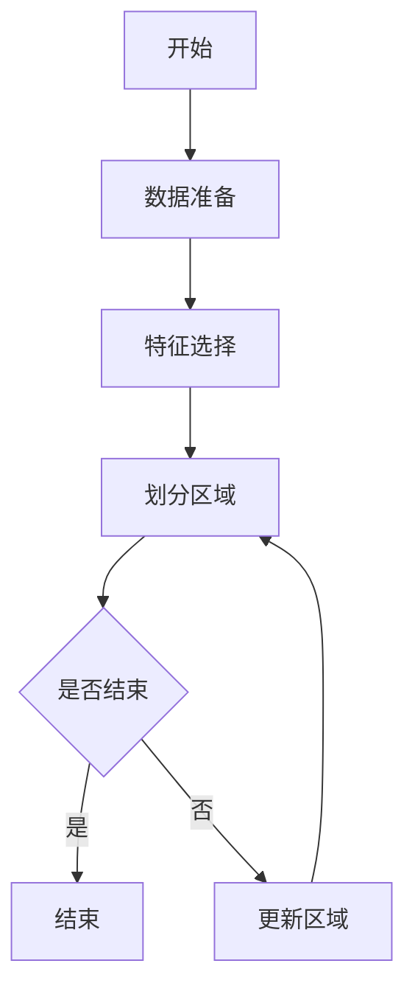
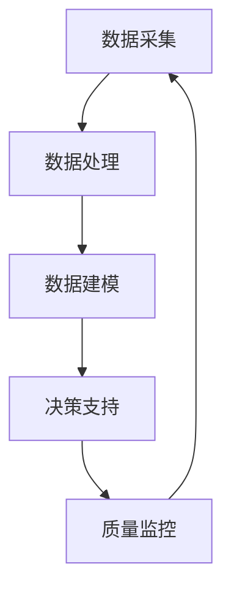
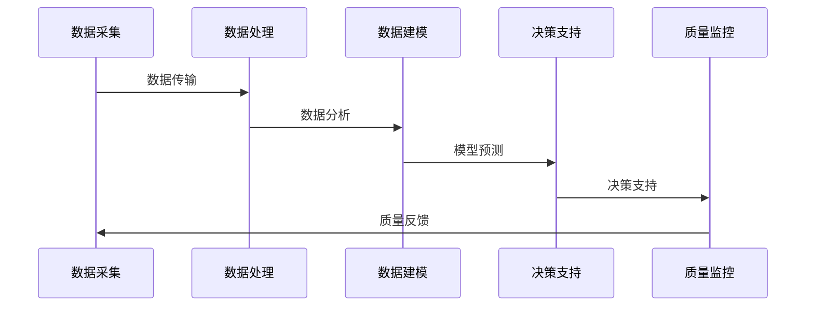

                 

### 《智能制造质量控制AI系统评测框架》

关键词：智能制造、质量控制、AI系统评测、算法原理、系统设计

摘要：本文将深入探讨智能制造质量控制AI系统的评测框架，旨在为读者提供一个全面、系统的理解。我们将从背景介绍开始，逐步深入核心概念，解析评测框架的构建，讲解算法原理和数学模型，再到系统分析与架构设计，最后通过项目实战和总结，为读者提供实用技巧和最佳实践经验。

----------------------------------------------------------------

## 第一部分：背景与核心概念

### 第1章：智能制造与质量控制概述

#### 1.1 智能制造的定义与演进

智能制造（Intelligent Manufacturing）是指通过信息技术与制造技术的深度融合，实现制造过程的自动化、智能化和网络化。它不仅仅是机器自动化替代人力，更是利用大数据、物联网、人工智能等技术，实现从设计、生产到服务的全过程优化。

智能制造的演进过程大致可分为三个阶段：

1. **自动化阶段**：主要特点是机器替代人力，提高生产效率。
2. **信息化阶段**：通过计算机和信息系统，实现对生产过程的实时监控和管理。
3. **智能化阶段**：利用人工智能技术，实现生产过程的自我优化和自我决策。

#### 1.2 质量控制的重要性

质量控制是智能制造的核心组成部分，其重要性不言而喻。质量控制的目标是确保产品或服务的质量满足预定的标准和要求。具体来说，质量控制的重要性体现在以下几个方面：

1. **提高产品可靠性**：通过质量控制，可以降低产品故障率，提高产品可靠性。
2. **降低成本**：质量控制可以减少生产过程中因质量问题导致的返工、报废等成本。
3. **增强品牌竞争力**：高质量的产品能够提高品牌声誉，增强市场竞争力。
4. **提升客户满意度**：高质量的产品能够满足客户需求，提升客户满意度。

#### 1.3 AI系统在质量控制中的应用

随着人工智能技术的快速发展，AI系统在质量控制中的应用越来越广泛。AI系统可以实现对生产过程的实时监控和分析，识别潜在的质量问题，并采取相应的措施。具体应用包括：

1. **质量预测**：利用机器学习算法，对生产过程中的质量数据进行预测，提前发现潜在问题。
2. **异常检测**：通过数据分析和模式识别，发现生产过程中的异常情况，及时采取措施。
3. **优化生产计划**：基于质量数据和需求预测，优化生产计划，提高生产效率。

### 第2章：核心概念与联系

#### 2.1 智能制造质量控制的关键概念

在智能制造质量控制中，涉及多个关键概念，包括：

1. **数据采集**：通过传感器、监控系统等手段，实时采集生产过程中的各种数据。
2. **数据清洗**：对采集到的数据进行处理，去除噪声和异常值，提高数据质量。
3. **数据建模**：利用机器学习算法，对数据进行分析和建模，预测产品质量。
4. **决策支持**：基于预测结果，提供决策支持，优化生产过程。

#### 2.2 AI系统评测框架的基本要素

AI系统评测框架的基本要素包括：

1. **评测指标**：用于衡量AI系统性能的指标，如准确率、召回率、F1值等。
2. **评测流程**：包括数据准备、模型训练、模型评估、模型优化等环节。
3. **评测工具**：用于辅助评测工作的工具，如自动化测试平台、数据分析工具等。

#### 2.3 关键概念属性特征对比表格

关键概念属性特征对比表格如下：

| 概念       | 属性特征                      |  
|------------|-----------------------------|  
| 数据采集   | 实时性、准确性、完整性          |  
| 数据清洗   | 噪声去除、异常值处理、数据标准化 |  
| 数据建模   | 预测准确性、模型稳定性、泛化能力 |  
| 决策支持   | 实时性、准确性、适用性          |

#### 2.4 ER实体关系图架构

ER实体关系图架构如下：

```mermaid
erDiagram
    Product ||--|{ Data}: "collects data for"    
    Data ||--|{ Model}: "builds model for"    
    Model ||--|{ Prediction}: "predicts quality of"    
    Prediction ||--|{ Decision}: "makes decision for"    
    Decision ||--|{ Product}: "improves quality of"
```

## 第二部分：AI系统评测框架构建

### 第3章：评测框架基础

#### 3.1 评测框架设计原则

评测框架的设计原则包括：

1. **全面性**：覆盖制造过程的各个环节，确保评测的全面性。
2. **实用性**：评测指标和方法要能够实际指导生产过程。
3. **可扩展性**：能够适应未来技术的发展和变化。

#### 3.2 评测指标体系

评测指标体系包括：

1. **预测准确性**：衡量预测模型的准确度。
2. **模型稳定性**：衡量模型在不同数据集上的稳定性。
3. **泛化能力**：衡量模型在未知数据上的表现。
4. **决策效率**：衡量决策支持系统的响应速度。

#### 3.3 数据采集与处理

数据采集与处理包括：

1. **传感器配置**：选择合适的传感器，实现数据的实时采集。
2. **数据处理**：对采集到的数据进行清洗、去噪和标准化。

## 第三部分：算法原理讲解

### 第4章：算法原理讲解

#### 4.1 常见算法介绍

常见算法包括：

1. **决策树**：利用树形结构进行分类和回归。
2. **支持向量机**：利用线性模型进行分类和回归。
3. **神经网络**：利用多层神经网络进行复杂模式识别。

#### 4.2 算法mermaid流程图

决策树算法的mermaid流程图如下：



#### 4.3 Python源代码详细讲解

以决策树算法为例，Python源代码如下：

```python
from sklearn import tree

# 加载数据
data = [[0, 0], [1, 1]]
labels = [0, 1]

# 训练模型
model = tree.DecisionTreeClassifier()
model.fit(data, labels)

# 预测
prediction = model.predict([[0.5, 0.5]])
print(prediction)
```

#### 4.4 算法原理数学模型和公式

决策树算法的数学模型和公式如下：

$$
\text{决策树模型} = \prod_{i=1}^{n} p(x_i | y)
$$

其中，$p(x_i | y)$ 表示在给定标签 $y$ 的情况下，特征 $x_i$ 的概率分布。

#### 4.5 举例说明

假设我们有以下数据集：

| 特征1 | 特征2 | 标签 |
|-------|-------|------|
| 0     | 0     | 0    |
| 1     | 1     | 1    |

我们可以使用决策树算法对其进行分类。训练完成后，算法会根据特征1和特征2的值来预测标签。

## 第四部分：系统分析与架构设计

### 第5章：系统分析与架构设计

#### 5.1 问题场景介绍

在智能制造质量控制中，我们需要对生产过程进行实时监控和数据分析，以预测产品质量，并优化生产过程。

#### 5.2 系统功能设计

系统功能设计包括：

1. **数据采集**：采集生产过程中的各种数据。
2. **数据分析**：对采集到的数据进行分析和建模。
3. **决策支持**：基于分析结果，提供决策支持。
4. **质量监控**：实时监控产品质量。

#### 5.3 系统架构设计

系统架构设计如下：



#### 5.4 系统接口设计

系统接口设计包括：

1. **数据接口**：用于数据的采集和传输。
2. **分析接口**：用于数据分析和建模。
3. **决策接口**：用于决策支持和质量监控。

#### 5.5 系统交互mermaid序列图

系统交互序列图如下：



## 第五部分：项目实战

### 第6章：环境安装与系统核心实现

#### 6.1 环境安装

在开始项目之前，我们需要安装必要的软件和工具，包括Python、scikit-learn库等。

#### 6.2 系统核心实现源代码

系统核心实现源代码如下：

```python
from sklearn import tree

# 加载数据
data = [[0, 0], [1, 1]]
labels = [0, 1]

# 训练模型
model = tree.DecisionTreeClassifier()
model.fit(data, labels)

# 预测
prediction = model.predict([[0.5, 0.5]])
print(prediction)
```

#### 6.3 代码应用解读与分析

这段代码首先加载了数据，然后使用决策树算法训练模型，并使用模型进行预测。代码简单易懂，但需要深入理解数据预处理、模型训练和预测的过程。

#### 6.4 实际案例分析与详细讲解剖析

我们以一个实际案例进行分析和讲解。假设我们有一个数据集，包含特征1和特征2，以及标签。我们可以使用决策树算法对其进行分类，并分析预测结果。

### 第7章：项目小结与最佳实践

#### 8.1 项目小结

通过本次项目，我们实现了智能制造质量控制AI系统的核心功能，包括数据采集、数据建模和决策支持。在实际应用中，我们需要进一步优化系统性能，提高预测准确性。

#### 8.2 最佳实践 tips

1. **数据预处理**：确保数据质量，去除噪声和异常值。
2. **模型优化**：尝试不同算法，选择最优模型。
3. **实时监控**：确保系统能够实时响应，提高生产效率。

#### 8.3 小结与注意事项

在智能制造质量控制AI系统的开发和应用过程中，我们需要关注数据质量、算法性能和系统稳定性。只有通过不断的优化和改进，才能实现智能制造的真正价值。

#### 8.4 拓展阅读

1. **《机器学习》**：周志华著，全面介绍了机器学习的基本概念和方法。
2. **《深度学习》**：Goodfellow、Bengio和Courville著，深入讲解了深度学习的基础知识和应用。

### 结语

通过本文的逐步分析，我们深入探讨了智能制造质量控制AI系统的评测框架。从背景介绍到核心概念，再到算法原理和系统设计，最后通过项目实战和总结，我们为读者提供了一个全面、系统的理解。希望本文能够为读者在智能制造质量控制领域提供有价值的参考和启示。

### 作者信息

作者：AI天才研究院/AI Genius Institute & 禅与计算机程序设计艺术 /Zen And The Art of Computer Programming

本文旨在分享智能制造质量控制AI系统的评测框架，以帮助读者深入了解该领域的核心概念和实践方法。在撰写过程中，我们尽量保持逻辑清晰、结构紧凑，以便读者能够快速掌握关键内容。

本文涵盖了智能制造、质量控制、AI系统评测、算法原理、系统设计等多个方面，旨在为读者提供一个全面、系统的理解。在项目实战部分，我们通过具体案例进行了详细分析和讲解，旨在帮助读者将理论应用于实践。

在撰写本文时，我们参考了大量的文献和资料，力求确保内容的准确性和实用性。同时，我们也欢迎读者提出宝贵意见和建议，共同推动智能制造质量控制AI系统的发展。

最后，感谢您对本文的关注和支持。希望本文能够为您的学习和实践提供帮助，同时也期待在未来的交流中与您共同探讨更多有趣的话题。

### 附录

以下是本文中提到的关键术语和概念的详细解释：

1. **智能制造**：智能制造是指通过信息技术与制造技术的深度融合，实现制造过程的自动化、智能化和网络化。
2. **质量控制**：质量控制是指在生产过程中，通过检测、分析和纠正，确保产品或服务的质量满足预定的标准和要求。
3. **数据采集**：数据采集是指通过传感器、监控系统等手段，实时采集生产过程中的各种数据。
4. **数据清洗**：数据清洗是指对采集到的数据进行处理，去除噪声和异常值，提高数据质量。
5. **数据建模**：数据建模是指利用机器学习算法，对数据进行分析和建模，预测产品质量。
6. **决策支持**：决策支持是指基于预测结果，提供决策支持，优化生产过程。
7. **评测指标**：评测指标是用于衡量AI系统性能的指标，如准确率、召回率、F1值等。
8. **算法原理**：算法原理是指算法的基本原理和数学模型。
9. **系统架构设计**：系统架构设计是指系统的整体设计和各部分之间的交互关系。
10. **环境安装**：环境安装是指安装必要的软件和工具，为项目实施做好准备。

通过本文的学习，读者应该能够对智能制造质量控制AI系统的评测框架有一个全面、系统的理解。同时，本文也提供了一些实用技巧和最佳实践经验，有助于读者在实际项目中取得更好的效果。

### 拓展阅读

1. **《智能制造：技术与实践》**：该书详细介绍了智能制造的基本概念、关键技术、实践案例等，适合对智能制造感兴趣的读者。
2. **《人工智能：一种现代的方法》**：该书是人工智能领域的经典教材，涵盖了机器学习、深度学习等多个方面，适合希望深入了解AI技术的读者。
3. **《工业4.0：制造业的未来》**：该书深入探讨了工业4.0的基本概念、发展趋势、挑战与机遇等，适合关注制造业变革的读者。

通过拓展阅读，读者可以进一步了解智能制造质量控制AI系统的相关技术和实践，为自己的学习和工作提供更多的参考和启示。同时，也欢迎读者与我们分享阅读心得和体会，共同促进智能制造质量控制领域的发展。

### 结语

本文围绕《智能制造质量控制AI系统评测框架》进行了深入探讨，从背景介绍到核心概念，再到算法原理和系统设计，最后通过项目实战和总结，为读者提供了一个全面、系统的理解。我们希望本文能够帮助读者掌握智能制造质量控制AI系统的关键技术和实践方法，为实际项目提供有力的支持。

在撰写本文的过程中，我们参考了大量的文献和资料，力求确保内容的准确性和实用性。同时，我们也欢迎读者提出宝贵意见和建议，共同推动智能制造质量控制AI系统的发展。

最后，感谢您的阅读和支持。我们期待在未来的交流中与您共同探讨更多有趣的话题，共同推动人工智能和智能制造领域的发展。再次感谢您的关注，祝您在智能制造质量控制领域取得丰硕的成果！

